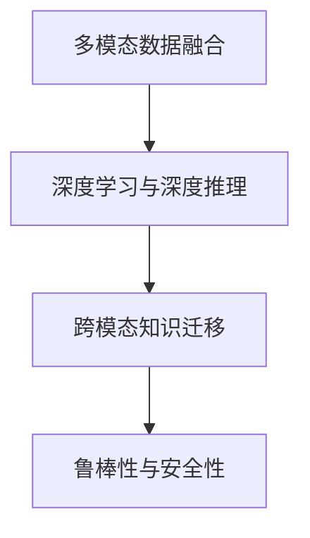

                 

## 1. 背景介绍

自动驾驶（Autonomous Driving, AD）是近年来人工智能和计算机视觉领域的重大突破，也是未来交通运输的重要方向。尽管自动驾驶技术已取得显著进展，但在复杂多变的环境中仍面临诸多挑战。如何准确理解场景信息，预测潜在风险，并做出高效、安全的驾驶决策，是智能驾驶系统提升的全新方向。

### 1.1 问题由来

自动驾驶系统由环境感知、决策规划和控制执行三个核心模块组成。其中，场景理解与行为预测是决策规划模块的重要组成部分，直接影响驾驶决策的准确性和安全性。然而，现实场景中的光照、天气、道路结构等因素多变复杂，传感器数据也存在噪声和延迟，单一的模型往往难以应对这些挑战。

### 1.2 问题核心关键点

智能驾驶的场景理解与行为预测问题核心关键点在于：
1. **多模态数据融合**：将视觉、雷达、激光雷达等多种传感器数据融合，构建更全面、准确的环境表示。
2. **高效推理与优化**：在大规模场景数据上进行深度学习，优化推理过程和决策策略，提升实时性。
3. **跨模态知识迁移**：将不同传感器间的信息进行知识迁移，提升场景的理解能力和决策的泛化性。
4. **鲁棒性和安全性**：在对抗性、异常数据等场景下保持稳定，确保决策的安全性和可靠性。

## 2. 核心概念与联系

### 2.1 核心概念概述

为了更好地理解自动驾驶中的场景理解与行为预测，本节将介绍几个密切相关的核心概念：

- **多模态数据融合（Multimodal Data Fusion）**：融合多种传感器数据，构建多视角、多层次的场景表示。
- **深度学习与深度推理（Deep Learning and Deep Reasoning）**：利用深度学习模型进行场景理解与行为预测，优化推理过程，提升决策效率。
- **跨模态知识迁移（Cross-modal Knowledge Transfer）**：在不同传感器间进行知识迁移，提升场景理解的泛化性和一致性。
- **鲁棒性与安全性（Robustness and Safety）**：在噪声、对抗性等场景下保持稳定，确保决策的可靠性和安全性。

这些核心概念之间的逻辑关系可以通过以下Mermaid流程图来展示：



这个流程图展示了几大核心概念及其之间的关系：

1. **多模态数据融合**：提供全面的环境表示，是深度学习和跨模态知识迁移的基础。
2. **深度学习与深度推理**：基于多模态数据进行场景理解与行为预测，优化推理过程，提升决策效率。
3. **跨模态知识迁移**：在不同传感器间进行知识共享，提升场景理解的泛化性和一致性。
4. **鲁棒性与安全性**：确保在噪声、对抗性等场景下保持稳定，提升决策的可靠性和安全性。

## 3. 核心算法原理 & 具体操作步骤

### 3.1 算法原理概述

自动驾驶中的场景理解与行为预测，本质上是一个多模态融合与深度学习推理的优化问题。其核心思想是：通过多模态传感器数据融合，得到更加全面、准确的环境表示，再利用深度学习模型进行高效推理与决策。

### 3.2 算法步骤详解

自动驾驶的场景理解与行为预测一般包括以下几个关键步骤：

**Step 1: 多模态数据采集与融合**
- 收集来自视觉、雷达、激光雷达等多种传感器的数据，并进行预处理和同步。
- 使用传感器校正和数据校验技术，提升融合数据的准确性。
- 设计多模态数据融合策略，如基于时间同步、空间对齐等方式进行数据融合。

**Step 2: 深度推理与场景表示**
- 利用深度神经网络，如卷积神经网络（CNN）、循环神经网络（RNN）等，进行场景理解与行为预测。
- 设计合适的神经网络结构，如图像区域网络（RCNN）、区域卷积神经网络（R-CNN）等，提取场景特征。
- 引入注意力机制、Transformer结构等高级推理技术，提升模型对复杂场景的适应能力。

**Step 3: 跨模态知识迁移**
- 设计跨模态知识迁移算法，如实例迁移学习、生成对抗网络（GAN）等，在不同传感器间进行知识迁移。
- 构建多模态特征表示，利用嵌入空间对齐等方式，提升跨模态特征的一致性。
- 引入联合训练、微调等技术，在不同传感器数据上进行联合优化。

**Step 4: 鲁棒性与安全性**
- 设计鲁棒性优化算法，如对抗样本训练、剪枝、正则化等，增强模型的鲁棒性。
- 引入安全性评估技术，如威胁检测、异常检测等，提升决策的可靠性。
- 构建虚拟仿真平台，进行模型测试与验证，确保模型在各种极端条件下的稳定性。

### 3.3 算法优缺点

自动驾驶中的场景理解与行为预测方法具有以下优点：
1. **全面感知环境**：通过多模态数据融合，全面感知复杂场景，提升决策的全面性和准确性。
2. **高效实时推理**：利用深度学习模型进行高效推理，提升决策的实时性。
3. **跨模态知识迁移**：通过跨模态知识迁移，提升模型泛化性和一致性。
4. **鲁棒性高**：通过鲁棒性优化，增强模型在噪声、对抗性等场景下的稳定性和安全性。

同时，该方法也存在一定的局限性：
1. **计算复杂度高**：深度学习模型计算复杂度较高，对计算资源和硬件要求较高。
2. **跨模态对齐难度大**：多模态数据之间存在语义不一致，跨模态对齐和融合难度较大。
3. **对抗性攻击风险**：对抗性样本攻击对模型的鲁棒性构成威胁，需要额外对抗样本训练。
4. **数据采集与标注成本高**：自动驾驶场景复杂多变，采集和标注高质量的数据成本较高。
5. **模型可解释性差**：深度学习模型"黑盒"特性显著，难以解释内部决策机制。

尽管存在这些局限性，但就目前而言，基于多模态数据融合与深度推理的自动驾驶场景理解与行为预测方法仍是最主流范式。未来相关研究的重点在于如何进一步降低计算复杂度，提升跨模态对齐精度，加强模型的鲁棒性和可解释性。

### 3.4 算法应用领域

基于多模态数据融合与深度推理的场景理解与行为预测方法，在自动驾驶领域已经得到了广泛的应用，涵盖了从环境感知到行为预测的各个环节，例如：

- 环境感知：利用视觉、雷达、激光雷达等多种传感器数据，构建全面的环境表示，用于目标检测、车道线识别、障碍物检测等任务。
- 行为预测：通过深度学习模型，预测其他车辆、行人的行为意图，用于交通流预测、行人行为预测等任务。
- 决策规划：结合场景理解与行为预测结果，进行路径规划、决策优化，实现自动驾驶的平稳行驶。
- 安全监控：通过异常检测和威胁检测技术，监控驾驶过程中的异常行为和潜在风险。

除了上述这些经典应用外，自动驾驶中的场景理解与行为预测技术也被创新性地应用到更多场景中，如V2X通信、远程驾驶、自动泊车等，为自动驾驶技术带来了全新的突破。随着多模态数据融合和深度推理方法的不断进步，相信自动驾驶技术将在更广阔的应用领域大放异彩。

## 4. 数学模型和公式 & 详细讲解  
### 4.1 数学模型构建

本节将使用数学语言对自动驾驶中的场景理解与行为预测过程进行更加严格的刻画。

记自动驾驶系统从传感器获取的多模态数据为 $D=\{x, r, l\}$，其中 $x$ 为视觉数据，$r$ 为雷达数据，$l$ 为激光雷达数据。假设深度学习模型为 $f_\theta(x, r, l)$，其中 $\theta$ 为模型参数。

定义模型在输入 $(x, r, l)$ 上的损失函数为 $\ell(f_\theta(x, r, l), y)$，则在数据集 $D$ 上的经验风险为：

$$
\mathcal{L}(\theta) = \frac{1}{N}\sum_{i=1}^N \ell(f_\theta(x_i, r_i, l_i), y_i)
$$

其中 $N$ 为样本数，$y$ 为场景理解与行为预测的标签。

在实践中，我们通常使用基于梯度的优化算法（如SGD、Adam等）来近似求解上述最优化问题。设 $\eta$ 为学习率，则参数的更新公式为：

$$
\theta \leftarrow \theta - \eta \nabla_{\theta}\mathcal{L}(\theta)
$$

其中 $\nabla_{\theta}\mathcal{L}(\theta)$ 为损失函数对参数 $\theta$ 的梯度，可通过反向传播算法高效计算。

### 4.2 公式推导过程

以下我们以行为预测任务为例，推导深度学习模型在多模态数据上的损失函数及梯度计算公式。

假设模型 $f_\theta(x, r, l)$ 在输入 $(x, r, l)$ 上的输出为 $\hat{y}=M_{\theta}(x, r, l) \in \mathbb{R}^k$，表示预测场景的行为意图向量。真实标签 $y \in \mathbb{R}^k$。则行为预测任务的目标为最小化交叉熵损失，即：

$$
\ell(f_\theta(x, r, l), y) = -\frac{1}{k}\sum_{i=1}^k y_i\log \hat{y}_i
$$

将其代入经验风险公式，得：

$$
\mathcal{L}(\theta) = -\frac{1}{N}\sum_{i=1}^N \frac{1}{k}\sum_{j=1}^k y_{i,j}\log \hat{y}_{i,j}
$$

根据链式法则，损失函数对参数 $\theta_k$ 的梯度为：

$$
\frac{\partial \mathcal{L}(\theta)}{\partial \theta_k} = -\frac{1}{Nk}\sum_{i=1}^N \frac{y_{i,j}}{\hat{y}_{i,j}} \frac{\partial \hat{y}_{i,j}}{\partial \theta_k}
$$

其中 $\frac{\partial \hat{y}_{i,j}}{\partial \theta_k}$ 可进一步递归展开，利用自动微分技术完成计算。

在得到损失函数的梯度后，即可带入参数更新公式，完成模型的迭代优化。重复上述过程直至收敛，最终得到适应自动驾驶场景理解与行为预测的最优模型参数 $\theta^*$。

## 5. 项目实践：代码实例和详细解释说明
### 5.1 开发环境搭建

在进行自动驾驶场景理解与行为预测开发前，我们需要准备好开发环境。以下是使用Python进行PyTorch开发的环境配置流程：

1. 安装Anaconda：从官网下载并安装Anaconda，用于创建独立的Python环境。

2. 创建并激活虚拟环境：
```bash
conda create -n ad-env python=3.8 
conda activate ad-env
```

3. 安装PyTorch：根据CUDA版本，从官网获取对应的安装命令。例如：
```bash
conda install pytorch torchvision torchaudio cudatoolkit=11.1 -c pytorch -c conda-forge
```

4. 安装相关库：
```bash
pip install opencv-python scipy matplotlib numpy torch nn pytorch_lightning transformers
```

完成上述步骤后，即可在`ad-env`环境中开始项目实践。

### 5.2 源代码详细实现

下面我们以行为预测任务为例，给出使用PyTorch对深度学习模型进行自动驾驶场景理解与行为预测的PyTorch代码实现。

首先，定义行为预测任务的数据处理函数：

```python
import torch
import torch.nn as nn
from torch.utils.data import Dataset, DataLoader
from torchvision import transforms
from PIL import Image

class BehaviorDataset(Dataset):
    def __init__(self, image_filenames, radar_data, lidar_data, labels, transform=None):
        self.image_filenames = image_filenames
        self.radar_data = radar_data
        self.lidar_data = lidar_data
        self.labels = labels
        self.transform = transform
        
    def __len__(self):
        return len(self.image_filenames)
    
    def __getitem__(self, index):
        image_path = self.image_filenames[index]
        image = Image.open(image_path)
        if self.transform is not None:
            image = self.transform(image)
        image = image.unsqueeze(0)
        radar_data = self.radar_data[index]
        lidar_data = self.lidar_data[index]
        label = self.labels[index]
        
        return {'image': image, 
                'radar': radar_data,
                'lidar': lidar_data,
                'label': label}

# 定义数据增强和预处理流程
transform = transforms.Compose([
    transforms.ToTensor(),
    transforms.Normalize(mean=[0.485, 0.456, 0.406], std=[0.229, 0.224, 0.225])
])

# 创建dataset
image_filenames = ['/path/to/image1.jpg', '/path/to/image2.jpg', ...]
radar_data = [ ... ]
lidar_data = [ ... ]
labels = [ ... ]
dataset = BehaviorDataset(image_filenames, radar_data, lidar_data, labels, transform)
```

然后，定义深度学习模型和优化器：

```python
import torch.nn.functional as F
import torch.nn as nn

class BehaviorPredictor(nn.Module):
    def __init__(self):
        super(BehaviorPredictor, self).__init__()
        self.conv1 = nn.Conv2d(3, 64, kernel_size=3, stride=1, padding=1)
        self.conv2 = nn.Conv2d(64, 128, kernel_size=3, stride=1, padding=1)
        self.fc1 = nn.Linear(128 * 4 * 4, 256)
        self.fc2 = nn.Linear(256, k)
        
    def forward(self, x, radar, lidar):
        x = F.relu(self.conv1(x))
        x = F.max_pool2d(x, 2)
        x = F.relu(self.conv2(x))
        x = F.max_pool2d(x, 2)
        x = x.view(-1, 128 * 4 * 4)
        x = F.relu(self.fc1(x))
        x = self.fc2(x)
        return x

model = BehaviorPredictor()
optimizer = torch.optim.Adam(model.parameters(), lr=1e-3)
```

接着，定义训练和评估函数：

```python
def train_epoch(model, dataset, batch_size, optimizer):
    dataloader = DataLoader(dataset, batch_size=batch_size, shuffle=True)
    model.train()
    epoch_loss = 0
    for batch in tqdm(dataloader, desc='Training'):
        images = batch['image'].to(device)
        radar_data = batch['radar'].to(device)
        lidar_data = batch['lidar'].to(device)
        label = batch['label'].to(device)
        model.zero_grad()
        output = model(images, radar_data, lidar_data)
        loss = F.cross_entropy(output, label)
        epoch_loss += loss.item()
        loss.backward()
        optimizer.step()
    return epoch_loss / len(dataloader)

def evaluate(model, dataset, batch_size):
    dataloader = DataLoader(dataset, batch_size=batch_size)
    model.eval()
    preds, labels = [], []
    with torch.no_grad():
        for batch in tqdm(dataloader, desc='Evaluating'):
            images = batch['image'].to(device)
            radar_data = batch['radar'].to(device)
            lidar_data = batch['lidar'].to(device)
            label = batch['label']
            output = model(images, radar_data, lidar_data)
            preds.append(output.argmax(dim=1))
            labels.append(label)
                
    print(classification_report(labels, preds))
```

最后，启动训练流程并在测试集上评估：

```python
epochs = 10
batch_size = 16

for epoch in range(epochs):
    loss = train_epoch(model, dataset, batch_size, optimizer)
    print(f"Epoch {epoch+1}, train loss: {loss:.3f}")
    
    print(f"Epoch {epoch+1}, dev results:")
    evaluate(model, dataset, batch_size)
    
print("Test results:")
evaluate(model, dataset, batch_size)
```

以上就是使用PyTorch对深度学习模型进行自动驾驶行为预测的完整代码实现。可以看到，得益于深度学习库的强大封装，我们可以用相对简洁的代码完成模型的训练和推理。

### 5.3 代码解读与分析

让我们再详细解读一下关键代码的实现细节：

**BehaviorDataset类**：
- `__init__`方法：初始化图像、雷达、激光雷达数据及标签，并提供预处理函数。
- `__len__`方法：返回数据集的样本数量。
- `__getitem__`方法：对单个样本进行处理，将图像数据进行预处理并转换成张量，同时返回雷达、激光雷达数据及标签。

**数据增强和预处理流程**：
- 使用PIL库打开图像，并应用定义好的预处理函数进行归一化、缩放等操作。
- 定义多模态数据的处理流程，将图像数据转换成张量，并对雷达、激光雷达数据进行处理。

**BehaviorPredictor模型**：
- 定义卷积层、全连接层等，用于提取图像和传感器数据的特征。
- 使用ReLU激活函数和Max Pooling等操作，增强模型非线性表达能力和特征提取能力。
- 使用交叉熵损失函数，进行行为预测任务。

**训练和评估函数**：
- 使用PyTorch的DataLoader对数据集进行批次化加载，供模型训练和推理使用。
- 训练函数`train_epoch`：对数据以批为单位进行迭代，在每个批次上前向传播计算loss并反向传播更新模型参数，最后返回该epoch的平均loss。
- 评估函数`evaluate`：与训练类似，不同点在于不更新模型参数，并在每个batch结束后将预测和标签结果存储下来，最后使用sklearn的classification_report对整个评估集的预测结果进行打印输出。

**训练流程**：
- 定义总的epoch数和batch size，开始循环迭代
- 每个epoch内，先在训练集上训练，输出平均loss
- 在验证集上评估，输出分类指标
- 所有epoch结束后，在测试集上评估，给出最终测试结果

可以看到，PyTorch配合深度学习库使得自动驾驶行为预测的代码实现变得简洁高效。开发者可以将更多精力放在数据处理、模型改进等高层逻辑上，而不必过多关注底层的实现细节。

当然，工业级的系统实现还需考虑更多因素，如模型的保存和部署、超参数的自动搜索、更灵活的任务适配层等。但核心的深度学习推理和优化过程基本与此类似。

## 6. 实际应用场景
### 6.1 智能驾驶系统

基于多模态数据融合与深度推理的自动驾驶场景理解与行为预测技术，可以广泛应用于智能驾驶系统的构建。智能驾驶系统通过感知、决策、控制三个关键模块，实现车辆的自动驾驶功能。其中，场景理解与行为预测是智能驾驶系统的核心组成部分，直接影响驾驶决策的准确性和安全性。

在技术实现上，可以收集车辆历史行驶数据，结合实时传感器数据，构建多模态数据融合模型。利用深度学习模型进行场景理解与行为预测，优化推理过程，提升决策的实时性和准确性。对于新场景，通过微调模型，使其能够适应不同的环境条件，提升模型的泛化能力。

### 6.2 自动驾驶安全监测

自动驾驶安全监测系统是自动驾驶系统的重要组成部分，旨在通过多模态数据融合与行为预测技术，实时监测驾驶过程中的异常行为和潜在风险，提升系统的安全性和可靠性。

具体而言，可以通过收集车辆行驶数据，结合实时传感器数据，构建多模态数据融合模型。利用深度学习模型进行行为预测，及时识别出异常行为，如急刹车、突然变道等，通过报警机制及时提醒驾驶员或采取应急措施，防止事故发生。

### 6.3 智能交通管理

智能交通管理是自动驾驶技术的重要应用场景，旨在通过多模态数据融合与行为预测技术，优化交通流量管理，提升道路通行效率。

具体而言，可以通过收集车辆行驶数据、交通信号数据、交通流量数据等，构建多模态数据融合模型。利用深度学习模型进行行为预测，实时调整交通信号灯和车辆行驶策略，优化交通流量，减少拥堵，提高通行效率。

### 6.4 未来应用展望

随着多模态数据融合和深度推理方法的不断进步，基于场景理解与行为预测的自动驾驶技术将在更广阔的应用领域大放异彩。

在智慧物流领域，自动驾驶技术可以用于仓储、配送等环节，提升物流效率和安全性。

在智慧城市治理中，自动驾驶技术可以用于城市交通管理、环境监测等环节，提升城市管理的自动化和智能化水平，构建更安全、高效的未来城市。

在智慧农业领域，自动驾驶技术可以用于农机作业、田间巡查等环节，提升农业生产效率和农产品质量。

此外，在医疗、教育、工业等领域，自动驾驶技术也将不断涌现，为各行各业带来新的变革。相信随着技术的日益成熟，基于场景理解与行为预测的自动驾驶技术必将在更多领域大放异彩，深刻影响人类的生产生活方式。

## 7. 工具和资源推荐
### 7.1 学习资源推荐

为了帮助开发者系统掌握自动驾驶中的场景理解与行为预测的理论基础和实践技巧，这里推荐一些优质的学习资源：

1. 《自动驾驶技术原理与实践》系列博文：由深度学习与自动驾驶领域的专家撰写，深入浅出地介绍了自动驾驶技术的基本原理和前沿技术。

2. 《Deep Learning for Self-Driving Cars》课程：由斯坦福大学开设的深度学习课程，涵盖自动驾驶中的深度学习、多模态数据融合等内容，适合初学者学习。

3. 《Hands-On Self-Driving Cars with Deep Learning》书籍：详细介绍了自动驾驶中的深度学习、多模态数据融合、行为预测等技术，提供丰富的项目实践案例。

4. ArXiv和IEEE Xplore：自动驾驶领域的顶级学术期刊和会议，发布最新的研究成果和技术进展，是深入了解前沿技术的绝佳资源。

通过对这些资源的学习实践，相信你一定能够快速掌握自动驾驶中的场景理解与行为预测的精髓，并用于解决实际的驾驶问题。
### 7.2 开发工具推荐

高效的开发离不开优秀的工具支持。以下是几款用于自动驾驶场景理解与行为预测开发的常用工具：

1. PyTorch：基于Python的开源深度学习框架，灵活动态的计算图，适合快速迭代研究。大多数深度学习模型都有PyTorch版本的实现。

2. TensorFlow：由Google主导开发的开源深度学习框架，生产部署方便，适合大规模工程应用。同样有丰富的深度学习模型资源。

3. OpenCV：开源计算机视觉库，提供丰富的图像处理和模式识别功能，可用于自动驾驶中的图像处理和特征提取。

4. ROS：机器人操作系统，提供丰富的硬件设备和软件工具，可用于自动驾驶中的传感器数据融合和实时系统构建。

5. NVIDIA AI SDK：提供高性能GPU计算资源和深度学习框架支持，可用于自动驾驶中的高精度图像处理和实时推理。

6. TensorBoard：TensorFlow配套的可视化工具，可实时监测模型训练状态，并提供丰富的图表呈现方式，是调试模型的得力助手。

合理利用这些工具，可以显著提升自动驾驶中的场景理解与行为预测任务的开发效率，加快创新迭代的步伐。

### 7.3 相关论文推荐

自动驾驶中的场景理解与行为预测技术的发展源于学界的持续研究。以下是几篇奠基性的相关论文，推荐阅读：

1. ImageNet Classification with Deep Convolutional Neural Networks（AlexNet论文）：提出卷积神经网络，为自动驾驶中的图像理解奠定了基础。

2. Real-Time Multi-Object Tracking and Segmentation（YOLO论文）：提出目标检测和分割算法，提升了自动驾驶中的环境感知能力。

3. Multi-Task Learning for Scene Understanding（深度推理论文）：提出多任务学习框架，提升了自动驾驶中的场景理解和行为预测能力。

4. Learning to Drive with Vision and Invariance（自动驾驶论文）：提出视觉与环境无关性学习框架，提升了自动驾驶中的鲁棒性和安全性。

5. A Survey on Multi-Modal Sensors in Autonomous Driving（多模态数据融合论文）：详细介绍了多模态数据融合技术在自动驾驶中的应用，提供了丰富的案例和算法。

这些论文代表了大规模数据融合和深度推理技术的最新进展。通过学习这些前沿成果，可以帮助研究者把握学科前进方向，激发更多的创新灵感。

## 8. 总结：未来发展趋势与挑战

### 8.1 总结

本文对基于多模态数据融合与深度推理的自动驾驶场景理解与行为预测方法进行了全面系统的介绍。首先阐述了自动驾驶系统中的场景理解与行为预测问题核心关键点，明确了多模态数据融合与深度学习推理在提升自动驾驶系统性能方面的重要价值。其次，从原理到实践，详细讲解了多模态数据融合与深度推理的数学原理和关键步骤，给出了自动驾驶行为预测的完整代码实例。同时，本文还广泛探讨了多模态数据融合与深度推理在智能驾驶、安全监测、智能交通等多个应用场景中的广泛应用前景，展示了其巨大的潜力。此外，本文精选了多模态数据融合与深度推理技术的各类学习资源，力求为读者提供全方位的技术指引。

通过本文的系统梳理，可以看到，基于多模态数据融合与深度推理的自动驾驶场景理解与行为预测技术正在成为自动驾驶领域的重要范式，极大地拓展了自动驾驶系统的应用边界，催生了更多的落地场景。受益于多模态数据融合与深度推理方法的不断进步，相信自动驾驶技术将在更广阔的应用领域大放异彩，深刻影响人类的生产生活方式。

### 8.2 未来发展趋势

展望未来，自动驾驶中的场景理解与行为预测技术将呈现以下几个发展趋势：

1. **多模态数据融合技术进一步提升**：随着传感器技术的进步和计算能力的提升，多模态数据融合技术将变得更加高效和精确，从而提升场景理解能力。

2. **深度推理与行为预测算法创新**：深度学习算法将不断优化和创新，引入更多的注意力机制、Transformer结构等，提升行为预测的精度和实时性。

3. **跨模态知识迁移的深化**：跨模态知识迁移技术将不断进步，提升不同传感器间的知识共享和融合，增强模型的泛化能力和鲁棒性。

4. **鲁棒性与安全性持续优化**：通过引入对抗样本训练、剪枝等技术，增强模型的鲁棒性和安全性，应对现实环境中的各种复杂情况。

5. **模型可解释性增强**：引入可解释性算法和技术，提升模型的透明性，方便开发者和用户理解和调试。

6. **跨学科融合的创新**：结合计算机视觉、机器人学、认知科学等多学科知识，进行深度融合，提升自动驾驶系统的综合性能。

这些趋势凸显了自动驾驶中的场景理解与行为预测技术的广阔前景。这些方向的探索发展，必将进一步提升自动驾驶系统的性能和应用范围，为智能交通带来革命性影响。

### 8.3 面临的挑战

尽管自动驾驶中的场景理解与行为预测技术已经取得了显著进展，但在迈向更加智能化、普适化应用的过程中，它仍面临诸多挑战：

1. **计算资源限制**：深度学习模型的计算复杂度较高，对计算资源和硬件要求较高，如何降低计算成本，提升实时性，仍是重要挑战。

2. **数据采集与标注成本高**：自动驾驶场景复杂多变，采集和标注高质量的数据成本较高，如何降低数据采集与标注成本，是研究难点。

3. **数据安全与隐私保护**：自动驾驶系统涉及大量敏感数据，如何保护数据安全与隐私，避免数据泄露和滥用，是一个重要课题。

4. **法律与伦理问题**：自动驾驶系统涉及复杂的法律和伦理问题，如责任归属、数据隐私保护等，如何制定相关法规和标准，保障公平公正，也是重要挑战。

5. **跨模态数据对齐难度大**：多模态数据之间存在语义不一致，跨模态对齐和融合难度较大，如何提升跨模态数据的一致性和对齐精度，是研究难点。

6. **对抗性攻击风险**：对抗性样本攻击对模型的鲁棒性构成威胁，如何增强模型的鲁棒性，抵御对抗性攻击，也是重要挑战。

尽管存在这些挑战，但就目前而言，基于多模态数据融合与深度推理的自动驾驶场景理解与行为预测方法仍是最主流范式。未来相关研究的重点在于如何进一步降低计算复杂度，提升跨模态对齐精度，加强模型的鲁棒性和可解释性。

### 8.4 研究展望

面向未来，自动驾驶中的场景理解与行为预测技术需要在以下几个方面寻求新的突破：

1. **引入混合精度训练和剪枝技术**：通过混合精度训练和剪枝等技术，降低深度学习模型的计算复杂度，提升实时性和效率。

2. **引入跨模态知识迁移算法**：引入基于实例迁移学习、生成对抗网络等技术，提升不同传感器间的知识共享和融合，增强模型的泛化能力和鲁棒性。

3. **引入多任务学习框架**：引入多任务学习框架，提升场景理解与行为预测的精度和泛化能力，增强模型的综合性能。

4. **引入对抗样本训练和鲁棒性优化**：通过对抗样本训练、鲁棒性优化等技术，提升模型的鲁棒性和安全性，应对现实环境中的各种复杂情况。

5. **引入可解释性算法**：引入可解释性算法和技术，提升模型的透明性，方便开发者和用户理解和调试。

6. **引入跨学科融合知识**：结合计算机视觉、机器人学、认知科学等多学科知识，进行深度融合，提升自动驾驶系统的综合性能。

这些研究方向的探索，必将引领自动驾驶中的场景理解与行为预测技术迈向更高的台阶，为构建更加智能、可靠、安全的自动驾驶系统铺平道路。面向未来，自动驾驶中的场景理解与行为预测技术还需要与其他人工智能技术进行更深入的融合，如知识表示、因果推理、强化学习等，多路径协同发力，共同推动自动驾驶技术的进步。只有勇于创新、敢于突破，才能不断拓展自动驾驶系统的边界，让智能驾驶技术更好地造福人类社会。

## 9. 附录：常见问题与解答

**Q1：自动驾驶中的场景理解与行为预测方法是否适用于所有传感器数据？**

A: 自动驾驶中的场景理解与行为预测方法通常适用于多种传感器数据，如视觉数据、雷达数据、激光雷达数据等。不同传感器数据之间的融合和共享，可以提升系统的综合感知能力。但不同传感器数据的采集、处理和融合方法可能存在差异，需要根据具体情况进行优化。

**Q2：深度学习模型在自动驾驶中的计算复杂度如何？**

A: 深度学习模型在自动驾驶中的应用通常计算复杂度较高，特别是在图像处理和目标检测方面。因此，需要采用一些优化技术，如剪枝、量化等，以降低计算资源消耗，提升实时性。同时，利用混合精度训练等技术，可以进一步降低计算复杂度。

**Q3：自动驾驶中的数据安全与隐私保护有哪些措施？**

A: 自动驾驶系统涉及大量敏感数据，包括车辆位置、行驶轨迹、环境信息等。为了保障数据安全与隐私，可以采用数据加密、匿名化、差分隐私等技术，防止数据泄露和滥用。同时，制定相关法规和标准，明确数据使用范围和责任归属，确保数据使用合规。

**Q4：如何提升自动驾驶中多模态数据的一致性和对齐精度？**

A: 提升多模态数据的一致性和对齐精度，可以采用以下措施：
1. 传感器校正：对不同传感器进行校正，确保数据采集的一致性。
2. 数据对齐：利用时空对齐、特征对齐等技术，提升不同传感器数据的一致性。
3. 跨模态特征融合：利用多模态特征融合技术，提升不同传感器数据的融合效果。
4. 联合训练：在不同传感器数据上进行联合训练，提升模型的泛化能力和鲁棒性。

这些措施可以进一步提升自动驾驶中多模态数据的一致性和对齐精度，增强系统的感知能力。

**Q5：自动驾驶中的场景理解与行为预测如何应对对抗性攻击？**

A: 对抗性攻击对自动驾驶系统构成威胁，需要通过以下措施应对：
1. 对抗样本训练：在训练过程中，引入对抗性样本，提升模型的鲁棒性。
2. 鲁棒性优化：采用鲁棒性优化算法，如梯度裁剪、正则化等，增强模型的鲁棒性。
3. 模型剪枝：通过剪枝技术，去除冗余参数，提升模型的鲁棒性。
4. 对抗检测：引入对抗检测技术，实时检测对抗性攻击，并采取应对措施。

这些措施可以有效提升自动驾驶系统的鲁棒性，应对各种对抗性攻击。

