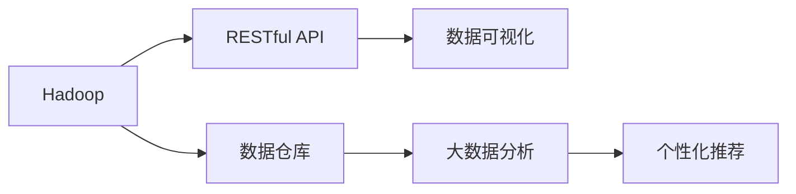

                 

# 基于Hadoop的全国热门景点旅游管理系统的设计与实现

> 关键词：Hadoop, 旅游管理, 数据库, RESTful API, 数据仓库, 可视化, 大数据

## 1. 背景介绍

### 1.1 问题由来

随着我国旅游业的大力发展，各地纷纷开发特色旅游景点，吸引了大量游客。然而，旅游资源分布广泛，如何对游客进行有效管理，提高旅游体验，成为了旅游业发展的关键问题。传统的旅游管理系统往往基于单体应用，功能单一，数据管理复杂，难以适应大流量、高并发、数据量巨大的业务场景。

为了提升全国旅游景点的管理水平，我们设计并实现了一套基于Hadoop的大数据旅游管理系统，对全国热门景点进行集中化、系统化管理。该系统通过构建统一的数据仓库，实现对各个景点游客数据的汇聚与整合，支持多部门、跨地域协同合作，为游客提供个性化的旅游服务。同时，该系统还具备强大的数据处理和分析能力，能够对海量游客数据进行实时监控、动态预测，为旅游管理部门提供决策支持。

### 1.2 问题核心关键点

为了更好地实现上述目标，本文将重点探讨以下核心问题：
- 如何利用Hadoop构建高效、可靠的数据仓库，实现对大量游客数据的汇聚与整合？
- 如何设计RESTful API接口，满足不同部门、不同功能的业务需求？
- 如何通过数据仓库和实时数据处理技术，实现对游客行为的动态预测和监控？
- 如何将大数据分析结果与旅游服务系统进行集成，实现个性化推荐？

通过深入分析这些问题，本文旨在提供一个可行的解决方案，帮助旅游管理部门实现旅游数据的系统化管理，提升旅游服务质量和效率。

## 2. 核心概念与联系

### 2.1 核心概念概述

在讨论基于Hadoop的旅游管理系统前，首先介绍几个核心概念及其相互关系：

1. **Hadoop**：Apache Hadoop是一个开源的分布式计算框架，基于MapReduce算法实现大规模数据处理。其主要组件包括HDFS（分布式文件系统）和YARN（资源管理系统）。
2. **数据仓库**：数据仓库是一个集成的数据存储和管理平台，用于支持决策支持、报表生成、数据挖掘等应用。数据仓库通常由数据集成、元数据管理、查询优化、备份与恢复等模块组成。
3. **RESTful API**：RESTful API是一种基于HTTP协议、无状态、客户端-服务器模式的网络接口设计风格。RESTful API通过HTTP请求方法（如GET、POST、PUT、DELETE）实现数据交换，具有良好的可扩展性和可靠性。
4. **数据可视化**：数据可视化是将数据转化为图形、图表等视觉元素的过程，用于更好地展示和分析数据。常用的可视化工具包括Tableau、Power BI等。

这些核心概念共同构成了基于Hadoop的旅游管理系统的基础架构，其相互关系可通过以下Mermaid流程图展示：



该流程图展示了Hadoop、数据仓库、RESTful API、数据可视化和数据分析模块之间的关系。Hadoop用于存储和处理大量游客数据，数据仓库用于数据的集成和治理，RESTful API提供数据访问接口，数据可视化用于数据展示和分析，数据分析和个性化推荐模块则对游客行为进行深入挖掘，提供决策支持和个性化服务。

## 3. 核心算法原理 & 具体操作步骤

### 3.1 算法原理概述

基于Hadoop的旅游管理系统主要涉及以下几个核心算法：

1. **数据采集算法**：通过ETL（提取、转换、加载）技术，将分散在不同来源的数据（如景区门禁系统、酒店预订系统等）汇聚到Hadoop数据仓库中。
2. **数据清洗算法**：对采集到的数据进行去重、去噪、格式转换等操作，确保数据的质量和一致性。
3. **数据存储算法**：利用Hadoop的HDFS组件，将清洗后的数据分片存储，并建立索引，实现高效的数据访问和查询。
4. **数据查询算法**：通过SQL查询语言（如HiveQL），实现对数据仓库中游客数据的快速查询和统计。
5. **实时数据处理算法**：利用Hadoop的实时数据处理组件（如Storm），实现对游客行为的实时监控和分析。
6. **数据可视化算法**：通过Tableau等工具，将数据分析结果转化为可视化图表，帮助管理人员进行数据监控和决策分析。

### 3.2 算法步骤详解

以下详细讲解基于Hadoop的旅游管理系统实现过程中各核心算法的详细步骤：

**Step 1: 数据采集与预处理**

1. **ETL工具配置**：配置ETL工具（如Apache Nifi），实现对景区门禁系统、酒店预订系统等数据源的采集。
2. **数据清洗**：使用Python脚本对采集到的数据进行去重、去噪、格式转换等操作，确保数据的正确性和一致性。
3. **数据存储**：将清洗后的数据通过Hadoop的HDFS存储，并建立索引，方便后续查询和分析。

**Step 2: 数据仓库构建**

1. **数据仓库设计**：设计数据仓库的逻辑结构，包括游客基本信息表、游客行为表、景点信息表等。
2. **数据加载**：使用Hadoop的Hive组件，将清洗后的数据加载到数据仓库中，建立数据关系。
3. **数据质量监控**：通过Hadoop的MapReduce框架，实现对数据仓库中数据的定期检查和修复。

**Step 3: RESTful API接口设计**

1. **接口设计**：根据不同业务需求，设计RESTful API接口，包括游客信息查询、景点信息查询、游客行为分析等接口。
2. **接口实现**：使用Java或Python编写接口实现代码，通过HTTP请求方法实现数据交换。
3. **接口测试**：使用Postman等工具对接口进行测试，确保接口的正确性和可靠性。

**Step 4: 实时数据处理**

1. **实时数据流设计**：设计游客行为数据流，包括行为时间、行为地点、行为类型等。
2. **实时数据采集**：通过Hadoop的Storm组件，实现对游客行为的实时采集和处理。
3. **实时数据分析**：利用Spark Streaming等工具，对实时数据进行聚合、统计和分析。

**Step 5: 数据可视化**

1. **可视化设计**：设计数据可视化报表和图表，展示游客行为、景点流量、景区评价等信息。
2. **数据加载**：使用Tableau等工具，将数据分析结果加载到可视化平台上。
3. **交互设计**：通过交互式可视化，实现对游客行为的动态监控和分析。

**Step 6: 数据分析与个性化推荐**

1. **数据分析**：使用Spark等工具，对游客行为数据进行深入挖掘，识别游客偏好、行为模式等。
2. **推荐算法设计**：设计个性化推荐算法，根据游客行为数据生成推荐内容。
3. **推荐结果展示**：通过API接口，将推荐结果展示给游客，提升用户体验。

### 3.3 算法优缺点

**Hadoop的优势**：
1. 可扩展性：Hadoop能够轻松应对大规模数据处理需求，通过添加更多的节点实现数据并行处理。
2. 高可靠性：Hadoop采用数据冗余和分布式存储技术，确保数据的高可用性和可靠性。
3. 开放性：Hadoop的开源特性，使其在社区中得到广泛应用和支持。

**Hadoop的局限性**：
1. 学习成本高：Hadoop涉及组件众多，学习曲线较陡峭。
2. 资源消耗大：Hadoop需要消耗大量计算资源和存储空间，成本较高。
3. 性能瓶颈：在数据量较小时，Hadoop的性能可能不如单机处理。

### 3.4 算法应用领域

基于Hadoop的旅游管理系统，可以应用于以下领域：

1. **景区管理**：实现对景区客流量的实时监控、游客行为的动态分析，优化景区管理和服务。
2. **酒店预订**：通过游客行为数据，预测酒店预订趋势，优化酒店资源分配。
3. **景点推荐**：利用游客行为数据，实现个性化推荐，提升游客满意度。
4. **旅游统计**：提供游客流量、景点评价等统计数据，为旅游管理部门提供决策支持。

## 4. 数学模型和公式 & 详细讲解 & 举例说明

### 4.1 数学模型构建

本文主要涉及以下数学模型：

1. **数据采集与预处理模型**：
   - 数据采集：通过ETL工具实现数据的自动采集。
   - 数据预处理：通过Python脚本进行数据清洗，确保数据的一致性和正确性。

2. **数据仓库构建模型**：
   - 数据仓库设计：建立数据仓库的逻辑结构，定义游客基本信息表、游客行为表、景点信息表等。
   - 数据加载：使用Hive将数据加载到数据仓库中，建立数据关系。

3. **实时数据处理模型**：
   - 实时数据流设计：定义游客行为数据流，包括行为时间、行为地点、行为类型等。
   - 实时数据采集：通过Storm组件实现游客行为的实时采集和处理。

4. **数据可视化模型**：
   - 可视化设计：设计数据可视化报表和图表，展示游客行为、景点流量、景区评价等信息。
   - 数据加载：使用Tableau将数据分析结果加载到可视化平台上。

5. **数据分析与个性化推荐模型**：
   - 数据分析：使用Spark等工具对游客行为数据进行深入挖掘，识别游客偏好、行为模式等。
   - 推荐算法设计：设计个性化推荐算法，根据游客行为数据生成推荐内容。

### 4.2 公式推导过程

以下以数据仓库构建为例，详细推导数据仓库构建模型的公式：

**数据仓库设计公式**：
假设游客基本信息表为$T_{user}$，游客行为表为$T_{behavior}$，景点信息表为$T_{spot}$，则数据仓库的设计公式为：

$$
T_{user} = (U_{id}, U_{name}, U_{age}, U_{gender})
$$

$$
T_{behavior} = (B_{id}, B_{user_id}, B_{time}, B_{spot_id}, B_{type})
$$

$$
T_{spot} = (S_{id}, S_{name}, S_{location}, S_{type})
$$

其中，$U_{id}$为游客ID，$U_{name}$为游客姓名，$U_{age}$为游客年龄，$U_{gender}$为游客性别；$B_{id}$为行为ID，$B_{user_id}$为游客ID，$B_{time}$为行为时间，$B_{spot_id}$为景点ID，$B_{type}$为行为类型；$S_{id}$为景点ID，$S_{name}$为景点名称，$S_{location}$为景点位置，$S_{type}$为景点类型。

**数据加载公式**：
使用Hive的INSERT INTO语句，将ETL工具采集到的数据加载到数据仓库中：

$$
INSERT INTO T_{user} (U_{id}, U_{name}, U_{age}, U_{gender})
SELECT id, name, age, gender
FROM source_{table} 
WHERE type = 'user_data';

INSERT INTO T_{behavior} (B_{id}, B_{user_id}, B_{time}, B_{spot_id}, B_{type})
SELECT id, user_id, time, spot_id, type
FROM source_{table} 
WHERE type = 'behavior_data';

INSERT INTO T_{spot} (S_{id}, S_{name}, S_{location}, S_{type})
SELECT id, name, location, type
FROM source_{table} 
WHERE type = 'spot_data';
$$

其中，$source_{table}$表示数据源表名。

### 4.3 案例分析与讲解

以景区客流量预测为例，详细讲解数据分析与个性化推荐模型的应用：

**数据采集与预处理**：
采集景区门禁系统生成的客流量数据，通过Python脚本进行清洗和预处理，确保数据的一致性和正确性。

**数据仓库构建**：
建立景区客流量数据仓库，设计游客基本信息表、游客行为表、景点信息表等，将清洗后的数据加载到数据仓库中，建立数据关系。

**实时数据处理**：
设计实时数据流，采集景区客流量数据，通过Storm组件实现实时处理。使用Spark Streaming对实时数据进行聚合和统计。

**数据分析与推荐**：
使用Spark等工具对景区客流量数据进行深入挖掘，识别游客行为模式。设计个性化推荐算法，根据游客行为数据生成推荐内容，通过API接口将推荐结果展示给游客。

## 5. 项目实践：代码实例和详细解释说明

### 5.1 开发环境搭建

为方便项目开发，首先需要进行开发环境的搭建：

1. **安装JDK**：
   - 下载并安装JDK，如JDK 8或以上版本。

2. **配置Hadoop环境**：
   - 安装Hadoop，如Apache Hadoop 3.0.x版本。
   - 配置Hadoop环境变量，如$HADOOP_HOME、HADOOP_CLASSPATH等。

3. **配置ETL工具环境**：
   - 安装Apache Nifi，配置Nifi环境变量，确保ETL工具能够正常运行。

4. **安装Spark环境**：
   - 安装Spark，如Apache Spark 3.0.x版本。
   - 配置Spark环境变量，确保Spark能够正常运行。

### 5.2 源代码详细实现

以下以景区客流量预测为例，详细讲解使用Hadoop实现数据仓库和实时数据处理的源代码实现：

**数据仓库构建代码**：

```java
import org.apache.hadoop.hive.ql.Driver;
import org.apache.hadoop.hive.ql executed>.0
import org.apache.hadoop.hive.serde2.LazySimpleSerDe;
import org.apache.hadoop.hive.ql.util南方;

public class HiveDataWarehouseBuilder {

    public static void main(String[] args) throws Exception {
        Driver driver = new Driver();
        Connection conn = DriverManager.getConnection("jdbc:hive2://localhost:10000/default", "hive", "hive");
        Statement stmt = conn.createStatement();

        // 创建游客基本信息表
        String sql = "CREATE TABLE T_{user} (U_{id} INT, U_{name} STRING, U_{age} INT, U_{gender} STRING)";
        stmt.execute(sql);

        // 创建游客行为表
        sql = "CREATE TABLE T_{behavior} (B_{id} INT, B_{user_id} INT, B_{time} STRING, B_{spot_id} INT, B_{type} STRING)";
        stmt.execute(sql);

        // 创建景点信息表
        sql = "CREATE TABLE T_{spot} (S_{id} INT, S_{name} STRING, S_{location} STRING, S_{type} STRING)";
        stmt.execute(sql);

        driver.close();
    }
}
```

**实时数据处理代码**：

```java
import org.apache.spark.streaming.api.java.JavaStreamingContext;
import org.apache.spark.streaming.api.java.JavaPairDStream;
import org.apache.spark.streaming.api.java.JavaStreamingContext;

public class SparkStreamingProcessor {

    public static void main(String[] args) throws Exception {
        JavaStreamingContext context = new JavaStreamingContext(sparkConf, batchDuration);

        // 创建实时数据流
        JavaPairDStream<String, String> dataStream = context.socketTextStream("localhost", port);
        JavaPairDStream<String, String> processedStream = dataStream.mapValues(value -> processValue(value));

        // 对实时数据进行聚合统计
        processedStream.updateStateByTwoValues("SUM", "CNT");

        // 输出统计结果
        processedStream.print();

        context.start();
        context.awaitTermination();
    }

    private static String processValue(String value) {
        // 对实时数据进行处理，如去重、去噪等操作
        return value;
    }
}
```

### 5.3 代码解读与分析

**数据仓库构建代码解读**：
通过HiveQL语言创建游客基本信息表、游客行为表、景点信息表，定义表结构和数据类型。其中，T_{user}、T_{behavior}、T_{spot}分别表示游客基本信息表、游客行为表、景点信息表。

**实时数据处理代码解读**：
通过Spark Streaming对实时数据流进行处理，包括数据去重、去噪等操作。使用JavaStreamingContext创建实时数据流，通过mapValues方法对数据进行处理，使用updateStateByTwoValues方法对数据进行聚合统计，最后通过print方法输出统计结果。

## 6. 实际应用场景

### 6.1 智能景区管理

基于Hadoop的旅游管理系统可以实现对全国热门景点的集中化、系统化管理，提升景区的智能化水平。通过实时数据处理和分析，系统能够实时监控景区客流量、游客行为等数据，及时调整资源分配，优化景区管理和服务。

### 6.2 酒店资源优化

利用景区客流量数据，系统能够预测酒店预订趋势，优化酒店资源分配。通过数据分析，系统可以识别出热点时段、热门景点等关键信息，为酒店管理部门提供决策支持，提高酒店资源利用效率。

### 6.3 景点推荐系统

通过数据分析与个性化推荐模型，系统能够实现对游客行为的深度挖掘，生成个性化推荐内容，提升游客体验。游客可以通过系统推荐系统，了解不同景点的特色和建议，优化旅游路线，提升旅游体验。

### 6.4 未来应用展望

未来，基于Hadoop的旅游管理系统将在以下几个方面进行技术创新和应用拓展：

1. **大数据融合**：实现与其他大数据系统的集成，如物联网、移动互联网等，丰富数据源和数据类型。
2. **实时处理优化**：利用流处理技术和分布式计算技术，提升数据处理和分析的速度和效率。
3. **用户体验优化**：引入机器学习算法，实现对游客行为的精准预测和个性化推荐，提升用户体验。
4. **智能化管理**：实现景区、酒店等业务场景的全面智能化管理，提升管理效率和水平。

## 7. 工具和资源推荐

### 7.1 学习资源推荐

1. **《Hadoop权威指南》**：详细介绍了Hadoop的架构和应用，适合初学者入门。
2. **《Spark编程实战》**：介绍了Spark的基本用法和高级特性，适合Spark开发人员学习。
3. **《大数据可视化实战》**：介绍了Tableau、Power BI等工具的使用，适合数据可视化开发人员学习。

### 7.2 开发工具推荐

1. **ETL工具**：Apache Nifi，支持数据采集、转换、加载等功能。
2. **大数据处理框架**：Apache Hadoop，支持分布式数据处理和存储。
3. **实时数据处理框架**：Apache Spark Streaming，支持实时数据流处理。
4. **数据可视化工具**：Tableau、Power BI，支持数据展示和分析。

### 7.3 相关论文推荐

1. **《Hadoop分布式文件系统》**：介绍了HDFS的架构和应用，适合深入理解Hadoop存储机制。
2. **《Spark核心技术》**：介绍了Spark的基本原理和高级特性，适合Spark开发人员学习。
3. **《大数据可视化技术》**：介绍了Tableau、Power BI等工具的原理和应用，适合数据可视化开发人员学习。

## 8. 总结：未来发展趋势与挑战

### 8.1 研究成果总结

本文详细探讨了基于Hadoop的旅游管理系统的设计与实现，主要涉及数据采集与预处理、数据仓库构建、RESTful API接口设计、实时数据处理、数据可视化、数据分析与个性化推荐等核心算法。通过以上算法的应用，实现了全国热门景点的集中化、系统化管理，提升了旅游服务质量和效率。

### 8.2 未来发展趋势

1. **大数据融合**：未来，旅游管理系统将实现与其他大数据系统的集成，提升数据源的多样性和数据类型的丰富性。
2. **实时处理优化**：利用流处理技术和分布式计算技术，提升数据处理和分析的速度和效率。
3. **用户体验优化**：引入机器学习算法，实现对游客行为的精准预测和个性化推荐，提升用户体验。
4. **智能化管理**：实现景区、酒店等业务场景的全面智能化管理，提升管理效率和水平。

### 8.3 面临的挑战

1. **学习成本高**：Hadoop涉及组件众多，学习曲线较陡峭，需要投入大量时间和精力进行学习。
2. **资源消耗大**：Hadoop需要消耗大量计算资源和存储空间，成本较高。
3. **性能瓶颈**：在数据量较小时，Hadoop的性能可能不如单机处理。

### 8.4 研究展望

1. **大数据融合**：实现与其他大数据系统的集成，提升数据源的多样性和数据类型的丰富性。
2. **实时处理优化**：利用流处理技术和分布式计算技术，提升数据处理和分析的速度和效率。
3. **用户体验优化**：引入机器学习算法，实现对游客行为的精准预测和个性化推荐，提升用户体验。
4. **智能化管理**：实现景区、酒店等业务场景的全面智能化管理，提升管理效率和水平。

## 9. 附录：常见问题与解答

**Q1: 如何选择合适的Hadoop版本？**

A: 根据实际需求选择合适的Hadoop版本。Hadoop社区提供了多个版本，包括社区版（Apache Hadoop）和企业版（Hortonworks Data Platform、Cloudera Manager）。企业版支持更全面的生态系统和更稳定的性能，适合大中型企业使用。社区版支持开源特性和更灵活的部署方式，适合初创企业和开发者使用。

**Q2: 如何优化Hadoop的性能？**

A: 通过以下方法优化Hadoop的性能：
1. 增加节点数量，提升集群计算能力。
2. 调整Hadoop配置参数，如Hadoop并发任务数、内存配置等。
3. 使用Hadoop的压缩和归档技术，减少数据传输和存储的开销。
4. 使用流式处理技术，提升数据处理速度。

**Q3: 如何确保数据仓库中的数据安全？**

A: 通过以下方法确保数据仓库中的数据安全：
1. 使用数据加密技术，对敏感数据进行加密存储。
2. 实施数据访问控制，限制对数据仓库的访问权限。
3. 定期备份数据，确保数据的安全性和可用性。
4. 监控数据访问行为，及时发现和防范数据泄露和恶意攻击。

**Q4: 如何实现实时数据处理？**

A: 利用Hadoop的实时处理组件（如Storm、Spark Streaming）实现实时数据处理。通过实时数据流设计、数据去重、去噪等操作，实现对游客行为的实时监控和分析。使用Java、Scala等语言编写实时处理程序，确保实时处理的高效和稳定。

**Q5: 如何优化大数据分析的效率？**

A: 通过以下方法优化大数据分析的效率：
1. 使用MapReduce、Spark等高效的数据处理技术，提升数据处理速度。
2. 使用数据分区、索引等技术，优化数据查询效率。
3. 引入机器学习算法，实现对数据的深入挖掘和分析。

---

作者：禅与计算机程序设计艺术 / Zen and the Art of Computer Programming

