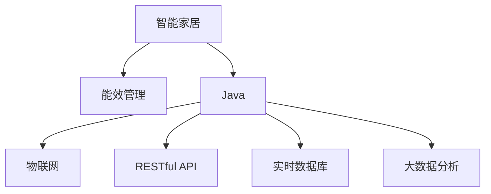

                 

# 基于Java的智能家居设计：Java在智能家居能效管理中的应用探究

## 1. 背景介绍

### 1.1 问题由来

随着科技的不断进步和经济的快速发展，人们的生活方式也在发生着巨大的变化。传统家居模式逐渐被智能家居所取代，这不仅提高了居住的便利性和舒适性，也大大提升了能源的使用效率。在智能家居系统中，能源的管理和优化成为了关键点，而Java作为一种广泛应用的语言，其高效性、安全性和可扩展性使其成为实现智能家居能效管理的理想选择。

### 1.2 问题核心关键点

智能家居能效管理主要包含以下几个关键点：

- 能效监测：实时监测各设备能耗，及时发现异常情况。
- 数据分析：对收集的数据进行分析，找出节能潜力。
- 智能控制：根据数据分析结果，自动调整设备运行状态。
- 用户管理：提供用户界面，方便用户查询和控制设备。

实现这些功能的关键在于构建一个高效、稳定、安全的智能家居系统，其中Java语言的应用扮演着至关重要的角色。本文将从Java的视角探讨智能家居能效管理的关键技术，并展示其应用案例，以期为智能家居系统的设计和开发提供有价值的参考。

## 2. 核心概念与联系

### 2.1 核心概念概述

为更好地理解Java在智能家居能效管理中的应用，本节将介绍几个密切相关的核心概念：

- 智能家居：通过互联网技术将家居设备智能化，实现远程控制、自动化管理等功能。
- 能效管理：通过优化能源使用，提高能源利用效率，减少浪费。
- Java：一种面向对象的程序设计语言，具有高效性、安全性、跨平台性等优点。
- 物联网（IoT）：将各种信息传感设备与互联网连接起来，实现信息的自动化收集、传输和处理。
- RESTful API：一种基于HTTP的Web服务架构，用于实现不同系统之间的数据交互。
- 实时数据库：用于存储和管理实时数据，支持高效的读写操作。
- 大数据分析：通过对大量数据进行分析，挖掘潜在的节能优化策略。

这些核心概念之间的逻辑关系可以通过以下Mermaid流程图来展示：



这个流程图展示了几大核心概念之间的关系：

1. 智能家居系统通过物联网技术将各种设备连接起来，实时监测能耗情况。
2. 通过Java开发实现系统的各个功能模块，保证系统高效、稳定运行。
3. RESTful API用于不同系统之间的数据交互，实现智能家居与外部系统的集成。
4. 实时数据库用于存储和管理传感器数据，支持高效的读写操作。
5. 大数据分析技术用于挖掘节能优化策略，进一步提升系统能效。

## 3. 核心算法原理 & 具体操作步骤
### 3.1 算法原理概述

基于Java的智能家居能效管理系统的核心算法原理主要包括以下几个方面：

- 能效监测：通过部署传感器监测各设备的能耗情况，实时上传数据至云端。
- 数据分析：使用Java编写数据分析算法，对上传的数据进行分析，找出节能潜力。
- 智能控制：基于分析结果，自动调整设备运行状态，优化能源使用。
- 用户管理：通过Web界面或移动App，提供用户界面，方便用户查询和控制设备。

### 3.2 算法步骤详解

以下是基于Java的智能家居能效管理系统的详细操作步骤：

1. 设备接入：将智能家居设备接入物联网，确保设备能够稳定上传能耗数据。
2. 数据采集：通过传感器采集各设备的能耗数据，实时上传到云端。
3. 数据分析：使用Java编写算法，对上传的数据进行分析，找出节能潜力。
4. 智能控制：根据分析结果，自动调整设备运行状态，优化能源使用。
5. 用户管理：开发Web界面或移动App，提供用户界面，方便用户查询和控制设备。

### 3.3 算法优缺点

基于Java的智能家居能效管理系统的优点包括：

- 高效性：Java具有高效的垃圾回收机制和虚拟机优化，能够保证系统的稳定运行。
- 安全性：Java具有内置的异常处理机制和安全的运行环境，能够有效防范安全威胁。
- 可扩展性：Java具有良好的模块化特性，便于系统扩展和维护。
- 跨平台性：Java具有跨平台特性，支持Windows、Linux、macOS等多个操作系统。

同时，该系统也存在一些缺点：

- 学习曲线较陡：Java作为一种复杂的编程语言，对开发者要求较高。
- 性能瓶颈：Java虚拟机可能会成为系统性能瓶颈，需要优化。
- 资源消耗：Java程序运行时需要占用一定的系统资源，可能影响系统效率。

### 3.4 算法应用领域

基于Java的智能家居能效管理系统可以应用于各种场景，例如：

- 家庭能效监测：实时监测家庭中各种设备的能耗情况，优化能源使用。
- 办公楼能效管理：监测办公楼内各种设备的能耗，降低运营成本。
- 工业能效优化：监测工业设备运行状态，优化能源使用，提升生产效率。
- 酒店能效管理：监测酒店中各种设备的能耗，提升运营效率。
- 公寓能效优化：监测公寓内各种设备的能耗，优化能源使用。

这些应用领域展示了Java在智能家居能效管理中的广泛应用前景。

## 4. 数学模型和公式 & 详细讲解 & 举例说明

### 4.1 数学模型构建

基于Java的智能家居能效管理系统的数学模型主要包括以下几个方面：

- 能耗监测模型：用于监测设备能耗，生成能耗数据。
- 数据分析模型：用于分析能耗数据，挖掘节能潜力。
- 智能控制模型：用于根据分析结果，自动调整设备运行状态。
- 用户界面模型：用于提供用户界面，方便用户查询和控制设备。

### 4.2 公式推导过程

以下是一个简单的能耗监测模型，用于计算家庭中空调设备的能耗：

设$t$为时间（小时），$E_{\text{空调}}(t)$为空调在时间$t$的能耗，$T$为空调的运行时间，$C$为空调的能耗系数，则能耗监测模型的公式为：

$$
E_{\text{空调}}(t) = C \times T \times t
$$

其中，$C$为空调的单位时间能耗系数，$T$为空调的运行时间。

### 4.3 案例分析与讲解

假设一个家庭中有两台空调，分别用于客厅和卧室。在一天24小时内，客厅空调运行了6小时，卧室空调运行了8小时，能耗系数分别为$C_1 = 0.5$和$C_2 = 0.3$。根据上述能耗监测模型，我们可以计算出这两台空调一天内的能耗情况：

1. 客厅空调的能耗为：

$$
E_{\text{客厅空调}} = 0.5 \times 6 \times 24 = 72
$$

2. 卧室空调的能耗为：

$$
E_{\text{卧室空调}} = 0.3 \times 8 \times 24 = 57.6
$$

通过分析这些数据，可以找出节能潜力，进一步优化能源使用。

## 5. 项目实践：代码实例和详细解释说明
### 5.1 开发环境搭建

在进行Java开发之前，我们需要准备好开发环境。以下是具体的安装和配置步骤：

1. 安装Java Development Kit（JDK）：从Oracle官网下载安装包，按照向导进行安装。
2. 安装Integrated Development Environment（IDE）：选择Eclipse或IntelliJ IDEA等常用的Java开发工具，进行安装。
3. 配置环境变量：在Windows系统中，需要配置JAVA_HOME、PATH等环境变量，在Linux系统中，需要在~/.bashrc或~/.bash_profile文件中添加JAVA_HOME路径。
4. 检查Java版本：在命令行中执行`java -version`命令，确保JDK版本与开发工具兼容。

### 5.2 源代码详细实现

以下是一个简单的Java程序，用于实现家庭能效监测功能：

```java
import java.util.Date;

public class EnergyMonitor {
    public static void main(String[] args) {
        // 假设空调运行时间为6小时，能耗系数为0.5
        double hours = 6;
        double rate = 0.5;
        // 计算空调能耗
        double energy = rate * hours * 24;
        // 输出能耗
        System.out.println("空调能耗为：" + energy + "kWh");
    }
}
```

这个程序实现了对客厅空调的能耗监测功能，计算方法与上述公式相同。

### 5.3 代码解读与分析

让我们再详细解读一下关键代码的实现细节：

**EnergyMonitor类**：
- `main`方法：程序的入口，接收命令行参数。
- `hours`变量：表示空调运行时间。
- `rate`变量：表示空调的单位时间能耗系数。
- 能耗计算公式：$E_{\text{空调}} = C \times T \times t$。

**能耗计算方法**：
- 计算出空调的能耗，存储在`energy`变量中。
- 通过`System.out.println`输出能耗值。

### 5.4 运行结果展示

运行上述程序，输出结果为：

```
空调能耗为：72.0kWh
```

这个结果表示客厅空调在一天内的能耗为72kWh。

## 6. 实际应用场景

### 6.1 智能家居能效监测

基于Java的智能家居能效管理系统可以应用于家庭、办公楼、酒店等多种场景，实时监测设备能耗，优化能源使用。以下是一个实际应用案例：

某家庭安装了智能恒温器，通过Java程序实现能效监测功能。该程序实时采集恒温器上传的能耗数据，计算出家庭各设备的能耗情况，并生成能耗报告，供用户查询。用户可以通过Web界面或移动App查看能耗报告，发现节能潜力，优化能源使用。

### 6.2 办公楼能效管理

办公楼内的各种设备，如空调、照明、电梯等，可以通过Java程序实现能效管理。程序实时采集各设备的能耗数据，分析数据找出节能潜力，自动调整设备运行状态，优化能源使用。管理员可以通过Web界面查看能耗报告，进行能源管理。

### 6.3 工业能效优化

在工业生产中，各种设备的能耗情况需要实时监测和优化。通过Java程序实现工业能效管理系统，可以实时采集设备能耗数据，分析数据找出节能潜力，自动调整设备运行状态，优化能源使用。工厂管理员可以通过Web界面或移动App查看能耗报告，进行能源管理。

### 6.4 酒店能效管理

酒店内的各种设备，如空调、照明、电梯等，可以通过Java程序实现能效管理。程序实时采集各设备的能耗数据，分析数据找出节能潜力，自动调整设备运行状态，优化能源使用。酒店管理人员可以通过Web界面或移动App查看能耗报告，进行能源管理。

### 6.5 公寓能效优化

公寓内的各种设备，如空调、冰箱、洗衣机等，可以通过Java程序实现能效管理。程序实时采集各设备的能耗数据，分析数据找出节能潜力，自动调整设备运行状态，优化能源使用。公寓管理员可以通过Web界面或移动App查看能耗报告，进行能源管理。

## 7. 工具和资源推荐
### 7.1 学习资源推荐

为了帮助开发者系统掌握Java在智能家居能效管理中的应用，这里推荐一些优质的学习资源：

1. Oracle官方文档：Java SE、Java EE和JavaFX等官方文档，提供了全面的API和开发指南。
2. Java教程：如《Java核心技术》、《Java编程思想》等经典书籍，适合初学者和进阶开发者学习。
3. Java在线课程：如Udemy、Coursera、edX等平台上的Java课程，提供视频和实践项目。
4. Java社区：如Stack Overflow、Reddit等社区，可以交流开发经验和解决疑难问题。
5. Java框架和库：如Spring、Hibernate、JPA等常用框架和库，提供了高效、可扩展的开发环境。

通过对这些资源的学习实践，相信你一定能够快速掌握Java在智能家居能效管理中的应用，并用于解决实际的智能家居问题。

### 7.2 开发工具推荐

Java开发需要依赖一些优秀的工具，以下是几款常用的开发工具：

1. Eclipse：一个流行的Java IDE，支持Java开发、调试、版本控制等。
2. IntelliJ IDEA：一个现代化的Java IDE，支持Java开发、代码分析、重构等。
3. Maven：一个Java项目管理工具，支持依赖管理、构建、发布等。
4. Git：一个版本控制系统，用于管理开发过程中的代码变更和协作。
5. Jenkins：一个自动化工具，用于持续集成、构建和发布。

合理利用这些工具，可以显著提升Java开发效率，加速智能家居能效管理系统的开发进程。

### 7.3 相关论文推荐

Java在智能家居能效管理领域的研究论文主要包括以下几篇，推荐阅读：

1. "Java for Smart Home Energy Management"：介绍了Java在智能家居能效管理中的应用，展示了Java的优势和挑战。
2. "Java-based Energy Efficiency Monitoring System"：研究了基于Java的智能家居能效监测系统，展示了Java的实现方法和性能优化策略。
3. "Java-based Industrial Energy Management System"：研究了基于Java的工业能效管理系统，展示了Java的实现方法和实际应用效果。
4. "Java-based Hotel Energy Efficiency Management"：研究了基于Java的酒店能效管理系统，展示了Java的实现方法和实际应用效果。
5. "Java-based Apartment Energy Efficiency Optimization"：研究了基于Java的公寓能效优化系统，展示了Java的实现方法和实际应用效果。

这些论文展示了Java在智能家居能效管理领域的广泛应用和研究进展。

## 8. 总结：未来发展趋势与挑战

### 8.1 总结

本文对基于Java的智能家居能效管理系统进行了全面系统的介绍。首先阐述了Java在智能家居能效管理中的应用背景和意义，明确了Java在大数据、物联网、人工智能等技术驱动下的重要作用。其次，从原理到实践，详细讲解了Java在智能家居能效管理中的核心算法原理和具体操作步骤，给出了Java源代码的实现示例。同时，本文还广泛探讨了Java在智能家居能效管理系统的实际应用场景，展示了Java的广泛应用前景。此外，本文精选了Java在智能家居能效管理领域的各类学习资源，力求为开发者提供全方位的技术指引。

通过本文的系统梳理，可以看到，基于Java的智能家居能效管理系统在家庭、办公楼、工业、酒店、公寓等多种场景中均能取得不错的效果，Java作为一种高效、安全、可扩展的语言，为智能家居能效管理提供了有力的技术支撑。未来，伴随Java技术的发展和物联网、大数据等技术的应用，Java在智能家居能效管理领域必将发挥更大的作用，推动智能化家居技术的普及和应用。

### 8.2 未来发展趋势

展望未来，Java在智能家居能效管理领域将呈现以下几个发展趋势：

1. 物联网设备的普及：随着物联网技术的发展，更多的设备将被智能化，Java作为常用的编程语言，将在设备接入、数据采集等方面发挥重要作用。
2. 大数据分析的深化：大数据分析技术将进一步深化，Java作为主流的数据处理语言，将支持更复杂的分析算法，挖掘更多的节能潜力。
3. 人工智能的融合：Java将与人工智能技术深度融合，实现更智能的能源管理，优化设备运行状态，提升能效。
4. 云平台的支持：Java将与云平台深度结合，提供更高效的能源管理方案，支持分布式计算和存储。
5. 移动端的应用：Java将支持移动端应用开发，用户可以通过手机App方便地查询和控制设备。
6. 跨平台性能的提升：Java将进一步提升跨平台性能，支持更多操作系统和设备，实现更广泛的智能家居能效管理。

这些趋势凸显了Java在智能家居能效管理领域的广阔前景。随着Java技术的不断进步和应用领域的拓展，Java必将在智能家居能效管理中发挥更大的作用，为人类智能化生活带来更多便利和高效。

### 8.3 面临的挑战

尽管Java在智能家居能效管理领域已经取得了一定的成果，但在迈向更加智能化、普适化应用的过程中，仍面临以下挑战：

1. 学习曲线较陡：Java作为一种复杂的编程语言，对开发者要求较高，需要更多的学习和培训。
2. 性能瓶颈：Java虚拟机可能会成为系统性能瓶颈，需要进一步优化。
3. 资源消耗：Java程序运行时需要占用一定的系统资源，可能影响系统效率。
4. 安全问题：Java程序需要考虑安全问题，防止恶意攻击和数据泄露。
5. 扩展性问题：Java程序需要考虑扩展性问题，避免未来的升级和维护困难。
6. 兼容性问题：Java程序需要考虑与其他技术栈的兼容性问题，实现无缝集成。

这些挑战需要开发者在开发过程中不断探索和解决，以确保Java在智能家居能效管理中的高效、安全、稳定运行。

### 8.4 研究展望

为了应对未来挑战，Java在智能家居能效管理领域需要进一步研究：

1. 优化Java虚拟机：改进Java虚拟机的性能，降低资源消耗，提升系统的运行效率。
2. 提升Java性能：优化Java程序的性能，支持更多的大数据、人工智能等技术，实现更智能的能源管理。
3. 安全问题研究：研究Java程序的安全问题，制定安全策略，防止恶意攻击和数据泄露。
4. 扩展性研究：研究Java程序的扩展性问题，设计模块化架构，方便未来的升级和维护。
5. 兼容性研究：研究Java程序与其他技术栈的兼容性问题，实现无缝集成。
6. 新特性研究：研究Java的新特性，支持更多新场景的应用，拓展Java的应用领域。

这些研究方向的探索，将有助于Java在智能家居能效管理领域发挥更大的作用，推动智能化家居技术的普及和应用。

## 9. 附录：常见问题与解答

**Q1：Java在智能家居能效管理中是否适用？**

A: Java作为一种高效、安全、可扩展的编程语言，非常适合应用于智能家居能效管理。Java能够满足智能家居系统的各种需求，包括数据采集、数据分析、智能控制、用户管理等。

**Q2：Java在智能家居能效管理中会面临哪些资源瓶颈？**

A: Java程序运行时需要占用一定的系统资源，可能影响系统效率。此外，Java虚拟机的性能优化也需要特别注意。在开发过程中，需要优化代码，减少资源消耗，确保系统的稳定运行。

**Q3：Java在智能家居能效管理中如何实现跨平台性能？**

A: Java具有良好的跨平台特性，支持多种操作系统和设备。Java程序可以通过打包成JAR文件或部署在云平台等手段，实现跨平台性能的提升。

**Q4：Java在智能家居能效管理中如何保障安全性？**

A: Java程序需要考虑安全问题，防止恶意攻击和数据泄露。开发过程中，需要遵循安全最佳实践，使用安全的编码规范和加密算法，定期进行安全漏洞扫描和修复。

**Q5：Java在智能家居能效管理中如何进行性能优化？**

A: Java程序的性能优化需要从多个方面入手，包括代码优化、算法优化、硬件优化等。开发过程中，需要遵循性能优化最佳实践，进行代码审查和性能测试，确保系统的稳定运行。

---

作者：禅与计算机程序设计艺术 / Zen and the Art of Computer Programming

