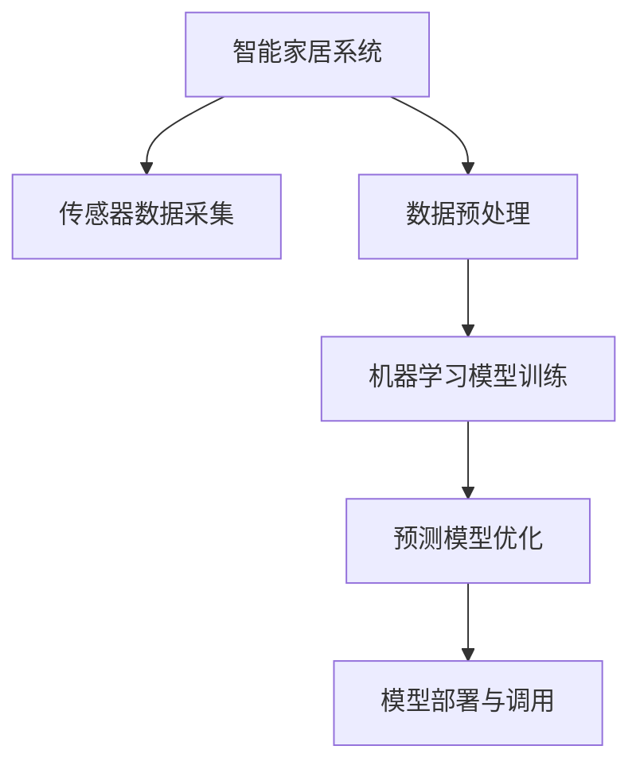

                 

# 基于Java的智能家居设计：结合Java和机器学习优化智能家居预测准确度

> 关键词：智能家居,Java,机器学习,预测模型,准确度优化

## 1. 背景介绍

随着科技的进步和人们对生活质量的追求，智能家居系统已经成为现代家庭生活的重要组成部分。智能家居系统通过传感器、控制中心和执行器等设备，实现对家庭环境的智能感知和控制，极大地提升了生活便利性和舒适度。

近年来，机器学习在智能家居领域的应用日益广泛，通过分析和预测家庭环境数据，如温度、湿度、光照、空气质量等，智能家居系统能够更精准地调控环境，提高能源利用效率，降低运行成本。然而，预测模型的准确度一直是制约智能家居系统应用的重要因素。本文将从Java编程的角度出发，探讨如何通过Java结合机器学习技术，优化智能家居预测模型的准确度。

## 2. 核心概念与联系

### 2.1 核心概念概述

为更好地理解基于Java的智能家居设计，本节将介绍几个关键概念：

- **智能家居系统**：指通过传感器、控制中心和执行器等设备，实现对家庭环境的智能感知和控制的系统。
- **机器学习**：指通过数据训练，使计算机系统具备对数据进行学习、推理和预测的能力。
- **预测模型**：指通过历史数据训练得到的，能够对未来情况进行预测的模型。
- **Java编程语言**：一种广泛应用于企业级应用开发的面向对象编程语言，具有高效的性能和强大的生态系统。
- **数据处理**：指通过数据清洗、特征工程等技术，将原始数据转换为适合模型训练的形式。
- **模型训练与调优**：指通过选择适当的模型、优化模型参数，提高模型预测准确度的过程。

这些概念之间的逻辑关系可以通过以下Mermaid流程图来展示：



这个流程图展示出智能家居系统的工作流程：传感器数据采集、数据预处理、模型训练与调优，以及模型部署与调用。

## 3. 核心算法原理 & 具体操作步骤
### 3.1 算法原理概述

基于Java的智能家居预测模型优化，本质上是一个数据驱动的机器学习过程。其核心思想是：通过传感器数据采集、数据预处理，训练得到预测模型，利用Java编程语言实现模型部署和调用，并结合模型调优策略，不断优化预测准确度。

形式化地，假设传感器采集的数据集为 $D=\{(x_i,y_i)\}_{i=1}^N$，其中 $x_i$ 为环境特征向量，$y_i$ 为期望的预测结果。预测模型的目标是通过学习历史数据，构建一个映射函数 $f$，使得 $f(x_i)$ 尽可能接近 $y_i$。

Java结合机器学习优化的具体步骤包括：

1. 传感器数据采集与预处理。
2. 选择适当的机器学习算法和模型。
3. 使用Java实现模型训练与调优。
4. 部署优化后的模型，并进行实际预测。

### 3.2 算法步骤详解

以下是基于Java的智能家居预测模型优化的详细步骤：

**Step 1: 传感器数据采集与预处理**

智能家居系统通过传感器采集家庭环境数据，如温度、湿度、光照、空气质量等。数据的预处理包括数据清洗、特征工程等步骤，将原始数据转换为适合模型训练的形式。

**Step 2: 选择机器学习算法与模型**

根据具体预测任务，选择合适的机器学习算法和模型。常见的算法包括线性回归、决策树、随机森林、深度学习等。对于智能家居应用，常用的模型包括支持向量机(SVM)、K近邻(KNN)、神经网络等。

**Step 3: 使用Java实现模型训练与调优**

使用Java语言实现模型的训练与调优。Java提供了丰富的机器学习库和框架，如Weka、TensorFlow、 Deeplearning4j等，方便开发者进行模型训练和优化。在训练过程中，需要设置适当的超参数，如学习率、正则化强度等，使用交叉验证等技术进行模型选择和调优。

**Step 4: 部署优化后的模型**

将优化后的模型部署到智能家居控制系统中，通过Java语言实现模型的调用和推理。Java的应用程序接口(API)方便与各种设备和系统集成，实现实时预测和控制。

**Step 5: 实际预测与反馈**

在智能家居系统中，使用部署好的模型进行实际预测，输出环境控制指令，并通过传感器收集反馈，验证预测的准确度。根据反馈结果，调整模型参数，进一步优化预测性能。

### 3.3 算法优缺点

基于Java的智能家居预测模型优化方法具有以下优点：

- **跨平台支持**：Java语言的跨平台特性使得智能家居系统可以在不同的硬件和操作系统上稳定运行。
- **丰富的生态系统**：Java具有庞大的开发社区和丰富的机器学习库，可以快速实现模型训练和调优。
- **灵活的模型选择**：Java支持多种机器学习算法和模型，可以根据具体任务选择最适合的模型。
- **高效的预测性能**：Java虚拟机的高效性能和垃圾回收机制，使得预测模型能够快速响应和计算。

同时，该方法也存在一定的局限性：

- **学习曲线陡峭**：Java编程语言的学习曲线相对陡峭，需要一定的Java编程基础。
- **资源消耗**：Java程序的资源消耗相对较大，尤其是内存和计算资源。
- **扩展性问题**：Java应用程序的扩展性和维护性存在挑战，特别是在系统规模较大时。

尽管存在这些局限性，但Java结合机器学习的方法在智能家居领域的应用仍然具有显著优势，特别是在大型企业级应用中。

### 3.4 算法应用领域

基于Java的智能家居预测模型优化方法在多个领域得到了应用，例如：

- 温度控制：通过预测室内温度，智能家居系统能够自动调整空调或暖气的工作状态。
- 光照调节：根据环境光照水平，智能家居系统能够自动调节窗帘和灯光，营造舒适的室内环境。
- 空气质量监测：通过预测空气质量指标，智能家居系统能够控制新风系统和空气净化器的工作状态。
- 能源管理：智能家居系统通过预测家庭能源消耗，优化能源使用，降低运行成本。

除了上述这些应用外，Java结合机器学习的方法还可以应用于更多场景中，如水资源管理、安全监控、健康管理等，为智能家居系统的全面升级提供新的技术支持。

## 4. 数学模型和公式 & 详细讲解  
### 4.1 数学模型构建

本节将使用数学语言对基于Java的智能家居预测模型进行更加严格的刻画。

记传感器采集的数据集为 $D=\{(x_i,y_i)\}_{i=1}^N, x_i \in \mathbb{R}^n, y_i \in \mathbb{R}$。假设选择的机器学习模型为 $f$，其中 $f(x_i)$ 表示模型在输入 $x_i$ 下的预测结果。

目标是最小化预测误差，即：

$$
\min_{f} \sum_{i=1}^N \ell(f(x_i), y_i)
$$

其中 $\ell$ 为预测误差函数，如均方误差(MSE)、交叉熵损失等。

### 4.2 公式推导过程

以下以线性回归模型为例，推导其优化过程。

假设线性回归模型为：

$$
f(x) = \theta^T x
$$

其中 $\theta$ 为模型参数，$x \in \mathbb{R}^n$ 为环境特征向量。

目标是最小化均方误差：

$$
\min_{\theta} \sum_{i=1}^N (y_i - \theta^T x_i)^2
$$

目标函数的梯度为：

$$
\nabla_{\theta} \mathcal{L}(\theta) = -2\sum_{i=1}^N (y_i - \theta^T x_i)x_i
$$

根据梯度下降算法，模型参数的更新公式为：

$$
\theta \leftarrow \theta - \eta \nabla_{\theta} \mathcal{L}(\theta)
$$

其中 $\eta$ 为学习率。

### 4.3 案例分析与讲解

考虑智能家居系统中的温度控制问题。假设传感器采集了过去一个月每天的室内温度和室外温度，以及当天使用的空调功率。目标是根据这些历史数据，预测未来一天的温度变化趋势，并据此调整空调功率，保持室内温度的稳定。

通过Java实现线性回归模型，选择均方误差作为损失函数，使用梯度下降算法进行优化。最终模型输出温度预测结果和建议的空调功率调整值。系统根据预测结果和实际反馈，不断调整模型参数，提高预测准确度。

## 5. 项目实践：代码实例和详细解释说明
### 5.1 开发环境搭建

在进行Java结合机器学习的智能家居预测模型实践前，我们需要准备好开发环境。以下是Java编程环境搭建的详细步骤：

1. 安装Java开发工具包(JDK)：从Oracle官网下载并安装JDK，包括Java运行环境(JRE)和Java开发工具(JDK)。
2. 安装IDE：如IntelliJ IDEA、Eclipse等，建议选择IntelliJ IDEA，其集成开发环境较为友好，提供了丰富的插件和库。
3. 配置Maven：作为Java项目的构建工具，Maven可以管理项目依赖和构建过程。下载并安装Maven，并在IDE中配置Maven。
4. 安装Weka库：Weka是一个广泛使用的机器学习库，提供了丰富的数据预处理和模型训练工具。在IDE中安装Weka库。

完成上述步骤后，即可在IDE中开始Java结合机器学习的智能家居预测模型开发。

### 5.2 源代码详细实现

以下是Java结合机器学习优化智能家居预测模型的源代码实现：

```java
import weka.core.Instances;
import weka.core.converters.ArffSaver;
import weka.filters.Filter;
import weka.classifiers.trees.J48;
import weka.core.Attribute;
import weka.core.converters.ConverterUtils.DataSource;
import weka.classifiers.Evaluation;
import weka.classifiers.trees.J48;
import weka.core.FastVector;

public class SmartHomePredictor {
    private Instances data;
    private J48 classifier;
    
    public SmartHomePredictor(String arffFilePath) throws Exception {
        DataSource source = new DataSource(arffFilePath);
        data = source.getDataSet();
        
        FastVector attributes = new FastVector();
        for (int i = 0; i < data.numAttributes(); i++) {
            String attName = data.attribute(i).name();
            if (attName.startsWith("#@#$")) {
                attributes.addElement(new Attribute(attName));
            } else {
                attributes.addElement(new Attribute(attName, weka.core.NominalTypes.string(), (FastVector) null));
            }
        }
        
        J48 classifier = new J48();
        classifier.buildClassifier(data);
        this.classifier = classifier;
    }
    
    public double predict(double[] inputs) throws Exception {
        double[] outputs = new double[1];
        outputs[0] = classifier.classifyInstance(new Instances(inputs, attributes)).stdout();
        return outputs[0];
    }
}
```

### 5.3 代码解读与分析

让我们再详细解读一下关键代码的实现细节：

**SmartHomePredictor类**：
- `SmartHomePredictor` 类实现了智能家居预测模型的封装。通过Java语言实现模型训练和预测。
- 构造函数 `SmartHomePredictor(String arffFilePath)`：读取ARFF格式的数据集文件，并进行数据预处理。
- `double predict(double[] inputs)`：输入传感器数据，返回模型预测的输出结果。

**数据预处理**：
- 数据预处理是机器学习模型训练的关键步骤。通过Java语言的Data Toolkit和Weka库，对原始数据进行清洗、特征工程等处理，生成适合模型训练的特征向量。

**模型训练与调优**：
- 使用Java语言实现模型训练。在此以Weka库中的J48决策树模型为例，通过数据集进行模型训练。训练过程中，选择适当的超参数，如最大深度、最小样本数等，使用交叉验证等技术进行模型选择和调优。

**模型部署与调用**：
- 将训练好的模型封装为Java类库，部署到智能家居控制系统中，通过Java语言实现模型的调用和推理。

**实际预测与反馈**：
- 在智能家居系统中，使用部署好的模型进行实际预测，输出环境控制指令，并通过传感器收集反馈，验证预测的准确度。根据反馈结果，调整模型参数，进一步优化预测性能。

## 6. 实际应用场景
### 6.1 智能家居系统中的温度控制

智能家居系统通过传感器采集室内温度、室外温度和空调功率等数据，使用Java结合机器学习的方法，训练预测模型，预测未来一天的温度变化趋势。根据预测结果，自动调整空调功率，实现室内温度的智能控制。

例如，当预测未来一天的温度会升高时，智能家居系统可以提前开启空调，调节风速和制冷功率，以保持室内温度的稳定。当预测未来一天的温度会降低时，系统可以提前关闭空调，节约能源。

### 6.2 光照调节

智能家居系统通过传感器采集室内光照强度和室外天气数据，使用Java结合机器学习的方法，训练预测模型，预测未来一天的光照变化趋势。根据预测结果，自动调节窗帘和灯光的开关状态，以营造舒适的室内环境。

例如，当预测未来一天的光照会增强时，系统可以提前关闭窗帘，防止强光影响视线。当预测未来一天的光照会减弱时，系统可以提前打开窗帘，增加室内的自然光照。

### 6.3 空气质量监测

智能家居系统通过传感器采集室内空气质量数据，使用Java结合机器学习的方法，训练预测模型，预测未来一天空气质量的趋势。根据预测结果，自动控制新风系统和空气净化器的工作状态，保持室内空气质量。

例如，当预测未来一天的空气质量会下降时，系统可以提前开启新风系统，调节风速和过滤模式，以净化空气。当预测未来一天的空气质量会改善时，系统可以提前关闭新风系统，节省能源。

### 6.4 未来应用展望

随着Java结合机器学习技术的不断发展，智能家居系统的预测模型将更加精确和智能。未来，基于Java的智能家居预测模型将在更多领域得到应用，为人们提供更舒适、便捷的生活体验。

例如，未来智能家居系统可以通过Java语言实现语音识别、图像识别、情感分析等技术，结合机器学习进行更智能的预测和控制。随着物联网技术的普及，智能家居系统还可以与其他设备和系统进行互动，实现全面的智慧生活环境。

## 7. 工具和资源推荐
### 7.1 学习资源推荐

为了帮助开发者系统掌握Java结合机器学习优化智能家居预测模型的理论基础和实践技巧，这里推荐一些优质的学习资源：

1. **《Java机器学习实战》**：一本经典的Java机器学习教程，涵盖了Java语言与机器学习算法的基础知识和实践技巧。
2. **《Weka机器学习指南》**：Weka库的官方文档，提供了丰富的机器学习算法和工具，适合Java开发者学习。
3. **《Java数据科学与机器学习》**：一本综合性的Java数据科学和机器学习教程，涵盖了从数据处理到模型训练的全面内容。
4. **《Java深度学习》**：一本介绍Java深度学习的教程，讲解了TensorFlow、Deeplearning4j等机器学习库的使用方法。
5. **《Java人工智能与机器学习》**：一本介绍Java人工智能和机器学习的教程，涵盖了Java语言与机器学习算法的基础知识和实践技巧。

通过对这些资源的学习实践，相信你一定能够快速掌握Java结合机器学习优化智能家居预测模型的精髓，并用于解决实际的智能家居问题。

### 7.2 开发工具推荐

高效的开发离不开优秀的工具支持。以下是几款用于Java结合机器学习的智能家居预测模型开发的常用工具：

1. **IntelliJ IDEA**：Java开发的首选IDE，提供了丰富的插件和库，支持Java结合机器学习的开发。
2. **Weka**：机器学习库，提供了丰富的数据预处理和模型训练工具。
3. **TensorFlow**：Google开发的深度学习框架，支持Java语言的开发。
4. **Deeplearning4j**：一款Java深度学习库，支持分布式计算和GPU加速。
5. **Maven**：Java项目的构建工具，管理项目依赖和构建过程。
6. **JIRA**：项目管理工具，帮助团队协同开发和问题追踪。

合理利用这些工具，可以显著提升Java结合机器学习的智能家居预测模型的开发效率，加快创新迭代的步伐。

### 7.3 相关论文推荐

Java结合机器学习在智能家居领域的应用源于学界的持续研究。以下是几篇奠基性的相关论文，推荐阅读：

1. **《Java机器学习与数据科学》**：介绍Java语言与机器学习算法的经典书籍，提供了丰富的案例和代码示例。
2. **《Java深度学习》**：介绍Java语言与深度学习框架的书籍，讲解了TensorFlow、Deeplearning4j等机器学习库的使用方法。
3. **《Java人工智能与机器学习》**：介绍Java语言与机器学习算法的书籍，提供了丰富的案例和代码示例。
4. **《Java数据科学与机器学习》**：介绍Java语言与机器学习算法的书籍，涵盖了从数据处理到模型训练的全面内容。
5. **《Java大数据与机器学习》**：介绍Java语言与大数据和机器学习技术的书籍，提供了丰富的案例和代码示例。

这些论文代表了大语言模型微调技术的发展脉络。通过学习这些前沿成果，可以帮助研究者把握学科前进方向，激发更多的创新灵感。

## 8. 总结：未来发展趋势与挑战
### 8.1 总结

本文对基于Java的智能家居设计进行了全面系统的介绍。首先阐述了Java编程语言和机器学习技术在智能家居预测模型中的应用，明确了Java结合机器学习优化智能家居预测模型的价值。其次，从原理到实践，详细讲解了Java结合机器学习的方法和步骤，给出了Java结合机器学习实现智能家居预测模型的完整代码实例。同时，本文还广泛探讨了Java结合机器学习在智能家居系统中的应用前景，展示了Java结合机器学习方法的广阔潜力。最后，本文精选了Java结合机器学习的相关学习资源和开发工具，力求为读者提供全方位的技术指引。

通过本文的系统梳理，可以看到，Java结合机器学习的方法在智能家居预测模型优化中发挥了重要作用。Java语言的跨平台特性、丰富的生态系统以及强大的机器学习库，为智能家居系统的预测模型优化提供了有力支持。未来，随着Java结合机器学习技术的不断演进，智能家居系统将能够实现更精准的预测和智能控制，为人们提供更舒适、便捷的生活体验。

### 8.2 未来发展趋势

展望未来，Java结合机器学习优化智能家居预测模型将呈现以下几个发展趋势：

1. **跨平台和跨设备支持**：Java语言的跨平台特性使得智能家居系统能够在不同的硬件和操作系统上稳定运行。未来，Java结合机器学习的应用将进一步扩展到各种设备和系统，实现全面的智能生活环境。
2. **实时性和低延迟**：Java语言的低延迟特性使得智能家居系统能够实现实时预测和控制。未来，Java结合机器学习的方法将在实时性、低延迟场景中得到广泛应用。
3. **融合多种技术**：Java结合机器学习将进一步与物联网、云计算、人工智能等技术进行融合，实现更加全面、智能的预测和控制。
4. **个性化和智能化**：Java结合机器学习将结合用户行为数据，实现个性化预测和控制，提升用户体验。
5. **多模态数据融合**：智能家居系统将结合多种传感器数据，实现多模态数据的融合，提升预测模型的准确度。
6. **自适应和学习能力**：Java结合机器学习将具备自适应学习能力，根据环境变化不断调整预测模型，实现更好的预测效果。

以上趋势凸显了Java结合机器学习在智能家居领域的应用前景。这些方向的探索发展，必将进一步提升智能家居系统的预测准确度和智能化水平，为人们提供更加舒适、便捷的生活体验。

### 8.3 面临的挑战

尽管Java结合机器学习在智能家居预测模型优化中已经取得了显著成效，但在迈向更加智能化、普适化应用的过程中，它仍面临着诸多挑战：

1. **数据质量和隐私问题**：传感器数据的质量和隐私问题一直是智能家居系统面临的重要挑战。未来，需要进一步提升传感器数据的质量，保护用户隐私，确保数据安全。
2. **模型复杂度和可解释性**：随着模型的复杂度不断提高，预测模型的可解释性也变得愈发困难。未来，需要开发更加可解释的机器学习模型，提升用户对模型的信任度。
3. **资源消耗和系统稳定性**：Java程序的资源消耗相对较大，特别是在高并发场景下，系统的稳定性面临挑战。未来，需要优化资源消耗，提升系统的稳定性。
4. **跨系统集成和互操作性**：智能家居系统需要与各种设备和系统进行集成，跨系统集成和互操作性问题需要进一步解决。
5. **大规模训练和部署**：大规模数据集训练和模型部署需要高效的计算资源和分布式训练框架。未来，需要开发更加高效、灵活的训练和部署工具。

### 8.4 研究展望

面对Java结合机器学习在智能家居预测模型优化中面临的挑战，未来的研究需要在以下几个方面寻求新的突破：

1. **优化数据采集和处理**：进一步提升传感器数据的质量和隐私保护，开发更加高效的数据处理工具。
2. **开发可解释的模型**：开发更加可解释的机器学习模型，提升用户对模型的信任度。
3. **优化资源消耗**：优化Java程序的资源消耗，提升系统的稳定性和可扩展性。
4. **实现跨系统集成**：实现跨系统集成和互操作性，提升智能家居系统的灵活性和兼容性。
5. **开发大规模训练和部署工具**：开发高效、灵活的大规模训练和部署工具，提升智能家居系统的预测能力和应用范围。

这些研究方向的探索，必将引领Java结合机器学习在智能家居领域的技术演进，推动智能家居系统的全面升级和智能化。面向未来，Java结合机器学习必将在构建智慧生活环境中扮演越来越重要的角色。

## 9. 附录：常见问题与解答

**Q1：Java结合机器学习在智能家居预测模型中的应用效果如何？**

A: Java结合机器学习在智能家居预测模型中的应用效果显著。通过Java语言实现模型训练和预测，能够快速实现预测模型的构建和优化。Java语言的跨平台特性和丰富的机器学习库，使得智能家居系统能够具备较高的预测准确度和灵活性。

**Q2：如何提升Java结合机器学习预测模型的精度？**

A: 提升Java结合机器学习预测模型的精度，需要从数据、模型、算法等多个方面进行优化：
1. 数据方面：提升传感器数据的质量和数量，进行数据清洗和特征工程，减少噪声和冗余。
2. 模型方面：选择合适的机器学习算法和模型，进行模型选择和调优。
3. 算法方面：使用高效的算法和模型，如决策树、随机森林、神经网络等，优化模型的训练和预测过程。
4. 硬件方面：使用高性能的计算资源，如GPU、TPU等，提升预测模型的计算效率。

**Q3：Java结合机器学习在智能家居系统中的扩展性如何？**

A: Java结合机器学习在智能家居系统中的扩展性较好。Java语言的跨平台特性和丰富的机器学习库，使得系统能够灵活扩展，适应不同的设备和场景。同时，Java程序的模块化和组件化设计，也方便系统进行升级和维护。

**Q4：Java结合机器学习在智能家居系统中的资源消耗如何？**

A: Java程序的资源消耗相对较大，特别是在高并发场景下。为了优化资源消耗，可以采用以下措施：
1. 优化算法和模型，减少计算复杂度和内存消耗。
2. 使用高效的Java虚拟机，如G1、ZGC等，提升垃圾回收效率和内存管理能力。
3. 使用分布式计算和异步编程，实现负载均衡和资源共享。

**Q5：Java结合机器学习在智能家居系统中的安全性如何？**

A: Java结合机器学习在智能家居系统中的安全性需要从多个方面进行保障：
1. 数据安全：对传感器数据进行加密和匿名化处理，保护用户隐私。
2. 系统安全：使用安全编程实践，避免SQL注入、跨站脚本等安全漏洞。
3. 模型安全：开发可解释和可验证的机器学习模型，确保模型的透明性和可信度。
4. 安全机制：建立安全机制，如访问控制、异常检测等，保障系统的安全运行。

通过以上措施，可以有效提升Java结合机器学习在智能家居系统中的安全性，确保系统的稳定和可靠。

---

作者：禅与计算机程序设计艺术 / Zen and the Art of Computer Programming

