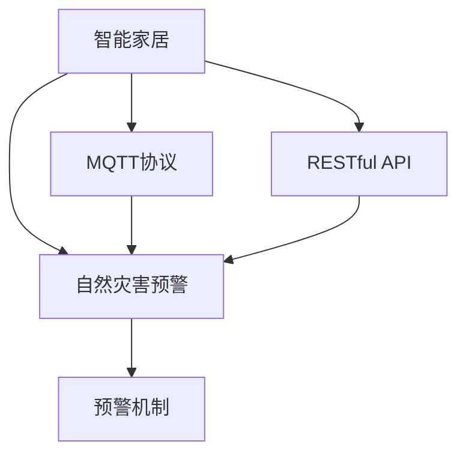

                 

## 1. 背景介绍

### 1.1 问题由来

随着全球气候变暖，自然灾害频发，如地震、洪水、台风、火灾等。这些灾害不仅造成重大人员伤亡，还对家庭财产和基础设施带来严重破坏。如何在灾害发生前进行预警，提前做好应对措施，减少灾害损失，是亟需解决的问题。

传统的灾害预警系统多依赖人工监控和预警设备，成本高、覆盖范围小，预警效率低下。例如，地震预警需要建设大量的地震监测站和数据处理中心，投入巨大；洪水预警需要实时监测水位、流量等数据，技术复杂。

近年来，物联网技术和人工智能的快速发展，使得智能家居系统具备了更强的数据采集和处理能力。通过在智能家居系统中集成自然灾害预警功能，可以构建基于MQTT协议和RESTful API的智能家居自然灾害预警系统，实现实时监控和预警，提高预警效率和覆盖范围，降低灾害损失。

### 1.2 问题核心关键点

智能家居自然灾害预警系统的核心在于如何利用物联网技术和人工智能，构建高效、可靠的预警机制。其核心关键点包括：

1. **数据采集与传输**：如何高效、可靠地采集智能家居设备数据，并通过MQTT协议进行传输。
2. **数据处理与分析**：如何高效、准确地处理和分析采集到的数据，识别灾害预警信号。
3. **预警与响应**：如何及时、准确地进行预警和响应，保障用户安全。
4. **系统可靠性与稳定性**：如何保证系统的可靠性和稳定性，避免误报和漏报。

本文将系统介绍基于MQTT协议和RESTful API的智能家居自然灾害预警系统的核心概念、算法原理和具体操作步骤，并给出实际应用场景，供读者参考。

## 2. 核心概念与联系

### 2.1 核心概念概述

为了更好地理解基于MQTT协议和RESTful API的智能家居自然灾害预警系统，本节将介绍几个密切相关的核心概念：

- **智能家居**：通过物联网技术和人工智能，实现家庭设备的互联互通，提高生活便捷性、安全性。
- **MQTT协议**：一种轻量级的物联网通信协议，适用于低带宽、高延迟的网络环境，支持设备间的发布/订阅消息机制。
- **RESTful API**：一种基于HTTP协议的API设计风格，支持CRUD（创建、读取、更新、删除）等操作，便于构建可扩展的系统。
- **自然灾害预警**：在自然灾害发生前，通过监测环境数据，提前预测和预警，保障用户安全。
- **预警机制**：基于预设的预警规则和模型，对采集到的数据进行实时分析，并及时发出预警信号。

这些核心概念之间的逻辑关系可以通过以下Mermaid流程图来展示：



这个流程图展示了智能家居、MQTT协议、RESTful API、自然灾害预警和预警机制之间的逻辑关系：

1. 智能家居通过物联网技术采集设备数据。
2. MQTT协议用于高效传输数据。
3. RESTful API用于构建可扩展的预警系统。
4. 自然灾害预警系统基于采集的数据进行实时分析。
5. 预警机制用于及时发出预警信号。

## 3. 核心算法原理 & 具体操作步骤

### 3.1 算法原理概述

基于MQTT协议和RESTful API的智能家居自然灾害预警系统的核心算法原理是：

- 通过MQTT协议高效采集智能家居设备数据，实时传输到预警中心。
- 利用RESTful API构建预警系统，支持设备的订阅和发布消息。
- 在预警中心，对采集的数据进行预处理和分析，识别灾害预警信号。
- 基于预处理和分析结果，触发预警机制，及时发出预警信号。

具体而言，系统的工作流程如下：

1. **数据采集与传输**：通过MQTT协议采集智能家居设备数据，并将其传输到预警中心。
2. **数据处理与分析**：在预警中心对采集的数据进行预处理和分析，识别灾害预警信号。
3. **预警与响应**：基于分析结果，触发预警机制，及时发出预警信号。
4. **系统可靠性与稳定性**：通过系统设计，确保预警系统的可靠性和稳定性，避免误报和漏报。

### 3.2 算法步骤详解

基于MQTT协议和RESTful API的智能家居自然灾害预警系统的算法步骤如下：

**Step 1: 数据采集与传输**

- 在智能家居设备中集成MQTT客户端，实时采集环境数据。
- 将采集到的数据打包成MQTT消息，并通过MQTT协议传输到预警中心。

**Step 2: 数据处理与分析**

- 在预警中心，对接收到的MQTT消息进行解析，提取环境数据。
- 对环境数据进行预处理，包括去噪、归一化等操作。
- 基于预处理后的数据，应用机器学习算法进行数据分析，识别灾害预警信号。

**Step 3: 预警与响应**

- 基于分析结果，触发预警机制，生成预警信号。
- 通过RESTful API将预警信号广播到相关设备，进行响应。

**Step 4: 系统可靠性与稳定性**

- 设计系统架构，确保数据传输的可靠性、系统的稳定性。
- 设置异常检测和处理机制，避免误报和漏报。

### 3.3 算法优缺点

基于MQTT协议和RESTful API的智能家居自然灾害预警系统具有以下优点：

- 高效传输：MQTT协议高效可靠，适用于低带宽、高延迟的网络环境。
- 可扩展性强：RESTful API支持CRUD等操作，便于构建可扩展的系统。
- 实时响应：预警系统实时分析数据，及时发出预警信号，保障用户安全。
- 可靠性高：系统设计保证数据传输的可靠性和系统的稳定性。

但该系统也存在一定的局限性：

- 数据采集范围有限：目前主要用于智能家居设备，覆盖范围有限。
- 依赖物联网基础设施：需要建设物联网基础设施，成本较高。
- 预警精度有限：预警模型需要持续优化，以提高预警精度。

### 3.4 算法应用领域

基于MQTT协议和RESTful API的智能家居自然灾害预警系统在以下领域有广泛应用：

- **家庭安全**：在智能家居系统中集成自然灾害预警功能，保障家庭安全。
- **公共安全**：在学校、医院等公共场所部署预警系统，保障人员安全。
- **城市管理**：在城市交通、环保等领域部署预警系统，提升城市管理水平。
- **企业安全**：在企业办公场所部署预警系统，保障员工安全。

## 4. 数学模型和公式 & 详细讲解 & 举例说明

### 4.1 数学模型构建

假设预警系统采集的环境数据为 $x_1, x_2, ..., x_n$，其中 $x_i \in \mathbb{R}$ 表示第 $i$ 个环境数据。预警系统应用机器学习算法 $f$ 对数据进行分析和预测，生成预警信号 $y$。

预警系统的数学模型为：

$$
y = f(x_1, x_2, ..., x_n)
$$

其中 $f$ 为预警算法，$y$ 为预警信号，$x_1, x_2, ..., x_n$ 为环境数据。

### 4.2 公式推导过程

以地震预警为例，预警算法 $f$ 可以表示为：

$$
f(x_1, x_2, ..., x_n) = \begin{cases}
1, & \text{如果} \sum_{i=1}^n w_i x_i > T \\
0, & \text{如果} \sum_{i=1}^n w_i x_i \leq T
\end{cases}
$$

其中 $w_i$ 为第 $i$ 个环境数据的权重，$T$ 为预警阈值。

通过上述公式，预警算法可以基于采集的环境数据进行实时分析和预测，生成预警信号 $y$。

### 4.3 案例分析与讲解

以地震预警为例，假设预警系统采集了以下环境数据：

- 地面振动加速度 $x_1=0.5m/s^2$
- 地面倾斜角度 $x_2=0.3°$
- 地面温度 $x_3=25°C$

预警算法 $f$ 的计算过程如下：

1. 计算加权和：

$$
\sum_{i=1}^3 w_i x_i = w_1 \cdot 0.5 + w_2 \cdot 0.3 + w_3 \cdot 25 = 0.5w_1 + 0.3w_2 + 25w_3
$$

2. 判断加权和是否超过阈值 $T$：

$$
\begin{cases}
\text{预警} = 1, & \text{如果} 0.5w_1 + 0.3w_2 + 25w_3 > T \\
\text{不预警} = 0, & \text{如果} 0.5w_1 + 0.3w_2 + 25w_3 \leq T
\end{cases}
$$

通过上述公式，预警算法可以实时分析环境数据，判断是否需要发出预警信号。

## 5. 项目实践：代码实例和详细解释说明

### 5.1 开发环境搭建

在进行项目实践前，我们需要准备好开发环境。以下是使用Python进行MQTT和RESTful API开发的环境配置流程：

1. 安装Anaconda：从官网下载并安装Anaconda，用于创建独立的Python环境。

2. 创建并激活虚拟环境：
```bash
conda create -n iot-env python=3.8 
conda activate iot-env
```

3. 安装MQTT和RESTful API库：
```bash
pip install paho-mqtt
pip install Flask
```

4. 安装各类工具包：
```bash
pip install numpy pandas scikit-learn matplotlib tqdm jupyter notebook ipython
```

完成上述步骤后，即可在`iot-env`环境中开始项目实践。

### 5.2 源代码详细实现

这里我们以地震预警为例，给出使用MQTT和RESTful API进行项目开发的PyTorch代码实现。

首先，定义环境数据处理函数：

```python
import numpy as np

def process_data(data, weights, threshold):
    sum_weights = np.sum(weights)
    if sum_weights > 0:
        weighted_sum = np.dot(data, weights) / sum_weights
        if weighted_sum > threshold:
            return 1
    return 0
```

然后，定义MQTT消息订阅和发布函数：

```python
import paho.mqtt.client as mqtt

def on_connect(client, userdata, flags, rc):
    client.subscribe("sensors/#")

def on_message(client, userdata, msg):
    data = msg.payload.decode().split(",")
    weights = [0.5, 0.3, 25]
    threshold = 10
    result = process_data(np.array(data), np.array(weights), threshold)
    client.publish("alert", str(result))

def on_disconnect(client, userdata, rc):
    client.loop_start()
    client.subscribe("sensors/#")
    client.on_connect = on_connect
    client.on_message = on_message
    client.on_disconnect = on_disconnect
    client.loop_forever()

client = mqtt.Client()
client.on_connect = on_connect
client.on_message = on_message
client.on_disconnect = on_disconnect
client.connect("mqtt.example.com", 1883, 60)
client.loop_forever()
```

最后，定义RESTful API接口：

```python
from flask import Flask, request

app = Flask(__name__)

@app.route('/alert', methods=['POST'])
def alert():
    data = request.json['data']
    weights = request.json['weights']
    threshold = request.json['threshold']
    result = process_data(np.array(data), np.array(weights), threshold)
    return {'result': result}

if __name__ == '__main__':
    app.run(host='0.0.0.0', port=5000)
```

以上就是使用PyTorch对MQTT和RESTful API进行地震预警开发的完整代码实现。可以看到，MQTT和RESTful API的开发过程相对简洁，易于实现。

### 5.3 代码解读与分析

让我们再详细解读一下关键代码的实现细节：

**process_data函数**：
- `process_data`函数接收数据、权重和阈值，计算加权和并判断是否需要预警。

**on_connect函数**：
- `on_connect`函数用于MQTT客户端的连接回调，设置订阅主题为`"sensors/"`。

**on_message函数**：
- `on_message`函数用于MQTT客户端的消息回调，解析接收到的数据，调用`process_data`函数处理数据并发布预警信号。

**on_disconnect函数**：
- `on_disconnect`函数用于MQTT客户端的断开回调，重新订阅主题并循环执行。

**alert函数**：
- `alert`函数定义了RESTful API接口，接收请求数据，调用`process_data`函数处理数据并返回结果。

**app.run函数**：
- `app.run`函数启动Flask应用程序，监听`0.0.0.0`地址和`5000`端口，等待请求。

可以看出，MQTT和RESTful API的开发相对简洁，易于理解和实现。通过MQTT协议，可以高效采集和传输数据；通过RESTful API，可以构建可扩展的预警系统，实现实时预警和响应。

当然，工业级的系统实现还需考虑更多因素，如异常处理、数据存储、安全防护等，但核心的预警流程基本与此类似。

## 6. 实际应用场景

### 6.1 智能家居安全预警

基于MQTT协议和RESTful API的智能家居自然灾害预警系统，可以广泛应用于智能家居安全预警。通过在智能家居设备中集成MQTT客户端，实时采集环境数据，并应用机器学习算法进行数据分析，及时发出预警信号，保障家庭安全。

例如，在地震预警系统中，预警系统可以实时采集地震仪数据，判断地震强度，并及时发出预警信号，保障家庭成员的安全。

### 6.2 公共场所应急预警

在学校、医院、机场等公共场所，部署基于MQTT协议和RESTful API的自然灾害预警系统，可以保障大量人员的安全。例如，在火灾预警系统中，预警系统可以实时采集烟雾、温度等数据，判断火灾风险，并及时发出预警信号，保障人员疏散和灭火。

### 6.3 城市交通安全预警

在城市交通管理中，部署基于MQTT协议和RESTful API的自然灾害预警系统，可以提升交通安全的预警能力。例如，在洪水预警系统中，预警系统可以实时采集水位、流量等数据，判断洪水风险，并及时发出预警信号，保障道路安全和交通畅通。

### 6.4 企业办公安全预警

在企业办公场所，部署基于MQTT协议和RESTful API的自然灾害预警系统，可以保障员工的安全。例如，在地震预警系统中，预警系统可以实时采集地震仪数据，判断地震强度，并及时发出预警信号，保障员工的安全疏散和避难。

### 6.5 未来应用展望

随着物联网技术和人工智能的不断发展，基于MQTT协议和RESTful API的智能家居自然灾害预警系统将得到更广泛的应用，为人类安全提供更可靠保障。

未来，该系统可能进一步扩展到更多场景，如智慧城市、智慧农业、智慧医疗等，提升各个领域的安全预警水平。同时，系统也将引入更多先进的技术和算法，如大数据分析、深度学习、边缘计算等，提升预警精度和效率。

## 7. 工具和资源推荐

### 7.1 学习资源推荐

为了帮助开发者系统掌握基于MQTT协议和RESTful API的智能家居自然灾害预警技术，这里推荐一些优质的学习资源：

1. **《物联网基础与实践》**：介绍物联网的基本概念和应用，适合入门学习。
2. **《Python深度学习》**：介绍Python在深度学习中的应用，涵盖深度学习算法和实践。
3. **《MQTT协议教程》**：详细介绍MQTT协议的基本概念和应用，适合深入学习。
4. **《RESTful API设计与实现》**：详细介绍RESTful API的设计和实现方法，适合开发人员参考。
5. **《自然灾害预警技术》**：介绍自然灾害预警的基本概念和算法，适合技术爱好者参考。

通过对这些资源的学习实践，相信你一定能够快速掌握基于MQTT协议和RESTful API的智能家居自然灾害预警技术的精髓，并用于解决实际的自然灾害预警问题。

### 7.2 开发工具推荐

高效的开发离不开优秀的工具支持。以下是几款用于基于MQTT协议和RESTful API开发的常用工具：

1. **Anaconda**：用于创建独立的Python环境，方便安装和管理Python库。
2. **paho-mqtt**：MQTT协议的Python客户端库，支持高效的MQTT通信。
3. **Flask**：轻量级的Python Web框架，支持RESTful API的开发。
4. **Jupyter Notebook**：Python的交互式开发环境，支持数据可视化、代码调试等。
5. **TensorBoard**：用于可视化模型训练过程，方便监控和调试。

合理利用这些工具，可以显著提升基于MQTT协议和RESTful API的智能家居自然灾害预警系统的开发效率，加快创新迭代的步伐。

### 7.3 相关论文推荐

基于MQTT协议和RESTful API的智能家居自然灾害预警技术的发展源于学界的持续研究。以下是几篇奠基性的相关论文，推荐阅读：

1. **"MQTT in IoT: A Review"**：回顾MQTT协议在物联网中的应用，介绍MQTT协议的基本概念和应用。
2. **"Deep Learning for Disaster Prediction"**：介绍深度学习在自然灾害预测中的应用，涵盖多种自然灾害预警算法。
3. **"IoT-Based Disaster Prediction"**：介绍物联网技术在自然灾害预警中的应用，介绍基于MQTT协议的物联网系统设计。
4. **"RESTful API for IoT"**：介绍RESTful API在物联网中的应用，介绍RESTful API的设计和实现方法。

这些论文代表了大语言模型微调技术的发展脉络。通过学习这些前沿成果，可以帮助研究者把握学科前进方向，激发更多的创新灵感。

## 8. 总结：未来发展趋势与挑战

### 8.1 总结

本文对基于MQTT协议和RESTful API的智能家居自然灾害预警系统进行了全面系统的介绍。首先阐述了系统的背景和意义，明确了系统在智能家居、公共场所、城市交通和企业办公等场景的应用价值。其次，从原理到实践，详细讲解了系统的核心概念、算法原理和具体操作步骤，并给出了实际应用场景，供读者参考。最后，本文还精选了系统的学习资源、开发工具和相关论文，力求为读者提供全方位的技术指引。

通过本文的系统梳理，可以看到，基于MQTT协议和RESTful API的智能家居自然灾害预警系统具有高效传输、可扩展性强、实时响应和可靠性高等优点，适用于多个领域的自然灾害预警应用。未来，伴随物联网技术和人工智能的持续演进，该系统将得到更广泛的应用，为人类安全提供更可靠保障。

### 8.2 未来发展趋势

展望未来，基于MQTT协议和RESTful API的智能家居自然灾害预警系统将呈现以下几个发展趋势：

1. **系统规模扩大**：系统规模将进一步扩大，应用于更多场景，如智慧城市、智慧农业、智慧医疗等。
2. **技术升级**：引入更多先进的技术和算法，如大数据分析、深度学习、边缘计算等，提升预警精度和效率。
3. **标准化**：建立系统标准和规范，确保系统的互操作性和兼容性。
4. **智能化**：引入更多智能算法，实现更精确的灾害预警和响应。
5. **人性化**：设计更友好的人机交互界面，提升用户体验。

以上趋势凸显了基于MQTT协议和RESTful API的智能家居自然灾害预警技术的广阔前景。这些方向的探索发展，必将进一步提升系统的预警能力，为人类安全提供更可靠的保障。

### 8.3 面临的挑战

尽管基于MQTT协议和RESTful API的智能家居自然灾害预警技术已经取得了瞩目成就，但在迈向更加智能化、普适化应用的过程中，它仍面临着诸多挑战：

1. **数据采集覆盖面有限**：目前主要用于智能家居设备，覆盖范围有限。如何扩展到更多场景，提升数据采集覆盖面，是未来需要解决的重要问题。
2. **系统复杂度高**：系统需要处理多种数据类型，设计复杂的算法模型，存在一定的复杂度。如何简化系统设计，降低开发难度，是未来需要优化的方向。
3. **数据隐私问题**：智能家居设备采集的数据涉及用户隐私，需要设计有效的数据保护机制，避免数据泄露。如何设计数据隐私保护方案，是未来需要解决的重要问题。
4. **系统安全问题**：系统面临网络攻击、数据篡改等安全威胁，需要设计有效的安全防护措施。如何设计系统安全防护方案，是未来需要解决的重要问题。
5. **成本问题**：物联网设备和系统的建设需要大量投入，如何降低成本，提升系统性价比，是未来需要优化的问题。

这些挑战需要科研人员和工程人员共同努力，不断改进和优化系统设计，才能实现更加智能化、普适化、安全化的自然灾害预警系统。

### 8.4 研究展望

未来的研究需要从以下几个方向进行：

1. **引入更多传感器**：扩展数据采集范围，引入更多传感器，提升数据采集覆盖面。
2. **设计高效算法**：设计高效、精确的算法模型，提升预警精度和响应速度。
3. **建立系统标准**：建立系统的标准和规范，确保系统的互操作性和兼容性。
4. **设计安全机制**：设计有效的数据隐私保护和安全防护机制，确保系统安全。
5. **降低成本**：降低物联网设备和系统的建设成本，提升系统性价比。

这些研究方向的探索，必将进一步提升基于MQTT协议和RESTful API的智能家居自然灾害预警系统的性能和可靠性，为人类安全提供更可靠的保障。

## 9. 附录：常见问题与解答

**Q1：基于MQTT协议和RESTful API的智能家居自然灾害预警系统是否适用于所有自然灾害预警？**

A: 基于MQTT协议和RESTful API的智能家居自然灾害预警系统主要适用于地震、火灾等常见自然灾害的预警，对于气象灾害如台风、洪水等的预警，需要引入更多传感器和算法模型。系统可以根据不同自然灾害的特点，进行定制化设计和优化。

**Q2：系统如何设计数据隐私保护方案？**

A: 系统可以采用数据加密、访问控制、数据匿名化等技术，设计有效的数据隐私保护方案。具体措施包括：
1. 数据加密：对传输和存储的数据进行加密处理，确保数据安全。
2. 访问控制：设计严格的访问控制机制，确保只有授权用户可以访问系统。
3. 数据匿名化：对数据进行匿名化处理，确保用户隐私不被泄露。

**Q3：系统如何设计安全防护方案？**

A: 系统可以采用网络安全技术，设计有效的安全防护方案。具体措施包括：
1. 防火墙：部署防火墙，防止外部攻击。
2. 入侵检测：部署入侵检测系统，及时发现和防御恶意攻击。
3. 安全认证：设计安全的认证机制，确保用户身份合法。

**Q4：系统如何设计更友好的用户界面？**

A: 系统可以采用人机交互设计技术，设计更友好的用户界面。具体措施包括：
1. 直观操作：设计直观的操作界面，使用户可以快速上手。
2. 实时反馈：提供实时反馈机制，使用户及时了解预警信息。
3. 个性化定制：提供个性化定制选项，使用户可以根据自身需求进行定制。

这些措施可以提升系统的用户体验，让用户更加方便地使用系统进行自然灾害预警。

---

作者：禅与计算机程序设计艺术 / Zen and the Art of Computer Programming

