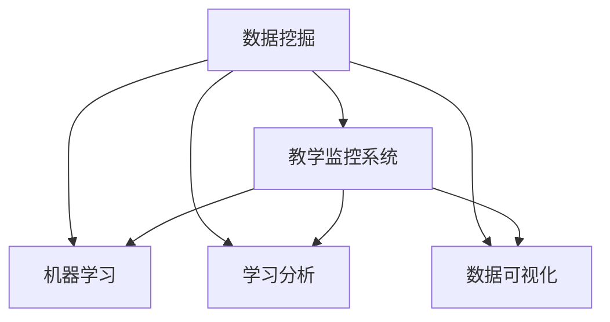

                 

# 基于数据挖据的教学监控系统的设计与应用

> 关键词：数据挖掘,教学监控系统,机器学习,学习分析,数据可视化

## 1. 背景介绍

随着教育信息化水平的提升，学校、教育机构对教学过程的监测和分析需求日益增强。传统的以人工为主导的教学监控方式，如课堂观察、课后访谈等，不仅耗费大量人力物力，而且难以获取全面、客观、实时的数据。因此，亟需开发一套高效、智能的教学监控系统，以数据驱动的方式对教师的教学过程进行全面监测和分析，帮助教师改进教学方法，提升教学质量。

教学监控系统旨在通过大数据技术，对学校教学过程中的各种数据进行收集、存储、分析和展示，提供科学、实时的教学决策支持。通过挖掘和分析海量教学数据，识别出教学过程中的问题和机会，为教师提供针对性的反馈和改进建议。本节将详细介绍基于数据挖掘的教学监控系统的设计与应用。

## 2. 核心概念与联系

### 2.1 核心概念概述

教学监控系统是一个集成了数据采集、数据挖掘、学习分析、数据可视化等多项技术的综合性系统。本节将介绍几个密切相关的核心概念：

- **数据挖掘（Data Mining）**：通过算法自动分析和处理数据，发现隐藏在数据背后的知识、规律和模式的过程。
- **教学监控系统**：利用数据挖掘技术，对教学过程中的各种数据进行采集、存储、分析和展示，辅助教师改进教学方法，提升教学质量的系统。
- **机器学习（Machine Learning）**：一种利用算法和模型，使计算机系统能够自动学习数据规律，并根据学习结果进行预测或决策的技术。
- **学习分析（Learning Analytics）**：通过分析学生学习行为和教学活动，发现学习过程中的问题和机会，提供个性化的教学支持和学习建议。
- **数据可视化（Data Visualization）**：通过图表、地图等形式，将复杂的数据直观地展示出来，帮助决策者进行直观理解和快速决策。

这些核心概念之间的逻辑关系可以通过以下Mermaid流程图来展示：



这个流程图展示出数据挖掘技术在教学监控系统中的核心作用：

1. 数据挖掘用于从教学数据中提取有用的信息和模式。
2. 机器学习用于建立预测模型，自动分析学习过程中的规律。
3. 学习分析用于评估学生的学习情况和教学效果，提供个性化的学习建议。
4. 数据可视化用于将复杂数据转化为直观的图表和图形，支持决策者快速理解。

这些核心概念共同构成了教学监控系统的技术基础，帮助系统实现教学数据的高效采集、存储、分析和展示，从而提供科学、实时的教学决策支持。

## 3. 核心算法原理 & 具体操作步骤
### 3.1 算法原理概述

基于数据挖掘的教学监控系统主要利用机器学习和数据挖掘算法，对学校教学过程中的各种数据进行分析和挖掘，识别出教学过程中的问题和机会，为教师提供针对性的反馈和改进建议。

教学监控系统主要由以下几个步骤组成：

1. **数据采集**：通过传感器、监控摄像头、学生管理系统等多种方式，采集学校教学过程中的各种数据。
2. **数据清洗与预处理**：对采集到的数据进行清洗、筛选、归一化等预处理，确保数据的质量和可用性。
3. **特征提取**：从清洗后的数据中提取有用的特征，如学生出勤率、课堂互动情况、作业完成情况等。
4. **模型训练与优化**：利用机器学习算法建立预测模型，并对模型进行训练和优化，以提高模型的准确性和泛化能力。
5. **结果展示与分析**：将模型分析结果转化为直观的图表和图形，帮助教师和决策者进行快速理解和决策。

### 3.2 算法步骤详解

**Step 1: 数据采集**

教学监控系统需要从多个来源采集数据。常见的数据采集方式包括：

- **传感器数据**：通过各种传感器采集教室内的环境数据，如温度、湿度、噪音、光线等。
- **监控摄像头数据**：通过监控摄像头捕捉教室内的行为数据，如学生出勤、课堂互动、课堂行为等。
- **学生管理系统数据**：从学校的学生管理系统获取学生的基本信息和行为数据，如出勤率、作业完成情况、考试成绩等。
- **学习管理系统数据**：从学习管理系统获取学习活动数据，如在线学习时间、学习资源访问记录等。

**Step 2: 数据清洗与预处理**

数据采集过程中可能会存在一些噪声、缺失和异常数据，需要通过以下步骤进行清洗和预处理：

- **数据去重与归一化**：去除重复数据，对不同数据源的数据进行统一标准化。
- **数据缺失处理**：对缺失数据进行填补或删除，确保数据的完整性。
- **数据转换与特征提取**：将原始数据转换为适合分析的格式，提取有用的特征。

**Step 3: 特征提取**

从清洗后的数据中提取有用的特征，是数据挖掘和机器学习模型的基础。常用的特征包括：

- **学生特征**：如年龄、性别、成绩等。
- **课堂特征**：如课堂互动频率、出勤率等。
- **学习行为特征**：如在线学习时间、作业完成情况等。

**Step 4: 模型训练与优化**

在特征提取的基础上，利用机器学习算法建立预测模型，并对模型进行训练和优化，以提高模型的准确性和泛化能力。常见的机器学习算法包括：

- **分类算法**：如决策树、随机森林、支持向量机等，用于对学生的学习情况进行分类。
- **聚类算法**：如K-Means、层次聚类等，用于对学生的学习行为进行分组。
- **回归算法**：如线性回归、岭回归、神经网络等，用于对学生的学习成绩进行预测。
- **关联规则算法**：如Apriori、FP-Growth等，用于挖掘学生学习行为中的关联规律。

**Step 5: 结果展示与分析**

将模型分析结果转化为直观的图表和图形，帮助教师和决策者进行快速理解和决策。常见的结果展示方式包括：

- **可视化仪表盘**：将各种数据和分析结果直观展示在仪表盘上，方便教师和决策者快速查看和理解。
- **交互式报表**：提供交互式报表功能，教师和决策者可以通过设置参数，动态生成各种报表。
- **实时监控界面**：实时展示教室内的行为数据，帮助教师及时发现和处理教学过程中的问题。

### 3.3 算法优缺点

基于数据挖掘的教学监控系统具有以下优点：

1. **自动化与高效性**：利用机器学习和数据挖掘算法，可以自动化地处理和分析海量教学数据，提高分析和决策的效率。
2. **全面性与客观性**：通过多维度数据采集和综合分析，可以全面客观地评估教学过程和学生学习情况，避免人工评估的偏差。
3. **实时性与动态性**：可以实现实时监控和动态分析，及时发现和处理教学过程中的问题，提供针对性的反馈和改进建议。

同时，该系统也存在以下局限性：

1. **数据隐私和安全**：采集和存储的教学数据可能涉及学生隐私，需要采取严格的数据隐私保护措施。
2. **模型复杂性**：构建高效、准确的预测模型需要大量数据和复杂算法，模型设计和调参难度较大。
3. **数据质量问题**：数据采集过程中可能存在噪声、缺失和异常数据，影响分析结果的准确性。
4. **结果解释性**：预测模型的结果可能缺乏解释性，教师和决策者难以理解其内部逻辑和决策依据。

尽管存在这些局限性，但基于数据挖掘的教学监控系统在教学监控和分析方面具有显著优势，为教育领域的智能化转型提供了重要技术支撑。

### 3.4 算法应用领域

基于数据挖掘的教学监控系统已经在多个教育领域得到了广泛应用，覆盖了从幼儿园到高等教育的各个层次，具体应用包括：

1. **课堂行为监控**：通过监控摄像头和传感器，实时监控课堂行为，识别学生的注意力集中情况和课堂互动情况。
2. **学生学习分析**：利用学生管理系统和学习管理系统数据，分析学生的学习行为和成绩，识别出学习困难学生，提供个性化的学习支持。
3. **教师教学评估**：通过课堂互动数据和学习行为数据，评估教师的教学效果，发现教学中的问题和改进方向。
4. **教学资源推荐**：基于学生的学习行为和成绩，推荐适合的学习资源和教学方法，提高学习效果。
5. **学校管理优化**：通过分析学校各种数据，优化学校的管理决策，提高学校的运营效率。

除了上述这些经典应用外，教学监控系统还被创新性地应用到更多场景中，如学习数据分析、教育公平评估、智能辅导系统等，为教育技术的发展提供了新的思路和方向。

## 4. 数学模型和公式 & 详细讲解 & 举例说明

### 4.1 数学模型构建

本节将使用数学语言对教学监控系统的核心算法进行更加严格的刻画。

设教学监控系统采集到的教学数据为 $D = \{(x_i, y_i)\}_{i=1}^N$，其中 $x_i$ 为输入特征向量，$y_i$ 为对应的输出标签。目标是利用机器学习算法建立一个预测模型 $f(x)$，使得 $f(x)$ 能够最小化预测误差 $L$，即：

$$
\min_{f(x)} L(f(x), y)
$$

其中 $L$ 为损失函数，常用的损失函数包括均方误差、交叉熵等。

在实际应用中，教学监控系统一般使用监督学习算法（如回归、分类、聚类等）来建立预测模型，并使用优化算法（如梯度下降、随机梯度下降等）对模型进行训练和优化。常用的优化算法如下：

$$
\theta \leftarrow \theta - \eta \nabla_{\theta}L(f(x), y)
$$

其中 $\theta$ 为模型参数，$\eta$ 为学习率，$\nabla_{\theta}L(f(x), y)$ 为损失函数对模型参数的梯度。

### 4.2 公式推导过程

以下我们以回归问题为例，推导回归模型的训练和优化过程。

设回归模型为 $f(x) = \theta_0 + \theta_1 x_1 + \theta_2 x_2 + \cdots + \theta_n x_n$，其中 $\theta_0, \theta_1, \theta_2, \cdots, \theta_n$ 为模型参数。给定训练数据集 $D = \{(x_i, y_i)\}_{i=1}^N$，回归任务的目标是最小化预测误差 $L$，即：

$$
\min_{\theta} \sum_{i=1}^N (y_i - f(x_i))^2
$$

利用梯度下降算法求解上述最小化问题，得到模型参数的更新公式为：

$$
\theta \leftarrow \theta - \eta \frac{\partial}{\partial \theta} \sum_{i=1}^N (y_i - f(x_i))^2
$$

其中：

$$
\frac{\partial}{\partial \theta} \sum_{i=1}^N (y_i - f(x_i))^2 = \sum_{i=1}^N 2(y_i - f(x_i))x_i
$$

因此，回归模型的训练过程可以表示为：

$$
\theta \leftarrow \theta - \eta \sum_{i=1}^N 2(y_i - f(x_i))x_i
$$

通过上述公式，我们可以逐步调整模型参数，使得回归模型能够最小化预测误差，从而实现对学生学习情况的准确预测。

### 4.3 案例分析与讲解

**案例1：学生学习行为分析**

假设我们要对学生的在线学习时间进行分析，以识别出学习积极和消极的学生。可以采集学生的在线学习时间数据，并对其进行预处理和特征提取，得到一个特征向量 $x = [t_1, t_2, t_3, \cdots]$，其中 $t_i$ 表示第 $i$ 天学生的在线学习时间。建立回归模型 $f(x) = \theta_0 + \theta_1 x_1 + \theta_2 x_2 + \cdots + \theta_n x_n$，其中 $f(x)$ 为学生学习的积极程度，$\theta_0, \theta_1, \theta_2, \cdots, \theta_n$ 为模型参数。

使用梯度下降算法对模型进行训练，得到模型参数的更新公式：

$$
\theta \leftarrow \theta - \eta \sum_{i=1}^N (y_i - f(x_i))x_i
$$

其中 $y_i$ 为学生第 $i$ 天的学习积极程度，$x_i$ 为第 $i$ 天的在线学习时间。

通过上述公式，我们可以逐步调整模型参数，使得回归模型能够最小化预测误差，从而实现对学生学习积极程度的准确预测。

**案例2：课堂互动行为分析**

假设我们要对课堂互动行为进行分析，以识别出课堂互动积极和消极的学生。可以采集课堂互动行为数据，并将其转换为特征向量 $x = [i_1, i_2, i_3, \cdots]$，其中 $i_i$ 表示第 $i$ 次互动的参与度。建立分类模型 $f(x)$，其中 $f(x)$ 为学生课堂互动的积极程度，模型参数 $\theta$ 通过梯度下降算法进行训练，得到模型参数的更新公式：

$$
\theta \leftarrow \theta - \eta \nabla_{\theta}L(f(x), y)
$$

其中 $L$ 为损失函数，常用的损失函数包括交叉熵、对数损失等。

通过上述公式，我们可以逐步调整模型参数，使得分类模型能够最小化预测误差，从而实现对学生课堂互动积极程度的准确预测。

## 5. 项目实践：代码实例和详细解释说明
### 5.1 开发环境搭建

在进行项目实践前，我们需要准备好开发环境。以下是使用Python进行Scikit-learn开发的环境配置流程：

1. 安装Anaconda：从官网下载并安装Anaconda，用于创建独立的Python环境。

2. 创建并激活虚拟环境：
```bash
conda create -n sklearn-env python=3.8 
conda activate sklearn-env
```

3. 安装Scikit-learn：
```bash
pip install scikit-learn
```

4. 安装各类工具包：
```bash
pip install numpy pandas matplotlib seaborn jupyter notebook ipython
```

完成上述步骤后，即可在`sklearn-env`环境中开始项目实践。

### 5.2 源代码详细实现

下面以学生学习行为分析为例，给出使用Scikit-learn库对回归模型进行训练的Python代码实现。

首先，定义数据处理函数：

```python
import pandas as pd
import numpy as np

def load_data(path):
    data = pd.read_csv(path)
    data['label'] = (data['time'] > 10).astype(int)  # 设置学习积极程度为1或0
    data = data.drop(['time'], axis=1)
    return data

def preprocess_data(data):
    data = data.dropna()  # 删除缺失数据
    data = data.drop_duplicates()  # 删除重复数据
    return data

def train_test_split(data, test_size=0.2):
    train, test = train_test_split(data, test_size=test_size, random_state=42)
    return train, test

def feature_scale(data):
    from sklearn.preprocessing import StandardScaler
    scaler = StandardScaler()
    data = scaler.fit_transform(data)
    return data
```

然后，定义模型训练和评估函数：

```python
from sklearn.linear_model import LinearRegression
from sklearn.metrics import mean_squared_error

def train_model(data):
    X = data.iloc[:, :-1]
    y = data.iloc[:, -1]
    model = LinearRegression()
    model.fit(X, y)
    return model

def evaluate_model(model, test_data):
    y_pred = model.predict(test_data)
    mse = mean_squared_error(test_data['label'], y_pred)
    return mse
```

最后，启动训练流程并在测试集上评估：

```python
# 加载数据
data = load_data('data.csv')

# 预处理数据
data = preprocess_data(data)

# 特征缩放
data = feature_scale(data)

# 分割数据集
train_data, test_data = train_test_split(data, test_size=0.2)

# 训练模型
model = train_model(train_data)

# 评估模型
mse = evaluate_model(model, test_data)
print(f"Mean Squared Error: {mse:.4f}")
```

以上就是使用Scikit-learn对回归模型进行学生学习行为分析的完整代码实现。可以看到，借助Scikit-learn，我们能够通过简洁的代码完成模型的训练和评估。

### 5.3 代码解读与分析

让我们再详细解读一下关键代码的实现细节：

**load_data函数**：
- 加载数据集，并添加学习积极程度标签。

**preprocess_data函数**：
- 删除缺失数据和重复数据，确保数据的质量和一致性。

**train_test_split函数**：
- 使用Scikit-learn的数据分割函数，将数据集分割为训练集和测试集。

**feature_scale函数**：
- 使用StandardScaler对特征进行缩放，以提高模型的训练效果。

**train_model函数**：
- 定义线性回归模型，并使用训练数据对模型进行拟合。

**evaluate_model函数**：
- 使用测试数据评估模型的预测误差，并计算均方误差。

**训练流程**：
- 首先加载数据集，并进行预处理和特征缩放。
- 将数据集分割为训练集和测试集。
- 在训练集上训练模型。
- 在测试集上评估模型的预测误差。
- 输出均方误差，评估模型的预测效果。

可以看到，Scikit-learn使得回归模型的训练和评估过程变得简洁高效。开发者可以将更多精力放在数据处理、模型改进等高层逻辑上，而不必过多关注底层的实现细节。

当然，工业级的系统实现还需考虑更多因素，如模型的保存和部署、超参数的自动搜索、更灵活的任务适配层等。但核心的回归模型训练过程基本与此类似。

## 6. 实际应用场景
### 6.1 课堂行为监控

基于教学监控系统，可以通过对教室内的行为数据进行实时监控和分析，及时发现和处理课堂中的问题。例如，可以通过监控摄像头实时采集学生的行为数据，识别出学生在课堂上的注意力集中情况和互动情况，帮助教师及时调整教学方法，提高课堂教学效果。

**具体应用场景**：

1. **注意力监控**：通过监控摄像头实时采集学生的行为数据，识别出学生的注意力集中情况，生成注意力监控报表，帮助教师及时发现并处理学生的注意力分散问题。
2. **互动监控**：通过监控摄像头实时采集学生的互动情况，识别出课堂互动积极和消极的学生，生成互动监控报表，帮助教师及时调整教学方法，提高课堂互动效果。

**技术实现**：

1. **数据采集**：通过监控摄像头和传感器实时采集教室内的行为数据和环境数据，存储到数据库中。
2. **数据清洗与预处理**：对采集到的数据进行清洗、筛选、归一化等预处理，确保数据的质量和可用性。
3. **特征提取**：从清洗后的数据中提取有用的特征，如学生的注意力集中情况、互动情况等。
4. **模型训练与优化**：利用机器学习算法建立预测模型，并对模型进行训练和优化，以提高模型的准确性和泛化能力。
5. **结果展示与分析**：将模型分析结果转化为直观的图表和图形，帮助教师和决策者进行快速理解和决策。

**效果评估**：

- 在课堂监控应用中，教师可以根据注意力监控和互动监控报表，及时发现并处理课堂中的问题，提高课堂教学效果。
- 学生可以根据注意力监控和互动监控报表，及时调整自己的学习行为，提高学习效率。

### 6.2 学生学习行为分析

基于教学监控系统，可以对学生的学习行为进行全面分析，识别出学习困难学生，提供个性化的学习支持。例如，可以采集学生的在线学习时间数据，建立回归模型进行预测，识别出学习积极和消极的学生，提供针对性的学习建议和资源。

**具体应用场景**：

1. **在线学习时间分析**：采集学生的在线学习时间数据，建立回归模型进行预测，识别出学习积极和消极的学生，生成在线学习时间报表，帮助教师和学生及时发现并改进学习行为。
2. **作业完成情况分析**：采集学生的作业完成情况数据，建立分类模型进行预测，识别出作业完成情况积极和消极的学生，生成作业完成情况报表，帮助教师和学生及时调整学习计划。

**技术实现**：

1. **数据采集**：通过学习管理系统和在线学习平台采集学生的学习行为数据，存储到数据库中。
2. **数据清洗与预处理**：对采集到的数据进行清洗、筛选、归一化等预处理，确保数据的质量和可用性。
3. **特征提取**：从清洗后的数据中提取有用的特征，如学生的在线学习时间、作业完成情况等。
4. **模型训练与优化**：利用机器学习算法建立预测模型，并对模型进行训练和优化，以提高模型的准确性和泛化能力。
5. **结果展示与分析**：将模型分析结果转化为直观的图表和图形，帮助教师和学生进行快速理解和决策。

**效果评估**：

- 在学生学习行为分析应用中，教师可以根据在线学习时间报表和作业完成情况报表，及时发现并改进学习困难学生，提供个性化的学习支持。
- 学生可以根据在线学习时间报表和作业完成情况报表，及时调整自己的学习计划，提高学习效率。

### 6.3 教师教学评估

基于教学监控系统，可以对教师的教学过程进行全面评估，识别出教学中的问题和改进方向。例如，可以通过课堂互动数据和学习行为数据，评估教师的教学效果，发现教学中的问题和改进方向，生成教学评估报表，帮助教师及时改进教学方法。

**具体应用场景**：

1. **课堂互动情况分析**：采集课堂互动行为数据，建立分类模型进行预测，识别出课堂互动积极和消极的学生，生成课堂互动情况报表，帮助教师及时改进教学方法。
2. **学习行为情况分析**：采集学生的学习行为数据，建立回归模型进行预测，识别出学习积极和消极的学生，生成学习行为情况报表，帮助教师及时改进教学方法。

**技术实现**：

1. **数据采集**：通过学习管理系统和在线学习平台采集教师的教学行为数据和学生的学习行为数据，存储到数据库中。
2. **数据清洗与预处理**：对采集到的数据进行清洗、筛选、归一化等预处理，确保数据的质量和可用性。
3. **特征提取**：从清洗后的数据中提取有用的特征，如课堂互动情况、学习行为情况等。
4. **模型训练与优化**：利用机器学习算法建立预测模型，并对模型进行训练和优化，以提高模型的准确性和泛化能力。
5. **结果展示与分析**：将模型分析结果转化为直观的图表和图形，帮助教师和学生进行快速理解和决策。

**效果评估**：

- 在教师教学评估应用中，教师可以根据课堂互动情况报表和学习行为情况报表，及时发现并改进教学中的问题，提高教学效果。
- 教育机构可以根据教学评估报表，及时调整教学资源和教学方法，提升整体教学水平。

## 7. 工具和资源推荐
### 7.1 学习资源推荐

为了帮助开发者系统掌握数据挖掘在教学监控系统中的应用，这里推荐一些优质的学习资源：

1. **《数据挖掘导论》书籍**：经典的入门书籍，涵盖数据挖掘的基本概念、算法和技术。
2. **《机器学习》书籍**：由Tom Mitchell所著，涵盖机器学习的基本概念、算法和技术。
3. **Coursera《数据科学导论》课程**：由Johns Hopkins University开设的课程，涵盖数据科学的基本概念和算法。
4. **Kaggle平台**：提供丰富的数据集和机器学习竞赛，帮助你进行实际的数据挖掘和机器学习练习。
5. **Scikit-learn官方文档**：Scikit-learn库的官方文档，提供详细的API文档和示例代码，帮助你快速上手。

通过对这些资源的学习实践，相信你一定能够系统掌握数据挖掘在教学监控系统中的应用，并用于解决实际的NLP问题。

### 7.2 开发工具推荐

高效的开发离不开优秀的工具支持。以下是几款用于数据挖掘的教学监控系统开发的常用工具：

1. Python编程语言：Python是数据挖掘和机器学习领域的主流语言，具有丰富的第三方库和框架，方便进行数据处理和模型训练。
2. Scikit-learn库：Scikit-learn是Python中常用的机器学习库，提供了丰富的分类、回归、聚类等算法，方便进行数据挖掘和模型训练。
3. Jupyter Notebook：Jupyter Notebook是Python中常用的开发环境，支持代码块和文本块混排，方便进行数据处理和模型训练。
4. R编程语言：R是数据挖掘和统计分析领域的经典语言，具有丰富的统计分析和可视化工具，方便进行数据处理和模型训练。
5. R语言的数据挖掘工具：如ggplot2、dplyr、tidyverse等，方便进行数据可视化。

合理利用这些工具，可以显著提升数据挖掘和教学监控系统的开发效率，加快创新迭代的步伐。

### 7.3 相关论文推荐

数据挖掘和教学监控技术的发展源于学界的持续研究。以下是几篇奠基性的相关论文，推荐阅读：

1. **《数据挖掘导论》书籍**：由Jerry Kilian、Sune Kjærsgaard Larsen和Michael Steinbach所著，涵盖数据挖掘的基本概念、算法和技术。
2. **《机器学习》书籍**：由Tom Mitchell所著，涵盖机器学习的基本概念、算法和技术。
3. **《数据科学导论》课程**：由Johns Hopkins University开设的课程，涵盖数据科学的基本概念和算法。
4. **《机器学习与统计学习》课程**：由斯坦福大学开设的课程，涵盖机器学习的基本概念和算法。

这些论文和课程代表了大数据挖掘和教学监控技术的发展脉络。通过学习这些前沿成果，可以帮助研究者把握学科前进方向，激发更多的创新灵感。

## 8. 总结：未来发展趋势与挑战
### 8.1 总结

本文对基于数据挖掘的教学监控系统进行了全面系统的介绍。首先阐述了数据挖掘技术在教学监控系统中的核心作用，明确了数据挖掘在教学数据处理和分析中的重要价值。其次，从原理到实践，详细讲解了数据挖掘和机器学习算法的核心步骤，给出了数据挖掘任务的代码实例。同时，本文还广泛探讨了数据挖掘技术在教学监控系统中的实际应用，展示了数据挖掘技术在教育领域的广阔前景。

通过本文的系统梳理，可以看到，基于数据挖掘的教学监控系统正在成为教育领域的智能监控与分析的重要手段，极大地提升了教育数据处理和分析的效率和效果。未来，伴随数据挖掘和机器学习技术的不断进步，基于数据挖掘的教学监控系统必将在教育领域得到更广泛的应用，为教育事业的发展提供有力支撑。

### 8.2 未来发展趋势

展望未来，数据挖掘和教学监控技术将呈现以下几个发展趋势：

1. **智能化与自动化**：利用大数据和人工智能技术，实现教学监控的智能化和自动化，自动采集、处理和分析海量教学数据，提升监控效率和效果。
2. **实时性与动态性**：实现实时监控和动态分析，及时发现和处理教学过程中的问题，提供针对性的反馈和改进建议。
3. **数据融合与多模态分析**：融合多种数据源，实现多模态数据的综合分析，全面评估教学过程和学生学习情况。
4. **个性化与因材施教**：利用数据挖掘和机器学习技术，实现个性化教学支持，因材施教，提高教学效果和学生学习体验。
5. **深度学习与神经网络**：引入深度学习技术，提高模型复杂度和精度，实现更加全面和深入的数据分析。
6. **数据隐私与安全**：在数据采集和存储过程中，严格保护学生隐私，确保数据安全。

以上趋势凸显了数据挖掘和教学监控技术的广阔前景。这些方向的探索发展，必将进一步提升教学监控系统的智能化水平，为教育事业的发展提供有力支撑。

### 8.3 面临的挑战

尽管数据挖掘和教学监控技术已经取得了瞩目成就，但在迈向更加智能化、普适化应用的过程中，它仍面临着诸多挑战：

1. **数据质量问题**：数据采集和存储过程中可能存在噪声、缺失和异常数据，影响数据挖掘和机器学习模型的效果。
2. **模型复杂性**：构建高效、准确的预测模型需要大量数据和复杂算法，模型设计和调参难度较大。
3. **数据隐私与安全**：采集和存储的教学数据可能涉及学生隐私，需要采取严格的数据隐私保护措施。
4. **结果解释性**：预测模型的结果可能缺乏解释性，教师和决策者难以理解其内部逻辑和决策依据。
5. **数据融合与多模态分析**：融合多种数据源，实现多模态数据的综合分析，需要克服不同数据源的异构性和复杂性。
6. **实时性与动态性**：实现实时监控和动态分析，需要高性能的计算平台和算法。

尽管存在这些局限性，但数据挖掘和教学监控技术在教学监控和分析方面具有显著优势，为教育领域的智能化转型提供了重要技术支撑。

### 8.4 研究展望

面对数据挖掘和教学监控面临的种种挑战，未来的研究需要在以下几个方面寻求新的突破：

1. **数据质量提升**：提升数据采集和存储过程中的数据质量，确保数据的完整性、准确性和一致性。
2. **模型复杂性优化**：开发更加高效、易用的数据挖掘和机器学习算法，简化模型设计和调参过程。
3. **数据隐私保护**：在数据采集和存储过程中，严格保护学生隐私，确保数据安全。
4. **模型结果解释**：开发可解释性的数据挖掘和机器学习模型，帮助教师和决策者理解模型内部逻辑和决策依据。
5. **数据融合与多模态分析**：实现多种数据源的综合分析，提高数据挖掘和机器学习模型的精度和泛化能力。
6. **实时性与动态性优化**：利用高性能计算平台和算法，实现实时监控和动态分析。

这些研究方向将引领数据挖掘和教学监控技术向更加智能化、普适化和可解释化方向发展，为教育事业的发展提供有力支撑。相信随着数据挖掘和机器学习技术的不断进步，基于数据挖掘的教学监控系统必将在教育领域得到更广泛的应用，为教育事业的发展提供有力支撑。

## 9. 附录：常见问题与解答
----------------------------------------------------------------

**Q1：数据挖掘和教学监控系统如何提高教学效果？**

A: 数据挖掘和教学监控系统通过对学校教学过程的全面监测和分析，识别出教学过程中的问题和机会，为教师提供针对性的反馈和改进建议。具体来说，系统可以通过以下方式提高教学效果：

1. **课堂行为监控**：通过监控摄像头和传感器，实时监控课堂行为，识别出学生的注意力集中情况和课堂互动情况，帮助教师及时调整教学方法，提高课堂教学效果。
2. **学生学习行为分析**：采集学生的在线学习时间数据，建立回归模型进行预测，识别出学习积极和消极的学生，提供个性化的学习支持。
3. **教师教学评估**：通过课堂互动数据和学习行为数据，评估教师的教学效果，发现教学中的问题和改进方向，生成教学评估报表，帮助教师及时改进教学方法。

**Q2：数据挖掘和教学监控系统如何实现数据隐私保护？**

A: 数据挖掘和教学监控系统在采集和存储教学数据时，需要严格保护学生隐私，确保数据安全。具体来说，系统可以采取以下措施：

1. **数据匿名化**：对采集到的教学数据进行匿名化处理，去除与学生身份相关的敏感信息。
2. **数据加密**：对存储的教学数据进行加密处理，防止数据泄露。
3. **访问控制**：设置严格的访问控制机制，只有授权人员才能访问和使用教学数据。
4. **数据删除**：定期删除不再需要的教学数据，防止数据长期存储带来的隐私风险。

**Q3：数据挖掘和教学监控系统在实际应用中存在哪些问题？**

A: 数据挖掘和教学监控系统在实际应用中也存在一些问题，主要包括：

1. **数据质量问题**：数据采集和存储过程中可能存在噪声、缺失和异常数据，影响数据挖掘和机器学习模型的效果。
2. **模型复杂性**：构建高效、准确的预测模型需要大量数据和复杂算法，模型设计和调参难度较大。
3. **数据隐私与安全**：采集和存储的教学数据可能涉及学生隐私，需要采取严格的数据隐私保护措施。
4. **结果解释性**：预测模型的结果可能缺乏解释性，教师和决策者难以理解其内部逻辑和决策依据。
5. **数据融合与多模态分析**：融合多种数据源，实现多模态数据的综合分析，需要克服不同数据源的异构性和复杂性。
6. **实时性与动态性**：实现实时监控和动态分析，需要高性能的计算平台和算法。

尽管存在这些局限性，但数据挖掘和教学监控系统在教学监控和分析方面具有显著优势，为教育领域的智能化转型提供了重要技术支撑。

**Q4：数据挖掘和教学监控系统如何提高教师的教学水平？**

A: 数据挖掘和教学监控系统可以通过以下方式提高教师的教学水平：

1. **课堂行为监控**：通过监控摄像头和传感器，实时监控课堂行为，识别出学生的注意力集中情况和课堂互动情况，帮助教师及时调整教学方法，提高课堂教学效果。
2. **学生学习行为分析**：采集学生的在线学习时间数据，建立回归模型进行预测，识别出学习积极和消极的学生，提供个性化的学习支持。
3. **教师教学评估**：通过课堂互动数据和学习行为数据，评估教师的教学效果，发现教学中的问题和改进方向，生成教学评估报表，帮助教师及时改进教学方法。

**Q5：数据挖掘和教学监控系统如何提高学生的学习效果？**

A: 数据挖掘和教学监控系统可以通过以下方式提高学生的学习效果：

1. **学生学习行为分析**：采集学生的在线学习时间数据，建立回归模型进行预测，识别出学习积极和消极的学生，提供个性化的学习支持。
2. **作业完成情况分析**：采集学生的作业完成情况数据，建立分类模型进行预测，识别出作业完成情况积极和消极的学生，提供针对性的学习建议。

**Q6：数据挖掘和教学监控系统在实际应用中如何实现数据融合与多模态分析？**

A: 数据挖掘和教学监控系统在实际应用中可以通过以下方式实现数据融合与多模态分析：

1. **数据采集**：通过多种传感器、监控摄像头、学习管理系统和在线学习平台采集数据，实现多模态数据的融合。
2. **数据清洗与预处理**：对采集到的数据进行清洗、筛选、归一化等预处理，确保数据的质量和可用性。
3. **特征提取**：从清洗后的数据中提取有用的特征，如学生的在线学习时间、作业完成情况、课堂互动情况等。
4. **模型训练与优化**：利用机器学习算法建立预测模型，并对模型进行训练和优化，以提高模型的准确性和泛化能力。
5. **结果展示与分析**：将模型分析结果转化为直观的图表和图形，帮助教师和学生进行快速理解和决策。

**Q7：数据挖掘和教学监控系统在实际应用中如何实现实时性与动态性？**

A: 数据挖掘和教学监控系统在实际应用中可以通过以下方式实现实时性与动态性：

1. **数据采集**：通过多种传感器、监控摄像头、学习管理系统和在线学习平台实时采集数据，实现实时监控和动态分析。
2. **数据清洗与预处理**：对采集到的数据进行实时清洗、筛选、归一化等预处理，确保数据的质量和可用性。
3. **特征提取**：从清洗后的数据中提取有用的特征，如学生的在线学习时间、作业完成情况、课堂互动情况等。
4. **模型训练与优化**：利用高性能计算平台和算法，实时训练和优化预测模型，提高模型的效果。
5. **结果展示与分析**：将模型分析结果实时展示在仪表盘上，帮助教师和学生进行快速理解和决策。

---

作者：禅与计算机程序设计艺术 / Zen and the Art of Computer Programming

