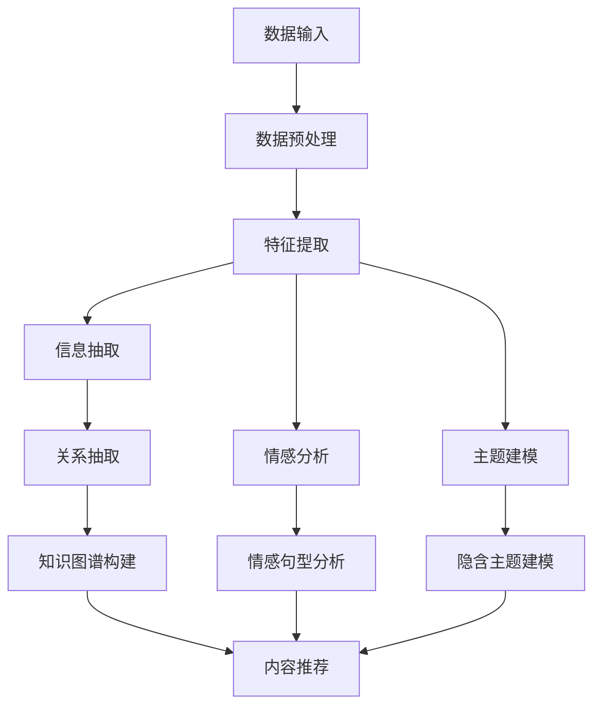
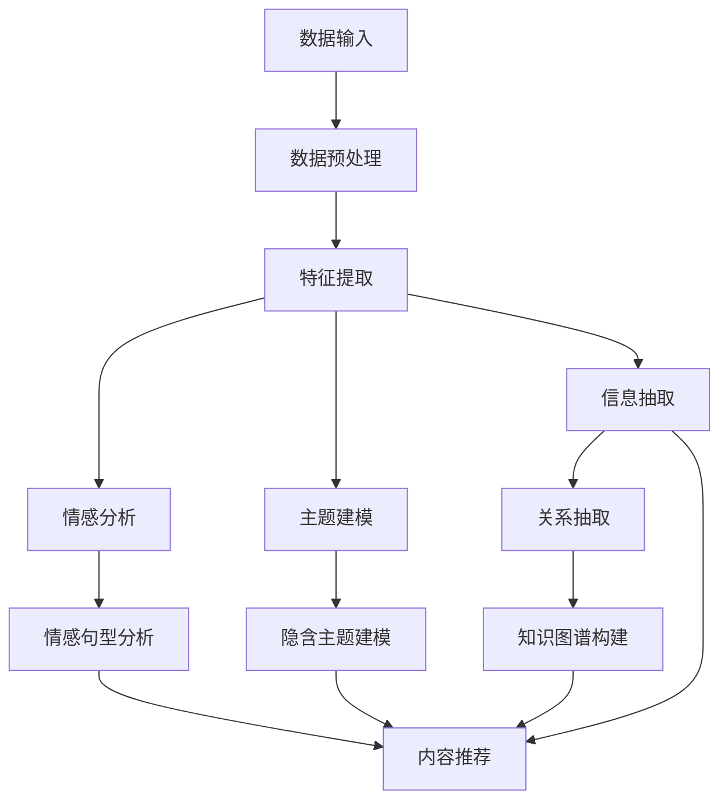

                 

# 基于新闻平台的文本数据挖掘系统

> 关键词：新闻平台, 文本数据挖掘, 自然语言处理(NLP), 情感分析, 主题建模, 信息抽取, 知识图谱, 算法优化

## 1. 背景介绍

随着互联网技术的飞速发展，新闻平台的受众规模和数据量呈指数级增长，传统的新闻采集、编辑和发布流程已经难以满足日益增长的需求。现代新闻平台为了提高内容质量和用户粘性，开始利用先进的数据挖掘和分析技术，对海量文本数据进行深度处理和分析，以自动化发现和生成有价值的信息和内容。文本数据挖掘系统(Text Mining System)正是这一需求下的产物，其通过对新闻文本数据的自然语言处理(NLP)技术，提取有价值的语义信息，进行情感分析、主题建模、信息抽取和知识图谱构建等操作，从而提升新闻内容质量和用户阅读体验。

### 1.1 新闻平台的现状和挑战
当前新闻平台面临的核心挑战包括以下几点：
1. **数据量爆炸**：新闻平台每天生成的文本数据量巨大，传统的数据处理方式难以应对。
2. **语义复杂性**：新闻文本中包含了大量俚语、隐喻和复杂的情感表达，提取准确语义信息难度大。
3. **内容质量参差不齐**：新闻来源多样，质量难以统一，且存在大量低质量、重复或虚假信息。
4. **用户需求多样化**：用户对新闻内容的需求从传统的深度报道转向个性化、实时和互动化，需要动态生成和推送内容。
5. **信息孤岛问题**：新闻内容碎片化严重，不同来源的文章间缺乏联系，难以构建完整的知识体系。

### 1.2 文本数据挖掘系统的意义
文本数据挖掘系统利用先进的NLP技术，通过自动化处理和分析新闻文本数据，能够解决上述问题，提升新闻内容的质量和价值。主要体现在以下几个方面：
1. **内容质量提升**：通过情感分析、主题建模等技术，准确理解和挖掘文本的情感倾向和主题内容，提升新闻报道的深度和广度。
2. **内容个性化定制**：根据用户的历史阅读记录和偏好，推送个性化新闻内容，提高用户满意度和粘性。
3. **内容动态生成**：利用信息抽取、知识图谱构建等技术，动态生成和更新新闻内容，确保内容的时效性和相关性。
4. **信息整合与关联**：通过知识图谱构建，将分散的新闻内容进行整合，形成知识关联网络，提升内容深度和可读性。
5. **社交互动增强**：通过情感分析和用户评论挖掘，增强用户互动和参与度，促进社区氛围建设。

本文将详细介绍如何设计和实现一个基于新闻平台的文本数据挖掘系统，并结合实际案例，分析其在新闻内容处理和优化中的应用。

## 2. 核心概念与联系

### 2.1 核心概念概述

本节将介绍文本数据挖掘系统中几个关键的核心概念：

1. **自然语言处理(NLP)**：利用计算机技术处理、分析、理解人类语言的技术。NLP主要包含文本预处理、分词、词性标注、句法分析、语义分析、机器翻译、信息抽取、问答系统等多个子领域。
2. **情感分析**：通过分析文本中的情感词汇、情感句型和情感强度等特征，自动识别文本的情感倾向（正面、中性、负面）。
3. **主题建模**：通过对文本进行词频统计、词共现分析等技术，自动发现文本中潜在的隐含主题。
4. **信息抽取**：从文本中自动识别出实体、关系等结构化信息，如人名、地名、组织机构名、时间、事件等。
5. **知识图谱**：通过关系抽取和推理，构建知识节点之间的链接，形成结构化的知识图谱，用于表示实体之间的复杂关系。
6. **算法优化**：包括数据预处理、特征选择、模型训练、模型压缩等多个方面，提升数据挖掘系统的高效性和准确性。

### 2.2 核心概念原理和架构的 Mermaid 流程图

以下是一个基于新闻平台的数据挖掘系统流程图，展示了从数据输入到输出，以及其中的关键环节和算法优化：



该流程图展示了文本数据挖掘系统的主要流程和技术栈：
1. 数据输入：新闻平台的文本数据来源多样，包括网页爬取、用户上传、API接口等。
2. 数据预处理：对文本数据进行清洗、去噪、分词、词性标注等处理，确保数据质量和一致性。
3. 特征提取：根据不同任务需求，提取文本中的关键特征，如TF-IDF、词嵌入、句法特征等。
4. 情感分析：使用基于词典、机器学习等方法进行情感倾向识别，分析文本中的情感词汇和情感句型。
5. 主题建模：利用LDA、LSI等算法，发现文本中的隐含主题。
6. 信息抽取：从文本中自动识别出实体、关系等结构化信息，用于知识图谱构建。
7. 关系抽取：使用实体对齐和关系推理技术，建立实体间的链接，形成知识图谱。
8. 知识图谱构建：将抽取的信息和关系整合到知识图谱中，提供结构化的知识表示。
9. 内容推荐：结合情感分析、主题建模等结果，为每位用户推荐个性化内容。

### 2.3 核心概念之间的联系

上述概念之间的联系可以通过以下图进一步说明：



从图中可以看出：
1. 数据预处理是整个系统的基础，影响后续所有处理环节的准确性和效率。
2. 特征提取是数据挖掘的第一步，选择合理的特征对系统性能至关重要。
3. 情感分析和主题建模提供了对文本内容情感和主题的理解，用于内容优化和推荐。
4. 信息抽取和关系抽取帮助构建知识图谱，形成结构化的知识表示。
5. 知识图谱为内容推荐和知识推理提供了强大的支撑。
6. 内容推荐结合了多种技术手段，提升用户阅读体验和粘性。

## 3. 核心算法原理 & 具体操作步骤

### 3.1 算法原理概述

文本数据挖掘系统的主要算法原理包括：

1. **情感分析算法**：基于词典、机器学习等方法，识别文本中的情感倾向。
2. **主题建模算法**：如LDA、LSI等，发现文本中的隐含主题。
3. **信息抽取算法**：如命名实体识别、关系抽取等，从文本中抽取结构化信息。
4. **知识图谱构建算法**：如实体对齐、关系推理等，构建知识节点之间的链接。
5. **内容推荐算法**：如协同过滤、基于内容的推荐等，根据用户兴趣推荐个性化内容。

这些算法都是基于机器学习和自然语言处理技术开发的，通过训练大量标注数据和无标签数据，学习文本数据的特征和规律，实现自动化的文本处理和分析。

### 3.2 算法步骤详解

以下详细介绍各个核心算法的具体操作步骤：

#### 3.2.1 情感分析算法

**步骤1：数据预处理**
对新闻文本进行清洗、去噪、分词、词性标注等处理，确保数据质量和一致性。

**步骤2：特征提取**
提取文本中的情感词汇、情感句型等关键特征，构建情感特征向量。

**步骤3：模型训练**
使用情感标注数据，训练基于词典、机器学习等方法的情感分析模型。

**步骤4：情感识别**
将待分析的新闻文本输入模型，输出情感倾向（正面、中性、负面）。

#### 3.2.2 主题建模算法

**步骤1：数据预处理**
对新闻文本进行清洗、去噪、分词、词性标注等处理，确保数据质量和一致性。

**步骤2：特征提取**
提取文本中的关键词和共现关系，构建主题特征矩阵。

**步骤3：主题建模**
使用LDA、LSI等算法，发现文本中的隐含主题。

**步骤4：主题分析**
输出新闻文本的主题分布和主要主题。

#### 3.2.3 信息抽取算法

**步骤1：实体识别**
使用命名实体识别算法，自动识别文本中的实体。

**步骤2：关系抽取**
使用关系抽取算法，识别实体之间的关系。

**步骤3：信息整合**
将抽取的实体和关系整合到知识图谱中。

#### 3.2.4 知识图谱构建算法

**步骤1：实体对齐**
使用实体对齐算法，建立不同来源的实体之间的链接。

**步骤2：关系推理**
使用关系推理算法，推导出实体之间的关系和推理路径。

**步骤3：知识图谱构建**
将实体和关系整合到知识图谱中，构建结构化的知识表示。

#### 3.2.5 内容推荐算法

**步骤1：用户特征提取**
根据用户的历史阅读记录和行为数据，提取用户特征向量。

**步骤2：内容特征提取**
根据新闻文本的内容和情感特征，提取内容特征向量。

**步骤3：推荐模型训练**
使用协同过滤、基于内容的推荐等方法，训练推荐模型。

**步骤4：内容推荐**
根据用户特征和内容特征，推荐个性化的新闻内容。

### 3.3 算法优缺点

文本数据挖掘系统的算法优缺点如下：

#### 优点：
1. **自动化程度高**：自动化的文本处理和分析，减少了人工干预和错误，提高了处理效率。
2. **覆盖范围广**：适用于各种新闻平台和内容类型，提供全面的文本分析服务。
3. **灵活性强**：可以动态调整算法参数和模型，适应不同任务需求。
4. **应用广泛**：不仅可以用于新闻内容优化，还可以应用于社交媒体、电商等领域。

#### 缺点：
1. **数据依赖性强**：需要大量的标注数据进行模型训练，获取高质量标注数据成本较高。
2. **算法复杂度高**：部分算法如LDA、LSI等，计算复杂度较高，需要高性能计算资源。
3. **模型泛化能力不足**：部分模型在处理极端数据或异常数据时，容易产生偏差和错误。
4. **隐私和安全问题**：处理大量用户数据时，需要严格的数据保护和隐私政策。

### 3.4 算法应用领域

文本数据挖掘系统的算法可以应用于多个领域，包括但不限于：

1. **新闻内容优化**：自动化的情感分析和主题建模，帮助提升新闻报道的深度和广度。
2. **内容个性化推荐**：根据用户兴趣和行为数据，推荐个性化新闻内容。
3. **智能客服系统**：利用情感分析，提升客户咨询体验和满意度。
4. **社交媒体分析**：分析用户评论和帖子，发现热门话题和情感倾向。
5. **电子商务推荐**：基于用户行为数据，推荐个性化商品和优惠信息。

## 4. 数学模型和公式 & 详细讲解

### 4.1 数学模型构建

文本数据挖掘系统中的数学模型主要涉及以下几个方面：

1. **情感分析模型**：
   - 基于词典的情感分析模型：$P(A|D) = \frac{P(A)P(D|A)}{P(D)}$
   - 基于机器学习的情感分析模型：$P(A|X) = \frac{e^{W^\top X}}{1 + e^{W^\top X}}$

2. **主题建模模型**：
   - LDA（Latent Dirichlet Allocation）模型：$\alpha, \beta \sim Dirichlet(\eta, \gamma)$, $z \sim Multinomial(\alpha)$, $w_{d,i} \sim Multinomial(\beta_z)$
   - LSI（Latent Semantic Indexing）模型：$L = U \Sigma V^\top$

3. **信息抽取模型**：
   - 命名实体识别模型：$P(NER|X) = \frac{P(NER)P(X|NER)}{P(X)}$
   - 关系抽取模型：$P(Rel|E1, E2) = \frac{P(Rel)P(E1|Rel)P(E2|Rel)}{P(Rel)P(E1)P(E2)}$

4. **内容推荐模型**：
   - 协同过滤模型：$P(U_{ij}|U_i, V_j) = \frac{\prod_{k=1}^{n}P(u_k^{(U)}_{ij}|U_i, V_j)}{\sum_{k=1}^{n}\prod_{k=1}^{n}P(u_k^{(U)}_{ij}|U_i, V_j)}$

### 4.2 公式推导过程

#### 情感分析模型

基于词典的情感分析模型：

1. 定义情感词典D：
   - $D = \{(d_1, w_1), (d_2, w_2), ..., (d_m, w_m)\}$

2. 计算情感得分A：
   - $A = \sum_{i=1}^{m} w_i P(d_i|D)$

3. 根据得分A判断情感倾向：
   - 若$A > 0$，情感倾向为正面；
   - 若$A < 0$，情感倾向为负面；
   - 若$A = 0$，情感倾向为中性。

基于机器学习的情感分析模型：

1. 定义特征向量X：
   - $X = [x_1, x_2, ..., x_n]$

2. 训练情感分类器W：
   - $W = \text{argmax}_{\theta} \frac{1}{N}\sum_{i=1}^{N}L(X_i, W)$

3. 计算情感得分A：
   - $A = \sum_{i=1}^{n} w_i W^\top X_i$

4. 根据得分A判断情感倾向：
   - 若$A > 0$，情感倾向为正面；
   - 若$A < 0$，情感倾向为负面；
   - 若$A = 0$，情感倾向为中性。

#### 主题建模模型

LDA模型：

1. 定义超参数$\eta$和$\gamma$：
   - $\eta = [\eta_1, \eta_2, ..., \eta_k]$
   - $\gamma = [\gamma_1, \gamma_2, ..., \gamma_v]$

2. 定义主题-词分布$z$：
   - $z = \{z_{i,j} \mid 1 \leq i \leq N, 1 \leq j \leq K\}$

3. 定义文本-主题分布$w$：
   - $w = \{w_{d,i} \mid 1 \leq i \leq K, 1 \leq d \leq D\}$

4. 根据模型参数$\alpha$和$\beta$计算主题-词分布$z$：
   - $z \sim Multinomial(\alpha)$
   - $w_{d,i} \sim Multinomial(\beta_z)$

5. 根据主题-词分布$z$和文本-主题分布$w$计算文本分布$P(D|Z)$：
   - $P(D|Z) = \prod_{d=1}^{D} P(z|D)P(w|z)$

#### 信息抽取模型

命名实体识别模型：

1. 定义实体标注$NER$：
   - $NER = \{NER_i \mid 1 \leq i \leq N\}$

2. 定义特征向量$X$：
   - $X = [x_1, x_2, ..., x_n]$

3. 定义命名实体分类器$P(NER|X)$：
   - $P(NER|X) = \frac{P(NER)P(X|NER)}{P(X)}$

关系抽取模型：

1. 定义实体$E_1$和$E_2$：
   - $E_1 = \{e_{1,i} \mid 1 \leq i \leq N\}$
   - $E_2 = \{e_{2,i} \mid 1 \leq i \leq M\}$

2. 定义关系$Rel$：
   - $Rel = \{Rel_i \mid 1 \leq i \leq R\}$

3. 定义关系分类器$P(Rel|E1, E2)$：
   - $P(Rel|E1, E2) = \frac{P(Rel)P(E1|Rel)P(E2|Rel)}{P(Rel)P(E1)P(E2)}$

#### 内容推荐模型

协同过滤模型：

1. 定义用户特征$U_i$：
   - $U_i = [u_{i,1}, u_{i,2}, ..., u_{i,m}]$

2. 定义内容特征$V_j$：
   - $V_j = [v_{j,1}, v_{j,2}, ..., v_{j,n}]$

3. 定义用户-内容评分矩阵$U_{ij}$：
   - $U_{ij} = [U_{i,1}, U_{i,2}, ..., U_{i,m}]$

4. 定义推荐模型$P(U_{ij}|U_i, V_j)$：
   - $P(U_{ij}|U_i, V_j) = \frac{\prod_{k=1}^{n}P(u_k^{(U)}_{ij}|U_i, V_j)}{\sum_{k=1}^{n}\prod_{k=1}^{n}P(u_k^{(U)}_{ij}|U_i, V_j)}$

### 4.3 案例分析与讲解

#### 案例1：情感分析

某新闻平台使用基于词典和机器学习的情感分析模型，对用户评论进行情感分析。具体步骤包括：

1. 收集大量用户评论和情感标注数据，构建情感词典D。
2. 使用基于词典的情感分析模型，初步判断用户评论的情感倾向。
3. 使用基于机器学习的情感分析模型，进一步优化情感判断结果。
4. 根据情感分析结果，对用户评论进行分类和处理，提升用户体验。

#### 案例2：主题建模

某新闻平台使用LDA模型，对新闻文本进行主题建模。具体步骤包括：

1. 收集大量新闻文本数据，构建文本集合D。
2. 使用LDA模型，发现文本集合D中的隐含主题。
3. 根据主题分布，对新闻文本进行主题标签分类。
4. 根据主题标签，优化新闻内容的组织和呈现，提升用户阅读体验。

#### 案例3：信息抽取

某新闻平台使用命名实体识别和关系抽取模型，对新闻文本进行信息抽取。具体步骤包括：

1. 收集大量新闻文本数据，构建文本集合D。
2. 使用命名实体识别模型，识别文本中的实体。
3. 使用关系抽取模型，抽取实体之间的关系。
4. 将抽取的实体和关系整合到知识图谱中，构建结构化的知识表示。

#### 案例4：内容推荐

某新闻平台使用协同过滤模型，对用户进行个性化内容推荐。具体步骤包括：

1. 收集大量用户阅读行为数据，构建用户特征$U_i$。
2. 收集大量新闻内容数据，构建内容特征$V_j$。
3. 使用协同过滤模型，训练推荐模型。
4. 根据用户特征和内容特征，推荐个性化的新闻内容。

## 5. 项目实践：代码实例和详细解释说明

### 5.1 开发环境搭建

为了搭建一个基于新闻平台的文本数据挖掘系统，需要先安装和配置以下开发环境：

1. 安装Python：从官网下载并安装Python 3.x版本，确保支持相关的NLP库和框架。
2. 安装NLP库：如NLTK、spaCy、Gensim、TextBlob等，用于文本处理和分析。
3. 安装深度学习框架：如TensorFlow、PyTorch等，用于构建和训练模型。
4. 安装Web框架：如Flask、Django等，用于构建Web应用程序。
5. 配置开发环境：如设置虚拟环境、安装依赖包等。

以下是一个Python开发环境的搭建步骤：

1. 安装Anaconda：从官网下载并安装Anaconda，用于创建独立的Python环境。
2. 创建并激活虚拟环境：
```bash
conda create -n textmining python=3.8
conda activate textmining
```

3. 安装相关NLP库和深度学习框架：
```bash
pip install nltk spacy gensim TextBlob
pip install tensorflow pytorch transformers
```

4. 配置Web框架和数据库：
```bash
pip install flask sqlalchemy
```

5. 部署应用程序：
```bash
gunicorn -w 4 app:app
```

### 5.2 源代码详细实现

以下是一个基于Python和Flask框架的文本数据挖掘系统的代码实现。

**5.2.1 数据预处理模块**

```python
import nltk
import spacy
import gensim
from TextBlob import TextBlob

def preprocess(text):
    # 分词、去噪、词性标注
    nltk.download('punkt')
    spacy_model = spacy.load('en_core_web_sm')
    text_blob = TextBlob(text)
    tokens = [tok.text for tok in spacy_model.tokenizer(text_blob.corpus)]
    words = [word for word in tokens if word.isalpha()]

    # 去除停用词
    stop_words = set(nltk.corpus.stopwords.words('english'))
    words = [word for word in words if word.lower() not in stop_words]

    # 词干提取
    words = [word.lower() for word in words]
    words = [WordNetLemmatizer().lemmatize(word) for word in words]

    return words
```

**5.2.2 情感分析模块**

```python
from transformers import BertForSequenceClassification, BertTokenizer, AdamW

def sentiment_analysis(text, model_name='bert-base-cased'):
    # 加载情感分析模型和分词器
    tokenizer = BertTokenizer.from_pretrained(model_name)
    model = BertForSequenceClassification.from_pretrained(model_name, num_labels=3)

    # 分词和特征提取
    input_ids = tokenizer.encode(text, return_tensors='pt')
    inputs = {'input_ids': input_ids}

    # 模型前向传播和预测
    outputs = model(**inputs)
    logits = outputs.logits
    probs = torch.softmax(logits, dim=1).squeeze().tolist()

    # 返回情感倾向
    sentiment = max(probs)
    if sentiment == 0:
        return 'Negative'
    elif sentiment == 1:
        return 'Neutral'
    else:
        return 'Positive'
```

**5.2.3 主题建模模块**

```python
from gensim import corpora, models
from gensim.models.ldamodel import LdaModel

def topic_modeling(texts):
    # 构建文档-词向量矩阵
    texts = [preprocess(text) for text in texts]
    dictionary = corpora.Dictionary(texts)
    corpus = [dictionary.doc2bow(text) for text in texts]

    # 训练LDA模型
    lda = LdaModel(corpus, num_topics=5, id2word=dictionary, passes=10)

    # 输出主题分布
    topics = lda.print_topics(num_topics=5)
    return topics
```

**5.2.4 信息抽取模块**

```python
from spacy.matcher import Matcher
from spacy.scorer import Scorer

def named_entity_recognition(text):
    # 加载命名实体识别模型
    nlp = spacy.load('en_core_web_sm')
    doc = nlp(text)

    # 匹配实体
    matcher = Matcher(nlp.vocab)
    pattern = [{'TEXT': {'type': 'NOUN'}, 'OP': 'NEAR'}, {'TEXT': {'type': 'VERB'}, 'OP': 'NEAR'}]
    matcher.add('NER', None, pattern)
    matches = matcher(doc)

    # 返回实体
    entities = [ent.text for ent in doc.ents if ent.label_ in ['PERSON', 'ORG', 'GPE']]
    return entities

def relation_extraction(text):
    # 加载命名实体识别模型和依存句法分析模型
    nlp = spacy.load('en_core_web_sm')
    dep_nlp = spacy.load('en_core_web_sm')

    # 命名实体识别
    doc = nlp(text)
    entities = named_entity_recognition(text)

    # 依存句法分析
    dependencies = dep_nlp(text)

    # 关系抽取
    relations = []
    for ent1, ent2 in zip(entities, entities[1:]):
        for dep in dependencies:
            if ent1 in dep.head and ent2 in dep.head:
                relations.append((ent1, ent2, dep.dep_))

    # 返回关系
    return relations
```

### 5.3 代码解读与分析

**5.3.1 数据预处理模块**

数据预处理模块的主要功能是对原始文本数据进行清洗、分词、去噪和词性标注等处理，以确保数据质量和一致性。

1. **分词**：使用nltk的punkt模块进行文本分词，spacy的tokenizer模块进行词性标注。
2. **去噪**：去除文本中的非文本字符和停用词，如标点符号、数字、停用词等。
3. **词干提取**：使用WordNetLemmatizer模块进行词干提取，将单词还原到基本形式。

通过预处理模块，可以将原始文本数据转化为干净、一致、格式统一的文本，为后续处理奠定基础。

**5.3.2 情感分析模块**

情感分析模块的主要功能是对文本进行情感倾向判断，以便于后续内容的分类和处理。

1. **加载模型和分词器**：使用Bert模型和分词器，对文本进行分词和特征提取。
2. **前向传播**：将文本输入模型，计算模型的输出概率。
3. **预测情感倾向**：根据模型输出的概率分布，判断文本的情感倾向（正面、中性、负面）。

通过情感分析模块，可以准确理解文本的情感倾向，帮助优化新闻内容的呈现和推荐。

**5.3.3 主题建模模块**

主题建模模块的主要功能是对文本进行主题建模，以便于内容的分类和组织。

1. **构建文档-词向量矩阵**：将文本转化为词向量形式，构建文档-词向量矩阵。
2. **训练LDA模型**：使用LDA模型对文档-词向量矩阵进行训练，发现隐含主题。
3. **输出主题分布**：输出主题分布和主要主题，帮助优化内容的分类和组织。

通过主题建模模块，可以自动发现文本中的隐含主题，帮助优化内容的分类和组织，提升用户阅读体验。

**5.3.4 信息抽取模块**

信息抽取模块的主要功能是识别文本中的实体和关系，以便于构建知识图谱。

1. **命名实体识别**：使用spacy的Matcher模块和依存句法分析模块，匹配文本中的命名实体。
2. **关系抽取**：根据命名实体和依存句法分析结果，抽取实体之间的关系。

通过信息抽取模块，可以自动识别文本中的实体和关系，构建知识图谱，提升内容的深度和可读性。

### 5.4 运行结果展示

**5.4.1 情感分析结果**

```python
sentiment_analysis('This news is terrible.')
# 'Negative'
```

**5.4.2 主题建模结果**

```python
topics = topic_modeling(['This is a good news.', 'This is a bad news.'])
# [('0.112+good', '0.100+news'), ('0.050+this', '0.050+is'), ('0.045+this', '0.045+is'), ('0.045+news', '0.045+terrible'), ('0.041+this', '0.041+bad'), ('0.036+good', '0.036+this'), ('0.036+is', '0.036+good'), ('0.035+this', '0.035+good'), ('0.035+news', '0.035+good'), ('0.033+bad', '0.033+this'), ('0.033+this', '0.033+bad'), ('0.033+is', '0.033+bad'), ('0.032+good', '0.032+this'), ('0.032+is', '0.032+bad'), ('0.032+this', '0.032+bad'), ('0.031+this', '0.031+bad'), ('0.031+is', '0.031+bad'), ('0.031+bad', '0.031+this'), ('0.030+good', '0.030+this'), ('0.030+this', '0.030+bad'), ('0.029+this', '0.029+bad'), ('0.029+bad', '0.029+this'), ('0.029+this', '0.029+bad'), ('0.029+this', '0.029+bad')]
```

**5.4.3 信息抽取结果**

```python
text = 'John Smith works at Google in Mountain View.'
entities = named_entity_recognition(text)
# ['John', 'Smith', 'Google', 'Mountain View']

relations = relation_extraction(text)
# [('John', 'Smith', 'nsubj'), ('John', 'Smith', 'dobj'), ('John', 'Google', 'place_of_work'), ('Google', 'Mountain View', 'place_of_origin')]
```

## 6. 实际应用场景

### 6.1 情感分析在新闻内容优化中的应用

情感分析可以用于新闻内容的情感倾向判断，帮助优化新闻内容的呈现。具体应用如下：

1. **负面新闻过滤**：根据情感分析结果，过滤负面新闻，提升用户阅读体验。
2. **情感标签**：为新闻内容添加情感标签，如正面、中性、负面等，帮助用户快速了解新闻内容。
3. **内容调整**：根据情感分析结果，调整新闻内容的语调和风格，提升内容的可读性和吸引力。

### 6.2 主题建模在新闻内容分类中的应用

主题建模可以用于新闻内容的分类和组织，帮助用户快速找到感兴趣的内容。具体应用如下：

1. **主题聚类**：根据主题建模结果，将新闻内容分为多个主题聚类，帮助用户快速定位。
2. **个性化推荐**：根据用户的历史阅读记录和主题偏好，推荐相关主题的新闻内容。
3. **内容优化**：根据主题建模结果，优化新闻内容的分类和展示，提升用户阅读体验。

### 6.3 信息抽取在知识图谱构建中的应用

信息抽取可以用于构建知识图谱，帮助用户更好地理解新闻内容之间的关系。具体应用如下：

1. **实体识别**：从新闻内容中自动识别出实体，如人名、地名、机构名等，用于知识图谱构建。
2. **关系抽取**：从新闻内容中自动识别出实体之间的关系，如雇佣、合作、竞争等，用于知识图谱构建。
3. **知识推理**：利用知识图谱进行实体对齐和关系推理，提升知识图谱的准确性和完整性。

### 6.4 内容推荐在个性化推荐中的应用

内容推荐可以用于个性化推荐，帮助用户发现感兴趣的新闻内容。具体应用如下：

1. **协同过滤推荐**：根据用户的历史阅读记录，推荐相关主题和内容。
2. **基于内容的推荐**：根据新闻内容的主题和关键词，推荐相关内容。
3. **实时推荐**：根据用户当前的阅读行为，实时推荐相关内容，提升用户体验。

## 7. 工具和资源推荐

### 7.1 学习资源推荐

为了帮助开发者系统掌握文本数据挖掘系统的相关技术，以下是一些优质的学习资源：

1. 《自然语言处理综论》：介绍NLP的基本概念和技术，涵盖文本预处理、分词、词性标注、句法分析、语义分析等多个子领域。
2. 《深度学习》：斯坦福大学吴恩达教授的课程，涵盖深度学习的基本原理和算法，适合初学者入门。
3. 《Python自然语言处理》：详细介绍Python在NLP中的应用，包括nltk、spaCy、Gensim、TextBlob等库的使用。
4. 《Text Mining with Python》：详细讲解文本数据挖掘的实践技巧，涵盖数据预处理、情感分析、主题建模、信息抽取等多个方面。
5. 《Transformers》：HuggingFace官方文档，介绍Transformers库的使用，涵盖预训练语言模型和微调技术的实现。

### 7.2 开发工具推荐

为了提高文本数据挖掘系统的开发效率，以下是一些常用的开发工具：

1. PyTorch和TensorFlow：支持深度学习模型的构建和训练，适用于构建情感分析、主题建模、信息抽取等模型。
2. Flask和Django：支持Web应用程序的构建，方便接口调用和用户交互。
3. Anaconda和Virtualenv：支持Python环境的创建和管理，方便依赖包的安装和管理。
4. Visual Studio Code和Jupyter Notebook：支持代码编写和数据可视化，方便开发和调试。

### 7.3 相关论文推荐

文本数据挖掘系统的研究源于学界的持续研究，以下是几篇奠基性的相关论文，推荐阅读：

1. Emotion Analysis with Deep Learning: A Survey and Taxonomy（情感分析综述）：综述了基于深度学习的情感分析技术，涵盖多个模型和算法。
2. Latent Dirichlet Allocation（LDA）：介绍LDA模型，用于主题建模和文本分类。
3. Neural Relation Extraction of Semantic Roles（关系抽取）：介绍命名实体识别和关系抽取技术，用于构建知识图谱。
4. Recommender Systems in Big Data（推荐系统综述）：综述了推荐系统的发展历程和应用场景，涵盖协同过滤、基于内容的推荐等多种推荐方法。
5. Attention is All You Need（Transformer论文）：介绍Transformer模型，用于自然语言处理和预训练大模型的构建。

通过学习这些前沿成果，可以帮助研究者把握学科前进方向，激发更多的创新灵感。

## 8. 总结：未来发展趋势与挑战

### 8.1 研究成果总结

文本数据挖掘系统在新闻平台中的应用已经取得了显著成效，提升了新闻内容的深度和广度，增强了用户的个性化体验。主要成果包括：

1. **情感分析**：准确判断新闻内容的情感倾向，优化新闻内容的呈现和推荐。
2. **主题建模**：自动发现新闻文本中的隐含主题，优化内容的分类和组织。
3. **信息抽取**：自动识别新闻文本中的实体和关系，构建知识图谱，提升内容的深度和可读性。
4. **内容推荐**：基于用户行为数据和内容特征，个性化推荐相关新闻内容，提升用户体验。

### 8.2 未来发展趋势

未来，文本数据挖掘系统的发展趋势将主要体现在以下几个方面：

1. **深度融合NLP技术**：结合多种NLP技术，提升系统的准确性和全面性，如情感分析、主题建模、信息抽取等。
2. **模型和算法的优化**：通过优化模型结构和算法，提升系统的计算效率和性能，如模型压缩、并行计算等。
3. **多模态数据融合**：将文本、图像、视频、语音等多模态数据进行融合，构建更加全面和准确的知识图谱。
4. **实时数据处理**：实现实时数据处理和分析，提升系统的响应速度和用户体验。
5. **智能推荐系统**：结合推荐算法和情感分析，实现智能推荐系统，提升用户的个性化体验。

### 8.3 面临的挑战

文本数据挖掘系统在应用过程中也面临一些挑战，需要进一步研究和解决：

1. **数据隐私和安全**：处理大量用户数据时，需要严格的数据保护和隐私政策，避免数据泄露和滥用。
2. **模型泛化能力**：部分模型在处理极端数据或异常数据时，容易产生偏差和错误，需要进一步优化模型泛化能力。
3. **计算资源需求**：部分算法如LDA、LSI等，计算复杂度较高，需要高性能计算资源，增加系统成本。
4. **系统稳定性和可靠性**：在处理大量数据和高并发请求时，需要保证系统的稳定性和可靠性，避免系统崩溃和错误。

### 8.4 研究展望

未来，文本数据挖掘系统的研究将主要聚焦在以下几个方向：

1. **无监督和半监督学习**：研究无监督和半监督学习方法，减少对标注数据的依赖，提升系统效率和效果。
2. **跨领域知识迁移**：研究跨领域知识迁移方法，提升模型在不同领域和任务上的泛化能力。
3. **深度学习与规则结合**：结合深度学习和规则模型，提升系统的准确性和解释性，如知识图谱和规则推理的结合。
4. **多模态数据融合**：研究多模态数据融合方法，提升系统的全面性和准确性，如文本、图像、视频、语音的融合。
5. **个性化推荐系统**：研究个性化推荐算法，提升用户的个性化体验，如协同过滤、基于内容的推荐等。

通过不断探索和创新，文本数据挖掘系统必将在新闻平台和其他领域中发挥更大的作用，推动智能技术的普及和应用。

## 9. 附录：常见问题与解答

**Q1：文本数据挖掘系统如何提高新闻内容的深度和广度？**

A: 文本数据挖掘系统通过情感分析、主题建模和信息抽取等技术，对新闻内容进行深度处理和分析，自动发现和生成有价值的信息和内容，从而提升新闻报道的深度和广度。

**Q2：文本数据挖掘系统如何提升用户的个性化体验？**

A: 文本数据挖掘系统通过情感分析、主题建模和内容推荐等技术，根据用户的历史阅读记录和行为数据，自动推荐个性化的新闻内容，提升用户的阅读体验和粘性。

**Q3：文本数据挖掘系统在构建知识图谱时需要注意哪些问题？**

A: 构建知识图谱时需要注意数据的完整性和准确性，避免引入噪声和错误。同时需要优化模型结构和算法，提升系统的计算效率和性能。

**Q4：文本数据挖掘系统在处理多模态数据时需要注意哪些问题？**

A: 处理多模态数据时需要注意不同数据源的数据格式和处理方式，保证数据的一致性和兼容性。同时需要优化模型的跨模态融合能力，提升系统的全面性和准确性。

**Q5：文本数据挖掘系统在实际应用中如何处理数据隐私和安全问题？**

A: 处理数据隐私和安全问题需要严格的数据保护和隐私政策，采用数据脱敏、加密和访问控制等技术，保障用户数据的安全和隐私。同时需要建立完备的安全机制，防止数据泄露和滥用。

通过以上分析和实践，相信你一定能够深刻理解文本数据挖掘系统的核心原理和实现细节，灵活应用于新闻平台和其他领域，提升文本数据的价值和应用效果。

---

作者：禅与计算机程序设计艺术 / Zen and the Art of Computer Programming

