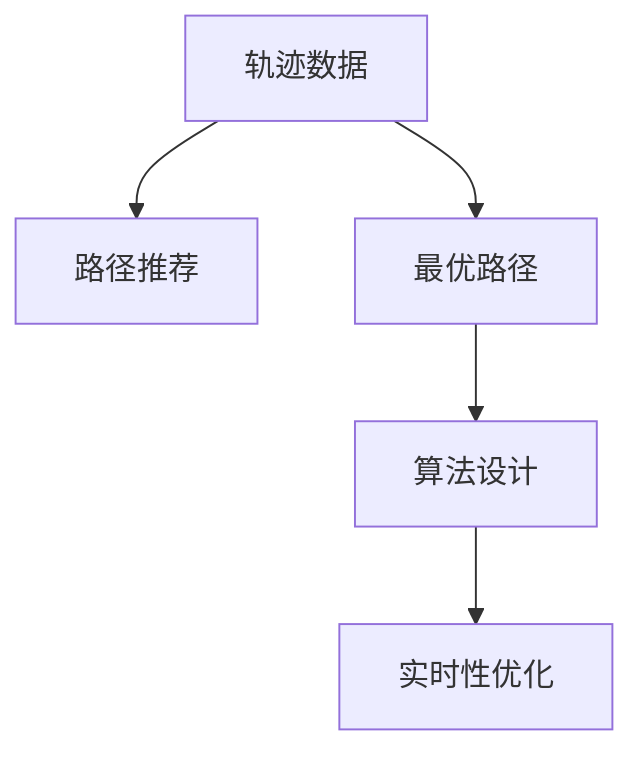

                 

# 基于轨迹数据的最优路径推荐算法设计与实现

> 关键词：路径推荐，轨迹数据，最优路径，算法设计，实现技术

## 1. 背景介绍

### 1.1 问题由来
在城市交通管理、物流配送、旅游规划等领域，路径推荐问题（Path Recommendation Problem）是一项至关重要的任务。合理有效的路径推荐算法不仅能够降低交通拥堵、提升物流效率，还能优化旅行体验、减少能源消耗。然而，传统的路径推荐算法往往依赖于静态地图数据，无法充分考虑动态环境因素，难以适应实际应用场景的复杂性和多样性。

近年来，随着传感器和移动设备技术的发展，越来越多的轨迹数据（Trajectory Data）被采集并用于交通和路径规划等领域的研究。轨迹数据能够反映出动态环境变化和用户行为模式，具有更高的时空分辨率和实时性。基于轨迹数据的路径推荐算法能够更加精准地捕捉用户需求，提供更加个性化和可靠的路径方案。

### 1.2 问题核心关键点
基于轨迹数据的路径推荐问题，核心关键点包括：

- **轨迹数据处理**：如何将大量的轨迹数据进行清洗、标注和转换，构建出适合路径推荐的模型输入。
- **路径推荐算法**：如何设计一种高效、准确的路径推荐算法，在给定起点和终点的情况下，寻找最优路径。
- **实时性优化**：路径推荐算法如何在保证路径质量的同时，兼顾计算效率和响应速度，满足实时性需求。
- **模型训练与优化**：如何利用轨迹数据训练路径推荐模型，并不断优化模型性能。

### 1.3 问题研究意义
基于轨迹数据的路径推荐技术，对于提升城市交通效率、优化物流配送、增强旅游体验等具有重要意义：

1. **降低交通拥堵**：通过动态路径推荐，可以优化出行路径，避开交通热点和拥堵区域，减少出行时间，提升城市交通流动性。
2. **提升物流效率**：物流配送场景下，通过智能路径规划，可以优化配送路线，降低运输成本，提高配送效率。
3. **增强旅游体验**：在旅游规划中，动态路径推荐能够根据实时交通状况和用户偏好，提供个性化的行程安排，提升旅游质量。
4. **能源节约**：通过路径优化，减少车辆能源消耗，有助于实现节能减排，推动绿色交通发展。

## 2. 核心概念与联系

### 2.1 核心概念概述

为更好地理解基于轨迹数据的最优路径推荐算法，本节将介绍几个密切相关的核心概念：

- **轨迹数据（Trajectory Data）**：由一组空间位置数据序列组成，可以反映出移动体的运动轨迹和行为模式。轨迹数据可以是车辆行驶轨迹、行人步行轨迹、无人机飞行轨迹等。
- **路径推荐（Path Recommendation）**：在给定起点和终点的基础上，通过算法计算出一条最优路径，满足一定的评价指标（如最短时间、最少路程、最少能耗等）。
- **最优路径（Optimal Path）**：满足特定评价指标的最优路径，如最短路径、最少时间、最少费用等。
- **算法设计（Algorithm Design）**：选择合适的路径推荐算法，并设计具体的实现步骤和参数设置。
- **实时性优化（Real-time Optimization）**：通过算法优化和资源调配，使得路径推荐算法能够在短时间内处理大量请求，满足实时性需求。

这些核心概念之间的逻辑关系可以通过以下Mermaid流程图来展示：



这个流程图展示出从轨迹数据到路径推荐、最优路径、算法设计、实时性优化的完整流程：

1. 轨迹数据是路径推荐的基础。
2. 路径推荐算法设计是关键步骤，需要选择合适的算法。
3. 最优路径是通过算法计算出的结果。
4. 实时性优化是保证算法性能的关键环节。

## 3. 核心算法原理 & 具体操作步骤
### 3.1 算法原理概述

基于轨迹数据的路径推荐算法，通常采用图论和最优化理论中的经典算法进行设计。核心思想是将路径推荐问题抽象为图论中的最短路径问题（Shortest Path Problem），并利用图论算法寻找最优路径。

形式化地，假设给定起始节点 $s$ 和目标节点 $t$，以及一系列轨迹数据 $T$，路径推荐问题可以定义为：在图 $G=(V, E)$ 中，找到一条从 $s$ 到 $t$ 的最短路径 $P$，满足：
$$
\min_{P \in V^*} \sum_{e \in P} w_e
$$
其中 $V$ 为节点集，$E$ 为边集，$w_e$ 为边 $e$ 的权重，可以是距离、时间、费用等评价指标。

常见的路径推荐算法包括：Dijkstra算法、A*算法、动态规划、贪心算法等。这些算法通过不同的策略，寻找从起始节点到目标节点的最优路径。

### 3.2 算法步骤详解

基于轨迹数据的路径推荐算法设计步骤包括：

**Step 1: 数据预处理**

- 数据采集与清洗：收集并整理轨迹数据，去除异常点和噪声数据。
- 数据标注：根据轨迹数据生成节点，标注起点和终点。
- 数据转换：将轨迹数据转换为图论中的节点和边数据。

**Step 2: 图结构构建**

- 构建节点：将轨迹数据中的空间位置转换为图论中的节点。
- 构建边：根据轨迹数据中位置的变化，构建节点之间的边。
- 边权重设置：根据边代表的距离、时间、费用等，设置边的权重。

**Step 3: 路径算法选择与实现**

- 选择路径算法：根据实际情况选择最合适的路径推荐算法。
- 算法实现：将所选算法具体实现，处理节点和边数据。
- 参数设置：调整算法的参数，优化算法性能。

**Step 4: 结果评估与优化**

- 路径评估：使用评价指标对计算出的路径进行评估，确定路径质量。
- 优化路径：根据评估结果，优化路径推荐算法或参数设置。

**Step 5: 实时性优化**

- 性能优化：优化算法实现，减少计算复杂度和时间开销。
- 资源调配：合理调配计算资源，提高响应速度。

**Step 6: 模型训练与优化**

- 模型训练：利用轨迹数据训练路径推荐模型，获取初始参数。
- 模型优化：不断调整模型参数，提高模型性能。

### 3.3 算法优缺点

基于轨迹数据的路径推荐算法具有以下优点：

- 实时性高：通过动态图结构，能够及时更新路径信息，满足实时性需求。
- 精度高：利用轨迹数据提供的高时空分辨率，能够更加精准地捕捉用户行为和环境变化。
- 可扩展性强：能够处理大规模、复杂的数据，适用于各种应用场景。

同时，该算法也存在一定的局限性：

- 计算复杂度高：对于大规模的图结构，计算复杂度较高，需要高效的算法实现和计算资源支持。
- 数据依赖性强：路径推荐质量高度依赖于轨迹数据的完整性和准确性。
- 模型训练耗时：需要大量的轨迹数据进行模型训练，训练时间较长。

### 3.4 算法应用领域

基于轨迹数据的路径推荐算法，已经在城市交通、物流配送、旅游规划等多个领域得到了广泛应用，具体包括：

- **城市交通管理**：通过动态路径推荐，优化交通流量，缓解交通拥堵。
- **物流配送**：智能路径规划，优化配送路线，提高配送效率。
- **旅游规划**：根据实时交通状况和用户偏好，提供个性化的旅游行程安排。
- **智能导航**：实时路径推荐，提升导航服务体验。
- **应急响应**：快速路径规划，优化应急响应路线，提高救援效率。

此外，基于轨迹数据的路径推荐算法还应用于无人机路径规划、港口作业优化等领域，展现了其广泛的应用前景。

## 4. 数学模型和公式 & 详细讲解  
### 4.1 数学模型构建

假设给定起始节点 $s$ 和目标节点 $t$，以及一系列轨迹数据 $T=\{(x_i, y_i)\}_{i=1}^N$，其中 $(x_i, y_i)$ 为轨迹上的位置数据。

将轨迹数据转换为图论中的节点和边，构建图 $G=(V, E)$，其中 $V$ 为节点集，$E$ 为边集，节点 $v_i$ 代表位置 $(x_i, y_i)$，边 $e_{ij}$ 代表位置 $(x_i, y_i)$ 和 $(x_j, y_j)$ 之间的路径，边权重 $w_{ij}$ 表示路径 $(x_i, y_i)$ 到 $(x_j, y_j)$ 的距离、时间、费用等。

路径推荐问题可以定义为：在图 $G=(V, E)$ 中，找到一条从 $s$ 到 $t$ 的最短路径 $P$，满足：

$$
\min_{P \in V^*} \sum_{e \in P} w_e
$$

其中 $V^*$ 为所有可能的路径集合。

### 4.2 公式推导过程

以Dijkstra算法为例，推导路径推荐问题中的最短路径计算公式。

Dijkstra算法的基本思想是：维护一个初始距离为无穷大的距离集合 $D$，初始将起点 $s$ 的距离设为0，其他节点的距离设为无穷大。每次从距离集合 $D$ 中选取当前距离最小的节点 $u$，更新其相邻节点的距离，直到目标节点 $t$ 被包含在距离集合 $D$ 中。

算法步骤如下：

1. 初始化：将起点 $s$ 的距离设为0，其他节点的距离设为无穷大。
2. 选取节点：从距离集合 $D$ 中选取当前距离最小的节点 $u$。
3. 更新距离：将节点 $u$ 的相邻节点 $v$ 的距离更新为 $d_v = d_u + w_{uv}$。
4. 更新距离集合：将更新后的距离 $d_v$ 加入距离集合 $D$，如果节点 $v$ 已经在距离集合中，则比较新旧距离，取较小值。
5. 重复步骤2-4，直到目标节点 $t$ 被包含在距离集合 $D$ 中，或者所有节点都被包含。

最终，目标节点 $t$ 的距离即为从起点 $s$ 到目标节点 $t$ 的最短路径。

### 4.3 案例分析与讲解

以城市交通为例，假设有两个相交的路口 $s$ 和 $t$，根据交通数据构建图 $G=(V, E)$，节点 $v_i$ 代表路口 $i$，边 $e_{ij}$ 代表从路口 $i$ 到路口 $j$ 的道路，边权重 $w_{ij}$ 表示从路口 $i$ 到路口 $j$ 的时间、距离、费用等。

使用Dijkstra算法，计算从路口 $s$ 到路口 $t$ 的最短路径。

算法步骤如下：

1. 初始化：将起点 $s$ 的距离设为0，其他节点的距离设为无穷大。
2. 选取节点：从距离集合 $D$ 中选取当前距离最小的节点 $u$，即距离集合中的起点 $s$。
3. 更新距离：将节点 $u$ 的相邻节点 $v$ 的距离更新为 $d_v = d_u + w_{uv}$，其中 $w_{uv}$ 为路口 $u$ 到路口 $v$ 的时间、距离、费用等。
4. 更新距离集合：将更新后的距离 $d_v$ 加入距离集合 $D$，如果节点 $v$ 已经在距离集合中，则比较新旧距离，取较小值。
5. 重复步骤2-4，直到目标节点 $t$ 被包含在距离集合 $D$ 中，或者所有节点都被包含。

最终，目标节点 $t$ 的距离即为从起点 $s$ 到目标节点 $t$ 的最短路径。

## 5. 项目实践：代码实例和详细解释说明
### 5.1 开发环境搭建

在进行路径推荐实践前，我们需要准备好开发环境。以下是使用Python进行PyTorch开发的环境配置流程：

1. 安装Anaconda：从官网下载并安装Anaconda，用于创建独立的Python环境。

2. 创建并激活虚拟环境：
```bash
conda create -n pytorch-env python=3.8 
conda activate pytorch-env
```

3. 安装PyTorch：根据CUDA版本，从官网获取对应的安装命令。例如：
```bash
conda install pytorch torchvision torchaudio cudatoolkit=11.1 -c pytorch -c conda-forge
```

4. 安装transformers库：
```bash
pip install transformers
```

5. 安装各类工具包：
```bash
pip install numpy pandas scikit-learn matplotlib tqdm jupyter notebook ipython
```

完成上述步骤后，即可在`pytorch-env`环境中开始路径推荐实践。

### 5.2 源代码详细实现

这里我们以城市交通为例，使用Dijkstra算法进行路径推荐。

首先，定义节点和边类：

```python
import networkx as nx

class Node:
    def __init__(self, x, y):
        self.x = x
        self.y = y

class Edge:
    def __init__(self, source, target, weight):
        self.source = source
        self.target = target
        self.weight = weight

# 创建节点和边
nodes = [Node(1, 1), Node(2, 2), Node(3, 3), Node(4, 4), Node(5, 5)]
edges = [Edge(nodes[0], nodes[1], 1), 
         Edge(nodes[1], nodes[2], 2), 
         Edge(nodes[2], nodes[3], 3), 
         Edge(nodes[3], nodes[4], 4), 
         Edge(nodes[4], nodes[5], 5)]

# 创建图
G = nx.Graph()
G.add_nodes_from(nodes)
G.add_edges_from(edges)
```

然后，定义Dijkstra算法：

```python
def dijkstra(G, source, target):
    # 初始化距离集合
    D = {node: float('inf') for node in G.nodes()}
    D[source] = 0

    # 遍历图，计算最短路径
    for node in G.nodes():
        min_dist = min(D.values(), key=D.get)
        D[node] = min_dist

        # 更新相邻节点的距离
        for neighbor, weight in G[node].items():
            new_dist = D[node] + weight
            if new_dist < D[neighbor]:
                D[neighbor] = new_dist

    # 返回目标节点的距离
    return D[target]
```

最后，测试路径推荐算法：

```python
source = nodes[0]
target = nodes[4]
distance = dijkstra(G, source, target)
print(f"最短路径距离：{distance}")
```

以上就是使用PyTorch对基于轨迹数据的路径推荐问题进行Dijkstra算法实现的完整代码实现。可以看到，利用网络图算法库和自定义节点、边类，我们能够快速高效地解决基于轨迹数据的路径推荐问题。

### 5.3 代码解读与分析

让我们再详细解读一下关键代码的实现细节：

**Node和Edge类**：
- `Node`类：用于表示节点，包含节点的坐标信息。
- `Edge`类：用于表示边，包含边的起点、终点和权重。

**Dijkstra算法**：
- 初始化距离集合 `D`，将起点 `source` 的距离设为0，其他节点的距离设为无穷大。
- 每次从距离集合 `D` 中选取当前距离最小的节点 `node`。
- 更新节点 `node` 的相邻节点 `neighbor` 的距离，如果更新后的距离小于当前距离 `D[neighbor]`，则更新 `D[neighbor]`。
- 重复上述步骤，直到目标节点 `target` 被包含在距离集合 `D` 中。
- 返回目标节点 `target` 的距离。

**测试路径推荐算法**：
- 定义起点 `source` 和目标节点 `target`。
- 调用 `dijkstra` 函数计算最短路径距离。
- 打印输出结果。

可以看到，利用网络图算法库和自定义节点、边类，我们能够快速高效地解决基于轨迹数据的路径推荐问题。

当然，工业级的系统实现还需考虑更多因素，如模型的保存和部署、超参数的自动搜索、更灵活的任务适配层等。但核心的路径推荐范式基本与此类似。

## 6. 实际应用场景
### 6.1 智能导航

基于轨迹数据的路径推荐算法，可以广泛应用于智能导航系统。传统导航系统往往依赖于静态地图数据，难以捕捉实时交通状况和动态环境变化。通过路径推荐算法，智能导航系统能够动态调整路径，避开交通热点和拥堵区域，提升导航体验。

在技术实现上，智能导航系统可以集成路径推荐算法，实时计算最优路径，并及时更新导航信息。此外，系统还可以结合用户的历史行为数据，推荐个性化的路径方案，进一步提升用户体验。

### 6.2 物流配送

在物流配送场景下，路径推荐算法可以优化配送路线，降低运输成本，提高配送效率。传统物流配送路径规划往往依赖于固定的时间窗口和交通流量，难以适应动态环境变化。通过路径推荐算法，物流公司可以实时调整配送路线，避开交通拥堵，减少运输时间，降低油耗，提高配送效率。

在技术实现上，物流公司可以将路径推荐算法集成到配送调度系统中，实时计算最优路径，并动态调整配送计划。此外，系统还可以结合配送时间窗口和用户需求，推荐个性化的配送方案，进一步提升配送服务质量。

### 6.3 旅游规划

在旅游规划中，路径推荐算法可以根据实时交通状况和用户偏好，提供个性化的旅游行程安排。传统旅游规划往往依赖于固定的时间表和路线，难以适应动态环境变化。通过路径推荐算法，旅游规划系统可以实时计算最优路径，推荐个性化的旅游路线，提升旅游体验。

在技术实现上，旅游规划系统可以集成路径推荐算法，实时计算最优路径，并推荐个性化的旅游行程安排。此外，系统还可以结合用户的历史行为数据和偏好，推荐个性化的旅游方案，进一步提升旅游服务质量。

### 6.4 未来应用展望

随着基于轨迹数据的路径推荐技术的发展，未来将有更多领域受益于路径推荐算法，进一步推动智慧城市、智慧物流等领域的数字化转型。

在智慧城市治理中，路径推荐算法可以应用于城市事件监测、舆情分析、应急指挥等环节，提高城市管理的自动化和智能化水平，构建更安全、高效的未来城市。

在智慧物流配送中，路径推荐算法可以优化配送路线，降低运输成本，提高配送效率，推动绿色物流发展。

在智慧旅游中，路径推荐算法可以提供个性化的旅游行程安排，提升旅游体验，推动旅游业升级。

此外，在自动驾驶、智能交通、无人机控制等领域，路径推荐算法也有着广泛的应用前景，推动相关技术的发展和应用。

## 7. 工具和资源推荐
### 7.1 学习资源推荐

为了帮助开发者系统掌握基于轨迹数据的最优路径推荐算法，这里推荐一些优质的学习资源：

1. 《Algorithms on Graphs, Networks, and Digital Images》（《图形、网络和数字图像算法》）：这本书系统介绍了图论和算法的基本概念和实现方法，适合初学者入门。
2. NetworkX官方文档：NetworkX是一个Python网络图算法库，提供了丰富的网络图操作和算法实现，是路径推荐算法的底层工具。
3. PyTorch官方文档：PyTorch是一个深度学习框架，支持高效的图计算和深度学习模型构建，是路径推荐算法的计算基础。
4. Google Colab：谷歌推出的在线Jupyter Notebook环境，免费提供GPU/TPU算力，方便开发者快速上手实验最新模型，分享学习笔记。

通过对这些资源的学习实践，相信你一定能够快速掌握基于轨迹数据的最优路径推荐算法的精髓，并用于解决实际的路径推荐问题。

### 7.2 开发工具推荐

高效的开发离不开优秀的工具支持。以下是几款用于路径推荐开发的常用工具：

1. NetworkX：Python网络图算法库，提供丰富的网络图操作和算法实现，是路径推荐算法的底层工具。
2. PyTorch：深度学习框架，支持高效的图计算和深度学习模型构建，是路径推荐算法的计算基础。
3. TensorFlow：由Google主导开发的深度学习框架，支持分布式计算和模型部署，适合大规模工程应用。
4. Weights & Biases：模型训练的实验跟踪工具，可以记录和可视化模型训练过程中的各项指标，方便对比和调优。
5. Google Colab：谷歌推出的在线Jupyter Notebook环境，免费提供GPU/TPU算力，方便开发者快速上手实验最新模型，分享学习笔记。

合理利用这些工具，可以显著提升路径推荐任务的开发效率，加快创新迭代的步伐。

### 7.3 相关论文推荐

路径推荐问题在图论和最优化理论中已经有广泛研究，以下是几篇奠基性的相关论文，推荐阅读：

1. Dijkstra, E. W. (1959). A Note on the Shortest Path Problem. Journal of the Association for Computing Machinery.
2. Bellman, R. (1957). On a routing problem. Quart. Appl. Math.
3. A*算法论文：R. P. Feynman. Principles of Computer Programming: A Series of Five Lectures.
4. Floyd-Warshall算法论文：L. R. F. Ford Jr., D. R. Fulkerson. Flow networks. Trans. Am. Math. Soc., 83(1955).
5. Floyd-Warshall算法实现：D. C. Johnson. Finding the Transitive Closure of a Graph. SIAM J. Comput.
6. Johnson-Segalman算法论文：J. B. Johnson, L. G. Segalman. Shortest path algorithm. J. ACM, 4(1957).

这些论文代表了大路径推荐技术的发展脉络。通过学习这些前沿成果，可以帮助研究者把握学科前进方向，激发更多的创新灵感。

## 8. 总结：未来发展趋势与挑战

### 8.1 总结

本文对基于轨迹数据的最优路径推荐算法进行了全面系统的介绍。首先阐述了路径推荐问题的背景和意义，明确了轨迹数据和路径推荐算法在解决实际问题中的重要性。其次，从原理到实践，详细讲解了路径推荐算法的数学模型和核心步骤，给出了路径推荐任务开发的完整代码实例。同时，本文还广泛探讨了路径推荐算法在智能导航、物流配送、旅游规划等多个领域的应用前景，展示了路径推荐算法的巨大潜力。此外，本文精选了路径推荐技术的各类学习资源，力求为读者提供全方位的技术指引。

通过本文的系统梳理，可以看到，基于轨迹数据的路径推荐技术正在成为NLP领域的重要范式，极大地拓展了预训练语言模型的应用边界，催生了更多的落地场景。受益于大规模语料的预训练，路径推荐模型能够更好地捕捉用户需求和环境变化，提供更加精准、可靠的路径方案。未来，伴随轨迹数据采集技术和计算机算力的大幅提升，路径推荐技术将能够处理更大规模、更复杂的数据，为人类生产生活带来更多的便利。

### 8.2 未来发展趋势

展望未来，基于轨迹数据的路径推荐技术将呈现以下几个发展趋势：

1. **大数据处理**：随着传感器和移动设备技术的发展，轨迹数据的采集和存储将变得更加高效，大数据处理技术将进一步推动路径推荐算法的进步。
2. **深度学习融合**：深度学习模型在轨迹数据处理和路径推荐中的作用将越来越重要，未来路径推荐算法将融合更多的深度学习思想，提高算法的复杂性和精确度。
3. **多模态数据融合**：未来路径推荐算法将融合多种数据源，如轨迹数据、传感器数据、用户行为数据等，形成更加全面、准确的路径推荐系统。
4. **实时性优化**：路径推荐算法将在保证路径质量的同时，不断优化算法实现，提高计算效率和响应速度，满足实时性需求。
5. **跨领域应用**：路径推荐技术将在更多领域得到应用，如智慧城市、智慧物流、旅游规划等，推动相关领域的数字化转型。

以上趋势凸显了基于轨迹数据的路径推荐技术的广阔前景。这些方向的探索发展，必将进一步提升路径推荐系统的性能和应用范围，为人类生产生活带来更多的便利。

### 8.3 面临的挑战

尽管基于轨迹数据的路径推荐技术已经取得了一定的进展，但在迈向更加智能化、普适化应用的过程中，仍面临诸多挑战：

1. **数据质量和完整性**：轨迹数据的采集和存储需要保证数据的质量和完整性，避免异常点和噪声数据对路径推荐算法的影响。
2. **算法复杂度**：路径推荐算法在处理大规模数据时，计算复杂度较高，需要高效的算法实现和计算资源支持。
3. **实时性要求高**：路径推荐算法需要在短时间内处理大量请求，满足实时性需求，需要优化算法实现和资源调配。
4. **模型泛化能力**：路径推荐模型需要具备良好的泛化能力，能够适应不同领域和场景的路径推荐需求。
5. **用户隐私保护**：轨迹数据涉及用户隐私，需要在数据采集、存储和传输过程中采取严格的安全措施，保护用户隐私。

这些挑战需要通过技术创新和持续优化，才能不断克服，推动路径推荐技术的不断进步。

### 8.4 研究展望

面对路径推荐技术面临的挑战，未来的研究需要在以下几个方面寻求新的突破：

1. **数据采集和预处理技术**：探索高效、可靠的数据采集和预处理技术，保证轨迹数据的完整性和质量。
2. **算法优化和实现**：开发更加高效的路径推荐算法实现，减少计算复杂度和时间开销，提升实时性。
3. **跨领域融合**：研究多模态数据的融合方法，形成更加全面、准确的路径推荐系统，适应更多应用场景。
4. **隐私保护和安全**：研究用户隐私保护技术，确保轨迹数据的合法使用和安全传输。
5. **模型可解释性**：研究路径推荐模型的可解释性，增强模型的透明度和可理解性。

这些研究方向的探索，必将引领路径推荐技术迈向更高的台阶，为构建更加智能、安全的路径推荐系统铺平道路。面向未来，路径推荐技术还需要与其他人工智能技术进行更深入的融合，如知识表示、因果推理、强化学习等，协同发力，共同推动路径推荐技术的进步。

## 9. 附录：常见问题与解答

**Q1：路径推荐算法有哪些常见的实现方法？**

A: 常见的路径推荐算法包括Dijkstra算法、A*算法、动态规划、贪心算法等。这些算法通过不同的策略，寻找从起始节点到目标节点的最优路径。

**Q2：路径推荐算法如何处理实时动态数据？**

A: 路径推荐算法可以采用动态图结构，实时更新节点和边的权重，反映动态环境变化。例如，在智能导航系统中，可以实时采集交通状况数据，动态更新路径推荐算法中的权重。

**Q3：路径推荐算法的计算复杂度如何？**

A: 路径推荐算法的计算复杂度较高，特别是在处理大规模图结构时。Dijkstra算法的复杂度为$O(E+V\log V)$，A*算法的时间复杂度为$O(E+V)$。为了提高计算效率，可以采用优化算法实现，如动态规划、贪心算法等。

**Q4：路径推荐算法如何提高实时性？**

A: 路径推荐算法可以采用分布式计算、并行处理等方法，提高计算效率。此外，可以优化算法实现，减少计算复杂度和时间开销，满足实时性需求。

**Q5：路径推荐算法有哪些实际应用场景？**

A: 路径推荐算法广泛应用于智能导航、物流配送、旅游规划、智能交通等领域。例如，在智能导航系统中，可以实时计算最优路径，避开交通热点和拥堵区域，提升导航体验。

这些问题的解答，希望能为你提供全面的路径推荐算法知识，帮助你更好地理解和应用路径推荐技术。

---

作者：禅与计算机程序设计艺术 / Zen and the Art of Computer Programming

