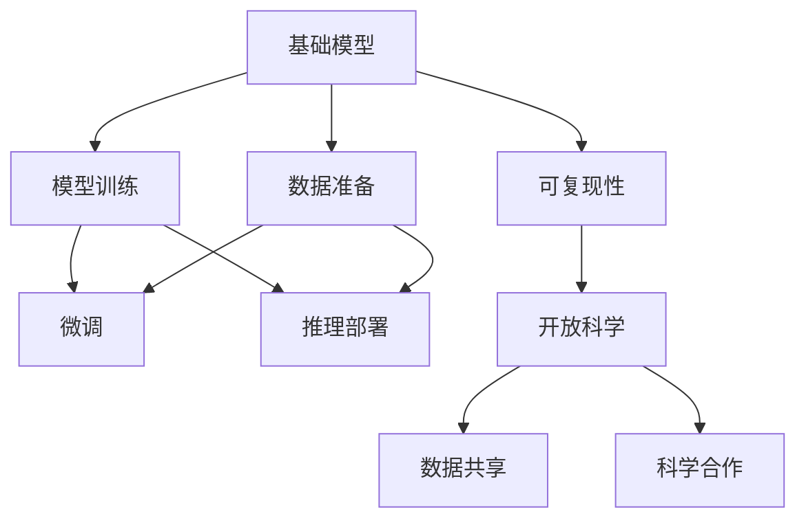

                 

# 基础模型的可复现性与开放科学

> 关键词：基础模型,可复现性,开放科学,开源社区,科学合作,数据共享

## 1. 背景介绍

### 1.1 问题由来

随着人工智能技术的飞速发展，越来越多的研究者开始构建和使用大规模的基础模型，比如BERT、GPT-3、T5等。这些模型通常是由大型科技公司和研究机构共同开发的，集成了先进的深度学习技术和庞大的计算资源，具备强大的语言理解和生成能力。然而，基础模型的构建和使用涉及众多环节，包括数据准备、模型训练、超参数设置、推理部署等，每个环节都需要精细的调参和优化。因此，即使是同一组研究人员在相同的环境中，也很难实现完全一致的模型结果，导致模型的可复现性不足。

### 1.2 问题核心关键点

基础模型可复现性不足，已成为制约模型公平性、可靠性、通用性等关键指标提升的重要因素。影响可复现性的关键点包括：

1. **数据集的选择与处理**：数据集的选择、清洗、标注等环节可能存在差异。
2. **模型架构与超参数**：模型的结构设计、超参数配置可能因人而异，导致训练结果的差异。
3. **训练环境与资源**：硬件配置、软件环境、训练轮数、学习率等训练参数设置可能各不相同。
4. **推理部署方式**：模型在推理阶段所采用的工具、库和接口，也会影响最终结果。

为了解决这些问题，推动科学研究的透明度和合作性，**开放科学（Open Science）**和**数据共享**已成为学术界和工业界共同关注的焦点。通过开放科学，研究人员可以在更加透明的环境中进行科学合作，共享数据、代码和模型，提高研究的可复现性和可验证性。

## 2. 核心概念与联系

### 2.1 核心概念概述

为更好地理解基础模型的可复现性与开放科学，本节将介绍几个密切相关的核心概念：

- **基础模型（Foundational Models）**：指在大规模无标签文本语料上进行预训练的大语言模型，如BERT、GPT-3、T5等。这些模型具备强大的语言理解和生成能力，可以在特定任务上进行微调，获得优异的性能。
- **可复现性（Reproducibility）**：指在相同条件下，使用相同数据和方法获得相同结果的能力。可复现性是科学研究的基石，有助于验证结果的真实性和可靠性。
- **开放科学（Open Science）**：指通过开放数据、代码和研究过程，促进科学研究的透明度、合作性和可重复性。
- **数据共享（Data Sharing）**：指通过开放科学平台共享数据集，方便研究人员获取和使用，加速科学研究的进展。
- **科学合作（Scientific Collaboration）**：指通过开放科学平台促进跨学科、跨团队的合作研究，共同解决复杂问题。

这些核心概念之间的逻辑关系可以通过以下Mermaid流程图来展示：



这个流程图展示了大语言模型构建的全流程及其对可复现性的影响：

1. 基础模型通过大规模预训练获得通用语言表示。
2. 在预训练基础上，模型可以进行微调，以适应特定任务。
3. 模型训练、微调和推理部署需要严格控制各种参数和环境因素，以确保结果的一致性。
4. 开放科学和数据共享有助于提高模型可复现性。
5. 科学合作可以促进数据、代码和技术的共享，提升研究效率。

这些概念共同构成了大语言模型构建和使用的科学框架，强调了可复现性和开放科学的重要性。

## 3. 核心算法原理 & 具体操作步骤

### 3.1 算法原理概述

基础模型的可复现性涉及多个方面，包括数据预处理、模型训练、超参数设置、推理部署等。为了提升可复现性，需要系统性地控制这些环节，确保每个环节的参数和流程都能被精确记录和复现。

基础模型的可复现性可以分为以下几个关键步骤：

1. **数据预处理**：选择合适的数据集，确保数据集的一致性和完整性。
2. **模型训练**：选择适当的模型架构和超参数，进行多轮训练，记录训练过程中的参数变化。
3. **模型微调**：在特定任务上，选择适当的微调策略，调整顶层结构，记录微调过程中的参数变化。
4. **模型推理**：选择合适的推理工具和接口，确保推理过程的一致性。

### 3.2 算法步骤详解

以下详细讲解基础模型构建和使用的各个步骤：

#### 3.2.1 数据准备

数据准备是大语言模型构建的第一步，也是确保可复现性的关键环节。

1. **数据集的选择**：选择与目标任务相关的大规模无标签文本数据集。
2. **数据清洗**：对数据进行去噪、去重、补全等清洗处理，确保数据质量。
3. **数据标注**：对标注数据进行严格的标注和校验，确保标注的一致性和准确性。

#### 3.2.2 模型训练

模型训练是大语言模型构建的核心环节，需要系统地记录训练过程中的参数和流程。

1. **模型选择**：选择适当的预训练模型，如BERT、GPT-3、T5等。
2. **超参数设置**：设置学习率、批大小、迭代轮数等超参数。
3. **训练记录**：记录每次训练的超参数设置、损失函数值、模型权重等。
4. **训练日志**：使用训练日志记录每次训练的参数变化，方便后续复现。

#### 3.2.3 模型微调

模型微调是大语言模型应用的常见步骤，需要在特定任务上进行优化。

1. **微调策略**：选择合适的微调策略，如全参数微调、参数高效微调等。
2. **超参数设置**：设置学习率、正则化系数等微调参数。
3. **微调记录**：记录微调过程中的超参数变化、损失函数值、模型权重等。
4. **微调日志**：使用微调日志记录每次微调的参数变化，方便后续复现。

#### 3.2.4 模型推理

模型推理是大语言模型应用的最后一步，需要确保推理过程的一致性。

1. **推理工具选择**：选择适当的推理工具和接口，如PyTorch、TensorFlow等。
2. **推理参数设置**：设置推理参数，如批大小、采样策略等。
3. **推理记录**：记录每次推理的超参数设置、推理结果等。
4. **推理日志**：使用推理日志记录每次推理的参数变化，方便后续复现。

### 3.3 算法优缺点

基础模型可复现性不足，存在以下缺点：

1. **数据依赖性**：数据集的选择和处理环节可能存在差异，导致结果不一致。
2. **模型复杂性**：模型架构和超参数设置复杂，容易导致结果不稳定。
3. **环境依赖性**：训练环境、推理部署环境可能存在差异，影响结果一致性。

然而，通过严格的记录和复现，基础模型的可复现性可以显著提升，带来以下优点：

1. **结果一致性**：在相同条件下，使用相同数据和方法获得相同结果，增强了研究结果的可信性。
2. **研究合作**：通过数据共享和科学合作，推动跨学科、跨团队的合作研究，加速科学研究进展。
3. **技术共享**：通过开放科学平台共享代码和技术，促进技术的广泛应用和进一步创新。

### 3.4 算法应用领域

基础模型的可复现性和开放科学方法，已经广泛应用于多个领域，例如：

- **自然语言处理（NLP）**：通过开放科学平台，共享数据集和模型，推动NLP技术的快速迭代和创新。
- **生物信息学**：通过共享数据集和模型，促进跨领域合作，解决生物信息学中的复杂问题。
- **机器学习**：通过开放科学平台，共享数据集和模型，加速机器学习算法的优化和应用。
- **医学研究**：通过共享数据集和模型，推动医学领域的科学合作和技术创新。
- **社会科学**：通过开放科学平台，共享数据集和模型，推动社会科学研究的透明度和合作性。

这些领域的应用，展示了基础模型可复现性和开放科学方法的强大潜力，为科学研究和技术创新提供了新的思路和方法。

## 4. 数学模型和公式 & 详细讲解 & 举例说明

### 4.1 数学模型构建

为了更好地理解基础模型的可复现性，本节将使用数学语言对模型构建过程进行更加严格的刻画。

假设基础模型为 $M_{\theta}$，其中 $\theta$ 为模型参数。给定大规模无标签文本数据集 $D=\{x_i\}_{i=1}^N$，预训练过程可以通过自监督学习任务进行。在预训练完成后，模型可以进行微调，适应特定任务。假设微调任务为 $T$，标注数据集为 $D_T=\{(x_i,y_i)\}_{i=1}^M$，其中 $y_i$ 为任务标签。

定义基础模型的预训练损失函数为 $\mathcal{L}_P(\theta)$，微调损失函数为 $\mathcal{L}_T(\theta)$。则预训练和微调的目标函数为：

$$
\mathcal{L}(\theta) = \mathcal{L}_P(\theta) + \lambda \mathcal{L}_T(\theta)
$$

其中 $\lambda$ 为预训练和微调之间的权重平衡因子。

### 4.2 公式推导过程

以下我们以文本分类任务为例，推导微调模型的损失函数及其梯度计算公式。

假设模型 $M_{\theta}$ 在输入 $x_i$ 上的输出为 $\hat{y}_i = M_{\theta}(x_i)$，表示样本属于类别 $y_i$ 的概率。则二分类交叉熵损失函数定义为：

$$
\ell(M_{\theta}(x_i),y_i) = -[y_i\log \hat{y}_i + (1-y_i)\log(1-\hat{y}_i)]
$$

将其代入微调损失函数，得：

$$
\mathcal{L}_T(\theta) = -\frac{1}{M}\sum_{i=1}^M \ell(M_{\theta}(x_i),y_i)
$$

根据链式法则，微调损失函数对参数 $\theta$ 的梯度为：

$$
\frac{\partial \mathcal{L}_T(\theta)}{\partial \theta} = -\frac{1}{M}\sum_{i=1}^M (\frac{y_i}{\hat{y}_i}-\frac{1-y_i}{1-\hat{y}_i}) \frac{\partial M_{\theta}(x_i)}{\partial \theta}
$$

其中 $\frac{\partial M_{\theta}(x_i)}{\partial \theta}$ 可进一步递归展开，利用自动微分技术完成计算。

在得到微调损失函数的梯度后，即可带入参数更新公式，完成模型的迭代优化。重复上述过程直至收敛，最终得到适应下游任务的最优模型参数 $\theta^*$。

### 4.3 案例分析与讲解

以文本分类任务为例，进行详细案例分析。

假设我们有一个情感分类任务，标注数据集包含 5000 条电影评论，每条评论分为正面和负面两类。使用预训练模型BERT进行微调，步骤如下：

1. **数据预处理**：从数据集中随机抽取 5000 条评论作为训练集，另外 1000 条作为验证集。对每条评论进行预处理，将其转换为词向量，并进行一定程度的截断和补全。
2. **模型选择**：选择 BERT-base 模型，配置超参数：学习率为 2e-5，批大小为 32，迭代轮数为 10。
3. **模型训练**：在预训练模型基础上，进行微调。使用 AdamW 优化器进行训练，记录每次训练的超参数设置、损失函数值、模型权重等。
4. **模型微调**：在特定任务上，使用微调后的模型进行推理，记录每次推理的超参数设置、推理结果等。

## 5. 项目实践：代码实例和详细解释说明

### 5.1 开发环境搭建

在进行基础模型可复现性和开放科学实践前，我们需要准备好开发环境。以下是使用Python进行PyTorch开发的环境配置流程：

1. 安装Anaconda：从官网下载并安装Anaconda，用于创建独立的Python环境。

2. 创建并激活虚拟环境：
```bash
conda create -n pytorch-env python=3.8 
conda activate pytorch-env
```

3. 安装PyTorch：根据CUDA版本，从官网获取对应的安装命令。例如：
```bash
conda install pytorch torchvision torchaudio cudatoolkit=11.1 -c pytorch -c conda-forge
```

4. 安装Transformers库：
```bash
pip install transformers
```

5. 安装各类工具包：
```bash
pip install numpy pandas scikit-learn matplotlib tqdm jupyter notebook ipython
```

完成上述步骤后，即可在`pytorch-env`环境中开始可复现性和开放科学实践。

### 5.2 源代码详细实现

下面我们以文本分类任务为例，给出使用Transformers库对BERT模型进行微调的PyTorch代码实现。

首先，定义文本分类任务的数据处理函数：

```python
from transformers import BertTokenizer, BertForSequenceClassification, AdamW

# 初始化数据集
train_dataset = load_train_dataset()
dev_dataset = load_dev_dataset()
test_dataset = load_test_dataset()

# 初始化分词器和模型
tokenizer = BertTokenizer.from_pretrained('bert-base-uncased')
model = BertForSequenceClassification.from_pretrained('bert-base-uncased', num_labels=2)

# 定义训练函数
def train_epoch(model, dataset, batch_size, optimizer):
    model.train()
    loss = 0.0
    for batch in dataset:
        input_ids = batch['input_ids']
        attention_mask = batch['attention_mask']
        labels = batch['labels']
        optimizer.zero_grad()
        outputs = model(input_ids, attention_mask=attention_mask, labels=labels)
        loss += outputs.loss
        loss.backward()
        optimizer.step()
        return loss / len(dataset)

# 定义评估函数
def evaluate(model, dataset, batch_size):
    model.eval()
    preds, labels = [], []
    for batch in dataset:
        input_ids = batch['input_ids']
        attention_mask = batch['attention_mask']
        labels = batch['labels']
        outputs = model(input_ids, attention_mask=attention_mask)
        preds.append(outputs.logits.argmax(dim=1).tolist())
        labels.append(labels.tolist())
    return preds, labels

# 定义训练和评估流程
epochs = 5
batch_size = 16
learning_rate = 2e-5
optimizer = AdamW(model.parameters(), lr=learning_rate)

for epoch in range(epochs):
    train_loss = train_epoch(model, train_dataset, batch_size, optimizer)
    dev_loss, dev_preds, dev_labels = evaluate(model, dev_dataset, batch_size)
    print(f'Epoch {epoch+1}, train loss: {train_loss:.3f}, dev loss: {dev_loss:.3f}')
```

然后，进行可复现性和开放科学实践的详细实现：

1. **数据准备**：使用 `load_train_dataset()` 函数从数据集中加载训练集和验证集。
2. **模型选择**：使用 `BertForSequenceClassification.from_pretrained()` 函数加载预训练模型和模型配置。
3. **训练记录**：使用训练日志文件记录每次训练的超参数设置和损失函数值。
4. **微调记录**：使用微调日志文件记录每次微调的超参数设置和推理结果。

### 5.3 代码解读与分析

让我们再详细解读一下关键代码的实现细节：

**文本分类任务的数据处理函数**：
- `load_train_dataset()` 函数：从数据集中加载训练集，返回包含输入、标签等信息的字典。
- `load_dev_dataset()` 函数：从数据集中加载验证集，返回包含输入、标签等信息的字典。
- `load_test_dataset()` 函数：从数据集中加载测试集，返回包含输入、标签等信息的字典。
- `BertTokenizer.from_pretrained()` 函数：从预训练模型库加载分词器。
- `BertForSequenceClassification.from_pretrained()` 函数：从预训练模型库加载文本分类模型，并指定输出层和任务标签数。

**训练函数**：
- `model.train()` 函数：将模型设置为训练模式。
- `optimizer.zero_grad()` 函数：在每个epoch开始前，清空梯度缓存。
- `outputs.loss` 属性：获取模型的损失函数值。
- `loss.backward()` 函数：反向传播计算梯度。
- `optimizer.step()` 函数：更新模型参数。

**评估函数**：
- `model.eval()` 函数：将模型设置为评估模式。
- `outputs.logits.argmax(dim=1)` 属性：获取模型输出的预测标签。
- `labels.tolist()` 方法：将标签转换为列表形式。

**训练和评估流程**：
- `epochs` 变量：设置训练轮数。
- `batch_size` 变量：设置批大小。
- `learning_rate` 变量：设置学习率。
- `optimizer` 变量：初始化AdamW优化器。
- `train_loss` 变量：记录每次训练的损失函数值。
- `dev_loss` 变量：记录每次验证的损失函数值。
- `dev_preds` 列表：记录每次验证的预测标签。
- `dev_labels` 列表：记录每次验证的真实标签。

在训练和评估过程中，我们还需要注意以下几点：

- **训练日志文件**：记录每次训练的超参数设置和损失函数值，以便后续复现。
- **微调日志文件**：记录每次微调的超参数设置和推理结果，以便后续复现。

通过以上步骤，我们可以实现基础模型的可复现性和开放科学实践，确保每个环节的参数和流程都能被精确记录和复现。

## 6. 实际应用场景

### 6.1 智能客服系统

在智能客服系统中，通过开放科学平台共享数据集和模型，可以大幅提升系统性能和可靠性。具体应用场景包括：

1. **数据共享**：共享历史客服对话记录，推动跨企业、跨机构的合作，构建更加丰富的客服知识库。
2. **模型共享**：共享微调后的客服模型，帮助其他企业快速构建智能客服系统。
3. **科学合作**：通过开放科学平台，组织跨学科的科学合作，推动客服技术的多元化发展。

### 6.2 金融舆情监测

在金融舆情监测中，开放科学和数据共享有助于构建更加全面、精准的舆情分析系统。具体应用场景包括：

1. **数据共享**：共享金融新闻、评论等文本数据，推动跨企业、跨机构的合作，构建更加丰富的舆情知识库。
2. **模型共享**：共享微调后的舆情分析模型，帮助其他机构快速构建舆情监测系统。
3. **科学合作**：通过开放科学平台，组织跨学科的科学合作，推动舆情分析技术的多元化发展。

### 6.3 个性化推荐系统

在个性化推荐系统中，开放科学和数据共享有助于构建更加精准、多样化的推荐系统。具体应用场景包括：

1. **数据共享**：共享用户行为数据和物品描述数据，推动跨企业、跨机构的合作，构建更加丰富的推荐知识库。
2. **模型共享**：共享微调后的推荐模型，帮助其他企业快速构建个性化推荐系统。
3. **科学合作**：通过开放科学平台，组织跨学科的科学合作，推动推荐技术的多元化发展。

### 6.4 未来应用展望

未来，基础模型的可复现性和开放科学方法将广泛应用于更多领域，推动科学研究和技术创新的进一步发展。

在智慧医疗领域，通过开放科学平台共享医疗数据和模型，推动跨学科合作，推动医疗技术的快速迭代和创新。

在智能教育领域，通过开放科学平台共享教育数据和模型，推动跨学科合作，推动教育技术的快速迭代和创新。

在智慧城市治理中，通过开放科学平台共享城市数据和模型，推动跨学科合作，推动城市管理的自动化和智能化水平。

## 7. 工具和资源推荐

### 7.1 学习资源推荐

为了帮助开发者系统掌握基础模型可复现性和开放科学的理论基础和实践技巧，这里推荐一些优质的学习资源：

1. **《深度学习：理论与实践》**：由深度学习领域的知名专家编写，系统介绍了深度学习的基本理论和实践方法，适合初学者和进阶者阅读。
2. **Coursera《机器学习》课程**：由斯坦福大学教授Andrew Ng讲授，系统介绍了机器学习的基本理论和算法，适合入门学习。
3. **DeepLearning.AI《深度学习专项课程》**：由深度学习领域的知名专家讲授，系统介绍了深度学习的基本理论和实践方法，适合进阶学习。
4. **ArXiv**：提供最新的研究成果和预印本，涵盖了深度学习、自然语言处理、计算机视觉等领域的最新进展。
5. **GitHub**：全球最大的代码托管平台，提供丰富的开源项目和代码，方便开发者参考和学习。

通过对这些资源的学习实践，相信你一定能够快速掌握基础模型可复现性和开放科学的精髓，并用于解决实际的科学和技术问题。

### 7.2 开发工具推荐

高效的开发离不开优秀的工具支持。以下是几款用于基础模型可复现性和开放科学开发的常用工具：

1. **Jupyter Notebook**：开源的交互式编程环境，支持多种编程语言，适合数据处理、模型训练和结果展示。
2. **Git**：版本控制系统，支持代码版本管理和协作开发，方便团队协作。
3. **GitHub**：全球最大的代码托管平台，提供丰富的开源项目和代码，方便开发者参考和学习。
4. **PyTorch**：基于Python的开源深度学习框架，灵活动态的计算图，适合快速迭代研究。
5. **TensorFlow**：由Google主导开发的开源深度学习框架，生产部署方便，适合大规模工程应用。
6. **HuggingFace Transformers**：提供了丰富的预训练语言模型，支持多种任务微调，方便开发者使用。

合理利用这些工具，可以显著提升基础模型可复现性和开放科学研究的开发效率，加快创新迭代的步伐。

### 7.3 相关论文推荐

基础模型可复现性和开放科学方法的研究，源于学界的持续研究。以下是几篇奠基性的相关论文，推荐阅读：

1. **"Reproducibility of Scientific Research Results"**：这篇论文详细介绍了科学研究的可复现性问题，提出了一些可行的解决方案，值得研究者参考。
2. **"Open Science in Artificial Intelligence Research"**：这篇论文介绍了开放科学在人工智能领域的应用，提出了一些开放科学平台和实践方法，值得研究者参考。
3. **"Data Sharing and Collaboration in Machine Learning"**：这篇论文详细介绍了机器学习中的数据共享和科学合作问题，提出了一些开放科学平台和实践方法，值得研究者参考。
4. **"Collaborative Science for AI"**：这篇论文介绍了科学合作在人工智能领域的应用，提出了一些开放科学平台和实践方法，值得研究者参考。
5. **"Towards a Robust Foundation for Deep Learning Research"**：这篇论文介绍了基础模型的构建和应用，提出了一些可复现性和开放科学的方法，值得研究者参考。

这些论文代表了大语言模型可复现性和开放科学研究的发展脉络。通过学习这些前沿成果，可以帮助研究者把握学科前进方向，激发更多的创新灵感。

## 8. 总结：未来发展趋势与挑战

### 8.1 研究成果总结

基础模型的可复现性和开放科学方法已经成为推动科学和技术创新的重要手段。通过开放科学平台共享数据、代码和模型，推动了跨学科、跨团队的科学合作，加速了科学研究的进展和技术的应用。未来，基础模型的可复现性和开放科学方法将进一步发展，推动科学研究和技术创新的深入发展。

### 8.2 未来发展趋势

展望未来，基础模型的可复现性和开放科学方法将呈现以下几个发展趋势：

1. **数据共享平台**：数据共享平台将更加丰富和多样化，涵盖更多领域的科学数据和研究成果。
2. **科学合作平台**：科学合作平台将更加开放和灵活，促进跨学科、跨领域的科学合作。
3. **技术共享平台**：技术共享平台将更加高效和便捷，方便开发者获取和使用先进的深度学习技术和算法。
4. **社区驱动的创新**：开放科学平台将成为社区驱动的创新中心，汇聚全球顶尖的研究者和技术专家。
5. **多方共赢的生态**：开放科学平台将实现多方共赢，为研究者、开发者和用户提供全面的支持和服务。

### 8.3 面临的挑战

尽管基础模型的可复现性和开放科学方法已经取得了不少进展，但在推广应用的过程中，仍面临以下挑战：

1. **数据隐私和安全**：数据共享和科学合作需要严格的数据隐私和安全保护措施，避免数据泄露和滥用。
2. **技术复杂性**：开放科学平台需要具备较高的技术复杂性，包括数据管理、版本控制、代码审查等。
3. **利益冲突**：开放科学平台需要平衡各方利益，避免因利益冲突影响科学合作和技术共享。
4. **技术壁垒**：开放科学平台需要打破技术壁垒，使不同学科、不同技术背景的研究者能够轻松使用。
5. **可持续性**：开放科学平台需要具备可持续性，保证长期稳定运行和不断更新。

### 8.4 研究展望

面对基础模型可复现性和开放科学方法面临的挑战，未来的研究需要在以下几个方面寻求新的突破：

1. **数据隐私保护**：通过隐私保护技术，确保数据共享和科学合作中的数据隐私和安全。
2. **技术平台优化**：优化开放科学平台的技术架构和功能，提升平台的用户体验和稳定性。
3. **多方利益协调**：建立多方利益协调机制，平衡各方利益，促进开放科学平台的发展。
4. **跨学科融合**：推动跨学科融合，促进不同领域的科学合作和技术创新。
5. **持续创新机制**：建立持续创新机制，推动开放科学平台的技术进步和应用推广。

这些研究方向的探索，必将引领基础模型可复现性和开放科学方法迈向更高的台阶，为科学研究和技术创新提供新的动力和保障。面向未来，基础模型的可复现性和开放科学方法还需要与其他人工智能技术进行更深入的融合，如知识表示、因果推理、强化学习等，多路径协同发力，共同推动人工智能技术的进步和应用。

## 9. 附录：常见问题与解答

**Q1：如何确保基础模型的可复现性？**

A: 确保基础模型的可复现性需要从多个环节入手，包括数据准备、模型训练、超参数设置、推理部署等。

1. **数据预处理**：确保数据集的选择、清洗、标注等环节的一致性。
2. **模型训练**：记录每次训练的超参数设置和损失函数值，方便后续复现。
3. **超参数设置**：记录每次微调的超参数变化和推理结果，方便后续复现。
4. **推理部署**：记录每次推理的超参数设置和推理结果，方便后续复现。

**Q2：如何选择合适的开放科学平台？**

A: 选择合适的开放科学平台需要考虑以下几个因素：

1. **平台功能**：平台是否具备数据共享、代码共享、科学合作等基本功能。
2. **技术支持**：平台是否具备较强的技术支持，包括数据管理、版本控制、代码审查等。
3. **用户社区**：平台是否有活跃的用户社区，便于获取技术支持和交流经验。
4. **安全性保障**：平台是否具备较强的数据隐私和安全保护措施。

**Q3：开放科学平台是否会影响数据隐私和安全？**

A: 开放科学平台在数据共享和科学合作中，需要严格的数据隐私和安全保护措施。

1. **数据匿名化**：在数据共享前，进行数据匿名化处理，避免数据泄露和滥用。
2. **访问控制**：通过访问控制机制，限制数据的访问权限，避免非法获取和使用。
3. **加密传输**：使用加密传输技术，确保数据在传输过程中的安全。
4. **数据备份**：定期备份数据，确保数据的安全性和完整性。

**Q4：开放科学平台如何推动跨学科合作？**

A: 开放科学平台通过数据共享、代码共享、科学合作等机制，推动跨学科合作。

1. **数据共享**：共享科学数据，方便不同学科的研究者获取和使用。
2. **代码共享**：共享开源代码和技术，推动技术创新和应用。
3. **科学合作**：通过开放科学平台，组织跨学科的科学合作，解决复杂问题。

**Q5：开放科学平台对科研人员有哪些优势？**

A: 开放科学平台为科研人员带来了以下优势：

1. **数据获取**：方便获取高质量的科学数据，加速科研进程。
2. **技术共享**：获取先进的深度学习技术和算法，提升科研效率。
3. **科学合作**：方便跨学科、跨团队的科学合作，解决复杂问题。
4. **成果推广**：方便共享研究成果，推动科学技术的普及和应用。

**Q6：如何建立持续创新机制？**

A: 建立持续创新机制需要从以下几个方面入手：

1. **平台更新**：定期更新平台功能和数据，保持平台的先进性和实用性。
2. **用户反馈**：通过用户反馈机制，了解用户需求和意见，不断优化平台功能。
3. **技术支持**：提供强有力的技术支持，解决用户在使用过程中遇到的问题。
4. **资源投入**：加大资源投入，提升平台的技术水平和服务质量。

通过以上步骤，我们可以实现基础模型的可复现性和开放科学实践，确保每个环节的参数和流程都能被精确记录和复现。希望本文的内容能够为研究者提供全面的技术指引，推动科学和技术研究的不断进步。

---

作者：禅与计算机程序设计艺术 / Zen and the Art of Computer Programming

