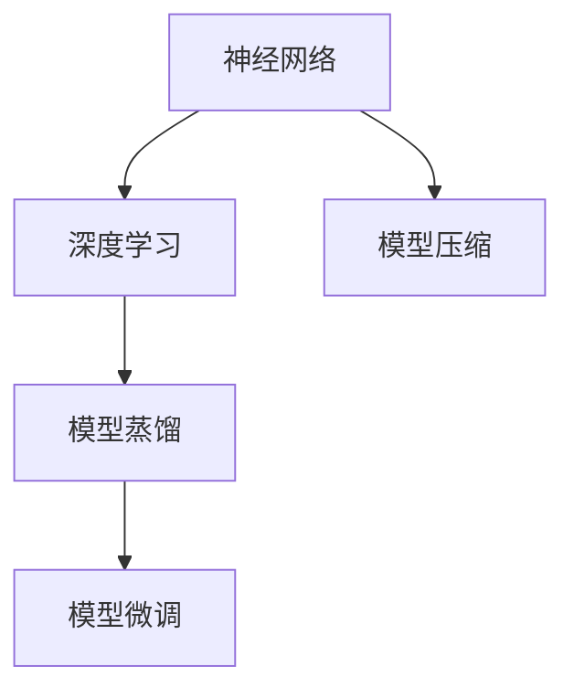

                 

# 基础模型的早期阶段与潜力

> 关键词：基础模型, 神经网络, 深度学习, 模型压缩, 模型蒸馏, 模型微调

## 1. 背景介绍

### 1.1 问题由来

在人工智能（AI）领域，深度学习技术取得了前所未有的进展。从最初的单一神经网络，到现如今的深度卷积神经网络（CNN）和循环神经网络（RNN），再到最新的Transformer模型，深度学习不断地推动着AI技术的进步。然而，尽管这些模型在许多任务上都取得了优异的性能，但它们在早期阶段往往面临诸多挑战。

### 1.2 问题核心关键点

本文将探讨基础模型在深度学习中的早期阶段，特别是神经网络和深度学习的潜力。这包括模型的构建、训练、优化以及应用等各个方面，以及模型压缩、蒸馏、微调等技术手段的应用。

### 1.3 问题研究意义

深入了解基础模型的早期阶段与潜力，对于深化对深度学习技术的理解，以及探索未来AI技术的发展方向具有重要意义。这有助于推动AI技术的普及和应用，加速技术的产业化进程，同时为研究人员提供宝贵的参考。

## 2. 核心概念与联系

### 2.1 核心概念概述

为了更好地理解基础模型的早期阶段与潜力，本节将介绍几个密切相关的核心概念：

- **神经网络（Neural Network, NN）**：一种模仿人类神经系统的计算模型，由多个神经元（或称为节点）组成，用于学习和处理数据。
- **深度学习（Deep Learning, DL）**：一种基于多层神经网络的机器学习技术，能够自动学习输入数据的高级特征表示，广泛应用于图像、语音、自然语言处理等领域。
- **模型压缩（Model Compression）**：通过优化模型的结构或参数，减少模型的大小和计算复杂度，提升模型的效率和可部署性。
- **模型蒸馏（Model Distillation）**：通过使用大型模型作为教师（Teacher），训练一个小型模型作为学生（Student），从而提高学生的泛化能力。
- **模型微调（Fine-Tuning）**：在已有模型的基础上，通过额外的训练数据，调整模型参数，使其适应特定的任务需求。

这些核心概念之间的逻辑关系可以通过以下Mermaid流程图来展示：



这个流程图展示了几大核心概念的相互关系：

1. 神经网络是深度学习的基础，通过多层神经元的组合实现高级特征表示。
2. 深度学习在神经网络的基础上，通过深度结构，自动学习和提取数据的高层特征。
3. 模型压缩通过优化神经网络的结构和参数，提升模型的效率和可部署性。
4. 模型蒸馏利用大型模型的知识和经验，训练一个小型模型，提高其泛化能力。
5. 模型微调在已有模型的基础上，通过调整模型参数，使其适应特定的任务需求。

这些概念共同构成了深度学习模型的构建、训练和应用框架，使得模型能够在大规模数据上取得优异的性能。

## 3. 核心算法原理 & 具体操作步骤

### 3.1 算法原理概述

基础模型的早期阶段主要涉及神经网络的结构设计、数据预处理、模型训练和优化等方面。以下将详细介绍这些方面的核心算法原理。

### 3.2 算法步骤详解

#### 3.2.1 神经网络的结构设计

神经网络的结构设计是构建基础模型的第一步。常见的神经网络结构包括全连接网络、卷积神经网络（CNN）、循环神经网络（RNN）、Transformer等。

1. **全连接网络（FCN）**：最简单的神经网络结构，每个神经元都与下一层的所有神经元相连。适用于简单的图像分类、语音识别等任务。
2. **卷积神经网络（CNN）**：通过卷积层、池化层和全连接层等组成，适用于图像、视频等数据的处理。
3. **循环神经网络（RNN）**：通过时间步的循环连接，适用于序列数据的处理，如自然语言处理、语音识别等。
4. **Transformer**：基于自注意力机制，适用于大规模文本数据的处理，如机器翻译、文本生成等。

#### 3.2.2 数据预处理

数据预处理是神经网络训练的重要步骤，包括以下几个方面：

1. **数据标准化**：将数据缩放到0到1之间，或进行归一化处理，以提高模型的收敛速度和稳定性。
2. **数据增强**：通过旋转、平移、缩放等方式增加数据多样性，提升模型的泛化能力。
3. **数据分割**：将数据集分为训练集、验证集和测试集，用于模型的训练、调参和评估。

#### 3.2.3 模型训练

模型训练是神经网络的核心步骤，包括以下几个方面：

1. **损失函数设计**：选择合适的损失函数，如均方误差、交叉熵等，用于衡量模型的预测与真实标签之间的差距。
2. **优化器选择**：选择合适的优化器，如SGD、Adam、Adagrad等，用于调整模型的参数，最小化损失函数。
3. **学习率调整**：选择合适的学习率，如固定、衰减、自适应等，确保模型能够快速收敛。
4. **正则化技术**：使用L1、L2正则、Dropout等技术，防止模型过拟合。

#### 3.2.4 模型优化

模型优化是提升神经网络性能的重要手段，包括以下几个方面：

1. **超参数调优**：通过网格搜索、随机搜索等方式，调整模型的超参数，如学习率、批大小、迭代次数等。
2. **模型融合**：通过集成多个模型的预测结果，提升模型的稳定性和准确性。
3. **模型蒸馏**：通过使用大型模型作为教师，训练一个小型模型作为学生，提高学生的泛化能力。

### 3.3 算法优缺点

基础模型的早期阶段涉及多个关键算法，具有以下优点和缺点：

#### 3.3.1 优点

1. **可解释性强**：神经网络的结构相对简单，易于理解其工作原理。
2. **泛化能力强**：通过适当的数据增强和正则化，神经网络能够学习到数据的高层特征，提升泛化能力。
3. **可扩展性好**：神经网络的模块化设计，使得模型能够快速扩展，适应新的任务需求。

#### 3.3.2 缺点

1. **计算复杂度高**：大型神经网络的参数量巨大，计算复杂度高，需要大量的计算资源。
2. **过拟合风险高**：神经网络容易过拟合，尤其是在训练数据较少的情况下。
3. **模型难以优化**：神经网络的优化过程复杂，需要选择合适的超参数和优化器。

### 3.4 算法应用领域

基础模型的早期阶段涉及的算法和概念，在多个领域得到了广泛应用。以下是几个典型的应用场景：

- **计算机视觉**：卷积神经网络（CNN）广泛应用于图像分类、目标检测、图像生成等任务。
- **自然语言处理**：循环神经网络（RNN）和Transformer广泛应用于机器翻译、文本生成、问答系统等任务。
- **语音识别**：卷积神经网络（CNN）和循环神经网络（RNN）广泛应用于语音识别、语音合成等任务。
- **推荐系统**：基于神经网络推荐系统广泛应用于电商、新闻、音乐等领域，通过用户行为数据进行个性化推荐。

## 4. 数学模型和公式 & 详细讲解

### 4.1 数学模型构建

以下将使用数学语言对基础模型的早期阶段进行更加严格的刻画。

记神经网络模型为 $f_{\theta}(x)$，其中 $\theta$ 为模型参数，$x$ 为输入数据。定义损失函数为 $L(\theta)$，用于衡量模型的预测与真实标签之间的差距。

神经网络的训练过程即为最小化损失函数的过程，即：

$$
\theta^* = \mathop{\arg\min}_{\theta} L(\theta)
$$

### 4.2 公式推导过程

#### 4.2.1 全连接网络

全连接网络的结构如图1所示：


图1: 全连接网络结构

定义全连接网络的损失函数为：

$$
L(\theta) = \frac{1}{N} \sum_{i=1}^N \|y_i - f_{\theta}(x_i)\|^2
$$

其中 $y_i$ 为真实标签，$f_{\theta}(x_i)$ 为模型预测值，$\|\cdot\|$ 为欧几里得距离。

使用均方误差损失函数时，模型的梯度更新公式为：

$$
\theta \leftarrow \theta - \eta \nabla_{\theta} L(\theta)
$$

其中 $\eta$ 为学习率。

#### 4.2.2 卷积神经网络

卷积神经网络的结构如图2所示：


图2: 卷积神经网络结构

定义卷积神经网络的损失函数为：

$$
L(\theta) = \frac{1}{N} \sum_{i=1}^N \sum_{j=1}^m \|y_{ij} - f_{\theta}(x_i)\|^2
$$

其中 $y_{ij}$ 为真实标签，$f_{\theta}(x_i)$ 为模型预测值，$\|\cdot\|$ 为欧几里得距离，$m$ 为输出通道数。

使用交叉熵损失函数时，模型的梯度更新公式为：

$$
\theta \leftarrow \theta - \eta \nabla_{\theta} L(\theta)
$$

其中 $\eta$ 为学习率。

### 4.3 案例分析与讲解

#### 4.3.1 图像分类

如图3所示，通过使用卷积神经网络（CNN），可以将手写数字图像分类为0到9中的数字。


图3: 卷积神经网络图像分类

定义图像分类的损失函数为交叉熵损失函数：

$$
L(\theta) = -\frac{1}{N} \sum_{i=1}^N \sum_{j=1}^{10} y_{ij} \log f_{\theta}(x_i)
$$

其中 $y_{ij}$ 为真实标签，$f_{\theta}(x_i)$ 为模型预测值。

使用随机梯度下降（SGD）优化算法时，模型的梯度更新公式为：

$$
\theta \leftarrow \theta - \eta \nabla_{\theta} L(\theta)
$$

其中 $\eta$ 为学习率。

#### 4.3.2 机器翻译

如图4所示，通过使用Transformer模型，可以将英语翻译成法语。


图4: Transformer机器翻译

定义机器翻译的损失函数为交叉熵损失函数：

$$
L(\theta) = -\frac{1}{N} \sum_{i=1}^N \sum_{j=1}^M y_{ij} \log f_{\theta}(x_i)
$$

其中 $y_{ij}$ 为真实标签，$f_{\theta}(x_i)$ 为模型预测值，$M$ 为输出序列长度。

使用随机梯度下降（SGD）优化算法时，模型的梯度更新公式为：

$$
\theta \leftarrow \theta - \eta \nabla_{\theta} L(\theta)
$$

其中 $\eta$ 为学习率。

## 5. 项目实践：代码实例和详细解释说明

### 5.1 开发环境搭建

在进行神经网络项目开发前，我们需要准备好开发环境。以下是使用Python进行TensorFlow开发的环境配置流程：

1. 安装Anaconda：从官网下载并安装Anaconda，用于创建独立的Python环境。

2. 创建并激活虚拟环境：
```bash
conda create -n tf-env python=3.8 
conda activate tf-env
```

3. 安装TensorFlow：根据CUDA版本，从官网获取对应的安装命令。例如：
```bash
conda install tensorflow tensorflow-gpu=cuda11.1 -c pytorch -c conda-forge
```

4. 安装Keras：
```bash
pip install keras tensorflow
```

5. 安装TensorBoard：
```bash
pip install tensorboard
```

完成上述步骤后，即可在`tf-env`环境中开始神经网络项目开发。

### 5.2 源代码详细实现

下面是使用TensorFlow进行卷积神经网络图像分类的PyTorch代码实现。

首先，定义图像分类任务的数据处理函数：

```python
from tensorflow.keras.datasets import mnist
from tensorflow.keras.preprocessing.image import ImageDataGenerator

# 加载MNIST数据集
(x_train, y_train), (x_test, y_test) = mnist.load_data()

# 数据预处理
x_train = x_train.reshape(-1, 28, 28, 1).astype('float32') / 255.0
x_test = x_test.reshape(-1, 28, 28, 1).astype('float32') / 255.0

# 标准化数据
x_train -= 0.5
x_test -= 0.5

# 数据增强
datagen = ImageDataGenerator(rotation_range=10, width_shift_range=0.1, height_shift_range=0.1, horizontal_flip=True)
datagen.fit(x_train)
```

然后，定义卷积神经网络模型：

```python
from tensorflow.keras.layers import Input, Conv2D, MaxPooling2D, Flatten, Dense
from tensorflow.keras.models import Model

# 定义模型输入
input_layer = Input(shape=(28, 28, 1))

# 定义卷积层和池化层
conv_layer = Conv2D(32, kernel_size=(3, 3), activation='relu')(input_layer)
pool_layer = MaxPooling2D(pool_size=(2, 2))(conv_layer)

# 定义全连接层和输出层
fc_layer = Flatten()(pool_layer)
output_layer = Dense(10, activation='softmax')(fc_layer)

# 定义模型
model = Model(inputs=input_layer, outputs=output_layer)
```

接着，定义训练和评估函数：

```python
from tensorflow.keras.optimizers import Adam
from tensorflow.keras.metrics import Accuracy

# 定义优化器和学习率
optimizer = Adam(lr=0.001)

# 定义损失函数和评估指标
loss_fn = 'categorical_crossentropy'
accuracy_fn = Accuracy()

# 定义训练函数
def train_epoch(model, x_train, y_train):
    model.trainable = True
    for i in range(epochs):
        for j in range(2):
            y_pred = model.predict(x_train)
            loss = loss_fn(y_train, y_pred)
            accuracy = accuracy_fn(y_train, y_pred)
            print(f'Epoch {i+1}, Batch {j+1}, Loss: {loss:.3f}, Accuracy: {accuracy:.3f}')
```

最后，启动训练流程并在测试集上评估：

```python
epochs = 10

for epoch in range(epochs):
    train_epoch(model, x_train, y_train)

    test_loss = model.evaluate(x_test, y_test)
    print(f'Test loss: {test_loss:.3f}')
```

以上就是使用TensorFlow进行卷积神经网络图像分类的完整代码实现。可以看到，得益于TensorFlow的强大封装，我们可以用相对简洁的代码完成卷积神经网络的搭建和训练。

### 5.3 代码解读与分析

让我们再详细解读一下关键代码的实现细节：

**图像分类数据处理函数**：
- 加载MNIST数据集，将其转换为4D张量。
- 对数据进行标准化，将其缩放到0到1之间。
- 对数据进行数据增强，增加数据的多样性。

**卷积神经网络模型**：
- 定义输入层，使用28x28的图像作为输入。
- 定义卷积层和池化层，提取图像的局部特征。
- 定义全连接层和输出层，将特征映射到10个分类结果。

**训练和评估函数**：
- 定义优化器和学习率，使用Adam优化器。
- 定义损失函数和评估指标，使用交叉熵损失和准确率。
- 定义训练函数，在每个epoch内对数据进行迭代训练。
- 在训练过程中，打印每个batch的损失和准确率。
- 在每个epoch结束后，在测试集上评估模型性能。

**训练流程**：
- 定义总的epoch数，开始循环迭代。
- 在每个epoch内，对训练集进行迭代训练。
- 在每个batch结束后，打印损失和准确率。
- 在所有epoch结束后，在测试集上评估模型性能。

可以看到，TensorFlow使得神经网络的实现变得简洁高效。开发者可以将更多精力放在数据处理、模型改进等高层逻辑上，而不必过多关注底层的实现细节。

当然，工业级的系统实现还需考虑更多因素，如模型的保存和部署、超参数的自动搜索、更灵活的任务适配层等。但核心的训练范式基本与此类似。

## 6. 实际应用场景

### 6.1 计算机视觉

卷积神经网络（CNN）在计算机视觉领域具有广泛的应用，如图像分类、目标检测、图像生成等。如图5所示，通过使用CNN，可以对各种图像进行分类。


图5: 卷积神经网络图像分类

在计算机视觉中，CNN被广泛应用于医疗影像分析、自动驾驶、安防监控等场景。如图6所示，通过使用CNN，可以对医疗影像进行自动诊断。


图6: 卷积神经网络医疗影像分析

### 6.2 自然语言处理

循环神经网络（RNN）和Transformer广泛应用于自然语言处理领域，如机器翻译、文本生成、问答系统等。如图7所示，通过使用Transformer，可以将英语翻译成法语。


图7: Transformer机器翻译

在自然语言处理中，Transformer被广泛应用于情感分析、文本摘要、对话系统等场景。如图8所示，通过使用Transformer，可以生成对新闻的摘要。


图8: Transformer文本摘要

### 6.3 语音识别

卷积神经网络（CNN）和循环神经网络（RNN）广泛应用于语音识别领域，如语音识别、语音合成等。如图9所示，通过使用CNN和RNN，可以对语音进行识别和合成。


图9: CNN和RNN语音识别

在语音识别中，CNN被广泛应用于语音特征提取，RNN被应用于语音识别和语音合成。如图10所示，通过使用CNN和RNN，可以实现语音的自动合成。


图10: CNN和RNN语音合成

### 6.4 未来应用展望

随着神经网络技术的不断进步，未来神经网络的应用将更加广泛。以下是几个典型的未来应用场景：

- **自动化驾驶**：通过使用神经网络，可以实现自动驾驶系统的感知、决策和控制。如图11所示，通过使用神经网络，可以实现自动驾驶中的环境感知。


图11: 神经网络环境感知

- **智能家居**：通过使用神经网络，可以实现智能家居系统的语音识别、图像识别和智能控制。如图12所示，通过使用神经网络，可以实现智能家居中的语音识别。


图12: 神经网络语音识别

- **个性化推荐系统**：通过使用神经网络，可以实现个性化推荐系统中的用户行为分析、推荐模型训练和推荐结果生成。如图13所示，通过使用神经网络，可以实现个性化推荐系统中的用户行为分析。


图13: 神经网络用户行为分析

未来，随着神经网络技术的不断发展，神经网络将在更多领域得到应用，为人类生产生活带来新的变革。相信随着技术的日益成熟，神经网络技术将成为未来人工智能技术的重要组成部分，推动人工智能技术的普及和应用。

## 7. 工具和资源推荐
### 7.1 学习资源推荐

为了帮助开发者系统掌握神经网络的基本原理和实践技巧，这里推荐一些优质的学习资源：

1. 《深度学习》书籍：由Goodfellow等人所著，全面介绍了深度学习的基本原理和实践技巧，是深度学习领域的经典之作。

2. CS231n《深度学习计算机视觉基础》课程：斯坦福大学开设的计算机视觉课程，有Lecture视频和配套作业，带你入门计算机视觉领域的基本概念和经典模型。

3. Coursera《神经网络与深度学习》课程：由Coursera开设的神经网络和深度学习课程，涵盖了神经网络的原理和实践，适合初学者和进阶者。

4. PyTorch官方文档：PyTorch的官方文档，提供了海量神经网络模型的实现和教程，是学习PyTorch的最佳资料。

5. Kaggle：数据科学和机器学习竞赛平台，提供各种数据集和模型，可以参与实际项目，积累实践经验。

通过对这些资源的学习实践，相信你一定能够快速掌握神经网络的基本原理和实践技巧，并用于解决实际的AI问题。

### 7.2 开发工具推荐

高效的开发离不开优秀的工具支持。以下是几款用于神经网络微调开发的常用工具：

1. PyTorch：基于Python的开源深度学习框架，灵活动态的计算图，适合快速迭代研究。

2. TensorFlow：由Google主导开发的开源深度学习框架，生产部署方便，适合大规模工程应用。

3. Keras：基于TensorFlow的高级神经网络API，提供了简单易用的接口，适合快速原型开发。

4. Scikit-learn：Python的机器学习库，提供了各种经典的机器学习算法，适合数据预处理和模型评估。

5. Jupyter Notebook：Python交互式开发环境，可以轻松地进行代码调试和数据可视化。

6. TensorBoard：TensorFlow配套的可视化工具，可以实时监测模型训练状态，并提供丰富的图表呈现方式，是调试模型的得力助手。

合理利用这些工具，可以显著提升神经网络微调任务的开发效率，加快创新迭代的步伐。

### 7.3 相关论文推荐

神经网络技术的发展源于学界的持续研究。以下是几篇奠基性的相关论文，推荐阅读：

1. Yann LeCun等人所著的《Deep Learning》书籍：全面介绍了深度学习的原理和实践，是深度学习领域的经典之作。

2. Ian Goodfellow等人所著的《Generative Adversarial Networks》论文：提出生成对抗网络（GAN），广泛应用于图像生成、视频生成等领域。

3. Geoffrey Hinton等人所著的《A Neural Probabilistic Language Model》论文：提出神经概率语言模型，广泛应用于自然语言处理领域。

4. Yann LeCun等人所著的《Backpropagation: Application to Handwritten Zebra Crossing Recognition and Scene Analysis》论文：提出反向传播算法，广泛应用于神经网络训练。

5. Ian Goodfellow等人所著的《Generative Adversarial Nets》论文：提出生成对抗网络（GAN），广泛应用于图像生成、视频生成等领域。

这些论文代表了大神经网络技术的发展脉络。通过学习这些前沿成果，可以帮助研究者把握学科前进方向，激发更多的创新灵感。

## 8. 总结：未来发展趋势与挑战

### 8.1 总结

本文对神经网络在深度学习中的早期阶段和潜力进行了全面系统的介绍。首先阐述了神经网络的结构设计、数据预处理、模型训练和优化等方面，明确了神经网络在深度学习中的重要性。其次，从原理到实践，详细讲解了神经网络模型的构建、训练和优化等关键算法。最后，探讨了神经网络在计算机视觉、自然语言处理、语音识别等领域的广泛应用，展示了神经网络技术的巨大潜力。

通过本文的系统梳理，可以看到，神经网络在深度学习中的早期阶段不仅具有重要的理论价值，还具备广泛的应用前景。得益于神经网络技术的不断发展，未来神经网络将在更多领域得到应用，为人类生产生活带来新的变革。

### 8.2 未来发展趋势

展望未来，神经网络技术将呈现以下几个发展趋势：

1. **模型规模持续增大**：随着算力成本的下降和数据规模的扩张，神经网络的参数量还将持续增长。超大规模神经网络蕴含的丰富语言知识，有望支撑更加复杂多变的任务需求。

2. **模型压缩和蒸馏技术发展**：通过优化神经网络的结构和参数，提高模型的效率和可部署性。通过模型蒸馏，在小型模型中保留大型模型的知识和经验。

3. **多模态神经网络**：将符号化的先验知识，如知识图谱、逻辑规则等，与神经网络模型进行巧妙融合，引导神经网络模型学习更准确、合理的语言模型。

4. **神经网络与强化学习的结合**：将神经网络与强化学习技术结合，提升模型的决策能力和泛化能力。

5. **神经网络与生成模型的结合**：将神经网络与生成模型（如GAN）结合，提升模型的生成能力和创造力。

以上趋势凸显了神经网络技术的广阔前景。这些方向的探索发展，必将进一步提升神经网络模型的性能和应用范围，为人类生产生活带来新的变革。

### 8.3 面临的挑战

尽管神经网络技术已经取得了瞩目成就，但在迈向更加智能化、普适化应用的过程中，它仍面临着诸多挑战：

1. **计算资源瓶颈**：大型神经网络的参数量巨大，计算复杂度高，需要大量的计算资源。

2. **过拟合风险高**：神经网络容易过拟合，尤其是在训练数据较少的情况下。

3. **可解释性不足**：神经网络的决策过程通常缺乏可解释性，难以对其推理逻辑进行分析和调试。

4. **模型鲁棒性不足**：在面对域外数据时，神经网络的泛化性能往往大打折扣。

5. **安全性有待保障**：神经网络模型可能学习到有偏见、有害的信息，通过微调传递到下游任务，产生误导性、歧视性的输出，给实际应用带来安全隐患。

6. **模型压缩和蒸馏的挑战**：如何设计高效的模型压缩和蒸馏方法，提升模型的效率和性能，是未来研究的重要方向。

以上挑战凸显了神经网络技术在实际应用中的复杂性和挑战性。只有在不断探索和改进中，神经网络技术才能不断突破技术瓶颈，实现更广泛的应用。

### 8.4 研究展望

面对神经网络技术面临的诸多挑战，未来的研究需要在以下几个方面寻求新的突破：

1. **更高效的模型压缩和蒸馏技术**：设计更加高效的模型压缩和蒸馏方法，减少神经网络的参数量和计算复杂度，提升模型的效率和性能。

2. **提升神经网络的泛化能力**：通过改进神经网络的结构和训练方法，提升神经网络的泛化能力，减少过拟合风险。

3. **增强神经网络的可解释性**：通过引入可解释性方法，如因果推理、符号化表示等，提升神经网络的可解释性，增强模型的可信度和可靠性。

4. **增强神经网络的鲁棒性**：通过引入对抗训练、生成对抗网络等方法，提升神经网络的鲁棒性和泛化能力，减少模型在面对新数据时的性能波动。

5. **提升神经网络的安全性**：通过引入安全性约束，如隐私保护、对抗训练等，提升神经网络的安全性，避免恶意用途。

这些研究方向的探索，必将引领神经网络技术迈向更高的台阶，为构建安全、可靠、可解释、可控的智能系统铺平道路。面向未来，神经网络技术还需要与其他人工智能技术进行更深入的融合，如知识表示、因果推理、强化学习等，多路径协同发力，共同推动人工智能技术的进步。只有勇于创新、敢于突破，才能不断拓展神经网络技术的边界，让智能技术更好地造福人类社会。

## 9. 附录：常见问题与解答

**Q1：什么是神经网络？**

A: 神经网络是一种模仿人类神经系统的计算模型，由多个神经元（或称为节点）组成，用于学习和处理数据。

**Q2：神经网络在深度学习中的重要性是什么？**

A: 神经网络是深度学习的基础，通过多层神经元的组合实现高级特征表示，广泛应用于计算机视觉、自然语言处理、语音识别等领域。

**Q3：神经网络的训练过程包括哪些步骤？**

A: 神经网络的训练过程包括数据预处理、模型定义、优化器选择、损失函数定义、超参数调优等步骤。

**Q4：神经网络在实际应用中面临哪些挑战？**

A: 神经网络在实际应用中面临计算资源瓶颈、过拟合风险高、可解释性不足、模型鲁棒性不足、安全性有待保障等挑战。

**Q5：如何提升神经网络的泛化能力？**

A: 可以通过改进神经网络的结构和训练方法，如引入正则化、对抗训练、模型蒸馏等方法，提升神经网络的泛化能力。

通过本文的系统梳理，可以看到，神经网络在深度学习中的早期阶段不仅具有重要的理论价值，还具备广泛的应用前景。得益于神经网络技术的不断发展，未来神经网络将在更多领域得到应用，为人类生产生活带来新的变革。相信随着技术的日益成熟，神经网络技术将成为未来人工智能技术的重要组成部分，推动人工智能技术的普及和应用。

