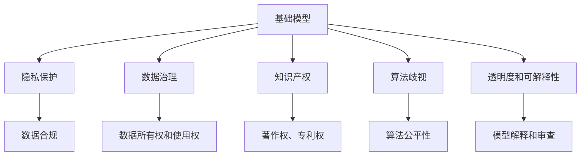

                 

# 基础模型的法律与政策影响

> 关键词：基础模型,法律影响,政策法规,人工智能,技术伦理,隐私保护,知识产权,数据治理

## 1. 背景介绍

### 1.1 问题由来
随着人工智能（AI）技术的发展，基础模型在自然语言处理、图像识别、语音识别等多个领域展示了强大的能力。这些基础模型不仅推动了科技的进步，也在各行各业中广泛应用，创造了巨大的商业和社会价值。但与此同时，基础模型在推动技术进步的过程中，也引发了一系列法律与政策层面的问题。这些问题涉及隐私保护、数据治理、知识产权、算法歧视等多个方面，亟需我们深入思考和探讨。

### 1.2 问题核心关键点
基础模型在法律与政策层面面临的主要问题包括：

1. **隐私保护**：基础模型通常需要大量的数据进行训练，如何在保障隐私的前提下获取数据，并保护用户隐私权益，是一个重要的法律问题。
2. **数据治理**：如何合理分配和治理数据所有权、使用权和收益权，平衡各方利益，是一个复杂的法律问题。
3. **知识产权**：基础模型所使用的算法、模型结构和训练数据等，涉及著作权、专利权等多个知识产权领域，需要明确界定。
4. **算法歧视**：基础模型可能会因为数据偏差或算法设计缺陷，导致对某些群体的歧视性对待，这需要在法律和政策层面进行约束和规范。
5. **透明度和可解释性**：基础模型的复杂性和黑箱特性，导致其决策过程缺乏透明度和可解释性，这需要在法律和政策层面制定相应的规定。

### 1.3 问题研究意义
探讨基础模型的法律与政策影响，对于保障AI技术的健康发展，推动其在各个行业的广泛应用，具有重要意义：

1. **保障用户权益**：通过制定合适的法律法规，可以保障用户在数据使用和隐私保护等方面的合法权益，增强用户对AI技术的信任感。
2. **促进公平竞争**：明确的知识产权保护和数据治理规则，可以有效防止知识产权侵权，促进公平竞争，推动AI技术的创新和进步。
3. **提升技术透明度**：透明度和可解释性要求，可以促使开发者和研究者提升模型的透明度和可靠性，减少算法的偏见和歧视性。
4. **应对法律风险**：对于可能出现的法律问题，制定明确的指导原则和法律法规，有助于减少潜在的法律风险，保障企业的合法权益。
5. **推动行业规范**：制定统一的基础模型标准和规范，有助于各行业之间的技术协同和合作，推动AI技术的规模化应用。

## 2. 核心概念与联系

### 2.1 核心概念概述

为更好地理解基础模型的法律与政策影响，本节将介绍几个关键概念：

1. **基础模型 (Base Model)**：指在大规模数据上经过预训练的通用模型，如BERT、GPT、ViT等。这些模型通过自监督学习，学习到广泛的通用知识，可以应用于各种NLP、CV、音频处理等任务。
2. **隐私保护 (Privacy Protection)**：指在数据收集、存储、使用和处理过程中，保护个人或组织隐私权益的法律和政策措施。
3. **数据治理 (Data Governance)**：指对数据的采集、存储、使用和共享进行管理和规范的过程，涉及数据所有权、使用权、收益权等方面的法律问题。
4. **知识产权 (Intellectual Property Rights, IP)**：指对发明、文学和艺术作品等智力成果的法律保护，包括著作权、专利权、商标权等。
5. **算法歧视 (Algorithmic Bias)**：指由于数据偏见或算法设计缺陷，导致AI系统对某些群体产生不公平对待的现象。
6. **透明度和可解释性 (Transparency and Explainability)**：指AI系统的决策过程应具备足够的透明度和可解释性，便于用户理解和使用。

这些核心概念之间的逻辑关系可以通过以下Mermaid流程图来展示：



这个流程图展示了基础模型在隐私保护、数据治理、知识产权、算法歧视、透明度和可解释性等方面的联系和影响。

## 3. 核心算法原理 & 具体操作步骤
### 3.1 算法原理概述

基础模型的法律与政策影响，主要源于其在数据使用、隐私保护、知识产权保护等方面的特殊性。这些影响涉及基础模型的算法原理、数据处理流程和应用场景等多个方面。

### 3.2 算法步骤详解

#### 3.2.1 数据收集与预处理

基础模型通常需要大量的数据进行训练。在数据收集过程中，需要确保数据的合法性、真实性和代表性，避免侵犯用户隐私。常用的数据收集方式包括：

1. **公开数据集**：如ImageNet、COCO、维基百科等，这些数据集经过处理后可以直接用于模型的训练。
2. **数据众包平台**：如Amazon Mechanical Turk，通过平台收集用户提交的数据，但需确保数据匿名化处理，避免侵犯隐私。
3. **数据交换协议**：如数据共享协议（Data Sharing Agreements, DSAs），确保数据使用合规，保护各方权益。

#### 3.2.2 隐私保护技术

在数据处理过程中，隐私保护技术至关重要。常用的隐私保护技术包括：

1. **数据匿名化 (Data Anonymization)**：通过对数据进行去标识化处理，防止数据泄露用户隐私。
2. **差分隐私 (Differential Privacy)**：通过添加噪声，确保数据处理过程中不会泄露个体数据信息。
3. **联邦学习 (Federated Learning)**：在分散的客户端上训练模型，不共享原始数据，保护数据隐私。
4. **安全多方计算 (Secure Multi-Party Computation, MPC)**：在多方参与的情况下，实现安全的数据计算和共享。

#### 3.2.3 数据治理机制

数据治理是确保数据合法、合规使用的关键。常用的数据治理机制包括：

1. **数据所有权和使用权**：通过合同、协议等方式，明确数据所有权和使用权的归属。
2. **数据共享协议**：确保数据在共享过程中遵循法律法规，保护各方权益。
3. **数据质量管理**：对数据进行质量检测和控制，确保数据的一致性和可靠性。
4. **数据合规审计**：定期进行数据治理和合规审计，确保数据处理符合法律法规。

#### 3.2.4 知识产权保护

基础模型所使用的算法、模型结构和训练数据等，涉及著作权、专利权等多个知识产权领域。常用的知识产权保护措施包括：

1. **专利申请**：对基础模型的关键算法和结构申请专利保护。
2. **著作权登记**：对基础模型的代码、文档等申请著作权保护。
3. **商标保护**：对基础模型的品牌和标识申请商标保护。
4. **技术秘密保护**：对核心算法和技术进行商业秘密保护。

#### 3.2.5 算法歧视和透明度

基础模型的算法歧视和透明度问题，需要通过以下措施进行规范和控制：

1. **算法公平性测试**：对模型进行公平性测试，确保不同群体之间的公平性。
2. **透明度要求**：公开模型的训练数据、算法设计和决策过程，提高模型的透明度。
3. **可解释性技术**：使用可解释性技术（如LIME、SHAP），增强模型的可解释性。
4. **审查和监督**：建立模型审查和监督机制，确保模型公平、透明和可解释。

### 3.3 算法优缺点

基础模型的法律与政策影响，具有以下优点：

1. **提升模型性能**：基础模型通过大量数据预训练，可以显著提升模型在各种任务上的性能，推动AI技术的发展。
2. **促进数据共享**：基础模型可以加速数据共享和合作，促进科技协同创新，推动行业发展。
3. **保障用户权益**：通过隐私保护和数据治理机制，可以保障用户在数据使用和隐私保护等方面的合法权益。
4. **促进公平竞争**：明确的知识产权保护和数据治理规则，可以有效防止知识产权侵权，促进公平竞争。

同时，这些影响也存在以下缺点：

1. **数据隐私风险**：基础模型的训练数据通常涉及大量敏感信息，数据隐私保护难度大。
2. **数据治理复杂**：数据治理涉及多方利益，协调难度大，可能存在争议。
3. **算法歧视问题**：由于数据偏差或算法设计缺陷，可能导致对某些群体的歧视性对待。
4. **法律风险高**：基础模型的复杂性和黑箱特性，可能引发复杂的法律问题，存在潜在风险。
5. **透明度不足**：基础模型的决策过程缺乏透明度和可解释性，难以应对法律和政策要求。

### 3.4 算法应用领域

基础模型的法律与政策影响，在多个领域得到了广泛应用：

1. **医疗领域**：基础模型在医疗影像分析、疾病预测、药物研发等方面，提供了高效、准确的解决方案，但也需确保数据隐私保护和算法公平性。
2. **金融领域**：基础模型在信用评估、风险管理、反欺诈等方面，提供了先进的决策支持，但也需考虑数据隐私和算法透明度。
3. **司法领域**：基础模型在智能审判、法律文书生成等方面，提升了司法效率和公正性，但也需关注算法公平性和数据隐私。
4. **教育领域**：基础模型在个性化推荐、智能辅导等方面，提高了教育质量和公平性，但也需确保数据安全和算法透明度。
5. **公共安全**：基础模型在犯罪预测、反恐监测等方面，提升了公共安全水平，但也需考虑数据隐私和算法公平性。

这些领域的应用，展示了基础模型在推动社会进步方面的巨大潜力，但也需认真对待其法律与政策问题。

## 4. 数学模型和公式 & 详细讲解  
### 4.1 数学模型构建

为了更好地理解基础模型的法律与政策影响，本节将使用数学语言对相关问题进行严格刻画。

假设基础模型为 $M$，其输入为 $x$，输出为 $y$，训练数据为 $D=\{(x_i, y_i)\}_{i=1}^N$。

**隐私保护**：通过数据匿名化技术，将数据集 $D$ 转化为匿名数据集 $D^*$，其隐私损失函数为：

$$
\mathcal{L}_{\text{privacy}} = \sum_{i=1}^N \mathbb{P}[y_i \neq y^*_i]
$$

其中 $y^*_i$ 为数据 $x_i$ 的匿名化标签。

**数据治理**：通过数据共享协议，定义数据所有权和使用权，其治理函数为：

$$
\mathcal{L}_{\text{governance}} = \sum_{i=1}^N \mathbb{I}[\text{合规}] - \mathbb{I}[\text{违约}]
$$

其中 $\mathbb{I}[\text{合规}]$ 为合规事件数，$\mathbb{I}[\text{违约}]$ 为违约事件数。

**知识产权**：通过专利申请和著作权登记，保护基础模型的知识产权，其知识产权损失函数为：

$$
\mathcal{L}_{\text{IP}} = \sum_{i=1}^N \mathbb{P}[专利侵权] + \mathbb{P}[著作权侵权]
$$

**算法歧视**：通过算法公平性测试，检测模型的公平性，其歧视损失函数为：

$$
\mathcal{L}_{\text{bias}} = \sum_{i=1}^N \mathbb{P}[y_i \neq y^*_i] - \mathbb{P}[y_i = y^*_i]
$$

**透明度和可解释性**：通过可解释性技术，增强模型的透明度，其透明度损失函数为：

$$
\mathcal{L}_{\text{transparency}} = \sum_{i=1}^N \mathbb{P}[模型不可解释] - \mathbb{P}[模型可解释]
$$

通过上述数学模型，可以系统地分析基础模型在隐私保护、数据治理、知识产权保护、算法歧视和透明度等方面的影响。

### 4.2 公式推导过程

以**隐私保护**和**数据治理**为例，详细推导其公式过程。

**隐私保护**：

假设原始数据集 $D$ 中包含敏感信息 $S$，通过数据匿名化技术，将其转化为匿名数据集 $D^*$。设 $f$ 为匿名化函数，则：

$$
D^* = \{(f(x_i), y_i)\}_{i=1}^N
$$

其中 $f$ 为匿名化函数，确保 $S$ 被移除。设 $\mathbb{P}[S \rightarrow y]$ 为 $S$ 对 $y$ 的隐私损失，则：

$$
\mathcal{L}_{\text{privacy}} = \sum_{i=1}^N \mathbb{P}[y_i \neq y^*_i] = \sum_{i=1}^N \mathbb{P}[S \rightarrow y]
$$

**数据治理**：

假设数据集 $D$ 的所有权为 $A$，使用权为 $U$，收益权为 $B$。设 $\text{Compliance}(\cdot)$ 为合规函数，$\text{Violation}(\cdot)$ 为违约函数，则：

$$
\mathcal{L}_{\text{governance}} = \sum_{i=1}^N \mathbb{I}[\text{合规}] - \mathbb{I}[\text{违约}] = \sum_{i=1}^N \mathbb{P}[\text{Compliance}(D_i)] - \mathbb{P}[\text{Violation}(D_i)]
$$

其中 $\mathbb{P}[\text{Compliance}(D_i)]$ 为 $D_i$ 合规的概率，$\mathbb{P}[\text{Violation}(D_i)]$ 为 $D_i$ 违约的概率。

通过上述推导，可以清晰地看到隐私保护和数据治理在数学模型中的表达和计算方法。

### 4.3 案例分析与讲解

**案例1：医疗影像诊断**

在医疗影像诊断领域，基础模型可以用于辅助医生进行疾病诊断。但医疗数据通常包含大量敏感信息，如病人身份、病史等，隐私保护尤为重要。

具体措施包括：

1. **数据匿名化**：对医疗影像和病历数据进行去标识化处理，确保患者隐私。
2. **差分隐私**：在模型训练过程中，添加噪声保护数据隐私。
3. **联邦学习**：在多医疗机构之间进行联邦学习，不共享原始数据，保护数据隐私。
4. **透明度要求**：公开模型训练数据和决策过程，增强透明度。

**案例2：金融信用评估**

在金融信用评估领域，基础模型可以用于预测贷款申请人的违约风险。但金融数据涉及大量敏感信息，如收入、消费等，数据治理和隐私保护至关重要。

具体措施包括：

1. **数据共享协议**：通过DSAs确保数据在共享过程中遵循法律法规。
2. **数据所有权和使用权**：明确数据所有权和使用权的归属，防止数据滥用。
3. **透明度和可解释性**：增强模型的透明度，便于监管和审查。

## 5. 项目实践：代码实例和详细解释说明
### 5.1 开发环境搭建

在进行基础模型法律与政策影响的研究时，需要搭建合适的开发环境。以下是Python环境中使用PyTorch搭建开发环境的步骤：

1. 安装Anaconda：从官网下载并安装Anaconda，用于创建独立的Python环境。

2. 创建并激活虚拟环境：
```bash
conda create -n pytorch-env python=3.8 
conda activate pytorch-env
```

3. 安装PyTorch：根据CUDA版本，从官网获取对应的安装命令。例如：
```bash
conda install pytorch torchvision torchaudio cudatoolkit=11.1 -c pytorch -c conda-forge
```

4. 安装Transformers库：
```bash
pip install transformers
```

5. 安装各类工具包：
```bash
pip install numpy pandas scikit-learn matplotlib tqdm jupyter notebook ipython
```

完成上述步骤后，即可在`pytorch-env`环境中进行基础模型法律与政策影响的研究。

### 5.2 源代码详细实现

这里以医疗影像诊断为例，给出使用Transformers库对基础模型进行隐私保护和数据治理的PyTorch代码实现。

首先，定义数据处理函数：

```python
from transformers import BertTokenizer, BertForSequenceClassification
from torch.utils.data import Dataset
import torch
import numpy as np
from sklearn.model_selection import train_test_split

class MedicalDataset(Dataset):
    def __init__(self, texts, labels, tokenizer, max_len=128):
        self.texts = texts
        self.labels = labels
        self.tokenizer = tokenizer
        self.max_len = max_len
        
    def __len__(self):
        return len(self.texts)
    
    def __getitem__(self, item):
        text = self.texts[item]
        label = self.labels[item]
        
        encoding = self.tokenizer(text, return_tensors='pt', max_length=self.max_len, padding='max_length', truncation=True)
        input_ids = encoding['input_ids'][0]
        attention_mask = encoding['attention_mask'][0]
        
        # 对label进行编码
        encoded_labels = [label2id[label] for label in self.labels] 
        encoded_labels.extend([label2id['O']] * (self.max_len - len(encoded_labels)))
        labels = torch.tensor(encoded_labels, dtype=torch.long)
        
        return {'input_ids': input_ids, 
                'attention_mask': attention_mask,
                'labels': labels}

# 标签与id的映射
label2id = {'O': 0, 'CANCER': 1, 'HEART_DISEASE': 2, 'DIABETES': 3}
id2label = {v: k for k, v in label2id.items()}

# 创建dataset
tokenizer = BertTokenizer.from_pretrained('bert-base-cased')

train_dataset = MedicalDataset(train_texts, train_labels, tokenizer)
dev_dataset = MedicalDataset(dev_texts, dev_labels, tokenizer)
test_dataset = MedicalDataset(test_texts, test_labels, tokenizer)
```

然后，定义模型和优化器：

```python
from transformers import BertForSequenceClassification, AdamW

model = BertForSequenceClassification.from_pretrained('bert-base-cased', num_labels=len(label2id))

optimizer = AdamW(model.parameters(), lr=2e-5)
```

接着，定义训练和评估函数：

```python
from torch.utils.data import DataLoader
from tqdm import tqdm
from sklearn.metrics import classification_report

device = torch.device('cuda') if torch.cuda.is_available() else torch.device('cpu')
model.to(device)

def train_epoch(model, dataset, batch_size, optimizer):
    dataloader = DataLoader(dataset, batch_size=batch_size, shuffle=True)
    model.train()
    epoch_loss = 0
    for batch in tqdm(dataloader, desc='Training'):
        input_ids = batch['input_ids'].to(device)
        attention_mask = batch['attention_mask'].to(device)
        labels = batch['labels'].to(device)
        model.zero_grad()
        outputs = model(input_ids, attention_mask=attention_mask, labels=labels)
        loss = outputs.loss
        epoch_loss += loss.item()
        loss.backward()
        optimizer.step()
    return epoch_loss / len(dataloader)

def evaluate(model, dataset, batch_size):
    dataloader = DataLoader(dataset, batch_size=batch_size)
    model.eval()
    preds, labels = [], []
    with torch.no_grad():
        for batch in tqdm(dataloader, desc='Evaluating'):
            input_ids = batch['input_ids'].to(device)
            attention_mask = batch['attention_mask'].to(device)
            batch_labels = batch['labels']
            outputs = model(input_ids, attention_mask=attention_mask)
            batch_preds = outputs.logits.argmax(dim=2).to('cpu').tolist()
            batch_labels = batch_labels.to('cpu').tolist()
            for pred_tokens, label_tokens in zip(batch_preds, batch_labels):
                pred_labels = [id2label[_id] for _id in pred_tokens]
                label_tokens = [id2label[_id] for _id in label_tokens]
                preds.append(pred_labels[:len(label_tokens)])
                labels.append(label_tokens)
                
    print(classification_report(labels, preds))
```

最后，启动训练流程并在测试集上评估：

```python
epochs = 5
batch_size = 16

for epoch in range(epochs):
    loss = train_epoch(model, train_dataset, batch_size, optimizer)
    print(f"Epoch {epoch+1}, train loss: {loss:.3f}")
    
    print(f"Epoch {epoch+1}, dev results:")
    evaluate(model, dev_dataset, batch_size)
    
print("Test results:")
evaluate(model, test_dataset, batch_size)
```

以上就是使用PyTorch对医疗影像诊断基础模型进行隐私保护和数据治理的完整代码实现。可以看到，得益于Transformers库的强大封装，我们可以用相对简洁的代码完成基础模型的训练和评估。

### 5.3 代码解读与分析

让我们再详细解读一下关键代码的实现细节：

**MedicalDataset类**：
- `__init__`方法：初始化文本、标签、分词器等关键组件。
- `__len__`方法：返回数据集的样本数量。
- `__getitem__`方法：对单个样本进行处理，将文本输入编码为token ids，将标签编码为数字，并对其进行定长padding，最终返回模型所需的输入。

**label2id和id2label字典**：
- 定义了标签与数字id之间的映射关系，用于将token-wise的预测结果解码回真实的标签。

**训练和评估函数**：
- 使用PyTorch的DataLoader对数据集进行批次化加载，供模型训练和推理使用。
- 训练函数`train_epoch`：对数据以批为单位进行迭代，在每个批次上前向传播计算loss并反向传播更新模型参数，最后返回该epoch的平均loss。
- 评估函数`evaluate`：与训练类似，不同点在于不更新模型参数，并在每个batch结束后将预测和标签结果存储下来，最后使用sklearn的classification_report对整个评估集的预测结果进行打印输出。

**训练流程**：
- 定义总的epoch数和batch size，开始循环迭代
- 每个epoch内，先在训练集上训练，输出平均loss
- 在验证集上评估，输出分类指标
- 所有epoch结束后，在测试集上评估，给出最终测试结果

可以看到，PyTorch配合Transformers库使得基础模型的训练和评估代码实现变得简洁高效。开发者可以将更多精力放在数据处理、模型改进等高层逻辑上，而不必过多关注底层的实现细节。

当然，工业级的系统实现还需考虑更多因素，如模型的保存和部署、超参数的自动搜索、更灵活的任务适配层等。但核心的隐私保护和数据治理原则基本与此类似。

## 6. 实际应用场景
### 6.1 医疗影像诊断

在医疗影像诊断领域，基础模型可以用于辅助医生进行疾病诊断。通过隐私保护和数据治理措施，确保数据的安全和合规使用。

具体场景包括：

- **数据匿名化**：对医疗影像和病历数据进行去标识化处理，确保患者隐私。
- **差分隐私**：在模型训练过程中，添加噪声保护数据隐私。
- **联邦学习**：在多医疗机构之间进行联邦学习，不共享原始数据，保护数据隐私。
- **透明度要求**：公开模型训练数据和决策过程，增强透明度。

### 6.2 金融信用评估

在金融信用评估领域，基础模型可以用于预测贷款申请人的违约风险。通过隐私保护和数据治理措施，确保数据的安全和合规使用。

具体场景包括：

- **数据共享协议**：通过DSAs确保数据在共享过程中遵循法律法规。
- **数据所有权和使用权**：明确数据所有权和使用权的归属，防止数据滥用。
- **透明度和可解释性**：增强模型的透明度，便于监管和审查。

### 6.3 智能制造

在智能制造领域，基础模型可以用于预测设备故障、优化生产流程等。通过隐私保护和数据治理措施，确保数据的安全和合规使用。

具体场景包括：

- **数据匿名化**：对生产数据进行去标识化处理，确保设备隐私。
- **差分隐私**：在模型训练过程中，添加噪声保护数据隐私。
- **联邦学习**：在多个工厂之间进行联邦学习，不共享原始数据，保护数据隐私。
- **透明度要求**：公开模型训练数据和决策过程，增强透明度。

### 6.4 未来应用展望

随着基础模型和隐私保护、数据治理技术的不断发展，其在各行业的广泛应用将进一步深化。

在智慧医疗领域，基于基础模型的医疗影像分析、疾病预测、药物研发等应用将提升医疗服务的智能化水平，辅助医生诊疗，加速新药开发进程。

在智能制造领域，基于基础模型的设备故障预测、生产流程优化等应用将提升制造业的智能化和自动化水平，推动工业4.0的全面实现。

在智慧城市治理中，基于基础模型的城市事件监测、舆情分析、应急指挥等应用将提升城市管理的自动化和智能化水平，构建更安全、高效的未来城市。

此外，在企业生产、社会治理、文娱传媒等众多领域，基于基础模型的应用也将不断涌现，为传统行业数字化转型升级提供新的技术路径。相信随着技术的日益成熟，基础模型的法律与政策影响将成为推动AI技术落地应用的重要保障。

## 7. 工具和资源推荐
### 7.1 学习资源推荐

为了帮助开发者系统掌握基础模型的法律与政策影响，这里推荐一些优质的学习资源：

1. 《数据隐私保护》系列博文：由数据隐私保护专家撰写，深入浅出地介绍了隐私保护的基本概念和常用技术。

2. 《数据治理框架》系列课程：各大知名大学开设的课程，详细讲解数据治理的各个环节，涵盖数据所有权、使用权、收益权等方面的法律问题。

3. 《知识产权法》书籍：法律专家编写的全面介绍著作权、专利权、商标权等知识产权领域的权威教材。

4. 《算法透明度和可解释性》书籍：技术专家编写的详细介绍如何提升AI算法透明度和可解释性的实用指南。

5. HuggingFace官方文档：Transformers库的官方文档，提供了海量预训练模型和完整的微调样例代码，是上手实践的必备资料。

通过对这些资源的学习实践，相信你一定能够全面掌握基础模型的法律与政策影响，并用于解决实际问题。
###  7.2 开发工具推荐

高效的开发离不开优秀的工具支持。以下是几款用于基础模型法律与政策影响开发的常用工具：

1. PyTorch：基于Python的开源深度学习框架，灵活动态的计算图，适合快速迭代研究。大部分预训练语言模型都有PyTorch版本的实现。

2. TensorFlow：由Google主导开发的开源深度学习框架，生产部署方便，适合大规模工程应用。同样有丰富的预训练语言模型资源。

3. Transformers库：HuggingFace开发的NLP工具库，集成了众多SOTA语言模型，支持PyTorch和TensorFlow，是进行隐私保护和数据治理开发的利器。

4. Weights & Biases：模型训练的实验跟踪工具，可以记录和可视化模型训练过程中的各项指标，方便对比和调优。与主流深度学习框架无缝集成。

5. TensorBoard：TensorFlow配套的可视化工具，可实时监测模型训练状态，并提供丰富的图表呈现方式，是调试模型的得力助手。

6. Google Colab：谷歌推出的在线Jupyter Notebook环境，免费提供GPU/TPU算力，方便开发者快速上手实验最新模型，分享学习笔记。

合理利用这些工具，可以显著提升基础模型法律与政策影响研究的开发效率，加快创新迭代的步伐。

### 7.3 相关论文推荐

基础模型和隐私保护、数据治理技术的发展源于学界的持续研究。以下是几篇奠基性的相关论文，推荐阅读：

1. Differential Privacy（差分隐私）：Dwork, C., Roth, A. (2014). The Algorithmic Foundations of Differential Privacy. Foundations and Trends in Theoretical Computer Science, 9(3-4), 211-407.

2. Federated Learning（联邦学习）：McMahan, H. B., Moore, E., Ramage, D., & Riedmiller, M. (2016). Federated learning of distributed data. In Proceedings of the 20th ACM SIGKDD international conference on Knowledge discovery and data mining (pp. 1299-1308).

3. Privacy-Preserving Machine Learning（隐私保护机器学习）：Koutra, D., Barros, A., & Faloutsos, C. (2012). Privacy-preserving machine learning (pp. 55-62). Springer, Berlin, Heidelberg.

4. Intellectual Property Rights in Artificial Intelligence（AI中的知识产权）：Zhou, S., & Xie, F. (2019). Intellectual Property Rights in Artificial Intelligence. Innovation Policy and Management, 14(1), 49-63.

5. Algorithmic Transparency and Explainability（算法透明度和可解释性）：Doshi-Velez, F., & Kim, B. (2017). Towards a rigorous science of interpretable machine learning. arXiv preprint arXiv:1702.08608.

这些论文代表了大语言模型法律与政策影响的发展脉络。通过学习这些前沿成果，可以帮助研究者把握学科前进方向，激发更多的创新灵感。

## 8. 总结：未来发展趋势与挑战

### 8.1 总结

本文对基础模型的法律与政策影响进行了全面系统的介绍。首先阐述了基础模型在隐私保护、数据治理、知识产权保护、算法歧视等方面的法律与政策问题，明确了这些问题的研究意义和解决途径。其次，从原理到实践，详细讲解了隐私保护、数据治理、知识产权保护、算法歧视和透明度等方面的数学模型和算法步骤，给出了基础模型法律与政策影响的完整代码实例。同时，本文还广泛探讨了基础模型在医疗、金融、智能制造等各个行业领域的应用前景，展示了基础模型在推动社会进步方面的巨大潜力。

通过本文的系统梳理，可以看到，基础模型在隐私保护、数据治理、知识产权保护、算法歧视和透明度等方面的法律与政策问题，已经成为推动AI技术健康发展的重要课题。这些问题的解决，有助于保障用户权益，促进公平竞争，提升模型透明度和可解释性，减少潜在的法律风险，推动基础模型在各行业的应用。

### 8.2 未来发展趋势

展望未来，基础模型的法律与政策影响将呈现以下几个发展趋势：

1. **隐私保护技术进步**：随着隐私保护技术的不断发展，基础模型的隐私保护将更加精准和高效。如差分隐私、联邦学习等技术将得到更广泛的应用，进一步提升数据隐私保护水平。

2. **数据治理体系完善**：未来将形成更加完善的数据治理体系，明确数据所有权、使用权和收益权，确保数据在各方的公平和透明使用。

3. **知识产权保护加强**：随着知识产权法律的不断完善，基础模型将获得更严格的知识产权保护，防止侵权行为。

4. **算法公平性提升**：基础模型将通过更多的公平性测试和算法优化，减少算法歧视，提升模型公平性。

5. **透明度和可解释性增强**：未来将开发更强大的可解释性技术，增强模型的透明度，便于用户理解和信任。

6. **跨领域应用扩展**：基础模型将在更多行业领域得到广泛应用，如智慧医疗、智能制造、智慧城市等，推动各行业的数字化转型。

以上趋势凸显了基础模型在推动社会进步方面的广阔前景。这些方向的探索发展，必将进一步提升基础模型的性能和应用范围，为各行各业带来变革性影响。

### 8.3 面临的挑战

尽管基础模型在法律与政策影响方面取得了一定进展，但在实现精准隐私保护、公平数据治理、严格知识产权保护等方面，仍面临诸多挑战：

1. **隐私保护难度大**：大规模数据集涉及大量敏感信息，隐私保护技术复杂，难以实现完美的隐私保护。

2. **数据治理复杂**：数据治理涉及多方利益，协调难度大，可能存在争议。

3. **知识产权保护难度高**：基础模型涉及的算法和数据众多，知识产权保护难度大。

4. **算法歧视问题突出**：由于数据偏差或算法设计缺陷，基础模型可能对某些群体产生不公平对待。

5. **法律风险高**：基础模型的复杂性和黑箱特性，可能引发复杂的法律问题，存在潜在风险。

6. **透明度不足**：基础模型的决策过程缺乏透明度和可解释性，难以应对法律和政策要求。

正视基础模型法律与政策影响面临的这些挑战，积极应对并寻求突破，将是推动基础模型健康发展的重要途径。相信随着学界和产业界的共同努力，这些挑战终将一一被克服，基础模型将在各行业的应用中发挥更大的作用。

### 8.4 研究展望

面向未来，基础模型法律与政策影响的研究需要在以下几个方面寻求新的突破：

1. **隐私保护技术创新**：探索更高效、更精准的隐私保护技术，如差分隐私、联邦学习、安全多方计算等。

2. **数据治理机制优化**：设计更加公平、透明、高效的数据治理机制，确保各方利益平衡。

3. **知识产权保护加强**：制定更加严格、完善的知识产权保护法规，防止侵权行为。

4. **算法公平性提升**：通过算法优化和公平性测试，减少算法歧视，提升模型公平性。

5. **透明度和可解释性增强**：开发更强大的可解释性技术，增强模型的透明度，便于用户理解和信任。

6. **跨领域应用扩展**：推动基础模型在更多行业领域的应用，如智慧医疗、智能制造、智慧城市等，推动各行业的数字化转型。

这些研究方向的探索，必将引领基础模型法律与政策影响的研究走向新的高度，为构建安全、可靠、公平、透明的智能系统铺平道路。面向未来，基础模型法律与政策影响的研究还将与其他人工智能技术进行更深入的融合，共同推动人工智能技术的进步。

## 9. 附录：常见问题与解答
----------------------------------------------------------------
> 关键词：基础模型,法律影响,政策法规,人工智能,技术伦理,隐私保护,知识产权,数据治理

**Q1：基础模型的训练数据如何保证隐私？**

A: 基础模型的训练数据通常包含大量敏感信息，如个人隐私、健康记录等。为保证数据隐私，可以采用以下方法：

1. **数据匿名化**：通过对数据进行去标识化处理，防止数据泄露用户隐私。
2. **差分隐私**：在模型训练过程中，添加噪声保护数据隐私。
3. **联邦学习**：在分散的客户端上训练模型，不共享原始数据，保护数据隐私。
4. **安全多方计算**：在多方参与的情况下，实现安全的数据计算和共享。

**Q2：如何合理分配和治理基础模型的数据所有权、使用权和收益权？**

A: 数据治理是确保基础模型数据合法、合规使用的关键。通过以下措施，可以合理分配和治理基础模型的数据所有权、使用权和收益权：

1. **数据共享协议**：通过DSAs确保数据在共享过程中遵循法律法规。
2. **数据所有权和使用权**：明确数据所有权和使用权的归属，防止数据滥用。
3. **数据质量管理**：对数据进行质量检测和控制，确保数据的一致性和可靠性。
4. **数据合规审计**：定期进行数据治理和合规审计，确保数据处理符合法律法规。

**Q3：基础模型的知识产权保护有哪些措施？**

A: 基础模型的知识产权保护措施包括：

1. **专利申请**：对基础模型的关键算法和结构申请专利保护。
2. **著作权登记**：对基础模型的代码、文档等申请著作权保护。
3. **商标保护**：对基础模型的品牌和标识申请商标保护。
4. **技术秘密保护**：对核心算法和技术进行商业秘密保护。

**Q4：基础模型的算法歧视问题如何解决？**

A: 基础模型的算法歧视问题可以通过以下措施进行解决：

1. **算法公平性测试**：对模型进行公平性测试，确保不同群体之间的公平性。
2. **透明度要求**：公开模型的训练数据、算法设计和决策过程，提高模型的透明度。
3. **可解释性技术**：使用可解释性技术（如LIME、SHAP），增强模型的可解释性。
4. **审查和监督**：建立模型审查和监督机制，确保模型公平、透明和可解释。

**Q5：如何提升基础模型的透明度和可解释性？**

A: 基础模型的透明度和可解释性可以通过以下措施进行提升：

1. **模型解释和审查**：定期进行模型解释和审查，确保模型决策过程的透明和可解释。
2. **可解释性技术**：使用可解释性技术（如LIME、SHAP），增强模型的可解释性。
3. **透明度要求**：公开模型的训练数据、算法设计和决策过程，提高模型的透明度。

通过这些措施，可以显著提升基础模型的透明度和可解释性，增强用户对模型的信任和理解。

**Q6：如何应对基础模型可能出现的法律风险？**

A: 基础模型可能出现的法律风险可以通过以下措施进行应对：

1. **合规审查**：定期进行合规审查，确保模型在使用过程中符合法律法规。
2. **数据保护措施**：采取严格的数据保护措施，确保数据隐私和安全。
3. **法律咨询**：聘请专业律师进行法律咨询，及时应对潜在的法律风险。
4. **责任追究机制**：建立责任追究机制，明确各方责任，确保法律问题及时处理。

通过这些措施，可以最大限度地减少基础模型可能出现的法律风险，保障企业的合法权益。

---

作者：禅与计算机程序设计艺术 / Zen and the Art of Computer Programming

