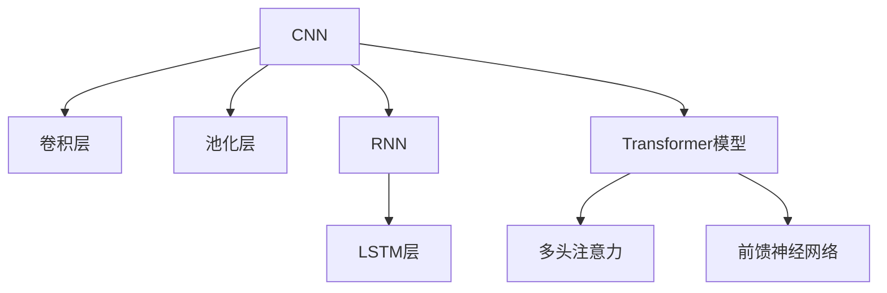

                 

# 基础模型的现有模型研究

在人工智能的快速发展中，基础模型的研究一直是推动技术进步的关键因素之一。本文将深入探讨现有基础模型及其研究进展，通过核心概念、算法原理、实际应用等多角度解析，为读者提供一个全面、系统的理解。

## 1. 背景介绍

随着深度学习技术的发展，基础模型如卷积神经网络(CNN)、循环神经网络(RNN)和Transformer等在图像、语音、自然语言处理(NLP)等领域取得了显著的成就。这些模型的出现，为各种实际应用提供了强有力的支持，但也引发了对模型研究的新思考。本文旨在梳理现有基础模型的核心研究进展，并展望未来的研究方向。

## 2. 核心概念与联系

### 2.1 核心概念概述

在深度学习中，基础模型是构成复杂神经网络的基本单元。它们在图像识别、语音识别、自然语言处理等领域有着广泛的应用。以下是几个关键的基础模型：

- 卷积神经网络（Convolutional Neural Network, CNN）：通过卷积层和池化层对图像数据进行特征提取和降维处理，适用于图像分类、目标检测等任务。
- 循环神经网络（Recurrent Neural Network, RNN）：通过循环层对时间序列数据进行建模，适用于语言模型、机器翻译等任务。
- Transformer模型：利用自注意力机制，在序列数据上实现高效的特征提取，适用于自然语言处理、图像生成等任务。

这些基础模型之间具有紧密的联系，共同构成了深度学习的核心框架。通过理解这些基础模型的原理和应用，可以更好地把握深度学习技术的本质。

### 2.2 核心概念原理和架构的 Mermaid 流程图



这个图表展示了CNN、RNN、Transformer模型的基本结构和组件，通过箭头指明了它们之间的联系和数据流动方向。

## 3. 核心算法原理 & 具体操作步骤

### 3.1 算法原理概述

基础模型算法原理的核心在于通过多层神经网络结构对输入数据进行特征提取和映射，从而实现分类、回归、生成等任务。以CNN为例，其基本结构包括卷积层、池化层、全连接层等，通过多层次的特征提取和融合，实现对复杂图像的识别和分类。

### 3.2 算法步骤详解

以CNN为例，其典型训练步骤包括：

1. **数据预处理**：将图像数据进行归一化、缩放等预处理，确保数据一致性。
2. **模型初始化**：选择适当的损失函数和优化算法，初始化模型参数。
3. **前向传播**：将输入数据通过卷积层、池化层等进行特征提取。
4. **反向传播**：计算损失函数对模型参数的梯度，更新参数。
5. **迭代训练**：重复上述步骤，直至模型收敛。

### 3.3 算法优缺点

基础模型算法在图像识别、语音识别、自然语言处理等领域具有广泛的应用。其优点在于：

- 适应性强：适用于各种复杂数据结构。
- 可扩展性好：通过增加层数和神经元数量，可以提升模型性能。

但同时也存在以下缺点：

- 计算复杂度高：需要大量的计算资源和时间。
- 数据依赖性强：对训练数据的质量和数量要求较高。

### 3.4 算法应用领域

基础模型算法广泛应用于计算机视觉、自然语言处理、语音识别等领域。

- 在计算机视觉中，CNN模型常用于图像分类、目标检测、人脸识别等任务。
- 在自然语言处理中，RNN模型和Transformer模型常用于语言建模、机器翻译、文本生成等任务。
- 在语音识别中，CNN和RNN模型常用于语音识别、语音合成等任务。

## 4. 数学模型和公式 & 详细讲解 & 举例说明

### 4.1 数学模型构建

以CNN为例，其数学模型可表示为：

$$
\text{output} = \text{softmax}(\text{conv}(\text{relu}(\text{conv}(\text{relu}(\text{input})))) + \text{pooling}(\text{conv}(\text{relu}(\text{conv}(\text{relu}(\text{input})))) + \text{fc}(\text{relu}(\text{pooling}(\text{conv}(\text{relu}(\text{conv}(\text{relu}(\text{input}))))))
$$

其中，$\text{conv}$表示卷积操作，$\text{relu}$表示ReLU激活函数，$\text{pooling}$表示池化操作，$\text{fc}$表示全连接层，$\text{softmax}$表示softmax激活函数。

### 4.2 公式推导过程

CNN的卷积层公式为：

$$
\text{conv}(\text{input}, \text{filter}) = \sum_{i,j,k} \text{input}_i \cdot \text{filter}_{j,k}
$$

其中，$\text{input}$表示输入数据，$\text{filter}$表示卷积核。

### 4.3 案例分析与讲解

以LeNet模型为例，其卷积层和池化层的设计如下：

```python
import torch.nn as nn
import torchvision.transforms as transforms

# 定义LeNet模型
class LeNet(nn.Module):
    def __init__(self):
        super(LeNet, self).__init__()
        self.conv1 = nn.Conv2d(1, 6, 5)
        self.pool = nn.MaxPool2d(2, 2)
        self.conv2 = nn.Conv2d(6, 16, 5)
        self.fc1 = nn.Linear(16 * 5 * 5, 120)
        self.fc2 = nn.Linear(120, 84)
        self.fc3 = nn.Linear(84, 10)

    def forward(self, x):
        x = self.pool(nn.functional.relu(self.conv1(x)))
        x = self.pool(nn.functional.relu(self.conv2(x)))
        x = x.view(-1, 16 * 5 * 5)
        x = nn.functional.relu(self.fc1(x))
        x = nn.functional.relu(self.fc2(x))
        x = self.fc3(x)
        return x
```

这个模型包括两个卷积层和三个全连接层，通过多层卷积和池化操作，实现对28x28像素的手写数字图像的分类。

## 5. 项目实践：代码实例和详细解释说明

### 5.1 开发环境搭建

为了进行基础模型的开发，需要先安装必要的软件环境。这里以PyTorch为例，介绍开发环境的搭建步骤：

1. 安装Anaconda：从官网下载并安装Anaconda，用于创建独立的Python环境。
2. 创建并激活虚拟环境：
```bash
conda create -n pytorch-env python=3.8 
conda activate pytorch-env
```
3. 安装PyTorch：根据CUDA版本，从官网获取对应的安装命令。例如：
```bash
conda install pytorch torchvision torchaudio cudatoolkit=11.1 -c pytorch -c conda-forge
```
4. 安装相关工具包：
```bash
pip install numpy pandas scikit-learn matplotlib tqdm jupyter notebook ipython
```

完成上述步骤后，即可在`pytorch-env`环境中进行基础模型的开发。

### 5.2 源代码详细实现

以CNN为例，展示其完整代码实现：

```python
import torch
import torch.nn as nn
import torchvision.transforms as transforms
from torchvision.datasets import MNIST

# 定义CNN模型
class CNN(nn.Module):
    def __init__(self):
        super(CNN, self).__init__()
        self.conv1 = nn.Conv2d(1, 32, 3, 1)
        self.conv2 = nn.Conv2d(32, 64, 3, 1)
        self.pool = nn.MaxPool2d(2, 2)
        self.fc1 = nn.Linear(64 * 28 * 28, 128)
        self.fc2 = nn.Linear(128, 10)

    def forward(self, x):
        x = self.pool(nn.functional.relu(self.conv1(x)))
        x = self.pool(nn.functional.relu(self.conv2(x)))
        x = x.view(-1, 64 * 28 * 28)
        x = nn.functional.relu(self.fc1(x))
        x = self.fc2(x)
        return x

# 加载数据集
train_dataset = MNIST(root='./data', train=True, transform=transforms.ToTensor(), download=True)
test_dataset = MNIST(root='./data', train=False, transform=transforms.ToTensor(), download=True)

# 定义训练参数
batch_size = 64
learning_rate = 0.001
num_epochs = 10

# 定义训练函数
def train(model, device, train_loader, optimizer, criterion):
    model.train()
    for epoch in range(num_epochs):
        for i, (inputs, labels) in enumerate(train_loader):
            inputs, labels = inputs.to(device), labels.to(device)
            optimizer.zero_grad()
            outputs = model(inputs)
            loss = criterion(outputs, labels)
            loss.backward()
            optimizer.step()

# 定义测试函数
def test(model, device, test_loader, criterion):
    model.eval()
    correct = 0
    total = 0
    with torch.no_grad():
        for inputs, labels in test_loader:
            inputs, labels = inputs.to(device), labels.to(device)
            outputs = model(inputs)
            _, predicted = torch.max(outputs.data, 1)
            total += labels.size(0)
            correct += (predicted == labels).sum().item()
    return correct / total

# 加载数据集
train_loader = torch.utils.data.DataLoader(train_dataset, batch_size=batch_size, shuffle=True)
test_loader = torch.utils.data.DataLoader(test_dataset, batch_size=batch_size, shuffle=False)

# 定义优化器和损失函数
model = CNN().to(device)
criterion = nn.CrossEntropyLoss()
optimizer = torch.optim.Adam(model.parameters(), lr=learning_rate)

# 开始训练
train(model, device, train_loader, optimizer, criterion)
test(model, device, test_loader, criterion)
```

在这个代码中，定义了一个简单的CNN模型，用于对手写数字图像进行分类。通过加载MNIST数据集，定义训练和测试函数，使用Adam优化器和交叉熵损失函数，完成模型的训练和测试。

### 5.3 代码解读与分析

**CNN模型定义**：
- `__init__`方法：初始化卷积层、池化层和全连接层。
- `forward`方法：定义前向传播过程，包括卷积、池化、全连接等操作。

**数据集加载**：
- 使用`torchvision.datasets.MNIST`加载MNIST数据集，定义训练集和测试集。
- 使用`transforms.ToTensor()`将数据转换为张量格式。

**训练函数**：
- 在每个epoch中，遍历训练数据集，将输入和标签移至指定设备（如GPU）。
- 使用优化器和损失函数更新模型参数，记录损失。

**测试函数**：
- 在测试集上评估模型性能，计算准确率。

**训练和测试流程**：
- 定义训练参数，包括批大小、学习率、迭代轮数等。
- 加载训练集和测试集，定义优化器和损失函数。
- 通过训练函数和测试函数，完成模型的训练和测试过程。

## 6. 实际应用场景

### 6.1 图像识别

基础模型在图像识别领域有着广泛的应用。例如，基于CNN的图像分类任务，可以用于自动驾驶、医学影像分析、安防监控等。通过训练和微调，基础模型可以识别各种复杂场景下的对象，提高自动化水平和决策效率。

### 6.2 自然语言处理

基础模型在自然语言处理领域同样有着重要应用。例如，基于RNN和Transformer的机器翻译、语言生成、文本分类等任务，可以用于多语言交流、智能客服、情感分析等。通过训练和微调，基础模型可以处理各种语言输入，提供高效的语言理解和生成能力。

### 6.3 语音识别

基础模型在语音识别领域也有着重要应用。例如，基于CNN和RNN的语音识别、语音合成等任务，可以用于智能家居、语音助手、电话客服等。通过训练和微调，基础模型可以准确识别和生成语音信号，提升人机交互的智能化水平。

## 7. 工具和资源推荐

### 7.1 学习资源推荐

为了深入了解基础模型的相关知识，以下是一些优质的学习资源：

1. 《深度学习》书籍：由Ian Goodfellow等人撰写，全面介绍了深度学习的原理和应用。
2. 《Python深度学习》书籍：由Francois Chollet撰写，详细介绍了使用Keras框架进行深度学习开发。
3. 《计算机视觉：算法与应用》书籍：由Richard Szeliski撰写，深入浅出地介绍了计算机视觉的核心算法。
4. 《自然语言处理综论》书籍：由Daniel Jurafsky和James H. Martin撰写，全面介绍了自然语言处理的基本概念和经典模型。
5. 《TensorFlow实战》书籍：由Manning出版社编写，详细介绍了TensorFlow框架的使用方法。

这些书籍提供了丰富的理论知识和实践经验，可以帮助读者系统掌握基础模型的相关知识。

### 7.2 开发工具推荐

高效的开发离不开优秀的工具支持。以下是几款用于基础模型开发的常用工具：

1. PyTorch：基于Python的开源深度学习框架，灵活动态的计算图，适合快速迭代研究。
2. TensorFlow：由Google主导开发的开源深度学习框架，生产部署方便，适合大规模工程应用。
3. Keras：高层次的深度学习框架，易于使用，适合初学者入门。
4. MXNet：由亚马逊开发的深度学习框架，支持多种编程语言，适合跨平台开发。
5. JAX：基于Python的高级自动微分库，支持动态图和静态图计算，适合高效数学运算。

合理利用这些工具，可以显著提升基础模型的开发效率，加快创新迭代的步伐。

### 7.3 相关论文推荐

基础模型的研究源于学界的持续研究。以下是几篇奠基性的相关论文，推荐阅读：

1. Convolutional Neural Networks for Image Recognition（LeNet论文）：提出了卷积神经网络的基本结构，开创了计算机视觉的新时代。
2. Rethinking the Inception Architecture for Computer Vision（Inception论文）：提出了Inception模块，进一步提升了卷积神经网络的特征提取能力。
3. Long Short-Term Memory（LSTM论文）：提出长短期记忆网络，改善了循环神经网络在序列数据处理上的效果。
4. Attention Is All You Need（Transformer论文）：提出Transformer模型，利用自注意力机制，提升了自然语言处理的效果。
5. Deep Residual Learning for Image Recognition（ResNet论文）：提出残差网络，解决了深度神经网络训练中的梯度消失问题。

这些论文代表了大模型研究的发展脉络。通过学习这些前沿成果，可以帮助研究者把握学科前进方向，激发更多的创新灵感。

## 8. 总结：未来发展趋势与挑战

### 8.1 总结

本文对基础模型的核心研究进展进行了全面系统的介绍。首先阐述了CNN、RNN和Transformer等基础模型的基本原理和应用，明确了它们在深度学习技术中的重要地位。其次，从原理到实践，详细讲解了基础模型的数学模型和训练步骤，给出了完整代码实例。同时，本文还广泛探讨了基础模型在图像识别、自然语言处理、语音识别等多个领域的应用前景，展示了基础模型在实际应用中的广泛价值。最后，本文精选了基础模型的各类学习资源，力求为读者提供全方位的技术指引。

通过本文的系统梳理，可以看到，基础模型在深度学习技术中占据核心地位，广泛应用于图像、语音、自然语言处理等领域。未来，伴随深度学习技术的不断发展，基础模型的研究也将继续深入，推动人工智能技术的进步。

### 8.2 未来发展趋势

展望未来，基础模型将呈现以下几个发展趋势：

1. 模型规模持续增大。随着算力成本的下降和数据规模的扩张，基础模型的参数量还将持续增长。超大规模基础模型蕴含的丰富特征表示，有望支撑更加复杂多变的应用场景。
2. 模型结构持续优化。通过引入更加高效的架构，如残差网络、Inception模块、Transformer等，基础模型的计算效率和特征提取能力将进一步提升。
3. 跨领域融合趋势增强。基础模型将与其他AI技术（如知识图谱、强化学习等）进行更深入的融合，实现跨领域的协同建模。
4. 多模态基础模型兴起。基础模型将扩展到视觉、语音、文本等多模态数据的处理，实现多模态信息的融合。
5. 深度学习与符号学习结合。基础模型将与符号化的先验知识结合，提升模型的推理能力和可解释性。
6. 基础模型在伦理与安全方面的探讨增加。如何保证基础模型的透明性、公平性和安全性，成为未来的重要研究方向。

这些趋势凸显了基础模型研究的广阔前景。这些方向的探索发展，必将进一步提升基础模型的性能和应用范围，为人工智能技术的进步提供有力支持。

### 8.3 面临的挑战

尽管基础模型研究取得了显著成果，但在迈向更加智能化、普适化应用的过程中，仍面临诸多挑战：

1. 计算资源瓶颈。大规模基础模型需要大量的计算资源和时间，超大规模基础模型更是如此。如何高效利用计算资源，优化模型训练和推理效率，将是重要的研究方向。
2. 数据质量与标注成本。基础模型需要大量高质量的数据进行训练，获取标注数据成本较高。如何在数据质量不足的情况下，提升模型的性能，也是亟待解决的问题。
3. 模型复杂性与可解释性。基础模型通常较为复杂，难以解释其决策过程。如何在保证模型性能的同时，提高模型的可解释性，将是重要的研究课题。
4. 模型泛化性与鲁棒性。基础模型在不同领域、不同数据分布上的泛化能力有限，模型鲁棒性不足。如何提升模型的泛化能力和鲁棒性，避免灾难性遗忘，还需要更多理论和实践的积累。
5. 伦理与安全问题。基础模型可能学习到有害的偏见和信息，传递到下游任务中，造成伦理和安全问题。如何避免模型的有害偏见，确保模型的安全性，将是未来的重要研究方向。

### 8.4 研究展望

面对基础模型面临的种种挑战，未来的研究需要在以下几个方面寻求新的突破：

1. 探索无监督和半监督学习基础模型。摆脱对大规模标注数据的依赖，利用自监督学习、主动学习等无监督和半监督范式，最大限度利用非结构化数据，实现更加灵活高效的基础模型。
2. 研究参数高效和计算高效的基础模型。开发更加参数高效的模型架构，在固定大部分基础模型参数的情况下，只更新极少量的任务相关参数。同时优化模型的计算图，减少前向传播和反向传播的资源消耗，实现更加轻量级、实时性的部署。
3. 融合因果和对比学习范式。通过引入因果推断和对比学习思想，增强基础模型的建立稳定因果关系的能力，学习更加普适、鲁棒的语言表征，从而提升模型的泛化性和抗干扰能力。
4. 引入更多先验知识。将符号化的先验知识，如知识图谱、逻辑规则等，与神经网络模型进行巧妙融合，引导基础模型学习更准确、合理的语言模型。同时加强不同模态数据的整合，实现视觉、语音等多模态信息与文本信息的协同建模。
5. 结合因果分析和博弈论工具。将因果分析方法引入基础模型，识别出模型决策的关键特征，增强输出解释的因果性和逻辑性。借助博弈论工具刻画人机交互过程，主动探索并规避模型的脆弱点，提高系统稳定性。
6. 纳入伦理道德约束。在基础模型训练目标中引入伦理导向的评估指标，过滤和惩罚有偏见、有害的输出倾向。同时加强人工干预和审核，建立模型行为的监管机制，确保输出符合人类价值观和伦理道德。

这些研究方向将引领基础模型研究迈向更高的台阶，为构建安全、可靠、可解释、可控的智能系统铺平道路。面向未来，基础模型研究还需要与其他人工智能技术进行更深入的融合，如知识表示、因果推理、强化学习等，多路径协同发力，共同推动基础模型技术的进步。

## 9. 附录：常见问题与解答

**Q1：基础模型是否可以用于所有类型的任务？**

A: 基础模型在图像识别、语音识别、自然语言处理等领域具有广泛的应用。但其适用范围和效果也受数据特性和任务类型的影响。例如，在语音识别中，CNN不如RNN和LSTM效果好；在文本分类中，RNN不如Transformer效果好。因此，选择合适的基础模型是任务成功的重要前提。

**Q2：基础模型的训练时间是否可以压缩？**

A: 大规模基础模型的训练时间较长，需要大量的计算资源和时间。但通过优化训练过程，如使用小批量梯度下降、模型剪枝、量化等技术，可以显著缩短训练时间，提升训练效率。此外，分布式训练技术也可以加速大规模基础模型的训练。

**Q3：如何提高基础模型的泛化能力？**

A: 提高基础模型的泛化能力，可以从以下几个方面入手：
1. 数据增强：通过增加数据样本的多样性，提高模型的泛化能力。
2. 正则化：使用L2正则、Dropout等技术，防止模型过拟合。
3. 迁移学习：将基础模型在不同任务之间进行迁移学习，提升模型的泛化能力。
4. 模型集成：通过模型集成技术，结合多个模型的输出，提升模型的泛化能力。

**Q4：基础模型在推理过程中需要注意哪些问题？**

A: 基础模型在推理过程中需要注意以下几个问题：
1. 推理速度：基础模型通常较为复杂，推理速度较慢。需要优化模型结构，使用优化推理算法，提升推理速度。
2. 推理准确性：基础模型可能存在推理错误，需要引入异常检测和纠偏机制，提升推理准确性。
3. 推理资源：基础模型需要大量的计算资源和内存，需要合理分配资源，避免资源浪费。

**Q5：如何保证基础模型的可解释性？**

A: 基础模型的可解释性可以通过以下几个方面实现：
1. 特征可视化：通过可视化特征图，帮助理解模型的决策过程。
2. 模型简化：通过模型剪枝、量化等技术，简化模型结构，提高模型的可解释性。
3. 模型解释工具：使用工具如LIME、SHAP等，对模型的决策进行解释。

---

作者：禅与计算机程序设计艺术 / Zen and the Art of Computer Programming

