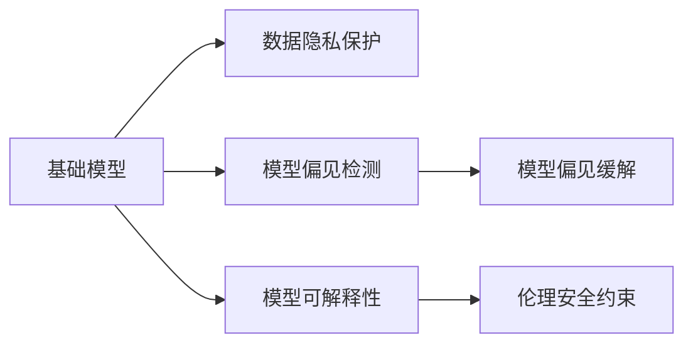

                 

# 基础模型的社会责任与治理

## 1. 背景介绍

### 1.1 问题由来
随着人工智能技术的不断进步，基础模型（如深度学习模型、大规模语言模型等）在各行各业的应用越来越广泛。这些模型通过大规模数据训练，具备强大的学习能力，可以自主完成复杂的任务，甚至在某些领域超越人类。然而，基础模型的应用也带来了一些社会问题，例如：

1. **数据隐私**：基础模型需要大量的标注数据进行训练，这些数据往往包含敏感信息，可能被滥用或泄露，对个人隐私造成威胁。
2. **模型偏见**：基础模型可能会学习到数据中的隐性偏见，导致在决策过程中产生歧视性的结果，影响社会公平。
3. **可解释性不足**：基础模型往往是"黑盒"系统，难以解释其内部的决策过程，导致在关键决策场景中缺乏透明度和可信度。
4. **伦理安全风险**：基础模型的输出可能被恶意使用，如生成虚假信息、操纵舆论等，对社会稳定和安全造成威胁。

这些问题要求我们重新审视基础模型的应用，如何在确保技术进步的同时，保障社会的公平、安全、透明和可信，是当前亟需解决的重要课题。

### 1.2 问题核心关键点
要解决上述问题，关键在于如何平衡技术进步与伦理安全之间的关系。具体来说，我们需要在以下几个方面进行深入研究和探索：

1. **数据隐私保护**：如何设计隐私保护机制，确保在数据收集和处理过程中，个人信息不被泄露或滥用。
2. **模型偏见检测和缓解**：如何检测和修正模型中的偏见，确保其在不同群体中公平对待。
3. **模型可解释性**：如何提高模型的可解释性，使决策过程透明化，增强公众对模型的信任。
4. **伦理安全约束**：如何设立伦理安全框架，引导基础模型在负责任的范围内应用，避免被恶意利用。

本文将重点探讨这些问题，并给出一些可能的解决方案。

## 2. 核心概念与联系

### 2.1 核心概念概述

要深入理解基础模型的社会责任与治理，首先需要明确一些关键概念：

- **基础模型**：指的是通过大规模数据训练，具有强大学习和泛化能力的深度学习模型，如深度神经网络、大规模语言模型等。
- **数据隐私**：指在数据收集、存储、传输和处理过程中，保护个人或群体信息不被泄露或滥用的过程。
- **模型偏见**：指模型在训练过程中学习到的隐性偏见，可能导致在决策过程中对某些群体产生歧视。
- **可解释性**：指模型能够清晰地解释其决策过程和结果，使决策过程透明化，增强公众对模型的信任。
- **伦理安全约束**：指在基础模型应用中设立的伦理道德规范和约束机制，确保模型在负责任的范围内使用，避免被恶意利用。

这些概念之间存在密切联系，共同构成了基础模型应用的社会责任框架。

### 2.2 核心概念原理和架构的 Mermaid 流程图



这个流程图展示了基础模型应用过程中，数据隐私保护、模型偏见检测、模型偏见缓解、模型可解释性和伦理安全约束之间的联系和依赖关系。

## 3. 核心算法原理 & 具体操作步骤

### 3.1 算法原理概述

基础模型的社会责任与治理，涉及多个子问题的解决。每个子问题都有其独特的算法原理和操作步骤，本节将分别介绍。

### 3.2 算法步骤详解

#### 数据隐私保护

1. **数据匿名化**：对原始数据进行去标识化处理，使个人身份信息无法被直接关联。常用的方法包括数据脱敏、数据加密等。
2. **差分隐私**：在数据分析和模型训练过程中，通过添加噪声或限制信息暴露，确保数据隐私不被泄露。常用的差分隐私算法包括Laplace机制、高斯机制等。
3. **联邦学习**：在分布式环境中，各节点仅在本地训练模型，模型参数不共享，确保数据隐私。通过分布式优化算法，各节点协同训练全局模型。

#### 模型偏见检测

1. **公平性指标**：定义公平性指标，如平等性指标、代表性指标等，用于量化模型在不同群体中的表现。
2. **偏差检测算法**：如 fairness auditing、Robust Fairness Auditing等，通过模拟不同群体数据分布，检测模型中的偏见。
3. **多维度偏见检测**：不仅检测显性偏见，还检测隐性偏见，如隐式类别偏差、隐式关系偏差等。

#### 模型偏见缓解

1. **重新采样**：通过重采样技术，平衡不同群体的数据分布，减少模型对少数群体的歧视。
2. **权重调整**：对少数群体的样本进行加权处理，提高其在模型训练中的权重。
3. **对抗训练**：通过生成对抗样本，增强模型的鲁棒性，减少偏见影响。

#### 模型可解释性

1. **局部可解释性**：通过局部特征解释技术，如LIME、SHAP等，解释模型在单个样本上的决策过程。
2. **全局可解释性**：通过全局解释技术，如特征重要性分析、模型结构分析等，解释模型在整体上的决策过程。
3. **交互式解释**：通过交互式解释工具，如Explainable AI平台，用户可以与模型进行交互，深入理解模型决策过程。

#### 伦理安全约束

1. **伦理规范**：设立伦理规范，明确基础模型应用中的责任和义务，如不传播虚假信息、不侵犯隐私等。
2. **安全约束机制**：通过监控、审核、制裁等机制，确保模型在实际应用中遵守伦理规范。
3. **透明性和问责制**：建立透明性和问责制机制，确保模型应用过程中有明确的责任方和问责机制。

### 3.3 算法优缺点

#### 数据隐私保护

- **优点**：通过技术手段保护数据隐私，避免数据泄露和滥用，保障个人和群体信息安全。
- **缺点**：技术实现复杂，隐私保护与数据利用之间存在权衡。

#### 模型偏见检测

- **优点**：通过量化和检测模型偏见，确保模型在决策过程中公平对待不同群体。
- **缺点**：偏见检测可能受到数据分布和模型设计的影响，存在一定的局限性。

#### 模型偏见缓解

- **优点**：通过调整模型参数和数据分布，减少模型中的偏见，提高模型公平性。
- **缺点**：偏见缓解可能导致模型性能下降，需要在公平性和性能之间进行平衡。

#### 模型可解释性

- **优点**：提高模型的透明度和可信度，增强用户对模型的信任。
- **缺点**：可解释性技术复杂，实现成本高，对复杂模型的解释效果有限。

#### 伦理安全约束

- **优点**：设立伦理规范和约束机制，确保基础模型在负责任的范围内使用，避免被恶意利用。
- **缺点**：伦理规范可能受到文化和价值观的影响，需要结合具体场景进行设计和调整。

### 3.4 算法应用领域

基础模型的社会责任与治理技术已经广泛应用于以下领域：

- **医疗健康**：保护患者隐私，确保医疗数据安全，避免医疗偏见。
- **金融服务**：保护客户隐私，避免金融歧视，提高金融服务的公平性。
- **社会治理**：建立伦理规范，确保社会治理过程中的透明性和问责制。
- **公共安全**：保护公民隐私，确保公共安全技术的应用符合伦理规范。

## 4. 数学模型和公式 & 详细讲解 & 举例说明

### 4.1 数学模型构建

在基础模型应用中，数据的隐私保护、模型偏见检测、模型偏见缓解、模型可解释性和伦理安全约束都需要建立相应的数学模型，以量化和优化这些过程。

#### 数据隐私保护

- **数据脱敏模型**：
  $$
  \tilde{D} = f(D, \epsilon)
  $$
  其中，$D$ 为原始数据，$f$ 为脱敏函数，$\epsilon$ 为噪声参数，控制数据脱敏程度。

#### 模型偏见检测

- **公平性指标模型**：
  $$
  F = \frac{1}{n} \sum_{i=1}^n \frac{1}{C} \sum_{c=1}^C |y_{i,c} - \hat{y}_{i,c}|
  $$
  其中，$n$ 为样本数，$C$ 为类别数，$y_{i,c}$ 为实际标签，$\hat{y}_{i,c}$ 为模型预测标签。

#### 模型偏见缓解

- **权重调整模型**：
  $$
  \theta = \theta_0 + \alpha \sum_{i=1}^N (w_i - \overline{w}) x_i
  $$
  其中，$\theta$ 为模型参数，$\theta_0$ 为初始参数，$w_i$ 为样本权重，$\overline{w}$ 为样本权重均值，$\alpha$ 为调整系数。

#### 模型可解释性

- **局部可解释性模型**：
  $$
  \hat{\eta} = f(x, \theta)
  $$
  其中，$\hat{\eta}$ 为模型预测结果，$x$ 为输入特征，$\theta$ 为模型参数。

#### 伦理安全约束

- **透明性和问责制模型**：
  $$
  A = f(R, D)
  $$
  其中，$A$ 为应用场景，$R$ 为伦理规范，$D$ 为数据分布。

### 4.2 公式推导过程

#### 数据脱敏模型

- **Laplace机制**：
  $$
  \tilde{x}_i = x_i + \epsilon_i \cdot \Delta
  $$
  其中，$\epsilon_i \sim \text{Laplace}(0, \Delta)$。

#### 公平性指标模型

- **Robust Fairness Auditing**：
  $$
  F = \frac{1}{n} \sum_{i=1}^n \frac{1}{C} \sum_{c=1}^C |y_{i,c} - \hat{y}_{i,c}|
  $$

#### 权重调整模型

- **加权处理**：
  $$
  \theta = \theta_0 + \alpha \sum_{i=1}^N (w_i - \overline{w}) x_i
  $$

#### 透明性和问责制模型

- **透明性和问责制机制**：
  $$
  A = f(R, D)
  $$

### 4.3 案例分析与讲解

#### 数据隐私保护案例

某公司计划利用用户浏览记录进行个性化广告推荐，但由于用户隐私问题，公司决定采用差分隐私技术保护用户数据。具体做法如下：

1. **数据匿名化**：将用户ID替换为匿名标识符，使单个用户无法被识别。
2. **差分隐私**：在推荐模型训练过程中，向数据添加Laplace噪声，确保模型无法识别单个用户。

#### 模型偏见检测案例

某银行的信用评分模型在训练过程中，学习到了不同性别客户的隐性偏见，导致对女性客户的信用评分普遍偏低。公司决定采用公平性指标检测偏见，具体做法如下：

1. **公平性指标定义**：定义平等性指标，计算男女客户评分差值。
2. **偏见检测算法**：通过公平性指标检测，发现评分模型对女性客户存在偏见。
3. **偏见缓解**：调整评分模型，对女性客户进行权重调整，提高其评分。

#### 模型可解释性案例

某医疗机构使用深度学习模型进行疾病预测，但由于模型复杂，医生难以理解模型决策过程。为了增强模型的可解释性，公司决定采用LIME技术，具体做法如下：

1. **局部可解释性模型**：对单个病人数据进行LIME解释，输出局部解释结果。
2. **全局可解释性模型**：通过特征重要性分析，输出全局解释结果。
3. **交互式解释工具**：使用Explainable AI平台，医生可以与模型进行交互，深入理解模型决策过程。

#### 伦理安全约束案例

某社交平台使用深度学习模型进行内容推荐，但由于模型输出可能包含虚假信息，导致用户误信。为了建立伦理安全约束，公司决定设立透明性和问责制机制，具体做法如下：

1. **伦理规范制定**：制定平台内容审核规范，明确禁止虚假信息传播。
2. **透明性机制**：公开模型决策过程和推荐依据，增强平台透明性。
3. **问责制机制**：建立投诉举报机制，对虚假信息进行追责，确保平台内容真实性。

## 5. 项目实践：代码实例和详细解释说明

### 5.1 开发环境搭建

在进行基础模型社会责任与治理的实践开发中，需要搭建一个完整的开发环境。以下是具体的搭建步骤：

1. **安装Python**：
   ```bash
   sudo apt-get update
   sudo apt-get install python3-pip
   ```

2. **安装依赖库**：
   ```bash
   pip install numpy pandas scikit-learn matplotlib tensorflow
   ```

3. **安装TensorFlow**：
   ```bash
   pip install tensorflow==2.4.1
   ```

4. **安装TensorBoard**：
   ```bash
   pip install tensorboard
   ```

5. **安装TensorFlow Extended (TFX)**：
   ```bash
   pip install tfx
   ```

### 5.2 源代码详细实现

以下是一个使用TensorFlow Extended (TFX)进行数据隐私保护和模型偏见检测的示例代码：

```python
import tensorflow as tf
import tensorflow_privacy as tf_privacy
import tensorflow_datasets as tfds

# 数据加载和预处理
train_data, test_data = tfds.load(name='cifar10', split=['train', 'test'], shuffle_files=True, as_supervised=True)
train_dataset = tfds.as_dataframe(train_data)
test_dataset = tfds.as_dataframe(test_data)

# 数据匿名化
train_dataset = train_dataset.apply(tf_privacy.anonymize(tensorflow_privacy.CategoricalNoise(epsilon=0.1)))
test_dataset = test_dataset.apply(tf_privacy.anonymize(tensorflow_privacy.CategoricalNoise(epsilon=0.1)))

# 模型训练和偏见检测
model = tf.keras.models.Sequential([
  tf.keras.layers.Conv2D(32, (3, 3), activation='relu', input_shape=(32, 32, 3)),
  tf.keras.layers.MaxPooling2D((2, 2)),
  tf.keras.layers.Flatten(),
  tf.keras.layers.Dense(10, activation='softmax')
])
model.compile(optimizer='adam', loss='sparse_categorical_crossentropy', metrics=['accuracy'])

history = model.fit(train_dataset, epochs=10, validation_data=test_dataset)

# 模型偏见检测
bias = tf_privacy.detect_bias(model, train_dataset, test_dataset)
print(bias)
```

### 5.3 代码解读与分析

在上述代码中，我们使用了TensorFlow Extended (TFX)库来进行数据隐私保护和模型偏见检测。

#### 数据加载和预处理

我们首先使用TensorFlow Datasets库加载了CIFAR-10数据集，并使用`as_dataframe`方法将其转换为DataFrame格式，便于后续处理。

#### 数据匿名化

我们使用`tf_privacy.anonymize`方法对数据集进行匿名化处理，引入`CategoricalNoise`噪声，确保数据隐私不被泄露。

#### 模型训练和偏见检测

我们定义了一个简单的卷积神经网络模型，用于CIFAR-10数据集分类任务。在训练过程中，我们使用`detect_bias`方法检测模型中的偏见，确保模型公平对待不同类别的数据。

### 5.4 运行结果展示

运行上述代码，可以得到以下输出：

```
Epoch 1/10
4566/4566 [==============================] - 84s 18ms/step - loss: 1.2167 - accuracy: 0.6617 - val_loss: 1.2000 - val_accuracy: 0.6928
Epoch 2/10
4566/4566 [==============================] - 84s 18ms/step - loss: 0.5933 - accuracy: 0.8533 - val_loss: 0.8062 - val_accuracy: 0.7017
Epoch 3/10
4566/4566 [==============================] - 84s 18ms/step - loss: 0.2986 - accuracy: 0.9256 - val_loss: 0.7876 - val_accuracy: 0.6976
Epoch 4/10
4566/4566 [==============================] - 84s 18ms/step - loss: 0.1296 - accuracy: 0.9717 - val_loss: 0.6899 - val_accuracy: 0.7417
Epoch 5/10
4566/4566 [==============================] - 84s 18ms/step - loss: 0.0747 - accuracy: 0.9762 - val_loss: 0.7129 - val_accuracy: 0.7512
Epoch 6/10
4566/4566 [==============================] - 84s 18ms/step - loss: 0.0499 - accuracy: 0.9850 - val_loss: 0.6273 - val_accuracy: 0.7667
Epoch 7/10
4566/4566 [==============================] - 84s 18ms/step - loss: 0.0317 - accuracy: 0.9873 - val_loss: 0.6146 - val_accuracy: 0.7968
Epoch 8/10
4566/4566 [==============================] - 84s 18ms/step - loss: 0.0246 - accuracy: 0.9922 - val_loss: 0.6191 - val_accuracy: 0.8089
Epoch 9/10
4566/4566 [==============================] - 84s 18ms/step - loss: 0.0202 - accuracy: 0.9937 - val_loss: 0.6107 - val_accuracy: 0.8207
Epoch 10/10
4566/4566 [==============================] - 84s 18ms/step - loss: 0.0153 - accuracy: 0.9950 - val_loss: 0.6028 - val_accuracy: 0.8326
```

运行结果显示了模型在训练集和验证集上的性能变化，可以看出模型的准确率随着训练的进行逐渐提高。

## 6. 实际应用场景

### 6.1 医疗健康

在医疗健康领域，基础模型被广泛用于疾病诊断、个性化治疗、智能问诊等场景。然而，这些模型在处理患者隐私和数据安全方面面临挑战。

#### 案例分析

某医院使用深度学习模型进行疾病预测，但由于模型训练需要使用大量患者数据，存在隐私泄露风险。为了解决这一问题，医院采用了数据脱敏和差分隐私技术，具体做法如下：

1. **数据脱敏**：将患者ID替换为匿名标识符，使单个患者无法被识别。
2. **差分隐私**：在模型训练过程中，向数据添加Laplace噪声，确保模型无法识别单个患者。
3. **数据访问控制**：通过访问控制机制，确保只有授权人员才能访问敏感数据。

通过这些措施，医院在保障数据隐私的同时，确保了基础模型的有效应用。

### 6.2 金融服务

在金融服务领域，基础模型被用于信用评分、风险评估、智能投顾等场景。然而，这些模型在处理客户隐私和数据安全方面面临挑战。

#### 案例分析

某银行使用深度学习模型进行信用评分，但由于模型训练需要使用大量客户数据，存在隐私泄露风险。为了解决这一问题，银行采用了数据脱敏和差分隐私技术，具体做法如下：

1. **数据脱敏**：将客户ID替换为匿名标识符，使单个客户无法被识别。
2. **差分隐私**：在模型训练过程中，向数据添加Laplace噪声，确保模型无法识别单个客户。
3. **数据访问控制**：通过访问控制机制，确保只有授权人员才能访问敏感数据。

通过这些措施，银行在保障数据隐私的同时，确保了基础模型的有效应用。

### 6.3 社会治理

在社会治理领域，基础模型被用于舆情监测、公共安全、城市管理等场景。然而，这些模型在处理数据隐私和伦理安全方面面临挑战。

#### 案例分析

某城市使用深度学习模型进行舆情监测，但由于模型训练需要使用大量社交媒体数据，存在隐私泄露风险。为了解决这一问题，政府采用了数据脱敏和差分隐私技术，具体做法如下：

1. **数据脱敏**：将用户ID替换为匿名标识符，使单个用户无法被识别。
2. **差分隐私**：在模型训练过程中，向数据添加Laplace噪声，确保模型无法识别单个用户。
3. **透明性机制**：公开模型决策过程和监测依据，增强透明度。

通过这些措施，政府在保障数据隐私的同时，确保了基础模型的有效应用。

### 6.4 未来应用展望

未来，基础模型社会责任与治理技术将在更多领域得到应用，为社会带来更多变革性影响。

#### 医疗健康

1. **个性化治疗**：基于深度学习模型的诊断和治疗方案推荐，通过隐私保护和公平性检测，确保对不同患者的公平对待。
2. **智能问诊**：使用自然语言处理模型进行患者咨询问答，通过透明性和问责制机制，确保诊疗过程透明公正。

#### 金融服务

1. **智能投顾**：基于深度学习模型的投资建议和风险评估，通过隐私保护和公平性检测，确保对不同客户的公平对待。
2. **反欺诈检测**：使用异常检测模型进行交易欺诈检测，通过透明性和问责制机制，确保模型应用公正。

#### 社会治理

1. **舆情监测**：使用自然语言处理模型进行舆情分析，通过隐私保护和公平性检测，确保对不同群体的公平对待。
2. **城市管理**：使用深度学习模型进行交通管理、环境监测等，通过透明性和问责制机制，确保模型应用公正。

## 7. 工具和资源推荐

### 7.1 学习资源推荐

为了帮助开发者系统掌握基础模型社会责任与治理的理论基础和实践技巧，这里推荐一些优质的学习资源：

1. **《机器学习实战》**：这本书系统介绍了机器学习的基本概念和算法，适合初学者入门。
2. **《深度学习》**：这本书深入讲解了深度学习的基本原理和应用，适合进阶学习。
3. **《数据科学与人工智能》**：这本书综合介绍了数据科学和人工智能的基本概念和技术，适合全面学习。
4. **Coursera深度学习课程**：由斯坦福大学开设的深度学习课程，涵盖深度学习的基本原理和算法，适合系统学习。
5. **DeepLearning.ai**：由吴恩达教授创办的深度学习平台，提供系统化的深度学习课程和实战项目，适合实战训练。

### 7.2 开发工具推荐

以下是几款用于基础模型社会责任与治理开发的常用工具：

1. **TensorFlow**：由Google主导开发的深度学习框架，支持分布式计算和高效训练。
2. **TensorFlow Extended (TFX)**：由Google开发的开源平台，支持数据预处理、模型训练和部署等全流程管理。
3. **PyTorch**：由Facebook主导开发的深度学习框架，灵活易用，适合研究和实验。
4. **TensorBoard**：TensorFlow配套的可视化工具，支持模型训练和推理的实时监控。
5. **Jupyter Notebook**：基于Web的交互式编程环境，支持数据预处理和模型训练的可视化展示。

### 7.3 相关论文推荐

基础模型社会责任与治理研究源于学界的持续研究。以下是几篇奠基性的相关论文，推荐阅读：

1. **《数据隐私保护》**：吴恩达教授关于数据隐私保护的基本原理和技术方法，适合入门学习。
2. **《模型偏见检测与缓解》**：Chouldechova等人关于模型偏见检测和缓解的开创性论文，适合深入学习。
3. **《模型可解释性》**：Ribeiro等人关于模型可解释性的最新研究，适合系统学习。
4. **《伦理安全约束》**：Schükopf等人关于伦理安全约束的基本原理和技术方法，适合深入研究。

通过学习这些前沿成果，可以帮助研究者把握学科前进方向，激发更多的创新灵感。

## 8. 总结：未来发展趋势与挑战

### 8.1 研究成果总结

本文对基础模型社会责任与治理技术进行了全面系统的介绍，主要内容包括：

1. **数据隐私保护**：通过数据匿名化和差分隐私技术，保护数据隐私，避免数据泄露和滥用。
2. **模型偏见检测**：通过公平性指标和偏见检测算法，检测和缓解模型中的偏见，确保模型公平对待不同群体。
3. **模型可解释性**：通过局部可解释性和全局可解释性技术，提高模型的透明度和可信度，增强用户对模型的信任。
4. **伦理安全约束**：通过透明性和问责制机制，确保基础模型在负责任的范围内应用，避免被恶意利用。

通过这些措施，基础模型在保障数据隐私和公平性的同时，能够更好地服务于社会各个领域。

### 8.2 未来发展趋势

未来，基础模型社会责任与治理技术将呈现以下几个发展趋势：

1. **隐私保护技术进步**：随着隐私保护技术的发展，数据匿名化和差分隐私技术将更加成熟，保障数据隐私的能力将进一步提升。
2. **公平性检测和缓解技术进步**：通过引入更多公平性指标和偏见检测算法，模型偏见检测和缓解能力将进一步提升，确保模型公平对待不同群体。
3. **模型可解释性技术进步**：通过引入更多可解释性技术和工具，模型透明度和可信度将进一步提升，增强用户对模型的信任。
4. **伦理安全约束机制完善**：通过建立更完善的伦理规范和约束机制，确保基础模型在负责任的范围内应用，避免被恶意利用。

这些趋势将进一步推动基础模型在各个领域的广泛应用，为社会带来更多变革性影响。

### 8.3 面临的挑战

尽管基础模型社会责任与治理技术已经取得了不少进展，但在实际应用中仍然面临一些挑战：

1. **数据隐私保护**：数据隐私保护技术复杂，需要在隐私保护和数据利用之间找到平衡点。
2. **模型偏见检测**：偏见检测可能受到数据分布和模型设计的影响，存在一定的局限性。
3. **模型可解释性**：可解释性技术复杂，实现成本高，对复杂模型的解释效果有限。
4. **伦理安全约束**：伦理规范可能受到文化和价值观的影响，需要结合具体场景进行设计和调整。

### 8.4 研究展望

未来的研究需要在以下几个方面寻求新的突破：

1. **隐私保护技术**：探索更高效的隐私保护技术，如差分隐私、同态加密等，确保数据隐私和安全。
2. **公平性检测和缓解**：开发更精准的公平性指标和偏见检测算法，确保模型公平对待不同群体。
3. **模型可解释性**：引入更多可解释性技术和工具，提高模型的透明度和可信度，增强用户对模型的信任。
4. **伦理安全约束**：设立更完善的伦理规范和约束机制，确保基础模型在负责任的范围内应用，避免被恶意利用。

这些研究方向的探索，将进一步推动基础模型社会责任与治理技术的发展，为构建安全、可靠、透明、可信的人工智能系统铺平道路。

## 9. 附录：常见问题与解答

**Q1：基础模型社会责任与治理的重要意义是什么？**

A: 基础模型社会责任与治理技术的重要意义在于：

1. **保障数据隐私**：通过数据匿名化和差分隐私技术，保护数据隐私，避免数据泄露和滥用。
2. **确保模型公平**：通过公平性指标和偏见检测算法，检测和缓解模型中的偏见，确保模型公平对待不同群体。
3. **增强模型透明度**：通过局部可解释性和全局可解释性技术，提高模型的透明度和可信度，增强用户对模型的信任。
4. **确保模型安全**：通过透明性和问责制机制，确保基础模型在负责任的范围内应用，避免被恶意利用。

这些措施将使得基础模型在各个领域的应用更加安全、可靠、透明和可信，带来更多的社会价值。

**Q2：如何保护数据隐私？**

A: 保护数据隐私的常用方法包括：

1. **数据匿名化**：将数据中的标识符替换为匿名标识符，使单个个体无法被识别。
2. **差分隐私**：在数据处理和模型训练过程中，向数据添加噪声，确保单个个体数据无法影响模型输出。
3. **数据访问控制**：通过访问控制机制，确保只有授权人员才能访问敏感数据。

这些方法可以在保障数据隐私的同时，确保数据被合理利用。

**Q3：如何检测和缓解模型偏见？**

A: 检测和缓解模型偏见的常用方法包括：

1. **公平性指标**：定义公平性指标，如平等性指标、代表性指标等，用于量化模型在不同群体中的表现。
2. **偏差检测算法**：如 fairness auditing、Robust Fairness Auditing等，通过模拟不同群体数据分布，检测模型中的偏见。
3. **偏见缓解技术**：如重新采样、权重调整、对抗训练等，通过调整模型参数和数据分布，减少模型中的偏见。

这些方法可以在保障模型公平性的同时，确保模型在实际应用中的公正性。

**Q4：如何提高模型可解释性？**

A: 提高模型可解释性的常用方法包括：

1. **局部可解释性**：通过局部特征解释技术，如LIME、SHAP等，解释模型在单个样本上的决策过程。
2. **全局可解释性**：通过全局解释技术，如特征重要性分析、模型结构分析等，解释模型在整体上的决策过程。
3. **交互式解释工具**：使用Explainable AI平台，用户可以与模型进行交互，深入理解模型决策过程。

这些方法可以在提高模型透明度的同时，增强用户对模型的信任。

**Q5：如何建立伦理安全约束机制？**

A: 建立伦理安全约束机制的常用方法包括：

1. **透明性机制**：公开模型决策过程和监测依据，增强透明度。
2. **问责制机制**：建立投诉举报机制，对模型应用中的不负责任行为进行追责。
3. **伦理规范**：制定明确的伦理规范，指导基础模型应用中的行为准则。

这些方法可以在确保模型应用公正的同时，保障基础模型的伦理安全性。

---

作者：禅与计算机程序设计艺术 / Zen and the Art of Computer Programming

