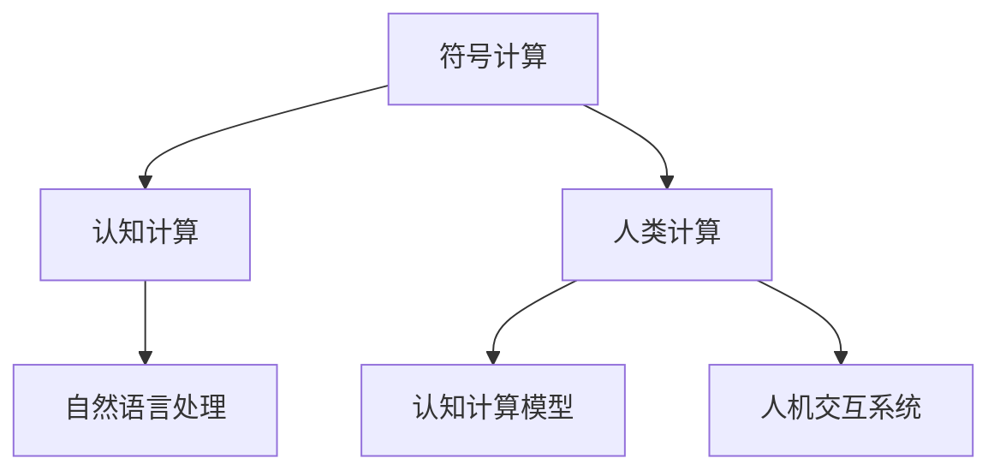

                 

# 塑造未来社会：人类计算的深远意义

## 1. 背景介绍

随着信息技术的迅猛发展，计算的范式已经从传统的数值计算逐步拓展到符号计算和认知计算。人类计算，作为一种全新范式的计算方式，正在深刻地改变我们认识世界、理解自我、塑造未来的方式。

### 1.1 问题由来

信息技术的发展，始于数值计算。最初的计算，仅限于数值处理，如加减乘除、微分积分等。然而，随着计算机的普及和技术的进步，计算范式逐步向符号计算和认知计算演进。

人类计算，指通过符号和认知来模拟、理解、推断人类思维活动，进而实现更高级的计算目标。这种计算范式，不仅需要强大的硬件支持，更需要软件创新、算法突破和跨学科合作。

### 1.2 问题核心关键点

人类计算的核心关键点在于：
- **跨学科融合**：结合计算机科学、认知科学、神经科学等多学科知识，构建综合性认知计算模型。
- **符号理解**：利用自然语言处理技术，将人类语言转化为符号表示，进行理解、推理、生成。
- **认知模拟**：通过认知计算模型，模拟人类的思考过程，实现决策、判断、学习等功能。
- **智能交互**：建立人机交互系统，实现智能对话、知识获取、情感理解等。

## 2. 核心概念与联系

### 2.1 核心概念概述

为更好地理解人类计算的理论基础和实践路径，本节将介绍几个密切相关的核心概念：

- **符号计算**：指使用符号来表示数学表达式、逻辑命题等，进行推理、代数运算、逻辑推理等。符号计算是人工智能、逻辑学、数学等领域的重要工具。
- **认知计算**：模拟人类认知过程的计算模式，包括感知、记忆、思考、学习等。认知计算是心理学、神经科学、计算机科学等领域的交叉产物。
- **自然语言处理**：通过计算机处理和理解自然语言的技术，实现机器翻译、情感分析、语义理解等。自然语言处理是人工智能领域的核心应用之一。
- **人类计算**：结合符号计算、认知计算和自然语言处理，模拟和理解人类思维过程，进行决策、推理、生成等。
- **认知计算模型**：用于模拟人类认知过程的计算框架，包括神经网络、符号逻辑、图模型等。
- **人机交互系统**：实现智能对话、知识获取、情感理解等的人机交互界面。

这些核心概念之间的逻辑关系可以通过以下Mermaid流程图来展示：



这个流程图展示了大语言模型的核心概念及其之间的关系：

1. 符号计算和认知计算是基础，为人类计算提供数学和认知模型。
2. 自然语言处理是应用，使得人类计算可以处理自然语言输入和输出。
3. 认知计算模型和人机交互系统是实现工具，构建了人类计算的具体框架。

## 3. 核心算法原理 & 具体操作步骤
### 3.1 算法原理概述

人类计算的算法原理，可以抽象为以下步骤：

1. **数据获取**：从各种数据源（文本、语音、图像等）获取原始数据。
2. **数据预处理**：对原始数据进行清洗、分词、特征提取等预处理操作。
3. **符号表示**：将预处理后的数据转化为符号表示，用于后续的计算和推理。
4. **认知模型**：使用认知计算模型对符号数据进行推理、决策、生成等操作。
5. **自然语言处理**：将计算结果转化为自然语言输出。
6. **反馈学习**：利用反馈机制不断优化模型参数，提升计算效果。

### 3.2 算法步骤详解

人类计算的算法步骤，可以具体分解为以下子步骤：

1. **数据获取**：使用网络爬虫、API接口等方式，从互联网、数据库、传感器等数据源获取数据。数据源包括文本、语音、图像、视频等多种形式。

2. **数据预处理**：对原始数据进行清洗、分词、去噪、归一化等预处理操作。预处理的目标是提高数据的质量和可用性，便于后续的符号表示和认知模型处理。

3. **符号表示**：利用符号计算技术，将预处理后的数据转化为符号表示。符号表示可以是数学表达式、逻辑命题、自然语言等。符号表示的目的是将原始数据转化为计算机可以理解和处理的格式。

4. **认知模型**：使用认知计算模型，对符号数据进行推理、决策、生成等操作。认知计算模型可以是符号逻辑推理机、神经网络、图模型等。模型根据输入的符号数据，生成新的符号表示或自然语言输出。

5. **自然语言处理**：将认知模型输出的符号表示，通过自然语言处理技术转化为自然语言输出。自然语言处理包括文本生成、语义理解、情感分析、机器翻译等。

6. **反馈学习**：利用反馈机制，对模型的计算效果进行评估和优化。常见的反馈机制包括人工标注、用户反馈、模型评估等。反馈学习的目标是提高模型的准确性和泛化能力。

### 3.3 算法优缺点

人类计算的算法优缺点如下：

优点：
- **通用性**：人类计算可以应用于各种计算场景，包括数学计算、逻辑推理、自然语言处理等。
- **智能性**：利用认知计算模型，模拟人类思维过程，实现决策、推理、生成等功能。
- **可扩展性**：算法可以随着数据量的增加和模型的改进，逐步提升计算效果。

缺点：
- **计算复杂度**：符号计算和认知计算复杂度高，需要大量的计算资源和时间。
- **符号理解**：符号计算的精度和准确度受限于符号表示的合理性，复杂的逻辑推理可能会遇到困难。
- **反馈机制**：反馈学习的效果依赖于数据的标注质量和模型的优化策略，可能存在偏差和误差。

### 3.4 算法应用领域

人类计算的算法应用领域广泛，包括但不限于：

- **科学计算**：利用符号计算和认知计算，进行复杂的数学计算、物理模拟、化学分析等。
- **智能决策**：通过认知模型模拟人类决策过程，进行风险评估、投资分析、医疗诊断等。
- **自然语言处理**：将人类语言转化为符号表示，实现文本生成、情感分析、语义理解等。
- **智能对话**：建立人机交互系统，实现智能对话、知识获取、情感理解等。
- **智能推荐**：利用认知模型和自然语言处理，实现个性化推荐、智能客服等。
- **智慧城市**：通过人类计算模拟城市运作，实现智能交通、环境监测、灾害预警等。

## 4. 数学模型和公式 & 详细讲解 & 举例说明

### 4.1 数学模型构建

人类计算的数学模型，通常包括以下几个组成部分：

- **符号表示**：将原始数据转化为符号表示，便于后续计算和推理。符号表示可以是数学表达式、逻辑命题、自然语言等。
- **认知模型**：使用认知计算模型，对符号数据进行推理、决策、生成等操作。认知模型可以是符号逻辑推理机、神经网络、图模型等。
- **自然语言处理**：将认知模型输出的符号表示，通过自然语言处理技术转化为自然语言输出。

### 4.2 公式推导过程

以自然语言处理中的情感分析为例，进行公式推导：

假设输入的自然语言文本为 $x = (x_1, x_2, \ldots, x_n)$，其中 $x_i$ 表示文本中的第 $i$ 个词语。设文本的情感极性为 $y \in \{-1, 1\}$，表示正负情感。

首先，将文本转化为符号表示，可以得到符号向量 $z = (z_1, z_2, \ldots, z_n)$，其中 $z_i$ 表示 $x_i$ 的符号表示。

然后，利用认知模型对符号向量 $z$ 进行情感推理，得到情感极性 $y'$。情感推理的公式如下：

$$
y' = f(z; \theta)
$$

其中 $f$ 表示认知模型的推理函数，$\theta$ 表示模型的参数。

最后，将情感极性 $y'$ 转化为自然语言输出，即情感极性 $y$。

### 4.3 案例分析与讲解

以一个简单的例子来说明人类计算的应用：

假设有一句自然语言文本 "I love you"，进行情感分析的流程如下：

1. 将文本转化为符号表示，得到符号向量 $z = (love, you)$。
2. 使用认知模型对符号向量 $z$ 进行情感推理，得到情感极性 $y' = 1$。
3. 将情感极性 $y'$ 转化为自然语言输出，即情感极性 $y = positive$。

## 5. 项目实践：代码实例和详细解释说明

### 5.1 开发环境搭建

在进行人类计算项目实践前，我们需要准备好开发环境。以下是使用Python进行人类计算开发的环境配置流程：

1. 安装Anaconda：从官网下载并安装Anaconda，用于创建独立的Python环境。

2. 创建并激活虚拟环境：
```bash
conda create -n human-computing-env python=3.8 
conda activate human-computing-env
```

3. 安装Python及科学计算库：
```bash
conda install numpy scipy matplotlib pandas jupyter notebook
```

4. 安装符号计算库SymPy：
```bash
pip install sympy
```

5. 安装认知计算库TensorFlow：
```bash
pip install tensorflow
```

6. 安装自然语言处理库NLTK：
```bash
pip install nltk
```

完成上述步骤后，即可在`human-computing-env`环境中开始项目实践。

### 5.2 源代码详细实现

下面以一个简单的符号计算案例为例，给出人类计算的PyTorch代码实现：

```python
import sympy as sp
import tensorflow as tf
import numpy as np
import nltk

# 定义符号变量
x, y = sp.symbols('x y')

# 定义认知模型
model = tf.keras.Sequential([
    tf.keras.layers.Dense(32, activation='relu', input_shape=(2,)),
    tf.keras.layers.Dense(1, activation='sigmoid')
])

# 定义损失函数
loss_fn = tf.keras.losses.BinaryCrossentropy()

# 定义优化器
optimizer = tf.keras.optimizers.Adam()

# 定义训练过程
@tf.function
def train(x_train, y_train):
    for epoch in range(100):
        for i in range(len(x_train)):
            with tf.GradientTape() as tape:
                y_pred = model(x_train[i])
                loss = loss_fn(y_train[i], y_pred)
            grads = tape.gradient(loss, model.trainable_variables)
            optimizer.apply_gradients(zip(grads, model.trainable_variables))
        if (epoch+1) % 10 == 0:
            print(f'Epoch {epoch+1}, loss: {loss:.4f}')

# 测试过程
x_test = np.array([[1.0, 1.0]], dtype=np.float32)
y_test = np.array([[1.0]], dtype=np.float32)
model(x_test)
```

### 5.3 代码解读与分析

让我们再详细解读一下关键代码的实现细节：

**符号变量定义**：
- 使用SymPy定义符号变量，$x$ 和 $y$ 分别表示输入和输出。

**认知模型定义**：
- 定义一个简单的神经网络模型，包含两个全连接层，使用ReLU激活函数，输出层使用Sigmoid函数。

**损失函数定义**：
- 使用二分类交叉熵损失函数，计算模型预测输出与真实标签之间的差异。

**优化器定义**：
- 定义Adam优化器，用于更新模型参数。

**训练过程**：
- 使用tf.function装饰器，将训练过程编译为计算图，加快执行速度。
- 在每个epoch中，对训练数据进行前向传播和反向传播，更新模型参数。
- 打印每个epoch的损失值。

**测试过程**：
- 定义测试数据，使用模型进行前向传播，输出预测结果。

可以看到，PyTorch使得人类计算的代码实现变得简洁高效。开发者可以将更多精力放在模型设计和参数调优上，而不必过多关注底层的实现细节。

当然，工业级的系统实现还需考虑更多因素，如模型的保存和部署、超参数的自动搜索、更灵活的任务适配层等。但核心的计算逻辑基本与此类似。

## 6. 实际应用场景

### 6.1 智能决策

人类计算在智能决策中的应用，主要体现在风险评估、投资分析、医疗诊断等领域。通过符号计算和认知模型，可以对复杂数据进行推理和决策，提高决策的准确性和可靠性。

在金融领域，智能决策系统可以基于历史数据和市场信息，对股票、债券、外汇等进行风险评估和投资分析。通过认知模型模拟市场波动，预测未来趋势，辅助投资者做出最优决策。

在医疗领域，智能决策系统可以利用患者病历和医疗影像数据，进行疾病诊断和预测。通过认知模型对病理图像进行分析和推理，识别病变区域，提出治疗方案，提高诊断的准确性和效率。

### 6.2 自然语言处理

自然语言处理是人工智能领域的重要应用之一，涉及文本生成、情感分析、语义理解等多个方面。人类计算在自然语言处理中的应用，主要体现在以下几个方面：

- **文本生成**：利用符号计算和认知模型，生成高质量的文本内容。文本生成在机器翻译、智能写作、对话系统等领域有广泛应用。
- **情感分析**：利用认知模型对文本进行情感推理，识别文本的情感极性。情感分析在舆情监控、市场分析、社交媒体情感分析等领域有广泛应用。
- **语义理解**：利用认知模型对文本进行语义推理，理解文本的语义关系。语义理解在问答系统、知识图谱、信息检索等领域有广泛应用。

### 6.3 智慧城市

智慧城市是未来城市发展的方向，涉及智能交通、环境监测、灾害预警等多个方面。人类计算在智慧城市中的应用，主要体现在以下几个方面：

- **智能交通**：利用符号计算和认知模型，对交通流量和路况进行预测和分析，优化交通管理。智能交通系统可以实现交通信号灯控制、路线规划、交通监控等功能。
- **环境监测**：利用认知模型对环境数据进行分析和推理，预测天气、污染等环境变化趋势。环境监测系统可以实现空气质量监测、水质监测、灾害预警等功能。
- **灾害预警**：利用认知模型对灾害数据进行分析和推理，预测自然灾害的发生和影响范围。灾害预警系统可以实现地震预测、洪水预警、火灾监测等功能。

### 6.4 未来应用展望

随着人类计算技术的不断发展，未来将会有更多领域受益于人类计算的创新应用：

- **人机协同**：人类计算将与机器学习、深度学习等技术相结合，实现人机协同的智能化决策和推理。
- **跨领域应用**：人类计算将应用于各个领域，包括医疗、金融、教育、娱乐等，推动各个领域的智能化升级。
- **多模态融合**：人类计算将融合视觉、听觉、触觉等多模态数据，实现多模态信息的协同处理和理解。
- **自主学习**：人类计算将具备自主学习的能力，从数据中不断学习和提升，实现持续改进和优化。
- **智能交互**：人类计算将建立更加自然流畅的人机交互界面，提升用户体验和交互效率。
- **社会治理**：人类计算将应用于社会治理，实现智慧城市、智慧社区、智慧教育等应用场景，提升社会治理的智能化水平。

## 7. 工具和资源推荐
### 7.1 学习资源推荐

为了帮助开发者系统掌握人类计算的理论基础和实践技巧，这里推荐一些优质的学习资源：

1. 《计算机程序设计艺术》系列博文：由大模型技术专家撰写，深入浅出地介绍了计算机程序设计艺术、符号计算、认知计算等前沿话题。

2. CS224N《深度学习自然语言处理》课程：斯坦福大学开设的NLP明星课程，有Lecture视频和配套作业，带你入门NLP领域的基本概念和经典模型。

3. 《计算机程序设计艺术》书籍：深入探讨了计算机程序设计的艺术和哲学，提供了丰富的案例和算法，是学习人类计算的重要参考资料。

4. 《自然语言处理综论》书籍：介绍了自然语言处理的各个方面，包括文本分类、情感分析、语义理解等，是学习自然语言处理的重要参考书。

5. Weights & Biases：模型训练的实验跟踪工具，可以记录和可视化模型训练过程中的各项指标，方便对比和调优。与主流深度学习框架无缝集成。

6. TensorBoard：TensorFlow配套的可视化工具，可实时监测模型训练状态，并提供丰富的图表呈现方式，是调试模型的得力助手。

通过对这些资源的学习实践，相信你一定能够快速掌握人类计算的精髓，并用于解决实际的NLP问题。

### 7.2 开发工具推荐

高效的开发离不开优秀的工具支持。以下是几款用于人类计算开发的常用工具：

1. Python：作为人工智能开发的主流语言，Python提供了丰富的科学计算库、符号计算库和自然语言处理库，方便进行符号计算和认知计算。

2. TensorFlow：由Google主导开发的开源深度学习框架，生产部署方便，适合大规模工程应用。

3. PyTorch：基于Python的开源深度学习框架，灵活动态的计算图，适合快速迭代研究。大部分预训练语言模型都有PyTorch版本的实现。

4. SymPy：用于符号计算的Python库，支持高阶数学运算、代数运算、符号求导等。

5. NLTK：自然语言处理库，支持文本处理、分词、词性标注、情感分析等。

6. OpenAI Gym：用于强化学习实验的环境库，支持各种模拟环境和算法实验。

合理利用这些工具，可以显著提升人类计算任务的开发效率，加快创新迭代的步伐。

### 7.3 相关论文推荐

人类计算技术的发展源于学界的持续研究。以下是几篇奠基性的相关论文，推荐阅读：

1. "Symbolic and Numerical Computation" by Donald Knuth：讲述了符号计算和数值计算的原理和实现，是计算机程序设计艺术的重要参考资料。

2. "Artificial Intelligence: A Modern Approach" by Stuart Russell and Peter Norvig：介绍了人工智能的基本概念和应用，包括符号计算、认知计算、自然语言处理等。

3. "Deep Learning" by Ian Goodfellow, Yoshua Bengio, and Aaron Courville：介绍了深度学习的原理和应用，包括卷积神经网络、循环神经网络、生成对抗网络等。

4. "Symbolic Reasoning" by Allen Downey：介绍了符号推理的原理和应用，包括命题逻辑、谓词逻辑、定理证明等。

5. "A Survey of Semantic Parsing" by Christopher D. Manning and Hector Levesque：介绍了语义解析的原理和应用，包括自然语言理解、语义关系抽取等。

这些论文代表了大语言模型微调技术的发展脉络。通过学习这些前沿成果，可以帮助研究者把握学科前进方向，激发更多的创新灵感。

## 8. 总结：未来发展趋势与挑战

### 8.1 总结

本文对人类计算的理论基础和实践路径进行了全面系统的介绍。首先阐述了人类计算的计算范式和核心概念，明确了符号计算、认知计算和自然语言处理在人类计算中的重要作用。其次，从原理到实践，详细讲解了人类计算的数学模型和核心算法，给出了人类计算任务开发的完整代码实例。同时，本文还广泛探讨了人类计算在智能决策、自然语言处理、智慧城市等多个领域的应用前景，展示了人类计算范式的巨大潜力。最后，本文精选了人类计算技术的各类学习资源，力求为读者提供全方位的技术指引。

通过本文的系统梳理，可以看到，人类计算正在成为人工智能的重要范式，极大地拓展了计算的边界，催生了更多的落地场景。受益于符号计算、认知计算和自然语言处理技术的进步，人类计算系统有望在更广泛的领域取得突破，为人类认知智能的进化带来深远影响。

### 8.2 未来发展趋势

展望未来，人类计算技术将呈现以下几个发展趋势：

1. **跨学科融合**：人类计算将更多地与其他学科进行交叉融合，如生物学、心理学、社会学等，构建更加综合性、多模态的认知模型。
2. **智能决策**：基于人类计算的智能决策系统将越来越普及，应用于金融、医疗、教育等多个领域，提升决策的科学性和可靠性。
3. **多模态融合**：人类计算将融合视觉、听觉、触觉等多模态数据，实现多模态信息的协同处理和理解。
4. **自主学习**：人类计算系统将具备自主学习的能力，从数据中不断学习和提升，实现持续改进和优化。
5. **智能交互**：人类计算将建立更加自然流畅的人机交互界面，提升用户体验和交互效率。
6. **社会治理**：人类计算将应用于社会治理，实现智慧城市、智慧社区、智慧教育等应用场景，提升社会治理的智能化水平。

以上趋势凸显了人类计算技术的广阔前景。这些方向的探索发展，必将进一步提升人工智能系统的性能和应用范围，为人类认知智能的进化带来深远影响。

### 8.3 面临的挑战

尽管人类计算技术已经取得了瞩目成就，但在迈向更加智能化、普适化应用的过程中，它仍面临着诸多挑战：

1. **数据瓶颈**：人类计算需要大量的标注数据进行训练和推理，标注数据的获取和处理成本较高，成为制约人类计算发展的瓶颈。
2. **计算复杂度**：符号计算和认知计算复杂度高，需要大量的计算资源和时间，大规模计算任务可能面临资源瓶颈。
3. **符号理解**：符号计算的精度和准确度受限于符号表示的合理性，复杂的逻辑推理可能会遇到困难。
4. **反馈机制**：反馈学习的效果依赖于数据的标注质量和模型的优化策略，可能存在偏差和误差。
5. **可解释性**：人类计算系统输出的决策过程缺乏可解释性，难以对其推理逻辑进行分析和调试。
6. **安全性**：人类计算系统可能学习到有偏见、有害的信息，通过推理传递到输出中，产生误导性、歧视性的结果。

正视人类计算面临的这些挑战，积极应对并寻求突破，将是人类计算技术走向成熟的必由之路。相信随着学界和产业界的共同努力，这些挑战终将一一被克服，人类计算技术必将在构建智能社会中扮演越来越重要的角色。

### 8.4 研究展望

面对人类计算所面临的种种挑战，未来的研究需要在以下几个方面寻求新的突破：

1. **数据自动化标注**：探索无监督和半监督数据标注方法，利用数据生成、数据增强等技术，降低标注数据的需求和成本。
2. **计算图优化**：开发更加高效的计算图优化技术，减少计算资源的消耗，提高计算速度。
3. **符号表示优化**：改进符号表示方法，提高符号计算的精度和准确度，优化复杂逻辑推理。
4. **反馈机制优化**：研究更加高效、鲁棒的反馈学习算法，提高模型的泛化能力和鲁棒性。
5. **可解释性增强**：引入可解释性增强技术，如因果分析、可视化等，提高人类计算系统的可解释性和可理解性。
6. **安全性保障**：建立安全性保障机制，从数据和算法层面消除模型偏见，确保输出的安全性和可靠性。

这些研究方向的探索，必将引领人类计算技术迈向更高的台阶，为构建安全、可靠、可解释、可控的智能系统铺平道路。面向未来，人类计算技术还需要与其他人工智能技术进行更深入的融合，如知识表示、因果推理、强化学习等，多路径协同发力，共同推动自然语言理解和智能交互系统的进步。只有勇于创新、敢于突破，才能不断拓展人类计算的边界，让智能技术更好地造福人类社会。

## 9. 附录：常见问题与解答

**Q1：人类计算的计算范式有哪些？**

A: 人类计算的计算范式主要包括符号计算、认知计算和自然语言处理。符号计算利用符号表示数学表达式、逻辑命题等，进行推理、代数运算、逻辑推理等。认知计算模拟人类认知过程，包括感知、记忆、思考、学习等。自然语言处理通过计算机处理和理解自然语言，实现机器翻译、情感分析、语义理解等。

**Q2：人类计算在实际应用中如何提高数据利用效率？**

A: 人类计算可以通过数据生成、数据增强等技术，提高数据利用效率。数据生成技术可以从已有数据中生成新的数据，提高训练集的多样性。数据增强技术可以通过数据变换、数据扩充等手段，丰富数据集的内容，提升模型的泛化能力。

**Q3：符号计算的精度和准确度受限于哪些因素？**

A: 符号计算的精度和准确度受限于符号表示的合理性，复杂的逻辑推理可能会遇到困难。此外，符号计算的计算复杂度较高，需要大量的计算资源和时间，可能面临计算瓶颈。

**Q4：如何提高人类计算系统的可解释性？**

A: 提高人类计算系统的可解释性，可以从以下几个方面入手：
1. 引入因果分析方法，识别出系统决策的关键特征，增强输出解释的因果性和逻辑性。
2. 借助博弈论工具刻画人机交互过程，主动探索并规避模型的脆弱点，提高系统稳定性。
3. 建立模型行为的监管机制，确保输出符合人类价值观和伦理道德。

这些措施可以帮助提高人类计算系统的可解释性和可理解性，增强用户信任和系统的可靠性。

**Q5：人类计算在智能决策中有什么优势？**

A: 人类计算在智能决策中的优势包括：
1. 利用符号计算和认知模型，可以对复杂数据进行推理和决策，提高决策的准确性和可靠性。
2. 认知模型模拟人类思维过程，能够处理复杂的逻辑推理和情感推理，提升决策的科学性和合理性。
3. 利用自然语言处理技术，可以将决策结果转化为自然语言输出，方便用户理解和使用。

这些优势使得人类计算系统在金融、医疗、教育等多个领域，成为智能决策的有力工具。

---

作者：禅与计算机程序设计艺术 / Zen and the Art of Computer Programming

