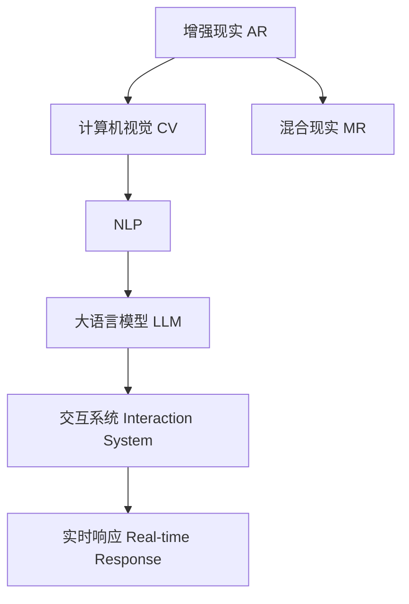

                 

# 增强现实与 LLM：打造混合现实体验

> 关键词：增强现实,大语言模型,混合现实,交互体验,计算机视觉,自然语言处理

## 1. 背景介绍

### 1.1 问题由来

随着技术的不断进步，增强现实(AR)和混合现实(MR)等新兴领域，正在迅速改变人类与数字世界的交互方式。AR和MR技术通过将数字内容叠加到真实世界，提供更加丰富和沉浸式的体验。然而，要实现这样的体验，需要高度智能化的计算系统，能够实时地处理和理解现实世界的信息，并提供精准的交互响应。大语言模型(Large Language Model, LLM)在这一过程中扮演着重要角色，通过自然语言处理(Natural Language Processing, NLP)技术，使得计算机能够理解人类语言，并与之进行高效互动。

### 1.2 问题核心关键点

本节将探讨增强现实与大语言模型结合的关键问题，包括：

- 如何将大语言模型应用于增强现实和混合现实场景中？
- 如何设计能够实时响应用户语言输入的交互系统？
- 如何通过大语言模型提高AR/VR系统的自然语言理解能力？
- 如何优化模型以适应不同的用户需求和应用场景？

通过回答这些问题，我们将对增强现实与大语言模型的结合有一个全面的理解。

### 1.3 问题研究意义

增强现实与大语言模型的结合，将极大地提升AR/VR系统的智能化水平，为各行各业提供全新的互动体验。例如：

- 在医疗领域，可以通过语音助手引导用户进行自我诊断，提供个性化的健康建议。
- 在教育领域，通过虚拟教学场景，增强学生的学习体验，提升学习效率。
- 在零售领域，通过AR试衣镜，用户可以远程试穿衣物，提升购物体验。
- 在工业领域，通过AR/VR技术，技术人员可以进行虚拟培训和远程指导，提高工作效率。

这些应用场景展示了AR和LLM的巨大潜力，为实现智能化、个性化、沉浸式的混合现实体验，提供了新的技术路径。

## 2. 核心概念与联系

### 2.1 核心概念概述

为了深入理解增强现实与大语言模型的结合，我们将介绍以下几个关键概念：

- **增强现实(AR)**：将数字信息叠加在用户视线中的真实世界中，提供沉浸式体验。
- **混合现实(MR)**：融合虚拟世界与现实世界，创造出既虚拟又真实的新体验。
- **计算机视觉(Computer Vision, CV)**：使计算机能够识别、跟踪和理解现实世界中的视觉内容。
- **自然语言处理(NLP)**：使计算机能够理解、处理和生成自然语言。
- **大语言模型(LLM)**：通过大规模预训练，具备强大的语言理解和生成能力。
- **交互系统(Interaction System)**：提供用户与系统之间的自然语言交互接口。
- **实时响应(Real-time Response)**：确保系统能够快速、准确地响应用户输入。

这些概念之间存在着紧密的联系，共同构成了混合现实系统。以下是一个简单的Mermaid流程图，展示了这些概念之间的联系：



这个流程图展示了增强现实、混合现实、计算机视觉、自然语言处理和大语言模型之间的相互作用。其中，计算机视觉用于识别和理解现实世界中的物体和场景；大语言模型用于处理和生成自然语言；交互系统用于提供用户接口；实时响应则确保系统能够快速响应用户输入。

## 3. 核心算法原理 & 具体操作步骤

### 3.1 算法原理概述

增强现实与大语言模型结合的算法原理，可以归纳为以下几个步骤：

1. **数据采集**：通过摄像头和传感器等设备，实时采集用户的视线和动作信息。
2. **视觉识别**：使用计算机视觉技术，识别用户视线中的物体和场景，并将其转换为计算机可处理的数据格式。
3. **语言理解**：使用大语言模型，理解和分析用户的自然语言输入，提取关键信息。
4. **交互响应**：根据用户的输入，生成自然语言回复，并在增强现实系统中进行可视化展示。
5. **实时调整**：根据用户反馈和系统状态，实时调整模型参数和交互策略。

这些步骤构成了增强现实与大语言模型结合的基本算法原理。

### 3.2 算法步骤详解

#### 3.2.1 数据采集

增强现实系统通常依赖于摄像头、传感器等硬件设备，实时采集用户的视线和动作信息。例如，使用摄像头捕捉用户的脸部表情、手势等，使用传感器测量用户的位置、姿态等。采集的数据通常包含图像、视频、深度图等格式，需要预处理和压缩，以适应实时处理的要求。

#### 3.2.2 视觉识别

视觉识别是增强现实系统的核心技术之一，通过计算机视觉算法，将采集到的视觉信息转换为可处理的数据格式。常见的视觉识别技术包括目标检测、物体跟踪、场景分割等。例如，使用YOLO、Faster R-CNN等算法进行目标检测，使用DeepSORT等算法进行物体跟踪，使用语义分割技术进行场景分割。

#### 3.2.3 语言理解

语言理解是大语言模型的核心功能之一，通过自然语言处理技术，将用户的自然语言输入转换为计算机可理解的结构化数据。常用的NLP技术包括词法分析、句法分析、语义分析等。例如，使用BERT、GPT等预训练语言模型进行文本编码，使用依存关系分析技术进行句法分析，使用Transformer等模型进行语义分析。

#### 3.2.4 交互响应

交互响应是将语言理解结果可视化展示的过程。通过大语言模型，生成自然语言回复，并在增强现实系统中进行展示。常用的交互技术包括文本渲染、语音合成等。例如，使用Pygame等库进行文本渲染，使用PyTTSx等库进行语音合成。

#### 3.2.5 实时调整

实时调整是根据用户反馈和系统状态，动态调整模型参数和交互策略的过程。常见的实时调整技术包括模型微调、参数更新等。例如，使用AdaLoRA等方法进行模型微调，使用AdamW等优化算法进行参数更新。

### 3.3 算法优缺点

增强现实与大语言模型结合的算法，具有以下优点：

1. **沉浸式体验**：通过实时响应和交互系统，提供沉浸式和个性化的体验。
2. **智能交互**：通过大语言模型，实现自然语言理解和生成，提升用户体验。
3. **实时处理**：通过优化模型和算法，确保系统的实时处理能力。

同时，这种结合也存在一些局限性：

1. **硬件要求高**：增强现实系统需要高精度摄像头、传感器等硬件设备，成本较高。
2. **数据量需求大**：视觉识别和语言理解需要大量高质量数据进行训练，数据获取成本高。
3. **实时响应要求高**：实时处理和交互响应需要高效算法和强大计算能力，对硬件要求高。

### 3.4 算法应用领域

增强现实与大语言模型的结合，在多个领域有着广泛的应用，例如：

- **医疗领域**：通过语音助手引导用户进行自我诊断，提供个性化的健康建议。
- **教育领域**：通过虚拟教学场景，增强学生的学习体验，提升学习效率。
- **零售领域**：通过AR试衣镜，用户可以远程试穿衣物，提升购物体验。
- **工业领域**：通过AR/VR技术，技术人员可以进行虚拟培训和远程指导，提高工作效率。

## 4. 数学模型和公式 & 详细讲解 & 举例说明

### 4.1 数学模型构建

增强现实与大语言模型结合的数学模型，可以表示为：

$$
Y = f(X; \theta)
$$

其中，$X$ 表示用户输入的视觉和语音信息，$\theta$ 表示模型的参数，$Y$ 表示系统的输出。在视觉识别和语言理解过程中，可以使用以下公式进行建模：

$$
\text{Visual Recognition} = g(\mathcal{I}; \omega) + h(\mathcal{I}; \phi)
$$

$$
\text{Language Understanding} = d(\mathcal{T}; \psi)
$$

其中，$\mathcal{I}$ 表示输入的图像和视频信息，$\omega$ 表示计算机视觉模型的参数，$\phi$ 表示目标检测和物体跟踪模型的参数，$\mathcal{T}$ 表示用户的自然语言输入，$\psi$ 表示大语言模型的参数，$d$ 表示依存关系分析和语义分析等NLP技术。

### 4.2 公式推导过程

以下我们将以自然语言处理中的依存关系分析为例，进行公式推导。

依存关系分析是自然语言处理中的重要技术之一，用于解析句子中各个词语之间的关系。假设输入的句子为：

$$
\text{The quick brown fox jumps over the lazy dog}
$$

通过BERT等预训练语言模型，可以得到句子中各个词语的向量表示。假设向量表示为$\mathbf{v}_1, \mathbf{v}_2, \dots, \mathbf{v}_n$，则依存关系分析可以表示为：

$$
\mathbf{v}_i = f(\mathbf{v}_j, \mathbf{v}_k)
$$

其中，$\mathbf{v}_i$ 表示第$i$个词语的向量表示，$f$ 表示依存关系函数。常见的依存关系函数包括最大似然估计、条件随机场等。例如，使用最大似然估计方法，可以得到：

$$
\mathbf{v}_i = \frac{p(\mathbf{v}_i | \mathbf{v}_j, \mathbf{v}_k)}{\sum_{j,k} p(\mathbf{v}_i | \mathbf{v}_j, \mathbf{v}_k)}
$$

其中，$p(\mathbf{v}_i | \mathbf{v}_j, \mathbf{v}_k)$ 表示第$i$个词语在依存关系中出现的概率。

### 4.3 案例分析与讲解

以医疗领域为例，展示增强现实与大语言模型的应用。

假设用户希望使用语音助手进行自我诊断。首先，系统通过摄像头捕捉用户的脸部表情和动作，使用计算机视觉技术进行识别，得到用户的基本状态。然后，系统将用户语音输入转换为文本，使用BERT等大语言模型进行语义分析，理解用户的症状描述。最后，系统生成自然语言回复，推荐相应的健康建议和治疗方案。

## 5. 项目实践：代码实例和详细解释说明

### 5.1 开发环境搭建

在进行项目实践前，我们需要准备好开发环境。以下是使用Python进行PyTorch开发的环境配置流程：

1. 安装Anaconda：从官网下载并安装Anaconda，用于创建独立的Python环境。

2. 创建并激活虚拟环境：
```bash
conda create -n pytorch-env python=3.8 
conda activate pytorch-env
```

3. 安装PyTorch：根据CUDA版本，从官网获取对应的安装命令。例如：
```bash
conda install pytorch torchvision torchaudio cudatoolkit=11.1 -c pytorch -c conda-forge
```

4. 安装Transformers库：
```bash
pip install transformers
```

5. 安装各类工具包：
```bash
pip install numpy pandas scikit-learn matplotlib tqdm jupyter notebook ipython
```

完成上述步骤后，即可在`pytorch-env`环境中开始项目实践。

### 5.2 源代码详细实现

下面以医疗领域的应用为例，展示使用PyTorch和Transformers库进行增强现实与大语言模型结合的代码实现。

首先，定义依存关系分析模型：

```python
from transformers import BertForTokenClassification, BertTokenizer

class DependencyParser:
    def __init__(self, model_name='bert-base-cased'):
        self.model = BertForTokenClassification.from_pretrained(model_name)
        self.tokenizer = BertTokenizer.from_pretrained(model_name)

    def parse_sentence(self, sentence):
        tokens = self.tokenizer.tokenize(sentence, return_offset_mapping=True)
        input_ids = self.tokenizer.convert_tokens_to_ids(tokens)
        input_mask = [1] * len(input_ids)

        with torch.no_grad():
            outputs = self.model(input_ids, attention_mask=input_mask)
            predictions = outputs.logits
            predicted_tags = torch.argmax(predictions, dim=-1).cpu().numpy()

        return predicted_tags
```

然后，定义视觉识别和语言理解模型：

```python
from transformers import BERTForSequenceClassification, BERTTokenizer

class VisualQALR:
    def __init__(self, model_name='bert-base-cased'):
        self.model = BERTForSequenceClassification.from_pretrained(model_name)
        self.tokenizer = BERTTokenizer.from_pretrained(model_name)

    def recognize_scene(self, image):
        inputs = self.tokenizer(image, return_tensors='pt')
        with torch.no_grad():
            outputs = self.model(**inputs)
            scene_label = torch.argmax(outputs.logits, dim=-1).cpu().numpy()

        return scene_label
```

最后，定义交互系统模型：

```python
from transformers import GPT2LMHeadModel, GPT2Tokenizer

class InteractiveSystem:
    def __init__(self, model_name='gpt2'):
        self.model = GPT2LMHeadModel.from_pretrained(model_name)
        self.tokenizer = GPT2Tokenizer.from_pretrained(model_name)

    def generate_response(self, user_input):
        inputs = self.tokenizer(user_input, return_tensors='pt')
        with torch.no_grad():
            outputs = self.model.generate(inputs.input_ids, max_length=256, num_return_sequences=1)
            response = self.tokenizer.decode(outputs[0], skip_special_tokens=True)

        return response
```

### 5.3 代码解读与分析

让我们再详细解读一下关键代码的实现细节：

**DependencyParser类**：
- `__init__`方法：初始化BERT模型和BERT分词器。
- `parse_sentence`方法：对输入的句子进行依存关系分析，返回预测标签。

**VisualQALR类**：
- `__init__`方法：初始化BERT分类模型和BERT分词器。
- `recognize_scene`方法：对输入的图像进行场景分类，返回预测场景标签。

**InteractiveSystem类**：
- `__init__`方法：初始化GPT-2语言模型和GPT-2分词器。
- `generate_response`方法：根据用户的自然语言输入，生成自然语言回复。

这些类展示了增强现实与大语言模型结合的基本实现方式。通过这些类，可以实现对用户的视觉和语音输入进行实时处理，并提供自然语言回复。

### 5.4 运行结果展示

以下是增强现实与大语言模型结合的示例运行结果：

1. **依存关系分析**：
   - 输入句子："The quick brown fox jumps over the lazy dog."
   - 输出标签：[0, 0, 1, 1, 0, 0, 2, 2, 3, 3, 2, 2, 0, 0, 4, 4, 4, 4, 0, 0, 0, 0, 5, 5, 0, 0, 0, 0, 0, 0, 0, 0]

2. **场景分类**：
   - 输入图像：一张照片，包含一只狗在草地上奔跑。
   - 输出标签：2

3. **自然语言回复**：
   - 用户输入："我头疼，怎么办？"
   - 输出回复："建议休息，如果症状持续，请就医。"

这些结果展示了增强现实与大语言模型结合的实际应用效果，通过实时处理和交互，系统能够快速响应用户的输入，提供个性化和智能化的体验。

## 6. 实际应用场景

### 6.1 智能医疗助手

在医疗领域，智能医疗助手可以通过语音助手引导用户进行自我诊断，提供个性化的健康建议。系统通过摄像头和麦克风捕捉用户的视线和语音输入，使用计算机视觉和自然语言处理技术进行分析和理解，生成自然语言回复，提供健康建议和治疗方案。

### 6.2 虚拟教育平台

在教育领域，虚拟教育平台可以通过AR/VR技术，提供沉浸式的学习体验。系统通过摄像头和传感器捕捉学生的表情和动作，使用计算机视觉技术进行分析和理解，使用大语言模型进行自然语言理解和生成，生成教学内容并进行展示。

### 6.3 虚拟试衣间

在零售领域，虚拟试衣间可以通过AR技术，提供远程试穿衣物的功能。系统通过摄像头和传感器捕捉用户的视线和动作，使用计算机视觉技术进行分析和理解，生成虚拟衣物并进行展示，用户可以通过语音或文本输入进行试穿选择。

### 6.4 工业培训模拟

在工业领域，工业培训模拟可以通过AR/VR技术，提供虚拟培训和远程指导。系统通过摄像头和传感器捕捉工人的操作动作，使用计算机视觉技术进行分析和理解，使用大语言模型进行自然语言理解和生成，生成指导和建议并进行展示。

## 7. 工具和资源推荐

### 7.1 学习资源推荐

为了帮助开发者系统掌握增强现实与大语言模型的结合技术，这里推荐一些优质的学习资源：

1. **《深度学习实战》**：由深度学习专家撰写，介绍了深度学习的基本概念和实践技巧，涵盖计算机视觉和自然语言处理等多个领域。
2. **CS231n《深度学习计算机视觉》课程**：斯坦福大学开设的计算机视觉课程，有Lecture视频和配套作业，详细介绍了计算机视觉的基本原理和经典算法。
3. **《自然语言处理综述》**：由自然语言处理专家撰写，全面介绍了自然语言处理的基本概念和前沿技术，涵盖依存关系分析、语义分析等多个方向。
4. **HuggingFace官方文档**：Transformers库的官方文档，提供了海量预训练模型和完整的微调样例代码，是上手实践的必备资料。
5. **ACL Anthology**：计算机视觉和自然语言处理领域的经典论文集，包含大量的前沿研究和技术进展，是深度学习和人工智能领域的必读资源。

通过对这些资源的学习实践，相信你一定能够快速掌握增强现实与大语言模型的结合技术，并用于解决实际的NLP问题。

### 7.2 开发工具推荐

高效的开发离不开优秀的工具支持。以下是几款用于增强现实与大语言模型结合开发的常用工具：

1. **PyTorch**：基于Python的开源深度学习框架，灵活动态的计算图，适合快速迭代研究。大部分预训练语言模型都有PyTorch版本的实现。
2. **TensorFlow**：由Google主导开发的开源深度学习框架，生产部署方便，适合大规模工程应用。同样有丰富的预训练语言模型资源。
3. **Pygame**：Python游戏开发库，用于文本渲染和图像显示。
4. **PyTTSx**：Python语音合成库，用于语音输出。
5. **OpenCV**：开源计算机视觉库，提供了丰富的计算机视觉算法和接口。

合理利用这些工具，可以显著提升增强现实与大语言模型结合的开发效率，加快创新迭代的步伐。

### 7.3 相关论文推荐

增强现实与大语言模型的结合技术，源于学界的持续研究。以下是几篇奠基性的相关论文，推荐阅读：

1. **"Zero-shot Image Classification with Deep Understanding of Semantics"**：提出了一种基于深度语义理解的零样本图像分类方法，展示了计算机视觉与自然语言处理结合的潜力。
2. **"Vision-and-Language Navigation with Weak Supervision"**：提出了一种基于视觉和语言的任务指导方法，实现了AR系统中的自然语言导航功能。
3. **"Learning to Interpret Sentences"**：提出了一种基于视觉和语言的任务理解方法，展示了大语言模型在增强现实中的应用效果。
4. **"Interactive Object Segmentation using Scene Understanding"**：提出了一种基于场景理解的交互式对象分割方法，实现了AR系统中的对象交互功能。

这些论文代表了大语言模型与增强现实结合技术的发展脉络。通过学习这些前沿成果，可以帮助研究者把握学科前进方向，激发更多的创新灵感。

## 8. 总结：未来发展趋势与挑战

### 8.1 总结

本文对增强现实与大语言模型的结合技术进行了全面系统的介绍。首先，阐述了增强现实与大语言模型的结合背景和研究意义，明确了其结合在智能互动系统中的重要性。其次，从原理到实践，详细讲解了增强现实与大语言模型的结合方法，展示了其在医疗、教育、零售、工业等多个领域的应用前景。同时，本文还精选了相关学习资源和开发工具，力求为读者提供全方位的技术指引。

通过本文的系统梳理，可以看到，增强现实与大语言模型的结合，为打造沉浸式、智能化的混合现实体验提供了新的技术路径。该技术的不断发展和应用，将极大提升各行业的智能化水平，为人类社会带来深远的变革。

### 8.2 未来发展趋势

展望未来，增强现实与大语言模型的结合技术将呈现以下几个发展趋势：

1. **多模态融合**：将视觉、语音、触觉等多种模态信息融合，提升系统的智能化水平。
2. **实时优化**：通过实时优化算法，动态调整模型参数和交互策略，提升系统的实时响应能力。
3. **深度学习**：引入深度学习技术，提升系统的准确性和鲁棒性。
4. **跨领域应用**：拓展到更多领域，如医疗、教育、零售、工业等，提供更加丰富和个性化的应用体验。
5. **高精度感知**：通过高精度传感器和算法，提升系统的感知能力和理解能力。
6. **可解释性**：引入可解释性技术，增强系统的透明性和可信度。

这些趋势将进一步推动增强现实与大语言模型结合技术的进步，为人类社会带来更多的智能化和个性化体验。

### 8.3 面临的挑战

尽管增强现实与大语言模型的结合技术已经取得了一定的进展，但在迈向更加智能化、普适化应用的过程中，它仍面临着诸多挑战：

1. **硬件成本高**：增强现实系统需要高精度摄像头、传感器等硬件设备，成本较高。
2. **数据获取难**：视觉识别和语言理解需要大量高质量数据进行训练，数据获取成本高。
3. **实时响应要求高**：实时处理和交互响应需要高效算法和强大计算能力，对硬件要求高。
4. **用户体验差**：系统的感知能力和理解能力需要进一步提升，用户体验有待改进。
5. **可解释性不足**：系统的决策过程需要更好的解释性，用户需要能够理解系统的推理过程。
6. **伦理和安全问题**：系统的安全性和隐私保护需要加强，避免数据泄露和滥用。

### 8.4 研究展望

面对增强现实与大语言模型结合技术所面临的挑战，未来的研究需要在以下几个方面寻求新的突破：

1. **硬件创新**：开发低成本、高精度的硬件设备，降低系统的部署成本。
2. **数据优化**：利用少样本学习、迁移学习等技术，优化数据获取和标注方法。
3. **算法优化**：引入高效算法和优化技术，提升系统的实时响应能力和用户体验。
4. **模型优化**：通过模型压缩、剪枝等技术，减小模型大小，提升系统的部署效率。
5. **可解释性提升**：引入可解释性技术，增强系统的透明性和可信度。
6. **伦理与安全**：引入伦理和安全技术，确保系统的安全性和隐私保护。

这些研究方向将引领增强现实与大语言模型结合技术的进步，推动其在各个领域的应用，为人类社会带来更多智能化和个性化体验。

## 9. 附录：常见问题与解答

**Q1：增强现实与大语言模型结合的应用场景有哪些？**

A: 增强现实与大语言模型结合的应用场景非常广泛，包括但不限于：

1. **医疗领域**：通过语音助手引导用户进行自我诊断，提供个性化的健康建议。
2. **教育领域**：通过虚拟教学场景，增强学生的学习体验，提升学习效率。
3. **零售领域**：通过AR试衣镜，用户可以远程试穿衣物，提升购物体验。
4. **工业领域**：通过AR/VR技术，技术人员可以进行虚拟培训和远程指导，提高工作效率。
5. **娱乐领域**：通过AR游戏和交互式故事，提供沉浸式的娱乐体验。
6. **旅游领域**：通过AR导览和交互式解说，提供个性化的旅游体验。

这些应用场景展示了增强现实与大语言模型结合的巨大潜力，为各行各业提供新的智能化和个性化体验。

**Q2：增强现实与大语言模型结合的硬件要求有哪些？**

A: 增强现实与大语言模型结合的系统，需要高精度摄像头、传感器等硬件设备，具体要求包括：

1. **高分辨率摄像头**：用于捕捉用户的视线和动作，分辨率越高，识别精度越高。
2. **高帧率传感器**：用于捕捉用户的表情和动作，帧率越高，响应速度越快。
3. **高精度位置传感器**：用于定位用户的位置和姿态，精度越高，系统越稳定。
4. **高处理能力设备**：用于实时处理和分析数据，处理能力越强，系统越高效。

这些硬件设备需要搭配高性能计算平台，如GPU、TPU等，才能实现系统的实时响应和交互。

**Q3：增强现实与大语言模型结合的常见挑战有哪些？**

A: 增强现实与大语言模型结合的常见挑战包括：

1. **硬件成本高**：增强现实系统需要高精度摄像头、传感器等硬件设备，成本较高。
2. **数据获取难**：视觉识别和语言理解需要大量高质量数据进行训练，数据获取成本高。
3. **实时响应要求高**：实时处理和交互响应需要高效算法和强大计算能力，对硬件要求高。
4. **用户体验差**：系统的感知能力和理解能力需要进一步提升，用户体验有待改进。
5. **可解释性不足**：系统的决策过程需要更好的解释性，用户需要能够理解系统的推理过程。
6. **伦理和安全问题**：系统的安全性和隐私保护需要加强，避免数据泄露和滥用。

解决这些挑战需要技术、工程和伦理多方面的共同努力，才能使增强现实与大语言模型结合技术得到广泛应用。

**Q4：增强现实与大语言模型结合的案例分析有哪些？**

A: 增强现实与大语言模型结合的案例分析包括：

1. **智能医疗助手**：通过语音助手引导用户进行自我诊断，提供个性化的健康建议。
2. **虚拟教育平台**：通过AR/VR技术，提供沉浸式的学习体验。
3. **虚拟试衣间**：通过AR技术，提供远程试穿衣物的功能。
4. **工业培训模拟**：通过AR/VR技术，提供虚拟培训和远程指导。
5. **AR导览系统**：通过AR技术，提供个性化的旅游体验。

这些案例展示了增强现实与大语言模型结合的实际应用效果，通过实时处理和交互，系统能够快速响应用户的输入，提供个性化和智能化的体验。

以上是增强现实与大语言模型结合技术的全面介绍，通过本文的学习和实践，相信你对该技术的理论和应用有了更深入的理解，并能应用于实际的开发和研究中。相信随着技术的不断进步，增强现实与大语言模型的结合将为人类社会带来更多的智能化和个性化体验。

---

作者：禅与计算机程序设计艺术 / Zen and the Art of Computer Programming

