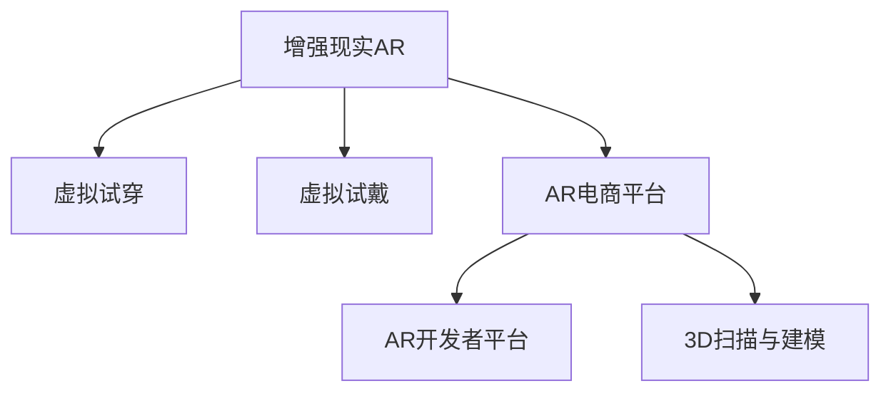

                 

# 增强现实在电商中的应用前景

## 1. 背景介绍

### 1.1 问题由来
随着移动互联网的普及和电子商务的迅猛发展，在线购物已成为人们日常生活的重要组成部分。然而，传统的电商模式存在诸多不足：商品展示方式单一、缺乏直观体验、无法真实感受产品质量等，这些都极大地影响了消费者的购买决策。为了提升电商购物体验，商家不断探索新的技术和手段，增强现实技术(AR)便是其中之一。

增强现实是一种将虚拟信息与现实世界进行融合的技术。通过AR，消费者可以通过手机、平板等设备，在自己的环境中虚拟体验商品，从而更好地了解商品细节和特性。相比于传统的电商图片和视频展示，AR能够提供更加沉浸式、互动性强的购物体验，极大提升消费者购物满意度，提高转化率。

### 1.2 问题核心关键点
增强现实在电商中的应用核心关键点如下：

- **沉浸式体验**：AR通过虚拟试穿、虚拟试戴等方式，让消费者仿佛置身于商品世界中，获得身临其境的感受。
- **互动性增强**：消费者可以与虚拟商品进行互动，如调整大小、颜色、款式等，提升购物决策的自主性。
- **信息丰富性**：AR可以展示商品的多角度视图、使用场景、用户评价等信息，帮助消费者做出更加客观的判断。
- **个性化定制**：AR技术可以根据用户喜好和历史行为数据，推荐个性化的商品和体验，提升个性化购物体验。
- **品牌推广**：AR可以作为品牌推广工具，通过虚拟试穿、互动游戏等方式，提升品牌知名度和消费者粘性。

## 2. 核心概念与联系

### 2.1 核心概念概述

为更好地理解增强现实在电商中的应用，本节将介绍几个密切相关的核心概念：

- **增强现实(Augmented Reality, AR)**：一种将虚拟信息与现实世界进行融合的技术。通过AR，消费者可以在真实环境中虚拟体验商品。

- **虚拟试穿(Virtual Try-On)**：AR技术的一种应用形式，用户通过手机或平板在虚拟环境中试穿衣物、鞋帽等商品，实时查看搭配效果。

- **虚拟试戴(Virtual Try-Wear)**：AR技术的另一种应用形式，用户通过虚拟试戴眼镜、首饰等商品，评估其是否适合自己的脸型、肤色等。

- **AR电商平台**：将AR技术与电商平台结合，为消费者提供虚拟体验商品的完整解决方案，包括试穿、试戴、试用等功能。

- **AR开发者平台**：为第三方开发者提供AR开发工具、SDK和API，方便其在电商应用中集成AR功能。

- **3D扫描与建模**：通过3D扫描仪或手机拍摄，将实体商品转换为3D模型，用于AR试穿、试戴等场景。

这些核心概念之间的逻辑关系可以通过以下Mermaid流程图来展示：



这个流程图展示增强现实在电商中的应用场景：

1. 增强现实AR技术用于虚拟试穿、试戴等应用。
2. 虚拟试穿和试戴功能集成在AR电商平台上。
3. AR电商平台依赖于AR开发者平台，后者提供了AR开发工具和API。
4. 3D扫描与建模技术用于将实体商品转换为3D模型，供AR平台使用。

## 3. 核心算法原理 & 具体操作步骤
### 3.1 算法原理概述

增强现实在电商中的应用核心算法原理主要涉及以下几个方面：

- **三维建模与纹理映射**：将实体商品转化为3D模型，并将模型纹理映射到虚拟环境中，实现虚拟试穿、试戴等功能。

- **深度传感器与摄像头融合**：利用深度传感器和摄像头捕捉用户姿势和动作，与虚拟商品进行精确对齐，实现虚拟试穿、试戴等互动效果。

- **三维定位与跟踪**：通过摄像头和惯性传感器等设备，实时定位和跟踪用户的位置和动作，确保虚拟商品与用户身体精确对齐。

- **场景渲染与优化**：实时渲染虚拟商品与现实场景的融合图像，并对渲染结果进行优化，提升用户体验。

这些算法原理共同构成了增强现实在电商中的技术基础，使其能够提供沉浸式、互动性强的购物体验。

### 3.2 算法步骤详解

增强现实在电商中的应用通常包括以下关键步骤：

**Step 1: 数据采集与预处理**

- 利用3D扫描仪或手机摄像头采集实体商品的高分辨率3D模型和纹理图像。
- 对3D模型进行纹理映射和光照明处理，生成完整的虚拟商品模型。

**Step 2: 用户姿势与动作捕捉**

- 利用深度传感器和摄像头捕捉用户的姿势和动作，并将其转化为虚拟空间中的3D骨骼模型。
- 结合惯性传感器等设备，实时定位和跟踪用户的位置和动作。

**Step 3: 虚拟试穿与试戴**

- 将虚拟商品模型与用户3D骨骼模型进行对齐，确保虚拟商品与用户身体精确对齐。
- 利用计算机视觉算法检测用户身体关键部位，如肩膀、手臂、脚踝等，确保试穿效果逼真。

**Step 4: 场景渲染与优化**

- 将虚拟商品模型与现实场景进行融合渲染，生成逼真的虚拟试穿/试戴场景。
- 对渲染结果进行优化，提升渲染速度和图像质量。

**Step 5: 用户交互与反馈**

- 提供用户交互界面，如调整大小、颜色、款式等，实现个性化体验。
- 实时反馈用户试穿/试戴效果，并进行动态调整。

以上是增强现实在电商中的核心算法步骤。在实际应用中，还需要针对具体任务的特点，对各个环节进行优化设计，如改进纹理映射算法、优化渲染算法、增强交互性等，以进一步提升用户体验。

### 3.3 算法优缺点

增强现实在电商中的应用具有以下优点：

1. **沉浸式体验**：虚拟试穿、试戴等应用能够提供沉浸式、互动性强的购物体验，极大提升用户购物满意度。
2. **个性化定制**：根据用户喜好和历史行为数据，推荐个性化的商品和体验，提升个性化购物体验。
3. **信息丰富性**：通过AR展示商品的多角度视图、使用场景、用户评价等信息，帮助用户做出更加客观的判断。
4. **品牌推广**：AR技术可以作为品牌推广工具，通过虚拟试穿、互动游戏等方式，提升品牌知名度和消费者粘性。

同时，该方法也存在一些局限性：

1. **硬件依赖**：增强现实应用需要高端手机、平板或VR设备，硬件成本较高。
2. **技术门槛高**：3D建模、纹理映射、深度传感器等技术门槛较高，需要专业知识和设备支持。
3. **隐私问题**：增强现实应用需要收集用户的身体数据，存在隐私泄露的风险。
4. **网络要求**：增强现实应用需要稳定网络连接，才能实现实时渲染和互动效果。

尽管存在这些局限性，但就目前而言，增强现实在电商中的应用前景广阔，具有极大的商业潜力。

### 3.4 算法应用领域

增强现实在电商中的应用领域主要包括以下几个方面：

- **虚拟试穿**：用户可以在虚拟环境中试穿衣物、鞋帽等商品，实时查看搭配效果。
- **虚拟试戴**：用户通过虚拟试戴眼镜、首饰等商品，评估其是否适合自己的脸型、肤色等。
- **虚拟试用**：用户虚拟体验使用化妆品、日用品等商品，如试色、试香等。
- **虚拟展示**：将虚拟商品模型展示在电商平台上，增强商品展示效果。
- **品牌推广**：通过虚拟试穿、互动游戏等方式，提升品牌知名度和消费者粘性。
- **用户互动**：通过AR应用与用户进行互动，收集用户反馈数据，优化产品和服务。

除了上述这些核心应用外，增强现实技术还被创新性地应用于更多场景中，如智慧零售、智能家居、医疗健康等，为电商和其他行业带来了全新的突破。

## 4. 数学模型和公式 & 详细讲解 & 举例说明

### 4.1 数学模型构建

增强现实在电商中的应用涉及多个数学模型，包括3D建模、纹理映射、用户姿势与动作捕捉、虚拟试穿与试戴等。以下是对这些模型的详细介绍。

**3D建模与纹理映射**

- 三维建模：通过3D扫描仪或手机摄像头采集实体商品的3D模型，生成高分辨率的三维点云数据。
- 纹理映射：将纹理图像映射到3D模型上，生成完整的虚拟商品模型。

纹理映射算法可以使用Phong光照模型或Blinn-Phong光照模型来实现。以下是一个简单的Phong光照模型的计算公式：

$$
I = I_D + I_R + I_S
$$

其中，$I$ 为表面光照强度，$I_D$ 为漫反射光强度，$I_R$ 为镜面反射光强度，$I_S$ 为环境光强度。

**用户姿势与动作捕捉**

- 深度传感器：利用深度传感器捕捉用户的深度信息，生成3D骨骼模型。
- 摄像头：通过摄像头捕捉用户动作，并与深度传感器数据进行融合，生成完整的用户姿势和动作数据。

用户姿势与动作捕捉算法可以使用基于PCA的姿势估计算法，计算公式如下：

$$
p = \sum_{i=1}^N (x_i - \bar{x})^2
$$

其中，$p$ 为用户姿势的PCA特征向量，$x_i$ 为样本点坐标，$\bar{x}$ 为样本均值。

**虚拟试穿与试戴**

- 对齐算法：将虚拟商品模型与用户3D骨骼模型进行对齐，确保虚拟商品与用户身体精确对齐。
- 关键点检测：检测用户身体关键部位，如肩膀、手臂、脚踝等，确保试穿效果逼真。

虚拟试穿与试戴算法可以使用基于特征点的对齐算法，计算公式如下：

$$
d = \sum_{i=1}^N (x_i - y_i)^2
$$

其中，$d$ 为对齐误差，$x_i$ 为用户关键点坐标，$y_i$ 为虚拟商品模型关键点坐标。

### 4.2 公式推导过程

以下对上述算法中的核心公式进行详细推导：

**Phong光照模型**

- 漫反射光强度 $I_D$ 的计算公式为：

$$
I_D = k_D \cdot L_D \cdot f_D
$$

其中，$k_D$ 为漫反射系数，$L_D$ 为光源方向，$f_D$ 为法向量。

- 镜面反射光强度 $I_R$ 的计算公式为：

$$
I_R = k_R \cdot L_R \cdot f_R
$$

其中，$k_R$ 为镜面反射系数，$L_R$ 为光源方向，$f_R$ 为法向量。

- 环境光强度 $I_S$ 的计算公式为：

$$
I_S = k_S \cdot L_S
$$

其中，$k_S$ 为环境光系数，$L_S$ 为环境光方向。

**基于PCA的姿势估计算法**

- 样本点坐标 $x_i$ 的计算公式为：

$$
x_i = \sum_{j=1}^D a_j \cdot v_j
$$

其中，$D$ 为样本维度，$a_j$ 为样本权重，$v_j$ 为样本特征向量。

### 4.3 案例分析与讲解

以下通过一个具体案例，分析增强现实在电商中的应用：

**案例：虚拟试穿应用**

假设某电商平台上销售一款虚拟试穿应用，用户可以在家中虚拟试穿衣物。用户通过手机摄像头捕捉身体图像，并利用深度传感器生成3D骨骼模型。接着，应用通过3D建模技术生成虚拟衣物模型，并通过纹理映射算法为衣物添加纹理。然后，应用利用对齐算法将虚拟衣物与用户3D骨骼模型对齐，确保衣物与用户身体精确对齐。最后，应用实时渲染虚拟试穿效果，并通过用户交互界面提供调整大小、颜色、款式等功能的接口，实现个性化试穿体验。

通过这个案例，可以看到增强现实在电商中的应用过程，包括数据采集与预处理、用户姿势与动作捕捉、虚拟试穿与试戴等关键步骤。这些步骤通过数学模型和算法实现，提供沉浸式、互动性强的购物体验。

## 5. 项目实践：代码实例和详细解释说明

### 5.1 开发环境搭建

在进行增强现实电商应用开发前，需要先搭建开发环境。以下是使用Python进行Open3D和PyTorch开发的环境配置流程：

1. 安装Anaconda：从官网下载并安装Anaconda，用于创建独立的Python环境。

2. 创建并激活虚拟环境：
```bash
conda create -n ar-dev python=3.8 
conda activate ar-dev
```

3. 安装Open3D：从官网获取安装命令，或者通过Anaconda进行安装。

4. 安装PyTorch：根据CUDA版本，从官网获取对应的安装命令。例如：
```bash
conda install pytorch torchvision torchaudio cudatoolkit=11.1 -c pytorch -c conda-forge
```

5. 安装各类工具包：
```bash
pip install numpy pandas scikit-learn matplotlib tqdm jupyter notebook ipython
```

完成上述步骤后，即可在`ar-dev`环境中开始开发。

### 5.2 源代码详细实现

这里以虚拟试穿应用为例，给出使用Open3D和PyTorch进行开发的代码实现。

首先，定义虚拟试穿应用的数据处理函数：

```python
import open3d as o3d
import torch
from torch.utils.data import Dataset

class TryOnDataset(Dataset):
    def __init__(self, models, textures, poses):
        self.models = models
        self.textures = textures
        self.poses = poses
        
    def __len__(self):
        return len(self.models)
    
    def __getitem__(self, item):
        model = self.models[item]
        texture = self.textures[item]
        pose = self.poses[item]
        
        # 加载3D模型
        mesh = o3d.io.read_triangle_mesh(model)
        mesh = o3d.geometry cleaning(mesh)
        
        # 加载纹理
        texture = o3d.io.read_image(texture)
        
        # 加载姿势
        joint_map = pose[0]
        joint_values = pose[1]
        joint_positions = [joint_map[key] for key in joint_values]
        joint_positions = torch.tensor(joint_positions)
        
        return {'mesh': mesh, 
                'texture': texture,
                'joint_positions': joint_positions}

# 加载3D模型和纹理
models = ['model1.ply', 'model2.ply', 'model3.ply']
textures = ['texture1.png', 'texture2.png', 'texture3.png']
poses = ['pose1.ply', 'pose2.ply', 'pose3.ply']

dataset = TryOnDataset(models, textures, poses)
```

然后，定义模型和优化器：

```python
from torch.utils.data import DataLoader
from torch import nn, optim
from open3d import PCL registration

device = torch.device('cuda') if torch.cuda.is_available() else torch.device('cpu')

class TryOnModel(nn.Module):
    def __init__(self):
        super(TryOnModel, self).__init__()
        self.mesh = o3d.geometry.TriangleMesh()
        self.texture = o3d.geometry.TriangleMesh()
        self.poses = o3d.geometry.JointMap()
        self.joint_values = o3d.geometry.VectorFloat32()
        self.joint_positions = o3d.geometry.VectorFloat32()

    def forward(self, x):
        # 加载3D模型和纹理
        mesh = x['mesh']
        texture = x['texture']
        joint_positions = x['joint_positions']
        
        # 加载姿势
        joint_map = self.poses
        joint_values = self.joint_values
        joint_positions = [joint_map[key] for key in joint_values]
        joint_positions = torch.tensor(joint_positions)
        
        # 对齐
        aligned_mesh = PCL registration.align_point_clouds(self.mesh, mesh)
        
        # 渲染
        rendered_mesh = o3d.geometry render(aligned_mesh, texture)
        
        return rendered_mesh

model = TryOnModel().to(device)
optimizer = optim.Adam(model.parameters(), lr=0.001)
```

接着，定义训练和评估函数：

```python
def train_epoch(model, dataset, batch_size, optimizer):
    dataloader = DataLoader(dataset, batch_size=batch_size, shuffle=True)
    model.train()
    epoch_loss = 0
    for batch in tqdm(dataloader, desc='Training'):
        input = batch['mesh'].to(device), batch['texture'].to(device), batch['joint_positions'].to(device)
        output = model(input)
        loss = output.loss
        epoch_loss += loss.item()
        loss.backward()
        optimizer.step()
    return epoch_loss / len(dataloader)

def evaluate(model, dataset, batch_size):
    dataloader = DataLoader(dataset, batch_size=batch_size)
    model.eval()
    with torch.no_grad():
        for batch in tqdm(dataloader, desc='Evaluating'):
            input = batch['mesh'].to(device), batch['texture'].to(device), batch['joint_positions'].to(device)
            output = model(input)
            rendered_mesh = output.rendered_mesh
            return rendered_mesh

# 训练流程
epochs = 100
batch_size = 16

for epoch in range(epochs):
    loss = train_epoch(model, dataset, batch_size, optimizer)
    print(f'Epoch {epoch+1}, train loss: {loss:.3f}')
    
    print(f'Epoch {epoch+1}, dev results:')
    rendered_mesh = evaluate(model, dataset, batch_size)
    print(rendered_mesh)
    
print('Test results:')
rendered_mesh = evaluate(model, dataset, batch_size)
print(rendered_mesh)
```

以上就是使用PyTorch和Open3D进行虚拟试穿应用开发的完整代码实现。可以看到，Open3D提供了丰富的3D处理功能，PyTorch则提供了灵活的神经网络建模和优化器接口，两者结合可以高效实现虚拟试穿等增强现实应用。

### 5.3 代码解读与分析

让我们再详细解读一下关键代码的实现细节：

**TryOnDataset类**：
- `__init__`方法：初始化虚拟试穿应用的输入数据，包括3D模型、纹理和姿势。
- `__len__`方法：返回数据集的样本数量。
- `__getitem__`方法：对单个样本进行处理，将输入数据加载到模型中，并进行数据预处理。

**虚拟试穿模型TryOnModel**：
- `__init__`方法：初始化虚拟试穿应用所需的3D模型、纹理和姿势数据。
- `forward`方法：对输入数据进行对齐、渲染等处理，输出渲染后的虚拟试穿效果。

**训练和评估函数**：
- 使用PyTorch的DataLoader对数据集进行批次化加载，供模型训练和推理使用。
- 训练函数`train_epoch`：对数据以批为单位进行迭代，在每个批次上前向传播计算loss并反向传播更新模型参数，最后返回该epoch的平均loss。
- 评估函数`evaluate`：与训练类似，不同点在于不更新模型参数，并在每个batch结束后将渲染结果存储下来，最后输出渲染效果。

**训练流程**：
- 定义总的epoch数和batch size，开始循环迭代
- 每个epoch内，先在训练集上训练，输出平均loss
- 在验证集上评估，输出渲染效果
- 所有epoch结束后，在测试集上评估，输出渲染效果

可以看到，Open3D和PyTorch的结合使得虚拟试穿应用的开发变得高效简单。开发者可以将更多精力放在数据处理、模型改进等高层逻辑上，而不必过多关注底层的实现细节。

当然，工业级的系统实现还需考虑更多因素，如模型的保存和部署、超参数的自动搜索、更灵活的任务适配层等。但核心的虚拟试穿实现类似，通过进一步优化和扩展，可以应用于更多电商场景中。

## 6. 实际应用场景

### 6.1 智能服装电商

智能服装电商是增强现实在电商中应用最典型的场景之一。通过虚拟试穿应用，消费者可以在家中实时试穿衣物，如虚拟试穿、虚拟试戴等，极大提升购物体验。智能服装电商可以集成虚拟试穿、智能推荐、个性化推荐等功能，满足消费者的多样化需求。

例如，某智能服装电商平台集成了虚拟试穿应用，消费者通过手机摄像头和深度传感器捕捉姿势和动作，即可在虚拟环境中试穿衣物。平台还可以根据用户试穿历史数据和风格偏好，推荐适合的服装款式和搭配，提升用户体验。

### 6.2 高端珠宝电商

高端珠宝电商对用户体验和购物满意度有极高的要求。通过虚拟试戴应用，消费者可以在虚拟环境中试戴珠宝，实时查看佩戴效果。高端珠宝电商可以通过虚拟试戴应用，展示珠宝的多角度视图、材质信息、佩戴效果等，帮助消费者做出客观判断。同时，平台还可以根据用户试戴历史数据和风格偏好，推荐适合的珠宝款式，提升个性化购物体验。

例如，某高端珠宝电商平台集成了虚拟试戴应用，消费者通过手机摄像头和深度传感器捕捉姿势和动作，即可在虚拟环境中试戴首饰。平台还可以根据用户试戴历史数据和风格偏好，推荐适合的珠宝款式和搭配，提升用户体验。

### 6.3 智能家具电商

智能家具电商对家具的尺寸、搭配和布局有较高要求。通过虚拟试穿应用，消费者可以在虚拟环境中摆放家具，查看实际效果。智能家具电商可以通过虚拟试穿应用，展示家具的多角度视图、布局效果、尺寸信息等，帮助消费者做出客观判断。同时，平台还可以根据用户试穿历史数据和偏好，推荐适合的家具款式和布局方案，提升个性化购物体验。

例如，某智能家具电商平台集成了虚拟试穿应用，消费者通过手机摄像头和深度传感器捕捉姿势和动作，即可在虚拟环境中摆放家具。平台还可以根据用户试穿历史数据和偏好，推荐适合的家具款式和布局方案，提升用户体验。

### 6.4 未来应用展望

随着增强现实技术的不断发展，其在电商中的应用前景将更加广阔。未来，增强现实技术将在更多领域得到应用，为传统行业带来变革性影响。

在智能家居领域，增强现实技术可以通过虚拟试戴、虚拟摆放等方式，提升家居购物体验，帮助用户更好地选择家具和装饰。

在医疗健康领域，增强现实技术可以通过虚拟试戴眼镜、虚拟诊断等方式，提升医疗体验和诊断准确性。

在教育培训领域，增强现实技术可以通过虚拟试穿、虚拟试验等方式，提升学习体验和实验效果。

除了上述这些核心应用外，增强现实技术还被创新性地应用于更多场景中，如智能交通、智能建筑、智慧城市等，为电商和其他行业带来了全新的突破。

## 7. 工具和资源推荐
### 7.1 学习资源推荐

为了帮助开发者系统掌握增强现实在电商中的应用理论基础和实践技巧，这里推荐一些优质的学习资源：

1. 《Open3D官方文档》：Open3D官方提供的详细文档和教程，介绍了3D处理和渲染的各种算法和工具。
2. 《PyTorch官方文档》：PyTorch官方提供的详细文档和教程，介绍了神经网络的建模和优化算法。
3. 《计算机视觉基础》课程：斯坦福大学开设的计算机视觉课程，涵盖了计算机视觉和增强现实的基础知识和经典模型。
4. 《增强现实技术与应用》书籍：详细介绍增强现实技术的基本原理和典型应用，涵盖虚拟试穿、虚拟试戴等电商场景。
5. 《AR开发实战指南》视频教程：详细讲解增强现实应用开发的实际案例，包括数据采集、模型训练、场景渲染等技术细节。

通过对这些资源的学习实践，相信你一定能够快速掌握增强现实在电商中的应用精髓，并用于解决实际的电商问题。
###  7.2 开发工具推荐

高效的开发离不开优秀的工具支持。以下是几款用于增强现实电商应用开发的常用工具：

1. Open3D：用于3D数据处理和渲染的开源库，支持点云处理、网格处理、几何变换等功能。
2. PyTorch：基于Python的开源深度学习框架，支持神经网络建模和优化算法。
3. Blender：一款流行的3D建模软件，支持多种3D格式转换和渲染。
4. Unity 3D：一款流行的游戏引擎，支持增强现实应用开发和3D渲染。
5. ARKit：苹果公司提供的增强现实开发工具，支持iOS和macOS平台上的增强现实应用开发。
6. ARCore：谷歌公司提供的增强现实开发工具，支持Android平台上的增强现实应用开发。

合理利用这些工具，可以显著提升增强现实电商应用的开发效率，加快创新迭代的步伐。

### 7.3 相关论文推荐

增强现实在电商中的应用源于学界的持续研究。以下是几篇奠基性的相关论文，推荐阅读：

1. "Virtuall try-on for fashion e-commerce: a survey"：对虚拟试穿技术在时尚电商中的应用进行了全面综述。
2. "Virtual try-on for eyewear: a review"：对虚拟试戴技术在眼镜电商中的应用进行了详细分析。
3. "Virtual try-on for furniture: a survey"：对虚拟试穿技术在家居电商中的应用进行了综述。
4. "Virtual reality in retail: a review and research directions"：对虚拟现实在零售行业的应用进行了系统回顾，包括虚拟试穿、虚拟试戴等电商场景。
5. "Augmented reality for virtual try-on: a review and future directions"：对增强现实在虚拟试穿、虚拟试戴等电商场景中的应用进行了综述，并提出了未来的研究方向。

这些论文代表了大规模电商应用的技术演进，通过学习这些前沿成果，可以帮助研究者把握学科前进方向，激发更多的创新灵感。

## 8. 总结：未来发展趋势与挑战

### 8.1 总结

本文对增强现实在电商中的应用进行了全面系统的介绍。首先阐述了增强现实在电商中的应用背景和意义，明确了虚拟试穿、虚拟试戴等技术在提升电商购物体验中的核心价值。其次，从原理到实践，详细讲解了增强现实在电商中的应用核心算法和关键步骤，给出了虚拟试穿应用开发的完整代码实例。同时，本文还广泛探讨了增强现实技术在智能服装、高端珠宝、智能家具等电商领域的应用前景，展示了增强现实技术在电商中的巨大潜力。最后，本文精选了增强现实技术的各类学习资源，力求为读者提供全方位的技术指引。

通过本文的系统梳理，可以看到，增强现实技术在电商中的应用前景广阔，具有极大的商业潜力。未来，伴随增强现实技术的不断进步，其在电商中的应用将更加广泛，为消费者带来更加沉浸式、互动性强的购物体验。

### 8.2 未来发展趋势

展望未来，增强现实在电商中的应用将呈现以下几个发展趋势：

1. **技术日趋成熟**：增强现实技术将不断发展，3D建模、纹理映射、深度传感器等技术的成本和复杂度将进一步降低，增强现实应用将更加普及。
2. **应用场景丰富化**：除了虚拟试穿、虚拟试戴等核心场景外，增强现实技术还将拓展到更多电商应用场景，如虚拟试用、虚拟展示等，提供更加丰富的用户体验。
3. **个性化定制加强**：增强现实技术将更加关注个性化需求，通过用户行为数据和历史记录，推荐个性化的商品和体验，提升个性化购物体验。
4. **跨平台支持**：增强现实应用将支持更多平台，包括iOS、Android、Web等，实现跨平台无缝体验。
5. **硬件设备普及化**：增强现实硬件设备的成本将进一步降低，消费者将更加容易获取和体验增强现实应用。

以上趋势凸显了增强现实在电商中的应用前景，相信随着技术的不断进步，增强现实技术将在电商领域大放异彩，深刻影响电商行业的未来发展。

### 8.3 面临的挑战

尽管增强现实在电商中的应用前景广阔，但在迈向更加智能化、普适化应用的过程中，它仍面临诸多挑战：

1. **硬件设备依赖**：增强现实应用需要高端手机、平板或VR设备，硬件成本较高。
2. **技术门槛高**：3D建模、纹理映射、深度传感器等技术门槛较高，需要专业知识和设备支持。
3. **隐私问题**：增强现实应用需要收集用户的身体数据，存在隐私泄露的风险。
4. **网络要求**：增强现实应用需要稳定网络连接，才能实现实时渲染和互动效果。
5. **用户接受度**：部分用户可能对增强现实技术缺乏信任和接受度，需要进一步提升用户体验和推广效果。

尽管存在这些挑战，但增强现实在电商中的应用前景仍然广阔，具有极大的商业潜力。

### 8.4 研究展望

面对增强现实在电商中所面临的种种挑战，未来的研究需要在以下几个方面寻求新的突破：

1. **优化算法和工具**：开发更加高效、易用的算法和工具，降低技术门槛，推动增强现实应用的普及。
2. **提升用户体验**：进一步提升增强现实应用的渲染质量、交互效果，提升用户沉浸感和满意度。
3. **增强隐私保护**：开发隐私保护技术，如差分隐私、匿名化等，保障用户数据安全。
4. **优化网络性能**：优化增强现实应用的算法和架构，降低对网络带宽和延迟的依赖，提升应用的稳定性和响应速度。
5. **提升用户接受度**：通过用户教育、体验提升等方式，提高用户对增强现实技术的接受度和信任度。

这些研究方向将推动增强现实在电商中的不断进步，为消费者带来更加沉浸式、互动性强的购物体验，提升电商行业的整体水平。相信随着研究的不断深入和技术的不断突破，增强现实技术将在电商领域实现更大的商业价值，为电商行业带来更多的机遇和挑战。

## 9. 附录：常见问题与解答

**Q1：增强现实在电商中的应用有哪些优势？**

A: 增强现实在电商中的应用有以下优势：

1. **沉浸式体验**：通过虚拟试穿、虚拟试戴等应用，提供沉浸式、互动性强的购物体验，极大提升用户购物满意度。
2. **个性化定制**：根据用户喜好和历史行为数据，推荐个性化的商品和体验，提升个性化购物体验。
3. **信息丰富性**：通过AR展示商品的多角度视图、使用场景、用户评价等信息，帮助用户做出更加客观的判断。
4. **品牌推广**：通过虚拟试穿、互动游戏等方式，提升品牌知名度和消费者粘性。

**Q2：增强现实在电商中的应用面临哪些挑战？**

A: 增强现实在电商中的应用面临以下挑战：

1. **硬件设备依赖**：增强现实应用需要高端手机、平板或VR设备，硬件成本较高。
2. **技术门槛高**：3D建模、纹理映射、深度传感器等技术门槛较高，需要专业知识和设备支持。
3. **隐私问题**：增强现实应用需要收集用户的身体数据，存在隐私泄露的风险。
4. **网络要求**：增强现实应用需要稳定网络连接，才能实现实时渲染和互动效果。
5. **用户接受度**：部分用户可能对增强现实技术缺乏信任和接受度，需要进一步提升用户体验和推广效果。

**Q3：增强现实在电商中的应用如何实现？**

A: 增强现实在电商中的应用主要通过以下几个步骤实现：

1. 数据采集与预处理：利用3D扫描仪或手机摄像头采集实体商品的高分辨率3D模型和纹理图像。
2. 用户姿势与动作捕捉：利用深度传感器和摄像头捕捉用户的姿势和动作，并与深度传感器数据进行融合，生成完整的用户姿势和动作数据。
3. 虚拟试穿与试戴：将虚拟商品模型与用户3D骨骼模型进行对齐，确保虚拟商品与用户身体精确对齐。
4. 场景渲染与优化：实时渲染虚拟商品与现实场景的融合图像，并对渲染结果进行优化，提升用户体验。

**Q4：增强现实在电商中的应用有哪些典型场景？**

A: 增强现实在电商中的典型应用场景包括：

1. 虚拟试穿：用户可以在虚拟环境中试穿衣物、鞋帽等商品，实时查看搭配效果。
2. 虚拟试戴：用户通过虚拟试戴眼镜、首饰等商品，评估其是否适合自己的脸型、肤色等。
3. 虚拟试用：用户虚拟体验使用化妆品、日用品等商品，如试色、试香等。
4. 虚拟展示：将虚拟商品模型展示在电商平台上，增强商品展示效果。
5. 品牌推广：通过虚拟试穿、互动游戏等方式，提升品牌知名度和消费者粘性。

通过这些场景，可以看到增强现实技术在电商中的应用广泛，能够提供沉浸式、互动性强的购物体验，提升用户购物满意度。

**Q5：增强现实在电商中的应用前景如何？**

A: 增强现实在电商中的应用前景广阔，主要体现在以下几个方面：

1. **技术不断进步**：增强现实技术将不断发展，3D建模、纹理映射、深度传感器等技术的成本和复杂度将进一步降低，增强现实应用将更加普及。
2. **应用场景丰富化**：增强现实技术将拓展到更多电商应用场景，如虚拟试用、虚拟展示等，提供更加丰富的用户体验。
3. **个性化定制加强**：增强现实技术将更加关注个性化需求，通过用户行为数据和历史记录，推荐个性化的商品和体验，提升个性化购物体验。
4. **跨平台支持**：增强现实应用将支持更多平台，包括iOS、Android、Web等，实现跨平台无缝体验。
5. **硬件设备普及化**：增强现实硬件设备的成本将进一步降低，消费者将更加容易获取和体验增强现实应用。

未来，随着技术的不断进步和应用的不断拓展，增强现实在电商中的前景将更加广阔，为电商行业带来更多的机遇和挑战。

---

作者：禅与计算机程序设计艺术 / Zen and the Art of Computer Programming

