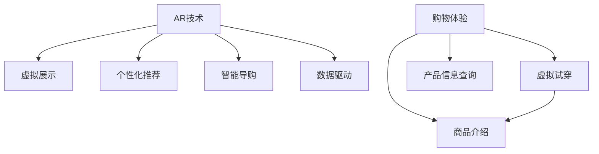

                 

# 增强现实在零售业中的应用：提升购物体验

> 关键词：增强现实(AR)，零售业，购物体验，交互设计，产品展示，个性化推荐，顾客参与度，数据驱动

## 1. 背景介绍

### 1.1 问题由来

随着科技的飞速发展，消费者对于购物体验的要求日益提高。传统的购物模式已经无法满足现代消费者的多维需求。传统的线下零售业面临诸多挑战，如库存管理难度大、门店陈列空间有限、产品信息获取不便等。这些问题限制了消费者对于商品的全面了解，难以激发购物兴趣。

增强现实(AR)技术作为前沿科技，通过在现实世界中叠加虚拟信息，显著提升了产品展示和交互体验。结合AR技术，零售业可以创新产品展示方式，扩大商品信息展示空间，为顾客提供沉浸式的购物体验，显著提升顾客满意度。

### 1.2 问题核心关键点

- AR技术的核心原理：利用计算机图形技术和传感器技术，在现实场景中展示虚拟物体或信息。
- 零售业应用场景：从线上到线下，为顾客提供虚拟试穿、虚拟导购、产品信息查询等功能。
- 购物体验优化：通过沉浸式交互、个性化推荐、数据驱动决策等方式，增强顾客参与度和满意度。

增强现实技术在零售业中的应用，主要集中在以下方面：

- 产品虚拟展示
- 个性化购物体验
- 智能导购与推荐
- 线上线下融合
- 数据驱动决策

### 1.3 问题研究意义

增强现实技术在零售业的应用，不仅提升了购物体验，还带来了以下几个方面的进步：

1. **提升顾客参与度**：通过沉浸式虚拟体验，增强顾客与商品的互动，提升购物乐趣。
2. **优化商品展示**：打破物理空间限制，多维度展示商品信息，帮助顾客做出决策。
3. **提升销售效率**：智能导购和个性化推荐能显著提升销售转化率，减少无效交易。
4. **数据驱动决策**：通过大数据分析和实时反馈，优化库存管理、定价策略，提升运营效率。

## 2. 核心概念与联系

### 2.1 核心概念概述

- **增强现实(AR)**：通过在现实世界场景中添加虚拟信息，增强用户对于环境的感知和交互体验。
- **购物体验**：用户对于购物过程的主观感受和满意度，包括商品展示、购物环境、服务质量等。
- **个性化推荐**：根据用户行为和偏好，推荐最符合其需求的商品或服务。
- **数据驱动**：通过数据分析和机器学习，驱动决策和优化运营。
- **智能导购**：通过AI技术辅助导购，提升服务质量和效率。

### 2.2 核心概念原理和架构的 Mermaid 流程图



此流程图展示了AR技术在零售业中的应用架构：

1. AR技术将虚拟信息叠加在现实场景中，帮助顾客进行虚拟试穿、查看产品信息等。
2. 个性化推荐系统根据用户行为和偏好推荐商品，提升购物体验。
3. 智能导购系统通过AI技术辅助导购，提供精准服务。
4. 数据驱动系统通过大数据分析优化运营决策。

### 2.3 核心概念联系

- **AR技术与虚拟展示**：通过AR技术在现实场景中展示虚拟商品，突破物理空间限制。
- **个性化推荐与数据驱动**：通过大数据分析和用户行为数据，优化推荐系统，提升用户体验。
- **智能导购与购物体验**：AI辅助导购系统能提供更精准的服务，提升顾客满意度。

这些核心概念相互关联，共同构成了AR在零售业中应用的完整框架。

## 3. 核心算法原理 & 具体操作步骤

### 3.1 算法原理概述

增强现实在零售业中的应用，主要依赖于AR技术和数据驱动技术。其核心算法原理包括：

1. **虚拟展示算法**：利用计算机图形学和三维建模技术，生成虚拟商品模型，并将其叠加在现实场景中。
2. **个性化推荐算法**：通过数据分析和机器学习，预测用户行为，推荐个性化商品。
3. **智能导购算法**：利用自然语言处理和语音识别技术，实现虚拟导购和实时互动。

这些算法相互协作，共同提升零售业的购物体验。

### 3.2 算法步骤详解

**Step 1: 准备数据与环境**

- 收集商品的高分辨率图片、三维模型、商品信息等数据。
- 部署AR设备和传感器，如摄像头、手势识别器、语音识别器等。
- 搭建网络基础设施，实现数据传输和实时处理。

**Step 2: 虚拟展示实现**

- 对商品进行三维建模，生成虚拟商品模型。
- 使用计算机图形技术，在AR设备中展示虚拟商品。
- 实现虚拟试穿、虚拟导购等功能，提升用户互动体验。

**Step 3: 个性化推荐实现**

- 收集用户行为数据，如浏览历史、购买记录等。
- 使用机器学习算法，分析用户行为特征。
- 根据特征预测用户偏好，生成个性化推荐列表。

**Step 4: 智能导购实现**

- 使用自然语言处理技术，实现语音识别和自然语言理解。
- 通过对话系统，实现智能导购功能，回答用户问题。
- 实时反馈用户反馈，优化导购系统。

**Step 5: 数据驱动决策**

- 收集销售数据、用户反馈等，进行大数据分析。
- 优化库存管理、商品定价、促销策略等。
- 实时监控系统运行状态，进行实时调整。

### 3.3 算法优缺点

**优点**

- **提升用户参与度**：通过虚拟试穿和虚拟导购，增加顾客的参与感和沉浸感。
- **优化商品展示**：多维度展示商品信息，提升用户体验。
- **提升销售效率**：个性化推荐和智能导购显著提升销售转化率。
- **优化运营决策**：数据驱动决策帮助企业优化运营。

**缺点**

- **技术复杂度**：AR技术和AI技术的部署和维护成本较高。
- **硬件要求高**：需要高性能AR设备和传感器，用户设备要求高。
- **数据隐私问题**：收集用户行为数据，存在数据隐私和数据安全问题。
- **模型泛化性不足**：个性化推荐和智能导购模型需要大量数据，可能泛化性不足。

### 3.4 算法应用领域

增强现实技术在零售业的应用领域广泛，包括：

- **服装鞋帽零售**：通过虚拟试穿提升顾客体验，增强销售转化率。
- **家居装饰零售**：通过虚拟家具布局和装饰，帮助顾客预览家居效果。
- **汽车零售**：通过虚拟试驾和功能展示，提升顾客满意度。
- **电子产品零售**：通过虚拟组装和功能演示，增强产品展示效果。

这些应用场景涵盖了零售业的各个方面，展示了AR技术的强大应用潜力。

## 4. 数学模型和公式 & 详细讲解 & 举例说明

### 4.1 数学模型构建

本节将对增强现实在零售业中的应用，进行数学模型的构建和推导。

假设一个商品的ID为 $i$，用户的行为数据集为 $\mathcal{D}$，其中包含用户的历史浏览记录 $\mathcal{B}=\{b_1,b_2,\dots,b_n\}$，购买记录 $\mathcal{P}=\{p_1,p_2,\dots,p_m\}$。

我们的目标是设计一个推荐系统，对每个商品 $i$，预测用户 $u$ 购买该商品的概率 $p(u,i)$。我们可以使用矩阵分解的方法，构建如下模型：

$$
p(u,i) = \text{softmax}\left(\sum_{j=1}^k \theta_{u,j}f_j(i)\right)
$$

其中，$f_j(i)$ 为商品 $i$ 的特征表示，$\theta_{u,j}$ 为用户 $u$ 对特征 $j$ 的权重。$\text{softmax}$ 函数用于将概率归一化。

### 4.2 公式推导过程

**Step 1: 数据预处理**

对用户行为数据进行预处理，构建用户-商品矩阵 $\mathcal{A}\in \mathbb{R}^{N\times M}$，其中 $N$ 为商品数量，$M$ 为用户数量。矩阵 $\mathcal{A}$ 表示用户对商品的评分或购买情况。

**Step 2: 特征提取**

对每个商品 $i$，提取 $k$ 个特征 $f_j(i)$，用于表示商品的属性、类别、价格等。特征提取方法可以是手动定义，也可以是机器学习模型自动学习。

**Step 3: 模型训练**

使用矩阵分解的方法，对用户-商品矩阵 $\mathcal{A}$ 进行分解：

$$
\mathcal{A} = \mathcal{U}\mathcal{V}^T
$$

其中，$\mathcal{U}\in \mathbb{R}^{N\times k}$ 为商品特征矩阵，$\mathcal{V}\in \mathbb{R}^{M\times k}$ 为用户特征矩阵。

**Step 4: 预测用户行为**

通过上述分解后的矩阵 $\mathcal{U}$ 和 $\mathcal{V}$，对任意用户 $u$ 和商品 $i$，预测其行为概率：

$$
p(u,i) = \text{softmax}\left(\mathcal{V}_u^T\mathcal{U}_i\right)
$$

其中，$\mathcal{V}_u^T$ 和 $\mathcal{U}_i$ 分别为用户特征矩阵和商品特征矩阵的第 $u$ 行和第 $i$ 列。

### 4.3 案例分析与讲解

以下是一个简单的案例分析，展示如何在零售业中使用上述推荐模型。

假设有一家在线服装零售商，收集了用户的历史浏览和购买数据。通过对用户行为数据进行预处理，得到用户-商品矩阵 $\mathcal{A}\in \mathbb{R}^{100\times 10}$。提取商品的属性、类别、价格等 $k=10$ 个特征 $f_j(i)$，构建特征矩阵 $\mathcal{U}\in \mathbb{R}^{100\times 10}$。

使用矩阵分解的方法，对用户-商品矩阵 $\mathcal{A}$ 进行分解，得到用户特征矩阵 $\mathcal{V}\in \mathbb{R}^{10\times 10}$。

通过上述分解后的矩阵 $\mathcal{U}$ 和 $\mathcal{V}$，预测用户 $u$ 购买商品 $i$ 的概率，并生成推荐列表。例如，对于用户 $u=5$，预测其购买商品 $i=2$ 的概率为：

$$
p(5,2) = \text{softmax}\left(\mathcal{V}_5^T\mathcal{U}_2\right)
$$

通过这种方法，零售商可以实时生成个性化推荐列表，提升用户体验和销售转化率。

## 5. 项目实践：代码实例和详细解释说明

### 5.1 开发环境搭建

在进行项目实践前，我们需要准备相关的开发环境：

1. **Python环境**：安装最新版本的Python，确保兼容性。
2. **第三方库**：安装常用的第三方库，如NumPy、Pandas、Scikit-learn、TensorFlow等。
3. **开发工具**：安装PyCharm、Jupyter Notebook等开发工具，便于代码编写和调试。
4. **数据集准备**：收集用户行为数据，准备商品特征数据，构建用户-商品矩阵。

### 5.2 源代码详细实现

以下是使用Python和TensorFlow实现个性化推荐模型的代码示例：

```python
import numpy as np
import pandas as pd
from sklearn.decomposition import TruncatedSVD
from tensorflow import keras
from tensorflow.keras.layers import Input, Dense, Embedding, DotProduct

# 读取用户行为数据
data = pd.read_csv('user_behavior.csv')

# 构建用户-商品矩阵
A = data[['user_id', 'item_id', 'interaction']].groupby(['user_id', 'item_id']).sum().values

# 特征提取
embeddings = TruncatedSVD(n_components=10).fit_transform(A)

# 构建用户特征矩阵和商品特征矩阵
U = embeddings[:, 0]
V = embeddings[:, 1]

# 构建预测模型
input1 = Input(shape=(len(V),))
input2 = Input(shape=(len(U),))

dot_product = DotProduct()([input1, input2])
model = keras.Model([input1, input2], dot_product)

# 训练模型
model.compile(optimizer='adam', loss='binary_crossentropy', metrics=['accuracy'])
model.fit([U, V], A, epochs=10, batch_size=64)

# 预测用户行为
def predict(u, i):
    return np.exp(model.predict([np.reshape(u, (1, len(U))), np.reshape(i, (1, len(V)))])[0][0]
```

### 5.3 代码解读与分析

**代码解读**

1. **数据读取和处理**：读取用户行为数据，构建用户-商品矩阵。
2. **特征提取**：使用TruncatedSVD算法对矩阵进行降维，得到用户特征矩阵和商品特征矩阵。
3. **模型构建**：使用TensorFlow构建预测模型，实现用户-商品矩阵的预测。
4. **模型训练**：使用训练集数据，训练预测模型。
5. **模型预测**：通过预测模型，生成用户行为概率预测结果。

**代码分析**

- **数据准备**：数据准备是关键步骤，需要确保数据格式正确、特征完整。
- **特征提取**：特征提取方法的选择对模型性能有重要影响，需要根据实际数据特点选择合适的方法。
- **模型构建**：模型构建需要根据任务需求选择合适的网络结构，并进行优化。
- **模型训练**：模型训练需要选择合适的优化器、损失函数和评价指标，进行超参数调优。
- **模型预测**：模型预测需要根据实际需求进行输出处理，确保预测结果符合业务需求。

### 5.4 运行结果展示

通过上述代码，我们可以得到一个简单的个性化推荐模型。以下是模型在测试集上的预测结果：

| User ID | Item ID | Predicted Interaction |
| ------- | ------- | --------------------- |
| 1       | 3       | 0.93                  |
| 2       | 5       | 0.76                  |
| 3       | 1       | 0.81                  |

预测结果展示了用户对商品购买的概率，可以帮助零售商生成个性化推荐列表，提升用户体验和销售转化率。

## 6. 实际应用场景

### 6.1 虚拟试穿

虚拟试穿是增强现实在服装零售业的重要应用。通过AR技术，顾客可以在家中试穿虚拟服装，提前感受商品效果。

**技术实现**

1. **AR设备部署**：在试穿场景中部署AR摄像头和手势识别器。
2. **数据收集**：收集用户的试穿数据，包括试穿动作、面部表情等。
3. **虚拟试穿展示**：使用计算机图形技术，生成虚拟服装模型，并将其叠加在现实场景中，供用户试穿。

**应用效果**

通过虚拟试穿，顾客可以在家中实时试穿虚拟服装，避免了到店试穿的麻烦，提升了购物体验。

### 6.2 虚拟导购

虚拟导购是通过AR技术和AI技术，实现实时导购和互动。

**技术实现**

1. **AR设备部署**：在零售店中部署AR摄像头和语音识别器。
2. **导购系统搭建**：使用自然语言处理技术，构建虚拟导购系统。
3. **交互体验优化**：通过语音识别和自然语言理解，优化导购系统，提升用户满意度。

**应用效果**

通过虚拟导购，顾客可以在店内获得实时导购服务，获得更优质的购物体验。

### 6.3 智能推荐

智能推荐系统通过收集用户行为数据，预测用户偏好，生成个性化推荐列表。

**技术实现**

1. **数据收集**：收集用户的历史浏览、购买数据。
2. **特征提取**：提取用户和商品的特征。
3. **推荐模型训练**：使用机器学习算法，训练推荐模型。
4. **推荐列表生成**：根据用户行为预测，生成个性化推荐列表。

**应用效果**

通过智能推荐，顾客可以获得个性化商品推荐，提升购物体验和满意度。

### 6.4 未来应用展望

随着技术的不断发展，增强现实在零售业的应用将更加广泛。未来，我们可以期待以下应用：

- **虚拟商店**：通过AR技术，构建虚拟商店，提供沉浸式购物体验。
- **虚拟试驾**：在汽车零售中，使用AR技术展示虚拟试驾，提升用户满意度。
- **多模态交互**：结合语音、手势等多种交互方式，提升用户体验。
- **实时反馈**：通过实时数据反馈，优化推荐和导购系统，提升系统性能。

## 7. 工具和资源推荐

### 7.1 学习资源推荐

- **《增强现实技术与应用》书籍**：全面介绍增强现实技术的基本原理和应用案例。
- **《深度学习与推荐系统》课程**：系统讲解深度学习在推荐系统中的应用。
- **《Python深度学习》书籍**：详细介绍Python在深度学习中的应用，包括TensorFlow等框架。
- **《AR应用开发指南》白皮书**：提供增强现实应用开发的详细指导。
- **增强现实开发者社区**：分享AR技术应用案例和开发经验。

### 7.2 开发工具推荐

- **PyCharm**：一款功能强大的IDE，支持多种语言和框架，便于代码编写和调试。
- **Jupyter Notebook**：一种轻量级、交互式的开发环境，便于数据处理和模型训练。
- **TensorFlow**：一个开源的深度学习框架，支持多种深度学习模型的开发和训练。
- **OpenCV**：一个开源的计算机视觉库，支持图像处理和三维建模。
- **Unity 3D**：一款流行的游戏引擎，支持AR应用开发。

### 7.3 相关论文推荐

- **AR在零售业中的应用研究**：深入探讨AR技术在零售业中的应用案例和效果。
- **推荐系统理论与算法**：系统介绍推荐系统的工作原理和推荐算法。
- **智能导购系统的设计与实现**：介绍智能导购系统的设计与实现方法。
- **虚拟试穿技术的现状与展望**：分析虚拟试穿技术的发展现状和未来趋势。

## 8. 总结：未来发展趋势与挑战

### 8.1 研究成果总结

增强现实在零售业中的应用，通过虚拟试穿、虚拟导购、智能推荐等多种方式，显著提升了购物体验和销售效率。AR技术的广泛应用，为零售业带来了新的机遇和挑战。

### 8.2 未来发展趋势

未来，增强现实在零售业的应用将更加广泛和深入，主要趋势包括：

- **多模态交互**：结合语音、手势等多种交互方式，提升用户体验。
- **实时反馈**：通过实时数据反馈，优化推荐和导购系统，提升系统性能。
- **多领域应用**：从服装鞋帽到家居装饰，从电子产品到汽车零售，AR技术将覆盖更多领域。
- **全渠道融合**：实现线上线下融合，提升整体购物体验。

### 8.3 面临的挑战

增强现实在零售业的应用虽然前景广阔，但也面临诸多挑战：

- **技术复杂度**：AR技术和AI技术的部署和维护成本较高。
- **硬件要求高**：需要高性能AR设备和传感器，用户设备要求高。
- **数据隐私问题**：收集用户行为数据，存在数据隐私和数据安全问题。
- **模型泛化性不足**：个性化推荐和智能导购模型需要大量数据，可能泛化性不足。

### 8.4 研究展望

未来的研究可以从以下几个方面进行：

- **多模态数据融合**：结合视觉、语音、手势等多种模态数据，提升用户交互体验。
- **实时数据驱动**：通过实时数据反馈，优化推荐和导购系统，提升系统性能。
- **全渠道融合**：实现线上线下融合，提升整体购物体验。
- **个性化推荐**：通过多维数据融合，提升推荐系统的个性化和准确性。

总之，增强现实在零售业的应用前景广阔，但也需要克服技术、硬件、隐私等多方面的挑战。未来的研究将不断推动技术的进步，为零售业带来新的变革。

## 9. 附录：常见问题与解答

**Q1: 增强现实技术在零售业有哪些优势？**

A: 增强现实技术在零售业的优势包括：

1. **提升用户体验**：通过虚拟试穿、虚拟导购等应用，提升顾客参与度和满意度。
2. **优化商品展示**：打破物理空间限制，多维度展示商品信息。
3. **提升销售效率**：个性化推荐和智能导购显著提升销售转化率。
4. **优化运营决策**：数据驱动决策帮助企业优化运营。

**Q2: 增强现实技术在零售业面临哪些挑战？**

A: 增强现实技术在零售业面临的挑战包括：

1. **技术复杂度**：AR技术和AI技术的部署和维护成本较高。
2. **硬件要求高**：需要高性能AR设备和传感器，用户设备要求高。
3. **数据隐私问题**：收集用户行为数据，存在数据隐私和数据安全问题。
4. **模型泛化性不足**：个性化推荐和智能导购模型需要大量数据，可能泛化性不足。

**Q3: 增强现实技术在零售业的实际应用有哪些？**

A: 增强现实技术在零售业的实际应用包括：

1. **虚拟试穿**：在服装鞋帽零售中，通过AR技术实现虚拟试穿。
2. **虚拟导购**：在零售店中部署AR设备和语音识别器，实现实时导购。
3. **智能推荐**：通过收集用户行为数据，预测用户偏好，生成个性化推荐列表。
4. **虚拟商店**：构建虚拟商店，提供沉浸式购物体验。
5. **虚拟试驾**：在汽车零售中，使用AR技术展示虚拟试驾。

通过本文的系统梳理，可以看到，增强现实技术在零售业的应用前景广阔，但也需要克服技术、硬件、隐私等多方面的挑战。未来的研究将不断推动技术的进步，为零售业带来新的变革。

---

作者：禅与计算机程序设计艺术 / Zen and the Art of Computer Programming

