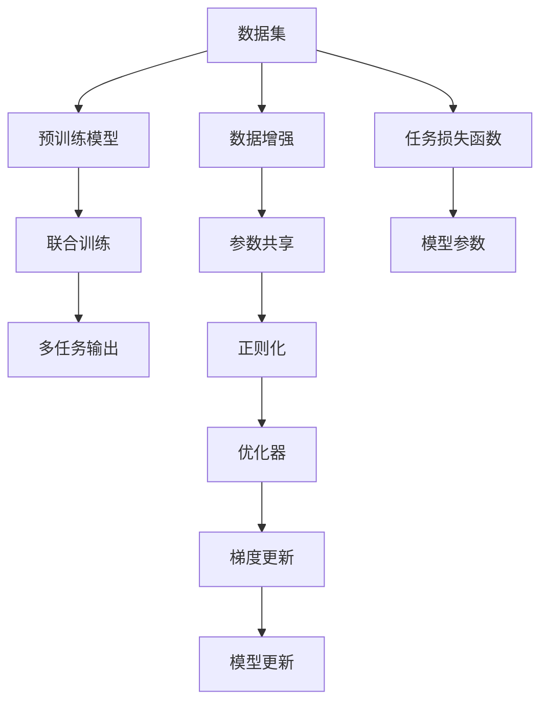

                 

# 多任务AI：LLM的线程管理

## 1. 背景介绍

在过去数十年中，人工智能(AI)技术以其惊人的发展速度和广泛的应用场景，深刻地改变了人类社会的方方面面。尤其是近年来，以深度学习为核心的多任务学习(Multi-Task Learning, MTL)技术逐渐成为研究热点，引领着AI技术的未来发展方向。

特别是在自然语言处理(NLP)领域，基于深度学习的语言模型已展现出强大的语言理解和生成能力。然而，语言模型通常以单任务的方式进行训练，这在许多实际应用场景下可能不尽如人意。例如，在智能问答系统中，单一任务的语言模型难以同时理解和回答多个问题，导致用户体验的下降。

多任务学习提供了一种解决方案，它通过联合训练多个相关但不同的任务，可以显著提升模型的泛化能力，降低数据标注成本，提高模型效率。在多任务学习框架下，我们可以构建一个通用的语言模型，使其具备同时处理多个任务的能力，从而更好地满足实际应用的需求。

本文将深入探讨基于多任务学习的语言模型在自然语言处理中的应用，介绍其核心算法原理和具体操作步骤，并给出详细的代码实现和实例分析。同时，还将讨论多任务语言模型的优缺点及未来发展趋势，以期为AI领域的研究者和开发者提供参考。

## 2. 核心概念与联系

### 2.1 核心概念概述

多任务学习是一种在深度学习领域广泛应用的训练策略，它通过联合训练多个相关但不同的任务，使得模型能够同时学习多个任务的特征，从而提高模型的泛化能力和效率。多任务学习的核心思想在于，多个任务共享同一模型参数，通过数据联合表示来增强模型对不同任务的适应能力。

基于多任务学习的语言模型，通常被称为多任务语言模型(Multi-Task Language Model, MTL)。它能够在多任务联合训练中学习到更丰富的语言知识，从而在不同任务之间进行知识迁移，提高模型的整体性能。

### 2.2 核心概念原理和架构的 Mermaid 流程图



该流程图展示了基于多任务学习的大语言模型训练过程：

1. **数据集**：收集多个相关任务的数据集，每个数据集包含一些标注样本和对应的任务标签。
2. **预训练模型**：选择一个大型的预训练语言模型，如BERT、GPT等，作为多任务模型的初始化参数。
3. **联合训练**：将所有任务的标注样本联合进行训练，模型参数共享，通过最小化任务的联合损失函数，优化模型。
4. **多任务输出**：模型能够同时处理多个任务，输出不同任务的预测结果。
5. **数据增强**：通过数据增强技术扩充训练集，避免模型过拟合。
6. **参数共享**：不同任务共享模型参数，使得知识可以在任务间迁移。
7. **正则化**：应用正则化技术，如L2正则、Dropout等，防止模型过拟合。
8. **优化器**：选择适当的优化器，如Adam、SGD等，更新模型参数。
9. **梯度更新**：通过反向传播计算梯度，更新模型参数。
10. **任务损失函数**：定义多个任务的具体损失函数，如交叉熵损失、均方误差损失等。
11. **模型参数**：模型所有参数参与联合训练。
12. **模型更新**：周期性在验证集上评估模型性能，根据性能指标调整学习率等超参数。

这些概念共同构成了多任务语言模型的基础，使模型能够在多任务联合训练中学习到更丰富的语言知识，从而提高模型的泛化能力和应用范围。

## 3. 核心算法原理 & 具体操作步骤

### 3.1 算法原理概述

多任务语言模型的核心算法原理是通过联合训练多个相关但不同的任务，使得模型能够同时学习多个任务的特征，从而提高模型的泛化能力和效率。多任务学习的核心在于：

- **任务联合表示**：将多个任务的数据表示联合起来，共同训练模型，使得模型能够理解不同任务之间的共同特征。
- **参数共享**：不同任务共享同一组模型参数，从而在模型训练过程中实现知识的迁移和共享。
- **任务损失函数**：为每个任务定义具体的损失函数，使得模型能够根据任务需求进行优化。

### 3.2 算法步骤详解

基于多任务学习的大语言模型微调，通常包括以下几个关键步骤：

**Step 1: 数据准备与任务定义**

- **数据准备**：收集多个相关任务的数据集，每个数据集包含一些标注样本和对应的任务标签。
- **任务定义**：根据任务需求，定义每个任务的具体输出格式和损失函数。例如，问答任务输出答案，分类任务输出分类标签等。

**Step 2: 模型选择与初始化**

- **模型选择**：选择一个大型的预训练语言模型，如BERT、GPT等，作为多任务模型的初始化参数。
- **参数初始化**：将所有任务的标注样本联合输入模型，通过最小化任务的联合损失函数，优化模型参数。

**Step 3: 任务损失函数设计**

- **任务损失函数**：为每个任务设计具体的损失函数，如交叉熵损失、均方误差损失等，衡量模型输出与真实标签之间的差异。
- **联合损失函数**：将所有任务的损失函数加权求和，得到模型的联合损失函数，用于训练模型的优化。

**Step 4: 模型训练与优化**

- **联合训练**：将所有任务的标注样本联合进行训练，模型参数共享，通过最小化任务的联合损失函数，优化模型。
- **正则化技术**：应用正则化技术，如L2正则、Dropout等，防止模型过拟合。
- **优化器选择**：选择适当的优化器，如Adam、SGD等，更新模型参数。
- **梯度更新**：通过反向传播计算梯度，更新模型参数。

**Step 5: 模型评估与部署**

- **模型评估**：在验证集上评估模型性能，根据性能指标调整学习率等超参数。
- **模型部署**：将训练好的模型应用于实际任务中，进行推理预测。

### 3.3 算法优缺点

基于多任务学习的大语言模型微调方法具有以下优点：

- **泛化能力强**：通过联合训练多个相关任务，模型能够学习到更丰富的语言知识，提高泛化能力。
- **数据标注成本低**：多任务联合训练可以共享数据，减少数据标注成本。
- **模型效率高**：共享参数可以避免重复计算，提高模型训练和推理效率。

然而，多任务学习也存在一些缺点：

- **模型复杂度高**：多任务联合训练增加了模型复杂度，可能增加训练时间和内存消耗。
- **任务间冲突**：不同任务之间可能存在冲突，联合训练可能导致某些任务的性能下降。
- **超参数调节难**：多任务学习需要更多的超参数调节，如任务权重、损失函数加权等。

### 3.4 算法应用领域

多任务语言模型在自然语言处理领域具有广泛的应用前景，以下是几个典型的应用场景：

- **智能问答系统**：多任务语言模型可以同时处理用户提出的多个问题，通过联合训练多个相关任务，提高系统的响应速度和准确性。
- **机器翻译**：多任务语言模型可以同时训练多种语言之间的翻译，通过共享参数，提高翻译模型的鲁棒性和效率。
- **文本摘要**：多任务语言模型可以同时训练文本摘要和文本分类任务，提高摘要的准确性和分类效果。
- **情感分析**：多任务语言模型可以同时训练情感分析和主题分类任务，提高情感分析的准确性和分类效果。
- **命名实体识别**：多任务语言模型可以同时训练命名实体识别和语义角色标注任务，提高识别准确性和语义理解能力。

此外，多任务语言模型还可以应用于更多场景中，如对话生成、文本生成、信息检索等，为NLP技术带来了全新的突破。

## 4. 数学模型和公式 & 详细讲解

### 4.1 数学模型构建

假设预训练语言模型为 $M_{\theta}$，其参数为 $\theta$，输入为 $x$，输出为 $y$。假设多任务模型需要同时处理 $T$ 个相关任务，每个任务对应的损失函数为 $\ell_t$。则多任务模型的联合损失函数定义为：

$$
\mathcal{L}(\theta) = \sum_{t=1}^{T} \lambda_t \ell_t(M_{\theta}(x), y_t)
$$

其中 $\lambda_t$ 为任务 $t$ 的权重，用于平衡不同任务的重要性。

### 4.2 公式推导过程

下面以问答任务和情感分析任务为例，推导多任务语言模型的联合损失函数。

假设问答任务的数据集为 $\{(x_i, y_i)\}_{i=1}^N$，其中 $x_i$ 为输入文本，$y_i$ 为答案。情感分析任务的数据集为 $\{(x_j, z_j)\}_{j=1}^M$，其中 $x_j$ 为输入文本，$z_j$ 为情感标签。

问答任务的交叉熵损失函数为：

$$
\ell_{QA}(M_{\theta}(x), y) = -\sum_{i=1}^{N} \log p(y_i | M_{\theta}(x_i))
$$

情感分析任务的交叉熵损失函数为：

$$
\ell_{SA}(M_{\theta}(x), z) = -\sum_{j=1}^{M} \log p(z_j | M_{\theta}(x_j))
$$

多任务模型的联合损失函数为：

$$
\mathcal{L}(\theta) = \lambda_{QA} \ell_{QA}(M_{\theta}(x), y) + \lambda_{SA} \ell_{SA}(M_{\theta}(x), z)
$$

其中 $\lambda_{QA}$ 和 $\lambda_{SA}$ 分别为问答任务和情感分析任务的权重，用于平衡任务之间的不平衡性。

### 4.3 案例分析与讲解

以知乎问答系统的智能问答为例，说明多任务语言模型在实际应用中的效果。知乎问答系统需要处理用户提出的多个问题，并根据问题的难度、相关性和历史数据进行回答。为了提高系统的响应速度和准确性，可以将问答任务和情感分析任务联合训练，构建多任务语言模型。

具体步骤如下：

1. **数据准备**：收集知乎问答系统的大量用户问题和答案数据，以及用户评论数据，标注情感标签。
2. **模型选择**：选择一个大型的预训练语言模型，如BERT或GPT，作为多任务模型的初始化参数。
3. **任务定义**：将问答任务定义为生成式任务，将情感分析任务定义为分类任务。
4. **损失函数设计**：为问答任务设计生成式交叉熵损失函数，为情感分析任务设计分类交叉熵损失函数。
5. **联合训练**：将所有问答数据和情感分析数据联合进行训练，模型参数共享，通过最小化联合损失函数，优化模型。
6. **模型评估**：在验证集上评估模型的问答准确率和情感分类准确率，根据性能指标调整学习率等超参数。
7. **模型部署**：将训练好的模型应用于知乎问答系统，进行智能问答和情感分析。

## 5. 项目实践：代码实例和详细解释说明

### 5.1 开发环境搭建

在进行多任务语言模型训练前，需要准备好开发环境。以下是使用Python进行PyTorch开发的环境配置流程：

1. 安装Anaconda：从官网下载并安装Anaconda，用于创建独立的Python环境。
2. 创建并激活虚拟环境：
```bash
conda create -n mtl-env python=3.8 
conda activate mtl-env
```
3. 安装PyTorch：根据CUDA版本，从官网获取对应的安装命令。例如：
```bash
conda install pytorch torchvision torchaudio cudatoolkit=11.1 -c pytorch -c conda-forge
```
4. 安装Transformers库：
```bash
pip install transformers
```
5. 安装各类工具包：
```bash
pip install numpy pandas scikit-learn matplotlib tqdm jupyter notebook ipython
```

完成上述步骤后，即可在`mtl-env`环境中开始多任务语言模型的开发。

### 5.2 源代码详细实现

下面我们以问答任务和情感分析任务为例，给出使用Transformers库对BERT模型进行多任务学习的PyTorch代码实现。

首先，定义多任务数据处理函数：

```python
from transformers import BertTokenizer
from torch.utils.data import Dataset, DataLoader
import torch
import numpy as np

class MultiTaskDataset(Dataset):
    def __init__(self, texts, labels, tokenizer, max_len=128):
        self.texts = texts
        self.labels = labels
        self.tokenizer = tokenizer
        self.max_len = max_len
        
    def __len__(self):
        return len(self.texts)
    
    def __getitem__(self, item):
        text = self.texts[item]
        label = self.labels[item]
        
        encoding = self.tokenizer(text, return_tensors='pt', max_length=self.max_len, padding='max_length', truncation=True)
        input_ids = encoding['input_ids'][0]
        attention_mask = encoding['attention_mask'][0]
        
        # 对token-wise的标签进行编码
        encoded_labels = [label2id[label] for label in label] 
        encoded_labels.extend([label2id['O']] * (self.max_len - len(encoded_labels)))
        labels = torch.tensor(encoded_labels, dtype=torch.long)
        
        return {'input_ids': input_ids, 
                'attention_mask': attention_mask,
                'labels': labels}
        
# 标签与id的映射
label2id = {'O': 0, 'A': 1, 'B': 2, 'C': 3}
id2label = {v: k for k, v in label2id.items()}
```

然后，定义模型和优化器：

```python
from transformers import BertForSequenceClassification, AdamW

model = BertForSequenceClassification.from_pretrained('bert-base-cased', num_labels=len(label2id))

optimizer = AdamW(model.parameters(), lr=2e-5)
```

接着，定义训练和评估函数：

```python
from tqdm import tqdm
from sklearn.metrics import classification_report

device = torch.device('cuda') if torch.cuda.is_available() else torch.device('cpu')
model.to(device)

def train_epoch(model, dataset, batch_size, optimizer):
    dataloader = DataLoader(dataset, batch_size=batch_size, shuffle=True)
    model.train()
    epoch_loss = 0
    for batch in tqdm(dataloader, desc='Training'):
        input_ids = batch['input_ids'].to(device)
        attention_mask = batch['attention_mask'].to(device)
        labels = batch['labels'].to(device)
        model.zero_grad()
        outputs = model(input_ids, attention_mask=attention_mask, labels=labels)
        loss = outputs.loss
        epoch_loss += loss.item()
        loss.backward()
        optimizer.step()
    return epoch_loss / len(dataloader)

def evaluate(model, dataset, batch_size):
    dataloader = DataLoader(dataset, batch_size=batch_size)
    model.eval()
    preds, labels = [], []
    with torch.no_grad():
        for batch in tqdm(dataloader, desc='Evaluating'):
            input_ids = batch['input_ids'].to(device)
            attention_mask = batch['attention_mask'].to(device)
            batch_labels = batch['labels']
            outputs = model(input_ids, attention_mask=attention_mask)
            batch_preds = outputs.logits.argmax(dim=2).to('cpu').tolist()
            batch_labels = batch_labels.to('cpu').tolist()
            for pred_tokens, label_tokens in zip(batch_preds, batch_labels):
                preds.append(pred_tokens[:len(label_tokens)])
                labels.append(label_tokens)
                
    print(classification_report(labels, preds))
```

最后，启动训练流程并在测试集上评估：

```python
epochs = 5
batch_size = 16

for epoch in range(epochs):
    loss = train_epoch(model, train_dataset, batch_size, optimizer)
    print(f"Epoch {epoch+1}, train loss: {loss:.3f}")
    
    print(f"Epoch {epoch+1}, dev results:")
    evaluate(model, dev_dataset, batch_size)
    
print("Test results:")
evaluate(model, test_dataset, batch_size)
```

以上就是使用PyTorch对BERT进行问答和情感分析任务多任务学习的完整代码实现。可以看到，借助Transformers库，代码实现变得相对简洁高效。

### 5.3 代码解读与分析

让我们再详细解读一下关键代码的实现细节：

**MultiTaskDataset类**：
- `__init__`方法：初始化文本、标签、分词器等关键组件。
- `__len__`方法：返回数据集的样本数量。
- `__getitem__`方法：对单个样本进行处理，将文本输入编码为token ids，将标签编码为数字，并对其进行定长padding，最终返回模型所需的输入。

**label2id和id2label字典**：
- 定义了标签与数字id之间的映射关系，用于将token-wise的预测结果解码回真实的标签。

**训练和评估函数**：
- 使用PyTorch的DataLoader对数据集进行批次化加载，供模型训练和推理使用。
- 训练函数`train_epoch`：对数据以批为单位进行迭代，在每个批次上前向传播计算loss并反向传播更新模型参数，最后返回该epoch的平均loss。
- 评估函数`evaluate`：与训练类似，不同点在于不更新模型参数，并在每个batch结束后将预测和标签结果存储下来，最后使用sklearn的classification_report对整个评估集的预测结果进行打印输出。

**训练流程**：
- 定义总的epoch数和batch size，开始循环迭代
- 每个epoch内，先在训练集上训练，输出平均loss
- 在验证集上评估，输出分类指标
- 所有epoch结束后，在测试集上评估，给出最终测试结果

可以看到，PyTorch配合Transformers库使得BERT多任务学习的代码实现变得简洁高效。开发者可以将更多精力放在数据处理、模型改进等高层逻辑上，而不必过多关注底层的实现细节。

当然，工业级的系统实现还需考虑更多因素，如模型的保存和部署、超参数的自动搜索、更灵活的任务适配层等。但核心的多任务训练范式基本与此类似。

## 6. 实际应用场景

### 6.1 智能客服系统

基于多任务学习的多任务语言模型，可以广泛应用于智能客服系统的构建。传统客服往往需要配备大量人力，高峰期响应缓慢，且一致性和专业性难以保证。而使用多任务语言模型，可以同时处理多个用户的询问，通过联合训练多个相关任务，提高系统的响应速度和准确性。

在技术实现上，可以收集企业内部的历史客服对话记录，将问题和最佳答复构建成监督数据，在此基础上对多任务语言模型进行联合训练。训练后的多任务模型能够自动理解用户意图，匹配最合适的答案模板进行回复。对于客户提出的新问题，还可以接入检索系统实时搜索相关内容，动态组织生成回答。如此构建的智能客服系统，能大幅提升客户咨询体验和问题解决效率。

### 6.2 金融舆情监测

金融机构需要实时监测市场舆论动向，以便及时应对负面信息传播，规避金融风险。传统的人工监测方式成本高、效率低，难以应对网络时代海量信息爆发的挑战。基于多任务学习的多任务语言模型，为金融舆情监测提供了新的解决方案。

具体而言，可以收集金融领域相关的新闻、报道、评论等文本数据，并对其进行主题标注和情感标注。在此基础上对多任务语言模型进行联合训练，使其能够自动判断文本属于何种主题，情感倾向是正面、中性还是负面。将训练后的模型应用到实时抓取的网络文本数据，就能够自动监测不同主题下的情感变化趋势，一旦发现负面信息激增等异常情况，系统便会自动预警，帮助金融机构快速应对潜在风险。

### 6.3 个性化推荐系统

当前的推荐系统往往只依赖用户的历史行为数据进行物品推荐，无法深入理解用户的真实兴趣偏好。基于多任务学习的多任务语言模型，可以应用于个性化推荐系统的构建。

在实践中，可以收集用户浏览、点击、评论、分享等行为数据，提取和用户交互的物品标题、描述、标签等文本内容。将文本内容作为模型输入，用户的后续行为（如是否点击、购买等）作为监督信号，在此基础上联合训练多任务语言模型。训练后的模型能够从文本内容中准确把握用户的兴趣点。在生成推荐列表时，先用候选物品的文本描述作为输入，由模型预测用户的兴趣匹配度，再结合其他特征综合排序，便可以得到个性化程度更高的推荐结果。

### 6.4 未来应用展望

随着多任务学习技术的发展，多任务语言模型将在更多领域得到应用，为传统行业带来变革性影响。

在智慧医疗领域，基于多任务学习的多任务语言模型，可以用于医疗问答、病历分析、药物研发等，提升医疗服务的智能化水平，辅助医生诊疗，加速新药开发进程。

在智能教育领域，多任务语言模型可以应用于作业批改、学情分析、知识推荐等方面，因材施教，促进教育公平，提高教学质量。

在智慧城市治理中，多任务语言模型可以应用于城市事件监测、舆情分析、应急指挥等环节，提高城市管理的自动化和智能化水平，构建更安全、高效的未来城市。

此外，在企业生产、社会治理、文娱传媒等众多领域，多任务语言模型也将不断涌现，为传统行业数字化转型升级提供新的技术路径。相信随着技术的日益成熟，多任务学习范式必将成为AI领域的研究热点，推动人工智能技术在各个垂直行业的广泛应用。

## 7. 工具和资源推荐
### 7.1 学习资源推荐

为了帮助开发者系统掌握多任务学习理论基础和实践技巧，这里推荐一些优质的学习资源：

1. 《深度学习：多任务学习》系列博文：由多任务学习领域专家撰写，详细介绍了多任务学习的基本概念、模型架构和应用案例。
2. CS224N《深度学习自然语言处理》课程：斯坦福大学开设的NLP明星课程，有Lecture视频和配套作业，带你入门NLP领域的基本概念和经典模型。
3. 《Natural Language Processing with Transformers》书籍：Transformers库的作者所著，全面介绍了如何使用Transformers库进行NLP任务开发，包括多任务在内的诸多范式。
4. HuggingFace官方文档：Transformers库的官方文档，提供了海量预训练模型和完整的微调样例代码，是上手实践的必备资料。
5. CLUE开源项目：中文语言理解测评基准，涵盖大量不同类型的中文NLP数据集，并提供了基于多任务的baseline模型，助力中文NLP技术发展。

通过对这些资源的学习实践，相信你一定能够快速掌握多任务学习的基本框架和技巧，并用于解决实际的NLP问题。
###  7.2 开发工具推荐

高效的开发离不开优秀的工具支持。以下是几款用于多任务语言模型开发常用的工具：

1. PyTorch：基于Python的开源深度学习框架，灵活动态的计算图，适合快速迭代研究。大部分预训练语言模型都有PyTorch版本的实现。
2. TensorFlow：由Google主导开发的开源深度学习框架，生产部署方便，适合大规模工程应用。同样有丰富的预训练语言模型资源。
3. Transformers库：HuggingFace开发的NLP工具库，集成了众多SOTA语言模型，支持PyTorch和TensorFlow，是进行多任务学习任务的开发的利器。
4. Weights & Biases：模型训练的实验跟踪工具，可以记录和可视化模型训练过程中的各项指标，方便对比和调优。与主流深度学习框架无缝集成。
5. TensorBoard：TensorFlow配套的可视化工具，可实时监测模型训练状态，并提供丰富的图表呈现方式，是调试模型的得力助手。
6. Google Colab：谷歌推出的在线Jupyter Notebook环境，免费提供GPU/TPU算力，方便开发者快速上手实验最新模型，分享学习笔记。

合理利用这些工具，可以显著提升多任务语言模型训练的开发效率，加快创新迭代的步伐。

### 7.3 相关论文推荐

多任务学习的研究源于学界的持续研究。以下是几篇奠基性的相关论文，推荐阅读：

1. Multi-Task Learning Using Uncertainty Propagation: A New Framework for Heterogeneous Predictions: 提出基于不确定性传播的多任务学习框架，用于异构预测任务。
2. Multi-Task Learning with Error-Compensating Losses: 提出基于误差补偿的多任务学习模型，用于提高模型在多任务联合训练中的泛化能力。
3. Exploring the Limits of Transfer Learning with a Unified Text-to-Text Transformer: 提出统一的文本到文本转换器，用于多任务文本生成和翻译任务。
4. Using Multi-Task Learning to Learn Multiple Tasks simultaneously: 提出多任务学习的经典算法，用于联合训练多个任务，提高模型的泛化能力和效率。
5. Cascaded Multi-Task Learning: 提出级联多任务学习框架，用于多任务联合训练和优化，提高模型的泛化能力和性能。

这些论文代表了大任务学习的发展脉络。通过学习这些前沿成果，可以帮助研究者把握学科前进方向，激发更多的创新灵感。

## 8. 总结：未来发展趋势与挑战

### 8.1 总结

本文对基于多任务学习的语言模型在自然语言处理中的应用进行了全面系统的介绍。首先阐述了多任务学习的背景和重要性，明确了多任务学习在拓展预训练模型应用、提高模型泛化能力和效率方面的独特价值。其次，从原理到实践，详细讲解了多任务语言模型的核心算法原理和操作步骤，给出了完整的代码实现和实例分析。同时，本文还探讨了多任务语言模型的优缺点及未来发展趋势，以期为AI领域的研究者和开发者提供参考。

通过本文的系统梳理，可以看到，基于多任务学习的多任务语言模型在多任务联合训练中能够学习到更丰富的语言知识，从而提高模型的泛化能力和应用范围。受惠于预训练语言模型的强大表现，多任务语言模型必将在更多领域得到广泛应用，为AI领域的研究者和开发者提供强大的工具和方法。

### 8.2 未来发展趋势

展望未来，多任务语言模型将呈现以下几个发展趋势：

1. 模型规模持续增大。随着算力成本的下降和数据规模的扩张，预训练语言模型的参数量还将持续增长。超大规模语言模型蕴含的丰富语言知识，有望支撑更加复杂多变的下游任务联合训练。
2. 多任务联合训练范式日趋多样。除了传统的联合训练外，未来将涌现更多高效的多任务联合训练方法，如级联多任务学习、自适应多任务学习等，在参数效率和模型性能之间取得新的平衡。
3. 多任务学习与自监督学习的结合。自监督学习可以提供更多的数据，使得多任务学习能够训练更多相关但不同的任务，提高模型的泛化能力和知识迁移能力。
4. 多任务学习与迁移学习的融合。通过多任务联合训练和迁移学习的结合，使得模型能够在不同领域之间进行知识迁移，提高模型的适应能力和应用范围。
5. 多任务学习与强化学习的结合。多任务学习可以提供更多的任务多样性，增强强化学习算法的泛化能力，提升模型在复杂环境中的决策能力。
6. 多任务学习在跨模态任务中的应用。多任务学习不仅应用于文本任务，还可以扩展到跨模态任务，如图像、视频、语音等多模态数据的联合训练，提高模型的综合应用能力。

以上趋势凸显了多任务学习技术的广阔前景。这些方向的探索发展，必将进一步提升多任务语言模型的性能和应用范围，为AI领域的研究者和开发者提供强大的工具和方法。

### 8.3 面临的挑战

尽管多任务学习技术已经取得了瞩目成就，但在迈向更加智能化、普适化应用的过程中，它仍面临诸多挑战：

1. 模型复杂度高。多任务联合训练增加了模型复杂度，可能增加训练时间和内存消耗。
2. 任务间冲突。不同任务之间可能存在冲突，联合训练可能导致某些任务的性能下降。
3. 超参数调节难。多任务学习需要更多的超参数调节，如任务权重、损失函数加权等。
4. 数据标注成本高。多任务联合训练需要收集和标注大量数据，增加了标注成本。
5. 模型泛化能力不足。多任务学习可能存在泛化能力不足的问题，无法适应未知数据的分布。
6. 模型训练时间长。多任务联合训练需要更长的训练时间，可能影响实际应用。

### 8.4 研究展望

面对多任务学习所面临的种种挑战，未来的研究需要在以下几个方面寻求新的突破：

1. 探索更高效的多任务联合训练方法。如级联多任务学习、自适应多任务学习等，在参数效率和模型性能之间取得新的平衡。
2. 研究跨模态联合训练方法。如图像、视频、语音等多模态数据的联合训练，提高模型的综合应用能力。
3. 引入更多先验知识。将符号化的先验知识，如知识图谱、逻辑规则等，与神经网络模型进行巧妙融合，引导多任务学习过程学习更准确、合理的语言模型。
4. 纳入伦理道德约束。在多任务学习中，需要引入伦理导向的评估指标，过滤和惩罚有偏见、有害的输出倾向。
5. 强化模型训练和推理效率。通过优化模型结构和算法，提高多任务语言模型的训练和推理效率，降低资源消耗。
6. 研究鲁棒性和泛化能力。提高多任务语言模型的鲁棒性和泛化能力，使其能够适应未知数据的分布，提升实际应用中的表现。

这些研究方向的探索，必将引领多任务学习技术迈向更高的台阶，为构建安全、可靠、可解释、可控的智能系统铺平道路。面向未来，多任务学习技术还需要与其他人工智能技术进行更深入的融合，如知识表示、因果推理、强化学习等，多路径协同发力，共同推动人工智能技术在各个垂直行业的广泛应用。只有勇于创新、敢于突破，才能不断拓展多任务语言模型的边界，让智能技术更好地造福人类社会。

## 9. 附录：常见问题与解答

**Q1：多任务学习是否适用于所有NLP任务？**

A: 多任务学习在大多数NLP任务上都能取得不错的效果，特别是对于数据量较小的任务。但对于一些特定领域的任务，如医学、法律等，仅仅依靠通用语料预训练的模型可能难以很好地适应。此时需要在特定领域语料上进一步预训练，再进行多任务学习。

**Q2：多任务学习中如何平衡不同任务之间的权重？**

A: 多任务学习的核心在于任务联合训练，通过设定不同任务的权重，可以平衡不同任务之间的重要性。一般通过交叉验证等方法，调整任务权重，使得模型在各个任务上都表现优异。

**Q3：多任务学习中如何避免任务间冲突？**

A: 多任务学习中，不同任务之间可能存在冲突，导致某些任务的性能下降。为了避免这种冲突，可以采用以下方法：
1. 任务独立表示：将每个任务的数据表示独立编码，避免不同任务之间互相干扰。
2. 任务级联：将多个任务级联训练，每个任务输出作为下一个任务的输入，避免任务之间的冲突。
3. 任务级联与独立表示结合：将任务独立表示与级联训练结合，提高模型的泛化能力和性能。

**Q4：多任务学习中如何提高模型的泛化能力？**

A: 提高多任务学习的泛化能力，可以采用以下方法：
1. 增加训练数据量：通过数据增强、迁移学习等方法，增加模型的训练数据量，提高泛化能力。
2. 引入自监督学习：通过自监督学习，利用未标注数据进行预训练，提高模型的泛化能力。
3. 引入多种任务：通过联合训练多种相关但不同的任务，提高模型的泛化能力和知识迁移能力。
4. 引入先验知识：将符号化的先验知识，如知识图谱、逻辑规则等，与神经网络模型进行巧妙融合，引导多任务学习过程学习更准确、合理的语言模型。

**Q5：多任务学习中如何提高模型的训练效率？**

A: 提高多任务学习的训练效率，可以采用以下方法：
1. 并行训练：通过并行化训练，加快多任务学习的训练速度。
2. 数据增强：通过数据增强技术扩充训练集，避免模型过拟合。
3. 参数共享：不同任务共享同一组模型参数，避免重复计算，提高模型训练效率。
4. 自适应学习率：通过自适应学习率调整，加快模型收敛速度，提高训练效率。
5. 模型剪枝和量化：通过模型剪枝和量化技术，减小模型规模，提高推理速度。

这些方法可以显著提高多任务学习的训练效率，使得模型在实际应用中更加高效。

