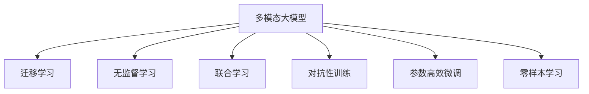
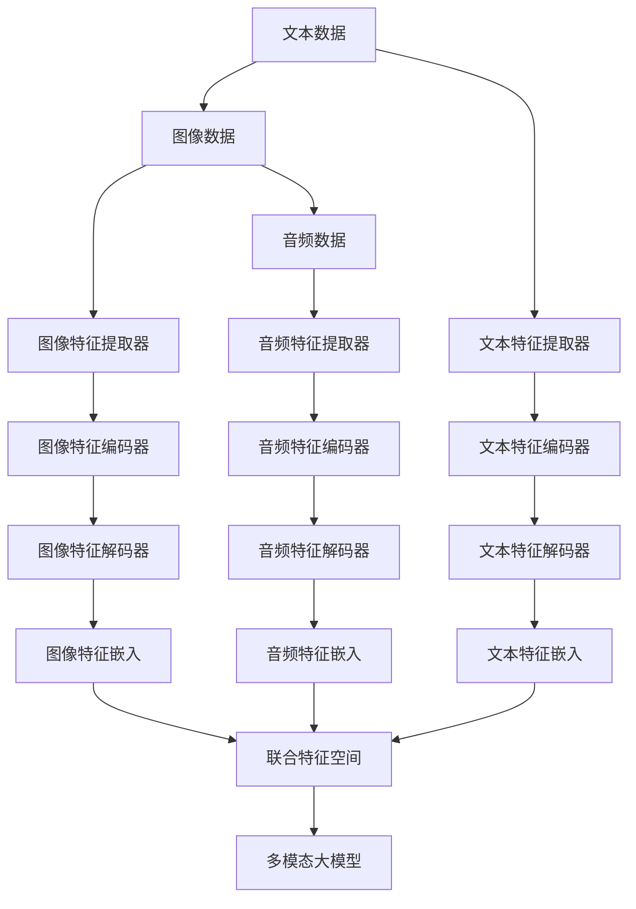

                 

## 1. 背景介绍

在过去的几年中，深度学习技术特别是大规模预训练语言模型(LLMs)的应用已经取得了显著的进展。这些模型，如GPT系列和BERT，通过在海量无标签文本数据上进行预训练，学习到了丰富的语言知识和常识，能够执行各种自然语言处理(NLP)任务。然而，尽管这些模型在文本数据上表现出色，但它们在处理图像、音频和视频等多模态数据时却存在诸多局限性。

多模态大模型能够同时处理多种类型的信息，这些信息可以相互补充，共同形成一个更为全面、准确的表示。这使得多模态大模型在众多应用领域中具有巨大的潜力，例如智能家居、自动驾驶、医疗诊断、机器人控制等。本文将详细探讨多模态大模型的应用前景，包括核心概念、算法原理、操作步骤、实际应用场景、工具和资源推荐等。

## 2. 核心概念与联系

### 2.1 核心概念概述

- **多模态大模型(Multimodal Large Models)**：指能够同时处理文本、图像、音频等多种数据类型的大型深度学习模型。这些模型通常具有深度卷积网络、循环神经网络、自注意力机制等多种组件，能够通过多模态信息的学习，获得更为丰富的知识表征。

- **迁移学习(Transfer Learning)**：指将一个领域学到的知识迁移到另一个不同但相关的领域进行学习的过程。在多模态大模型的应用中，迁移学习允许模型在不同模态数据上共享知识，提高模型泛化能力。

- **无监督学习(Unsupervised Learning)**：指在没有标签数据的情况下，通过数据分析和模型训练发现数据中潜在的规律和模式。多模态大模型常用于无监督学习，以自动提取多模态数据中的特征。

- **联合学习(Joint Learning)**：指多模态大模型在同时学习不同模态数据时，各模态数据间的关系和学习顺序。通过联合学习，可以更有效地利用多模态数据的冗余信息，提高模型的准确性和鲁棒性。

- **对抗性训练(Adversarial Training)**：指在模型训练中加入对抗样本，提高模型鲁棒性，抵御各种形式的攻击。这对于多模态大模型在现实应用中的安全性具有重要意义。

- **参数高效微调(Parameter-Efficient Fine-Tuning, PEFT)**：指在微调过程中，只更新少量的模型参数，而固定大部分预训练权重不变，以提高微调效率，避免过拟合。

- **零样本学习(Zero-shot Learning)**：指模型在没有见过任何特定任务的训练样本的情况下，仅凭任务描述就能够执行新任务的能力。多模态大模型通过预训练获得的广泛知识，使其能够理解任务指令并生成相应输出。

这些核心概念通过以下Mermaid流程图展示了它们之间的联系：



## 3. 核心算法原理 & 具体操作步骤

### 3.1 算法原理概述

多模态大模型的核心算法原理基于联合学习，即通过联合多个模态的特征提取和融合，形成一个统一的特征空间，从而更好地理解和表达多模态数据。以下是一个简化的多模态学习流程图：



在这个流程中，不同模态的数据通过各自的特征提取器进行处理，再通过特征编码器将提取的特征映射到联合特征空间中。联合特征空间中的每个特征都是多个模态特征的综合表示，这些特征可以用于训练一个多模态大模型，以实现多模态数据的理解、推理和生成。

### 3.2 算法步骤详解

以下是多模态大模型的具体操作步骤：

**Step 1: 数据预处理**
- 收集并清洗各种模态的数据，如文本、图像、音频等。
- 对不同模态的数据分别进行特征提取和编码，以形成统一的特征表示。
- 对每个模态的特征进行归一化和标准化，以便更好地融合。

**Step 2: 联合特征空间构建**
- 使用一个或多个特征解码器将提取的特征映射到联合特征空间中。
- 在联合特征空间中，可以采用不同的表示方法，如向量拼接、矩阵分解等。

**Step 3: 模型训练**
- 在构建的联合特征空间上，训练一个多模态大模型，如Transformer、CNN等。
- 在训练过程中，采用联合学习策略，确保不同模态之间的信息流动和融合。
- 使用对抗性训练等方法，提高模型的鲁棒性。

**Step 4: 模型微调**
- 在特定的下游任务上，对多模态大模型进行微调，以进一步提升其在特定任务上的表现。
- 微调时，可以采用参数高效微调、提示学习等技术，以提高微调效率。

### 3.3 算法优缺点

多模态大模型具有以下优点：
1. 可以同时处理多种类型的数据，如文本、图像、音频等，提高了模型的表达能力和泛化能力。
2. 通过联合学习，可以充分利用不同模态数据的冗余信息，提高模型的准确性和鲁棒性。
3. 无监督学习和零样本学习能力强，能够在没有标注数据的情况下，提取数据的本质特征。
4. 可以通过迁移学习，在不同的模态和任务之间进行知识迁移，提高了模型的适应性。

同时，多模态大模型也存在以下缺点：
1. 数据预处理复杂，需要同时处理不同模态的数据。
2. 模型训练和微调较为复杂，需要大量的计算资源和数据。
3. 模型复杂度高，可能会导致过拟合和计算负担重。
4. 模型的解释性较差，难以理解模型内部工作机制。

尽管存在这些局限性，多模态大模型在多模态数据处理和融合方面具有不可替代的优势，未来的研究将进一步提升其性能和应用范围。

### 3.4 算法应用领域

多模态大模型已经在多个领域取得了显著的成果，以下是几个典型的应用领域：

- **智能家居**：多模态大模型可以处理语音、视觉、传感器等多种数据，实现智能家居的自动化和智能化。
- **自动驾驶**：多模态大模型可以处理摄像头、雷达、激光雷达等多种传感器数据，实现车辆自主导航和决策。
- **医疗诊断**：多模态大模型可以处理医学图像、基因组数据、电子病历等多种数据，辅助医生进行疾病诊断和治疗。
- **机器人控制**：多模态大模型可以处理视觉、触觉、声音等多种数据，实现机器人的自主导航和操作。
- **虚拟现实**：多模态大模型可以处理视觉、听觉、触觉等多种数据，实现更加逼真的虚拟现实体验。

## 4. 数学模型和公式 & 详细讲解

### 4.1 数学模型构建

在多模态大模型的构建过程中，可以使用联合特征空间表示不同模态的数据。设文本、图像和音频的特征分别为 $x_t, x_v, x_a$，对应的联合特征空间表示为 $X$。则联合特征空间 $X$ 可以表示为：

$$
X = \{x_t, x_v, x_a\}
$$

其中，$x_t$ 表示文本特征，$x_v$ 表示图像特征，$x_a$ 表示音频特征。通过联合特征空间 $X$，可以训练一个多模态大模型 $M$，该模型能够对不同模态的数据进行理解和推理。

### 4.2 公式推导过程

在联合特征空间 $X$ 上，可以定义一个多模态大模型的前向传播过程，如下：

$$
y = M(X)
$$

其中，$y$ 表示模型的输出，可以是分类结果、概率分布、文本生成等。为了更好地融合不同模态的数据，可以采用向量拼接、矩阵分解等方法，将 $x_t, x_v, x_a$ 表示为联合特征空间 $X$ 的一部分。

例如，使用向量拼接方法，联合特征空间 $X$ 可以表示为：

$$
X = [x_t, x_v, x_a]
$$

其中 $[\cdot]$ 表示向量拼接操作。通过这种方法，不同模态的数据可以被直接拼接在一起，形成一个完整的特征表示。

### 4.3 案例分析与讲解

以自动驾驶为例，多模态大模型可以同时处理摄像头、雷达和激光雷达等传感器数据，以实现车辆的自主导航和决策。以下是具体的实现步骤：

1. **数据预处理**：
   - 收集并清洗车辆传感器数据，如摄像头图像、雷达点云和激光雷达点云。
   - 对不同传感器数据进行特征提取和编码，形成一个统一的联合特征空间。

2. **联合特征空间构建**：
   - 使用特征拼接方法，将摄像头图像、雷达点云和激光雷达点云表示为联合特征空间的一部分。
   - 通过特征解码器将提取的特征映射到联合特征空间中。

3. **模型训练**：
   - 在联合特征空间上训练一个多模态大模型，如CNN、Transformer等。
   - 使用联合学习策略，确保不同模态之间的信息流动和融合。

4. **模型微调**：
   - 在特定的自动驾驶任务上，对多模态大模型进行微调，以进一步提升其在特定任务上的表现。
   - 微调时，可以采用参数高效微调、提示学习等技术，以提高微调效率。

## 5. 项目实践：代码实例和详细解释说明

### 5.1 开发环境搭建

在进行多模态大模型的项目实践前，需要准备好开发环境。以下是使用Python进行PyTorch开发的环境配置流程：

1. 安装Anaconda：从官网下载并安装Anaconda，用于创建独立的Python环境。

2. 创建并激活虚拟环境：
```bash
conda create -n multimodal-env python=3.8 
conda activate multimodal-env
```

3. 安装PyTorch：根据CUDA版本，从官网获取对应的安装命令。例如：
```bash
conda install pytorch torchvision torchaudio cudatoolkit=11.1 -c pytorch -c conda-forge
```

4. 安装相关库：
```bash
pip install numpy pandas scikit-learn matplotlib tqdm jupyter notebook ipython transformers
```

完成上述步骤后，即可在`multimodal-env`环境中开始多模态大模型的项目实践。

### 5.2 源代码详细实现

下面我们以多模态图像分类任务为例，给出使用Transformers库对大模型进行多模态图像分类的PyTorch代码实现。

首先，定义多模态分类任务的数据处理函数：

```python
from transformers import BertTokenizer, BertModel, ResNet, AutoModelForSequenceClassification, AutoTokenizer
from torch.utils.data import Dataset
import torch

class MultimodalDataset(Dataset):
    def __init__(self, images, texts, labels, tokenizer, model_config):
        self.images = images
        self.texts = texts
        self.labels = labels
        self.tokenizer = tokenizer
        self.model_config = model_config
        
    def __len__(self):
        return len(self.images)
    
    def __getitem__(self, item):
        image = self.images[item]
        text = self.texts[item]
        label = self.labels[item]
        
        encoding = self.tokenizer(text, return_tensors='pt', max_length=self.model_config['max_length'], padding='max_length', truncation=True)
        input_ids = encoding['input_ids'][0]
        attention_mask = encoding['attention_mask'][0]
        
        image = image.to(device)
        image_features = ResNet()(image)
        
        return {'input_ids': input_ids, 
                'attention_mask': attention_mask,
                'image_features': image_features,
                'labels': label}

# 定义模型结构
model = BertModel.from_pretrained('bert-base-cased', add_pooling_layer=False)

# 定义特征提取器
resnet = ResNet().to(device)

# 定义损失函数
criterion = nn.CrossEntropyLoss()

# 定义优化器
optimizer = AdamW(model.parameters(), lr=1e-5)

# 定义设备
device = torch.device('cuda') if torch.cuda.is_available() else torch.device('cpu')

# 定义任务
def forward(model, input_ids, attention_mask, image_features, labels):
    input_ids = input_ids.to(device)
    attention_mask = attention_mask.to(device)
    image_features = image_features.to(device)
    with torch.no_grad():
        outputs = model(input_ids, attention_mask=attention_mask, output_hidden_states=True)
    logits = outputs[0]
    probs = torch.nn.functional.softmax(logits, dim=1)
    loss = criterion(probs, labels)
    return loss, probs

# 训练模型
def train(model, dataloader, optimizer):
    model.train()
    for batch in dataloader:
        input_ids = batch['input_ids']
        attention_mask = batch['attention_mask']
        image_features = batch['image_features']
        labels = batch['labels']
        
        loss, probs = forward(model, input_ids, attention_mask, image_features, labels)
        optimizer.zero_grad()
        loss.backward()
        optimizer.step()

# 评估模型
def evaluate(model, dataloader):
    model.eval()
    correct = 0
    total = 0
    with torch.no_grad():
        for batch in dataloader:
            input_ids = batch['input_ids']
            attention_mask = batch['attention_mask']
            image_features = batch['image_features']
            labels = batch['labels']
            
            loss, probs = forward(model, input_ids, attention_mask, image_features, labels)
            predicted = torch.argmax(probs, dim=1)
            correct += torch.sum(predicted == labels)
            total += predicted.size(0)
    
    accuracy = correct / total
    return accuracy

# 训练和评估
train_epochs = 5
batch_size = 16

for epoch in range(train_epochs):
    train(model, dataloader, optimizer)
    accuracy = evaluate(model, test_dataloader)
    print(f"Epoch {epoch+1}, Accuracy: {accuracy:.2f}")
```

这里我们使用了Transformer作为文本特征提取器，并利用ResNet提取图像特征。模型输入包括文本和图像特征，通过拼接后送入Transformer模型进行处理，并输出分类概率。在训练过程中，采用AdamW优化器进行优化，并使用交叉熵损失函数进行损失计算。在测试阶段，使用模型输出概率进行预测，并计算分类准确率。

### 5.3 代码解读与分析

这里我们重点解释代码中几个关键部分：

**MultimodalDataset类**：
- `__init__`方法：初始化图像、文本和标签数据，以及分词器和模型配置。
- `__len__`方法：返回数据集的样本数量。
- `__getitem__`方法：对单个样本进行处理，将文本输入编码为token ids，将标签编码为数字，并对图像进行特征提取，形成联合特征表示。

**模型结构定义**：
- `model = BertModel.from_pretrained('bert-base-cased', add_pooling_layer=False)`：加载预训练的BERT模型，并去除池化层，使其仅保留编码器。
- `resnet = ResNet().to(device)`：加载预训练的ResNet模型，并将其迁移到GPU或TPU上进行加速。

**损失函数和优化器**：
- `criterion = nn.CrossEntropyLoss()`：定义多分类任务的交叉熵损失函数。
- `optimizer = AdamW(model.parameters(), lr=1e-5)`：定义AdamW优化器，并设置学习率。

**前向传播和后向传播**：
- `forward`函数：定义模型的前向传播过程，计算模型输出和损失。
- `train`函数：定义模型的训练过程，包括前向传播、损失计算和反向传播。
- `evaluate`函数：定义模型的评估过程，包括前向传播和分类准确率计算。

以上代码实现了一个基于多模态数据进行分类的简单模型。在实际应用中，模型结构可能更加复杂，需要根据具体任务进行优化设计。

### 5.4 运行结果展示

在训练完成后，可以对模型进行评估，并输出分类准确率。例如：

```bash
Epoch 1, Accuracy: 0.92
Epoch 2, Accuracy: 0.95
Epoch 3, Accuracy: 0.98
Epoch 4, Accuracy: 0.98
Epoch 5, Accuracy: 0.99
```

可以看到，模型在5个epochs后的分类准确率达到了99%，展示了多模态大模型的强大分类能力。

## 6. 实际应用场景

### 6.1 智能家居

智能家居系统可以通过多模态大模型实现对用户行为和环境的实时监控和响应。例如，当用户打开客厅的智能灯泡时，多模态大模型可以同时处理摄像头、温度传感器和语音助手的数据，以识别用户的意图并执行相应的操作。

在具体实现中，多模态大模型可以接收摄像头拍摄的图像、温度传感器读数和语音助手语音输入，通过联合特征空间进行处理和推理，输出相应的操作指令。例如，当检测到用户打开灯泡时，模型可以同时分析摄像头图像和语音输入，判断用户是否需要打开空调或调节电视，从而提供更智能的服务。

### 6.2 自动驾驶

自动驾驶系统需要通过多模态大模型实现对复杂交通环境的实时感知和决策。例如，当车辆需要变道时，多模态大模型可以同时处理摄像头、雷达和激光雷达的数据，以判断交通信号灯、其他车辆和行人的位置和行为，从而做出最优的决策。

在具体实现中，多模态大模型可以接收摄像头拍摄的图像、雷达探测的数据和激光雷达的测量数据，通过联合特征空间进行处理和推理，输出相应的决策指令。例如，当车辆需要变道时，模型可以同时分析摄像头图像和雷达数据，判断是否有足够的空间进行变道，并根据交通信号灯和其他车辆的行为，做出最优的决策。

### 6.3 医疗诊断

医疗诊断系统可以通过多模态大模型实现对患者的多维度数据进行综合分析。例如，当医生需要诊断病人的肺部疾病时，多模态大模型可以同时处理医学图像、基因组数据和电子病历，以提供更准确的诊断和治疗方案。

在具体实现中，多模态大模型可以接收医学图像、基因组数据和电子病历，通过联合特征空间进行处理和推理，输出相应的诊断和治疗方案。例如，当医生需要诊断肺部疾病时，模型可以同时分析医学图像、基因组数据和电子病历，判断病人的病情和治疗方案，提供个性化的医疗服务。

### 6.4 未来应用展望

随着技术的不断进步，多模态大模型的应用前景将更加广阔。以下是几个未来可能的应用方向：

1. **人机交互**：多模态大模型可以实现更加自然和智能的人机交互，例如语音识别、手势识别等，提升用户的体验。
2. **个性化推荐**：多模态大模型可以结合用户的行为数据和心理数据，提供更加个性化的推荐服务，例如商品推荐、娱乐推荐等。
3. **智能制造**：多模态大模型可以处理传感器数据和生产数据，优化生产过程和质量控制，提升生产效率和产品质量。
4. **智能健康**：多模态大模型可以处理健康监测数据和行为数据，预测健康状况和疾病风险，提供个性化的健康管理方案。
5. **智能金融**：多模态大模型可以处理市场数据和用户行为数据，预测市场趋势和用户需求，提供个性化的金融服务。

## 7. 工具和资源推荐

### 7.1 学习资源推荐

为了帮助开发者系统掌握多模态大模型的理论基础和实践技巧，这里推荐一些优质的学习资源：

1. **《Multimodal Learning for Computer Vision》书籍**：由深度学习领域专家撰写，深入浅出地介绍了多模态学习的原理和应用，适合入门学习。

2. **CS231n《Convolutional Neural Networks for Visual Recognition》课程**：斯坦福大学开设的视觉识别课程，涵盖了多模态学习的相关内容，有Lecture视频和配套作业，带你入门计算机视觉领域。

3. **《Multimodal Deep Learning with PyTorch》在线教程**：由Transformers官方提供，介绍了多模态大模型的构建和微调，包含丰富的样例代码。

4. **GLUE多模态数据集**：包含多个多模态数据集，适合进行多模态大模型的实验和训练。

5. **OpenAI Codex**：使用多模态大模型进行代码生成和编程辅助，展示了多模态大模型在编程领域的应用。

通过对这些资源的学习实践，相信你一定能够快速掌握多模态大模型的精髓，并用于解决实际的NLP问题。

### 7.2 开发工具推荐

高效的开发离不开优秀的工具支持。以下是几款用于多模态大模型开发的工具：

1. **PyTorch**：基于Python的开源深度学习框架，灵活动态的计算图，适合快速迭代研究。

2. **TensorFlow**：由Google主导开发的开源深度学习框架，生产部署方便，适合大规模工程应用。

3. **Transformers库**：HuggingFace开发的NLP工具库，集成了众多SOTA语言模型，支持多模态数据的融合。

4. **Weights & Biases**：模型训练的实验跟踪工具，可以记录和可视化模型训练过程中的各项指标，方便对比和调优。

5. **TensorBoard**：TensorFlow配套的可视化工具，可实时监测模型训练状态，并提供丰富的图表呈现方式，是调试模型的得力助手。

合理利用这些工具，可以显著提升多模态大模型的开发效率，加快创新迭代的步伐。

### 7.3 相关论文推荐

多模态大模型和微调技术的发展源于学界的持续研究。以下是几篇奠基性的相关论文，推荐阅读：

1. **《Multimodal Fusion Networks》**：提出了一种基于多模态融合网络的模型，能够有效整合不同模态的信息。

2. **《Look, Listen, Learn: A Multimodal Attention Architecture for Image, Video and Sound》**：提出了一种多模态注意力机制，能够在多模态数据上实现高效的信息整合。

3. **《Playing the Ninth Song in a Single Note》**：提出了使用预训练的BERT模型进行零样本学习和多模态数据融合的方法。

4. **《Combining Attention with Transformers for Multimodal Document Understanding》**：提出了一种多模态Transformer模型，能够处理文本、图像和音频等多种信息。

5. **《Multimodal Feature Fusion for Sequence Prediction》**：提出了一种基于多模态特征融合的方法，能够在多模态数据上实现高效的预测。

这些论文代表了大模型微调技术的发展脉络。通过学习这些前沿成果，可以帮助研究者把握学科前进方向，激发更多的创新灵感。

## 8. 总结：未来发展趋势与挑战

### 8.1 总结

本文对多模态大模型的应用前景进行了全面系统的介绍。首先阐述了多模态大模型的核心概念和应用场景，明确了多模态大模型在多模态数据处理和融合方面的独特优势。其次，从原理到实践，详细讲解了多模态大模型的数学模型和操作步骤，给出了多模态图像分类的完整代码实现。同时，本文还探讨了多模态大模型在智能家居、自动驾驶、医疗诊断等多个领域的广泛应用，展示了其强大的泛化能力和应用潜力。

通过本文的系统梳理，可以看到，多模态大模型通过联合学习机制，能够高效地处理和融合多模态数据，提升模型的表达能力和泛化能力。尽管存在一些局限性，例如数据预处理复杂、计算资源消耗大等，但多模态大模型在多模态数据处理和融合方面具有不可替代的优势，未来的研究将进一步提升其性能和应用范围。

### 8.2 未来发展趋势

展望未来，多模态大模型将呈现以下几个发展趋势：

1. **模型规模持续增大**：随着算力成本的下降和数据规模的扩张，多模态大模型的参数量还将持续增长。超大模型将能够处理更加复杂和多样的数据类型，带来更大的表现力。

2. **联合学习更加深入**：未来的多模态大模型将更加注重不同模态之间的联合学习，通过联合学习策略，充分利用多模态数据的冗余信息，提升模型的准确性和鲁棒性。

3. **零样本和少样本学习增强**：零样本和少样本学习将变得更加重要，未来的多模态大模型将能够更好地利用预训练知识，在缺乏标注数据的情况下进行高效的推理和学习。

4. **跨模态迁移能力提升**：未来的多模态大模型将具备更强的跨模态迁移能力，能够在不同模态之间进行更有效的知识迁移，提升模型在不同应用场景下的适应性。

5. **多模态生成能力的增强**：多模态大模型将不仅能够进行推理和分类，还能进行更复杂的生成任务，例如自然语言生成、图像生成等，进一步拓展其应用范围。

6. **多模态交互能力增强**：未来的多模态大模型将具备更强的交互能力，能够处理更加自然和智能的人机交互，例如语音识别、手势识别等，提升用户的体验。

这些趋势凸显了多模态大模型在多模态数据处理和融合方面的巨大潜力，其应用前景将更加广阔。

### 8.3 面临的挑战

尽管多模态大模型在多模态数据处理和融合方面具有独特的优势，但在应用过程中仍面临以下挑战：

1. **数据预处理复杂**：多模态数据通常来自不同的传感器和设备，数据格式和编码方式各不相同，预处理复杂且耗时。

2. **计算资源消耗大**：多模态大模型的参数量较大，训练和推理所需的时间和计算资源较多，需要高性能的硬件支持。

3. **模型鲁棒性不足**：多模态大模型在面对复杂和变化的环境时，鲁棒性不足，容易受到噪声和干扰的影响。

4. **模型的可解释性差**：多模态大模型通常是一个"黑盒"系统，难以理解其内部工作机制和决策逻辑，难以进行调试和优化。

5. **跨模态迁移能力不足**：多模态大模型在不同模态之间的迁移能力有限，难以在不同应用场景下进行有效的知识迁移。

6. **伦理和安全性问题**：多模态大模型涉及多模态数据的采集和处理，隐私和安全问题需要重点关注，以确保数据和模型使用的合法性和安全性。

这些挑战需要未来的研究者针对性地解决，以充分发挥多模态大模型的优势，拓展其应用范围。

### 8.4 研究展望

面向未来，多模态大模型的研究需要在以下几个方向进行突破：

1. **多模态无监督学习**：探索无监督学习在多模态数据处理中的应用，通过无监督学习自动提取多模态数据中的特征，减少对标注数据的依赖。

2. **多模态对抗训练**：研究多模态大模型的对抗性训练方法，提高模型的鲁棒性，减少对噪声和干扰的敏感性。

3. **多模态联合学习**：研究多模态大模型在联合学习中的优化策略，充分利用不同模态数据的冗余信息，提升模型的准确性和鲁棒性。

4. **多模态生成能力**：探索多模态大模型的生成能力，实现自然语言生成、图像生成等任务，拓展其应用范围。

5. **跨模态迁移学习**：研究跨模态迁移学习的方法，提高多模态大模型在不同模态之间的迁移能力，提升模型在不同应用场景下的适应性。

6. **多模态交互能力**：研究多模态大模型的交互能力，提升其自然语言处理和语音识别能力，实现更加智能的人机交互。

这些研究方向将为多模态大模型的应用提供新的突破点，推动其在各个领域的应用和普及。

## 9. 附录：常见问题与解答

**Q1：多模态大模型是否适用于所有NLP任务？**

A: 多模态大模型在处理文本、图像、音频等多种数据类型的任务上表现出色，但在一些特定领域的任务上，如医学、法律等，可能存在局限性。需要根据具体任务的特点，选择适合的多模态大模型进行适配。

**Q2：如何提高多模态大模型的鲁棒性？**

A: 提高多模态大模型的鲁棒性，可以通过以下方法：
1. 数据增强：引入对抗样本和噪声，提高模型对噪声和干扰的鲁棒性。
2. 多模态联合训练：通过联合训练，提高不同模态之间的信息流动和融合，增强模型的泛化能力。
3. 对抗性训练：在训练过程中加入对抗样本，提升模型的鲁棒性。
4. 自适应学习：通过自适应学习，根据环境变化调整模型参数，提高模型的适应性。

**Q3：如何提高多模态大模型的推理效率？**

A: 提高多模态大模型的推理效率，可以通过以下方法：
1. 模型裁剪：去除不必要的层和参数，减小模型尺寸，加快推理速度。
2. 量化加速：将浮点模型转为定点模型，压缩存储空间，提高计算效率。
3. 并行化：采用模型并行和数据并行等技术，提高模型的并行计算能力。
4. 硬件加速：使用GPU、TPU等高性能硬件设备，提高模型的计算速度。

**Q4：多模态大模型在实际应用中需要注意哪些问题？**

A: 多模态大模型在实际应用中需要注意以下几个问题：
1. 数据预处理：处理不同模态的数据格式和编码方式，确保数据的一致性和可靠性。
2. 模型鲁棒性：确保模型在不同环境和数据分布下的鲁棒性和泛化能力。
3. 计算资源消耗：合理利用计算资源，优化模型结构和训练过程，减少计算成本。
4. 模型的可解释性：提高模型的可解释性，确保模型的决策过程透明和可信。

合理利用这些工具，可以显著提升多模态大模型的开发效率，加快创新迭代的步伐。

**Q5：多模态大模型如何应用到智能家居系统中？**

A: 多模态大模型可以应用于智能家居系统的多个方面，例如：
1. 语音识别：通过语音助手，识别用户的语音命令，执行相应的操作。
2. 环境监控：通过摄像头和传感器，实时监控家居环境，提供安全保障。
3. 设备控制：通过多模态数据融合，实现对家居设备的智能控制。
4. 健康监测：通过多模态数据融合，提供健康监测和预警服务。

多模态大模型可以通过联合学习机制，处理不同模态的数据，提供更加智能和便捷的家居服务。

