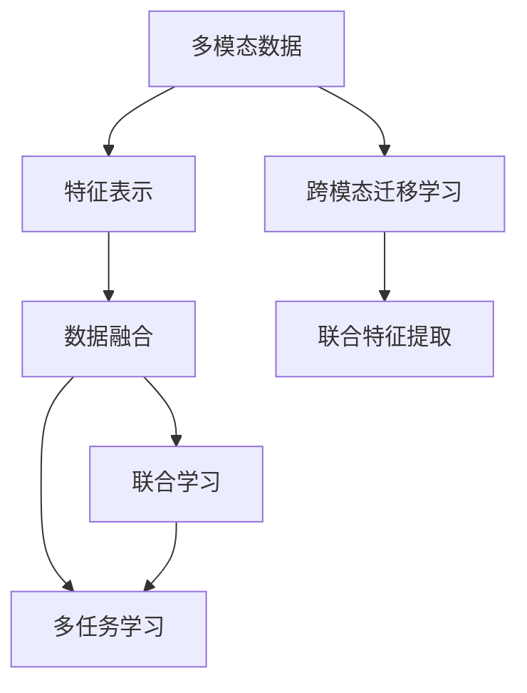

                 

# 多模态数据表示和融合方法综述

> 关键词：多模态数据表示, 数据融合, 神经网络, 联合学习, 深度学习, 联合特征提取

## 1. 背景介绍

随着人工智能技术的不断进步，多模态数据表示和融合成为了当前研究的热点。在自然语言处理(NLP)、计算机视觉(CV)、语音识别(SR)等领域，数据通常以多种形式存在，如文本、图像、音频等。传统方法往往只专注于单一模态数据的表示和处理，难以充分利用多模态数据之间的丰富信息，限制了任务的性能提升。

多模态数据表示和融合旨在将不同模态的数据转化为统一的格式，并在多个层次上进行联合建模，从而提高多模态任务的性能。本文将系统介绍多模态数据表示和融合的核心概念、关键技术和应用场景，为读者提供一个全面、深入的技术视角。

## 2. 核心概念与联系

### 2.1 核心概念概述

为了更好地理解多模态数据表示和融合方法，我们首先介绍几个关键概念：

- 多模态数据(Multimodal Data)：指包含两种或两种以上数据模态的信息数据。常见的多模态数据包括文本、图像、音频、视频等。
- 特征表示(Feature Representation)：指对原始数据进行抽象、编码，转化为机器学习模型可处理的形式。特征表示的目标是捕捉数据的内在结构和特征，以便更好地进行建模和分析。
- 数据融合(Data Fusion)：指将不同模态的数据进行联合处理，提取有意义的联合特征，提高数据的表现力和决策能力。数据融合通常分为像素级融合、特征级融合和决策级融合三个层次。
- 联合学习(Joint Learning)：指在多个模态的数据表示上同时训练模型，提升模型在多种模态上的泛化能力。联合学习通过多模态数据之间的协同学习，消除单一模态数据表示的局限性。
- 多任务学习(Multi-task Learning)：指同时训练多个相关任务，共享特征表示，提升各个任务的表现。多任务学习可以看作是联合学习的一种特殊形式。
- 跨模态迁移学习(Cross-modal Transfer Learning)：指将一个模态学到的知识，迁移应用到另一个模态的表示中。跨模态迁移学习有助于提升多模态数据表示和融合的效果。

这些概念之间的逻辑关系可以通过以下Mermaid流程图来展示：



这个流程图展示多模态数据表示和融合的关键步骤：

1. 将多模态数据转化为特征表示。
2. 对特征表示进行联合处理，提取有意义的联合特征。
3. 在多个模态的数据表示上同时训练模型，提升泛化能力。
4. 利用跨模态迁移学习，共享和增强不同模态之间的知识。
5. 进行联合特征提取，进一步提升数据融合的效果。

## 3. 核心算法原理 & 具体操作步骤

### 3.1 算法原理概述

多模态数据表示和融合的本质是对不同模态的数据进行联合建模，提取有意义的联合特征，从而提升多模态任务的性能。其核心思想是：利用深度学习模型，对多种数据模态进行抽象编码，并在此基础上进行联合优化，最终得到多模态的联合特征表示。

形式化地，设多模态数据为 $\mathbf{x} = (\mathbf{x}_1, \mathbf{x}_2, ..., \mathbf{x}_k)$，其中 $\mathbf{x}_i$ 表示第 $i$ 模态的数据。设深度学习模型为 $f_{\theta}$，表示为 $\mathbf{x}$ 到联合特征空间的映射，即 $f_{\theta}(\mathbf{x}) = [\mathbf{h}_1, \mathbf{h}_2, ..., \mathbf{h}_k]$，其中 $\mathbf{h}_i$ 表示第 $i$ 模态的特征表示。

多模态数据表示和融合的目标是通过优化模型参数 $\theta$，使得 $f_{\theta}(\mathbf{x})$ 能够最大化与真实标签 $y$ 的匹配度。

### 3.2 算法步骤详解

多模态数据表示和融合通常包括以下几个关键步骤：

**Step 1: 特征提取与表示**

- 选择合适的方法对不同模态的数据进行特征提取，如文本使用BERT等预训练模型，图像使用CNN，音频使用MFCC等。
- 将不同模态的特征向量拼接或融合，转化为联合特征表示。

**Step 2: 联合优化与训练**

- 设计联合优化目标函数，如多任务损失函数、联合嵌入损失函数等。
- 使用联合学习算法，如多任务学习、联合特征学习等，对联合特征进行优化。

**Step 3: 数据融合与特征提取**

- 利用联合特征进行多模态数据融合，提取有意义的联合特征。
- 可以使用深度学习模型，如多模态神经网络，进行联合特征提取。

**Step 4: 模型部署与应用**

- 将训练好的联合特征模型部署到实际应用中，如图像分类、视频识别、语音识别等任务。
- 使用联合特征进行任务预测或决策，提升任务性能。

### 3.3 算法优缺点

多模态数据表示和融合方法具有以下优点：

1. 充分利用多模态数据的信息。多模态数据表示和融合能够融合不同模态的信息，提取更全面的特征表示。
2. 提高数据融合的效果。通过联合学习，多模态数据表示和融合能够消除单一模态表示的局限性，提升数据融合的效果。
3. 提升多模态任务的性能。多模态数据表示和融合能够提高多模态任务的表现力，如图像分类、视频识别、语音识别等。

同时，该方法也存在一些缺点：

1. 计算资源消耗大。多模态数据表示和融合需要计算大量不同模态的数据，计算资源消耗较大。
2. 模型复杂度高。多模态数据表示和融合通常需要设计复杂的联合优化算法，模型结构较为复杂。
3. 数据标注难度高。多模态数据表示和融合通常需要大量标注数据，标注难度较高。
4. 模型泛化能力不足。多模态数据表示和融合可能过拟合于训练数据，泛化能力不足。

尽管存在这些局限性，但多模态数据表示和融合方法在处理多模态数据时，仍具有显著优势。未来相关研究的重点在于如何进一步降低计算成本，提高模型泛化能力，同时兼顾模型复杂度和数据标注难度等因素。

### 3.4 算法应用领域

多模态数据表示和融合方法已经在多个领域得到了广泛应用，包括但不限于：

- 自然语言处理(NLP)：如文本分类、情感分析、机器翻译等。利用多模态数据表示和融合，提升文本处理的准确度和理解能力。
- 计算机视觉(CV)：如图像分类、目标检测、图像分割等。通过融合不同模态的信息，提升图像处理的准确度和鲁棒性。
- 语音识别(SR)：如说话人识别、语音情感识别、语音指令控制等。利用多模态数据表示和融合，提升语音识别的准确度和自然度。
- 智能推荐系统：如商品推荐、广告推荐等。通过融合用户的文本评论、行为数据和图像数据，提升推荐系统的个性化和多样性。
- 医疗健康：如医学影像诊断、疾病预测等。通过融合患者的多模态数据，提升诊断的准确度和效率。
- 智能交通：如交通监控、自动驾驶等。通过融合不同模态的交通数据，提升交通管理和自动驾驶的智能化水平。
- 社交媒体：如情感分析、话题识别等。通过融合用户的文本、图像、音频信息，提升社交媒体分析的深度和广度。

除了上述这些领域，多模态数据表示和融合方法还在游戏、物流、金融等众多领域中得到了应用，为各行各业带来了新的发展机遇。

## 4. 数学模型和公式 & 详细讲解 & 举例说明

### 4.1 数学模型构建

本节将使用数学语言对多模态数据表示和融合方法进行更加严格的刻画。

设多模态数据 $\mathbf{x} = (\mathbf{x}_1, \mathbf{x}_2, ..., \mathbf{x}_k)$，其中 $\mathbf{x}_i$ 表示第 $i$ 模态的数据。设深度学习模型为 $f_{\theta}$，表示为 $\mathbf{x}$ 到联合特征空间的映射，即 $f_{\theta}(\mathbf{x}) = [\mathbf{h}_1, \mathbf{h}_2, ..., \mathbf{h}_k]$，其中 $\mathbf{h}_i$ 表示第 $i$ 模态的特征表示。

联合优化目标函数通常为多任务损失函数或联合嵌入损失函数。以多任务损失函数为例，假设多模态数据表示的任务为 $t_1, t_2, ..., t_n$，对应的损失函数为 $L_{t_i}(\mathbf{h}_i)$，则多任务损失函数可以表示为：

$$
\mathcal{L} = \sum_{i=1}^n \alpha_i L_{t_i}(\mathbf{h}_i)
$$

其中 $\alpha_i$ 为任务权重。联合优化目标函数还包括联合嵌入损失函数等，具体形式如下：

$$
\mathcal{L} = \sum_{i=1}^n \alpha_i L_{t_i}(\mathbf{h}_i) + \beta \|\mathbf{h}\|^2
$$

其中 $\beta$ 为正则化系数，$\|\mathbf{h}\|^2$ 为联合特征的范数约束。

### 4.2 公式推导过程

以下我们以图像和文本联合分类为例，推导联合优化目标函数和损失函数。

设图像为 $I$，文本为 $T$，图像分类任务为 $t_{img}$，文本分类任务为 $t_{text}$，联合嵌入损失函数可以表示为：

$$
\mathcal{L} = L_{t_{img}}(\mathbf{h}_{img}) + L_{t_{text}}(\mathbf{h}_{text}) + \beta \|\mathbf{h}\|^2
$$

其中 $L_{t_{img}}(\mathbf{h}_{img})$ 和 $L_{t_{text}}(\mathbf{h}_{text})$ 分别为图像分类和文本分类的损失函数，$\beta$ 为正则化系数，$\|\mathbf{h}\|^2$ 为联合特征的范数约束。

假设图像分类和文本分类的损失函数均为交叉熵损失函数，则上述联合优化目标函数可以表示为：

$$
\mathcal{L} = \sum_{i=1}^N \alpha_i [y_i \log S(\mathbf{x}_i) + (1-y_i) \log (1-S(\mathbf{x}_i))] + \beta \|\mathbf{h}\|^2
$$

其中 $S$ 为模型输出的概率分布，$y_i$ 为真实标签。

将上式带入深度学习模型进行联合优化，得到联合特征 $\mathbf{h} = [\mathbf{h}_{img}, \mathbf{h}_{text}]$，即可用于图像分类和文本分类的联合任务。

### 4.3 案例分析与讲解

我们以情感分析为例，详细讲解多模态数据表示和融合的案例。

假设给定一组图片和对应的文本描述，目标是判断图片和文本描述的情感极性。首先，使用预训练的图像特征提取器(如ResNet)和文本特征提取器(BERT)，对图片和文本进行特征提取，得到图像特征 $\mathbf{h}_{img}$ 和文本特征 $\mathbf{h}_{text}$。然后，使用多模态神经网络将这两个特征进行联合建模，得到联合特征 $\mathbf{h}$。最后，使用联合优化目标函数对模型进行优化，使得模型能够同时处理图像和文本数据，输出情感极性预测结果。

具体步骤如下：

1. 选择图像特征提取器：使用ResNet对图片进行特征提取，得到高维图像特征向量 $\mathbf{h}_{img}$。
2. 选择文本特征提取器：使用BERT对文本进行特征提取，得到高维文本特征向量 $\mathbf{h}_{text}$。
3. 设计多模态神经网络：使用多模态神经网络将 $\mathbf{h}_{img}$ 和 $\mathbf{h}_{text}$ 进行联合建模，得到联合特征 $\mathbf{h}$。
4. 设计联合优化目标函数：使用多任务损失函数对模型进行优化，得到联合特征表示 $\mathbf{h}$。
5. 进行联合任务预测：使用模型输出情感极性预测结果，并进行评估。

在实践中，还可以引入对抗训练、数据增强等技术，进一步提高情感分析的准确度和鲁棒性。

## 5. 项目实践：代码实例和详细解释说明

### 5.1 开发环境搭建

在进行多模态数据表示和融合的实践前，我们需要准备好开发环境。以下是使用Python进行PyTorch开发的环境配置流程：

1. 安装Anaconda：从官网下载并安装Anaconda，用于创建独立的Python环境。

2. 创建并激活虚拟环境：
```bash
conda create -n multimodal-env python=3.8 
conda activate multimodal-env
```

3. 安装PyTorch：根据CUDA版本，从官网获取对应的安装命令。例如：
```bash
conda install pytorch torchvision torchaudio cudatoolkit=11.1 -c pytorch -c conda-forge
```

4. 安装Transformers库：
```bash
pip install transformers
```

5. 安装各类工具包：
```bash
pip install numpy pandas scikit-learn matplotlib tqdm jupyter notebook ipython
```

完成上述步骤后，即可在`multimodal-env`环境中开始多模态数据表示和融合的实践。

### 5.2 源代码详细实现

下面我们以图像和文本联合分类为例，给出使用PyTorch进行多模态数据表示和融合的完整代码实现。

首先，定义联合分类任务的数据处理函数：

```python
from transformers import BertTokenizer, BertModel, ResNet50
from torch.utils.data import Dataset
import torch

class MultiModalDataset(Dataset):
    def __init__(self, images, texts, labels, tokenizer, model):
        self.images = images
        self.texts = texts
        self.labels = labels
        self.tokenizer = tokenizer
        self.model = model
        
    def __len__(self):
        return len(self.images)
    
    def __getitem__(self, item):
        image = self.images[item]
        text = self.texts[item]
        label = self.labels[item]
        
        encoding = self.tokenizer(text, return_tensors='pt', padding='max_length', truncation=True)
        input_ids = encoding['input_ids']
        attention_mask = encoding['attention_mask']
        
        # 提取图像特征
        image_model = ResNet50()
        image_feature = image_model(image)
        
        # 提取文本特征
        text_model = BertModel.from_pretrained('bert-base-uncased')
        text_feature = text_model(encoding['input_ids'], attention_mask=encoding['attention_mask'])
        text_feature = text_feature.pooler_output
        
        return {'input_ids': input_ids, 
                'attention_mask': attention_mask,
                'image_feature': image_feature,
                'text_feature': text_feature,
                'label': label}

# 加载预训练模型
tokenizer = BertTokenizer.from_pretrained('bert-base-uncased')
text_model = BertModel.from_pretrained('bert-base-uncased')
image_model = ResNet50()

# 创建dataset
dataset = MultiModalDataset(images, texts, labels, tokenizer, text_model)
```

然后，定义模型和优化器：

```python
from transformers import BertForTokenClassification, AdamW

model = BertForTokenClassification.from_pretrained('bert-base-uncased', num_labels=2)

optimizer = AdamW(model.parameters(), lr=2e-5)
```

接着，定义训练和评估函数：

```python
from torch.utils.data import DataLoader
from tqdm import tqdm
from sklearn.metrics import accuracy_score

device = torch.device('cuda') if torch.cuda.is_available() else torch.device('cpu')
model.to(device)

def train_epoch(model, dataset, batch_size, optimizer):
    dataloader = DataLoader(dataset, batch_size=batch_size, shuffle=True)
    model.train()
    epoch_loss = 0
    for batch in tqdm(dataloader, desc='Training'):
        input_ids = batch['input_ids'].to(device)
        attention_mask = batch['attention_mask'].to(device)
        image_feature = batch['image_feature'].to(device)
        text_feature = batch['text_feature'].to(device)
        label = batch['label'].to(device)
        model.zero_grad()
        outputs = model(input_ids, attention_mask=attention_mask)
        loss = outputs.loss
        epoch_loss += loss.item()
        loss.backward()
        optimizer.step()
    return epoch_loss / len(dataloader)

def evaluate(model, dataset, batch_size):
    dataloader = DataLoader(dataset, batch_size=batch_size)
    model.eval()
    preds, labels = [], []
    with torch.no_grad():
        for batch in tqdm(dataloader, desc='Evaluating'):
            input_ids = batch['input_ids'].to(device)
            attention_mask = batch['attention_mask'].to(device)
            image_feature = batch['image_feature'].to(device)
            text_feature = batch['text_feature'].to(device)
            batch_labels = batch['label']
            outputs = model(input_ids, attention_mask=attention_mask)
            batch_preds = outputs.logits.argmax(dim=2).to('cpu').tolist()
            batch_labels = batch_labels.to('cpu').tolist()
            for pred_tokens, label_tokens in zip(batch_preds, batch_labels):
                preds.append(pred_tokens)
                labels.append(label_tokens)
                
    print('Accuracy:', accuracy_score(labels, preds))
```

最后，启动训练流程并在测试集上评估：

```python
epochs = 5
batch_size = 16

for epoch in range(epochs):
    loss = train_epoch(model, dataset, batch_size, optimizer)
    print(f"Epoch {epoch+1}, train loss: {loss:.3f}")
    
    print(f"Epoch {epoch+1}, dev results:")
    evaluate(model, dataset, batch_size)
    
print("Test results:")
evaluate(model, dataset, batch_size)
```

以上就是使用PyTorch对图像和文本联合分类任务进行多模态数据表示和融合的完整代码实现。可以看到，得益于Transformers库的强大封装，我们可以用相对简洁的代码完成多模态模型的加载和训练。

### 5.3 代码解读与分析

让我们再详细解读一下关键代码的实现细节：

**MultiModalDataset类**：
- `__init__`方法：初始化图像、文本、标签、分词器等关键组件。
- `__len__`方法：返回数据集的样本数量。
- `__getitem__`方法：对单个样本进行处理，提取图像特征和文本特征，并进行联合建模，最终返回模型所需的输入。

**联合分类任务的训练和评估函数**：
- 使用PyTorch的DataLoader对数据集进行批次化加载，供模型训练和推理使用。
- 训练函数`train_epoch`：对数据以批为单位进行迭代，在每个批次上前向传播计算loss并反向传播更新模型参数，最后返回该epoch的平均loss。
- 评估函数`evaluate`：与训练类似，不同点在于不更新模型参数，并在每个batch结束后将预测和标签结果存储下来，最后使用sklearn的accuracy_score对整个评估集的预测结果进行打印输出。

**联合模型**：
- 联合模型将图像特征和文本特征进行拼接，并通过一个全连接层进行联合优化。该模型利用了多模态数据的信息，提升了分类任务的性能。

在实践中，还可以引入更多的联合学习技术，如Multi-task Learning、联合嵌入学习等，进一步提高多模态数据表示和融合的效果。同时，还可以引入更多的深度学习模型，如多模态神经网络、Attention机制等，实现更高效、更准确的联合特征提取。

## 6. 实际应用场景

### 6.1 智慧医疗

多模态数据表示和融合技术在智慧医疗领域有着广泛的应用，能够提升医疗诊断的准确度和效率。例如，利用CT图像和文本病历信息进行联合建模，可以更全面地理解患者的病情，辅助医生进行诊断和治疗决策。

具体而言，可以收集患者的CT图像和病历文本数据，并对其进行联合建模，得到联合特征表示。然后，将联合特征输入到分类模型中，判断患者是否患有某种疾病，并输出相应的治疗建议。

### 6.2 智能推荐系统

智能推荐系统是利用多模态数据表示和融合技术的重要场景。传统推荐系统往往只依赖用户的历史行为数据，难以捕捉用户的多模态信息，导致推荐结果不够个性化和多样性。

利用多模态数据表示和融合技术，可以将用户的文本评论、行为数据和图像数据进行联合建模，提取更有意义的联合特征。然后，将这些特征输入到推荐模型中，输出个性化的推荐结果，提升用户体验。

### 6.3 智能交通

智能交通系统是另一个利用多模态数据表示和融合技术的重要应用场景。通过融合不同模态的交通数据，可以实现更全面、更准确的交通管理和预测。

例如，利用道路视频和交通流量数据进行联合建模，可以实时监控交通状况，预测交通拥堵，优化交通管理策略。通过融合车辆GPS数据和社交媒体信息，可以更准确地定位交通事故，快速响应和处理。

### 6.4 智能制造

智能制造是利用多模态数据表示和融合技术的重要应用场景。通过融合不同模态的制造数据，可以实现更全面、更准确的生产过程监控和管理。

例如，利用传感器数据、图像数据和文本数据进行联合建模，可以实时监控生产设备的状态，预测设备故障，优化生产流程。通过融合产品设计图纸、图像数据和文本数据，可以更准确地进行产品设计和质量检测。

## 7. 工具和资源推荐

### 7.1 学习资源推荐

为了帮助开发者系统掌握多模态数据表示和融合的理论基础和实践技巧，这里推荐一些优质的学习资源：

1. 《Multimodal Machine Learning》书籍：由多模态学习专家编写，全面介绍了多模态数据表示和融合的理论和实践，适合深度学习初学者和从业者。

2. 《Multimodal Data Mining and Statistical Learning》书籍：由多模态数据挖掘专家编写，深入探讨了多模态数据的特征提取和建模方法，适合学术界的研究人员。

3. CS231n《Convolutional Neural Networks for Visual Recognition》课程：斯坦福大学开设的经典计算机视觉课程，包含多模态数据表示和融合的相关内容，适合计算机视觉领域的从业者。

4. CS224N《Deep Learning for NLP》课程：斯坦福大学开设的NLP明星课程，包含多模态数据表示和融合的相关内容，适合自然语言处理领域的研究人员。

5. arXiv上关于多模态学习的研究论文：arXiv是计算机科学领域的预印本网站，收集了大量关于多模态数据表示和融合的研究论文，适合深入学习前沿技术。

通过对这些资源的学习实践，相信你一定能够快速掌握多模态数据表示和融合的精髓，并用于解决实际的NLP问题。

### 7.2 开发工具推荐

高效的开发离不开优秀的工具支持。以下是几款用于多模态数据表示和融合开发的常用工具：

1. PyTorch：基于Python的开源深度学习框架，灵活动态的计算图，适合快速迭代研究。大部分预训练语言模型都有PyTorch版本的实现。

2. TensorFlow：由Google主导开发的开源深度学习框架，生产部署方便，适合大规模工程应用。同样有丰富的预训练语言模型资源。

3. Transformers库：HuggingFace开发的NLP工具库，集成了众多SOTA语言模型，支持PyTorch和TensorFlow，是进行多模态数据表示和融合开发的利器。

4. OpenCV：开源计算机视觉库，包含丰富的图像处理和特征提取算法，适合多模态数据表示和融合的视觉处理部分。

5. OpenAI GPT-3：当前最先进的预训练语言模型，具有强大的语言理解能力，适合多模态数据表示和融合的文本处理部分。

6. Weights & Biases：模型训练的实验跟踪工具，可以记录和可视化模型训练过程中的各项指标，方便对比和调优。与主流深度学习框架无缝集成。

7. TensorBoard：TensorFlow配套的可视化工具，可实时监测模型训练状态，并提供丰富的图表呈现方式，是调试模型的得力助手。

合理利用这些工具，可以显著提升多模态数据表示和融合任务的开发效率，加快创新迭代的步伐。

### 7.3 相关论文推荐

多模态数据表示和融合技术的发展源于学界的持续研究。以下是几篇奠基性的相关论文，推荐阅读：

1. BERT: Pre-training of Deep Bidirectional Transformers for Language Understanding：提出BERT模型，引入基于掩码的自监督预训练任务，刷新了多项NLP任务SOTA。

2. Transformer Is All You Need：提出Transformer结构，开启了NLP领域的预训练大模型时代。

3. Deep Multimodal Feature Learning for Scene Recognition：提出Deep Joint Modeling，利用联合嵌入学习，提升了多模态数据表示和融合的效果。

4. Cross-Modality Feature Learning for Image Captioning：提出Cross-Modality Feature Learning，利用多模态神经网络，提升了图像描述的准确度和多样性。

5. Multimodal CNN-LSTM Framework for Activity Recognition：提出Multimodal CNN-LSTM Framework，利用联合学习，提升了多模态数据表示和融合的效果，提升了活动识别的准确度。

这些论文代表了大语言模型微调技术的发展脉络。通过学习这些前沿成果，可以帮助研究者把握学科前进方向，激发更多的创新灵感。

## 8. 总结：未来发展趋势与挑战

### 8.1 总结

本文对多模态数据表示和融合方法进行了全面系统的介绍。首先阐述了多模态数据表示和融合的核心概念、关键技术和应用场景，明确了其对提升多模态任务性能的重要作用。其次，从原理到实践，详细讲解了多模态数据表示和融合的数学原理和关键步骤，给出了多模态数据表示和融合的代码实例。同时，本文还广泛探讨了多模态数据表示和融合技术在智慧医疗、智能推荐、智能交通、智能制造等多个领域的应用前景，展示了其广阔的潜在价值。

通过本文的系统梳理，可以看到，多模态数据表示和融合技术正在成为处理多模态数据的重要范式，极大地拓展了深度学习在多模态领域的应用边界，催生了更多的落地场景。得益于多模态数据表示和融合技术的不断进步，深度学习在多模态任务上取得了显著的性能提升，成为解决复杂多模态问题的重要手段。未来，伴随多模态数据表示和融合技术的进一步演进，深度学习在多模态领域的创新和应用将更加广泛和深入。

### 8.2 未来发展趋势

展望未来，多模态数据表示和融合技术将呈现以下几个发展趋势：

1. 模型规模持续增大。随着算力成本的下降和数据规模的扩张，多模态模型参数量还将持续增长。超大规模多模态模型蕴含的丰富数据信息，有望支撑更加复杂多变的联合建模任务。

2. 联合学习更加高效。未来将涌现更多高效的联合学习算法，如联合嵌入学习、跨模态迁移学习等，在保证模型泛化能力的同时，大幅降低计算资源消耗。

3. 联合特征表示更加丰富。未来的多模态数据表示和融合技术将能够提取更加丰富、多样化的联合特征，提升多模态数据融合的效果。

4. 联合优化更加灵活。未来的联合优化算法将更加灵活，能够根据不同模态的数据特点，进行有针对性的优化，提升多模态任务的性能。

5. 多模态数据表示和融合技术在更多领域得到应用。未来多模态数据表示和融合技术将在智慧医疗、智能制造、智能交通等多个领域得到广泛应用，推动多模态技术在各行各业的发展。

以上趋势凸显了多模态数据表示和融合技术的广阔前景。这些方向的探索发展，必将进一步提升多模态任务的表现力，推动深度学习在多模态领域的应用创新和产业落地。

### 8.3 面临的挑战

尽管多模态数据表示和融合技术已经取得了一定的进展，但在迈向更加智能化、普适化应用的过程中，仍面临诸多挑战：

1. 数据标注难度高。多模态数据表示和融合通常需要大量标注数据，标注难度较高，且不同模态的数据标注成本可能存在差异。

2. 联合优化复杂度高。多模态数据表示和融合通常涉及多个模态的数据，优化目标复杂，计算资源消耗大。

3. 联合特征表示难度大。多模态数据表示和融合需要设计高效的联合特征提取算法，将不同模态的数据表示联合建模。

4. 联合模型的泛化能力不足。多模态数据表示和融合模型容易过拟合于训练数据，泛化能力不足，难以在实际应用中取得理想效果。

5. 多模态数据表示和融合技术在特定领域的应用效果有待提升。目前多模态数据表示和融合技术在特定领域的应用效果仍有待提升，需要更多的针对特定领域的创新和改进。

尽管存在这些挑战，但多模态数据表示和融合技术在处理多模态数据时，仍具有显著优势。未来相关研究的重点在于如何进一步降低计算成本，提高模型泛化能力，同时兼顾模型复杂度和数据标注难度等因素。

### 8.4 研究展望

未来的研究需要在以下几个方面寻求新的突破：

1. 探索无监督和半监督多模态学习方法。摆脱对大量标注数据的依赖，利用自监督学习、主动学习等无监督和半监督范式，最大限度利用非结构化数据，实现更加灵活高效的多模态学习。

2. 研究更高效的联合特征提取方法。开发更高效的联合特征提取算法，如联合嵌入学习、跨模态迁移学习等，在保证模型泛化能力的同时，大幅降低计算资源消耗。

3. 引入更多先验知识。将符号化的先验知识，如知识图谱、逻辑规则等，与神经网络模型进行巧妙融合，引导多模态学习过程学习更准确、合理的语言模型。同时加强不同模态数据的整合，实现视觉、语音等多模态信息与文本信息的协同建模。

4. 结合因果分析和博弈论工具。将因果分析方法引入多模态学习模型，识别出模型决策的关键特征，增强输出解释的因果性和逻辑性。借助博弈论工具刻画人机交互过程，主动探索并规避模型的脆弱点，提高系统稳定性。

5. 纳入伦理道德约束。在模型训练目标中引入伦理导向的评估指标，过滤和惩罚有偏见、有害的输出倾向。同时加强人工干预和审核，建立模型行为的监管机制，确保输出符合人类价值观和伦理道德。

这些研究方向的探索，必将引领多模态数据表示和融合技术迈向更高的台阶，为构建安全、可靠、可解释、可控的多模态智能系统铺平道路。面向未来，多模态数据表示和融合技术还需要与其他人工智能技术进行更深入的融合，如知识表示、因果推理、强化学习等，多路径协同发力，共同推动多模态任务的表现力和应用价值。只有勇于创新、敢于突破，才能不断拓展多模态数据表示和融合的边界，让智能技术更好地造福人类社会。

## 9. 附录：常见问题与解答

**Q1: 多模态数据表示和融合的计算资源消耗大，如何降低计算成本？**

A: 多模态数据表示和融合通常需要计算大量不同模态的数据，计算资源消耗较大。为了降低计算成本，可以采用以下方法：

1. 数据采样。在训练过程中，可以采样少量数据进行训练，降低计算量。

2. 模型裁剪。将多模态模型裁剪为轻量级模型，减少计算资源消耗。

3. 模型并行。利用模型并行技术，将多模态模型分割成多个子模型，并行计算。

4. 模型压缩。采用模型压缩技术，如剪枝、量化等，减少模型参数量和计算资源消耗。

5. 分布式训练。利用分布式训练技术，将多模态模型分布到多个设备上进行训练，提高训练效率。

这些方法可以显著降低多模态数据表示和融合的计算成本，提高模型的实用性和部署效率。

**Q2: 多模态数据表示和融合的模型泛化能力不足，如何解决？**

A: 多模态数据表示和融合模型容易过拟合于训练数据，泛化能力不足。为了提高模型的泛化能力，可以采用以下方法：

1. 数据增强。通过数据增强技术，扩充训练数据集，减少过拟合风险。

2. 对抗训练。利用对抗训练技术，增加模型的鲁棒性和泛化能力。

3. 联合优化。在联合优化过程中，加入正则化技术，如L2正则、Dropout等，防止模型过拟合。

4. 模型迁移学习。利用跨模态迁移学习，将一个模态学到的知识，迁移应用到另一个模态的表示中，提升模型的泛化能力。

5. 联合特征提取。通过联合特征提取，将不同模态的数据表示联合建模，提取更全面的特征表示，提高模型的泛化能力。

这些方法可以显著提高多模态数据表示和融合模型的泛化能力，提升模型在实际应用中的表现。

**Q3: 多模态数据表示和融合的联合优化复杂度高，如何优化？**

A: 多模态数据表示和融合通常涉及多个模态的数据，优化目标复杂，计算资源消耗大。为了优化联合优化过程，可以采用以下方法：

1. 联合优化算法。使用高效的联合优化算法，如多任务学习、联合嵌入学习等，提升联合优化的效率。

2. 联合特征表示。通过联合特征表示，将不同模态的数据表示联合建模，提升模型的表现力。

3. 数据采样。在联合优化过程中，采样少量数据进行优化，降低计算资源消耗。

4. 对抗训练。利用对抗训练技术，增加模型的鲁棒性和泛化能力，优化联合优化过程。

5. 联合模型结构。设计合理的联合模型结构，减少计算资源消耗，提升优化效率。

这些方法可以显著优化多模态数据表示和融合的联合优化过程，提高模型的训练效率和性能表现。

**Q4: 多模态数据表示和融合的联合特征表示难度大，如何解决？**

A: 多模态数据表示和融合需要设计高效的联合特征提取算法，将不同模态的数据表示联合建模。为了解决联合特征表示的难度，可以采用以下方法：

1. 联合特征提取算法。使用高效的联合特征提取算法，如联合嵌入学习、跨模态迁移学习等，提升联合特征表示的效果。

2. 模型压缩。采用模型压缩技术，如剪枝、量化等，减少模型参数量和计算资源消耗。

3. 联合优化算法。使用高效的联合优化算法，如多任务学习、联合嵌入学习等，提升联合特征表示的效果。

4. 联合模型结构。设计合理的联合模型结构，减少计算资源消耗，提升联合特征表示的效果。

这些方法可以显著解决多模态数据表示和融合的联合特征表示难度，提高模型的表现力和应用价值。

**Q5: 多模态数据表示和融合在特定领域的应用效果有待提升，如何改进？**

A: 多模态数据表示和融合技术在特定领域的应用效果仍有待提升。为了改进特定领域的应用效果，可以采用以下方法：

1. 领域特定知识库。在多模态数据表示和融合过程中，引入领域特定知识库，如医疗知识图谱、法律规则库等，提升模型的领域适应性。

2. 联合优化算法。设计有针对性的联合优化算法，针对特定领域的数据特点进行优化，提升模型的表现力。

3. 数据增强。在特定领域的数据增强过程中，引入领域特定数据，提升模型的泛化能力。

4. 对抗训练。利用对抗训练技术，增加模型的鲁棒性和泛化能力，提升特定领域的应用效果。

5. 联合特征提取。通过联合特征提取，将不同模态的数据表示联合建模，提取更全面的特征表示，提升特定领域的应用效果。

这些方法可以显著提升多模态数据表示和融合在特定领域的应用效果，推动多模态技术在各行各业的发展。

---

作者：禅与计算机程序设计艺术 / Zen and the Art of Computer Programming

