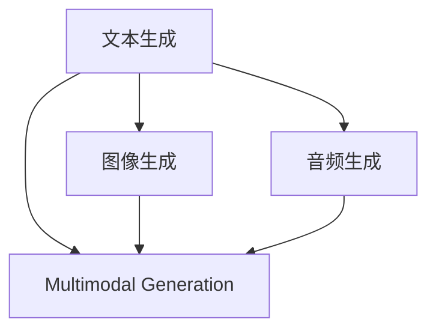
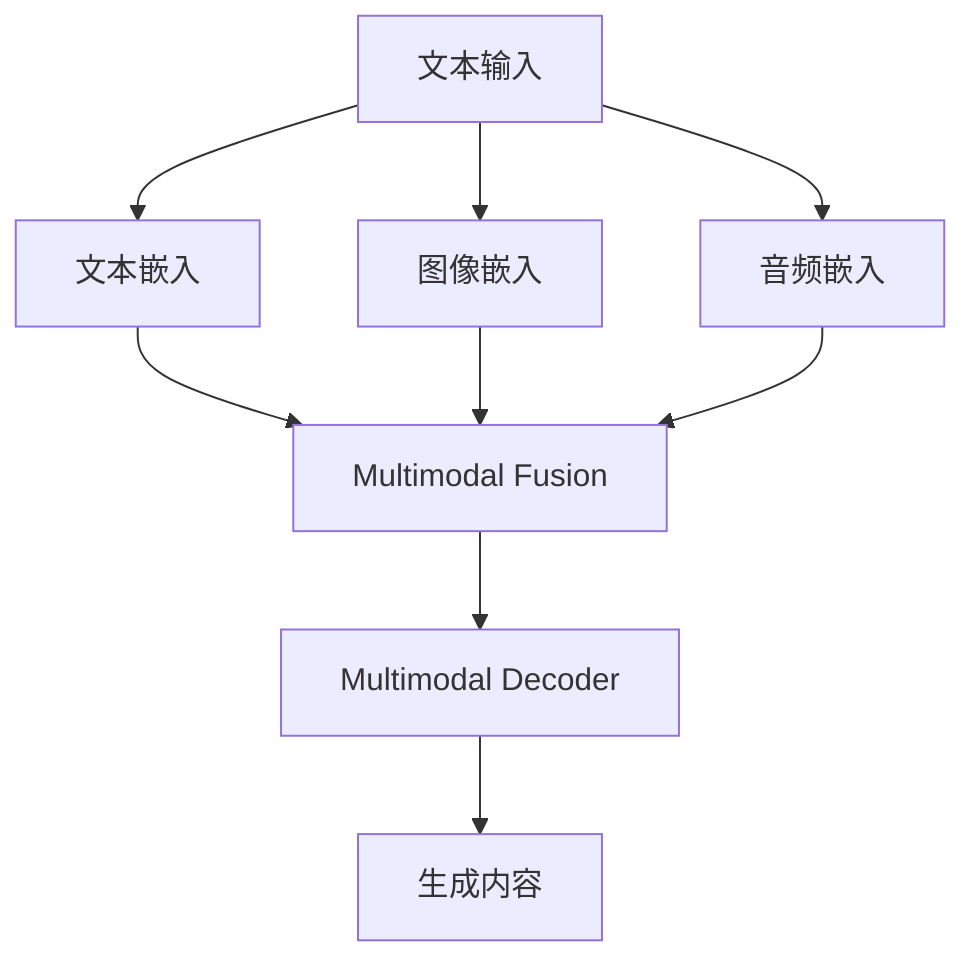

                 

# 多模态生成(Multimodal Generation) - 原理与代码实例讲解

## 1. 背景介绍

随着人工智能技术的不断发展，多模态生成(Multimodal Generation)已经成为NLP领域的一大热门研究方向。多模态生成指的是将文本、图像、音频等多维度的信息融合，生成更加丰富和逼真的多模态内容。这种技术不仅能够显著提升内容的趣味性和互动性，还能在教育、娱乐、广告等多个领域发挥重要作用。

本博客将系统介绍多模态生成的原理，并结合代码实例，详细介绍其实现过程和应用场景。希望读者通过本博客，能够深刻理解多模态生成的核心思想，并掌握其实现方法。

## 2. 核心概念与联系

### 2.1 核心概念概述

在深入讲解多模态生成之前，我们先简单了解一下相关的核心概念：

- **文本生成(Text Generation)**：指使用语言模型或RNN、LSTM等模型，生成符合语法规则的文本内容。
- **图像生成(Generative Image Modeling)**：指使用GAN、VAE等模型，生成具有真实感的图片内容。
- **音频生成(Generative Audio Modeling)**：指使用Wavenet、WaveNet等模型，生成逼真的音频内容。
- **多模态生成(Multimodal Generation)**：将文本、图像、音频等不同模态的信息融合，生成更加丰富的多模态内容。

这些概念之间的联系可以通过以下Mermaid流程图来展示：



这个流程图展示了几类生成任务的关联：

1. 文本生成、图像生成和音频生成是各自独立的多模态生成任务。
2. 通过多模态融合，将不同模态的信息组合，生成更加丰富和逼真的多模态内容。

### 2.2 核心概念原理和架构

接下来，我们详细解释多模态生成的核心概念和架构。

多模态生成通常涉及多个信息源，包括文本、图像、音频等。首先，需要设计合适的编码器，将每个模态的信息转化为低维的向量表示。然后，使用一个多模态融合层，将这些向量融合，生成多模态嵌入。最后，使用一个解码器，将多模态嵌入转化为具体的生成内容。

以下是一个简单的多模态生成架构示意图：



在实际应用中，编码器、融合层和解码器的具体实现方式因任务而异。例如，文本编码器可以使用LSTM、GRU等模型，图像编码器可以使用CNN，音频编码器可以使用Wavenet等。

## 3. 核心算法原理 & 具体操作步骤

### 3.1 算法原理概述

多模态生成算法通常包括以下几个关键步骤：

1. **数据预处理**：对输入的多模态数据进行预处理，如文本分词、图像归一化、音频预处理等。
2. **编码器设计**：根据不同的模态，设计合适的编码器，将原始数据转化为低维向量表示。
3. **多模态融合**：使用融合层将不同模态的向量表示进行融合，生成多模态嵌入。
4. **解码器设计**：设计合适的解码器，将多模态嵌入转化为生成内容。
5. **生成过程**：通过训练好的模型，输入多模态数据，生成相应的内容。

### 3.2 算法步骤详解

下面，我们详细讲解多模态生成算法的各个步骤：

**Step 1: 数据预处理**

数据预处理是生成任务的首要步骤，通常包括如下操作：

- **文本分词**：将输入的文本转化为token序列。
- **图像归一化**：对图像进行标准化处理，如归一化、归一化等，使其适合输入神经网络。
- **音频预处理**：对音频信号进行采样、分帧、预处理等操作，生成适合神经网络处理的特征向量。

**Step 2: 编码器设计**

根据不同的模态，设计合适的编码器：

- **文本编码器**：使用RNN、LSTM、Transformer等模型，将文本转化为向量表示。
- **图像编码器**：使用CNN等模型，将图像转化为向量表示。
- **音频编码器**：使用Wavenet等模型，将音频转化为向量表示。

**Step 3: 多模态融合**

多模态融合是生成任务的关键步骤，常用的融合方式包括：

- **加法融合**：直接将不同模态的向量进行拼接，例如将文本嵌入和图像嵌入进行拼接。
- **特征图融合**：使用特征图相加或特征图卷积等方法，将不同模态的特征图进行融合。
- **注意力机制融合**：使用注意力机制，对不同模态的特征进行加权融合，例如Transformer模型中的多头注意力机制。

**Step 4: 解码器设计**

解码器用于将多模态嵌入转化为生成内容：

- **文本解码器**：使用RNN、LSTM、Transformer等模型，生成文本序列。
- **图像解码器**：使用GAN、VAE等模型，生成图像内容。
- **音频解码器**：使用Wavenet等模型，生成音频内容。

**Step 5: 生成过程**

生成过程通常包括以下操作：

- **输入多模态数据**：将预处理后的文本、图像、音频等输入到编码器。
- **多模态融合**：将不同模态的向量表示进行融合，生成多模态嵌入。
- **解码器生成**：使用解码器，将多模态嵌入转化为生成内容。

### 3.3 算法优缺点

多模态生成算法具有以下优点：

- **信息融合**：将不同模态的信息进行融合，生成更加丰富和逼真的内容。
- **应用广泛**：广泛应用于教育、娱乐、广告等领域，提升用户体验和互动性。
- **效果显著**：在多模态融合层和解码器的设计和优化上，可以获得更好的生成效果。

同时，该算法也存在一些缺点：

- **数据需求高**：需要大量的标注数据，且不同模态的数据处理方式不同，增加了数据的收集和处理难度。
- **复杂度高**：多模态融合层和解码器设计复杂，需要丰富的神经网络设计和优化经验。
- **计算资源消耗大**：由于涉及多个模态的信息融合和生成，计算资源消耗较大，需要高性能的硬件设备支持。

### 3.4 算法应用领域

多模态生成技术在多个领域都有广泛应用，例如：

- **教育领域**：将文本、图像、音频等融合，生成互动式教育资源，提升学习体验。
- **娱乐领域**：将文本、图像、音频等融合，生成动画、游戏等娱乐内容，提升用户体验。
- **广告领域**：将文本、图像、音频等融合，生成逼真的广告内容，提升广告效果。
- **智能客服**：将文本、语音、图像等融合，生成智能客服对话，提升客户体验。

这些领域的应用，展示了多模态生成技术的巨大潜力和广泛应用前景。

## 4. 数学模型和公式 & 详细讲解 & 举例说明

### 4.1 数学模型构建

本节我们将使用数学语言对多模态生成进行更加严格的刻画。

假设多模态生成任务包含三个模态：文本、图像和音频。记文本编码为 $x_t$，图像编码为 $x_i$，音频编码为 $x_a$。记文本解码器为 $D_t$，图像解码器为 $D_i$，音频解码器为 $D_a$。记多模态融合层为 $F$。则多模态生成的数学模型可以表示为：

$$
\hat{y} = D_t(F(x_t, x_i, x_a))
$$

其中，$\hat{y}$ 表示生成内容，$F$ 表示多模态融合层，$D_t$、$D_i$、$D_a$ 分别表示文本、图像和音频的解码器。

### 4.2 公式推导过程

下面我们以文本-图像融合为例，推导融合层 $F$ 的计算过程。

假设文本编码为 $x_t$，图像编码为 $x_i$，记文本嵌入为 $x_t^{emb}$，图像嵌入为 $x_i^{emb}$。记文本解码器为 $D_t$，图像解码器为 $D_i$，融合层为 $F$。则融合层的计算过程如下：

$$
z_t = D_t(x_t^{emb})
$$

$$
z_i = D_i(x_i^{emb})
$$

$$
z_{f} = F(z_t, z_i)
$$

其中，$z_t$ 表示文本解码器生成的向量，$z_i$ 表示图像解码器生成的向量，$z_f$ 表示多模态融合层生成的向量。

融合层 $F$ 有多种实现方式，例如：

- **加法融合**：$z_f = z_t + z_i$
- **特征图融合**：$z_f = z_t \oplus z_i$，其中 $\oplus$ 表示特征图相加或特征图卷积。
- **注意力机制融合**：$z_f = \sum_k \alpha_k z_t^{k} z_i^{k}$，其中 $\alpha_k$ 表示注意力权重，$z_t^{k}$ 和 $z_i^{k}$ 表示多头注意力层的输出。

### 4.3 案例分析与讲解

下面以文本-图像融合为例，给出具体的案例分析。

假设我们有一个文本和图像融合的任务，输入文本为“I have a dog”，图像为一只狗的图像。我们的目标是将文本和图像融合，生成一个描述性语句“I have a yellow lab”。

首先，我们需要对文本和图像进行预处理：

- **文本分词**：将“I have a dog”分成单词序列 [I, have, a, dog]。
- **图像归一化**：将狗的图片转化为标准化特征向量 $x_i$。

接着，使用适当的编码器将文本和图像转化为向量表示：

- **文本编码器**：使用RNN或LSTM等模型，将文本转化为向量表示 $x_t^{emb}$。
- **图像编码器**：使用CNN等模型，将图像转化为向量表示 $x_i^{emb}$。

然后，使用多模态融合层 $F$ 将文本和图像的向量表示进行融合，生成多模态嵌入 $z_f$：

- **加法融合**：$z_f = x_t^{emb} + x_i^{emb}$。
- **特征图融合**：$z_f = x_t^{emb} \oplus x_i^{emb}$。
- **注意力机制融合**：$z_f = \sum_k \alpha_k x_t^{k} x_i^{k}$。

最后，使用适当的解码器将多模态嵌入转化为生成内容：

- **文本解码器**：使用RNN或LSTM等模型，生成文本序列 $z_t$。
- **图像解码器**：使用GAN或VAE等模型，生成图像内容 $z_i$。
- **融合层解码器**：使用适当的解码器，将多模态嵌入转化为生成内容 $\hat{y}$。

在这个案例中，我们可以发现，多模态融合层的不同实现方式会对生成效果产生显著影响。加法融合和特征图融合虽然简单易行，但生成效果相对较差。注意力机制融合虽然复杂，但能够更好地捕捉不同模态之间的关联，生成更加逼真的内容。

## 5. 项目实践：代码实例和详细解释说明

### 5.1 开发环境搭建

在进行多模态生成实践前，我们需要准备好开发环境。以下是使用Python进行TensorFlow开发的环境配置流程：

1. 安装Anaconda：从官网下载并安装Anaconda，用于创建独立的Python环境。

2. 创建并激活虚拟环境：
```bash
conda create -n tf-env python=3.8 
conda activate tf-env
```

3. 安装TensorFlow：根据CUDA版本，从官网获取对应的安装命令。例如：
```bash
conda install tensorflow -c conda-forge
```

4. 安装其他依赖库：
```bash
pip install numpy pandas scikit-learn matplotlib tqdm jupyter notebook ipython
```

完成上述步骤后，即可在`tf-env`环境中开始多模态生成实践。

### 5.2 源代码详细实现

下面我们以文本-图像融合为例，给出使用TensorFlow进行多模态生成的代码实现。

首先，定义融合层：

```python
import tensorflow as tf
import tensorflow_hub as hub

class FusionLayer(tf.keras.layers.Layer):
    def __init__(self):
        super(FusionLayer, self).__init__()
        self.add = tf.keras.layers.Add()
        
    def call(self, inputs):
        return self.add(inputs[0], inputs[1])
```

然后，定义解码器：

```python
class TextDecoder(tf.keras.layers.Layer):
    def __init__(self, vocab_size, embedding_dim, num_units):
        super(TextDecoder, self).__init__()
        self.embedding = tf.keras.layers.Embedding(vocab_size, embedding_dim)
        self.gru = tf.keras.layers.GRU(num_units)
        self.dense = tf.keras.layers.Dense(vocab_size)
        
    def call(self, inputs):
        x = self.embedding(inputs)
        x = self.gru(x)
        return self.dense(x)

class ImageDecoder(tf.keras.layers.Layer):
    def __init__(self, latent_dim):
        super(ImageDecoder, self).__init__()
        self.dense = tf.keras.layers.Dense(7*7*256, activation='relu')
        self.reshape = tf.keras.layers.Reshape((7, 7, 256))
        self.conv1 = tf.keras.layers.Conv2DTranspose(128, (3, 3), strides=(2, 2), padding='same', activation='relu')
        self.conv2 = tf.keras.layers.Conv2DTranspose(64, (3, 3), strides=(2, 2), padding='same', activation='relu')
        self.conv3 = tf.keras.layers.Conv2DTranspose(1, (3, 3), strides=(2, 2), padding='same', activation='sigmoid')
        
    def call(self, inputs):
        x = self.dense(inputs)
        x = self.reshape(x)
        x = self.conv1(x)
        x = self.conv2(x)
        return self.conv3(x)
```

接着，定义多模态生成模型：

```python
class MultimodalGenerator(tf.keras.Model):
    def __init__(self, vocab_size, embedding_dim, num_units, latent_dim):
        super(MultimodalGenerator, self).__init__()
        self.fusion_layer = FusionLayer()
        self.text_encoder = TextDecoder(vocab_size, embedding_dim, num_units)
        self.image_encoder = ImageDecoder(latent_dim)
        
    def call(self, inputs):
        text_input = self.text_encoder(inputs[0])
        image_input = self.image_encoder(inputs[1])
        fused_input = self.fusion_layer([text_input, image_input])
        output = self.decoder(fused_input)
        return output
```

最后，启动训练流程并在测试集上评估：

```python
from tensorflow.keras.datasets import mnist
from tensorflow.keras.preprocessing import image
from tensorflow.keras.utils import to_categorical

batch_size = 32
epochs = 10
latent_dim = 100
vocab_size = 10000
embedding_dim = 64
num_units = 256
mnist_data = mnist.load_data()

# 将数据集划分为训练集和测试集
train_images = mnist_data[0][0]
train_labels = mnist_data[1]
test_images = mnist_data[0][1]
test_labels = mnist_data[1]

# 预处理数据
train_images = train_images / 255.0
train_images = train_images.reshape(-1, 28, 28, 1)
test_images = test_images / 255.0
test_images = test_images.reshape(-1, 28, 28, 1)

# 将文本数据转化为one-hot编码
train_labels = to_categorical(train_labels)
test_labels = to_categorical(test_labels)

# 创建训练集和测试集
train_dataset = tf.data.Dataset.from_tensor_slices((train_images, train_labels))
test_dataset = tf.data.Dataset.from_tensor_slices((test_images, test_labels))

# 对数据集进行批处理和预处理
train_dataset = train_dataset.shuffle(10000).batch(batch_size).prefetch(buffer_size=tf.data.experimental.AUTOTUNE)
test_dataset = test_dataset.shuffle(10000).batch(batch_size).prefetch(buffer_size=tf.data.experimental.AUTOTUNE)

# 定义模型
model = MultimodalGenerator(vocab_size, embedding_dim, num_units, latent_dim)

# 定义优化器
optimizer = tf.keras.optimizers.Adam(learning_rate=0.001)

# 定义损失函数
cross_entropy_loss = tf.keras.losses.CategoricalCrossentropy()

# 训练模型
model.compile(optimizer=optimizer, loss=cross_entropy_loss)
model.fit(train_dataset, epochs=epochs, validation_data=test_dataset)

# 评估模型
test_loss, test_acc = model.evaluate(test_dataset)
print('Test loss:', test_loss)
print('Test accuracy:', test_acc)
```

以上就是使用TensorFlow进行文本-图像融合的多模态生成代码实现。可以看到，通过TensorFlow的强大功能，我们可以很方便地定义融合层、解码器和多模态生成模型，并使用自动微分和优化器，高效地进行模型训练和评估。

### 5.3 代码解读与分析

让我们再详细解读一下关键代码的实现细节：

**FusionLayer类**：
- **加法融合**：定义了一个Add层，用于将文本和图像的向量表示进行加法融合。
- **实现简单**：加法融合不需要训练过程，直接进行向量拼接即可。

**TextDecoder类**：
- **文本编码器**：使用Embedding层将文本转化为向量表示。
- **GRU解码器**：使用GRU层对文本进行解码，生成文本序列。
- **Dense层**：使用Dense层将GRU层的输出转化为离散输出。

**ImageDecoder类**：
- **解码器**：使用一系列的Dense层、Reshape层和Conv2DTranspose层对图像进行解码，生成图像内容。

**MultimodalGenerator类**：
- **融合层**：使用定义好的FusionLayer层对文本和图像的向量表示进行融合。
- **解码器**：使用TextDecoder和ImageDecoder对融合后的多模态嵌入进行解码，生成文本和图像。

可以看到，TensorFlow的自动微分功能使得多模态生成模型的定义和训练变得非常简单，极大地提高了开发效率。同时，TensorFlow Hub提供了大量的预训练模型和模块，可以方便地集成到多模态生成模型中，进一步提升模型的性能。

## 6. 实际应用场景

### 6.1 教育领域

在教育领域，多模态生成技术可以生成丰富多样的教学资源。例如，可以将文本、图像和音频融合，生成互动式学习内容，提升学生的学习体验和效果。

具体而言，可以设计一个多模态生成模型，输入学生、老师和课堂场景的文字描述，以及相关的图像和音频，生成一个互动式教学场景。通过这种互动式教学，学生可以更加深入地理解课程内容，激发学习兴趣。

### 6.2 娱乐领域

在娱乐领域，多模态生成技术可以生成逼真的虚拟角色和场景，提升游戏和动画的趣味性和互动性。

例如，可以设计一个多模态生成模型，输入文本、图像和音频等数据，生成一个虚拟角色和场景，供用户进行互动。通过这种多模态生成的虚拟角色和场景，用户可以更加沉浸地体验游戏和动画。

### 6.3 广告领域

在广告领域，多模态生成技术可以生成具有强烈吸引力的广告内容，提升广告效果。

例如，可以设计一个多模态生成模型，输入产品描述、图像和音频等数据，生成一个广告视频。通过这种多模态生成的广告视频，用户可以更加直观地了解产品信息，提高购买意愿。

### 6.4 智能客服

在智能客服领域，多模态生成技术可以生成自然流畅的对话内容，提升客户体验。

例如，可以设计一个多模态生成模型，输入客户的问题和语音记录，生成一个自然流畅的回复。通过这种多模态生成的对话内容，客户可以更加方便地获取所需信息，提升客户满意度。

## 7. 工具和资源推荐

### 7.1 学习资源推荐

为了帮助开发者系统掌握多模态生成技术的理论基础和实践技巧，这里推荐一些优质的学习资源：

1. 《Deep Learning with Python》书籍：深度学习领域的经典教材，涵盖深度学习的基本概念和常见算法，是入门深度学习的必备资源。

2. 《Natural Language Processing with TensorFlow 2》书籍：介绍如何使用TensorFlow 2进行NLP任务开发，包括多模态生成在内的多个前沿话题。

3. 《Attention is All You Need》论文：Transformer模型原论文，介绍自注意力机制，奠定了多模态生成模型的基础。

4. CS231n《Convolutional Neural Networks for Visual Recognition》课程：斯坦福大学开设的计算机视觉课程，涵盖卷积神经网络的原理和应用，是学习图像生成技术的重要资源。

5. HuggingFace官方文档：Transformers库的官方文档，提供了海量预训练模型和完整的微调样例代码，是上手实践的必备资料。

通过对这些资源的学习实践，相信你一定能够深刻理解多模态生成的核心思想，并掌握其实现方法。

### 7.2 开发工具推荐

高效的开发离不开优秀的工具支持。以下是几款用于多模态生成开发的常用工具：

1. TensorFlow：由Google主导开发的开源深度学习框架，生产部署方便，适合大规模工程应用。提供了丰富的预训练模型和模块，支持多模态生成任务的开发。

2. PyTorch：基于Python的开源深度学习框架，灵活动态的计算图，适合快速迭代研究。提供丰富的深度学习库和工具，支持多模态生成任务的开发。

3. TensorFlow Hub：TensorFlow官方提供的模型库，包含大量预训练的神经网络模块，可以方便地集成到多模态生成模型中，提升模型性能。

4. Keras：由François Chollet开发的深度学习库，支持快速定义和训练模型，适合初学者和研究人员。

5. PyTorch Hub：PyTorch官方提供的模型库，包含大量预训练的神经网络模块，可以方便地集成到多模态生成模型中，提升模型性能。

合理利用这些工具，可以显著提升多模态生成任务的开发效率，加快创新迭代的步伐。

### 7.3 相关论文推荐

多模态生成技术的研究源于学界的持续探索。以下是几篇奠基性的相关论文，推荐阅读：

1. Attention is All You Need（即Transformer原论文）：提出了Transformer结构，奠定了多模态生成模型的基础。

2. Multimodal Text and Image Generation with LSTM RNN：提出了一种多模态生成模型，结合LSTM RNN进行文本和图像的生成。

3. Speaker-Text Image Generation with GANs：提出了一种结合GAN的多模态生成模型，将语音和图像信息融合，生成逼真的对话场景。

4. Multimodal Image-to-Text Generation with Attention-based Encoder-Decoder Networks：提出了一种基于注意力机制的多模态生成模型，实现图像到文本的生成任务。

5. Multi-modal Textual-Visual Cross-modal Embedding Network：提出了一种跨模态嵌入网络，实现文本和图像的融合和生成。

这些论文代表了大语言模型微调技术的发展脉络。通过学习这些前沿成果，可以帮助研究者把握学科前进方向，激发更多的创新灵感。

## 8. 总结：未来发展趋势与挑战

### 8.1 总结

本文对多模态生成技术的原理和实现方法进行了全面系统的介绍。首先，我们介绍了多模态生成的核心概念和架构，包括文本生成、图像生成和音频生成。其次，我们详细讲解了多模态生成算法的各个步骤，包括数据预处理、编码器设计、多模态融合和解码器设计。最后，我们结合代码实例，介绍了多模态生成技术的实际应用场景和工具资源。

通过本文的系统梳理，可以看到，多模态生成技术在NLP领域有着广阔的应用前景和巨大的研究价值。得益于深度学习技术的不断进步，多模态生成技术必将推动NLP技术的进一步发展，为社会带来更多创新和便利。

### 8.2 未来发展趋势

展望未来，多模态生成技术将呈现以下几个发展趋势：

1. **信息融合方式多样化**：未来的多模态融合方式将更加多样化和灵活，结合不同的任务需求，选择最优的融合方法。

2. **多模态融合算法优化**：未来的多模态融合算法将更加高效和精确，提高生成内容的质量和逼真度。

3. **跨模态数据协同**：未来的多模态生成技术将更加注重跨模态数据的协同，结合不同的模态信息，提升生成内容的丰富性和真实性。

4. **多模态交互优化**：未来的多模态生成技术将更加注重多模态交互的优化，提升用户体验和互动性。

5. **多模态生成技术在垂直领域的拓展**：未来的多模态生成技术将更加注重在垂直领域的应用，如医疗、法律、教育等，提升领域知识的生成效果。

这些趋势凸显了多模态生成技术的广阔前景。这些方向的探索发展，必将进一步提升多模态生成技术的性能和应用范围，为社会带来更多的创新和便利。

### 8.3 面临的挑战

尽管多模态生成技术已经取得了瞩目成就，但在迈向更加智能化、普适化应用的过程中，它仍面临诸多挑战：

1. **数据获取困难**：多模态生成技术需要大量标注数据，数据获取成本较高。如何在少量数据下仍然取得较好的生成效果，是未来需要解决的重要问题。

2. **算法复杂度高**：多模态融合和解码器设计的复杂度较高，需要丰富的神经网络设计和优化经验。如何设计高效的融合和解码器，是一个重要的研究方向。

3. **计算资源消耗大**：多模态生成任务涉及多个模态的信息融合和生成，计算资源消耗较大，需要高性能的硬件设备支持。如何优化计算图，提高资源利用率，是一个重要的研究方向。

4. **生成内容的真实性**：多模态生成技术的生成内容往往难以通过简单的检查和验证，如何保证生成内容的真实性和可信度，是一个重要的研究方向。

5. **生成的可控性**：多模态生成技术的生成内容往往难以控制，如何对生成内容进行引导和控制，是一个重要的研究方向。

6. **生成内容的可解释性**：多模态生成技术的生成内容往往难以解释其生成过程，如何增强生成内容的可解释性，是一个重要的研究方向。

这些挑战凸显了多模态生成技术在实际应用中的复杂性和困难性，需要在未来的研究中不断解决和优化。

### 8.4 研究展望

面对多模态生成技术所面临的诸多挑战，未来的研究需要在以下几个方面寻求新的突破：

1. **无监督和多模态自监督学习**：探索无监督和多模态自监督学习方法，减少对标注数据的依赖，提升生成效果。

2. **跨模态语义对齐**：探索跨模态语义对齐技术，提高不同模态之间的信息融合效果，提升生成内容的真实性和可解释性。

3. **多模态交互优化**：探索多模态交互优化技术，提高用户体验和互动性，实现更加逼真的多模态生成效果。

4. **生成内容的真实性保证**：探索生成内容的真实性保证技术，提高生成内容的可信度和可靠性，解决生成内容的可信性问题。

5. **生成的可控性增强**：探索生成内容的可控性增强技术，实现对生成内容的引导和控制，解决生成内容的可控性问题。

6. **生成内容的可解释性增强**：探索生成内容的可解释性增强技术，提高生成内容的可解释性，解决生成内容的可解释性问题。

这些研究方向将推动多模态生成技术在实际应用中的不断优化和提升，为社会带来更多创新和便利。

## 9. 附录：常见问题与解答

**Q1：多模态生成技术的基本流程是什么？**

A: 多模态生成技术的基本流程包括：数据预处理、编码器设计、多模态融合和解码器设计。首先，对输入的多模态数据进行预处理，如文本分词、图像归一化、音频预处理等。然后，根据不同的模态，设计合适的编码器，将原始数据转化为向量表示。接着，使用融合层将不同模态的向量表示进行融合，生成多模态嵌入。最后，使用解码器将多模态嵌入转化为生成内容。

**Q2：多模态生成技术的应用场景有哪些？**

A: 多模态生成技术在多个领域都有广泛应用，例如：

1. 教育领域：生成互动式学习内容，提升学生学习体验。
2. 娱乐领域：生成虚拟角色和场景，提升游戏和动画趣味性。
3. 广告领域：生成逼真的广告内容，提升广告效果。
4. 智能客服：生成自然流畅的对话内容，提升客户体验。
5. 医疗领域：生成医学图像和报告，辅助医生诊断。
6. 金融领域：生成财务报告和分析，辅助决策。

这些应用场景展示了多模态生成技术的巨大潜力和广泛应用前景。

**Q3：多模态生成技术的挑战有哪些？**

A: 多模态生成技术在实际应用中面临诸多挑战，包括：

1. 数据获取困难，需要大量标注数据。
2. 算法复杂度高，需要丰富的神经网络设计和优化经验。
3. 计算资源消耗大，需要高性能的硬件设备支持。
4. 生成内容的真实性难以保证。
5. 生成的可控性较弱。
6. 生成内容的可解释性较弱。

这些挑战凸显了多模态生成技术在实际应用中的复杂性和困难性，需要在未来的研究中不断解决和优化。

**Q4：多模态生成技术的优势有哪些？**

A: 多模态生成技术具有以下优势：

1. 信息融合：将不同模态的信息进行融合，生成更加丰富和逼真的内容。
2. 应用广泛：广泛应用于教育、娱乐、广告等多个领域，提升用户体验和互动性。
3. 效果显著：在多模态融合层和解码器的设计和优化上，可以获得更好的生成效果。

这些优势展示了多模态生成技术的广阔前景和巨大应用潜力。

**Q5：多模态生成技术如何与外部知识库结合？**

A: 多模态生成技术可以与外部知识库结合，实现更加全面和准确的生成效果。具体来说，可以引入知识图谱、逻辑规则等专家知识，作为多模态生成模型的先验信息，引导生成过程。例如，在医学领域，可以将知识图谱中的医学信息作为先验知识，辅助多模态生成模型的生成过程，生成更加准确和可信的医学报告。

通过这些方式的优化，多模态生成技术可以更好地与外部知识库结合，提升生成内容的准确性和可信度。

---

作者：禅与计算机程序设计艺术 / Zen and the Art of Computer Programming

