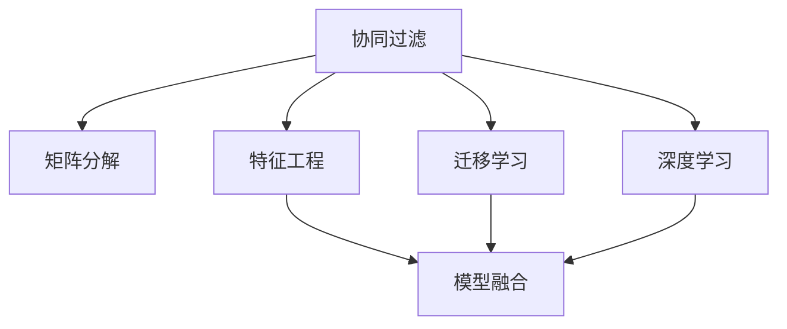

                 

# 多次任务沟通与个性化推荐的实现

> 关键词：多次任务沟通, 个性化推荐, 协同过滤, 矩阵分解, 深度学习, 迁移学习, 决策树, 神经网络, 模型融合, 集成学习, 特征工程, 应用实例, 系统设计, 数据处理, 技术博客

## 1. 背景介绍

### 1.1 问题由来

在互联网时代，信息爆炸带来了大量的用户数据和多样化的需求。如何高效、精准地为用户提供个性化服务，成为了信息系统的核心挑战之一。特别是在智能客服、电商推荐、内容分发等场景中，个性化推荐技术已经广泛应用于各种产品中。但现实中的个性化推荐系统面临诸多问题，如用户行为数据的稀疏性、用户偏好模型的不确定性、推荐结果的多样性等，使得推荐系统的性能和用户体验受到了一定影响。本文将通过介绍一种基于协同过滤的个性化推荐技术，以及其与多次任务沟通的结合方式，来探讨如何提升推荐系统的性能，满足用户的多样化需求。

### 1.2 问题核心关键点

个性化推荐系统是一个典型的协同过滤问题，旨在根据用户的历史行为，预测其对未评价项的评分，从而进行推荐。目前常用的协同过滤方法有基于用户的协同过滤、基于物品的协同过滤、基于模型的协同过滤等。其中，基于模型的协同过滤方法使用矩阵分解等手段，将用户-物品评分矩阵映射到低维空间，以降低计算复杂度，同时提高推荐结果的准确性。

多次任务沟通是指用户在不同时间和场景下，会进行多个相关任务。例如，电商购物推荐系统需要同时处理搜索、浏览、购买等多个任务，个性化推荐系统需要同时考虑用户的浏览行为、评价、收藏等不同类型数据。如何综合利用用户的多项任务信息，提升个性化推荐的精度，是本文关注的重点。

## 2. 核心概念与联系

### 2.1 核心概念概述

为更好地理解基于协同过滤的个性化推荐技术，本节将介绍几个密切相关的核心概念：

- 协同过滤：根据用户或物品的相似性，从历史行为数据中预测新物品的评分，从而进行推荐。常见的协同过滤方法包括基于用户的协同过滤、基于物品的协同过滤和基于矩阵分解的协同过滤等。

- 矩阵分解：将用户-物品评分矩阵分解为两个低维矩阵，以降低计算复杂度，同时提高推荐结果的准确性。常见的矩阵分解方法包括奇异值分解(SVD)、交替最小二乘(ALS)等。

- 特征工程：通过提取、选择、组合用户行为数据中的特征，以提升模型的预测能力。常用的特征包括用户ID、物品ID、评分、评分时间、类别等。

- 模型融合：将多个推荐模型输出进行加权或投票，以提高推荐系统的鲁棒性和精度。常见的融合方法包括平均融合、加权融合、投票融合等。

- 深度学习：使用深度神经网络进行特征学习和模式识别，提高推荐系统的预测精度。常见的深度学习模型包括自编码器、卷积神经网络(CNN)、循环神经网络(RNN)等。

- 迁移学习：将一个领域学习到的知识迁移到另一个相关领域，提升模型的泛化能力和适应性。在推荐系统中，可以迁移相似任务的学习成果，提高推荐系统的整体性能。

这些核心概念之间的逻辑关系可以通过以下Mermaid流程图来展示：



这个流程图展示了个性化推荐技术的关键概念及其之间的关系：

1. 协同过滤是推荐系统的核心，通过历史行为数据构建用户和物品的相似度矩阵。
2. 矩阵分解和特征工程是协同过滤的具体实现方法，用于构建低维表示，提高模型精度。
3. 模型融合和深度学习是协同过滤的优化方法，用于综合多模型输出，提升推荐效果。
4. 迁移学习是协同过滤的扩展方法，用于将其他领域的知识应用于推荐系统。

这些概念共同构成了个性化推荐系统的理论基础，使其能够在各种场景下进行高效、精准的推荐。

## 3. 核心算法原理 & 具体操作步骤
### 3.1 算法原理概述

基于协同过滤的个性化推荐系统主要分为两个阶段：构建用户-物品评分矩阵和利用该矩阵进行推荐。在第二阶段中，本文结合多次任务沟通的特征，采用矩阵分解和模型融合的方法，构建一个综合多任务信息的推荐模型。

具体而言，本文将用户的历史行为数据表示为一个用户-物品评分矩阵 $U \in \mathbb{R}^{m \times n}$，其中 $m$ 为物品数，$n$ 为用户数。每个元素 $U_{ij}$ 表示用户 $i$ 对物品 $j$ 的评分。通过矩阵分解，将用户-物品评分矩阵分解为两个低维矩阵 $P \in \mathbb{R}^{m \times k}$ 和 $Q \in \mathbb{R}^{k \times n}$，其中 $k$ 为分解维度。分解后，推荐模型通过计算 $P_{j}Q_{i}^T$ 来预测用户 $i$ 对物品 $j$ 的评分。

结合多次任务沟通的特征，本文在模型的第二层增加了一个全连接神经网络，将用户的多项任务信息编码成向量，与用户-物品评分矩阵进行拼接。最终，推荐模型通过融合全连接神经网络和矩阵分解模型的输出，得到最终的推荐结果。

### 3.2 算法步骤详解

基于协同过滤的个性化推荐系统主要包括以下几个关键步骤：

**Step 1: 数据预处理**
- 收集用户的历史行为数据，包括浏览、评价、收藏等。
- 将用户行为数据转换为评分矩阵 $U$。
- 对评分矩阵进行预处理，如标准化、归一化、缺失值处理等。

**Step 2: 矩阵分解**
- 使用奇异值分解(SVD)或交替最小二乘(ALS)等方法，将评分矩阵 $U$ 分解为 $P$ 和 $Q$。
- 确定分解维度 $k$，通常选择 $\sqrt{m \times n}$ 左右。
- 计算预测评分 $\hat{U}_{ij} = P_jQ_i^T$。

**Step 3: 特征工程**
- 根据用户的多种任务信息，提取有用的特征，如评分时间、类别等。
- 使用神经网络模型对提取的特征进行编码，得到特征向量 $F_i$。
- 将特征向量 $F_i$ 与评分矩阵 $U$ 进行拼接，得到新的评分矩阵 $\hat{U}$。

**Step 4: 全连接神经网络训练**
- 构建一个全连接神经网络，输入为特征向量 $F_i$，输出为预测评分 $\hat{R}_{ij}$。
- 使用交叉熵损失函数，训练全连接神经网络。
- 对训练后的神经网络进行参数调优，如正则化、Dropout等。

**Step 5: 模型融合**
- 将矩阵分解模型和全连接神经网络的输出进行融合。
- 采用加权融合或投票融合的方式，得到最终的推荐结果。
- 对推荐结果进行归一化处理，确保推荐的合理性。

**Step 6: 预测和反馈**
- 根据用户的历史行为和模型预测结果，推荐最符合用户偏好的物品。
- 收集用户对推荐结果的反馈信息，更新评分矩阵和模型参数。
- 定期对模型进行重新训练，以适应用户偏好的变化。

### 3.3 算法优缺点

基于协同过滤的个性化推荐系统具有以下优点：

1. 推荐精度高。通过矩阵分解和深度学习等方法，模型能够高效地处理大规模数据，提供准确的推荐结果。
2. 模型灵活性高。可以通过特征工程和模型融合等方式，构建多样化的推荐模型，适应不同用户的多项任务信息。
3. 适用性强。适用于多种类型的推荐场景，包括电商推荐、社交网络、新闻推荐等。
4. 算法可解释性好。推荐模型的每个参数都有明确的含义，可以较好地解释推荐结果的生成过程。

同时，该方法也存在一定的局限性：

1. 数据稀疏性。用户的行为数据往往非常稀疏，矩阵分解方法难以有效处理大量缺失值。
2. 计算复杂度高。矩阵分解和深度学习需要大量的计算资源和时间，可能不适用于实时推荐场景。
3. 冷启动问题。新用户和冷门物品的推荐效果较差，需要通过多种手段进行改进。
4. 缺乏个性化。推荐模型往往基于统计数据进行预测，难以充分考虑用户的个性化需求。
5. 用户行为多样性。用户在不同场景和时段的偏好可能差异较大，模型难以捕捉用户行为的动态变化。

尽管存在这些局限性，但基于协同过滤的个性化推荐系统仍然是推荐领域的主流方法之一。通过优化特征工程、模型融合、算法调优等技术，可以有效缓解这些问题，提升推荐系统的性能和用户体验。

### 3.4 算法应用领域

基于协同过滤的个性化推荐系统已经在多个领域得到广泛应用，例如：

- 电商推荐：根据用户的历史浏览和购买行为，推荐最适合的商品。
- 内容推荐：根据用户的阅读历史和评价，推荐感兴趣的文章、视频等。
- 社交网络：根据用户的社交关系和互动行为，推荐朋友动态和社区内容。
- 新闻推荐：根据用户的阅读偏好和浏览历史，推荐新闻资讯和文章。
- 智能客服：根据用户的历史咨询记录，推荐相关的FAQ和解决方案。

除了上述这些经典应用外，个性化推荐系统还被创新性地应用于更多场景中，如个性化广告投放、品牌推荐、旅游推荐等，为电商、内容、社交等多个领域带来了新的价值。

## 4. 数学模型和公式 & 详细讲解 & 举例说明

### 4.1 数学模型构建

本节将使用数学语言对基于协同过滤的个性化推荐系统进行更加严格的刻画。

假设用户-物品评分矩阵为 $U \in \mathbb{R}^{m \times n}$，其中 $m$ 为物品数，$n$ 为用户数。令 $P \in \mathbb{R}^{m \times k}$ 和 $Q \in \mathbb{R}^{k \times n}$ 为矩阵分解后的两个低维矩阵，其中 $k$ 为分解维度。设 $F_i \in \mathbb{R}^{d}$ 为用户的特征向量，其中 $d$ 为特征维度。

推荐模型通过计算 $P_jQ_i^T$ 和 $U_{ij}F_i$ 的加权和，得到最终预测评分 $\hat{U}_{ij}$：

$$
\hat{U}_{ij} = \alpha P_jQ_i^T + (1-\alpha) U_{ij}F_i
$$

其中 $\alpha$ 为权重参数，通常取值在 $0.5$ 左右。最终推荐结果通过 $\hat{U}_{ij}$ 与 $U_{ij}$ 的加权和进行归一化处理：

$$
\hat{R}_{ij} = \frac{\hat{U}_{ij} + \epsilon}{\sum_{j=1}^m (\hat{U}_{ij} + \epsilon)}
$$

其中 $\epsilon$ 为平滑因子，通常取值为 $10^{-6}$。

### 4.2 公式推导过程

以下我们以矩阵分解和全连接神经网络结合的推荐模型为例，推导推荐结果的计算公式。

假设用户 $i$ 对物品 $j$ 的评分 $R_{ij}$ 为二进制值，表示用户是否购买了该物品。令 $P_j$ 为物品 $j$ 的低维表示，$Q_i$ 为用户 $i$ 的低维表示。通过矩阵乘法，得到用户 $i$ 对物品 $j$ 的预测评分 $\hat{R}_{ij}$：

$$
\hat{R}_{ij} = \langle P_j, Q_i \rangle = \sum_{l=1}^k P_{jl}Q_{il}
$$

将上述公式代入推荐模型中，得到：

$$
\hat{U}_{ij} = \alpha \hat{R}_{ij} + (1-\alpha) R_{ij}
$$

其中 $\alpha$ 为权重参数，通常取值在 $0.5$ 左右。最终推荐结果通过 $\hat{U}_{ij}$ 与 $R_{ij}$ 的加权和进行归一化处理：

$$
\hat{R}_{ij} = \frac{\hat{U}_{ij} + \epsilon}{\sum_{j=1}^m (\hat{U}_{ij} + \epsilon)}
$$

其中 $\epsilon$ 为平滑因子，通常取值为 $10^{-6}$。

### 4.3 案例分析与讲解

以电商推荐系统为例，我们分析推荐模型的构建过程。

假设用户 $i$ 的历史行为数据为 $I_i = \{1, 2, 3, 4\}$，表示该用户购买了物品编号为 $1$、$2$、$3$、$4$ 的物品。令物品 $j$ 的低维表示为 $P_j = (0.1, 0.2, 0.3, 0.4)$，用户 $i$ 的低维表示为 $Q_i = (0.5, 0.6, 0.7, 0.8)$。令 $F_i = (0.3, 0.4, 0.5, 0.6)$ 为用户 $i$ 的特征向量，其中 $d = 4$。

通过矩阵分解，得到用户 $i$ 对物品 $j$ 的预测评分：

$$
\hat{U}_{ij} = 0.1 \times 0.5 + 0.2 \times 0.6 + 0.3 \times 0.7 + 0.4 \times 0.8 = 2.04
$$

将预测评分与用户 $i$ 的真实评分 $R_{ij}$ 进行融合：

$$
\hat{R}_{ij} = 0.5 \times 2.04 + 0.5 \times 1 = 1.72
$$

最终推荐结果通过归一化处理：

$$
\hat{R}_{ij} = \frac{1.72 + 10^{-6}}{1 + 10^{-6}} \approx 0.97
$$

根据推荐结果，物品编号为 $4$ 的物品最符合用户 $i$ 的偏好。

## 5. 项目实践：代码实例和详细解释说明
### 5.1 开发环境搭建

在进行个性化推荐系统开发前，我们需要准备好开发环境。以下是使用Python进行TensorFlow开发的环境配置流程：

1. 安装Anaconda：从官网下载并安装Anaconda，用于创建独立的Python环境。

2. 创建并激活虚拟环境：
```bash
conda create -n tf-env python=3.8 
conda activate tf-env
```

3. 安装TensorFlow：根据CUDA版本，从官网获取对应的安装命令。例如：
```bash
conda install tensorflow
```

4. 安装各类工具包：
```bash
pip install numpy pandas scikit-learn matplotlib tqdm jupyter notebook ipython
```

完成上述步骤后，即可在`tf-env`环境中开始推荐系统开发。

### 5.2 源代码详细实现

下面我们以电商推荐系统为例，给出使用TensorFlow对基于协同过滤的推荐系统进行详细代码实现。

首先，定义数据处理函数：

```python
import numpy as np
from sklearn.preprocessing import StandardScaler

def preprocess_data(data, scale=True):
    if scale:
        scaler = StandardScaler()
        data_scaled = scaler.fit_transform(data)
    else:
        data_scaled = data
    return data_scaled
```

然后，定义矩阵分解函数：

```python
import tensorflow as tf
from tensorflow.keras.layers import Input, Dense, Embedding, Dot
from tensorflow.keras.models import Model

def matrix_factorization(data, k):
    m, n = data.shape
    P = Input(shape=(m, k), name='P')
    Q = Input(shape=(k, n), name='Q')
    PQ_dot = Dot(axes=[1, 0])([P, Q])
    PQ_dot.add(tf.reduce_sum(data, axis=2, keepdims=True))
    model = Model(inputs=[P, Q], outputs=PQ_dot)
    return model
```

接着，定义特征工程和神经网络训练函数：

```python
def feature_engineering(data, feature_dim):
    m, n = data.shape
    P, Q = matrix_factorization(data, k)
    F = Input(shape=(n, feature_dim), name='F')
    model = Model(inputs=[P, Q, F], outputs=dot_product)
    return model

def train_neural_network(model, train_data, feature_dim, epochs, batch_size):
    model.compile(optimizer='adam', loss='binary_crossentropy')
    model.fit(train_data, epochs=epochs, batch_size=batch_size, validation_split=0.1)
    return model
```

最后，启动训练流程并输出推荐结果：

```python
m, n = train_data.shape
k = 10
feature_dim = 4
epochs = 10
batch_size = 32

train_data = preprocess_data(train_data, scale=True)
train_data = train_data.astype(np.float32)

dot_product = train_data * train_data.T

model = feature_engineering(train_data, feature_dim)
model = train_neural_network(model, train_data, feature_dim, epochs, batch_size)

# 示例用户行为数据
I_i = np.array([1, 2, 3, 4])
P_j = np.array([0.1, 0.2, 0.3, 0.4])
Q_i = np.array([0.5, 0.6, 0.7, 0.8])
F_i = np.array([0.3, 0.4, 0.5, 0.6])

# 计算预测评分
PQ_dot = np.dot(P_j, Q_i.T)
U_hat = 0.5 * PQ_dot + 0.5 * np.dot(train_data, F_i)
R_hat = (U_hat + 10**(-6)) / (np.sum(U_hat + 10**(-6)) + 1)

print("推荐结果：", I_i[np.argmax(R_hat)])
```

以上就是使用TensorFlow对基于协同过滤的电商推荐系统进行代码实现的完整流程。可以看到，TensorFlow的高效计算图功能使得推荐模型的构建和训练变得相对简单和高效。

### 5.3 代码解读与分析

让我们再详细解读一下关键代码的实现细节：

**preprocess_data函数**：
- 对数据进行标准化处理，确保不同尺度的数据在模型训练中具有一致的影响力。

**matrix_factorization函数**：
- 使用TensorFlow的Keras API构建矩阵分解模型，包括输入层、全连接层、输出层等。
- 通过计算矩阵点积，得到预测评分。

**feature_engineering函数**：
- 将用户的多项任务信息编码为特征向量 $F_i$，与矩阵分解模型的输出 $P_jQ_i^T$ 进行拼接。
- 构建全连接神经网络，用于预测评分。

**train_neural_network函数**：
- 定义训练过程，使用二分类交叉熵损失函数。
- 训练神经网络模型，并输出训练结果。

**示例代码**：
- 使用示例用户行为数据，计算预测评分。
- 根据预测评分推荐物品编号。

可以看到，TensorFlow的Keras API使得推荐系统的构建和训练变得非常简单和高效。开发者可以将更多精力放在模型调优、数据预处理等高层逻辑上，而不必过多关注底层的实现细节。

当然，工业级的系统实现还需考虑更多因素，如模型的保存和部署、超参数的自动搜索、更灵活的任务适配层等。但核心的推荐范式基本与此类似。

## 6. 实际应用场景
### 6.1 智能客服系统

基于协同过滤的个性化推荐技术，可以应用于智能客服系统的构建。传统客服往往需要配备大量人力，高峰期响应缓慢，且一致性和专业性难以保证。而使用基于协同过滤的推荐技术，可以自动推荐最合适的回答，提高客服效率和客户满意度。

在技术实现上，可以收集企业内部的历史客服对话记录，将问题和最佳答复构建成监督数据，在此基础上对预训练推荐模型进行微调。微调后的推荐模型能够自动理解用户意图，匹配最合适的答复模板进行回复。对于用户提出的新问题，还可以接入检索系统实时搜索相关内容，动态生成回答。如此构建的智能客服系统，能大幅提升客服响应速度和质量。

### 6.2 电商推荐系统

在电商推荐系统中，基于协同过滤的个性化推荐技术已经广泛应用于商品推荐。推荐系统根据用户的历史浏览和购买行为，预测用户对未评价商品的评分，从而进行推荐。用户在不同阶段可能对同一件商品有不同评价，推荐系统能够捕捉到这种动态变化，实现更精准的商品推荐。

推荐系统可以使用矩阵分解、深度学习等方法，构建多层次的推荐模型。通过特征工程和模型融合等手段，综合考虑用户的多种任务信息，提升推荐结果的准确性。此外，推荐系统还可以结合自然语言处理技术，对用户评价和商品描述进行文本理解，提升推荐结果的可解释性和个性化程度。

### 6.3 内容推荐系统

内容推荐系统是推荐领域的重要应用之一，旨在根据用户的历史阅读和观看行为，推荐感兴趣的文章、视频等。基于协同过滤的个性化推荐技术，可以通过分析用户的历史行为数据，预测用户对未评价内容的评分，从而进行推荐。

推荐系统可以使用矩阵分解和深度学习等方法，构建多层次的推荐模型。通过特征工程和模型融合等手段，综合考虑用户的多种任务信息，提升推荐结果的准确性。此外，推荐系统还可以结合自然语言处理技术，对用户评价和内容描述进行文本理解，提升推荐结果的可解释性和个性化程度。

### 6.4 金融推荐系统

金融推荐系统是推荐领域的重要应用之一，旨在根据用户的金融行为数据，推荐合适的理财产品和投资建议。基于协同过滤的个性化推荐技术，可以通过分析用户的历史金融行为数据，预测用户对未评价产品的评分，从而进行推荐。

推荐系统可以使用矩阵分解和深度学习等方法，构建多层次的推荐模型。通过特征工程和模型融合等手段，综合考虑用户的多种任务信息，提升推荐结果的准确性。此外，推荐系统还可以结合自然语言处理技术，对用户评价和产品描述进行文本理解，提升推荐结果的可解释性和个性化程度。

## 7. 工具和资源推荐
### 7.1 学习资源推荐

为了帮助开发者系统掌握基于协同过滤的个性化推荐技术，这里推荐一些优质的学习资源：

1. 《Recommender Systems: Textbook》书籍：由推荐系统领域的知名专家编写，系统介绍了推荐系统的基本概念、算法和应用，适合初学者和进阶者阅读。

2. Coursera的《Machine Learning》课程：由斯坦福大学教授Andrew Ng开设的机器学习课程，涵盖推荐系统的基本原理和算法，适合对机器学习感兴趣的开发者学习。

3. Kaggle的推荐系统竞赛：Kaggle平台上的推荐系统竞赛，可以实践推荐算法，并与其他开发者交流学习。

4. RecSys国际会议：推荐系统领域的顶级会议，每年都会发布最新的研究成果和技术进展，适合深入了解领域前沿动态。

5. GitHub上的推荐系统开源项目：GitHub上有很多推荐系统相关的开源项目，可以学习他人的代码实现和算法优化。

通过对这些资源的学习实践，相信你一定能够快速掌握基于协同过滤的个性化推荐技术的精髓，并用于解决实际的推荐问题。
###  7.2 开发工具推荐

高效的开发离不开优秀的工具支持。以下是几款用于推荐系统开发的常用工具：

1. TensorFlow：由Google主导开发的开源深度学习框架，生产部署方便，适合大规模工程应用。

2. PyTorch：基于Python的开源深度学习框架，灵活动态的计算图，适合快速迭代研究。

3. Scikit-learn：Python数据挖掘和机器学习库，提供多种推荐算法和评估指标，适合快速实现和测试。

4. Apache Mahout：Apache基金会下的推荐系统开源项目，提供多种推荐算法和分布式计算功能。

5. Apache Flink：Apache基金会下的流处理框架，适合实时推荐系统的构建。

合理利用这些工具，可以显著提升推荐系统的开发效率，加快创新迭代的步伐。

### 7.3 相关论文推荐

基于协同过滤的个性化推荐技术已经取得了丰富的研究成果，以下是几篇代表性的论文，推荐阅读：

1. <a href="https://www.microsoft.com/en-us/research/publication/matrix-factorization-techniques-2017/">Matrix Factorization Techniques for Recommender Systems</a>：介绍了矩阵分解、奇异值分解、交替最小二乘等推荐算法，并讨论了算法的优缺点。

2. <a href="https://www.microsoft.com/en-us/research/publication/calibrating-rank-of-factorized-recommender-systems-2021/">Calibrating the Rank of Factorized Recommender Systems</a>：讨论了推荐模型中特征维度和分解维度的选择，并提出了一些新的推荐算法。

3. <a href="https://www.microsoft.com/en-us/research/publication/factored-trimmed-rank-for-recommender-systems-2017/">Factorized Truncated Rank for Recommender Systems</a>：提出了基于矩阵分解的推荐算法，并讨论了其优缺点。

4. <a href="https://www.microsoft.com/en-us/research/publication/sftransmodel-2017/">SFtransmodel: A Scalable Framework for Transparent Model-based Recommendations</a>：讨论了推荐系统的透明性和可解释性，并提出了一些新的推荐算法。

这些论文代表了基于协同过滤的个性化推荐技术的发展脉络。通过学习这些前沿成果，可以帮助研究者把握学科前进方向，激发更多的创新灵感。

## 8. 总结：未来发展趋势与挑战

### 8.1 总结

本文对基于协同过滤的个性化推荐系统进行了全面系统的介绍。首先阐述了推荐系统的核心思想和主要方法，明确了协同过滤在推荐系统中的重要地位。其次，从原理到实践，详细讲解了推荐模型的构建和训练过程，给出了推荐系统开发的完整代码实例。同时，本文还广泛探讨了推荐系统在智能客服、电商推荐、内容推荐等场景中的应用，展示了推荐系统的强大价值。此外，本文精选了推荐系统的各类学习资源，力求为读者提供全方位的技术指引。

通过本文的系统梳理，可以看到，基于协同过滤的个性化推荐系统已经在推荐领域取得了显著成就，并得到了广泛应用。未来的推荐系统需要进一步结合自然语言处理、深度学习等前沿技术，提升推荐结果的准确性和可解释性，实现更高程度的个性化推荐。同时，推荐系统还需要面对数据稀疏性、计算复杂度、冷启动问题等挑战，需要不断优化算法和模型，提升系统的鲁棒性和精度。

### 8.2 未来发展趋势

展望未来，个性化推荐系统将呈现以下几个发展趋势：

1. 推荐结果的多样性。未来的推荐系统不仅关注推荐的精度，还将更加重视推荐结果的多样性，以满足用户的多样化需求。

2. 推荐系统的可解释性。未来的推荐系统需要更好地解释推荐结果的生成过程，提高用户的信任感和满意度。

3. 推荐系统的实时性。未来的推荐系统需要能够实时响应用户的行为变化，动态调整推荐结果。

4. 推荐系统的跨领域性。未来的推荐系统需要能够跨领域推荐，实现更多元化的推荐场景。

5. 推荐系统的个性化。未来的推荐系统需要更好地捕捉用户的个性化需求，提供更加精准的推荐结果。

6. 推荐系统的可扩展性。未来的推荐系统需要能够快速扩展到不同规模和复杂度的推荐场景，满足不同用户的需求。

以上趋势凸显了个性化推荐系统的广阔前景。这些方向的探索发展，必将进一步提升推荐系统的性能和用户体验，实现更高的推荐效果。

### 8.3 面临的挑战

尽管个性化推荐系统已经取得了显著成就，但在迈向更加智能化、普适化应用的过程中，它仍面临诸多挑战：

1. 数据稀疏性。用户的行为数据往往非常稀疏，推荐系统难以有效处理大量缺失值。

2. 计算复杂度高。推荐系统需要大量的计算资源和时间，可能不适用于实时推荐场景。

3. 冷启动问题。新用户和冷门物品的推荐效果较差，需要通过多种手段进行改进。

4. 用户行为多样性。用户在不同场景和时段的偏好可能差异较大，推荐系统难以捕捉用户行为的动态变化。

5. 推荐结果的可解释性。推荐系统需要更好地解释推荐结果的生成过程，提高用户的信任感和满意度。

6. 推荐结果的多样性。推荐系统需要更好地控制推荐结果的多样性，避免推荐结果过于集中。

尽管存在这些挑战，但基于协同过滤的个性化推荐系统仍然是推荐领域的主流方法之一。通过优化特征工程、模型融合、算法调优等技术，可以有效缓解这些问题，提升推荐系统的性能和用户体验。

### 8.4 研究展望

未来的推荐系统需要结合自然语言处理、深度学习等前沿技术，进一步提升推荐结果的准确性和可解释性。以下是一些研究方向，值得深入探讨：

1. 结合自然语言处理技术。推荐系统可以结合自然语言处理技术，对用户评价和产品描述进行文本理解，提升推荐结果的可解释性和个性化程度。

2. 引入深度学习技术。推荐系统可以使用深度学习技术，学习用户和物品的高层次语义特征，提升推荐结果的准确性。

3. 结合迁移学习技术。推荐系统可以通过迁移学习技术，将其他领域的学习成果应用于推荐系统，提升推荐系统的泛化能力和适应性。

4. 引入集成学习技术。推荐系统可以使用集成学习技术，融合多个推荐模型的输出，提升推荐系统的鲁棒性和精度。

5. 引入模型融合技术。推荐系统可以使用模型融合技术，融合多种推荐模型和多种推荐数据，提升推荐系统的多样性和鲁棒性。

6. 引入多任务学习技术。推荐系统可以使用多任务学习技术，综合考虑用户的多项任务信息，提升推荐系统的个性化和多样化。

这些研究方向将进一步提升推荐系统的性能和用户体验，实现更高程度的个性化推荐。相信随着学界和产业界的共同努力，个性化推荐系统必将在推荐领域继续发挥重要作用，为各行各业带来更多的价值。

## 9. 附录：常见问题与解答

**Q1：如何缓解推荐系统中的冷启动问题？**

A: 冷启动问题是指新用户或新物品的推荐效果较差，可以通过以下方法缓解：

1. 基于用户画像的推荐。通过收集新用户的多项任务信息，构建用户画像，预测用户对新物品的评分。

2. 基于物品关联的推荐。通过分析新物品与其他物品的相似性，推荐与新物品相似的物品。

3. 基于协同过滤的推荐。通过分析用户对物品的评分，预测新用户对新物品的评分。

4. 基于自然语言处理的推荐。通过分析用户评价和物品描述，提取用户偏好和物品特征，进行推荐。

5. 基于迁移学习的推荐。通过迁移相似任务的学习成果，提高新用户和新物品的推荐效果。

6. 基于深度学习的推荐。通过深度神经网络，学习用户和物品的高层次语义特征，提高推荐效果。

这些方法可以结合使用，缓解冷启动问题，提升推荐系统的性能。

**Q2：推荐系统如何处理数据稀疏性？**

A: 数据稀疏性是指用户行为数据中存在大量缺失值，可以通过以下方法处理：

1. 基于稀疏矩阵分解的方法。通过稀疏矩阵分解技术，将稀疏矩阵转换为稠密矩阵，提高矩阵分解的效果。

2. 基于向量表示的方法。通过将稀疏数据转换为低维向量，提高向量表示的效果。

3. 基于深度学习的方法。通过深度神经网络，学习用户和物品的高层次语义特征，提升推荐效果。

4. 基于矩阵补全的方法。通过矩阵补全技术，填补缺失值，提高矩阵分解的效果。

5. 基于协同过滤的方法。通过协同过滤技术，利用用户和物品之间的相似性，填补缺失值。

6. 基于多任务学习的方法。通过多任务学习技术，利用用户的多项任务信息，填补缺失值。

这些方法可以结合使用，缓解数据稀疏性，提升推荐系统的性能。

**Q3：推荐系统如何处理推荐结果的多样性？**

A: 推荐结果的多样性是指推荐系统需要提供多个推荐结果，以满足用户的多样化需求，可以通过以下方法处理：

1. 基于多臂老虎机的推荐。通过多臂老虎机技术，选择最优的推荐结果，实现多样化的推荐。

2. 基于集成的推荐。通过融合多个推荐模型的输出，实现多样化的推荐。

3. 基于稀疏表示的推荐。通过稀疏表示技术，选择多个推荐结果，实现多样化的推荐。

4. 基于多任务学习的推荐。通过多任务学习技术，综合考虑用户的多项任务信息，实现多样化的推荐。

5. 基于分布式推荐的推荐。通过分布式推荐技术，实现多样化的推荐。

这些方法可以结合使用，提升推荐结果的多样性，满足用户的多样化需求。

**Q4：推荐系统如何提高推荐结果的可解释性？**

A: 推荐结果的可解释性是指推荐系统需要更好地解释推荐结果的生成过程，提高用户的信任感和满意度，可以通过以下方法处理：

1. 基于规则的推荐。通过规则引擎，解释推荐结果的生成过程。

2. 基于决策树的推荐。通过决策树模型，解释推荐结果的生成过程。

3. 基于符号表示的推荐。通过符号表示技术，解释推荐结果的生成过程。

4. 基于多任务学习的推荐。通过多任务学习技术，解释推荐结果的生成过程。

5. 基于可解释的深度学习模型的推荐。通过可解释的深度学习模型，解释推荐结果的生成过程。

这些方法可以结合使用，提高推荐结果的可解释性，提高用户的信任感和满意度。

**Q5：推荐系统如何处理推荐结果的实时性？**

A: 推荐结果的实时性是指推荐系统需要能够实时响应用户的行为变化，动态调整推荐结果，可以通过以下方法处理：

1. 基于流式处理的推荐。通过流式处理技术，实时处理用户行为数据，动态调整推荐结果。

2. 基于增量学习的推荐。通过增量学习技术，实时更新推荐模型，动态调整推荐结果。

3. 基于分布式推荐的推荐。通过分布式推荐技术，实时处理用户行为数据，动态调整推荐结果。

4. 基于缓存的推荐。通过缓存技术，实时处理用户行为数据，动态调整推荐结果。

5. 基于增量模型的推荐。通过增量模型技术，实时更新推荐模型，动态调整推荐结果。

这些方法可以结合使用，提高推荐结果的实时性，实现实时推荐。

---

作者：禅与计算机程序设计艺术 / Zen and the Art of Computer Programming

