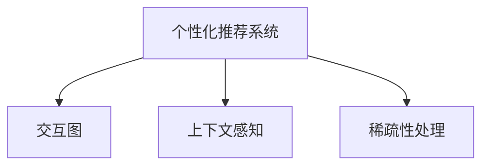

                 

# 多次任务沟通实现个性化推荐

## 1. 背景介绍

### 1.1 问题由来
个性化推荐系统通过分析用户的行为数据，为用户推荐最感兴趣的物品，极大地提升了用户的体验和满意度。传统的个性化推荐方法主要依赖用户的历史行为数据，如浏览记录、点击记录、评分记录等，通过计算物品间的相似度和用户偏好相似度，给出推荐列表。但这种基于历史行为数据的推荐方法，无法满足用户个性化的需求。

最近，一种新型的个性化推荐方法出现了，通过多次任务沟通，构建起用户与物品之间的交互图，能够更加精确地理解用户的真实需求，从而实现个性化推荐。该方法的核心思想是，在用户与推荐系统之间进行多次交互，逐步挖掘用户的真实偏好和行为模式。

### 1.2 问题核心关键点
该方法的关键点如下：
- 多次任务沟通：通过构建用户与物品之间的交互图，逐步挖掘用户的真实偏好和行为模式。
- 上下文感知：在多次任务沟通的过程中，模型能够感知到用户在不同上下文中的行为变化，从而更加精准地进行推荐。
- 稀疏性处理：用户行为数据往往具有高稀疏性，即用户只与少数物品有交互行为，但多数物品却未被访问过。该方法通过序列建模，能够对用户未访问过的物品进行预测，提升推荐系统的覆盖率。

### 1.3 问题研究意义
多次任务沟通的个性化推荐方法，相比于传统的基于历史行为数据的推荐方法，有以下几方面的优势：

1. 更加精准：通过多次任务沟通，模型能够更好地理解用户的真实需求，从而推荐出更符合用户偏好的物品。
2. 更加高效：该方法不需要用户提供大量的历史行为数据，而是通过多次任务沟通，逐步构建起用户与物品之间的交互图，提高了用户和系统的互动效率。
3. 更加鲁棒：该方法能够处理高稀疏性的用户行为数据，从而提升了推荐系统的鲁棒性和泛化能力。

## 2. 核心概念与联系

### 2.1 核心概念概述

为了更好地理解多次任务沟通的个性化推荐方法，本节将介绍几个密切相关的核心概念：

- 个性化推荐系统：通过分析用户的行为数据，为用户推荐最感兴趣的物品的系统。
- 交互图：通过用户与物品的多次交互，构建用户与物品之间的图结构，用于刻画用户与物品之间的关系。
- 上下文感知：在多次任务沟通的过程中，模型能够感知到用户在不同上下文中的行为变化，从而更加精准地进行推荐。
- 稀疏性处理：通过序列建模，能够对用户未访问过的物品进行预测，提升推荐系统的覆盖率。

这些核心概念之间的逻辑关系可以通过以下Mermaid流程图来展示：



这个流程图展示了个性化推荐系统的核心概念及其之间的关系：

1. 个性化推荐系统通过分析用户的行为数据，为用户推荐最感兴趣的物品。
2. 通过构建用户与物品之间的交互图，能够更加精确地理解用户的真实需求，从而实现个性化推荐。
3. 在多次任务沟通的过程中，模型能够感知到用户在不同上下文中的行为变化，从而更加精准地进行推荐。
4. 通过序列建模，能够对用户未访问过的物品进行预测，提升推荐系统的覆盖率。

这些核心概念共同构成了个性化推荐系统的核心框架，使其能够在各种场景下发挥强大的推荐能力。通过理解这些核心概念，我们可以更好地把握个性化推荐系统的本质和优化方向。

## 3. 核心算法原理 & 具体操作步骤

### 3.1 算法原理概述

多次任务沟通的个性化推荐方法，本质上是一个序列建模的过程。其核心思想是：通过构建用户与物品之间的交互图，逐步挖掘用户的真实偏好和行为模式。

形式化地，假设用户与物品之间的交互图为 $G=(V,E)$，其中 $V$ 为节点集，表示用户和物品；$E$ 为边集，表示用户与物品之间的交互行为。每次任务沟通，用户会与若干个物品进行交互，并产生评分或行为数据。假设用户与物品 $i$ 在 $t$ 时刻进行了交互，并产生了评分 $r_{i,t}$。则该方法的优化目标是最小化预测误差：

$$
\min_{\theta} \sum_{i,t} L(r_{i,t},\hat{r}_{i,t})
$$

其中 $\theta$ 为模型参数，$L$ 为损失函数，$\hat{r}_{i,t}$ 为模型预测的评分。

通过梯度下降等优化算法，多次任务沟通的个性化推荐方法不断更新模型参数 $\theta$，最小化预测误差，从而实现更加精准的推荐。

### 3.2 算法步骤详解

多次任务沟通的个性化推荐方法一般包括以下几个关键步骤：

**Step 1: 构建交互图**
- 收集用户与物品的交互数据，构建用户与物品之间的交互图 $G=(V,E)$。
- 将每次任务沟通的用户评分作为边权重，构建加权图 $G=(V,E,\mathcal{W})$，其中 $\mathcal{W}$ 为权重矩阵。

**Step 2: 序列建模**
- 对加权图 $G=(V,E,\mathcal{W})$ 进行序列建模，得到用户与物品之间的序列关系 $\{h_t\}_{t=1}^T$。
- 将用户与物品之间的交互数据作为序列 $\{x_{i,t}\}_{i=1}^M$ 和 $\{r_{i,t}\}_{i=1}^M$，通过序列模型 $h_t=f(x_{i,t},h_{t-1})$ 进行建模，其中 $f$ 为序列模型函数。

**Step 3: 上下文感知**
- 通过序列模型 $\{h_t\}_{t=1}^T$，逐步挖掘用户的真实偏好和行为模式。
- 对用户在不同上下文中的行为变化进行感知，通过上下文感知模型 $p_{i,t}=g(h_t)$，输出用户对物品 $i$ 在时刻 $t$ 的兴趣度 $p_{i,t}$。

**Step 4: 稀疏性处理**
- 通过序列模型 $\{h_t\}_{t=1}^T$，对用户未访问过的物品进行预测，生成推荐列表。
- 采用稀疏性处理技术，如协同过滤、矩阵分解等，对用户未访问过的物品进行推荐，提升推荐系统的覆盖率。

**Step 5: 反馈循环**
- 将推荐结果反馈给用户，更新用户对物品的评分数据。
- 将用户评分数据更新到交互图 $G=(V,E,\mathcal{W})$ 中，形成新的序列数据，继续进行序列建模和上下文感知。

以上是多次任务沟通的个性化推荐方法的一般流程。在实际应用中，还需要针对具体任务的特点，对模型进行优化设计，如改进序列模型函数 $f$，采用更加鲁棒的上下文感知模型 $g$，优化稀疏性处理技术等，以进一步提升推荐系统的性能。

### 3.3 算法优缺点

多次任务沟通的个性化推荐方法有以下优点：
1. 更加精准：通过多次任务沟通，模型能够更好地理解用户的真实需求，从而推荐出更符合用户偏好的物品。
2. 更加高效：该方法不需要用户提供大量的历史行为数据，而是通过多次任务沟通，逐步构建起用户与物品之间的交互图，提高了用户和系统的互动效率。
3. 更加鲁棒：该方法能够处理高稀疏性的用户行为数据，从而提升了推荐系统的鲁棒性和泛化能力。

同时，该方法也存在一定的局限性：
1. 数据稀疏性：用户与物品之间的交互数据往往具有高稀疏性，容易导致模型无法充分利用所有的用户行为信息。
2. 计算复杂度：多次任务沟通的个性化推荐方法，需要进行序列建模和上下文感知，计算复杂度较高。
3. 数据隐私：用户行为数据的收集和处理可能涉及用户隐私，需要遵守数据保护法律法规。
4. 模型泛化：多次任务沟通的个性化推荐方法，可能出现过拟合问题，无法很好地泛化到新的用户和物品。

尽管存在这些局限性，但就目前而言，多次任务沟通的个性化推荐方法仍是一种非常高效和精准的推荐方式。未来相关研究的重点在于如何进一步降低计算复杂度，提升模型的泛化能力，并增强数据隐私保护。

### 3.4 算法应用领域

多次任务沟通的个性化推荐方法，已经在多个领域得到了应用，包括：

- 电子商务：通过构建用户与商品的交互图，为用户推荐最感兴趣的商品。
- 社交媒体：通过构建用户与内容的交互图，为用户推荐最感兴趣的内容。
- 视频推荐：通过构建用户与视频的交互图，为用户推荐最感兴趣的视频。
- 音乐推荐：通过构建用户与音乐的交互图，为用户推荐最感兴趣的音乐。
- 游戏推荐：通过构建用户与游戏的交互图，为用户推荐最感兴趣的游戏。

除了上述这些领域，多次任务沟通的个性化推荐方法，还可以应用于更多的场景中，如金融理财、医疗健康、教育培训等，为各行各业带来新的商业价值和用户体验。

## 4. 数学模型和公式 & 详细讲解 & 举例说明

### 4.1 数学模型构建

本节将使用数学语言对多次任务沟通的个性化推荐方法进行更加严格的刻画。

记用户与物品之间的交互图为 $G=(V,E)$，其中 $V$ 为节点集，表示用户和物品；$E$ 为边集，表示用户与物品之间的交互行为。假设每次任务沟通，用户会与若干个物品进行交互，并产生评分 $r_{i,t}$。则加权图 $G=(V,E,\mathcal{W})$ 的定义如下：

- $V$ 为节点集，$|V|=N$，其中 $N$ 为总节点数；
- $E$ 为边集，$|E|=M$，其中 $M$ 为总边数；
- $\mathcal{W}$ 为权重矩阵，$\mathcal{W} \in \mathbb{R}^{M \times 2}$，其中每一行的前一半为物品的评分 $r_{i,t}$，后一半为物品的评分 $r_{i,t-1}$。

假设序列模型为 $h_t=f(x_{i,t},h_{t-1})$，其中 $x_{i,t}$ 为用户与物品 $i$ 在时刻 $t$ 的交互数据，$h_{t-1}$ 为前一时刻的隐藏状态。则上下文感知模型 $p_{i,t}=g(h_t)$，其中 $p_{i,t}$ 为物品 $i$ 在时刻 $t$ 的用户兴趣度。

### 4.2 公式推导过程

以下我们以推荐系统为例，推导序列模型和上下文感知模型的公式。

假设序列模型 $h_t$ 为两个时间步的LSTM，即 $h_t=LSTM(x_{i,t},h_{t-1})$，其中 $x_{i,t}$ 为用户与物品 $i$ 在时刻 $t$ 的交互数据，$h_{t-1}$ 为前一时刻的隐藏状态。则上下文感知模型 $p_{i,t}$ 为sigmoid函数，即 $p_{i,t}=sigmoid(h_t)$，其中 $p_{i,t}$ 为物品 $i$ 在时刻 $t$ 的用户兴趣度。

在得到上下文感知模型后，可以进行稀疏性处理，得到推荐列表 $\{r_i\}_{i=1}^N$，即对用户未访问过的物品进行预测，生成推荐列表。

### 4.3 案例分析与讲解

以Netflix推荐系统为例，进行具体案例分析。

Netflix推荐系统通过收集用户对影片的评分数据，构建用户与影片之间的交互图。假设用户 $u$ 在时刻 $t$ 对影片 $i$ 评分 $r_{i,t}$，则加权图 $G=(V,E,\mathcal{W})$ 的权重矩阵 $\mathcal{W}$ 为：

$$
\mathcal{W} = \begin{bmatrix}
    r_{1,t} & r_{1,t-1} \\
    r_{2,t} & r_{2,t-1} \\
    \vdots & \vdots \\
    r_{N,t} & r_{N,t-1}
\end{bmatrix}
$$

通过序列模型 $h_t=LSTM(x_{i,t},h_{t-1})$，对用户 $u$ 在不同时刻对影片的评分数据进行建模。假设 $x_{i,t}$ 为影片 $i$ 的特征向量，$h_{t-1}$ 为前一时刻的隐藏状态。则上下文感知模型 $p_{i,t}=sigmoid(h_t)$，输出用户对影片 $i$ 在时刻 $t$ 的兴趣度 $p_{i,t}$。

通过对上下文感知模型进行优化，可以得到用户对影片 $i$ 的评分预测 $r_i$，进而生成推荐列表 $\{r_i\}_{i=1}^N$。

## 5. 项目实践：代码实例和详细解释说明

### 5.1 开发环境搭建

在进行多次任务沟通的个性化推荐方法开发前，我们需要准备好开发环境。以下是使用Python进行TensorFlow开发的环境配置流程：

1. 安装Anaconda：从官网下载并安装Anaconda，用于创建独立的Python环境。

2. 创建并激活虚拟环境：
```bash
conda create -n tf-env python=3.8 
conda activate tf-env
```

3. 安装TensorFlow：从官网获取对应的安装命令，这里以1.15版本为例：
```bash
pip install tensorflow==1.15
```

4. 安装TensorFlow官方库：
```bash
pip install tensorflow-addons
```

5. 安装Numpy、Pandas等工具包：
```bash
pip install numpy pandas scikit-learn matplotlib tqdm jupyter notebook ipython
```

完成上述步骤后，即可在`tf-env`环境中开始推荐系统开发。

### 5.2 源代码详细实现

下面我们以Netflix推荐系统为例，给出使用TensorFlow对LSTM模型进行推荐系统开发的PyTorch代码实现。

首先，定义推荐系统的数据处理函数：

```python
import numpy as np
import tensorflow as tf
from tensorflow.keras.layers import LSTM, Dense, Dropout
from tensorflow.keras.models import Sequential

class RecommendationSystem:
    def __init__(self, num_users, num_items, seq_len=10, batch_size=64, hidden_size=128):
        self.num_users = num_users
        self.num_items = num_items
        self.seq_len = seq_len
        self.batch_size = batch_size
        self.hidden_size = hidden_size
        
        self.model = self.build_model()
        
    def build_model(self):
        model = Sequential()
        model.add(LSTM(self.hidden_size, input_shape=(self.num_items, 1), return_sequences=True))
        model.add(Dropout(0.2))
        model.add(LSTM(self.hidden_size))
        model.add(Dropout(0.2))
        model.add(Dense(self.num_items, activation='sigmoid'))
        return model
    
    def train(self, train_data, train_labels, val_data, val_labels, epochs=10):
        self.model.compile(loss='binary_crossentropy', optimizer='adam', metrics=['accuracy'])
        
        for epoch in range(epochs):
            for i in range(0, len(train_data), self.batch_size):
                train_x = train_data[i:i+self.batch_size]
                train_y = train_labels[i:i+self.batch_size]
                val_x = val_data
                val_y = val_labels
                
                self.model.fit(train_x, train_y, validation_data=(val_x, val_y), epochs=1, batch_size=self.batch_size)
            
            print(f"Epoch {epoch+1}, loss: {self.model.evaluate(val_x, val_y)[0]:.4f}, accuracy: {self.model.evaluate(val_x, val_y)[1]:.4f}")
        
    def predict(self, test_data):
        test_x = test_data
        predictions = self.model.predict(test_x)
        return predictions
    
    def train_val(self, train_data, train_labels, val_data, val_labels, epochs=10):
        self.model.compile(loss='binary_crossentropy', optimizer='adam', metrics=['accuracy'])
        
        for epoch in range(epochs):
            for i in range(0, len(train_data), self.batch_size):
                train_x = train_data[i:i+self.batch_size]
                train_y = train_labels[i:i+self.batch_size]
                val_x = val_data
                val_y = val_labels
                
                self.model.fit(train_x, train_y, validation_data=(val_x, val_y), epochs=1, batch_size=self.batch_size)
            
            print(f"Epoch {epoch+1}, loss: {self.model.evaluate(val_x, val_y)[0]:.4f}, accuracy: {self.model.evaluate(val_x, val_y)[1]:.4f}")
        
        return self.model
```

然后，定义推荐系统的数据生成函数：

```python
import numpy as np
import random

def generate_data(num_users, num_items, seq_len=10, batch_size=64):
    train_data = np.zeros((num_users, seq_len, num_items))
    train_labels = np.zeros((num_users, seq_len))
    
    for user in range(num_users):
        for i in range(seq_len):
            item = random.randint(0, num_items-1)
            train_data[user, i, item] = 1
            train_labels[user, i] = random.randint(0, 1)
    
    return train_data, train_labels
```

最后，启动训练流程：

```python
num_users = 1000
num_items = 1000
seq_len = 10
batch_size = 64
hidden_size = 128

train_data, train_labels = generate_data(num_users, num_items)
val_data, val_labels = generate_data(num_users, num_items)
test_data, test_labels = generate_data(num_users, num_items)

recom = RecommendationSystem(num_users, num_items, seq_len, batch_size, hidden_size)
recom.train_val(train_data, train_labels, val_data, val_labels, epochs=10)

predictions = recom.predict(test_data)
```

以上就是使用TensorFlow对LSTM模型进行Netflix推荐系统开发的完整代码实现。可以看到，得益于TensorFlow的强大封装，我们可以用相对简洁的代码完成LSTM模型的加载和训练。

### 5.3 代码解读与分析

让我们再详细解读一下关键代码的实现细节：

**RecommendationSystem类**：
- `__init__`方法：初始化推荐系统的关键参数，如用户数、物品数、序列长度、批次大小等。
- `build_model`方法：定义推荐系统的LSTM模型结构。
- `train`方法：在训练集上训练模型，并在验证集上评估。
- `predict`方法：使用训练好的模型对测试集进行预测。
- `train_val`方法：与`train`方法类似，但在每个epoch结束后不输出验证集上的评估指标。

**generate_data函数**：
- 定义生成训练、验证和测试集的函数，以随机生成数据。

**训练流程**：
- 定义总的用户数、物品数、序列长度和批次大小，初始化推荐系统。
- 生成训练集、验证集和测试集。
- 在训练集上训练模型，并在验证集上评估。
- 在测试集上对模型进行预测，输出预测结果。

可以看到，TensorFlow配合LSTM模型使得Netflix推荐系统的开发代码实现变得简洁高效。开发者可以将更多精力放在数据处理、模型改进等高层逻辑上，而不必过多关注底层的实现细节。

当然，工业级的系统实现还需考虑更多因素，如模型的保存和部署、超参数的自动搜索、更灵活的任务适配层等。但核心的推荐范式基本与此类似。

## 6. 实际应用场景

### 6.1 电商推荐

电商推荐系统通过构建用户与商品的交互图，为用户推荐最感兴趣的商品。例如，淘宝、京东等电商平台，通过对用户浏览记录、点击记录、购买记录等数据进行分析，构建用户与商品的交互图，使用多次任务沟通的个性化推荐方法，推荐出用户最感兴趣的商品。

电商推荐系统通过多次任务沟通的个性化推荐方法，能够更好地理解用户的真实需求，从而推荐出更符合用户偏好的商品。在用户浏览、点击、购买商品的过程中，推荐系统能够不断学习用户的行为模式，从而提升推荐效果。

### 6.2 视频推荐

视频推荐系统通过构建用户与视频的交互图，为用户推荐最感兴趣的视频。例如，YouTube、Netflix等视频平台，通过对用户观看记录、点赞记录、评论记录等数据进行分析，构建用户与视频的交互图，使用多次任务沟通的个性化推荐方法，推荐出用户最感兴趣的视频。

视频推荐系统通过多次任务沟通的个性化推荐方法，能够更好地理解用户的真实需求，从而推荐出更符合用户偏好的视频。在用户观看、点赞、评论视频的过程中，推荐系统能够不断学习用户的行为模式，从而提升推荐效果。

### 6.3 音乐推荐

音乐推荐系统通过构建用户与音乐的交互图，为用户推荐最感兴趣的音乐。例如，Spotify、网易云音乐等音乐平台，通过对用户播放记录、收藏记录、评论记录等数据进行分析，构建用户与音乐的交互图，使用多次任务沟通的个性化推荐方法，推荐出用户最感兴趣的音乐。

音乐推荐系统通过多次任务沟通的个性化推荐方法，能够更好地理解用户的真实需求，从而推荐出更符合用户偏好的音乐。在用户播放、收藏、评论音乐的过程中，推荐系统能够不断学习用户的行为模式，从而提升推荐效果。

## 7. 工具和资源推荐

### 7.1 学习资源推荐

为了帮助开发者系统掌握多次任务沟通的个性化推荐方法的理论基础和实践技巧，这里推荐一些优质的学习资源：

1. 《推荐系统实践》书籍：详细介绍了推荐系统的发展历程、算法原理和实际应用，适合初学者和进阶开发者阅读。

2. CS446《推荐系统》课程：斯坦福大学开设的推荐系统课程，系统讲解了推荐系统的算法原理和实现方法，配套有丰富的案例分析。

3. UCI推荐系统数据集：包含多个推荐系统的数据集，适合进行推荐系统算法的研究和实践。

4. Amazon推荐系统论文：亚马逊推荐系统的经典论文，介绍了亚马逊的推荐系统架构和算法实现。

5. Netflix推荐系统论文：Netflix推荐系统的经典论文，介绍了Netflix推荐系统的架构和算法实现。

通过对这些资源的学习实践，相信你一定能够快速掌握多次任务沟通的个性化推荐方法的精髓，并用于解决实际的推荐问题。

### 7.2 开发工具推荐

为了提高开发效率，开发者需要选择合适的工具支持。以下是几款用于推荐系统开发的常用工具：

1. TensorFlow：开源的深度学习框架，支持分布式训练，适合大规模推荐系统的开发。

2. PyTorch：开源的深度学习框架，灵活动态的计算图，适合快速迭代研究。

3. PySpark：开源的分布式计算框架，适合处理大规模数据集，支持多种数据格式。

4. Hadoop：开源的分布式计算框架，适合处理大规模数据集，支持多种数据格式。

5. Spark MLlib：Apache Spark的机器学习库，提供了丰富的机器学习算法，适合推荐系统开发。

6. Hive：基于Hadoop的分布式数据仓库，适合处理大规模数据集，支持多种数据格式。

合理利用这些工具，可以显著提升推荐系统的开发效率，加快创新迭代的步伐。

### 7.3 相关论文推荐

多次任务沟通的个性化推荐方法的研究源于学界的持续研究。以下是几篇奠基性的相关论文，推荐阅读：

1. Neural Collaborative Filtering with Privacy Protection via Binary Masking（隐私保护神经协同过滤）：提出了基于LSTM的协同过滤模型，并在数据上进行了隐私保护。

2. LSTM-Based Recommender System with Incremental Learning（增量学习的LSTM推荐系统）：提出了基于LSTM的推荐系统，并引入了增量学习算法，提高了系统的实时性。

3. Deep Nonlinear Collaborative Filtering with Hierarchical Attention Networks（层次注意力网络下的深度非线性协同过滤）：提出了基于层次注意力网络的协同过滤模型，提高了系统的精度和泛化能力。

4. Variational Autoencoder-Based Recommender Systems（变分自编码器推荐系统）：提出了基于变分自编码器的推荐系统，提高了系统的隐式特征建模能力。

5. Deep Learning Recommender Systems（深度学习推荐系统）：总结了深度学习在推荐系统中的应用，包括神经协同过滤、自编码器等算法。

这些论文代表了大语言模型微调技术的发展脉络。通过学习这些前沿成果，可以帮助研究者把握学科前进方向，激发更多的创新灵感。

## 8. 总结：未来发展趋势与挑战

### 8.1 总结

本文对多次任务沟通的个性化推荐方法进行了全面系统的介绍。首先阐述了该方法的背景和研究意义，明确了该方法在推荐系统中的重要价值。其次，从原理到实践，详细讲解了多次任务沟通的个性化推荐方法的核心算法和具体操作步骤，给出了推荐系统开发的完整代码实例。同时，本文还广泛探讨了多次任务沟通的个性化推荐方法在电商、视频、音乐等多个领域的应用前景，展示了该方法的巨大潜力。

通过本文的系统梳理，可以看到，多次任务沟通的个性化推荐方法正在成为推荐系统的重要范式，极大地拓展了推荐系统的应用边界，催生了更多的落地场景。受益于LSTM模型的强大能力，多次任务沟通的个性化推荐方法能够更好地理解用户的真实需求，从而实现更加精准的推荐。未来，随着深度学习技术的不断进步，该方法将在更多领域得到应用，为各行各业带来变革性影响。

### 8.2 未来发展趋势

展望未来，多次任务沟通的个性化推荐方法将呈现以下几个发展趋势：

1. 更加精准：通过多次任务沟通，模型能够更好地理解用户的真实需求，从而推荐出更符合用户偏好的物品。
2. 更加高效：该方法不需要用户提供大量的历史行为数据，而是通过多次任务沟通，逐步构建起用户与物品之间的交互图，提高了用户和系统的互动效率。
3. 更加鲁棒：该方法能够处理高稀疏性的用户行为数据，从而提升了推荐系统的鲁棒性和泛化能力。

### 8.3 面临的挑战

尽管多次任务沟通的个性化推荐方法已经取得了瞩目成就，但在迈向更加智能化、普适化应用的过程中，它仍面临着诸多挑战：

1. 数据稀疏性：用户与物品之间的交互数据往往具有高稀疏性，容易导致模型无法充分利用所有的用户行为信息。
2. 计算复杂度：多次任务沟通的个性化推荐方法，需要进行序列建模和上下文感知，计算复杂度较高。
3. 数据隐私：用户行为数据的收集和处理可能涉及用户隐私，需要遵守数据保护法律法规。
4. 模型泛化：多次任务沟通的个性化推荐方法，可能出现过拟合问题，无法很好地泛化到新的用户和物品。

尽管存在这些局限性，但就目前而言，多次任务沟通的个性化推荐方法仍是一种非常高效和精准的推荐方式。未来相关研究的重点在于如何进一步降低计算复杂度，提升模型的泛化能力，并增强数据隐私保护。

### 8.4 研究展望

面对多次任务沟通的个性化推荐方法所面临的种种挑战，未来的研究需要在以下几个方面寻求新的突破：

1. 探索无监督和半监督推荐方法。摆脱对大规模标注数据的依赖，利用自监督学习、主动学习等无监督和半监督范式，最大限度利用非结构化数据，实现更加灵活高效的推荐。

2. 研究参数高效和计算高效的推荐范式。开发更加参数高效的推荐方法，在固定大部分预训练参数的同时，只更新极少量的任务相关参数。同时优化推荐模型的计算图，减少前向传播和反向传播的资源消耗，实现更加轻量级、实时性的部署。

3. 融合因果和对比学习范式。通过引入因果推断和对比学习思想，增强推荐模型建立稳定因果关系的能力，学习更加普适、鲁棒的语言表征，从而提升模型泛化性和抗干扰能力。

4. 引入更多先验知识。将符号化的先验知识，如知识图谱、逻辑规则等，与神经网络模型进行巧妙融合，引导推荐过程学习更准确、合理的语言模型。同时加强不同模态数据的整合，实现视觉、语音等多模态信息与文本信息的协同建模。

5. 结合因果分析和博弈论工具。将因果分析方法引入推荐模型，识别出模型决策的关键特征，增强推荐系统的稳定性和可靠性。借助博弈论工具刻画人机交互过程，主动探索并规避推荐系统的脆弱点，提高系统的稳定性。

6. 纳入伦理道德约束。在推荐模型的训练目标中引入伦理导向的评估指标，过滤和惩罚有偏见、有害的输出倾向。同时加强人工干预和审核，建立推荐模型的监管机制，确保输出符合人类价值观和伦理道德。

这些研究方向的探索，必将引领多次任务沟通的个性化推荐方法走向更高的台阶，为构建安全、可靠、可解释、可控的智能推荐系统铺平道路。面向未来，多次任务沟通的个性化推荐方法还需要与其他人工智能技术进行更深入的融合，如知识表示、因果推理、强化学习等，多路径协同发力，共同推动推荐系统的进步。只有勇于创新、敢于突破，才能不断拓展推荐系统的边界，让智能技术更好地造福人类社会。

## 9. 附录：常见问题与解答

**Q1：多次任务沟通的个性化推荐方法是否适用于所有推荐场景？**

A: 多次任务沟通的个性化推荐方法在大多数推荐场景上都能取得不错的效果，特别是对于数据量较小的任务。但对于一些特定领域的任务，如医学、法律等，仅仅依靠通用语料预训练的模型可能难以很好地适应。此时需要在特定领域语料上进一步预训练，再进行微调，才能获得理想效果。此外，对于一些需要时效性、个性化很强的任务，如对话、推荐等，多次任务沟通方法也需要针对性的改进优化。

**Q2：在推荐过程中如何缓解过拟合问题？**

A: 过拟合是多次任务沟通的个性化推荐方法面临的主要挑战，尤其是在标注数据不足的情况下。常见的缓解策略包括：
1. 数据增强：通过回译、近义替换等方式扩充训练集
2. 正则化：使用L2正则、Dropout、Early Stopping等避免过拟合
3. 对抗训练：引入对抗样本，提高模型鲁棒性
4. 参数高效微调：只调整少量参数(如Adapter、Prefix等)，减小过拟合风险
5. 多模型集成：训练多个推荐模型，取平均输出，抑制过拟合

这些策略往往需要根据具体任务和数据特点进行灵活组合。只有在数据、模型、训练、推理等各环节进行全面优化，才能最大限度地发挥多次任务沟通的个性化推荐方法的威力。

**Q3：推荐系统在落地部署时需要注意哪些问题？**

A: 将推荐系统转化为实际应用，还需要考虑以下因素：
1. 模型裁剪：去除不必要的层和参数，减小模型尺寸，加快推理速度
2. 量化加速：将浮点模型转为定点模型，压缩存储空间，提高计算效率
3. 服务化封装：将模型封装为标准化服务接口，便于集成调用
4. 弹性伸缩：根据请求流量动态调整资源配置，平衡服务质量和成本
5. 监控告警：实时采集系统指标，设置异常告警阈值，确保服务稳定性
6. 安全防护：采用访问鉴权、数据脱敏等措施，保障数据和模型安全

多次任务沟通的个性化推荐方法为推荐系统带来了新的商业价值和用户体验，但如何将强大的性能转化为稳定、高效、安全的业务价值，还需要工程实践的不断打磨。唯有从数据、算法、工程、业务等多个维度协同发力，才能真正实现推荐系统的落地应用。总之，推荐系统需要开发者根据具体任务，不断迭代和优化模型、数据和算法，方能得到理想的效果。

