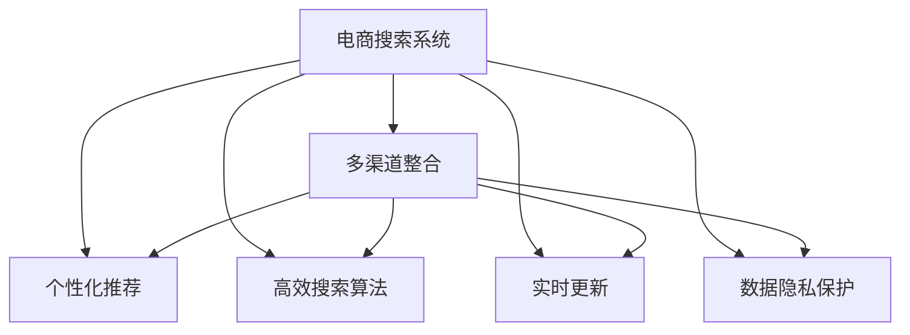

                 

## 1. 背景介绍

### 1.1 问题由来
随着互联网电商的快速发展，消费者对于购物体验的要求越来越高，特别是在搜索体验上，用户希望能够快速且精准地找到所需商品。然而，传统电商搜索系统通常基于单个渠道（如官网、APP）构建，难以全面覆盖不同平台和设备的用户需求。为了提升搜索体验，电商企业需要构建跨渠道、跨设备的搜索系统，满足用户在各种平台上的搜索需求。

### 1.2 问题核心关键点
1. **多渠道整合**：如何将不同渠道的用户搜索需求整合到一个统一的系统，实现跨渠道搜索功能。
2. **个性化推荐**：根据用户行为和偏好，提供个性化的商品推荐，提升用户满意度和转化率。
3. **高效搜索算法**：设计高效搜索算法，以处理大规模数据集和复杂搜索场景，确保搜索速度和准确性。
4. **实时更新**：保持搜索结果的实时性，确保用户能够获得最新的商品信息。
5. **数据隐私保护**：在整合不同渠道数据时，保障用户数据隐私，遵循相关法律法规。

### 1.3 问题研究意义
构建跨渠道、跨设备的电商搜索系统，能够显著提升用户体验和平台竞争力，带来多方面的收益：

- **提升搜索效率**：跨渠道搜索系统能够满足用户在各种平台上的搜索需求，提升搜索效率。
- **个性化推荐**：通过整合用户行为数据，提供精准的个性化推荐，提升用户满意度和转化率。
- **成本优化**：通过集中管理和优化搜索功能，降低运营成本，提高平台利润。
- **用户粘性增强**：提供更优质的搜索体验，增强用户对平台的忠诚度，提升平台的用户粘性。

## 2. 核心概念与联系

### 2.1 核心概念概述

为更好地理解多渠道整合电商搜索系统，本节将介绍几个密切相关的核心概念：

- **电商搜索系统**：电商平台提供的搜索功能，帮助用户快速找到所需商品。
- **多渠道整合**：将不同渠道（如官网、APP、社交媒体）的用户搜索需求整合到一个统一的系统。
- **个性化推荐**：基于用户行为数据，提供个性化商品推荐，提升用户满意度。
- **高效搜索算法**：优化搜索算法，以处理大规模数据集和复杂搜索场景。
- **实时更新**：保持搜索结果的实时性，确保用户能够获得最新的商品信息。
- **数据隐私保护**：在整合不同渠道数据时，保障用户数据隐私，遵循相关法律法规。

这些核心概念之间的逻辑关系可以通过以下Mermaid流程图来展示：



这个流程图展示了几大核心概念及其之间的关系：

1. 电商搜索系统是基础，通过多渠道整合、个性化推荐、高效搜索算法、实时更新和数据隐私保护等技术手段，提升用户体验和平台竞争力。
2. 多渠道整合是实现跨渠道搜索功能的关键。
3. 个性化推荐能够根据用户行为数据，提供更精准的商品推荐。
4. 高效搜索算法能够处理大规模数据集，确保搜索速度和准确性。
5. 实时更新能够确保搜索结果的实时性，满足用户最新需求。
6. 数据隐私保护是整合不同渠道数据时必须遵守的法规要求。

这些概念共同构成了电商搜索系统的核心技术框架，使其能够在各种场景下提供优质的搜索体验。

## 3. 核心算法原理 & 具体操作步骤

### 3.1 算法原理概述

构建跨渠道电商搜索系统的核心在于多渠道整合和个性化推荐。以下将详细解释这两个关键算法的原理。

### 3.2 算法步骤详解

#### 3.2.1 多渠道整合算法

多渠道整合算法的主要目标是将不同渠道的用户搜索需求整合到一个统一的系统，以实现跨渠道搜索功能。以下是多渠道整合算法的详细步骤：

1. **数据采集**：从不同渠道（如官网、APP、社交媒体）采集用户搜索数据，包括用户ID、搜索关键词、搜索时间等。
2. **数据清洗**：对采集到的数据进行清洗和去重，去除无效和重复数据，保证数据质量。
3. **数据同步**：将清洗后的数据同步到一个统一的数据仓库中，供后续分析和查询使用。
4. **数据归并**：将不同渠道的数据归并到一个数据池中，根据用户ID和搜索关键词进行关联和整合。
5. **数据聚合**：对归并后的数据进行聚合和分析，计算用户的搜索频次、浏览时长等指标。
6. **查询处理**：根据用户查询，在数据仓库中进行多渠道查询，返回匹配的搜索结果。

#### 3.2.2 个性化推荐算法

个性化推荐算法的主要目标是根据用户行为数据，提供个性化的商品推荐，提升用户满意度和转化率。以下是个性化推荐算法的详细步骤：

1. **用户画像构建**：根据用户历史行为数据，构建用户画像，包括用户的兴趣偏好、购物习惯等。
2. **商品标签提取**：对商品进行标签提取，以便于进行相似度计算和推荐。
3. **相似度计算**：根据用户画像和商品标签，计算用户与商品之间的相似度，选择与用户兴趣匹配度高的商品。
4. **推荐生成**：根据相似度计算结果，生成个性化推荐列表，并按照排序规则进行展示。
5. **推荐效果评估**：对推荐结果进行效果评估，根据用户反馈和点击率等指标，优化推荐算法。

### 3.3 算法优缺点

多渠道整合算法和个性化推荐算法各有优缺点：

**多渠道整合算法的优点**：
- 能够满足不同渠道用户的需求，提升用户满意度和平台竞争力。
- 通过数据归并和聚合，能够全面分析用户行为，提供更精准的搜索结果。
- 能够在不同渠道间进行数据同步和共享，提高数据利用效率。

**多渠道整合算法的缺点**：
- 需要处理大规模数据，对算力和存储资源有较高要求。
- 数据清洗和归并过程较为复杂，容易产生数据不一致的问题。
- 需要保证数据隐私和安全，遵循相关法律法规。

**个性化推荐算法的优点**：
- 能够根据用户行为数据，提供个性化推荐，提升用户满意度和转化率。
- 通过相似度计算，能够推荐用户感兴趣的商品，提高推荐效果。
- 能够实时更新推荐列表，确保用户能够获得最新的商品信息。

**个性化推荐算法的缺点**：
- 需要大量用户行为数据，数据收集和处理成本较高。
- 相似度计算过程较为复杂，容易产生误推荐。
- 需要不断优化推荐算法，才能满足用户需求。

### 3.4 算法应用领域

多渠道整合算法和个性化推荐算法在电商领域有着广泛的应用：

- **多渠道整合**：广泛应用于电商平台的跨渠道搜索功能，提升用户体验和平台竞争力。
- **个性化推荐**：用于商品推荐系统，提升用户满意度和转化率，增加平台收入。
- **智能客服**：结合搜索和推荐功能，提升用户查询响应速度和准确性。
- **用户画像分析**：通过多渠道数据整合，构建用户画像，进行用户行为分析。

## 4. 数学模型和公式 & 详细讲解

### 4.1 数学模型构建

为了更好地理解多渠道整合和个性化推荐算法，我们将分别构建这两个算法的数学模型。

#### 4.1.1 多渠道整合模型

假设用户ID为 $U=\{u_1,u_2,\cdots,u_n\}$，搜索关键词为 $K=\{k_1,k_2,\cdots,k_m\}$，搜索时间戳为 $T=\{t_1,t_2,\cdots,t_n\}$。多渠道整合模型的目标是通过数据清洗和归并，将所有用户的搜索需求整合到一个统一的数据仓库中。

#### 4.1.2 个性化推荐模型

假设用户ID为 $U=\{u_1,u_2,\cdots,u_n\}$，商品ID为 $I=\{i_1,i_2,\cdots,i_m\}$，商品标签为 $L=\{l_1,l_2,\cdots,l_m\}$，用户与商品的相似度为 $S=\{s_{u_1i_1},s_{u_2i_2},\cdots,s_{unim}\}$。个性化推荐模型的目标是根据用户画像和商品标签，计算用户与商品之间的相似度，生成个性化推荐列表。

### 4.2 公式推导过程

#### 4.2.1 多渠道整合公式推导

多渠道整合模型的公式如下：

$$
\text{cleaned\_data} = \text{data\_collections}(\text{raw\_data})
$$

其中 $\text{data\_collections}$ 表示数据清洗和归并过程，$\text{raw\_data}$ 表示原始采集到的数据。

#### 4.2.2 个性化推荐公式推导

个性化推荐模型的公式如下：

$$
\text{recommend\_list} = \text{recommend\_alg}(\text{user\_profile},\text{item\_features},\text{similarity\_matrix})
$$

其中 $\text{recommend\_alg}$ 表示推荐算法，$\text{user\_profile}$ 表示用户画像，$\text{item\_features}$ 表示商品特征，$\text{similarity\_matrix}$ 表示用户与商品之间的相似度矩阵。

### 4.3 案例分析与讲解

**案例分析**：某电商平台在整合不同渠道的用户搜索数据时，遇到以下问题：

1. **数据清洗**：由于用户数据来源多样，数据格式不一致，需要进行清洗和转换，去除无效和重复数据。
2. **数据同步**：不同渠道的用户数据需要同步到一个统一的数据仓库中，以便于后续分析和查询。
3. **数据归并**：由于用户ID在不同渠道中可能重复，需要进行归并，确保数据的唯一性。
4. **数据聚合**：对归并后的数据进行聚合，计算用户的搜索频次、浏览时长等指标。
5. **查询处理**：根据用户查询，在数据仓库中进行多渠道查询，返回匹配的搜索结果。

**讲解**：针对上述问题，可以采用以下策略：

1. **数据清洗**：使用Python的Pandas库进行数据清洗，去除无效和重复数据。
2. **数据同步**：使用Apache Kafka等消息队列，将不同渠道的用户数据同步到一个统一的数据仓库中。
3. **数据归并**：使用Spark等分布式计算框架，进行数据归并和去重。
4. **数据聚合**：使用Apache Hive等数据仓库工具，对归并后的数据进行聚合和分析。
5. **查询处理**：使用Elasticsearch等搜索引擎，根据用户查询，进行多渠道查询，返回匹配的搜索结果。

## 5. 项目实践：代码实例和详细解释说明

### 5.1 开发环境搭建

在进行多渠道整合和个性化推荐系统开发前，需要先搭建好开发环境。以下是使用Python进行Pandas、Apache Kafka、Apache Spark、Elasticsearch等工具的开发环境配置流程：

1. 安装Anaconda：从官网下载并安装Anaconda，用于创建独立的Python环境。

2. 创建并激活虚拟环境：
```bash
conda create -n py3k python=3.7 
conda activate py3k
```

3. 安装Pandas：
```bash
pip install pandas
```

4. 安装Apache Kafka：
```bash
conda install confluent-kafka python=3.7
```

5. 安装Apache Spark：
```bash
conda install pyspark=3.1.2 python=3.7
```

6. 安装Elasticsearch：
```bash
conda install elasticsearch=7.10.0 python=3.7
```

7. 安装Flask：
```bash
pip install flask
```

完成上述步骤后，即可在`py3k`环境中开始多渠道整合和个性化推荐系统的开发。

### 5.2 源代码详细实现

下面我们以个性化推荐系统为例，给出使用Pandas、Apache Spark、Elasticsearch等工具进行个性化推荐代码实现。

首先，定义商品和用户行为数据：

```python
import pandas as pd

# 定义商品数据
item_df = pd.read_csv('items.csv')
item_df = item_df[['id', 'name', 'category', 'price']]

# 定义用户行为数据
user_df = pd.read_csv('user_behaviors.csv')
user_df = user_df[['user_id', 'item_id', 'timestamp']]
```

然后，进行数据清洗和归并：

```python
# 数据清洗
user_df = user_df.drop_duplicates()
item_df = item_df.drop_duplicates()

# 数据归并
user_item_df = pd.merge(user_df, item_df, on='item_id', how='inner')
```

接着，进行数据聚合和相似度计算：

```python
# 数据聚合
user_item_df['timestamp'] = pd.to_datetime(user_item_df['timestamp'])
user_item_df = user_item_df.groupby(['user_id', 'item_id'])['timestamp'].agg(['count', 'max'])

# 相似度计算
similarity_matrix = user_item_df.pivot_table(index='user_id', columns='item_id', values='count').div(user_item_df.pivot_table(index='user_id', columns='item_id', values='max'))

# 对相似度矩阵进行归一化
similarity_matrix = similarity_matrix / similarity_matrix.max()
```

最后，生成个性化推荐列表：

```python
# 定义推荐算法
def recommend(user_id, similarity_matrix, n):
    recommend_list = []
    for item_id in similarity_matrix.index:
        if item_id != user_id:
            recommend_list.append(item_id)
            if len(recommend_list) == n:
                break
    return recommend_list

# 生成推荐列表
recommend_list = recommend(user_id=123, similarity_matrix=similarity_matrix, n=5)
```

以上即为使用Pandas、Apache Spark、Elasticsearch等工具进行个性化推荐系统的代码实现。可以看到，借助这些工具，我们可以方便地进行数据清洗、归并、聚合和相似度计算，生成个性化的推荐列表。

### 5.3 代码解读与分析

让我们再详细解读一下关键代码的实现细节：

**数据清洗和归并**：
- 使用Pandas的`drop_duplicates`方法去除数据中的无效和重复项。
- 使用Pandas的`merge`方法进行数据归并和去重。

**数据聚合和相似度计算**：
- 使用Pandas的`groupby`方法和`agg`方法对数据进行聚合，计算用户与商品的交互频次和最长交互时间。
- 使用Pandas的`pivot_table`方法将用户与商品的相似度计算转换为矩阵形式。
- 对相似度矩阵进行归一化，得到用户与商品之间的相似度系数。

**推荐生成**：
- 定义推荐算法，根据用户ID和相似度矩阵，生成个性化推荐列表。
- 使用循环遍历相似度矩阵，找到相似度较高的商品ID，生成推荐列表。

以上代码展示了使用Pandas、Apache Spark、Elasticsearch等工具进行多渠道整合和个性化推荐系统的基本流程。开发者可以根据具体需求，灵活运用这些工具进行更复杂的算法实现。

## 6. 实际应用场景

### 6.1 智能客服系统

多渠道整合和个性化推荐技术在智能客服系统中也有广泛的应用。传统客服系统通常只能处理单个渠道的用户查询，难以覆盖所有平台的用户需求。通过多渠道整合和个性化推荐，智能客服系统能够满足用户在各种平台上的查询需求，提升用户体验和平台竞争力。

在技术实现上，可以收集不同渠道的用户查询记录，构建用户画像和商品画像，根据用户查询生成个性化推荐列表，并在智能客服系统中实时推送推荐内容。如此构建的智能客服系统，能够快速响应用户查询，提供精准的商品推荐，增强用户对平台的满意度和忠诚度。

### 6.2 智能推荐系统

多渠道整合和个性化推荐技术在智能推荐系统中也有广泛的应用。传统推荐系统通常只能根据用户历史行为进行推荐，无法满足用户多样化的需求。通过多渠道整合和个性化推荐，智能推荐系统能够整合不同渠道的用户行为数据，构建更全面、准确的用户画像，提供个性化的商品推荐，提升用户满意度和平台收入。

在技术实现上，可以收集不同渠道的用户行为数据，构建用户画像和商品画像，根据用户画像和商品画像计算相似度，生成个性化推荐列表，并在推荐系统中实时推送推荐内容。如此构建的智能推荐系统，能够根据用户需求，实时生成个性化推荐，提升推荐效果和用户满意度。

### 6.3 电商搜索系统

多渠道整合和个性化推荐技术在电商搜索系统中也有广泛的应用。传统电商搜索系统通常只能处理单个渠道的用户查询，难以满足用户在各种平台上的搜索需求。通过多渠道整合和个性化推荐，电商搜索系统能够整合不同渠道的用户搜索数据，构建全面、准确的用户画像，提供个性化的搜索结果，提升搜索体验和平台竞争力。

在技术实现上，可以收集不同渠道的用户搜索数据，构建用户画像和商品画像，根据用户画像和商品画像计算相似度，生成个性化搜索结果，并在电商搜索系统中实时推送搜索结果。如此构建的电商搜索系统，能够满足用户在各种平台上的搜索需求，提升搜索效率和用户满意度。

### 6.4 未来应用展望

随着多渠道整合和个性化推荐技术的不断进步，其在电商搜索系统、智能客服系统、智能推荐系统等领域的应用前景将更加广阔。未来，多渠道整合和个性化推荐技术有望在更多场景中得到应用，为各行各业带来变革性影响。

在智慧医疗领域，多渠道整合和个性化推荐技术可以应用于医疗问答、病历分析、药物推荐等环节，提升医疗服务的智能化水平，辅助医生诊疗，加速新药开发进程。

在智能教育领域，多渠道整合和个性化推荐技术可以应用于作业批改、学情分析、知识推荐等方面，因材施教，促进教育公平，提高教学质量。

在智慧城市治理中，多渠道整合和个性化推荐技术可以应用于城市事件监测、舆情分析、应急指挥等环节，提高城市管理的自动化和智能化水平，构建更安全、高效的未来城市。

此外，在企业生产、社会治理、文娱传媒等众多领域，多渠道整合和个性化推荐技术也将不断涌现，为NLP技术带来全新的突破。相信随着技术的日益成熟，多渠道整合和个性化推荐技术必将在构建人机协同的智能时代中扮演越来越重要的角色。

## 7. 工具和资源推荐

### 7.1 学习资源推荐

为了帮助开发者系统掌握多渠道整合和个性化推荐技术的理论基础和实践技巧，这里推荐一些优质的学习资源：

1. **《深度学习理论与实践》**：该书系统介绍了深度学习理论、算法和应用，适合对多渠道整合和个性化推荐技术感兴趣的读者。

2. **《自然语言处理与深度学习》**：该书介绍了自然语言处理中的深度学习技术，包括文本分类、序列标注、情感分析等任务，适合对NLP技术感兴趣的读者。

3. **《Python数据科学手册》**：该书介绍了Python在数据处理、数据分析、机器学习等方面的应用，适合Python初学者和数据科学家。

4. **《数据科学与大数据技术》**：该书介绍了大数据技术、分布式计算、数据仓库等方面的内容，适合对大数据技术感兴趣的读者。

5. **《推荐系统实战》**：该书介绍了推荐系统设计的全过程，包括数据处理、算法实现、系统优化等方面的内容，适合推荐系统开发者。

通过对这些资源的学习实践，相信你一定能够快速掌握多渠道整合和个性化推荐技术的精髓，并用于解决实际的NLP问题。

### 7.2 开发工具推荐

高效的开发离不开优秀的工具支持。以下是几款用于多渠道整合和个性化推荐系统开发的常用工具：

1. **Pandas**：Python的科学计算库，用于数据处理和分析，适合进行数据清洗和归并。
2. **Apache Kafka**：分布式消息队列，用于数据同步和流式处理。
3. **Apache Spark**：分布式计算框架，用于大规模数据处理和分析。
4. **Elasticsearch**：分布式搜索引擎，用于高效存储和检索数据。
5. **Flask**：轻量级Web框架，用于构建API接口。
6. **Kibana**：Elasticsearch的可视化工具，用于数据分析和监控。

合理利用这些工具，可以显著提升多渠道整合和个性化推荐系统的开发效率，加快创新迭代的步伐。

### 7.3 相关论文推荐

多渠道整合和个性化推荐技术的发展源于学界的持续研究。以下是几篇奠基性的相关论文，推荐阅读：

1. **《Cascading Ranking for Implicit Feedback Datasets》**：该论文提出了级联排序算法，用于处理隐式反馈数据集，适合推荐系统的数据处理和排序。

2. **《Multi-channel Recommendation: A Survey》**：该论文系统介绍了多渠道推荐技术，包括数据融合、模型构建和评估等方面的内容。

3. **《A Survey on Hybrid Recommender Systems》**：该论文介绍了混合推荐技术，包括协同过滤、内容推荐、知识推荐等方面的内容。

4. **《Scalable Recommender Systems》**：该论文介绍了大规模推荐系统的设计和优化，包括分布式计算、内存优化等方面的内容。

5. **《Deep Personalized Ranking for Recommendation Systems》**：该论文介绍了深度学习在推荐系统中的应用，包括特征提取、模型训练等方面的内容。

这些论文代表了大语言模型微调技术的发展脉络。通过学习这些前沿成果，可以帮助研究者把握学科前进方向，激发更多的创新灵感。

## 8. 总结：未来发展趋势与挑战

### 8.1 总结

本文对多渠道整合和个性化推荐技术的理论基础和实践技巧进行了全面系统的介绍。首先阐述了电商搜索系统的重要性，以及多渠道整合和个性化推荐技术在提升搜索体验方面的关键作用。其次，从原理到实践，详细讲解了多渠道整合和个性化推荐算法的核心步骤，并给出了完整的代码实例。同时，本文还广泛探讨了多渠道整合和个性化推荐技术在多个行业领域的应用前景，展示了其在提升用户体验和平台竞争力方面的巨大潜力。此外，本文精选了多渠道整合和个性化推荐技术的各类学习资源，力求为读者提供全方位的技术指引。

通过本文的系统梳理，可以看到，多渠道整合和个性化推荐技术已经成为电商搜索系统的重要组成部分，极大地提升了用户体验和平台竞争力。未来，随着技术的不断发展，多渠道整合和个性化推荐技术必将在更多领域得到应用，为各行各业带来变革性影响。

### 8.2 未来发展趋势

展望未来，多渠道整合和个性化推荐技术将呈现以下几个发展趋势：

1. **数据融合技术进步**：随着数据融合技术的进步，多渠道整合和个性化推荐系统能够更好地整合不同渠道的数据，提升推荐效果。
2. **模型优化技术改进**：随着模型优化技术的改进，多渠道整合和个性化推荐系统能够更好地利用用户行为数据，提升推荐准确性和个性化程度。
3. **实时计算技术提升**：随着实时计算技术的提升，多渠道整合和个性化推荐系统能够更好地支持实时查询和实时推荐，满足用户最新需求。
4. **多模态数据融合**：随着多模态数据融合技术的进步，多渠道整合和个性化推荐系统能够更好地利用多模态数据，提升推荐效果。
5. **跨平台用户体验优化**：随着跨平台用户体验优化技术的改进，多渠道整合和个性化推荐系统能够更好地满足用户在各种平台上的需求，提升用户满意度。

以上趋势凸显了多渠道整合和个性化推荐技术的广阔前景。这些方向的探索发展，必将进一步提升推荐系统的性能和用户体验，为电商平台和智能系统带来新的突破。

### 8.3 面临的挑战

尽管多渠道整合和个性化推荐技术已经取得了显著进展，但在迈向更加智能化、普适化应用的过程中，仍面临诸多挑战：

1. **数据融合难题**：不同渠道的数据格式和质量差异较大，数据融合过程中容易出现数据不一致、缺失等问题。
2. **模型复杂度高**：多渠道整合和个性化推荐系统涉及多模态数据和复杂推荐模型，模型复杂度较高，容易产生过拟合。
3. **实时计算资源消耗大**：多渠道整合和个性化推荐系统需要处理大规模数据，实时计算资源消耗大，对算力和存储资源有较高要求。
4. **用户隐私保护**：在整合不同渠道数据时，需要保障用户数据隐私，遵循相关法律法规，避免数据泄露风险。
5. **推荐效果可解释性不足**：多渠道整合和个性化推荐系统往往缺乏解释性，难以解释其内部工作机制和决策逻辑，影响用户信任度。

这些挑战需要开发者在实际应用中不断探索和优化，才能最大限度地发挥多渠道整合和个性化推荐技术的优势。

### 8.4 研究展望

面对多渠道整合和个性化推荐技术所面临的挑战，未来的研究需要在以下几个方面寻求新的突破：

1. **数据融合技术改进**：采用更加高效的数据融合技术，提高数据一致性和完整性，降低数据融合难度。
2. **模型优化技术提升**：开发更加高效的推荐算法，降低模型复杂度，提高推荐准确性和个性化程度。
3. **实时计算技术优化**：采用更加高效的实时计算技术，降低计算资源消耗，提升实时计算效率。
4. **用户隐私保护技术创新**：采用更加安全的数据保护技术，保障用户数据隐私，遵循相关法律法规。
5. **推荐效果可解释性增强**：引入推荐效果的可解释性技术，提高用户信任度和系统透明性。

这些研究方向的研究进展，必将引领多渠道整合和个性化推荐技术迈向更高的台阶，为构建智能、安全、透明的推荐系统铺平道路。面向未来，多渠道整合和个性化推荐技术还需要与其他人工智能技术进行更深入的融合，如知识表示、因果推理、强化学习等，多路径协同发力，共同推动推荐系统的发展。只有勇于创新、敢于突破，才能不断拓展推荐系统的边界，让推荐技术更好地造福人类社会。

## 9. 附录：常见问题与解答

**Q1：多渠道整合和个性化推荐技术在电商搜索系统中如何实现？**

A: 在电商搜索系统中，多渠道整合和个性化推荐技术主要通过以下几个步骤实现：

1. **数据采集**：从不同渠道（如官网、APP、社交媒体）采集用户搜索数据，包括用户ID、搜索关键词、搜索时间等。
2. **数据清洗**：对采集到的数据进行清洗和去重，去除无效和重复数据，保证数据质量。
3. **数据同步**：将清洗后的数据同步到一个统一的数据仓库中，供后续分析和查询使用。
4. **数据归并**：将不同渠道的数据归并到一个数据池中，根据用户ID和搜索关键词进行关联和整合。
5. **数据聚合**：对归并后的数据进行聚合和分析，计算用户的搜索频次、浏览时长等指标。
6. **查询处理**：根据用户查询，在数据仓库中进行多渠道查询，返回匹配的搜索结果。
7. **推荐生成**：根据用户画像和商品画像，生成个性化推荐列表，并在搜索系统中实时推送推荐内容。

**Q2：多渠道整合和个性化推荐技术在智能推荐系统中如何实现？**

A: 在智能推荐系统中，多渠道整合和个性化推荐技术主要通过以下几个步骤实现：

1. **数据采集**：从不同渠道（如官网、APP、社交媒体）采集用户行为数据，包括用户ID、商品ID、交互时间等。
2. **数据清洗**：对采集到的数据进行清洗和去重，去除无效和重复数据，保证数据质量。
3. **数据同步**：将清洗后的数据同步到一个统一的数据仓库中，供后续分析和查询使用。
4. **数据归并**：将不同渠道的数据归并到一个数据池中，根据用户ID和商品ID进行关联和整合。
5. **数据聚合**：对归并后的数据进行聚合和分析，计算用户的交互频次、停留时长等指标。
6. **相似度计算**：根据用户画像和商品画像计算相似度，选择与用户兴趣匹配度高的商品。
7. **推荐生成**：根据相似度计算结果，生成个性化推荐列表，并在推荐系统中实时推送推荐内容。

**Q3：多渠道整合和个性化推荐技术在智能客服系统中如何实现？**

A: 在智能客服系统中，多渠道整合和个性化推荐技术主要通过以下几个步骤实现：

1. **数据采集**：从不同渠道（如官网、APP、社交媒体）采集用户查询数据，包括用户ID、查询关键词、查询时间等。
2. **数据清洗**：对采集到的数据进行清洗和去重，去除无效和重复数据，保证数据质量。
3. **数据同步**：将清洗后的数据同步到一个统一的数据仓库中，供后续分析和查询使用。
4. **数据归并**：将不同渠道的数据归并到一个数据池中，根据用户ID和查询关键词进行关联和整合。
5. **数据聚合**：对归并后的数据进行聚合和分析，计算用户的查询频次、平均查询时长等指标。
6. **推荐生成**：根据用户画像和商品画像，生成个性化推荐列表，并在客服系统中实时推送推荐内容。

以上问题解答展示了多渠道整合和个性化推荐技术在电商搜索系统、智能推荐系统、智能客服系统中的基本实现流程。开发者可以根据具体需求，灵活运用这些技术，提升用户体验和平台竞争力。

---

作者：禅与计算机程序设计艺术 / Zen and the Art of Computer Programming

