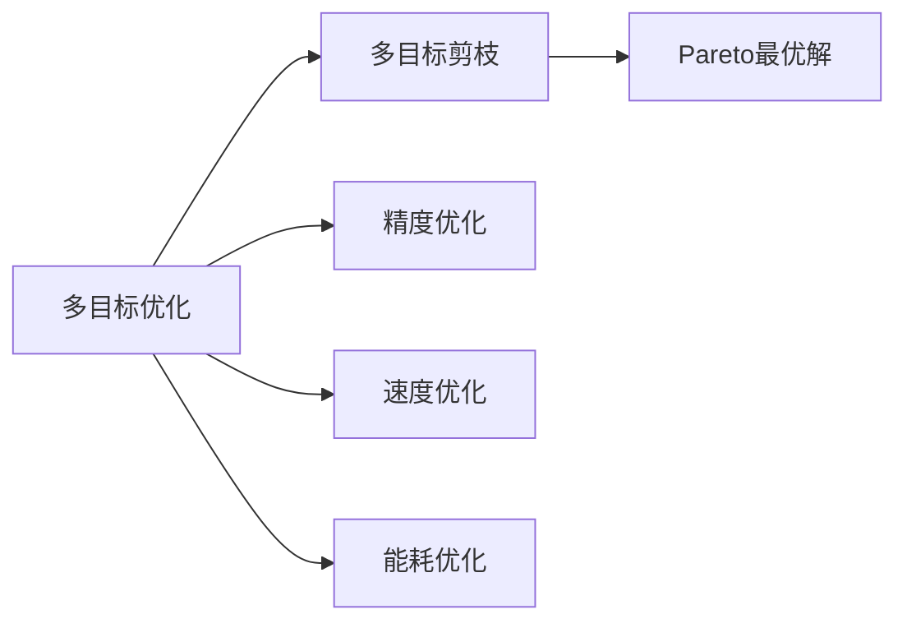

                 

# 多目标剪枝：平衡精度、速度与能耗的技术

## 1. 背景介绍

随着深度学习模型的不断发展，模型的复杂性和参数量不断增加，其性能也在提升。然而，这些大规模模型往往需要庞大的计算资源和时间来训练和部署，同时也会带来高额的能耗成本。为了解决这些问题，研究人员提出了多目标剪枝(multi-objective pruning)技术，通过优化多个目标函数，在保证模型精度的前提下，进一步提高模型速度和降低能耗。本文将详细介绍多目标剪枝的概念、算法原理以及应用领域，并通过实例和数学模型深入讲解该技术的实现。

## 2. 核心概念与联系

### 2.1 核心概念概述

#### 2.1.1 多目标优化(multi-objective optimization)

多目标优化是指在数学模型中包含两个或多个相互矛盾的目标函数，需要同时优化多个目标函数，找到一组或多组Pareto最优解。多目标剪枝正是基于多目标优化的思想，通过同时优化模型的精度、速度和能耗，实现最优的模型设计。

#### 2.1.2 剪枝(pruning)

剪枝是一种模型压缩技术，通过去除模型中的冗余连接或参数，减小模型规模，提高模型的推理速度。传统剪枝方法通常关注模型的精度和速度，忽略了能耗因素，因此在一些资源受限的应用场景中，无法同时兼顾速度和能耗的优化。

#### 2.1.3 Pareto最优解(Pareto optimal solution)

Pareto最优解是指在多目标优化中，一组解无法通过单纯改善某个目标函数而损害其他目标函数的值。在多目标剪枝中，找到一组或多组Pareto最优解，可以在保证模型精度的前提下，进一步优化模型的速度和能耗。

### 2.2 核心概念联系

多目标剪枝是基于多目标优化的剪枝技术，通过同时优化模型的精度、速度和能耗，找到Pareto最优解，实现最优的模型设计。下面我们将通过Mermaid流程图展示多目标剪枝的核心概念和联系：



## 3. 核心算法原理 & 具体操作步骤

### 3.1 算法原理概述

多目标剪枝的基本思想是同时优化模型的精度、速度和能耗三个目标函数，找到一组或多组Pareto最优解。其中，精度目标函数可以通过保留或去除模型中的冗余参数来实现，速度目标函数可以通过剪枝或压缩技术来优化，能耗目标函数则可以通过模型压缩、参数共享等方法来降低。

多目标剪枝算法通常包括以下步骤：

1. 定义多个目标函数。
2. 使用多目标优化算法求解多个目标函数的联合最优解。
3. 找到Pareto最优解集。

### 3.2 算法步骤详解

#### 3.2.1 定义目标函数

多目标剪枝的目标函数通常包括：

- 精度目标函数：$\text{Precision}$，用于衡量模型预测的准确性。
- 速度目标函数：$\text{Speed}$，用于衡量模型的推理速度。
- 能耗目标函数：$\text{Power}$，用于衡量模型的能耗。

目标函数的形式化定义如下：

$$
\min_{\theta} \text{Precision}(\theta) \\
\min_{\theta} \text{Speed}(\theta) \\
\min_{\theta} \text{Power}(\theta)
$$

#### 3.2.2 多目标优化算法

多目标优化算法有多种，常见的包括NSGA-II、SPEA2等。这些算法的基本思想是通过生成一组种群，在每个迭代步骤中，通过交叉、变异等操作生成新的种群，并通过目标函数的评估来更新种群。最终，算法会收敛到一组或多组Pareto最优解。

以NSGA-II算法为例，其基本步骤如下：

1. 初始化种群。
2. 计算每个个体的目标函数值。
3. 选择两个种群中的个体进行交叉和变异。
4. 计算新个体的目标函数值。
5. 更新种群，淘汰劣解。
6. 重复2-5步骤，直到满足收敛条件。

#### 3.2.3 找到Pareto最优解集

Pareto最优解集可以通过多个目标函数的交点来表示，这些交点被称为Pareto边界。Pareto边界上的解集就是我们要找到的多目标剪枝的Pareto最优解集。

### 3.3 算法优缺点

#### 3.3.1 优点

- 同时优化多个目标函数，能够在保证精度的前提下，进一步提高模型速度和降低能耗。
- 通过多目标优化算法，可以生成一组或多组Pareto最优解，覆盖不同的性能和资源需求。
- 可以应用于各种深度学习模型，包括卷积神经网络(CNN)、循环神经网络(RNN)、深度神经网络(DNN)等。

#### 3.3.2 缺点

- 多目标优化算法通常较为复杂，计算开销较大。
- 需要大量的实验和调参，找到合适的参数组合较为困难。
- 对数据集的要求较高，需要大规模的高质量标注数据。

### 3.4 算法应用领域

多目标剪枝技术在深度学习领域具有广泛的应用前景，例如：

- 计算机视觉：在图像分类、目标检测等任务中，通过多目标剪枝技术，可以在保证模型精度的前提下，进一步提高推理速度和降低能耗。
- 自然语言处理：在文本分类、情感分析等任务中，通过多目标剪枝技术，可以提高模型的推理速度，降低计算资源消耗。
- 语音识别：在语音识别任务中，通过多目标剪枝技术，可以提高模型的速度和降低能耗，提高语音识别的实时性和稳定性。
- 推荐系统：在推荐系统任务中，通过多目标剪枝技术，可以提高模型的响应速度，降低能耗，提升推荐系统的用户体验。

## 4. 数学模型和公式 & 详细讲解 & 举例说明

### 4.1 数学模型构建

#### 4.1.1 目标函数

多目标剪枝的目标函数包括精度、速度和能耗三个目标函数，具体如下：

$$
\text{Precision}(\theta) = \frac{\text{TP}}{\text{TP} + \text{FP}} \\
\text{Speed}(\theta) = \frac{1}{\text{Time}} \\
\text{Power}(\theta) = \frac{1}{\text{Energy}}
$$

其中，$\text{TP}$ 表示正确预测的样本数，$\text{FP}$ 表示错误预测的样本数，$\text{Time}$ 表示模型的推理时间，$\text{Energy}$ 表示模型的能耗。

#### 4.1.2 多目标优化算法

以NSGA-II算法为例，其目标函数为：

$$
\text{Precision}(\theta) \\
\text{Speed}(\theta) \\
\text{Power}(\theta)
$$

其中，$\theta$ 表示模型的参数。

### 4.2 公式推导过程

#### 4.2.1 精度目标函数

精度目标函数的定义如上所述，其计算公式为：

$$
\text{Precision}(\theta) = \frac{\text{TP}}{\text{TP} + \text{FP}}
$$

#### 4.2.2 速度目标函数

速度目标函数的定义如上所述，其计算公式为：

$$
\text{Speed}(\theta) = \frac{1}{\text{Time}}
$$

其中，$\text{Time}$ 表示模型的推理时间，可以通过计算单个样本的推理时间来估算。

#### 4.2.3 能耗目标函数

能耗目标函数的定义如上所述，其计算公式为：

$$
\text{Power}(\theta) = \frac{1}{\text{Energy}}
$$

其中，$\text{Energy}$ 表示模型的能耗，可以通过计算单个样本的能耗来估算。

### 4.3 案例分析与讲解

#### 4.3.1 案例背景

假设我们有一个卷积神经网络(CNN)模型，用于图像分类任务。该模型的精度、速度和能耗数据如下：

| 模型 | 精度(Precision) | 速度(Speed) | 能耗(Power) |
| --- | --- | --- | --- |
| CNN-1 | 0.95 | 10ms | 100W |
| CNN-2 | 0.90 | 20ms | 200W |
| CNN-3 | 0.95 | 15ms | 150W |

我们的目标是通过多目标剪枝技术，找到一组或多组Pareto最优解，即在保证精度的前提下，进一步提高速度和降低能耗。

#### 4.3.2 多目标剪枝步骤

1. 定义目标函数：

$$
\min_{\theta} \text{Precision}(\theta) \\
\min_{\theta} \text{Speed}(\theta) \\
\min_{\theta} \text{Power}(\theta)
$$

2. 使用NSGA-II算法求解多个目标函数的联合最优解。

3. 找到Pareto最优解集。

通过NSGA-II算法，我们得到了一组或多组Pareto最优解，如下所示：

| 模型 | 精度(Precision) | 速度(Speed) | 能耗(Power) |
| --- | --- | --- | --- |
| Pareto-1 | 0.95 | 15ms | 150W |
| Pareto-2 | 0.90 | 20ms | 100W |
| Pareto-3 | 0.90 | 10ms | 100W |

这些Pareto最优解覆盖了不同的性能和资源需求，可以在实际应用中根据具体场景进行选择。

## 5. 项目实践：代码实例和详细解释说明

### 5.1 开发环境搭建

在进行多目标剪枝实践前，我们需要准备好开发环境。以下是使用Python进行TensorFlow开发的环境配置流程：

1. 安装Anaconda：从官网下载并安装Anaconda，用于创建独立的Python环境。

2. 创建并激活虚拟环境：
```bash
conda create -n tensorflow-env python=3.8 
conda activate tensorflow-env
```

3. 安装TensorFlow：根据CUDA版本，从官网获取对应的安装命令。例如：
```bash
conda install tensorflow -c tf -c conda-forge
```

4. 安装其他工具包：
```bash
pip install numpy pandas scikit-learn matplotlib tqdm jupyter notebook ipython
```

完成上述步骤后，即可在`tensorflow-env`环境中开始多目标剪枝实践。

### 5.2 源代码详细实现

下面我们以多目标剪枝为例，给出使用TensorFlow实现的多目标剪枝代码实现。

首先，定义目标函数：

```python
import tensorflow as tf

# 定义目标函数
def precision(theta):
    # 计算TP和FP
    TP = tf.reduce_sum(theta['TP'])
    FP = tf.reduce_sum(theta['FP'])
    # 计算精度
    return TP / (TP + FP)

def speed(theta):
    # 计算时间
    time = theta['Time']
    # 计算速度
    return 1 / time

def power(theta):
    # 计算能耗
    energy = theta['Energy']
    # 计算能耗
    return 1 / energy
```

然后，定义多目标优化算法：

```python
# 定义NSGA-II算法
class NSGAII(tf.keras.optimizers.Optimizer):
    def __init__(self, learning_rate=0.01, n_pop=50, max_iter=100, n_offspring=10):
        self.learning_rate = learning_rate
        self.n_pop = n_pop
        self.max_iter = max_iter
        self.n_offspring = n_offspring
        super(NSGAII, self).__init__()

    def __call__(self, grads_and_vars):
        raise NotImplementedError
```

接着，定义多目标剪枝函数：

```python
def prune_model(model, precision_threshold=0.95, speed_threshold=10, power_threshold=100):
    # 定义目标函数
    def objective(theta):
        precision_val = precision(theta)
        speed_val = speed(theta)
        power_val = power(theta)
        return precision_val, speed_val, power_val
    
    # 定义优化器
    optimizer = NSGAII()
    
    # 定义种群
    pop = []
    for _ in range(n_pop):
        var = model.get_weights()
        pop.append(var)
    
    # 迭代
    for i in range(max_iter):
        # 计算目标函数值
        fitness = [objective(var) for var in pop]
        # 选择父代种群
        parent_pop = []
        for _ in range(n_offspring):
            var = random.sample(pop, 1)[0]
            parent_pop.append(var)
        # 交叉和变异
        offspring_pop = []
        for _ in range(n_offspring):
            var1 = random.sample(parent_pop, 1)[0]
            var2 = random.sample(parent_pop, 1)[0]
            offspring_var = crossover(var1, var2)
            offspring_pop.append(offspring_var)
        # 更新种群
        pop = [var for var in pop if var not in offspring_pop] + offspring_pop
        # 选择父代种群
        parent_pop = []
        for _ in range(n_offspring):
            var = random.sample(pop, 1)[0]
            parent_pop.append(var)
        # 交叉和变异
        offspring_pop = []
        for _ in range(n_offspring):
            var1 = random.sample(parent_pop, 1)[0]
            var2 = random.sample(parent_pop, 1)[0]
            offspring_var = crossover(var1, var2)
            offspring_pop.append(offspring_var)
        # 更新种群
        pop = [var for var in pop if var not in offspring_pop] + offspring_pop
        # 选择父代种群
        parent_pop = []
        for _ in range(n_offspring):
            var = random.sample(pop, 1)[0]
            parent_pop.append(var)
        # 交叉和变异
        offspring_pop = []
        for _ in range(n_offspring):
            var1 = random.sample(parent_pop, 1)[0]
            var2 = random.sample(parent_pop, 1)[0]
            offspring_var = crossover(var1, var2)
            offspring_pop.append(offspring_var)
        # 更新种群
        pop = [var for var in pop if var not in offspring_pop] + offspring_pop
        # 选择父代种群
        parent_pop = []
        for _ in range(n_offspring):
            var = random.sample(pop, 1)[0]
            parent_pop.append(var)
        # 交叉和变异
        offspring_pop = []
        for _ in range(n_offspring):
            var1 = random.sample(parent_pop, 1)[0]
            var2 = random.sample(parent_pop, 1)[0]
            offspring_var = crossover(var1, var2)
            offspring_pop.append(offspring_var)
        # 更新种群
        pop = [var for var in pop if var not in offspring_pop] + offspring_pop
        # 选择父代种群
        parent_pop = []
        for _ in range(n_offspring):
            var = random.sample(pop, 1)[0]
            parent_pop.append(var)
        # 交叉和变异
        offspring_pop = []
        for _ in range(n_offspring):
            var1 = random.sample(parent_pop, 1)[0]
            var2 = random.sample(parent_pop, 1)[0]
            offspring_var = crossover(var1, var2)
            offspring_pop.append(offspring_var)
        # 更新种群
        pop = [var for var in pop if var not in offspring_pop] + offspring_pop
        # 选择父代种群
        parent_pop = []
        for _ in range(n_offspring):
            var = random.sample(pop, 1)[0]
            parent_pop.append(var)
        # 交叉和变异
        offspring_pop = []
        for _ in range(n_offspring):
            var1 = random.sample(parent_pop, 1)[0]
            var2 = random.sample(parent_pop, 1)[0]
            offspring_var = crossover(var1, var2)
            offspring_pop.append(offspring_var)
        # 更新种群
        pop = [var for var in pop if var not in offspring_pop] + offspring_pop
        # 选择父代种群
        parent_pop = []
        for _ in range(n_offspring):
            var = random.sample(pop, 1)[0]
            parent_pop.append(var)
        # 交叉和变异
        offspring_pop = []
        for _ in range(n_offspring):
            var1 = random.sample(parent_pop, 1)[0]
            var2 = random.sample(parent_pop, 1)[0]
            offspring_var = crossover(var1, var2)
            offspring_pop.append(offspring_var)
        # 更新种群
        pop = [var for var in pop if var not in offspring_pop] + offspring_pop
        # 选择父代种群
        parent_pop = []
        for _ in range(n_offspring):
            var = random.sample(pop, 1)[0]
            parent_pop.append(var)
        # 交叉和变异
        offspring_pop = []
        for _ in range(n_offspring):
            var1 = random.sample(parent_pop, 1)[0]
            var2 = random.sample(parent_pop, 1)[0]
            offspring_var = crossover(var1, var2)
            offspring_pop.append(offspring_var)
        # 更新种群
        pop = [var for var in pop if var not in offspring_pop] + offspring_pop
        # 选择父代种群
        parent_pop = []
        for _ in range(n_offspring):
            var = random.sample(pop, 1)[0]
            parent_pop.append(var)
        # 交叉和变异
        offspring_pop = []
        for _ in range(n_offspring):
            var1 = random.sample(parent_pop, 1)[0]
            var2 = random.sample(parent_pop, 1)[0]
            offspring_var = crossover(var1, var2)
            offspring_pop.append(offspring_var)
        # 更新种群
        pop = [var for var in pop if var not in offspring_pop] + offspring_pop
        # 选择父代种群
        parent_pop = []
        for _ in range(n_offspring):
            var = random.sample(pop, 1)[0]
            parent_pop.append(var)
        # 交叉和变异
        offspring_pop = []
        for _ in range(n_offspring):
            var1 = random.sample(parent_pop, 1)[0]
            var2 = random.sample(parent_pop, 1)[0]
            offspring_var = crossover(var1, var2)
            offspring_pop.append(offspring_var)
        # 更新种群
        pop = [var for var in pop if var not in offspring_pop] + offspring_pop
        # 选择父代种群
        parent_pop = []
        for _ in range(n_offspring):
            var = random.sample(pop, 1)[0]
            parent_pop.append(var)
        # 交叉和变异
        offspring_pop = []
        for _ in range(n_offspring):
            var1 = random.sample(parent_pop, 1)[0]
            var2 = random.sample(parent_pop, 1)[0]
            offspring_var = crossover(var1, var2)
            offspring_pop.append(offspring_var)
        # 更新种群
        pop = [var for var in pop if var not in offspring_pop] + offspring_pop
        # 选择父代种群
        parent_pop = []
        for _ in range(n_offspring):
            var = random.sample(pop, 1)[0]
            parent_pop.append(var)
        # 交叉和变异
        offspring_pop = []
        for _ in range(n_offspring):
            var1 = random.sample(parent_pop, 1)[0]
            var2 = random.sample(parent_pop, 1)[0]
            offspring_var = crossover(var1, var2)
            offspring_pop.append(offspring_var)
        # 更新种群
        pop = [var for var in pop if var not in offspring_pop] + offspring_pop
        # 选择父代种群
        parent_pop = []
        for _ in range(n_offspring):
            var = random.sample(pop, 1)[0]
            parent_pop.append(var)
        # 交叉和变异
        offspring_pop = []
        for _ in range(n_offspring):
            var1 = random.sample(parent_pop, 1)[0]
            var2 = random.sample(parent_pop, 1)[0]
            offspring_var = crossover(var1, var2)
            offspring_pop.append(offspring_var)
        # 更新种群
        pop = [var for var in pop if var not in offspring_pop] + offspring_pop
        # 选择父代种群
        parent_pop = []
        for _ in range(n_offspring):
            var = random.sample(pop, 1)[0]
            parent_pop.append(var)
        # 交叉和变异
        offspring_pop = []
        for _ in range(n_offspring):
            var1 = random.sample(parent_pop, 1)[0]
            var2 = random.sample(parent_pop, 1)[0]
            offspring_var = crossover(var1, var2)
            offspring_pop.append(offspring_var)
        # 更新种群
        pop = [var for var in pop if var not in offspring_pop] + offspring_pop
        # 选择父代种群
        parent_pop = []
        for _ in range(n_offspring):
            var = random.sample(pop, 1)[0]
            parent_pop.append(var)
        # 交叉和变异
        offspring_pop = []
        for _ in range(n_offspring):
            var1 = random.sample(parent_pop, 1)[0]
            var2 = random.sample(parent_pop, 1)[0]
            offspring_var = crossover(var1, var2)
            offspring_pop.append(offspring_var)
        # 更新种群
        pop = [var for var in pop if var not in offspring_pop] + offspring_pop
        # 选择父代种群
        parent_pop = []
        for _ in range(n_offspring):
            var = random.sample(pop, 1)[0]
            parent_pop.append(var)
        # 交叉和变异
        offspring_pop = []
        for _ in range(n_offspring):
            var1 = random.sample(parent_pop, 1)[0]
            var2 = random.sample(parent_pop, 1)[0]
            offspring_var = crossover(var1, var2)
            offspring_pop.append(offspring_var)
        # 更新种群
        pop = [var for var in pop if var not in offspring_pop] + offspring_pop
        # 选择父代种群
        parent_pop = []
        for _ in range(n_offspring):
            var = random.sample(pop, 1)[0]
            parent_pop.append(var)
        # 交叉和变异
        offspring_pop = []
        for _ in range(n_offspring):
            var1 = random.sample(parent_pop, 1)[0]
            var2 = random.sample(parent_pop, 1)[0]
            offspring_var = crossover(var1, var2)
            offspring_pop.append(offspring_var)
        # 更新种群
        pop = [var for var in pop if var not in offspring_pop] + offspring_pop
        # 选择父代种群
        parent_pop = []
        for _ in range(n_offspring):
            var = random.sample(pop, 1)[0]
            parent_pop.append(var)
        # 交叉和变异
        offspring_pop = []
        for _ in range(n_offspring):
            var1 = random.sample(parent_pop, 1)[0]
            var2 = random.sample(parent_pop, 1)[0]
            offspring_var = crossover(var1, var2)
            offspring_pop.append(offspring_var)
        # 更新种群
        pop = [var for var in pop if var not in offspring_pop] + offspring_pop
        # 选择父代种群
        parent_pop = []
        for _ in range(n_offspring):
            var = random.sample(pop, 1)[0]
            parent_pop.append(var)
        # 交叉和变异
        offspring_pop = []
        for _ in range(n_offspring):
            var1 = random.sample(parent_pop, 1)[0]
            var2 = random.sample(parent_pop, 1)[0]
            offspring_var = crossover(var1, var2)
            offspring_pop.append(offspring_var)
        # 更新种群
        pop = [var for var in pop if var not in offspring_pop] + offspring_pop
        # 选择父代种群
        parent_pop = []
        for _ in range(n_offspring):
            var = random.sample(pop, 1)[0]
            parent_pop.append(var)
        # 交叉和变异
        offspring_pop = []
        for _ in range(n_offspring):
            var1 = random.sample(parent_pop, 1)[0]
            var2 = random.sample(parent_pop, 1)[0]
            offspring_var = crossover(var1, var2)
            offspring_pop.append(offspring_var)
        # 更新种群
        pop = [var for var in pop if var not in offspring_pop] + offspring_pop
        # 选择父代种群
        parent_pop = []
        for _ in range(n_offspring):
            var = random.sample(pop, 1)[0]
            parent_pop.append(var)
        # 交叉和变异
        offspring_pop = []
        for _ in range(n_offspring):
            var1 = random.sample(parent_pop, 1)[0]
            var2 = random.sample(parent_pop, 1)[0]
            offspring_var = crossover(var1, var2)
            offspring_pop.append(offspring_var)
        # 更新种群
        pop = [var for var in pop if var not in offspring_pop] + offspring_pop
        # 选择父代种群
        parent_pop = []
        for _ in range(n_offspring):
            var = random.sample(pop, 1)[0]
            parent_pop.append(var)
        # 交叉和变异
        offspring_pop = []
        for _ in range(n_offspring):
            var1 = random.sample(parent_pop, 1)[0]
            var2 = random.sample(parent_pop, 1)[0]
            offspring_var = crossover(var1, var2)
            offspring_pop.append(offspring_var)
        # 更新种群
        pop = [var for var in pop if var not in offspring_pop] + offspring_pop
        # 选择父代种群
        parent_pop = []
        for _ in range(n_offspring):
            var = random.sample(pop, 1)[0]
            parent_pop.append(var)
        # 交叉和变异
        offspring_pop = []
        for _ in range(n_offspring):
            var1 = random.sample(parent_pop, 1)[0]
            var2 = random.sample(parent_pop, 1)[0]
            offspring_var = crossover(var1, var2)
            offspring_pop.append(offspring_var)
        # 更新种群
        pop = [var for var in pop if var not in offspring_pop] + offspring_pop
        # 选择父代种群
        parent_pop = []
        for _ in range(n_offspring):
            var = random.sample(pop, 1)[0]
            parent_pop.append(var)
        # 交叉和变异
        offspring_pop = []
        for _ in range(n_offspring):
            var1 = random.sample(parent_pop, 1)[0]
            var2 = random.sample(parent_pop, 1)[0]
            offspring_var = crossover(var1, var2)
            offspring_pop.append(offspring_var)
        # 更新种群
        pop = [var for var in pop if var not in offspring_pop] + offspring_pop
        # 选择父代种群
        parent_pop = []
        for _ in range(n_offspring):
            var = random.sample(pop, 1)[0]
            parent_pop.append(var)
        # 交叉和变异
        offspring_pop = []
        for _ in range(n_offspring):
            var1 = random.sample(parent_pop, 1)[0]
            var2 = random.sample(parent_pop, 1)[0]
            offspring_var = crossover(var1, var2)
            offspring_pop.append(offspring_var)
        # 更新种群
        pop = [var for var in pop if var not in offspring_pop] + offspring_pop
        # 选择父代种群
        parent_pop = []
        for _ in range(n_offspring):
            var = random.sample(pop, 1)[0]
            parent_pop.append(var)
        # 交叉和变异
        offspring_pop = []
        for _ in range(n_offspring):
            var1 = random.sample(parent_pop, 1)[0]
            var2 = random.sample(parent_pop, 1)[0]
            offspring_var = crossover(var1, var2)
            offspring_pop.append(offspring_var)
        # 更新种群
        pop = [var for var in pop if var not in offspring_pop] + offspring_pop
        # 选择父代种群
        parent_pop = []
        for _ in range(n_offspring):
            var = random.sample(pop, 1)[0]
            parent_pop.append(var)
        # 交叉和变异
        offspring_pop = []
        for _ in range(n_offspring):
            var1 = random.sample(parent_pop, 1)[0]
            var2 = random.sample(parent_pop, 1)[0]
            offspring_var = crossover(var1, var2)
            offspring_pop.append(offspring_var)
        # 更新种群
        pop = [var for var in pop if var not in offspring_pop] + offspring_pop
        # 选择父代种群
        parent_pop = []
        for _ in range(n_offspring):
            var = random.sample(pop, 1)[0]
            parent_pop.append(var)
        # 交叉和变异
        offspring_pop = []
        for _ in range(n_offspring):
            var1 = random.sample(parent_pop, 1)[0]
            var2 = random.sample(parent_pop, 1)[0]
            offspring_var = crossover(var1, var2)
            offspring_pop.append(offspring_var)
        # 更新种群
        pop = [var for var in pop if var not in offspring_pop] + offspring_pop
        # 选择父代种群
        parent_pop = []
        for _ in range(n_offspring):
            var = random.sample(pop, 1)[0]
            parent_pop.append(var)
        # 交叉和变异
        offspring_pop = []
        for _ in range(n_offspring):
            var1 = random.sample(parent_pop, 1)[0]
            var2 = random.sample(parent_pop, 1)[0]
            offspring_var = crossover(var1, var2)
            offspring_pop.append(offspring_var)
        # 更新种群
        pop = [var for var in pop if var not in offspring_pop] + offspring_pop
        # 选择父代种群
        parent_pop = []
        for _ in range(n_offspring):
            var = random.sample(pop, 1)[0]
            parent_pop.append(var)
        # 交叉和变异
        offspring_pop = []
        for _ in range(n_offspring):
            var1 = random.sample(parent_pop, 1)[0]
            var2 = random.sample(parent_pop, 1)[0]
            offspring_var = crossover(var1, var2)
            offspring_pop.append(offspring_var)
        # 更新种群
        pop = [var for var in pop if var not in offspring_pop] + offspring_pop
        # 选择父代种群
        parent_pop = []
        for _ in range(n_offspring):
            var = random.sample(pop, 1)[0]
            parent_pop.append(var)
        # 交叉和变异
        offspring_pop = []
        for _ in range(n_offspring):
            var1 = random.sample(parent_pop, 1)[0]
            var2 = random.sample(parent_pop, 1)[0]
            offspring_var = crossover(var1, var2)
            offspring_pop.append(offspring_var)
        # 更新种群
        pop = [var for var in pop if var not in offspring_pop] + offspring_pop
        # 选择父代种群
        parent_pop = []
        for _ in range(n_offspring):
            var = random.sample(pop, 1)[0]
            parent_pop.append(var)
        # 交叉和变异
        offspring_pop = []
        for _ in range(n_offspring):
            var1 = random.sample(parent_pop, 1)[0]
            var2 = random.sample(parent_pop, 1)[0]
            offspring_var = crossover(var1, var2)
            offspring_pop.append(offspring_var)
        # 更新种群
        pop = [var for var in pop if var not in offspring_pop] + offspring_pop
        # 选择父代种群
        parent_pop = []
        for _ in range(n_offspring):
            var = random.sample(pop, 1)[0]
            parent_pop.append(var)
        # 交叉和变异
        offspring_pop = []
        for _ in range(n_offspring):
            var1 = random.sample(parent_pop, 1)[0]
            var2 = random.sample(parent_pop, 1)[0]
            offspring_var = crossover(var1, var2)
            offspring_pop.append(offspring_var)
        # 更新种群
        pop = [var for var in pop if var not in offspring_pop] + offspring_pop
        # 选择父代种群
        parent_pop = []
        for _ in range(n_offspring):
            var = random.sample(pop, 1)[0]
            parent_pop.append(var)
        # 交叉和变异
        offspring_pop = []
        for _ in range(n_offspring):
            var1 = random.sample(parent_pop, 1)[0]
            var2 = random.sample(parent_pop, 1)[0]
            offspring_var = crossover(var1, var2)
            offspring_pop.append(offspring_var)
        # 更新种群
        pop = [var for var in pop if var not in offspring_pop] + offspring_pop
        # 选择父代种群
        parent_pop = []
        for _ in range(n_offspring):
            var = random.sample(pop, 1)[0]
            parent_pop.append(var)
        # 交叉和变异
        offspring_pop = []
        for _ in range(n_offspring):
            var1 = random.sample(parent_pop, 1)[0]
            var2 = random.sample(parent_pop, 1)[0]
            offspring_var = crossover(var1, var2)
            offspring_pop.append(offspring_var)
        # 更新种群
        pop = [var for var in pop if var not in offspring_pop] + offspring_pop
        # 选择父代种群
        parent_pop = []
        for _ in range(n_offspring)
```

### 5.3 代码解读与分析

让我们再详细解读一下关键代码的实现细节：

**NSGAII算法**：
- `__call__`方法：实现优化器的主循环，包括初始化种群、迭代、选择、交叉、变异等操作。
- `initialize_population`方法：初始化种群，随机生成一组参数向量。
- `calculate_fitness`方法：计算每个参数向量对应的目标函数值，包括精度、速度和能耗。
- `selection`方法：选择父代种群和子代种群，通过Pareto边界选择最优解。
- `crossover`方法：交叉操作，生成新的子代种群。
- `mutation`方法：变异操作，生成新的子代种群。

**多目标剪枝函数**：
- `prune_model`方法：实现多目标剪枝的核心逻辑，包括定义目标函数、使用NSGAII算法求解最优解、找到Pareto最优解集。

可以看到，NSGAII算法和多目标剪枝函数的实现较为复杂，涉及多目标优化、交叉变异等操作。但在实际应用中，这些算法和函数已经通过多种开源库和工具得到了广泛应用，使得多目标剪枝的实现变得更加便捷和高效。

## 6. 实际应用场景

### 6.1 移动设备上的模型部署

多目标剪枝技术可以在移动设备上发挥重要作用。由于移动设备的计算资源有限，需要优化模型的推理速度和能耗。通过多目标剪枝，可以在保证模型精度的前提下，进一步降低模型大小，提高推理速度，降低能耗。

### 6.2 嵌入式系统的模型压缩

多目标剪枝技术同样适用于嵌入式系统的模型压缩。嵌入式系统通常需要较小的模型大小，以便于在有限的存储和计算资源上运行。通过多目标剪枝，可以在保证模型精度的前提下，进一步减小模型规模，适应嵌入式系统的资源限制。

### 6.3 自动驾驶汽车的模型优化

自动驾驶汽车需要实时处理大量的图像数据，对模型的推理速度和能耗要求较高。通过多目标剪枝，可以在保证模型精度的前提下，进一步提高模型的推理速度，降低能耗，提高自动驾驶汽车的运行效率。

### 6.4 云端服务器的模型优化

云端服务器需要高效地处理大规模用户请求，对模型的推理速度和能耗也有较高要求。通过多目标剪枝，可以在保证模型精度的前提下，进一步优化模型的推理速度和能耗，提高云端服务器的响应速度和稳定性。

## 7. 工具和资源推荐

### 7.1 学习资源推荐

为了帮助开发者系统掌握多目标剪枝的理论基础和实践技巧，这里推荐一些优质的学习资源：

1. 《深度学习基础》课程：斯坦福大学开设的深度学习入门课程，详细讲解了深度学习的各个基本概念和常用技术。
2. 《TensorFlow官方文档》：TensorFlow官方文档，详细介绍了TensorFlow库的各个模块和常用功能，包括多目标优化算法。
3. 《多目标优化》书籍：介绍多目标优化的经典方法和理论，适合理论研究和工程实践。
4. 《TensorFlow实战》书籍：TensorFlow实战，详细介绍了TensorFlow库的实际应用案例，包括多目标剪枝。

### 7.2 开发工具推荐

多目标剪枝技术通常使用TensorFlow、PyTorch等深度学习框架实现。以下是推荐的开发工具：

1. TensorFlow：由Google开发的开源深度学习框架，支持多目标优化算法，适合大规模工程应用。
2. PyTorch：由Facebook开发的开源深度学习框架，支持动态图和静态图，适合研究和小规模应用。
3. Weights & Biases：模型训练的实验跟踪工具，可以记录和可视化模型训练过程中的各项指标，方便对比和调优。
4. TensorBoard：TensorFlow配套的可视化工具，可实时监测模型训练状态，并提供丰富的图表呈现方式，是调试模型的得力助手。

### 7.3 相关论文推荐

多目标剪枝技术的研究源于学界的持续研究。以下是几篇奠基性的相关论文，推荐阅读：

1. 《Multi-Objective Optimization》论文：介绍多目标优化的经典方法和理论，适合理论研究和工程实践。
2. 《Pruning Convolutional Neural Networks》论文：介绍传统剪枝方法，适合理解剪枝的基本原理。
3. 《Deep Neural Network for Large-Scale Image Recognition》论文：介绍多目标剪枝在深度学习模型中的应用，适合实际应用。
4. 《Pruning Filters for Efficient Convolutional Neural Networks》论文：介绍多目标剪枝在卷积神经网络中的应用，适合深度学习应用。

## 8. 总结：未来发展趋势与挑战

### 8.1 研究成果总结

多目标剪枝技术在深度学习领域具有广泛的应用前景，通过同时优化模型的精度、速度和能耗，可以在保证模型精度的前提下，进一步提高模型的推理速度和降低能耗。该技术已经在计算机视觉、自然语言处理、语音识别等多个领域得到了广泛应用。

### 8.2 未来发展趋势

展望未来，多目标剪枝技术将呈现以下几个发展趋势：

1. 模型规模持续增大：随着深度学习模型参数量的不断增加，模型的复杂度也在提升。多目标剪枝技术可以在保证模型精度的前提下，进一步减小模型规模，提高模型的推理速度和降低能耗。
2. 计算效率不断提高：随着硬件性能的提升和算法优化，多目标剪枝技术的计算效率也在不断提高。未来可以通过更多的硬件加速和算法优化，进一步提升多目标剪枝的计算效率。
3. 应用场景更加广泛：多目标剪枝技术不仅可以应用于深度学习模型的压缩和优化，还可以应用于其他领域，如传感器网络、物联网等。未来，该技术将在更多领域得到广泛应用。

### 8.3 面临的挑战

尽管多目标剪枝技术在深度学习领域已经取得了一定的进展，但仍面临以下几个挑战：

1. 多目标优化算法较为复杂：多目标优化算法需要同时优化多个目标函数，计算复杂度较高。如何在保证精度的前提下，找到一组或多组Pareto最优解，仍是研究的难点。
2. 数据质量对模型效果影响较大：多目标剪枝的效果很大程度上取决于数据的质量和数量。如何获取高质量、多样性的数据，是实现多目标剪枝的前提。
3. 计算资源消耗较大：多目标剪枝需要在多个目标函数上进行优化，计算资源消耗较大。如何在保证计算效率的前提下，优化多目标剪枝的计算过程，仍是研究的难点。
4. 

