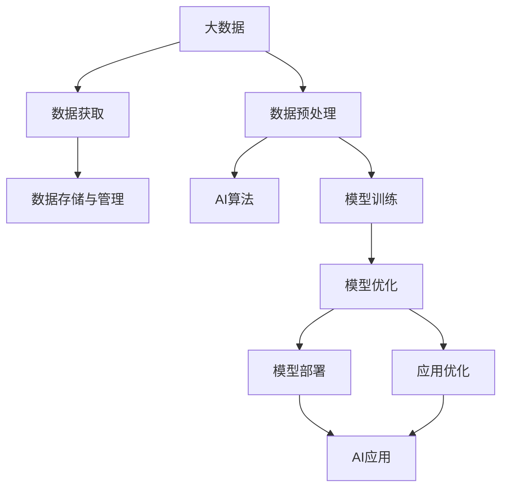

                 

## 1. 背景介绍

### 1.1 问题由来

大数据的兴起，无疑是21世纪最具有划时代意义的科技革命之一。从互联网、移动设备、物联网等众多领域产生的海量数据中，蕴藏着无尽的商业价值和创新潜力。这些数据为人工智能(AI)技术的发展提供了肥沃的土壤，极大地推动了AI从理论到实践的跨越。

在数据驱动的AI时代，大数据在优化算法、提高模型性能、驱动应用创新等方面起到了不可或缺的作用。当前，大数据在AI发展中的角色越来越受到重视，成为了推动AI技术发展的核心驱动力。本文将深入探讨大数据在AI发展中的角色，并从多个维度分析其在AI各个环节中的应用和影响。

### 1.2 问题核心关键点

大数据在AI发展中的核心关键点主要包括：

- **数据量和多样性**：海量数据的规模和多样性为AI模型提供了丰富的学习材料。
- **数据质量**：数据标签、格式、处理方式的正确性和一致性直接影响到AI模型的性能和可靠性。
- **数据隐私和安全**：如何在充分利用数据价值的同时，保障数据隐私和信息安全，是大数据应用中的一大挑战。
- **数据处理与存储**：大数据的分布式存储和高效处理技术，是支撑AI模型训练和推理的基础。
- **数据驱动决策**：通过大数据分析挖掘出的模式和洞察，能够帮助企业做出更加精准的决策，推动AI落地应用。

大数据在AI发展中的角色，主要体现在以下几个方面：数据获取、数据预处理、模型训练、模型部署和应用优化等环节。通过这些环节的有效衔接，大数据能够显著提升AI模型的性能，推动AI技术的创新和应用落地。

## 2. 核心概念与联系

### 2.1 核心概念概述

为更好地理解大数据在AI发展中的角色，本节将介绍几个密切相关的核心概念：

- **大数据**：指海量的、多样化的、实时生成且需要采用先进的大数据处理技术才能管理的复杂数据集。
- **人工智能**：利用计算机算法和统计模型，让计算机系统模拟人类智能的行为和思考过程，完成特定的任务。
- **数据驱动**：以数据为基础，通过数据分析和挖掘，推动决策和创新过程。
- **AI算法**：利用统计学、机器学习、深度学习等技术，构建的用于解决特定问题的算法模型。
- **模型优化**：通过算法、数据、硬件等优化，提升AI模型的准确性、效率和可解释性。

这些核心概念之间的逻辑关系可以通过以下Mermaid流程图来展示：



这个流程图展示了大数据与AI各个环节的联系：

1. 大数据通过数据获取、预处理、存储和管理等步骤，为AI模型提供了数据支持。
2. AI算法利用大数据训练模型，并通过模型优化和部署实现具体应用。
3. AI应用通过对大数据的分析挖掘，推动业务决策和创新。

## 3. 核心算法原理 & 具体操作步骤

### 3.1 算法原理概述

大数据在AI中的核心算法主要围绕数据处理、特征提取、模型训练和优化展开。以下将详细介绍这些核心算法的原理和操作步骤。

### 3.2 算法步骤详解

#### 3.2.1 数据获取与预处理

1. **数据获取**：
   - **方法**：采用ETL(抽取、转换、加载)等技术，从不同数据源获取数据。数据源可能包括互联网日志、社交媒体、传感器数据等。
   - **技术栈**：Hadoop、Spark、Kafka等大数据处理框架。

2. **数据预处理**：
   - **步骤**：数据清洗、格式转换、归一化、缺失值处理等。
   - **技术栈**：Pandas、NumPy、Scikit-Learn等数据处理库。

#### 3.2.2 特征提取与选择

1. **特征提取**：
   - **方法**：从原始数据中提取有意义的特征，如文本中的词频、TF-IDF、词向量等。
   - **技术栈**：Word2Vec、GloVe、BERT等词向量模型。

2. **特征选择**：
   - **方法**：选择最相关、最具区分性的特征，避免维度灾难。
   - **技术栈**：LASSO、PCA、特征重要性分析等。

#### 3.2.3 模型训练与优化

1. **模型训练**：
   - **方法**：采用机器学习、深度学习等算法，在大数据上训练模型。
   - **技术栈**：TensorFlow、PyTorch、Keras等深度学习框架。

2. **模型优化**：
   - **方法**：调整模型参数、优化算法、正则化、超参数调优等。
   - **技术栈**：Adam、SGD、L2正则化等。

#### 3.2.4 模型评估与部署

1. **模型评估**：
   - **方法**：采用交叉验证、ROC曲线、混淆矩阵等评估指标。
   - **技术栈**：Scikit-Learn、TensorBoard等评估工具。

2. **模型部署**：
   - **方法**：将训练好的模型部署到生产环境，实现实时推理和预测。
   - **技术栈**：AWS、Azure、Google Cloud等云服务平台。

## 4. 数学模型和公式 & 详细讲解  
### 4.1 数学模型构建

在大数据驱动的AI中，常见的数学模型包括线性回归、逻辑回归、支持向量机、随机森林、深度神经网络等。以线性回归为例，构建数学模型的一般步骤如下：

- **数据准备**：将原始数据转化为适合模型输入的形式。
- **模型训练**：通过最小二乘法等方法，拟合数据点，得到模型参数。
- **模型评估**：通过测试集验证模型的预测准确性。

### 4.2 公式推导过程

以线性回归为例，数学模型的推导过程如下：

1. **假设模型**：
   $$
   y = \theta_0 + \theta_1 x_1 + \theta_2 x_2 + \cdots + \theta_n x_n
   $$

2. **最小二乘法**：
   $$
   \theta = \mathop{\arg\min}_{\theta} \sum_{i=1}^N (y_i - \theta_0 - \theta_1 x_{i1} - \cdots - \theta_n x_{in})^2
   $$

3. **求解参数**：
   $$
   \theta = (\frac{1}{2N} \sum_{i=1}^N \sum_{j=1}^n x_{ij} x_{ij})^{-1} \sum_{i=1}^N \sum_{j=1}^n x_{ij} y_i
   $$

4. **验证与调整**：
   $$
   \text{验证集误差} = \frac{1}{N} \sum_{i=1}^N (y_i - \hat{y}_i)^2
   $$

### 4.3 案例分析与讲解

#### 案例分析：电商推荐系统

电商推荐系统是一个典型的大数据应用场景。通过收集用户的浏览历史、购买记录、评分数据等，建立用户行为模型，进而实现个性化推荐。

1. **数据获取**：
   - **数据源**：用户行为数据、商品数据、交易记录等。
   - **获取方法**：ETL技术从数据库中抽取数据。

2. **数据预处理**：
   - **方法**：数据清洗、归一化、缺失值处理等。
   - **工具**：Pandas、NumPy等。

3. **特征提取**：
   - **方法**：提取用户行为特征、商品特征、用户评分等。
   - **技术**：词向量模型、TF-IDF等。

4. **模型训练**：
   - **方法**：采用协同过滤、矩阵分解等算法。
   - **框架**：Scikit-Learn、TensorFlow等。

5. **模型优化**：
   - **方法**：超参数调优、正则化、交叉验证等。
   - **工具**：GridSearchCV、XGBoost等。

6. **模型部署**：
   - **方法**：将训练好的模型部署到线上，实时推荐商品。
   - **平台**：AWS、Azure等云服务。

## 5. 项目实践：代码实例和详细解释说明

### 5.1 开发环境搭建

#### 5.1.1 环境依赖

- **操作系统**：Linux、Windows、macOS
- **编程语言**：Python 3.x
- **开发框架**：TensorFlow、PyTorch、Scikit-Learn等

#### 5.1.2 环境搭建

1. **安装Python**：
   - **Windows**：
     ```bash
     python.exe -m pip install pipenv
     pipenv install --upgrade
     pipenv install numpy pandas scikit-learn tensorflow
     ```
   - **Linux/macOS**：
     ```bash
     sudo apt-get update
     sudo apt-get install python3-pip
     pip install numpy pandas scikit-learn tensorflow
     ```

2. **安装开发工具**：
   - **TensorFlow**：
     ```bash
     pip install tensorflow
     ```
   - **PyTorch**：
     ```bash
     pip install torch
     ```
   - **Scikit-Learn**：
     ```bash
     pip install scikit-learn
     ```

3. **安装数据处理库**：
   - **Pandas**：
     ```bash
     pip install pandas
     ```
   - **NumPy**：
     ```bash
     pip install numpy
     ```

4. **安装可视化工具**：
   - **Matplotlib**：
     ```bash
     pip install matplotlib
     ```
   - **Seaborn**：
     ```bash
     pip install seaborn
     ```

### 5.2 源代码详细实现

#### 5.2.1 数据预处理

```python
import pandas as pd
import numpy as np
from sklearn.model_selection import train_test_split
from sklearn.preprocessing import StandardScaler

# 读取数据
data = pd.read_csv('data.csv')

# 数据清洗
data = data.dropna()

# 数据分割
X_train, X_test, y_train, y_test = train_test_split(data.drop('target', axis=1), data['target'], test_size=0.2)

# 数据标准化
scaler = StandardScaler()
X_train = scaler.fit_transform(X_train)
X_test = scaler.transform(X_test)
```

#### 5.2.2 模型训练

```python
from sklearn.linear_model import LinearRegression
from sklearn.metrics import mean_squared_error

# 初始化模型
model = LinearRegression()

# 模型训练
model.fit(X_train, y_train)

# 模型预测
y_pred = model.predict(X_test)

# 模型评估
mse = mean_squared_error(y_test, y_pred)
print(f"Mean Squared Error: {mse:.2f}")
```

### 5.3 代码解读与分析

#### 5.3.1 数据预处理

- **数据读取**：使用Pandas的read_csv方法读取CSV文件。
- **数据清洗**：使用dropna方法删除缺失值。
- **数据分割**：使用train_test_split方法将数据集分割为训练集和测试集。
- **数据标准化**：使用StandardScaler标准化数据，避免不同特征的尺度差异对模型产生影响。

#### 5.3.2 模型训练

- **模型初始化**：使用LinearRegression初始化线性回归模型。
- **模型训练**：使用fit方法拟合训练数据，得到模型参数。
- **模型预测**：使用predict方法对测试集进行预测。
- **模型评估**：使用mean_squared_error方法计算预测误差。

## 6. 实际应用场景

### 6.1 智能推荐系统

智能推荐系统是大数据在AI中应用最广泛的场景之一。通过大数据分析和挖掘，推荐系统能够为用户推荐个性化的商品、内容、服务，极大地提升了用户体验和满意度。

#### 6.1.1 电商推荐系统

电商推荐系统通过分析用户的历史行为和偏好，推荐其可能感兴趣的商品。该系统基于用户的购买记录、浏览历史、评分数据等，构建用户行为模型，进而实现个性化推荐。

#### 6.1.2 视频推荐系统

视频推荐系统通过分析用户的历史观看记录、点赞数据等，推荐其可能感兴趣的视频内容。该系统基于用户的行为数据，构建视频推荐模型，实现个性化内容推荐。

### 6.2 金融风险管理

金融风险管理是大数据在AI中的重要应用领域。通过大数据分析和挖掘，金融机构能够及时发现和评估风险，做出精准的决策。

#### 6.2.1 信用风险评估

金融机构通过收集用户的信用记录、交易数据等，构建信用风险评估模型，预测用户的信用风险。该模型基于大数据分析，评估用户的信用状况，降低违约风险。

#### 6.2.2 市场风险监控

金融机构通过分析市场数据、交易数据等，构建市场风险监控模型，预测市场波动。该模型基于大数据分析，监测市场风险，帮助金融机构制定风险控制策略。

### 6.3 智慧医疗

智慧医疗是大数据在AI中的前沿应用领域。通过大数据分析和挖掘，医疗机构能够提高诊疗效率，改善患者体验。

#### 6.3.1 病历数据分析

医疗机构通过收集患者的电子病历、实验室数据等，构建病历数据分析模型，发现疾病的早期症状和趋势。该模型基于大数据分析，辅助医生诊断和治疗，提升诊疗效率。

#### 6.3.2 个性化治疗

医疗机构通过收集患者的基因信息、生活习惯等，构建个性化治疗模型，制定个性化的治疗方案。该模型基于大数据分析，提高治疗效果，提升患者满意度。

### 6.4 未来应用展望

随着大数据和AI技术的不断进步，未来大数据在AI中的应用将更加广泛和深入。以下是大数据在AI未来的几个主要应用方向：

1. **物联网数据融合**：物联网设备产生的海量数据，将与AI技术深度融合，实现智能化的设备管理和控制。

2. **人工智能辅助设计**：通过分析设计数据和用户反馈，AI系统能够辅助设计师进行创意设计和方案优化，提升设计效率和质量。

3. **智能交通系统**：通过分析交通数据、车辆数据等，AI系统能够实现智能化的交通管理和调度，提高交通效率，减少事故发生。

4. **智慧城市建设**：通过分析城市数据、居民数据等，AI系统能够实现智慧化的城市管理和公共服务，提升城市运行效率，改善居民生活质量。

## 7. 工具和资源推荐

### 7.1 学习资源推荐

#### 7.1.1 在线课程

- **Coursera**：提供包括机器学习、深度学习、大数据在内的多门课程，由全球顶尖大学和公司提供。
- **Udacity**：提供包括AI、数据科学、机器学习在内的多门课程，由知名公司和专家提供。
- **edX**：提供包括大数据、机器学习、AI在内的多门课程，由全球顶尖大学提供。

#### 7.1.2 书籍

- **《深度学习》（Goodfellow et al.）**：介绍深度学习的理论基础和实践技巧，适合初学者和进阶读者。
- **《机器学习实战》（Peter Harrington）**：介绍机器学习的基本算法和实现方法，适合初学者。
- **《大数据分析实战》（Ganesh Kathiresan）**：介绍大数据处理、分析和挖掘的实战技巧，适合中级读者。

#### 7.1.3 博客和社区

- **KDnuggets**：机器学习和数据科学的社区，提供大量实用的技术文章和教程。
- **Towards Data Science**：数据科学和机器学习的博客平台，提供前沿的AI技术文章和案例分析。
- **GitHub**：开发者社区，提供丰富的开源项目和代码实现，适合学习和参考。

### 7.2 开发工具推荐

#### 7.2.1 数据处理工具

- **Hadoop**：分布式大数据处理框架，适合大规模数据存储和处理。
- **Spark**：分布式大数据处理框架，适合实时数据处理和分析。
- **Pandas**：Python中的数据处理库，提供高效的数据清洗和分析功能。

#### 7.2.2 模型训练工具

- **TensorFlow**：Google开源的深度学习框架，支持分布式训练和模型优化。
- **PyTorch**：Facebook开源的深度学习框架，支持动态计算图和模型部署。
- **Scikit-Learn**：Python中的机器学习库，提供简单易用的算法实现。

#### 7.2.3 可视化工具

- **Matplotlib**：Python中的数据可视化库，支持绘制多种类型的图表。
- **Seaborn**：基于Matplotlib的高级数据可视化库，提供美观的图表绘制功能。
- **TensorBoard**：TensorFlow的可视化工具，支持实时监控模型训练状态和性能。

### 7.3 相关论文推荐

#### 7.3.1 大数据处理

- **《Hadoop: The Definitive Guide》（Tom White）**：介绍Hadoop的架构、功能和实践技巧。
- **《Spark: The Definitive Guide》（John Deighton）**：介绍Spark的架构、功能和实践技巧。

#### 7.3.2 机器学习和深度学习

- **《Pattern Recognition and Machine Learning》（Christopher Bishop）**：介绍机器学习的理论基础和算法实现。
- **《Deep Learning》（Ian Goodfellow et al.）**：介绍深度学习的理论基础和实践技巧。

#### 7.3.3 AI应用

- **《AI Superpowers: China, Silicon Valley, and the New World Order》（Kai-Fu Lee）**：介绍AI技术在不同领域的实际应用。
- **《The Future of Employment: How Susceptible Are Jobs to Computerisation》（Oxford Economics）**：分析AI技术对就业的影响和未来趋势。

## 8. 总结：未来发展趋势与挑战

### 8.1 研究成果总结

大数据在AI发展中的角色是多方面的，包括数据获取、数据预处理、模型训练、模型优化和模型部署等环节。通过这些环节的有效衔接，大数据显著提升了AI模型的性能和应用效果。

### 8.2 未来发展趋势

#### 8.2.1 数据规模和多样性

随着技术的进步，数据规模和多样性将进一步增大，大数据将成为AI模型训练和优化的核心驱动力。未来，AI模型将更加依赖于海量、多样化、实时生成的数据，以提升模型的泛化能力和应用效果。

#### 8.2.2 实时数据处理

实时数据处理技术将更加成熟，大数据能够实时分析和处理数据，支持AI模型进行实时推理和预测。未来的AI应用将更加强调实时性和交互性，实时数据处理技术将成为AI应用落地的关键。

#### 8.2.3 模型融合与集成

未来AI模型将更加注重模型的融合与集成，通过多模型协同工作，实现更强的性能和更好的泛化能力。模型融合技术将推动AI技术的发展，提升模型的决策能力和应用效果。

### 8.3 面临的挑战

#### 8.3.1 数据隐私和安全

大数据的应用面临着数据隐私和安全问题。如何在充分利用数据价值的同时，保障数据隐私和安全，是未来的一大挑战。

#### 8.3.2 数据质量和一致性

大数据的质量和一致性问题不容忽视。数据缺失、格式不一致、处理错误等都将影响AI模型的性能和可靠性。未来需要进一步提升数据质量，确保数据的一致性和准确性。

#### 8.3.3 计算资源和成本

大数据的处理和分析需要大量的计算资源和成本。如何在降低成本的同时，提升数据处理和分析效率，是未来的一大挑战。

### 8.4 研究展望

未来的研究需要进一步探索大数据在AI中的角色，解决当前面临的挑战。以下是几个可能的研究方向：

#### 8.4.1 数据隐私和安全

开发更加高效的数据隐私保护技术，确保大数据应用的隐私和安全。通过差分隐私、联邦学习等技术，保护用户数据隐私。

#### 8.4.2 数据质量和一致性

提升大数据处理和分析的质量和一致性，开发更加自动化和智能化的数据预处理工具，减少人为干预和错误。

#### 8.4.3 实时数据处理

开发更加高效和可靠的大数据实时处理技术，支持AI模型进行实时推理和预测。利用流式处理和分布式计算技术，提升实时数据处理的效率和可靠性。

## 9. 附录：常见问题与解答

### 9.1 常见问题

#### 9.1.1 什么是大数据？

大数据是指海量的、多样化的、实时生成且需要采用先进的数据处理技术才能管理的复杂数据集。

#### 9.1.2 大数据在AI中的应用有哪些？

大数据在AI中的应用包括智能推荐系统、金融风险管理、智慧医疗、物联网数据融合等。

#### 9.1.3 如何处理大数据？

大数据的处理流程包括数据获取、数据预处理、数据存储与管理、数据挖掘和分析等。

### 9.2 解答

#### 9.2.1 什么是大数据？

大数据是指海量的、多样化的、实时生成且需要采用先进的数据处理技术才能管理的复杂数据集。

#### 9.2.2 大数据在AI中的应用有哪些？

大数据在AI中的应用包括智能推荐系统、金融风险管理、智慧医疗、物联网数据融合等。

#### 9.2.3 如何处理大数据？

大数据的处理流程包括数据获取、数据预处理、数据存储与管理、数据挖掘和分析等。

---

作者：禅与计算机程序设计艺术 / Zen and the Art of Computer Programming

