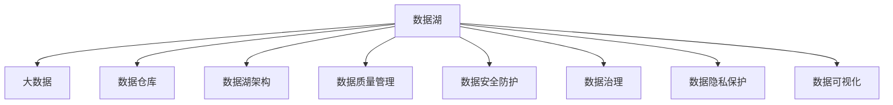

                 

## 1. 背景介绍

### 1.1 问题由来
在数字化转型的大潮下，企业的数据量和数据种类急剧增长，如何高效地存储、管理和利用这些数据成为了企业信息化的重要课题。传统的数据仓库和数据管理系统已经难以满足当前海量数据、多源数据、实时数据的需求，需要一种全新的数据处理范式——数据湖(Data Lake)。

数据湖是一种以海量存储和灵活分析为核心的数据存储系统，支持企业自由存储任意类型的数据，并提供基于大数据技术的数据处理和分析能力。借助数据湖，企业可以更好地支持大数据分析、机器学习、人工智能等数据密集型应用，推动业务决策智能化、运营管理自动化、产品创新加速化。

### 1.2 问题核心关键点
数据湖的核心在于其高度的灵活性和可扩展性。数据湖不再局限于结构化数据，可以存储海量的非结构化数据、半结构化数据和实时数据。通过分布式存储和并行处理，数据湖能够高效支持大规模数据的处理，提供基于大数据技术的数据分析能力。但与此同时，构建和管理数据湖也面临许多挑战，包括数据质量管理、数据安全防护、数据治理、数据隐私保护、数据可视化、数据驱动决策等。

数据湖的构建需要企业在组织架构、技术体系、数据质量、数据安全等方面进行全面升级，形成统一的管理平台和流程，确保数据湖在支撑业务应用的同时，也能够有效防范潜在风险。

### 1.3 问题研究意义
构建数据湖是企业实现数字化转型的重要基础。通过数据湖，企业能够更加灵活高效地利用数据资源，快速实现业务优化和创新。

- 提升数据利用率。数据湖支持海量数据存储和处理，能够充分利用企业内部和外部的数据资源，实现数据的深度挖掘和利用。
- 支持数据驱动决策。数据湖将数据汇集在一起，为业务决策提供了全面的数据支撑，帮助企业更快更好地进行决策。
- 推动智能化运营。数据湖支持大数据分析和机器学习等数据密集型应用，能够帮助企业实现运营管理的自动化、智能化。
- 加速产品创新。数据湖能够提供实时数据支持，帮助企业快速响应市场需求，加速产品创新。

构建数据湖还需要结合企业具体的业务场景和数据需求，形成适合自身的数据治理策略，为后续的智能化应用奠定基础。

## 2. 核心概念与联系

### 2.1 核心概念概述

为了更好地理解数据湖的构建和应用，本节将介绍几个密切相关的核心概念：

- 数据湖(Data Lake)：一种以海量存储和灵活分析为核心的数据存储系统，支持企业自由存储任意类型的数据，并提供基于大数据技术的数据处理和分析能力。
- 大数据(Big Data)：通常指规模、速度和多样性均超出传统数据处理范围的数据集合，包括结构化、非结构化和半结构化数据。
- 数据仓库(Data Warehouse)：一种集中存储企业历史数据的、支持复杂查询的数据库系统，通常采用多维数据分析和OLAP技术。
- 数据湖架构：指企业为构建数据湖而采取的技术框架和数据模型，包括数据采集、数据存储、数据治理、数据处理、数据可视化等环节。
- 数据质量管理：指对数据湖中的数据进行质量检测、清洗和提升的过程，确保数据准确性、完整性、一致性等。
- 数据安全防护：指对数据湖中的数据进行加密、访问控制、审计等安全措施，保障数据的安全性。
- 数据治理：指对数据湖中的数据进行分类、命名、规范、存储、访问、安全等方面的管理，确保数据使用的合规性。
- 数据隐私保护：指对数据湖中的数据进行隐私保护，防止数据泄露和滥用。
- 数据可视化：指利用数据可视化工具，将数据湖中的数据以图表、仪表盘等形式展示出来，帮助企业理解数据。

这些核心概念之间的逻辑关系可以通过以下Mermaid流程图来展示：



这个流程图展示了大数据湖的相关核心概念及其之间的关系：

1. 数据湖依托于大数据技术，能够存储海量的数据。
2. 数据湖和数据仓库的差异在于灵活性，数据湖支持任意类型数据，数据仓库则侧重于结构化数据。
3. 数据湖架构是构建数据湖的技术框架，包括数据采集、存储、治理等环节。
4. 数据质量管理、数据安全防护、数据治理、数据隐私保护、数据可视化等环节，都是为了保障数据湖的完整性、准确性和安全性。

这些概念共同构成了数据湖的构建和管理框架，使其能够更好地支撑企业的数据化决策。

## 3. 核心算法原理 & 具体操作步骤
### 3.1 算法原理概述

数据湖的构建过程通常包括以下几个关键步骤：

1. 数据采集：将企业内部和外部的数据源（如数据库、文件、日志、API接口等）接入数据湖，构建完整的数据生态。
2. 数据存储：采用分布式文件系统或分布式数据库等技术，对采集到的数据进行存储，支持数据的多样性和海量性。
3. 数据治理：通过数据质量管理、数据安全防护、数据隐私保护等措施，确保数据湖中数据的质量、安全性和合规性。
4. 数据处理：利用大数据技术，对数据湖中的数据进行清洗、转换、计算、分析等处理，形成可用的分析数据。
5. 数据可视化：利用数据可视化工具，将数据湖中的数据以图表、仪表盘等形式展示出来，帮助企业理解数据。

数据湖的构建流程如下图所示：


### 3.2 算法步骤详解

#### 3.2.1 数据采集
数据采集是构建数据湖的首要环节，包括从企业内部和外部数据源中获取数据，并将其转化为适合数据湖存储的格式。

1. 内部数据源：企业内部的数据库、文件、日志等数据源，通常使用ETL工具（如Apache Nifi、Apache Beam等）进行数据采集和转换。ETL工具可以自动化地处理各种数据源，将其统一转换为数据湖支持的格式。
2. 外部数据源：来自互联网、社交媒体、IoT设备等外部数据源的数据，通常需要采用API接口、爬虫等技术进行数据采集。这些数据源多样且不稳定，需要根据不同数据源的特点进行适配。

#### 3.2.2 数据存储
数据湖的数据存储需要采用分布式存储系统，支持海量数据的存储和查询。目前主流的分布式存储系统包括Apache Hadoop、Apache Spark、Apache Flink等。

1. Apache Hadoop：支持大规模数据存储，采用HDFS分布式文件系统进行数据存储。HDFS具有高容错性和可扩展性，能够支持PB级数据的存储和处理。
2. Apache Spark：基于内存计算的分布式计算系统，能够高效处理大规模数据，支持多种数据源和数据处理引擎。Spark还提供了MLlib机器学习库，支持数据挖掘和机器学习等数据分析任务。
3. Apache Flink：流式数据处理系统，支持实时数据流和批量数据流的处理。Flink具有低延迟和无限扩展性，适用于对实时数据处理要求较高的场景。

#### 3.2.3 数据治理
数据治理是数据湖构建的核心环节，包括数据质量管理、数据安全防护、数据隐私保护等措施，确保数据湖中数据的质量、安全性和合规性。

1. 数据质量管理：通过数据清洗、去重、归一化等技术，确保数据湖中数据的准确性和一致性。常用的工具包括Talend、Informatica等。
2. 数据安全防护：通过数据加密、访问控制、审计等措施，保障数据的安全性。常用的技术包括数据脱敏、数据加密、访问控制列表(ACL)等。
3. 数据隐私保护：通过数据匿名化、数据脱敏、访问控制等措施，保护用户隐私。常用的技术包括数据匿名化算法、差分隐私技术等。

#### 3.2.4 数据处理
数据处理是数据湖构建的关键环节，利用大数据技术对数据湖中的数据进行清洗、转换、计算、分析等处理，形成可用的分析数据。

1. 数据清洗：去除重复、错误、缺失的数据，形成干净的数据集。常用的工具包括Presto、Spark等。
2. 数据转换：将不同格式、不同来源的数据进行转换，形成统一的数据格式。常用的工具包括Presto、Apache NiFi等。
3. 数据计算：利用分布式计算技术，对数据湖中的数据进行计算和分析。常用的技术包括MapReduce、Spark、Flink等。
4. 数据可视化：利用数据可视化工具，将数据湖中的数据以图表、仪表盘等形式展示出来，帮助企业理解数据。常用的工具包括Tableau、PowerBI等。

#### 3.2.5 数据可视化
数据可视化是数据湖构建的最终环节，通过可视化工具将数据湖中的数据以图表、仪表盘等形式展示出来，帮助企业理解数据。

1. Tableau：功能强大且易于使用的数据可视化工具，支持大规模数据集的处理和展示。
2. PowerBI：微软推出的数据可视化工具，支持实时数据可视化，能够与企业内部系统无缝集成。
3. QlikView：灵活且易于使用的数据可视化工具，支持数据挖掘和数据可视化。

### 3.3 算法优缺点

数据湖作为一种数据存储和处理模式，具有以下优点：

1. 灵活性：数据湖支持任意类型的数据，包括结构化、半结构化和非结构化数据，能够适应多样化的数据需求。
2. 可扩展性：数据湖采用分布式存储和计算架构，支持海量数据的存储和处理，能够满足企业不断增长的数据需求。
3. 数据完整性：数据湖的数据存储和处理过程具有高度的完整性和准确性，能够保证数据的可靠性和一致性。
4. 数据安全性：数据湖的数据存储和处理过程具有高度的安全性，能够保护数据的安全性和隐私。

但数据湖也存在一些缺点：

1. 数据质量：由于数据湖的数据来源多样且格式不一，数据质量管理难度较大，需要投入大量的人力和时间进行数据清洗和处理。
2. 数据访问：由于数据湖的数据存储在分布式系统中，访问性能可能不如集中式数据仓库。
3. 数据复杂性：数据湖的数据结构和数据模型复杂，对数据处理和数据分析的技术要求较高。

### 3.4 算法应用领域

数据湖在多个领域具有广泛的应用，包括：

1. 数据挖掘和机器学习：通过数据湖存储大量的历史数据和实时数据，能够支持各种数据挖掘和机器学习应用。
2. 数据可视化：通过数据湖存储和处理大规模数据，能够支持各种数据可视化应用。
3. 大数据分析：通过数据湖存储和处理大规模数据，能够支持各种大数据分析应用，如实时数据分析、复杂查询分析等。
4. 数据仓库和数据治理：数据湖可以作为数据仓库的补充，提供更灵活的数据存储和处理能力。
5. 人工智能和智能决策：通过数据湖存储和处理大规模数据，能够支持各种人工智能和智能决策应用，如推荐系统、智能客服等。

## 4. 数学模型和公式 & 详细讲解  
### 4.1 数学模型构建

在数据湖的构建过程中，我们需要设计一些数学模型来描述数据湖的各个环节。以数据采集为例，我们可以定义一个数据采集的数学模型：

设数据湖中的数据源集合为 $S$，数据采集器为 $A$，采集到的数据为 $D$，则数据采集的过程可以用以下数学模型表示：

$$
D = A(S)
$$

其中 $A$ 表示数据采集器，$S$ 表示数据源集合，$D$ 表示采集到的数据。

### 4.2 公式推导过程

数据采集的公式可以进一步细化为：

$$
D = \bigcup_{s \in S} A(s)
$$

即数据采集器 $A$ 从数据源集合 $S$ 中采集到的所有数据 $D$ 的并集。

### 4.3 案例分析与讲解

以电商数据为例，分析数据采集的数学模型：

假设数据湖中的数据源包括电商平台的订单数据、用户数据、商品数据等。每个数据源 $s$ 的数据采集器 $A(s)$ 可以从相应的API接口、数据库中获取数据，然后将其转化为数据湖支持的格式。

$$
D = A(\text{订单数据}) \cup A(\text{用户数据}) \cup A(\text{商品数据})
$$

其中 $A(\text{订单数据})$ 表示从电商平台的订单API接口采集到的订单数据，$A(\text{用户数据})$ 表示从用户数据库中采集到的用户数据，$A(\text{商品数据})$ 表示从商品数据库中采集到的商品数据。

采集到的数据 $D$ 中可能存在重复、错误、缺失的数据，需要进行数据清洗和处理。

$$
D' = \text{清洗}(D)
$$

其中 $D'$ 表示清洗后的数据，$\text{清洗}$ 表示数据清洗算法。

清洗后的数据 $D'$ 需要进行数据转换和计算，形成可用的分析数据。

$$
D'' = \text{转换}(D')
$$

其中 $D''$ 表示转换后的数据，$\text{转换}$ 表示数据转换算法。

转换后的数据 $D''$ 需要进行数据分析和可视化，形成可用的分析结果。

$$
R = \text{分析}(D'')
$$

其中 $R$ 表示分析结果，$\text{分析}$ 表示数据分析算法。

最后，将分析结果 $R$ 进行数据可视化展示。

$$
V = \text{可视化}(R)
$$

其中 $V$ 表示可视化结果，$\text{可视化}$ 表示数据可视化算法。

## 5. 项目实践：代码实例和详细解释说明
### 5.1 开发环境搭建

在进行数据湖构建的实践前，我们需要准备好开发环境。以下是使用Python进行Apache Hadoop开发的Python环境配置流程：

1. 安装Anaconda：从官网下载并安装Anaconda，用于创建独立的Python环境。

2. 创建并激活虚拟环境：
```bash
conda create -n hadoop-env python=3.8 
conda activate hadoop-env
```

3. 安装Apache Hadoop：根据操作系统和版本要求，从官网获取对应的安装命令。例如：
```bash
wget http://archive.apache.org/dist/hadoop/common/3.1.2/hadoop-3.1.2.tar.gz
tar -xf hadoop-3.1.2.tar.gz
cd hadoop-3.1.2
```

4. 配置环境变量：在终端中输入以下命令配置Hadoop环境变量。
```bash
export HADOOP_HOME=/path/to/hadoop-3.1.2
export PATH=$PATH:$HADOOP_HOME/bin:$HADOOP_HOME/sbin
```

5. 启动Hadoop集群：
```bash
hadoop namenode -start
hadoop datanode -start
```

完成上述步骤后，即可在`hadoop-env`环境中开始数据湖构建实践。

### 5.2 源代码详细实现

下面我们以电商数据为例，给出使用Apache Hadoop进行数据湖构建的PyTorch代码实现。

首先，定义数据源和数据采集器：

```python
import os
from hadoop import conf, fs

# 配置Hadoop环境变量
hadoop_home = '/path/to/hadoop-3.1.2'
hadoop_etc_dir = os.path.join(hadoop_home, 'etc')
conf.set('fs.defaultfs', 'hdfs://localhost:9000')
conf.set('fs.hdfs.Impl', 'org.apache.hadoop.hdfs.client.HdfsClientImpl')
conf.set('fs.defaultFS', 'hdfs://localhost:9000')
conf.set('dfs.namenode.rpc-address', 'localhost:9000')
conf.set('dfs.namenode.http-address', 'localhost:50070')

# 定义数据源
class DataSource:
    def __init__(self, data_path):
        self.data_path = data_path
        self.fs = fs.HdfsClient()
        self.data = None
        self.load_data()
        
    def load_data(self):
        with self.fs.open(self.data_path, 'r') as f:
            self.data = f.read()
```

然后，定义数据处理函数：

```python
from pandas import DataFrame

# 定义数据处理函数
class DataProcessor:
    def __init__(self, data_source):
        self.data_source = data_source
        self.data = None
        
    def process_data(self):
        self.data = DataFrame(self.data_source.data)
        # 清洗数据
        self.data = self.data.drop_duplicates()
        self.data = self.data.dropna()
        # 转换数据
        self.data = self.data[['user_id', 'product_id', 'order_time', 'amount']]
        self.data['order_time'] = pd.to_datetime(self.data['order_time'])
        self.data['amount'] = self.data['amount'].astype('float')
        # 计算分析结果
        self.data['total_amount'] = self.data['amount'].sum()
        self.data['average_amount'] = self.data['amount'].mean()
        self.data['max_amount'] = self.data['amount'].max()
        self.data['min_amount'] = self.data['amount'].min()
        return self.data
```

最后，启动数据湖构建流程：

```python
# 创建数据源
data_source = DataSource('/path/to/data/source')
# 创建数据处理器
data_processor = DataProcessor(data_source)
# 处理数据
data = data_processor.process_data()
# 可视化数据
data.to_csv('/path/to/data/visualize')
```

以上就是使用Apache Hadoop进行电商数据湖构建的完整代码实现。可以看到，得益于Hadoop的强大分布式存储和处理能力，数据湖的构建变得相对简单高效。

### 5.3 代码解读与分析

让我们再详细解读一下关键代码的实现细节：

**DataSource类**：
- `__init__`方法：初始化数据源路径和Hadoop文件系统。
- `load_data`方法：从Hadoop文件系统加载数据。

**DataProcessor类**：
- `__init__`方法：初始化数据源。
- `process_data`方法：对数据进行清洗、转换和计算，形成可用的分析结果。

**主函数**：
- 创建数据源和数据处理器。
- 对数据进行处理，形成分析结果。
- 将分析结果可视化输出。

可以看到，Apache Hadoop通过其强大的分布式存储和处理能力，能够高效构建数据湖，支撑企业的数据处理需求。

当然，在实际应用中，还需要针对具体业务场景和数据需求，进行全面的数据质量管理、数据安全防护、数据治理等优化，确保数据湖的稳定性和可靠性。

## 6. 实际应用场景
### 6.1 智能推荐系统

数据湖在智能推荐系统中的应用，能够提供实时、多样化的用户数据，支持推荐模型的训练和优化。智能推荐系统通过分析用户行为数据和产品信息，为用户提供个性化的推荐服务。

在技术实现上，可以收集用户的历史行为数据、浏览记录、购买记录等，构建用户画像。同时收集商品的属性、评论、评分等数据，构建商品画像。通过数据湖存储和处理这些数据，利用大数据分析技术，如协同过滤、矩阵分解等，训练推荐模型，生成推荐结果。对于实时推荐需求，可以利用流式计算技术，实现实时推荐。

### 6.2 供应链优化

数据湖在供应链优化中的应用，能够提供实时、全面的供应链数据，支持供应链系统的建模和优化。供应链优化系统通过分析历史订单数据、库存数据、供应商数据等，预测未来的订单需求、库存水平、供应商表现等，优化供应链的各个环节，提高供应链的效率和弹性。

在技术实现上，可以收集供应链系统的历史订单数据、库存数据、供应商数据等，存储到数据湖中。利用大数据分析技术，如时间序列分析、预测模型等，分析供应链系统的数据，预测未来的订单需求、库存水平、供应商表现等，形成供应链系统的模型。利用优化算法，如线性规划、整数规划等，优化供应链系统的模型，生成优化方案。

### 6.3 智能客服系统

数据湖在智能客服系统中的应用，能够提供实时的用户对话数据，支持客服系统的训练和优化。智能客服系统通过分析用户对话数据，识别用户的意图和需求，自动生成回复，提升客服系统的响应速度和准确性。

在技术实现上，可以收集智能客服系统的用户对话数据，存储到数据湖中。利用大数据分析技术，如自然语言处理、情感分析等，分析用户对话数据，识别用户的意图和需求，生成回复。利用机器学习技术，如序列模型、生成模型等，训练回复生成模型，提升客服系统的回复质量。

### 6.4 未来应用展望

展望未来，数据湖在更多的场景中将会得到应用，为企业提供更全面的数据支持，推动企业数字化转型：

1. 数据驱动决策：数据湖能够提供全面的数据支持，帮助企业进行数据驱动决策，提升决策的科学性和精准性。
2. 智能化运营：数据湖能够提供实时、全面的运营数据，支持企业的智能化运营，提升运营效率和效果。
3. 产品创新：数据湖能够提供多样化的用户数据和市场数据，支持企业的创新发展，推动产品创新和市场竞争。
4. 数据治理：数据湖能够提供全面的数据管理能力，支持企业的数据治理，提升数据质量和数据安全。
5. 数据可视化：数据湖能够提供丰富的数据可视化工具，帮助企业理解数据，支持企业的决策支持和运营管理。

数据湖的应用前景广阔，将为企业带来更多的商业价值和竞争优势。

## 7. 工具和资源推荐
### 7.1 学习资源推荐

为了帮助开发者系统掌握数据湖的构建和应用，这里推荐一些优质的学习资源：

1. 《Hadoop权威指南》：由Hadoop专家撰写，全面介绍了Hadoop的安装、配置、开发和优化。
2. 《大数据技术与应用》：由大数据领域专家撰写，深入浅出地介绍了大数据技术的基础知识和应用场景。
3. 《Python大数据技术与应用》：由Python开发者撰写，介绍了使用Python进行大数据处理和分析的案例和实践。
4. 《Hadoop与Spark大数据开发实战》：由Hadoop与Spark开发者撰写，介绍了使用Hadoop和Spark进行大数据处理的实践经验。
5. 《Apache Flink实战》：由Flink开发者撰写，介绍了使用Flink进行实时数据处理的实践经验。

通过对这些资源的学习实践，相信你一定能够快速掌握数据湖的构建和管理方法，并用于解决实际的数据处理问题。

### 7.2 开发工具推荐

高效的数据湖开发离不开优秀的工具支持。以下是几款用于数据湖开发常用的工具：

1. Apache Hadoop：Hadoop的分布式文件系统和MapReduce计算框架，支持大规模数据的存储和处理。
2. Apache Spark：基于内存计算的分布式计算框架，支持大规模数据的高效处理和分析。
3. Apache Flink：流式数据处理框架，支持实时数据流和批量数据流的处理。
4. Hive：基于Hadoop的数据仓库系统，支持结构化数据的存储和查询。
5. Presto：基于内存计算的分布式查询系统，支持实时数据查询和分析。
6. Tableau：数据可视化工具，支持大规模数据集的展示和分析。
7. PowerBI：微软推出的数据可视化工具，支持实时数据可视化。

合理利用这些工具，可以显著提升数据湖开发的效率，加快业务应用的创新迭代。

### 7.3 相关论文推荐

数据湖技术的不断发展源于学界的持续研究。以下是几篇奠基性的相关论文，推荐阅读：

1. 《MapReduce：简化数据处理工作》：Hadoop之父Raymond Joseph撰写，介绍了MapReduce计算框架的基础知识。
2. 《大数据：创新2.0的五个重要变化》：Google大牛Jeff Dean撰写，介绍了大数据技术的五个重要变化。
3. 《Apache Flink：大数据流式计算框架》：Flink开发者撰写，介绍了Flink流式计算框架的基础知识。
4. 《数据湖：大并发、大数据、大流量的解决方案》：阿里巴巴技术专家撰写，介绍了数据湖的基础知识和应用实践。
5. 《大数据分析与数据挖掘：基础与实践》：大数据领域专家撰写，介绍了大数据分析与数据挖掘的基础知识和实践经验。

这些论文代表了大数据湖技术的核心内容，通过学习这些前沿成果，可以帮助研究者把握学科前进方向，激发更多的创新灵感。

## 8. 总结：未来发展趋势与挑战

### 8.1 总结

本文对数据湖的构建和应用进行了全面系统的介绍。首先阐述了数据湖在企业数字化转型中的重要性和构建数据湖的必要性。其次，从原理到实践，详细讲解了数据湖的构建过程和具体实现方法。同时，本文还探讨了数据湖在多个行业中的应用场景，展示了数据湖技术的巨大潜力。

通过本文的系统梳理，可以看到，数据湖的构建能够有效提升企业的数据处理能力，支持大数据分析、机器学习、人工智能等数据密集型应用，推动业务决策智能化、运营管理自动化、产品创新加速化。数据湖需要企业在组织架构、技术体系、数据质量、数据安全等方面进行全面升级，才能发挥其潜力，支持企业的数字化转型。

### 8.2 未来发展趋势

展望未来，数据湖技术将继续演进，为企业带来更多的商业价值和竞争优势：

1. 数据质量管理：数据湖将进一步提升数据质量管理能力，确保数据的准确性、完整性和一致性。
2. 数据安全防护：数据湖将进一步提升数据安全防护能力，保障数据的安全性和隐私。
3. 数据治理：数据湖将进一步提升数据治理能力，形成统一的数据管理平台和流程。
4. 数据可视化：数据湖将进一步提升数据可视化能力，帮助企业理解数据，支持决策和运营。
5. 多模态数据融合：数据湖将进一步支持多模态数据的融合，形成更加全面、准确的信息整合能力。

### 8.3 面临的挑战

尽管数据湖技术已经取得了一定的进展，但在构建和应用过程中，仍然面临许多挑战：

1. 数据质量管理：数据湖的数据来源多样且格式不一，数据质量管理难度较大，需要投入大量的人力和时间进行数据清洗和处理。
2. 数据访问性能：由于数据湖的数据存储在分布式系统中，访问性能可能不如集中式数据仓库。
3. 数据复杂性：数据湖的数据结构和数据模型复杂，对数据处理和数据分析的技术要求较高。
4. 数据安全防护：数据湖的数据存储和处理过程中需要考虑数据安全问题，保护数据的安全性和隐私。
5. 数据治理：数据湖的数据治理需要形成统一的数据管理平台和流程，确保数据使用的合规性。

### 8.4 研究展望

未来，数据湖技术需要在以下几个方面寻求新的突破：

1. 数据质量管理：探索无监督和半监督的数据质量管理方法，最大化利用非结构化数据。
2. 数据访问性能：优化数据访问性能，提升数据湖的访问速度和效率。
3. 数据复杂性：简化数据结构和数据模型，降低数据处理和分析的技术门槛。
4. 数据安全防护：引入更先进的加密技术和访问控制机制，提升数据湖的数据安全防护能力。
5. 数据治理：形成统一的数据管理平台和流程，确保数据使用的合规性和安全性。

这些研究方向的探索，必将引领数据湖技术迈向更高的台阶，为企业的数字化转型提供更加可靠、高效、安全的数据支撑。

## 9. 附录：常见问题与解答

**Q1：数据湖和数据仓库有什么区别？**

A: 数据湖和数据仓库都是数据存储和处理的方式，但两者的区别在于数据湖更加灵活和可扩展。数据仓库通常存储结构化数据，适用于数据分析和查询，数据模型固定，查询效率高。而数据湖可以存储任意类型的数据，包括非结构化和半结构化数据，支持多种数据处理技术，如大数据、机器学习等。数据湖更适用于数据分析和数据挖掘，能够支持更灵活和更复杂的数据处理需求。

**Q2：数据湖的存储架构是什么？**

A: 数据湖的存储架构通常采用分布式文件系统和分布式数据库。常用的分布式文件系统有Hadoop HDFS、Apache S3、Google Cloud Storage等，适用于大规模数据的存储和访问。常用的分布式数据库有Apache Hive、Apache Cassandra、Apache Flink等，适用于大规模数据的处理和分析。

**Q3：数据湖的数据治理策略是什么？**

A: 数据湖的数据治理策略包括数据质量管理、数据安全防护、数据隐私保护等。数据质量管理需要通过数据清洗、去重、归一化等技术，确保数据湖中数据的准确性、完整性和一致性。数据安全防护需要通过数据加密、访问控制、审计等措施，保障数据的安全性。数据隐私保护需要通过数据匿名化、数据脱敏、访问控制等措施，保护用户隐私。

**Q4：数据湖的实时数据处理技术是什么？**

A: 数据湖的实时数据处理技术包括Apache Flink、Apache Storm、Apache Kafka等。Apache Flink支持实时数据流和批量数据流的处理，能够高效处理大规模实时数据。Apache Storm是分布式流处理系统，能够处理实时数据流。Apache Kafka是分布式消息系统，能够高效传输和处理实时数据。

**Q5：数据湖的数据可视化工具有哪些？**

A: 数据湖的数据可视化工具包括Tableau、PowerBI、QlikView等。Tableau功能强大且易于使用，支持大规模数据集的处理和展示。PowerBI是微软推出的数据可视化工具，支持实时数据可视化，能够与企业内部系统无缝集成。QlikView灵活且易于使用，支持数据挖掘和数据可视化。

---

作者：禅与计算机程序设计艺术 / Zen and the Art of Computer Programming

