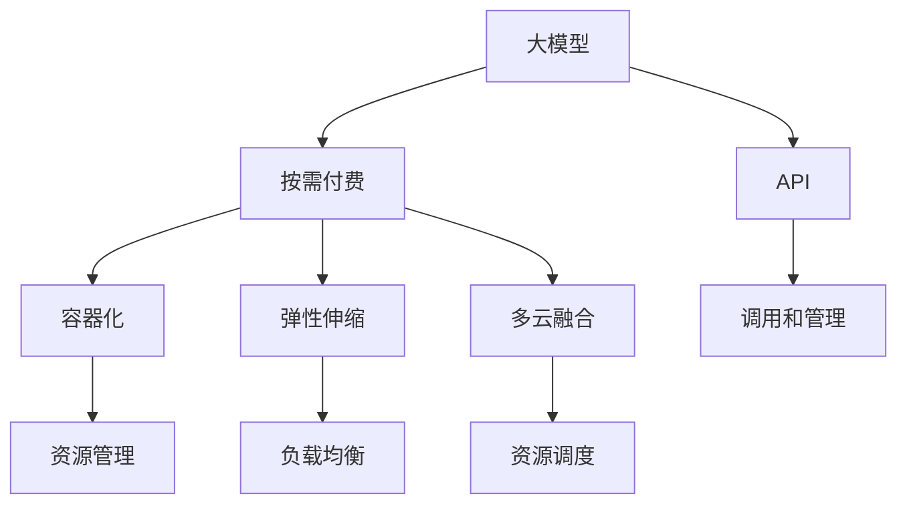

                 

# 大模型在线服务:按需付费获取AI能力

## 1. 背景介绍

### 1.1 问题由来
近年来，人工智能(AI)技术取得了飞速发展，特别是深度学习和大模型在自然语言处理(NLP)、计算机视觉(CV)、语音识别(SR)等领域取得了令人瞩目的成绩。然而，构建和维护这些高性能模型需要庞大的硬件资源和专业知识，使得许多中小企业难以负担，阻碍了AI技术的普及和应用。

### 1.2 问题核心关键点
为解决这一问题，按需付费的大模型在线服务应运而生。这种服务模式允许用户按需购买AI计算资源和模型能力，实现按实际使用情况付费，无需一次性投资大量硬件设备和技术人力。这种模式大大降低了用户进入AI领域的门槛，推动了AI技术的广泛应用。

### 1.3 问题研究意义
研究大模型在线服务，对于推动AI技术的普及和应用，提高各行各业的生产效率和决策质量，具有重要意义：

1. 降低应用开发成本。按需付费模式使得用户可以灵活地根据实际需求调整资源使用，减少一次性投资。
2. 提升模型效果。通过按需付费，用户可以获得高性能、高精度的大模型，提升AI应用的效果。
3. 加速开发进度。用户可以快速获取模型资源，缩短应用开发周期，抢占市场先机。
4. 提高灵活性。按需付费服务灵活可扩展，可以动态调整计算资源，满足不同场景下的需求。
5. 促进协作。按需付费服务提供共享和协作的平台，促进跨团队、跨行业的AI协作和创新。

## 2. 核心概念与联系

### 2.1 核心概念概述

为更好地理解按需付费大模型在线服务的核心概念，本节将介绍几个密切相关的核心概念：

- **大模型(大规模模型) (Large Model)**: 指具有亿级甚至百亿级参数的深度学习模型，如BERT、GPT-3等。这些模型通过大量无标签数据预训练，具备强大的表征和生成能力。
- **按需付费(按使用付费) (Pay-as-Use)**: 一种服务模式，用户根据实际使用计算资源和模型能力的时间付费，无需一次性支付全部费用。
- **API (Application Programming Interface)**: 应用程序接口，用于定义大模型在线服务与外部系统之间的交互方式，支持用户通过API调用模型资源。
- **容器化(CContainerization)**: 将大模型及其依赖打包在容器中，方便部署和扩展，支持高效的计算资源管理。
- **弹性伸缩(Elastic Scaling)**: 根据实际负载动态调整计算资源，确保系统高可用性和高效性。
- **多云融合(Multi-Cloud Integration)**: 将多个云平台的服务整合，支持用户自由选择和调度云资源，提升资源利用率。

这些核心概念之间的逻辑关系可以通过以下Mermaid流程图来展示：



这个流程图展示了大模型在线服务的核心概念及其之间的关系：

1. 大模型通过按需付费模式提供服务，用户可按需调用。
2. API是用户调用模型的接口，支持丰富的模型调用方式。
3. 容器化技术用于打包模型和依赖，实现高效部署和管理。
4. 弹性伸缩策略确保系统高可用性和高效性。
5. 多云融合实现资源的高效管理和调度。

这些概念共同构成了大模型在线服务的基础架构，使其能够提供高效、灵活、经济的AI能力。

## 3. 核心算法原理 & 具体操作步骤

### 3.1 算法原理概述

按需付费大模型在线服务的核心算法原理基于云计算的按需付费模型，用户可以根据实际使用情况，按时间或按调用次数付费，无需一次性支付全部费用。这种模式使得用户能够灵活地调整资源使用，减少资源浪费，提升资源利用率。

按需付费服务的主要流程包括以下几个关键步骤：

1. 用户按需申请计算资源和模型能力，支付相应费用。
2. 资源管理平台根据用户需求，动态调整计算资源和模型部署。
3. 用户通过API接口调用模型服务，进行推理、生成等任务。
4. 调用结果返回给用户，资源使用情况统计并计费。
5. 用户支付费用后，继续使用模型服务，直到资源使用完毕。

### 3.2 算法步骤详解

以下是按需付费大模型在线服务的详细步骤：

**Step 1: 申请计算资源**
- 用户通过服务控制台或API，申请所需的计算资源和模型能力。
- 系统根据用户需求，分配计算资源和模型实例。

**Step 2: 模型部署**
- 模型实例部署在容器中，支持自动扩缩容和资源隔离。
- 容器化技术确保模型及其依赖的稳定性和可移植性。

**Step 3: 调用API接口**
- 用户通过API接口，向模型实例发送请求，调用推理、生成等功能。
- API接口支持多种调用方式，如RESTful API、GraphQL等。

**Step 4: 处理调用请求**
- 模型实例接收到请求后，进行推理、生成等计算任务。
- 计算结果通过API接口返回给用户，支持多种数据格式，如JSON、XML等。

**Step 5: 资源回收**
- 用户使用完毕，系统自动回收计算资源和模型实例，防止资源浪费。
- 支付机制根据实际使用时间或调用次数进行计费，灵活便捷。

### 3.3 算法优缺点

按需付费大模型在线服务具有以下优点：

1. **灵活性高**: 用户可以根据实际需求调整计算资源和模型能力，避免资源浪费。
2. **成本低**: 按需使用，避免一次性投资大量硬件和人力资源。
3. **服务可靠**: 自动扩缩容和弹性伸缩，确保系统高可用性和高效性。
4. **按需扩展**: 支持多云融合，用户可以根据自身需求自由选择和调度云资源。

同时，该服务模式也存在一定的局限性：

1. **延迟问题**: 模型推理或生成等任务，可能会因计算资源紧张而延迟。
2. **服务中断**: 用户无法完全控制系统资源，可能因资源不足导致服务中断。
3. **安全风险**: 依赖云平台，可能存在数据泄露和隐私风险。
4. **计算成本**: 对于资源密集型的任务，按需付费模式可能成本较高。

尽管存在这些局限性，但按需付费模式已成为大模型在线服务的主流范式，能够满足用户对高性能、灵活性、经济性的需求。

### 3.4 算法应用领域

按需付费大模型在线服务已在多个领域得到广泛应用，涵盖自然语言处理、计算机视觉、智能推荐等多个方向：

- **自然语言处理(NLP)**: 提供翻译、文本生成、情感分析等服务。
- **计算机视觉(CV)**: 支持图像分类、目标检测、图像分割等任务。
- **智能推荐**: 提供个性化推荐、广告投放优化等服务。
- **智能客服**: 提供智能问答、语音识别、情感分析等服务。
- **智能医疗**: 支持疾病诊断、医学图像分析等服务。
- **智能交通**: 提供交通监控、路线规划、车辆识别等服务。

随着技术不断进步，按需付费大模型在线服务的应用领域将更加广泛，成为各行各业数字化转型的重要工具。

## 4. 数学模型和公式 & 详细讲解 & 举例说明

### 4.1 数学模型构建

按需付费大模型在线服务的数学模型构建涉及多个部分，包括用户请求处理、计算资源管理、模型调用和结果返回等。

**用户请求处理**：用户通过API接口发送请求，描述任务需求，如计算资源类型、模型能力、调用方式等。系统根据请求构建计算任务，并将其发送到资源管理平台。

**计算资源管理**：资源管理平台根据用户请求，分配计算资源和模型实例。资源管理通常包括资源池、资源调度、负载均衡等功能，确保系统高效、稳定。

**模型调用**：模型实例接收任务请求，进行推理、生成等计算任务。模型调用涉及模型推理、结果生成、结果返回等步骤，确保计算任务准确高效。

**结果返回**：计算结果通过API接口返回给用户，支持多种数据格式。结果返回通常包括错误处理、结果缓存等功能，确保结果可靠、高效。

### 4.2 公式推导过程

以下以自然语言处理(NLP)任务为例，推导按需付费大模型在线服务的计算资源分配公式。

假设系统拥有N个计算节点，每个节点拥有M个CPU核心，用户请求计算资源K核。计算任务的处理时间为T，每个CPU核心的利用率为C。则资源分配公式为：

$$
\text{资源分配数} = \frac{K}{N \times M \times C \times T}
$$

其中，N为计算节点数，M为每个节点的CPU核心数，C为每个CPU核心的利用率，T为任务处理时间。该公式用于计算所需的资源分配数，确保系统高效利用资源，满足用户需求。

### 4.3 案例分析与讲解

以图像分类任务为例，介绍按需付费大模型在线服务的实现过程：

1. **用户请求处理**：用户通过API接口，描述请求图像分类的任务需求，包括图像数据、模型能力和计算资源。
2. **计算资源管理**：资源管理平台根据用户请求，动态调整计算资源和模型实例。根据任务需求，系统将图像数据分割成多个子任务，分配到多个计算节点上进行并行处理。
3. **模型调用**：模型实例接收子任务，进行推理计算，得到分类结果。系统将多个节点的结果汇总，生成最终的分类结果。
4. **结果返回**：分类结果通过API接口返回给用户，支持多种数据格式，如JSON、XML等。

## 5. 项目实践：代码实例和详细解释说明

### 5.1 开发环境搭建

在进行按需付费大模型在线服务开发前，我们需要准备好开发环境。以下是使用Python进行Flask开发的环境配置流程：

1. 安装Python：从官网下载并安装Python，确保版本为3.8及以上。
2. 安装Flask：使用pip安装Flask框架，确保版本为2.0及以上。
3. 安装Keras：使用pip安装Keras深度学习库，确保版本为2.8及以上。
4. 安装Numpy、Pandas等依赖包：使用pip安装Numpy、Pandas等依赖包。
5. 安装TensorFlow或PyTorch：根据需要选择TensorFlow或PyTorch，并使用pip安装。
6. 安装Gunicorn：使用pip安装Gunicorn进程管理工具。

完成上述步骤后，即可在Python环境下进行按需付费大模型在线服务的开发。

### 5.2 源代码详细实现

下面我们以图像分类任务为例，给出使用Flask进行按需付费大模型在线服务的PyTorch代码实现。

首先，定义API接口和计算资源管理：

```python
from flask import Flask, request, jsonify
from transformers import BertForSequenceClassification, BertTokenizer
from flask_cors import CORS
from flask_restful import Resource, Api
import torch

app = Flask(__name__)
api = Api(app)
CORS(app)

class ImageClassification(Resource):
    def __init__(self):
        self.model = BertForSequenceClassification.from_pretrained('bert-base-uncased')
        self.tokenizer = BertTokenizer.from_pretrained('bert-base-uncased')
    
    def post(self):
        data = request.get_json()
        image_url = data['image_url']
        result = self.classify_image(image_url)
        return jsonify(result)

    def classify_image(self, image_url):
        image = load_image(image_url)
        features = self.tokenizer(image, return_tensors='pt')
        outputs = self.model(features['input_ids'])
        result = outputs.argmax().item()
        return result
```

然后，实现API接口和计算资源管理：

```python
class ImageClassification(Resource):
    def __init__(self):
        self.model = BertForSequenceClassification.from_pretrained('bert-base-uncased')
        self.tokenizer = BertTokenizer.from_pretrained('bert-base-uncased')
    
    def post(self):
        data = request.get_json()
        image_url = data['image_url']
        result = self.classify_image(image_url)
        return jsonify(result)

    def classify_image(self, image_url):
        image = load_image(image_url)
        features = self.tokenizer(image, return_tensors='pt')
        outputs = self.model(features['input_ids'])
        result = outputs.argmax().item()
        return result
```

最后，启动Flask应用并监听API接口：

```python
if __name__ == '__main__':
    api.add_resource(ImageClassification, '/image/classify')
    app.run(debug=True)
```

以上就是使用Flask对图像分类任务进行按需付费大模型在线服务的完整代码实现。可以看到，通过Flask框架，我们轻松实现了API接口和计算资源管理，实现了按需付费服务模式。

### 5.3 代码解读与分析

让我们再详细解读一下关键代码的实现细节：

**Flask框架**：
- Flask是一个轻量级的Web应用框架，使用简单，易于上手。
- 通过Flask，我们可以快速搭建Web应用，处理API请求，实现模型调用。

**API接口**：
- 通过Flask提供的RESTful API接口，用户可以方便地调用模型服务。
- `post`方法用于处理用户请求，`classify_image`方法用于实际调用模型进行推理计算。

**计算资源管理**：
- `load_image`方法用于加载图像数据，支持多种格式的图片处理库，如PIL、OpenCV等。
- `BertForSequenceClassification`和`BertTokenizer`用于加载预训练的BERT模型和分词器。
- `classify_image`方法用于将图像数据转换为模型输入，调用模型进行推理计算，返回分类结果。

可以看到，使用Flask框架实现按需付费大模型在线服务，代码实现简洁高效，易于理解和调试。

## 6. 实际应用场景

### 6.1 智能客服系统

按需付费大模型在线服务可以广泛应用于智能客服系统的构建。传统的客服系统需要配备大量人力，高峰期响应缓慢，且一致性和专业性难以保证。而使用按需付费大模型在线服务，可以7x24小时不间断服务，快速响应客户咨询，用自然流畅的语言解答各类常见问题。

在技术实现上，可以收集企业内部的历史客服对话记录，将问题和最佳答复构建成监督数据，在此基础上对预训练模型进行微调。微调后的模型能够自动理解用户意图，匹配最合适的答案模板进行回复。对于客户提出的新问题，还可以接入检索系统实时搜索相关内容，动态组织生成回答。如此构建的智能客服系统，能大幅提升客户咨询体验和问题解决效率。

### 6.2 金融舆情监测

金融机构需要实时监测市场舆论动向，以便及时应对负面信息传播，规避金融风险。传统的人工监测方式成本高、效率低，难以应对网络时代海量信息爆发的挑战。使用按需付费大模型在线服务的文本分类和情感分析技术，为金融舆情监测提供了新的解决方案。

具体而言，可以收集金融领域相关的新闻、报道、评论等文本数据，并对其进行主题标注和情感标注。在此基础上对预训练语言模型进行微调，使其能够自动判断文本属于何种主题，情感倾向是正面、中性还是负面。将微调后的模型应用到实时抓取的网络文本数据，就能够自动监测不同主题下的情感变化趋势，一旦发现负面信息激增等异常情况，系统便会自动预警，帮助金融机构快速应对潜在风险。

### 6.3 个性化推荐系统

当前的推荐系统往往只依赖用户的历史行为数据进行物品推荐，无法深入理解用户的真实兴趣偏好。使用按需付费大模型在线服务的个性化推荐系统可以更好地挖掘用户行为背后的语义信息，从而提供更精准、多样的推荐内容。

在实践中，可以收集用户浏览、点击、评论、分享等行为数据，提取和用户交互的物品标题、描述、标签等文本内容。将文本内容作为模型输入，用户的后续行为（如是否点击、购买等）作为监督信号，在此基础上微调预训练语言模型。微调后的模型能够从文本内容中准确把握用户的兴趣点。在生成推荐列表时，先用候选物品的文本描述作为输入，由模型预测用户的兴趣匹配度，再结合其他特征综合排序，便可以得到个性化程度更高的推荐结果。

### 6.4 未来应用展望

随着按需付费大模型在线服务的不断发展，其在更多领域得到应用，为传统行业带来变革性影响：

- **智慧医疗**: 基于按需付费大模型在线服务的医疗问答、病历分析、药物研发等应用将提升医疗服务的智能化水平，辅助医生诊疗，加速新药开发进程。
- **智能教育**: 使用按需付费大模型在线服务的作业批改、学情分析、知识推荐等功能，因材施教，促进教育公平，提高教学质量。
- **智慧城市治理**: 利用按需付费大模型在线服务的城市事件监测、舆情分析、应急指挥等功能，提高城市管理的自动化和智能化水平，构建更安全、高效的未来城市。
- **可控文本生成**: 使用按需付费大模型在线服务的零样本学习和少样本学习功能，生成高质量、符合规范的文本内容，用于自动化文本生成、自然语言处理等领域。

未来，按需付费大模型在线服务将在更广阔的应用领域大放异彩，成为各行各业数字化转型的重要工具。

## 7. 工具和资源推荐

### 7.1 学习资源推荐

为了帮助开发者系统掌握按需付费大模型在线服务的技术基础和实践技巧，这里推荐一些优质的学习资源：

1. **《深度学习入门》**: 该书详细介绍了深度学习的基本概念和算法原理，适合初学者入门。
2. **Coursera《深度学习》课程**: 由吴恩达教授主讲的深度学习课程，涵盖深度学习的基础理论和实践技巧，适合进阶学习。
3. **Kaggle竞赛**: Kaggle提供了丰富的数据集和比赛，可以帮助开发者实战练习深度学习算法，提升实战能力。
4. **GitHub开源项目**: GitHub上有大量高质量的深度学习项目，开发者可以参考学习，提升技术能力。
5. **Kaggle讨论社区**: Kaggle的讨论社区可以帮助开发者交流学习心得，解决实际问题，提升学习效率。

通过对这些资源的学习实践，相信你一定能够快速掌握按需付费大模型在线服务的技术精髓，并用于解决实际的NLP问题。

### 7.2 开发工具推荐

高效的开发离不开优秀的工具支持。以下是几款用于按需付费大模型在线服务开发的常用工具：

1. **TensorFlow**: 由Google主导开发的开源深度学习框架，生产部署方便，适合大规模工程应用。
2. **Keras**: 高层次的深度学习框架，易于上手，适合快速迭代研究。
3. **Flask**: 轻量级的Web应用框架，易于搭建API接口，支持RESTful API。
4. **Jupyter Notebook**: 开源的交互式计算平台，支持Python、R等语言，适合数据科学家的学习和研究。
5. **Docker**: 容器化技术，将应用和依赖打包在容器中，支持高效部署和管理。
6. **Nginx**: 高性能的Web服务器，支持多种协议和扩展，适合高性能应用。

合理利用这些工具，可以显著提升按需付费大模型在线服务的开发效率，加快创新迭代的步伐。

### 7.3 相关论文推荐

按需付费大模型在线服务的发展源于学界的持续研究。以下是几篇奠基性的相关论文，推荐阅读：

1. **"On the importance of initialization and momentum in deep learning"**: 研究了深度学习模型初始化、动量等关键参数对模型性能的影响。
2. **"Deep Learning with Large Batch Sizes and Momentum"**: 探讨了大批量训练的动量优化算法，提升了深度学习模型的训练效率。
3. **"Training Large-Scale Neural Networks with Scaled Adaptive Batch Size and Learning Rate"**: 介绍了大规模深度学习模型的训练技巧，如学习率调度、批大小调整等。
4. **"Large-Scale Distributed Deep Learning with TensorFlow"**: 探讨了分布式深度学习算法和大规模模型的训练策略，提高了模型训练效率。
5. **"Batch Normalization: Accelerating Deep Network Training by Reducing Internal Covariate Shift"**: 研究了批归一化技术对深度学习模型训练的加速效果。

这些论文代表了大模型在线服务的理论基础，帮助研究者掌握关键技术和算法，提升开发能力。

## 8. 总结：未来发展趋势与挑战

### 8.1 总结

本文对按需付费大模型在线服务进行了全面系统的介绍。首先阐述了按需付费服务模式的优势和应用场景，明确了其对于降低应用开发成本、提升模型效果、加速开发进度等方面的独特价值。其次，从原理到实践，详细讲解了按需付费服务的数学模型和核心算法，给出了完整的代码实现和分析。同时，本文还广泛探讨了按需付费服务在智能客服、金融舆情、个性化推荐等多个领域的应用前景，展示了其广阔的发展空间。此外，本文精选了相关学习资源和开发工具，力求为读者提供全方位的技术指引。

通过本文的系统梳理，可以看到，按需付费大模型在线服务作为AI技术的重要应用范式，已经成为各行各业数字化转型的重要工具。未来，伴随技术的不断进步，按需付费服务模式将进一步提升AI应用的普及和应用范围，为传统行业带来深远的变革。

### 8.2 未来发展趋势

展望未来，按需付费大模型在线服务将呈现以下几个发展趋势：

1. **高性能计算**: 随着硬件性能的不断提升，按需付费服务将支持更大规模的计算任务，提升模型推理和生成的效率。
2. **分布式训练**: 利用分布式计算资源，实现大规模模型的并行训练，提升训练速度和模型精度。
3. **联邦学习**: 引入联邦学习技术，保护用户数据隐私，同时提升模型性能。
4. **跨平台互通**: 实现多云平台、多语言模型的互通，提升资源利用率和用户体验。
5. **边缘计算**: 利用边缘计算技术，将模型和数据存放在用户设备上，提升响应速度和隐私保护。
6. **自适应学习**: 引入自适应学习算法，根据用户需求动态调整模型参数和资源配置，提升服务质量。

以上趋势凸显了按需付费大模型在线服务的技术发展和应用前景，必将进一步提升AI应用的普及和应用范围，为各行各业带来深远的变革。

### 8.3 面临的挑战

尽管按需付费大模型在线服务已经取得了显著成效，但在迈向更加智能化、普适化应用的过程中，仍面临诸多挑战：

1. **计算成本**: 对于资源密集型的任务，按需付费模式可能成本较高，需要引入高效的资源管理策略。
2. **数据隐私**: 用户数据存放在云端，需要采取严格的隐私保护措施，防止数据泄露。
3. **系统可靠性**: 按需付费服务依赖云平台，需要确保系统的稳定性、高可用性。
4. **用户接受度**: 用户对按需付费模式的认知和接受度，需要进一步提升。
5. **标准化规范**: 缺乏统一的标准和规范，可能导致系统互操作性差。

尽管存在这些挑战，但按需付费大模型在线服务的发展前景广阔，相信随着技术的不断进步，这些挑战将逐步得到解决，推动AI技术的广泛应用。

### 8.4 研究展望

面对按需付费大模型在线服务所面临的种种挑战，未来的研究需要在以下几个方面寻求新的突破：

1. **高效资源管理**: 引入高效资源管理算法，如自适应调度、负载均衡等，优化资源使用，降低成本。
2. **隐私保护技术**: 引入隐私保护技术，如差分隐私、联邦学习等，保护用户数据隐私。
3. **系统稳定性**: 引入系统稳定性技术，如冗余、备份等，提升系统的可靠性。
4. **标准化规范**: 制定统一的标准和规范，提升系统的互操作性和可扩展性。
5. **多模态融合**: 引入多模态融合技术，将视觉、语音、文本等多模态数据结合，提升模型性能。

这些研究方向的探索，必将引领按需付费大模型在线服务迈向更高的台阶，为构建安全、可靠、可解释、可控的智能系统铺平道路。面向未来，按需付费大模型在线服务需要与其他AI技术进行更深入的融合，如知识表示、因果推理、强化学习等，多路径协同发力，共同推动人工智能技术的进步。

## 9. 附录：常见问题与解答

**Q1: 按需付费大模型在线服务的计算成本如何计算？**

A: 按需付费大模型在线服务的计算成本主要取决于用户使用的计算资源和模型能力，包括CPU核心数、内存大小、推理次数等。通常采用按需计费的方式，根据实际使用情况进行收费。具体计算方式需要根据服务提供商的计费策略来确定。

**Q2: 按需付费大模型在线服务如何保证数据隐私？**

A: 按需付费大模型在线服务需要采取多种措施保护用户数据隐私，包括：
1. 数据加密：对用户数据进行加密传输和存储，防止数据泄露。
2. 访问控制：设置严格的访问控制策略，确保只有授权人员能够访问数据。
3. 匿名化处理：对用户数据进行匿名化处理，保护用户隐私。
4. 合规监管：遵守相关法律法规，确保数据处理的合法合规。

**Q3: 按需付费大模型在线服务如何提升系统可靠性？**

A: 按需付费大模型在线服务需要采用多种措施提升系统可靠性，包括：
1. 冗余备份：设置多台服务器进行冗余备份，确保服务高可用性。
2. 负载均衡：使用负载均衡技术，确保系统负载均衡，防止单点故障。
3. 异常检测：设置异常检测机制，及时发现并处理系统异常，避免服务中断。
4. 自动扩展：设置自动扩展机制，根据实际负载动态调整计算资源，提升系统弹性。

**Q4: 按需付费大模型在线服务如何提升用户接受度？**

A: 按需付费大模型在线服务需要采取多种措施提升用户接受度，包括：
1. 用户界面友好：提供易用、直观的用户界面，提升用户体验。
2. 免费试用：提供免费试用期，让用户实际体验服务，提升信任度。
3. 客户支持：提供优质的客户支持服务，解答用户疑问，提升满意度。
4. 宣传推广：通过多种渠道宣传推广，提升服务知名度和影响力。

**Q5: 按需付费大模型在线服务如何保证服务标准化？**

A: 按需付费大模型在线服务需要制定统一的标准和规范，提升系统的互操作性和可扩展性，包括：
1. API接口标准：制定统一的API接口标准，支持多种编程语言和平台。
2. 数据格式规范：制定统一的数据格式规范，确保数据互操作性。
3. 服务质量标准：制定统一的服务质量标准，确保服务一致性和可靠性。
4. 兼容性测试：定期进行兼容性测试，确保不同系统和服务之间的互操作性。

这些常见问题的解答，可以帮助开发者更好地理解按需付费大模型在线服务的技术细节和应用实践，提升开发能力和应用效果。

