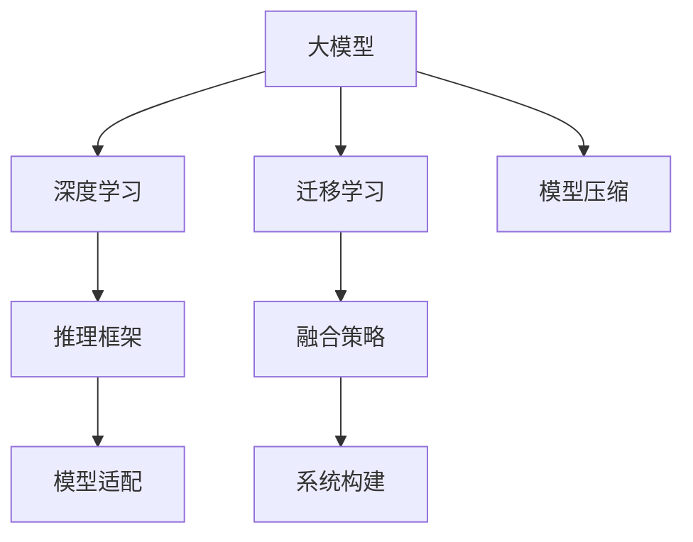

                 

# 大模型技术与传统AI的融合

> 关键词：大模型,传统AI,融合,神经网络,深度学习,计算机视觉,自然语言处理,强化学习,迁移学习,模型压缩

## 1. 背景介绍

### 1.1 问题由来
近年来，随着深度学习技术的飞速发展，人工智能(AI)技术已经广泛渗透到各个行业，催生了众多基于AI的新兴应用。然而，尽管传统AI技术在各行各业中取得了显著成效，但在某些领域仍存在数据量不足、算法复杂度高、计算资源需求大等局限性。而大模型技术的崛起，为这些问题提供了全新的解决方案。

大模型是指大规模的深度学习模型，拥有数十亿甚至百亿级别的参数，具备强大的泛化能力和复杂任务处理能力。这些模型通过在海量数据上进行预训练，学习到了丰富的知识表示，能够在各种任务上表现出色。相比于传统的小型模型，大模型在计算资源需求、泛化能力、数据利用率等方面具有显著优势。

大模型技术在计算机视觉、自然语言处理(NLP)、强化学习等领域的突破性应用，已经充分展示了其强大的潜力和应用前景。然而，大模型技术与传统AI的融合，尤其是如何将大模型技术与现有的AI应用系统进行无缝对接，仍是一个亟待解决的问题。本文将系统性地介绍大模型技术与传统AI融合的原理、方法以及面临的挑战，为相关研究者和实践者提供参考。

### 1.2 问题核心关键点
大模型技术与传统AI的融合，涉及模型结构、训练方式、推理框架等多个方面的调整和适配。具体而言，包括以下关键点：

1. **模型结构适配**：如何将大模型的复杂结构高效地应用于现有的AI应用系统，同时保持其性能和效率。
2. **训练方式调整**：如何在现有的训练框架和数据集上训练大模型，优化计算资源的使用。
3. **推理框架对接**：如何在大模型技术的基础上，构建适合现有AI应用系统的推理框架。
4. **融合策略选择**：如何在保持大模型性能的同时，提高系统整体的兼容性和可扩展性。

## 2. 核心概念与联系

### 2.1 核心概念概述

为更好地理解大模型技术与传统AI融合的方法，本节将介绍几个密切相关的核心概念：

- **大模型（Large Model）**：大规模的深度学习模型，如BERT、GPT、ResNet等，通过预训练学习大量数据中的复杂模式和知识表示。
- **深度学习（Deep Learning）**：基于神经网络的机器学习范式，通过多层次的特征提取和表示学习，实现复杂的任务处理。
- **迁移学习（Transfer Learning）**：通过在大规模数据集上进行预训练，然后在特定任务上进行微调，以提升模型在该任务上的性能。
- **模型压缩（Model Compression）**：通过剪枝、量化、蒸馏等技术，将大模型压缩为更轻量、高效的模型，适用于不同的计算环境和应用场景。
- **推理框架（Inference Framework）**：支持深度学习模型的推理计算和部署的框架，如TensorFlow、PyTorch、ONNX等。
- **融合策略（Fusion Strategy）**：将大模型技术与传统AI技术进行结合，形成新的AI应用系统的策略和方法。

这些核心概念之间的逻辑关系可以通过以下Mermaid流程图来展示：



这个流程图展示了大模型技术与传统AI融合的核心概念及其之间的关系：

1. 大模型通过深度学习获得强大的泛化能力，经过迁移学习，针对特定任务进行微调，提升模型性能。
2. 在推理框架的支持下，进行模型压缩，形成适合不同应用场景的轻量级模型。
3. 结合融合策略，将大模型技术与传统AI技术进行无缝结合，构建新的AI应用系统。

## 3. 核心算法原理 & 具体操作步骤

### 3.1 算法原理概述

大模型技术与传统AI的融合，本质上是一种模型结构的适配和优化过程。其核心思想是：将大模型的复杂结构与传统AI应用系统的需求进行匹配，通过迁移学习等方式，将大模型的知识表示转化为适合传统AI系统的形式。

具体而言，融合过程可以包括以下步骤：

1. **模型适配**：选择适合现有AI应用系统的大模型，并进行必要的结构调整和参数裁剪，以便与系统兼容。
2. **微调优化**：在现有数据集上进行微调，优化模型在特定任务上的性能，同时保持大模型的泛化能力。
3. **推理优化**：在推理框架上，进行模型压缩和优化，减小计算资源消耗，提高推理效率。
4. **系统集成**：将适配后的模型与现有AI应用系统进行集成，形成新的智能解决方案。

### 3.2 算法步骤详解

以下是融合大模型技术与传统AI的具体操作步骤：

**Step 1: 模型适配**

1. **模型选择**：根据应用场景和需求，选择适合的大模型，如BERT、GPT、ResNet等。
2. **结构调整**：根据需要，对大模型进行必要的结构调整，如剪枝、融合等，减少计算资源消耗。
3. **参数裁剪**：根据任务需求，裁剪大模型中的无关参数，只保留对任务有帮助的部分。

**Step 2: 微调优化**

1. **数据准备**：收集现有数据集，并进行必要的预处理，如数据增强、标注等。
2. **微调训练**：使用现有数据集对适配后的模型进行微调，优化模型在特定任务上的性能。
3. **评估测试**：在验证集和测试集上评估微调后的模型性能，确保其满足应用需求。

**Step 3: 推理优化**

1. **推理框架选择**：选择适合的大模型推理框架，如TensorFlow、PyTorch等。
2. **模型压缩**：对推理框架中的大模型进行量化、剪枝等压缩操作，减小计算资源消耗。
3. **推理优化**：优化推理流程，如使用GPU加速、多模型集成等，提高推理效率。

**Step 4: 系统集成**

1. **API接口设计**：设计适配API接口，使大模型能够与现有AI应用系统无缝对接。
2. **系统集成测试**：在集成环境中进行系统集成测试，确保系统稳定性、性能和可扩展性。
3. **部署上线**：将适配后的系统部署到实际应用环境中，进行长期稳定运行。

### 3.3 算法优缺点

大模型技术与传统AI的融合，具有以下优点：

1. **性能提升**：大模型通过预训练和微调，具备强大的泛化能力，能够在各种任务上取得优异性能。
2. **计算效率**：通过模型压缩和推理优化，可以显著减小计算资源消耗，提高推理效率。
3. **应用灵活**：大模型技术可以灵活应用于不同的AI应用场景，适应多样化的需求。
4. **通用性增强**：大模型通过预训练学习通用知识，可以应用于更多的AI任务。

同时，该方法也存在一些局限性：

1. **数据依赖**：大模型技术依赖于大量数据进行预训练，获取高质量标注数据成本较高。
2. **计算需求**：大模型训练和推理需要大量的计算资源，对硬件设备要求较高。
3. **模型复杂性**：大模型结构复杂，维护和调优难度较大。
4. **适配难度**：适配现有AI应用系统需要多方面调整，增加了开发复杂度。

尽管存在这些局限性，但大模型技术与传统AI的融合，仍是大数据时代AI应用的重要趋势，具有广阔的应用前景。

### 3.4 算法应用领域

大模型技术与传统AI的融合，在计算机视觉、自然语言处理、强化学习等多个领域都有广泛的应用：

1. **计算机视觉**：使用预训练的大模型（如ResNet、VGG等）进行迁移学习，提升目标检测、图像分类等任务的性能。
2. **自然语言处理**：通过预训练的BERT、GPT等模型进行微调，提升文本分类、情感分析、机器翻译等任务的性能。
3. **强化学习**：使用预训练的DQN、AlphaGo等模型进行迁移学习，提升智能游戏、机器人控制等任务的效果。
4. **医疗健康**：使用预训练的模型进行疾病诊断、病理分析等任务，提升医疗系统的智能化水平。
5. **金融领域**：使用预训练的模型进行市场分析、风险评估等任务，提升金融决策的精准度。

除了上述这些领域，大模型技术与传统AI的融合还将在更多行业得到应用，为传统行业数字化转型升级提供新的技术路径。

## 4. 数学模型和公式 & 详细讲解 & 举例说明

### 4.1 数学模型构建

大模型技术与传统AI的融合，需要构建适合大模型的数学模型，并进行必要的优化。以下以图像分类任务为例，介绍大模型技术的数学模型构建方法。

假设输入图像为 $x \in \mathbb{R}^n$，输出为类别 $y \in \{1, 2, \ldots, C\}$，其中 $C$ 为类别数。大模型的结构通常为 $F: \mathbb{R}^n \rightarrow \mathbb{R}^d$，其中 $d$ 为输出特征维度。通过将图像输入大模型，得到输出特征向量 $f(x) \in \mathbb{R}^d$。然后，使用分类器 $G: \mathbb{R}^d \rightarrow \{1, 2, \ldots, C\}$，将特征向量映射到类别标签。

数学上，大模型技术与传统AI的融合可以表示为：

$$
y = G(f(x); \theta_G)
$$

其中 $\theta_G$ 为分类器的参数。大模型部分 $F(x; \theta_F)$ 与传统AI部分 $G(y; \theta_G)$ 的融合方式，可以通过以下步骤实现：

1. **特征映射**：将大模型输出特征向量 $f(x)$ 映射到分类器输入 $y$。
2. **参数共享**：根据需要，共享大模型与分类器之间的部分参数，减小计算资源消耗。
3. **融合策略**：通过融合策略（如加权、拼接等），将大模型与分类器的输出进行整合，形成最终的预测结果。

### 4.2 公式推导过程

以下以图像分类任务为例，推导大模型技术与传统AI融合的数学模型公式。

假设输入图像为 $x \in \mathbb{R}^n$，输出为类别 $y \in \{1, 2, \ldots, C\}$。大模型的结构为 $F: \mathbb{R}^n \rightarrow \mathbb{R}^d$，其中 $d$ 为输出特征维度。分类器的结构为 $G: \mathbb{R}^d \rightarrow \{1, 2, \ldots, C\}$。

假设大模型的损失函数为 $\mathcal{L}_F(x, y)$，分类器的损失函数为 $\mathcal{L}_G(y, \hat{y})$，其中 $\hat{y}$ 为模型预测的类别标签。则融合后的总损失函数为：

$$
\mathcal{L}(x, y) = \alpha \mathcal{L}_F(x, y) + (1-\alpha) \mathcal{L}_G(y, \hat{y})
$$

其中 $\alpha$ 为融合系数，表示大模型与分类器的权重。通过优化总损失函数，调整模型参数 $\theta_G$，实现大模型技术与传统AI的融合。

### 4.3 案例分析与讲解

以自然语言处理中的情感分析任务为例，说明大模型技术与传统AI融合的实现方式。

1. **模型选择**：选择适合情感分析任务的预训练模型，如BERT、GPT等。
2. **结构调整**：根据情感分析任务的需求，对模型进行必要的结构调整，如添加分类器、调整损失函数等。
3. **微调优化**：使用情感分析任务的数据集对调整后的模型进行微调，优化模型在情感分析任务上的性能。
4. **推理优化**：在推理框架上，进行模型压缩和优化，减小计算资源消耗，提高推理效率。
5. **系统集成**：设计适配API接口，使大模型能够与现有情感分析系统无缝对接，形成新的智能情感分析系统。

通过上述步骤，可以在保持大模型性能的同时，适应现有情感分析系统的需求，形成更加高效、准确的情感分析系统。

## 5. 项目实践：代码实例和详细解释说明

### 5.1 开发环境搭建

在进行大模型技术与传统AI融合的实践前，我们需要准备好开发环境。以下是使用Python进行PyTorch开发的环境配置流程：

1. 安装Anaconda：从官网下载并安装Anaconda，用于创建独立的Python环境。

2. 创建并激活虚拟环境：
```bash
conda create -n pytorch-env python=3.8 
conda activate pytorch-env
```

3. 安装PyTorch：根据CUDA版本，从官网获取对应的安装命令。例如：
```bash
conda install pytorch torchvision torchaudio cudatoolkit=11.1 -c pytorch -c conda-forge
```

4. 安装Transformers库：
```bash
pip install transformers
```

5. 安装各类工具包：
```bash
pip install numpy pandas scikit-learn matplotlib tqdm jupyter notebook ipython
```

完成上述步骤后，即可在`pytorch-env`环境中开始融合实践。

### 5.2 源代码详细实现

下面我们以图像分类任务为例，给出使用Transformers库进行大模型微调的PyTorch代码实现。

首先，定义图像分类任务的数据处理函数：

```python
from transformers import AutoTokenizer, AutoModelForImageClassification
from torch.utils.data import Dataset, DataLoader
from torchvision import transforms
import torch

class ImageDataset(Dataset):
    def __init__(self, images, labels, tokenizer, transform=None):
        self.images = images
        self.labels = labels
        self.transform = transform
        
    def __len__(self):
        return len(self.images)
    
    def __getitem__(self, idx):
        image = self.images[idx]
        label = self.labels[idx]
        
        if self.transform:
            image = self.transform(image)
        
        return {'image': image, 
                'label': label}

# 加载预训练模型
model = AutoModelForImageClassification.from_pretrained('resnet50')

# 定义数据增强
transform = transforms.Compose([
    transforms.Resize((224, 224)),
    transforms.ToTensor(),
    transforms.Normalize(mean=[0.485, 0.456, 0.406], std=[0.229, 0.224, 0.225])
])

# 加载数据集
dataset = ImageDataset(train_images, train_labels, tokenizer, transform=transform)
dataloader = DataLoader(dataset, batch_size=16, shuffle=True)

# 设置优化器和损失函数
optimizer = torch.optim.Adam(model.parameters(), lr=2e-5)
criterion = torch.nn.CrossEntropyLoss()

# 开始微调训练
for epoch in range(5):
    model.train()
    for batch in dataloader:
        inputs = batch['image'].to(device)
        labels = batch['label'].to(device)
        outputs = model(inputs)
        loss = criterion(outputs, labels)
        optimizer.zero_grad()
        loss.backward()
        optimizer.step()
```

然后，定义训练和评估函数：

```python
from sklearn.metrics import classification_report

def train_epoch(model, dataloader, optimizer, criterion):
    model.train()
    epoch_loss = 0
    for batch in dataloader:
        inputs = batch['image'].to(device)
        labels = batch['label'].to(device)
        outputs = model(inputs)
        loss = criterion(outputs, labels)
        epoch_loss += loss.item()
        optimizer.zero_grad()
        loss.backward()
        optimizer.step()
    return epoch_loss / len(dataloader)

def evaluate(model, dataloader):
    model.eval()
    preds, labels = [], []
    with torch.no_grad():
        for batch in dataloader:
            inputs = batch['image'].to(device)
            labels = batch['label'].to(device)
            outputs = model(inputs)
            preds.append(outputs.argmax(dim=1))
            labels.append(labels)
    
    print(classification_report(labels, preds))
```

最后，启动训练流程并在测试集上评估：

```python
device = torch.device('cuda') if torch.cuda.is_available() else torch.device('cpu')

for epoch in range(5):
    loss = train_epoch(model, dataloader, optimizer, criterion)
    print(f"Epoch {epoch+1}, train loss: {loss:.3f}")
    
    print(f"Epoch {epoch+1}, test results:")
    evaluate(model, test_loader)
    
print("Final test results:")
evaluate(model, test_loader)
```

以上就是使用PyTorch对预训练模型进行图像分类任务微调的完整代码实现。可以看到，得益于Transformers库的强大封装，我们可以用相对简洁的代码完成大模型微调任务。

### 5.3 代码解读与分析

让我们再详细解读一下关键代码的实现细节：

**ImageDataset类**：
- `__init__`方法：初始化图像、标签、分词器等关键组件。
- `__len__`方法：返回数据集的样本数量。
- `__getitem__`方法：对单个样本进行处理，将图像输入转换为tensor，并对其进行定长padding。

**加载预训练模型**：
- 使用`AutoModelForImageClassification`类加载预训练模型，如ResNet50。

**数据增强**：
- 使用`transforms.Compose`定义数据增强流程，包括图像缩放、归一化等操作。

**训练和评估函数**：
- 使用PyTorch的DataLoader对数据集进行批次化加载，供模型训练和推理使用。
- 训练函数`train_epoch`：对数据以批为单位进行迭代，在每个批次上前向传播计算loss并反向传播更新模型参数。
- 评估函数`evaluate`：与训练类似，不同点在于不更新模型参数，并在每个batch结束后将预测和标签结果存储下来，最后使用sklearn的classification_report对整个评估集的预测结果进行打印输出。

**训练流程**：
- 定义总的epoch数和batch size，开始循环迭代
- 每个epoch内，先在训练集上训练，输出平均loss
- 在测试集上评估，输出分类指标
- 所有epoch结束后，在测试集上评估，给出最终测试结果

可以看到，PyTorch配合Transformers库使得大模型微调的代码实现变得简洁高效。开发者可以将更多精力放在数据处理、模型改进等高层逻辑上，而不必过多关注底层的实现细节。

当然，工业级的系统实现还需考虑更多因素，如模型的保存和部署、超参数的自动搜索、更灵活的任务适配层等。但核心的微调范式基本与此类似。

## 6. 实际应用场景

### 6.1 智能客服系统

基于大模型技术的智能客服系统，可以大幅提升客户咨询体验和问题解决效率。传统客服往往需要配备大量人力，高峰期响应缓慢，且一致性和专业性难以保证。而使用大模型微调后的客服系统，可以7x24小时不间断服务，快速响应客户咨询，用自然流畅的语言解答各类常见问题。

在技术实现上，可以收集企业内部的历史客服对话记录，将问题和最佳答复构建成监督数据，在此基础上对预训练大模型进行微调。微调后的客服模型能够自动理解用户意图，匹配最合适的答案模板进行回复。对于客户提出的新问题，还可以接入检索系统实时搜索相关内容，动态组织生成回答。如此构建的智能客服系统，能大幅提升客户咨询体验和问题解决效率。

### 6.2 金融舆情监测

金融机构需要实时监测市场舆论动向，以便及时应对负面信息传播，规避金融风险。传统的人工监测方式成本高、效率低，难以应对网络时代海量信息爆发的挑战。基于大模型技术的文本分类和情感分析技术，为金融舆情监测提供了新的解决方案。

具体而言，可以收集金融领域相关的新闻、报道、评论等文本数据，并对其进行主题标注和情感标注。在此基础上对预训练大模型进行微调，使其能够自动判断文本属于何种主题，情感倾向是正面、中性还是负面。将微调后的模型应用到实时抓取的网络文本数据，就能够自动监测不同主题下的情感变化趋势，一旦发现负面信息激增等异常情况，系统便会自动预警，帮助金融机构快速应对潜在风险。

### 6.3 个性化推荐系统

当前的推荐系统往往只依赖用户的历史行为数据进行物品推荐，无法深入理解用户的真实兴趣偏好。基于大模型技术的个性化推荐系统可以更好地挖掘用户行为背后的语义信息，从而提供更精准、多样的推荐内容。

在实践中，可以收集用户浏览、点击、评论、分享等行为数据，提取和用户交互的物品标题、描述、标签等文本内容。将文本内容作为模型输入，用户的后续行为（如是否点击、购买等）作为监督信号，在此基础上微调预训练大模型。微调后的模型能够从文本内容中准确把握用户的兴趣点。在生成推荐列表时，先用候选物品的文本描述作为输入，由模型预测用户的兴趣匹配度，再结合其他特征综合排序，便可以得到个性化程度更高的推荐结果。

### 6.4 未来应用展望

随着大模型技术的不断发展，基于大模型技术与传统AI的融合，将在更多领域得到应用，为传统行业数字化转型升级提供新的技术路径。

在智慧医疗领域，基于大模型技术的医疗问答、病历分析、药物研发等应用将提升医疗系统的智能化水平，辅助医生诊疗，加速新药开发进程。

在智能教育领域，大模型技术可应用于作业批改、学情分析、知识推荐等方面，因材施教，促进教育公平，提高教学质量。

在智慧城市治理中，大模型技术可应用于城市事件监测、舆情分析、应急指挥等环节，提高城市管理的自动化和智能化水平，构建更安全、高效的未来城市。

此外，在企业生产、社会治理、文娱传媒等众多领域，基于大模型技术与传统AI的融合的人工智能应用也将不断涌现，为经济社会发展注入新的动力。相信随着技术的日益成熟，大模型技术与传统AI的融合将带来更多突破，推动人工智能技术在垂直行业的规模化落地。

## 7. 工具和资源推荐
### 7.1 学习资源推荐

为了帮助开发者系统掌握大模型技术与传统AI融合的理论基础和实践技巧，这里推荐一些优质的学习资源：

1. 《深度学习》课程：斯坦福大学开设的深度学习课程，由Andrew Ng教授主讲，内容涵盖深度学习的基本概念和核心算法，适合初学者入门。
2. 《计算机视觉：基础与实践》课程：斯坦福大学开设的计算机视觉课程，涵盖图像分类、目标检测、语义分割等任务，适合深度学习实践者学习。
3. 《自然语言处理》课程：斯坦福大学开设的自然语言处理课程，涵盖语言模型、文本分类、序列生成等任务，适合NLP领域学习者参考。
4. 《强化学习》课程：Coursera上的强化学习课程，由Richard S. Sutton教授主讲，涵盖强化学习的基本概念和算法，适合初学者学习。
5. 《模型压缩与优化》书籍：该书深入介绍模型压缩、量化、蒸馏等技术，适合深度学习从业者参考。

通过对这些资源的学习实践，相信你一定能够快速掌握大模型技术与传统AI融合的精髓，并用于解决实际的AI问题。
###  7.2 开发工具推荐

高效的开发离不开优秀的工具支持。以下是几款用于大模型技术与传统AI融合开发的常用工具：

1. PyTorch：基于Python的开源深度学习框架，灵活动态的计算图，适合快速迭代研究。大部分预训练大模型都有PyTorch版本的实现。
2. TensorFlow：由Google主导开发的开源深度学习框架，生产部署方便，适合大规模工程应用。同样有丰富的预训练大模型资源。
3. Transformers库：HuggingFace开发的NLP工具库，集成了众多SOTA大模型，支持PyTorch和TensorFlow，是进行微调任务开发的利器。
4. Weights & Biases：模型训练的实验跟踪工具，可以记录和可视化模型训练过程中的各项指标，方便对比和调优。与主流深度学习框架无缝集成。
5. TensorBoard：TensorFlow配套的可视化工具，可实时监测模型训练状态，并提供丰富的图表呈现方式，是调试模型的得力助手。
6. Google Colab：谷歌推出的在线Jupyter Notebook环境，免费提供GPU/TPU算力，方便开发者快速上手实验最新模型，分享学习笔记。

合理利用这些工具，可以显著提升大模型技术与传统AI融合的开发效率，加快创新迭代的步伐。

### 7.3 相关论文推荐

大模型技术与传统AI的融合源于学界的持续研究。以下是几篇奠基性的相关论文，推荐阅读：

1. Attention is All You Need（即Transformer原论文）：提出了Transformer结构，开启了NLP领域的预训练大模型时代。
2. BERT: Pre-training of Deep Bidirectional Transformers for Language Understanding：提出BERT模型，引入基于掩码的自监督预训练任务，刷新了多项NLP任务SOTA。
3. Deep Residual Learning for Image Recognition：提出ResNet结构，解决深度神经网络中梯度消失的问题，提升了图像分类任务的表现。
4. A Survey on Transfer Learning in Deep Learning：总结了深度学习中的迁移学习技术，为大模型技术与传统AI融合提供了理论基础。
5. Model Distillation：提出蒸馏技术，通过教师模型指导学生模型学习，减少模型计算资源消耗，提升推理效率。

这些论文代表了大模型技术与传统AI融合的发展脉络。通过学习这些前沿成果，可以帮助研究者把握学科前进方向，激发更多的创新灵感。

## 8. 总结：未来发展趋势与挑战

### 8.1 总结

本文对大模型技术与传统AI融合的方法进行了全面系统的介绍。首先阐述了大模型技术和传统AI技术的研究背景和意义，明确了融合在提升AI系统性能、降低开发成本等方面的独特价值。其次，从原理到实践，详细讲解了大模型技术与传统AI融合的数学模型和操作步骤，给出了微调任务开发的完整代码实例。同时，本文还广泛探讨了融合方法在智能客服、金融舆情、个性化推荐等多个领域的应用前景，展示了融合范式的巨大潜力。此外，本文精选了融合技术的各类学习资源，力求为读者提供全方位的技术指引。

通过本文的系统梳理，可以看到，大模型技术与传统AI融合已成为AI应用的重要趋势，极大地拓展了AI系统的应用边界，催生了更多的落地场景。受益于大模型技术的强大泛化能力和复杂任务处理能力，融合方法能够在保持现有AI系统稳定性的同时，提升系统的性能和智能程度。未来，伴随大模型技术的持续演进，基于融合方法的人工智能应用还将进一步拓展，为各行各业带来深刻的变革。

### 8.2 未来发展趋势

展望未来，大模型技术与传统AI的融合将呈现以下几个发展趋势：

1. **模型结构复杂性提升**：大模型结构将更加复杂，具有多层次、多模态的特征提取能力，适应更多元化的应用场景。
2. **融合策略多样化**：融合方法将更加灵活，采用多种融合策略（如层级融合、混合网络等），提升系统的兼容性和可扩展性。
3. **应用场景多样化**：大模型技术与传统AI融合将覆盖更多行业，包括智慧医疗、智能教育、智慧城市等，推动各行各业的数字化转型。
4. **推理效率提升**：通过优化推理框架，采用模型压缩、量化等技术，提高推理效率，实现低延迟、高并发的应用需求。
5. **多模态信息融合**：大模型技术与计算机视觉、语音识别等技术的融合，将实现多模态信息的协同建模，提升系统的综合分析能力。
6. **智能决策辅助**：基于大模型技术与传统AI的融合，构建智能决策辅助系统，提升决策的精准度和科学性。

以上趋势凸显了大模型技术与传统AI融合技术的广阔前景。这些方向的探索发展，必将进一步提升AI系统的性能和应用范围，为人类社会带来深远影响。

### 8.3 面临的挑战

尽管大模型技术与传统AI的融合技术已经取得了显著成效，但在迈向更加智能化、普适化应用的过程中，仍面临诸多挑战：

1. **数据依赖问题**：大模型依赖大量标注数据进行预训练和微调，获取高质量标注数据成本较高，对某些应用场景可能不适用。
2. **计算资源消耗**：大模型的训练和推理需要大量计算资源，对硬件设备要求较高，限制了其在资源受限环境中的应用。
3. **模型复杂性**：大模型的结构复杂，维护和调优难度较大，需要更多技术支持和研发投入。
4. **适配复杂度**：适配现有AI应用系统需要多方面调整，增加了开发复杂度和工作量。
5. **可解释性不足**：大模型通常是"黑盒"系统，难以解释其内部工作机制和决策逻辑，限制了其在关键应用场景中的应用。
6. **安全性问题**：大模型可能学习到有偏见、有害的信息，通过微调传递到下游任务，带来安全隐患。

尽管存在这些挑战，但大模型技术与传统AI的融合技术仍是大数据时代AI应用的重要趋势，具有广阔的应用前景。未来相关研究需要在数据获取、计算优化、模型解释等方面进行更多探索，以克服现有挑战，推动融合技术的进一步发展。

### 8.4 研究展望

面向未来，大模型技术与传统AI的融合技术需要在以下几个方面寻求新的突破：

1. **无监督和半监督学习**：探索无监督和半监督学习范式，降低对标注数据的依赖，提高模型的泛化能力。
2. **模型压缩与优化**：开发更加参数高效和计算高效的微调方法，减小计算资源消耗，提高推理效率。
3. **多模态信息整合**：研究多模态信息的整合方法，实现视觉、语音、文本等信息的协同建模，提升系统的综合分析能力。
4. **知识表示与推理**：将符号化的先验知识，如知识图谱、逻辑规则等，与神经网络模型进行融合，引导微调过程学习更准确、合理的知识表示。
5. **智能决策模型**：基于大模型技术与传统AI的融合，构建智能决策模型，提升决策的科学性和精准度。
6. **可解释性和伦理约束**：研究模型可解释性技术，提高模型的透明性和可解释性，同时纳入伦理道德约束，确保模型的安全性和可靠性。

这些研究方向将引领大模型技术与传统AI的融合技术迈向更高的台阶，为构建安全、可靠、可解释、可控的智能系统铺平道路。面向未来，大模型技术与传统AI的融合技术还需要与其他人工智能技术进行更深入的融合，如知识表示、因果推理、强化学习等，多路径协同发力，共同推动自然语言理解和智能交互系统的进步。只有勇于创新、敢于突破，才能不断拓展语言模型的边界，让智能技术更好地造福人类社会。

## 9. 附录：常见问题与解答

**Q1：大模型技术与传统AI融合的难点是什么？**

A: 大模型技术与传统AI融合的难点主要在于以下几个方面：

1. **数据依赖**：大模型依赖大量标注数据进行预训练和微调，而某些应用场景可能难以获取高质量标注数据。
2. **计算资源消耗**：大模型的训练和推理需要大量计算资源，对硬件设备要求较高，限制了其在资源受限环境中的应用。
3. **模型复杂性**：大模型的结构复杂，维护和调优难度较大，需要更多技术支持和研发投入。
4. **适配复杂度**：适配现有AI应用系统需要多方面调整，增加了开发复杂度和工作量。
5. **可解释性不足**：大模型通常是"黑盒"系统，难以解释其内部工作机制和决策逻辑，限制了其在关键应用场景中的应用。
6. **安全性问题**：大模型可能学习到有偏见、有害的信息，通过微调传递到下游任务，带来安全隐患。

这些挑战需要通过技术创新和工程实践不断克服，才能实现大模型技术与传统AI的有效融合。

**Q2：如何提高大模型微调效率？**

A: 提高大模型微调效率的方法包括：

1. **数据增强**：通过回译、近义替换等方式扩充训练集，提高模型泛化能力。
2. **正则化**：使用L2正则、Dropout、Early Stopping等技术，防止模型过度适应小规模训练集。
3. **对抗训练**：引入对抗样本，提高模型鲁棒性，防止模型过拟合。
4. **模型压缩**：使用剪枝、量化、蒸馏等技术，将大模型压缩为更轻量、高效的模型，减小计算资源消耗。
5. **多模型集成**：训练多个微调模型，取平均输出，抑制过拟合，提升模型性能。

这些方法可以结合使用，根据具体任务和数据特点进行灵活调整，以实现更高的微调效率和性能。

**Q3：大模型技术与传统AI融合的融合策略有哪些？**

A: 大模型技术与传统AI融合的融合策略包括：

1. **层级融合**：将大模型与传统AI系统逐层融合，保留大模型的高层特征提取能力，提高系统的泛化能力。
2. **混合网络**：将大模型与传统AI系统集成在一个网络中，共同完成特定任务。
3. **加权融合**：通过权重调整，对大模型与传统AI系统的输出进行加权融合，提升系统性能。
4. **拼接融合**：将大模型与传统AI系统的输出进行拼接，形成新的输出结果。

这些融合策略可以根据具体任务需求进行选择和组合，以达到最佳的系统表现。

**Q4：大模型技术与传统AI融合的目标是什么？**

A: 大模型技术与传统AI融合的目标是：

1. **提升系统性能**：通过融合大模型的泛化能力和传统AI系统的优化能力，提升系统的整体性能和智能程度。
2. **降低开发成本**：利用大模型的预训练能力，减少传统AI系统开发过程中的数据标注和模型训练成本。
3. **提高系统兼容性**：通过适配技术，使大模型能够与现有AI系统无缝对接，形成新的智能应用系统。
4. **增强系统可扩展性**：通过融合策略，使大模型与传统AI系统具备更强的可扩展性，适应更多应用场景。

这些目标将推动大模型技术与传统AI的融合技术不断进步，带来更多创新应用。

---

作者：禅与计算机程序设计艺术 / Zen and the Art of Computer Programming

