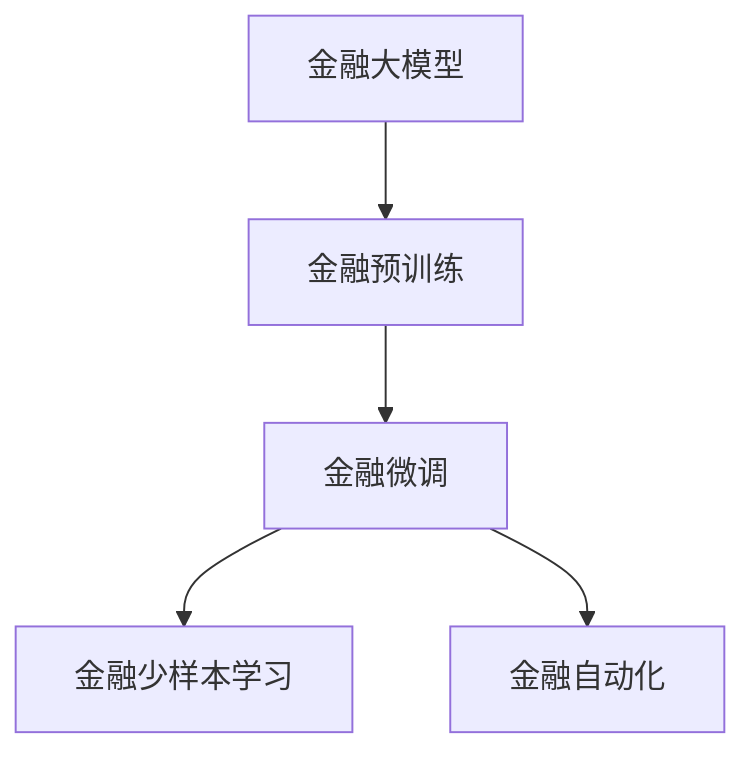

                 

# 大模型技术在金融行业的应用前景

> 关键词：金融风控、信用评估、金融市场分析、自动化理财、智能客服

## 1. 背景介绍

### 1.1 问题由来
金融行业在人工智能技术应用方面一直走在前沿。近年来，随着深度学习技术的快速发展，大模型技术在金融领域的应用前景日益广阔。金融机构通过人工智能技术，可以提升风险管理能力、优化客户体验、自动化业务流程等，从而降低运营成本、提升服务质量。

大模型技术在金融行业的应用，主要得益于其对大规模数据的学习能力和在特定任务上的泛化能力。例如，BERT模型通过在大规模语料库上进行预训练，具备了丰富的语言知识。金融领域的数据通常以文本形式为主，利用BERT等大模型技术进行处理，可以取得较好的效果。

### 1.2 问题核心关键点
在金融领域应用大模型技术，主要涉及以下几个核心关键点：

- **数据处理**：金融行业的数据通常以文本形式为主，如财务报表、新闻资讯、社交媒体等。如何高效处理这些数据，提取有价值的信息，是大模型应用的前提。
- **风险管理**：金融领域对风险管理的需求极高，包括信用风险、市场风险、操作风险等。如何利用大模型技术进行风险评估和预测，是大模型在金融应用的核心任务。
- **客户服务**：金融行业需要提供高质量的客户服务，包括在线客服、智能投顾等。如何利用大模型技术提升客户体验，是大模型在金融应用的另一个重要方向。
- **自动化业务**：金融机构的业务流程包括贷款审批、保险理赔、合规审查等。如何利用大模型技术自动化这些流程，提高效率和准确性，是大模型技术在金融应用的关键点。

## 2. 核心概念与联系

### 2.1 核心概念概述

在金融领域，大模型技术的应用主要涉及以下几个核心概念：

- **金融大模型**：指在金融领域进行预训练的深度学习模型，如BERT、GPT等。这些模型在处理金融文本数据时，可以学习到与金融相关的语言特征。
- **金融预训练**：指使用金融领域的专业语料库对大模型进行预训练，使其具备金融领域的知识表示能力。
- **金融微调**：指在金融预训练模型的基础上，使用金融领域特定任务的数据进行微调，使其在特定任务上获得优异的性能。
- **金融少样本学习**：指在只有少量标注数据的情况下，利用大模型进行金融任务的学习，如信用评分、股票预测等。
- **金融自动化**：指利用大模型技术自动完成金融业务流程，如贷款审批、保险理赔等。

这些概念之间存在紧密的联系。通过金融预训练，大模型可以学习到金融领域的知识表示能力，通过金融微调，可以提升其在特定金融任务上的性能。金融少样本学习和金融自动化则是在小样本情况下，利用大模型快速获得金融领域的应用能力。

### 2.2 核心概念原理和架构的 Mermaid 流程图



这个流程图展示了金融大模型从预训练到微调，再到具体应用的流程。预训练阶段，模型学习金融领域的语言特征；微调阶段，模型针对特定金融任务进行优化；少样本学习和自动化阶段，模型在小样本或无需标注数据的情况下，仍能快速应用到具体金融场景中。

## 3. 核心算法原理 & 具体操作步骤

### 3.1 算法原理概述

大模型在金融领域的应用，主要基于监督学习的微调方法。其核心思想是：将大模型视为"特征提取器"，通过金融领域特定任务的数据进行微调，使其能够适应具体金融任务的需求。

形式化地，假设预训练模型为 $M_{\theta}$，其中 $\theta$ 为预训练得到的模型参数。给定金融领域特定任务 $T$ 的标注数据集 $D=\{(x_i, y_i)\}_{i=1}^N$，微调的目标是找到新的模型参数 $\hat{\theta}$，使得：

$$
\hat{\theta}=\mathop{\arg\min}_{\theta} \mathcal{L}(M_{\theta},D)
$$

其中 $\mathcal{L}$ 为针对任务 $T$ 设计的损失函数，用于衡量模型预测输出与真实标签之间的差异。常见的损失函数包括交叉熵损失、均方误差损失等。

通过梯度下降等优化算法，微调过程不断更新模型参数 $\theta$，最小化损失函数 $\mathcal{L}$，使得模型输出逼近真实标签。由于 $\theta$ 已经通过金融预训练获得了较好的初始化，因此即便在金融领域标注数据较少的情况下，也能较快收敛到理想的模型参数 $\hat{\theta}$。

### 3.2 算法步骤详解

基于监督学习的大模型微调在金融领域的应用，主要包括以下几个关键步骤：

**Step 1: 准备预训练模型和数据集**

- 选择合适的金融预训练模型 $M_{\theta}$ 作为初始化参数，如BERT、GPT等。
- 准备金融领域特定任务的标注数据集 $D$，划分为训练集、验证集和测试集。一般要求标注数据与金融领域的分布不要差异过大。

**Step 2: 添加任务适配层**

- 根据金融任务类型，在预训练模型顶层设计合适的输出层和损失函数。
- 对于分类任务，通常在顶层添加线性分类器和交叉熵损失函数。
- 对于生成任务，通常使用语言模型的解码器输出概率分布，并以负对数似然为损失函数。

**Step 3: 设置微调超参数**

- 选择合适的优化算法及其参数，如 AdamW、SGD 等，设置学习率、批大小、迭代轮数等。
- 设置正则化技术及强度，包括权重衰减、Dropout、Early Stopping 等。
- 确定冻结预训练参数的策略，如仅微调顶层，或全部参数都参与微调。

**Step 4: 执行梯度训练**

- 将训练集数据分批次输入模型，前向传播计算损失函数。
- 反向传播计算参数梯度，根据设定的优化算法和学习率更新模型参数。
- 周期性在验证集上评估模型性能，根据性能指标决定是否触发 Early Stopping。
- 重复上述步骤直到满足预设的迭代轮数或 Early Stopping 条件。

**Step 5: 测试和部署**

- 在测试集上评估微调后模型 $M_{\hat{\theta}}$ 的性能，对比微调前后的精度提升。
- 使用微调后的模型对新样本进行推理预测，集成到实际的应用系统中。
- 持续收集新的数据，定期重新微调模型，以适应数据分布的变化。

### 3.3 算法优缺点

基于监督学习的金融大模型微调方法具有以下优点：

- **高效性**：相较于从头训练，微调所需的数据量少，计算资源消耗小。
- **泛化能力强**：利用预训练的模型参数，微调模型在金融领域特定任务上的泛化能力强。
- **可解释性好**：金融大模型的微调过程简单，输出结果易于解释和调试。

同时，该方法也存在一定的局限性：

- **数据依赖度高**：金融大模型的微调依赖于高质量的金融数据，标注数据不足时效果不佳。
- **过拟合风险高**：金融领域的数据量通常较小，微调模型容易过拟合金融数据。
- **部署复杂度高**：金融业务场景复杂，微调模型需要与现有系统集成，部署难度大。

## 4. 数学模型和公式 & 详细讲解

### 4.1 数学模型构建

假设金融大模型为 $M_{\theta}$，输入为金融文本 $x$，输出为金融标签 $y$。则金融任务的损失函数为：

$$
\mathcal{L}(\theta) = -\frac{1}{N}\sum_{i=1}^N [y_i\log M_{\theta}(x_i)+(1-y_i)\log(1-M_{\theta}(x_i))]
$$

其中 $M_{\theta}(x)$ 为模型在输入 $x$ 上的输出，$y_i \in \{0,1\}$ 为金融标签。

金融大模型的微调目标是最小化经验风险，即找到最优参数：

$$
\theta^* = \mathop{\arg\min}_{\theta} \mathcal{L}(\theta)
$$

在实践中，我们通常使用基于梯度的优化算法（如AdamW、SGD等）来近似求解上述最优化问题。设 $\eta$ 为学习率，$\lambda$ 为正则化系数，则参数的更新公式为：

$$
\theta \leftarrow \theta - \eta \nabla_{\theta}\mathcal{L}(\theta) - \eta\lambda\theta
$$

其中 $\nabla_{\theta}\mathcal{L}(\theta)$ 为损失函数对参数 $\theta$ 的梯度，可通过反向传播算法高效计算。

### 4.2 公式推导过程

以下以金融风险评估任务为例，推导交叉熵损失函数及其梯度的计算公式。

假设模型 $M_{\theta}$ 在输入 $x$ 上的输出为 $\hat{y}=M_{\theta}(x) \in [0,1]$，表示样本属于风险高的概率。真实标签 $y \in \{0,1\}$。则二分类交叉熵损失函数定义为：

$$
\ell(M_{\theta}(x),y) = -[y\log \hat{y} + (1-y)\log (1-\hat{y})]
$$

将其代入经验风险公式，得：

$$
\mathcal{L}(\theta) = -\frac{1}{N}\sum_{i=1}^N [y_i\log M_{\theta}(x_i)+(1-y_i)\log(1-M_{\theta}(x_i))]
$$

根据链式法则，损失函数对参数 $\theta_k$ 的梯度为：

$$
\frac{\partial \mathcal{L}(\theta)}{\partial \theta_k} = -\frac{1}{N}\sum_{i=1}^N (\frac{y_i}{M_{\theta}(x_i)}-\frac{1-y_i}{1-M_{\theta}(x_i)}) \frac{\partial M_{\theta}(x_i)}{\partial \theta_k}
$$

其中 $\frac{\partial M_{\theta}(x_i)}{\partial \theta_k}$ 可进一步递归展开，利用自动微分技术完成计算。

### 4.3 案例分析与讲解

以信用评分任务为例，假设模型 $M_{\theta}$ 在输入 $x$ 上的输出为 $\hat{y}=M_{\theta}(x) \in [0,1]$，表示样本属于高信用评分的概率。真实标签 $y \in \{0,1\}$。则二分类交叉熵损失函数定义为：

$$
\ell(M_{\theta}(x),y) = -[y\log \hat{y} + (1-y)\log (1-\hat{y})]
$$

将其代入经验风险公式，得：

$$
\mathcal{L}(\theta) = -\frac{1}{N}\sum_{i=1}^N [y_i\log M_{\theta}(x_i)+(1-y_i)\log(1-M_{\theta}(x_i))]
$$

在实践中，由于金融数据涉及隐私和合规性，不能直接使用真实标签进行微调。一般采用差分隐私技术，对真实标签进行泛化，得到近似标签。例如，将真实标签 $y$ 转化为 $y'$，使得 $P(y'|y)$ 接近于 $P(y'|y)$。

在得到近似标签后，即可进行微调。利用交叉熵损失函数，通过反向传播算法计算梯度，使用AdamW等优化器更新模型参数。微调过程不断迭代，直至收敛。

## 5. 项目实践：代码实例和详细解释说明

### 5.1 开发环境搭建

在进行金融大模型微调实践前，我们需要准备好开发环境。以下是使用Python进行PyTorch开发的环境配置流程：

1. 安装Anaconda：从官网下载并安装Anaconda，用于创建独立的Python环境。

2. 创建并激活虚拟环境：
```bash
conda create -n pytorch-env python=3.8 
conda activate pytorch-env
```

3. 安装PyTorch：根据CUDA版本，从官网获取对应的安装命令。例如：
```bash
conda install pytorch torchvision torchaudio cudatoolkit=11.1 -c pytorch -c conda-forge
```

4. 安装Transformers库：
```bash
pip install transformers
```

5. 安装各类工具包：
```bash
pip install numpy pandas scikit-learn matplotlib tqdm jupyter notebook ipython
```

完成上述步骤后，即可在`pytorch-env`环境中开始微调实践。

### 5.2 源代码详细实现

下面我们以信用评分任务为例，给出使用Transformers库对BERT模型进行微调的PyTorch代码实现。

首先，定义信用评分任务的数据处理函数：

```python
from transformers import BertTokenizer
from torch.utils.data import Dataset
import torch

class CreditScoringDataset(Dataset):
    def __init__(self, texts, labels, tokenizer, max_len=128):
        self.texts = texts
        self.labels = labels
        self.tokenizer = tokenizer
        self.max_len = max_len
        
    def __len__(self):
        return len(self.texts)
    
    def __getitem__(self, item):
        text = self.texts[item]
        label = self.labels[item]
        
        encoding = self.tokenizer(text, return_tensors='pt', max_length=self.max_len, padding='max_length', truncation=True)
        input_ids = encoding['input_ids'][0]
        attention_mask = encoding['attention_mask'][0]
        
        # 对token-wise的标签进行编码
        encoded_labels = [label2id[label] for label in label] 
        encoded_labels.extend([label2id['O']] * (self.max_len - len(encoded_labels)))
        labels = torch.tensor(encoded_labels, dtype=torch.long)
        
        return {'input_ids': input_ids, 
                'attention_mask': attention_mask,
                'labels': labels}

# 标签与id的映射
label2id = {'O': 0, 'High': 1, 'Low': 2}
id2label = {v: k for k, v in label2id.items()}

# 创建dataset
tokenizer = BertTokenizer.from_pretrained('bert-base-cased')

train_dataset = CreditScoringDataset(train_texts, train_labels, tokenizer)
dev_dataset = CreditScoringDataset(dev_texts, dev_labels, tokenizer)
test_dataset = CreditScoringDataset(test_texts, test_labels, tokenizer)
```

然后，定义模型和优化器：

```python
from transformers import BertForTokenClassification, AdamW

model = BertForTokenClassification.from_pretrained('bert-base-cased', num_labels=len(label2id))

optimizer = AdamW(model.parameters(), lr=2e-5)
```

接着，定义训练和评估函数：

```python
from torch.utils.data import DataLoader
from tqdm import tqdm
from sklearn.metrics import classification_report

device = torch.device('cuda') if torch.cuda.is_available() else torch.device('cpu')
model.to(device)

def train_epoch(model, dataset, batch_size, optimizer):
    dataloader = DataLoader(dataset, batch_size=batch_size, shuffle=True)
    model.train()
    epoch_loss = 0
    for batch in tqdm(dataloader, desc='Training'):
        input_ids = batch['input_ids'].to(device)
        attention_mask = batch['attention_mask'].to(device)
        labels = batch['labels'].to(device)
        model.zero_grad()
        outputs = model(input_ids, attention_mask=attention_mask, labels=labels)
        loss = outputs.loss
        epoch_loss += loss.item()
        loss.backward()
        optimizer.step()
    return epoch_loss / len(dataloader)

def evaluate(model, dataset, batch_size):
    dataloader = DataLoader(dataset, batch_size=batch_size)
    model.eval()
    preds, labels = [], []
    with torch.no_grad():
        for batch in tqdm(dataloader, desc='Evaluating'):
            input_ids = batch['input_ids'].to(device)
            attention_mask = batch['attention_mask'].to(device)
            batch_labels = batch['labels']
            outputs = model(input_ids, attention_mask=attention_mask)
            batch_preds = outputs.logits.argmax(dim=2).to('cpu').tolist()
            batch_labels = batch_labels.to('cpu').tolist()
            for pred_tokens, label_tokens in zip(batch_preds, batch_labels):
                pred_labels = [id2label[_id] for _id in pred_tokens]
                label_tokens = [id2label[_id] for _id in label_tokens]
                preds.append(pred_labels[:len(label_tokens)])
                labels.append(label_tokens)
                
    print(classification_report(labels, preds))
```

最后，启动训练流程并在测试集上评估：

```python
epochs = 5
batch_size = 16

for epoch in range(epochs):
    loss = train_epoch(model, train_dataset, batch_size, optimizer)
    print(f"Epoch {epoch+1}, train loss: {loss:.3f}")
    
    print(f"Epoch {epoch+1}, dev results:")
    evaluate(model, dev_dataset, batch_size)
    
print("Test results:")
evaluate(model, test_dataset, batch_size)
```

以上就是使用PyTorch对BERT进行信用评分任务微调的完整代码实现。可以看到，得益于Transformers库的强大封装，我们可以用相对简洁的代码完成BERT模型的加载和微调。

### 5.3 代码解读与分析

让我们再详细解读一下关键代码的实现细节：

**CreditScoringDataset类**：
- `__init__`方法：初始化文本、标签、分词器等关键组件。
- `__len__`方法：返回数据集的样本数量。
- `__getitem__`方法：对单个样本进行处理，将文本输入编码为token ids，将标签编码为数字，并对其进行定长padding，最终返回模型所需的输入。

**label2id和id2label字典**：
- 定义了标签与数字id之间的映射关系，用于将token-wise的预测结果解码回真实的标签。

**训练和评估函数**：
- 使用PyTorch的DataLoader对数据集进行批次化加载，供模型训练和推理使用。
- 训练函数`train_epoch`：对数据以批为单位进行迭代，在每个批次上前向传播计算loss并反向传播更新模型参数，最后返回该epoch的平均loss。
- 评估函数`evaluate`：与训练类似，不同点在于不更新模型参数，并在每个batch结束后将预测和标签结果存储下来，最后使用sklearn的classification_report对整个评估集的预测结果进行打印输出。

**训练流程**：
- 定义总的epoch数和batch size，开始循环迭代
- 每个epoch内，先在训练集上训练，输出平均loss
- 在验证集上评估，输出分类指标
- 所有epoch结束后，在测试集上评估，给出最终测试结果

可以看到，PyTorch配合Transformers库使得BERT微调的代码实现变得简洁高效。开发者可以将更多精力放在数据处理、模型改进等高层逻辑上，而不必过多关注底层的实现细节。

当然，工业级的系统实现还需考虑更多因素，如模型的保存和部署、超参数的自动搜索、更灵活的任务适配层等。但核心的微调范式基本与此类似。

## 6. 实际应用场景

### 6.1 风险管理

基于金融大模型微调，金融机构可以构建全面的风险管理系统，提升风险评估和预测能力。具体包括信用评分、违约预测、市场风险评估等。

- **信用评分**：使用金融大模型对客户的信用历史、收入状况、负债情况等数据进行预处理和分析，自动生成信用评分，辅助贷款审批决策。
- **违约预测**：利用金融大模型对客户的交易行为、财务状况等进行预测，识别出违约风险较高的客户，提前进行预警和干预。
- **市场风险评估**：使用金融大模型对金融市场数据进行分析，评估不同资产的风险和收益，辅助资产配置和投资决策。

### 6.2 客户服务

金融机构利用金融大模型，可以构建智能客服系统，提升客户体验。具体包括智能咨询、自动化回答、自动分类等。

- **智能咨询**：使用金融大模型对客户的咨询请求进行自动分类，并匹配相应的专家或知识库进行回答，提高服务响应速度和准确性。
- **自动化回答**：通过金融大模型对客户的常见问题进行预处理和分析，生成自动化回答，减少人力成本。
- **自动分类**：使用金融大模型对客户的咨询请求进行自动分类，提高服务效率和质量。

### 6.3 自动化业务

金融机构利用金融大模型，可以自动化业务流程，提高效率和准确性。具体包括贷款审批、保险理赔、合规审查等。

- **贷款审批**：使用金融大模型对客户的贷款申请进行自动审核，识别出风险较高的申请，减少人工审核的工作量和出错率。
- **保险理赔**：利用金融大模型对保险理赔申请进行自动审核，提高理赔处理的效率和准确性。
- **合规审查**：使用金融大模型对金融机构的合规文档进行自动审核，确保文档符合相关法律法规，减少合规成本。

### 6.4 未来应用展望

随着金融大模型和微调方法的不断发展，基于微调范式将在更多金融领域得到应用，为金融机构的智能化转型带来新的机遇。

在智慧风控领域，基于微调技术的风险管理系统，可以实时监测和预警风险，辅助金融机构进行风险控制和决策。

在智能投顾领域，利用微调技术进行智能投顾系统，能够根据客户的风险偏好和历史交易数据，生成个性化的投资建议，提升客户满意度和收益。

在金融市场分析领域，基于微调技术的市场分析系统，能够实时分析金融市场数据，预测市场走势，辅助投资决策。

此外，在资产管理、财富管理、金融科技等众多领域，基于大模型微调的人工智能应用也将不断涌现，为金融行业带来新的变革。

## 7. 工具和资源推荐

### 7.1 学习资源推荐

为了帮助开发者系统掌握金融大模型微调的理论基础和实践技巧，这里推荐一些优质的学习资源：

1. 《金融科技与人工智能》系列书籍：全面介绍了人工智能在金融领域的应用，包括微调技术、风险管理、客户服务等。

2. 《深度学习与金融工程》课程：由金融科技领域的知名专家授课，讲解了深度学习在金融风险管理、投资决策、智能投顾等方面的应用。

3. 《金融AI实战》书籍：介绍了如何使用Python和TensorFlow进行金融AI开发，包括微调技术、模型部署、系统集成等。

4. 《金融数据科学与人工智能》期刊：涵盖金融领域的前沿研究成果，包括微调技术、金融预测、金融风控等。

5. Kaggle金融数据分析竞赛：通过参与实际的金融数据分析竞赛，锻炼微调技术的应用能力，积累实战经验。

通过对这些资源的学习实践，相信你一定能够快速掌握金融大模型微调的精髓，并用于解决实际的金融问题。

### 7.2 开发工具推荐

高效的开发离不开优秀的工具支持。以下是几款用于金融大模型微调开发的常用工具：

1. PyTorch：基于Python的开源深度学习框架，灵活动态的计算图，适合快速迭代研究。大部分金融预训练语言模型都有PyTorch版本的实现。

2. TensorFlow：由Google主导开发的开源深度学习框架，生产部署方便，适合大规模工程应用。同样有丰富的金融预训练语言模型资源。

3. Transformers库：HuggingFace开发的NLP工具库，集成了众多SOTA金融语言模型，支持PyTorch和TensorFlow，是进行金融微调任务开发的利器。

4. Weights & Biases：模型训练的实验跟踪工具，可以记录和可视化模型训练过程中的各项指标，方便对比和调优。与主流深度学习框架无缝集成。

5. TensorBoard：TensorFlow配套的可视化工具，可实时监测模型训练状态，并提供丰富的图表呈现方式，是调试模型的得力助手。

6. Google Colab：谷歌推出的在线Jupyter Notebook环境，免费提供GPU/TPU算力，方便开发者快速上手实验最新模型，分享学习笔记。

合理利用这些工具，可以显著提升金融大模型微调任务的开发效率，加快创新迭代的步伐。

### 7.3 相关论文推荐

金融大模型和微调技术的发展源于学界的持续研究。以下是几篇奠基性的相关论文，推荐阅读：

1. Attention is All You Need（即Transformer原论文）：提出了Transformer结构，开启了深度学习在金融领域的应用。

2. BERT: Pre-training of Deep Bidirectional Transformers for Language Understanding：提出BERT模型，利用预训练技术提升了金融文本数据的处理能力。

3. GPT-3在金融领域的应用：展示了GPT-3在金融文本分类、情感分析、智能投顾等任务上的表现，验证了大模型技术在金融领域的应用潜力。

4. LoRA: Low-rank Adaptation of Transformers for Task-Agnostic Fine-tuning：提出LoRA方法，只调整少数可训练层，提高了金融大模型微调的参数效率。

5. Adapter: A Simple Framework for Parameter-Efficient Transfer Learning：提出Adapter方法，仅调整顶层参数，大大减少了金融大模型的微调参数量。

这些论文代表了大模型在金融领域微调技术的发展脉络。通过学习这些前沿成果，可以帮助研究者把握学科前进方向，激发更多的创新灵感。

## 8. 总结：未来发展趋势与挑战

### 8.1 研究成果总结

本文对基于监督学习的大模型微调方法在金融领域的应用进行了全面系统的介绍。首先阐述了金融大模型和微调技术的研究背景和意义，明确了微调在金融领域特定任务上的泛化能力和参数高效性。其次，从原理到实践，详细讲解了金融大模型微调过程的数学原理和关键步骤，给出了金融大模型微调的完整代码实例。同时，本文还广泛探讨了金融大模型在风险管理、客户服务、自动化业务等实际应用场景中的应用前景，展示了微调范式的巨大潜力。此外，本文精选了金融大模型微调的相关学习资源和开发工具，力求为读者提供全方位的技术指引。

通过本文的系统梳理，可以看到，基于金融大模型的微调方法在金融领域具有广阔的应用前景。这些微调技术能够显著提升金融机构的智能化水平，降低运营成本，提高服务质量，带来显著的经济效益和社会效益。

### 8.2 未来发展趋势

展望未来，金融大模型微调技术将呈现以下几个发展趋势：

1. **模型规模持续增大**：随着算力成本的下降和数据规模的扩张，金融大模型的参数量还将持续增长。超大规模金融大模型蕴含的丰富知识表示能力，有望进一步提升金融任务的微调效果。

2. **少样本学习和参数高效微调技术的发展**：未来将开发更多的参数高效微调方法，如LoRA、Adapter等，在金融领域小样本情况下，仍能获得较好的微调效果。

3. **多模态微调技术的应用**：金融领域的数据往往涉及多种类型，如文本、图像、声音等。多模态微调技术将使金融大模型能够更好地处理多类型数据，提升金融任务的处理能力。

4. **模型通用性和迁移能力的提升**：未来的金融大模型将具备更强的通用性和迁移能力，能够适应不同金融领域和金融任务的需求。

5. **持续学习机制的引入**：金融大模型将具备持续学习机制，能够随着金融数据的变化不断更新知识表示，保持模型的时效性和适应性。

### 8.3 面临的挑战

尽管金融大模型微调技术已经取得了一定的成果，但在迈向更加智能化、普适化应用的过程中，它仍面临以下挑战：

1. **数据隐私和合规性问题**：金融数据涉及个人隐私和合规性，如何在数据使用和处理过程中保障数据隐私和合规性，是一个重要的挑战。

2. **模型的公平性和透明性问题**：金融大模型容易学习到金融领域中的偏见和不公平现象，如何在模型设计中引入公平性原则，确保模型输出的透明性和公平性，是一个需要解决的问题。

3. **模型的可解释性和可控性问题**：金融大模型的决策过程往往复杂，难以解释其内部工作机制和决策逻辑。如何在保证模型性能的同时，增强模型的可解释性和可控性，是一个需要研究的课题。

4. **模型的稳定性和鲁棒性问题**：金融大模型在大规模微调和长时间运行中，容易出现模型漂移和过拟合现象。如何在模型训练和部署过程中，增强模型的稳定性和鲁棒性，是一个需要解决的挑战。

5. **模型的计算资源和成本问题**：金融大模型通常具有较高的计算需求和成本，如何在保证模型效果的同时，降低计算资源和成本，是一个需要优化的问题。

### 8.4 研究展望

面对金融大模型微调所面临的挑战，未来的研究需要在以下几个方面寻求新的突破：

1. **数据隐私保护技术**：开发数据隐私保护技术，如差分隐私、联邦学习等，保障金融数据在微调过程中的隐私和安全。

2. **公平性和透明性研究**：引入公平性原则，设计公平性评估指标，优化金融大模型，确保模型输出的透明性和公平性。

3. **模型可解释性增强**：研究可解释性技术，如特征归因、可视化等，增强金融大模型的可解释性和可控性。

4. **稳定性和鲁棒性优化**：引入稳定性和鲁棒性优化技术，如模型蒸馏、自适应学习率等，增强金融大模型的稳定性和鲁棒性。

5. **计算资源优化**：研究高效的计算资源优化技术，如模型压缩、量化加速等，降低金融大模型的计算资源和成本。

6. **多模态数据融合技术**：开发多模态数据融合技术，如跨模态特征提取、联合学习等，提升金融大模型处理多类型数据的能力。

这些研究方向将推动金融大模型微调技术的发展，提升金融大模型的智能化水平，为金融机构的智能化转型提供新的动力。

## 9. 附录：常见问题与解答

**Q1: 金融大模型微调是否适用于所有金融任务？**

A: 金融大模型微调在大多数金融任务上都能取得不错的效果，特别是对于数据量较小的任务。但对于一些特定领域的任务，如会计审计、法律合规等，仅仅依靠通用语料预训练的模型可能难以很好地适应。此时需要在特定领域语料上进一步预训练，再进行微调，才能获得理想效果。此外，对于一些需要时效性、个性化很强的任务，如智能投顾、自动化审批等，微调方法也需要针对性的改进优化。

**Q2: 金融大模型微调中的数据隐私和安全问题如何解决？**

A: 金融数据涉及个人隐私和合规性，需要在数据使用和处理过程中保障数据隐私和安全。常见的解决方案包括：

1. 数据匿名化：对金融数据进行匿名化处理，确保数据中的个人信息不会被泄露。
2. 差分隐私：对金融数据进行差分隐私处理，确保在统计分析过程中，数据隐私不被泄露。
3. 联邦学习：通过联邦学习技术，在多个金融机构之间进行模型联合训练，避免数据集中存储和泄露。

**Q3: 金融大模型的微调效果如何保证？**

A: 金融大模型的微调效果需要通过合理的超参数设置、正则化技术和模型验证等手段进行保障。常见的方法包括：

1. 选择合适的超参数：如学习率、批大小、迭代轮数等，确保模型能够快速收敛。
2. 引入正则化技术：如L2正则、Dropout、Early Stopping等，防止模型过度适应训练数据。
3. 模型验证：在模型训练过程中，定期在验证集上评估模型性能，防止过拟合。
4. 多模型集成：通过训练多个微调模型，取平均输出，提升模型的泛化能力和鲁棒性。

**Q4: 金融大模型的可解释性和可控性如何增强？**

A: 金融大模型的可解释性和可控性可以通过以下手段进行增强：

1. 特征归因：通过特征归因技术，分析模型输出的关键特征，增强模型的可解释性。
2. 可视化技术：使用可视化技术，对模型输出的结果进行可视化展示，增强模型的可控性。
3. 规则注入：在模型训练过程中，注入相关的业务规则和知识，增强模型的可控性。

**Q5: 金融大模型的稳定性和鲁棒性如何提升？**

A: 金融大模型的稳定性和鲁棒性可以通过以下手段进行提升：

1. 模型蒸馏：通过模型蒸馏技术，将大模型转化为小模型，提升模型的稳定性和鲁棒性。
2. 自适应学习率：通过自适应学习率技术，根据数据变化自动调整学习率，提高模型的稳定性和鲁棒性。
3. 数据增强：通过数据增强技术，丰富训练数据的多样性，提升模型的泛化能力和鲁棒性。

综上所述，金融大模型微调技术在金融领域具有广阔的应用前景。通过合理的数据处理、模型训练和优化，可以显著提升金融机构的智能化水平，带来显著的经济效益和社会效益。未来，随着技术的不断进步，金融大模型微调技术将在金融行业发挥越来越重要的作用，推动金融行业的智能化转型。

