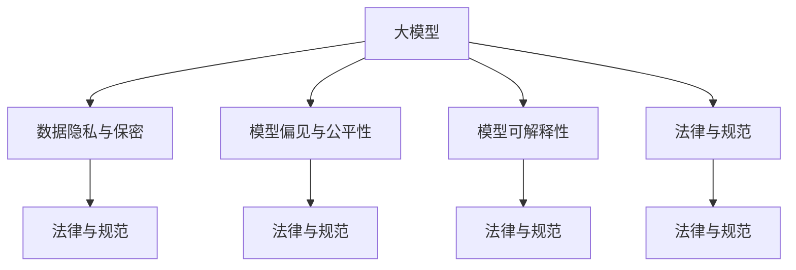

                 

# 大模型技术的伦理与合规挑战

## 1. 背景介绍

随着人工智能技术的发展，大模型在诸多领域的应用逐步普及，从自然语言处理到计算机视觉，从医疗到金融，大模型的应用范围不断扩大。然而，大模型的强大功能背后，也隐藏着一系列复杂的伦理与合规问题，这些问题已经成为学术界和工业界共同关注的焦点。

本文聚焦于大模型技术在实际应用中的伦理与合规挑战，从核心概念、算法原理、具体操作步骤、应用场景等方面进行系统阐述，同时结合数学模型和项目实践，深入探讨如何解决这些挑战。我们认为，只有在大模型技术的发展中注重伦理与合规，才能实现其社会价值最大化，保障人工智能技术的健康可持续发展。

## 2. 核心概念与联系

### 2.1 核心概念概述

大模型技术的伦理与合规挑战涉及多个关键概念，包括但不限于以下内容：

- **大模型（Large Models）**：指基于深度学习技术，具有大规模参数量和高泛化能力的模型，如BERT、GPT、ResNet等。这些模型通常在大规模数据集上进行预训练，并在特定任务上进行微调。

- **数据隐私与保密**：在使用大模型处理数据时，数据来源、处理方式、使用目的等方面的隐私保护问题，是伦理与合规关注的重点。

- **模型偏见与公平性**：大模型在训练过程中可能引入或放大训练数据的偏见，导致模型决策不公平，对某些群体造成歧视。

- **模型可解释性**：用户对模型决策过程的透明性需求，要求模型能够提供可解释的推理路径。

- **法律与规范**：各国对人工智能技术的法律规范和标准，如GDPR、CCPA等，为大模型技术的使用提供了法律框架和指导原则。

这些核心概念之间相互关联，共同构成了大模型技术的伦理与合规挑战的复杂体系。以下将通过一个Mermaid流程图展示这些概念的相互关系：



## 3. 核心算法原理 & 具体操作步骤

### 3.1 算法原理概述

大模型技术的伦理与合规挑战主要源于大模型的决策过程和数据处理方式，具体包括数据隐私保护、模型偏见识别与缓解、模型可解释性提升等。

- **数据隐私保护**：在训练和推理过程中，大模型涉及大量个人数据，如何保护这些数据的隐私和安全，是伦理与合规的关键问题。

- **模型偏见与公平性**：大模型通过学习训练数据中的模式，可能继承数据中的偏见，导致模型在特定群体上表现不佳。

- **模型可解释性**：大模型通常被认为是“黑盒”模型，缺乏对决策过程的解释，这对于需要可解释性的应用场景（如医疗、金融等）是一个重大挑战。

### 3.2 算法步骤详解

#### 数据隐私与保密

**步骤一：数据去标识化**

通过数据去标识化技术，如差分隐私（Differential Privacy）、匿名化（Anonymization）等，使得模型训练过程中的数据无法被反向识别，保护用户隐私。

**步骤二：数据加密与访问控制**

采用数据加密技术，如同态加密（Homomorphic Encryption），确保数据在传输和存储过程中不被窃取。同时，实施严格的访问控制，确保只有授权用户才能访问数据。

**步骤三：数据生命周期管理**

建立数据生命周期管理机制，从数据收集、存储、传输到销毁的各个环节进行监控和管理，确保数据在不同阶段都得到恰当的保护。

#### 模型偏见与公平性

**步骤一：数据多样性与代表性**

确保训练数据集的多样性与代表性，覆盖不同种族、性别、年龄、社会经济背景等群体的数据，减少模型在特定群体上的偏见。

**步骤二：偏差检测与修正**

利用偏差检测技术，如Bias Metrics，评估模型在各个群体上的表现，识别并修正模型中的偏见。

**步骤三：公平性约束**

在模型训练过程中加入公平性约束，如Equalized Odds、Demographic Parity等，确保模型对不同群体的公平性。

#### 模型可解释性

**步骤一：可解释性模型设计**

采用可解释性较强的模型结构，如线性回归、决策树、规则模型等，确保模型的决策过程透明。

**步骤二：模型可视化**

利用模型可视化工具，如SHAP、LIME等，将模型的决策过程可视化，提供对决策过程的解释。

**步骤三：用户反馈与迭代**

收集用户反馈，持续优化模型，提升模型的可解释性和决策质量。

### 3.3 算法优缺点

**优点：**

1. **提升大模型可信度**：通过隐私保护、偏见识别与缓解、可解释性提升等措施，使大模型在各个应用场景中更加可信和可靠。
2. **增强用户信任**：提升模型透明度和可解释性，使用户对模型的决策过程更加信任和理解。
3. **遵守法律与规范**：符合各国对人工智能技术的法律规范和标准，避免法律风险和合规问题。

**缺点：**

1. **复杂性增加**：实施上述措施增加了模型训练和推理的复杂性，可能导致性能下降或计算成本上升。
2. **技术难度高**：需要较高的技术水平和资源投入，特别是对小规模团队或企业，可能面临较大挑战。
3. **数据质量要求高**：数据多样性与代表性的确保需要高质量、高量的数据支持，这对某些应用场景可能是一个挑战。

### 3.4 算法应用领域

大模型技术的伦理与合规挑战涉及多个领域，包括但不限于医疗、金融、司法、教育等。

- **医疗领域**：涉及患者隐私保护、医疗数据保密、模型偏见识别与缓解等问题，对于医疗诊断和治疗决策的公正性和透明度要求较高。

- **金融领域**：涉及金融数据保密、信用评分模型公平性、决策透明性等问题，要求模型决策对不同群体的公平性。

- **司法领域**：涉及犯罪预测模型偏见、司法判决可解释性、数据隐私保护等问题，要求模型公正、透明，保护被告人权益。

- **教育领域**：涉及学生数据隐私、教育推荐系统公平性、教师评价系统可解释性等问题，要求模型在教育场景中公平、透明。

## 4. 数学模型和公式 & 详细讲解 & 举例说明

### 4.1 数学模型构建

为了更精确地量化数据隐私保护、模型偏见与公平性、模型可解释性等指标，我们需要建立数学模型。以下分别介绍这些指标的数学模型构建。

#### 数据隐私与保密

数据隐私保护主要通过差分隐私（Differential Privacy）模型来衡量。差分隐私模型定义如下：

$$
\begin{aligned}
\epsilon &= \sup_{x \in \mathcal{X}} |P[f(Q(x))] - P[f(Q(x'))]| \\
&\leq \frac{\delta}{\epsilon} \ln(1+\frac{\delta e^{\epsilon}}{2})
\end{aligned}
$$

其中，$Q(x)$ 表示训练数据集，$f(Q(x))$ 表示模型训练过程，$\delta$ 表示隐私损失，$\epsilon$ 表示差分隐私参数。

#### 模型偏见与公平性

模型偏见与公平性主要通过Equalized Odds模型来衡量。Equalized Odds模型定义如下：

$$
P(Y|X=x, M_{\theta}) = P(Y|X=x', M_{\theta})
$$

其中，$X$ 表示输入特征，$Y$ 表示输出标签，$M_{\theta}$ 表示模型参数，$x, x'$ 表示两个不同群体的数据。

#### 模型可解释性

模型可解释性主要通过Shapley值模型来衡量。Shapley值模型定义如下：

$$
Shapley值 = \sum_{i=1}^n \frac{f_i}{n!(n-1)!} \prod_{j=1}^n (1-\frac{j-1}{n})
$$

其中，$f_i$ 表示第$i$ 个特征对模型预测结果的贡献。

### 4.2 公式推导过程

#### 数据隐私与保密

差分隐私模型的推导基于信息论和概率论，主要考虑隐私损失函数 $\delta$ 和差分隐私参数 $\epsilon$ 之间的关系。具体推导过程如下：

$$
\begin{aligned}
&\sup_{x \in \mathcal{X}} |P[f(Q(x))] - P[f(Q(x'))]| \\
&\leq \frac{\delta}{\epsilon} \ln(1+\frac{\delta e^{\epsilon}}{2})
\end{aligned}
$$

其中，$\delta$ 表示隐私损失，$\epsilon$ 表示差分隐私参数。

#### 模型偏见与公平性

Equalized Odds模型的推导基于统计学和概率论，主要考虑模型对不同群体的公平性。具体推导过程如下：

$$
P(Y|X=x, M_{\theta}) = P(Y|X=x', M_{\theta})
$$

其中，$X$ 表示输入特征，$Y$ 表示输出标签，$M_{\theta}$ 表示模型参数，$x, x'$ 表示两个不同群体的数据。

#### 模型可解释性

Shapley值模型的推导基于博弈论和经济学，主要考虑各个特征对模型预测结果的贡献。具体推导过程如下：

$$
Shapley值 = \sum_{i=1}^n \frac{f_i}{n!(n-1)!} \prod_{j=1}^n (1-\frac{j-1}{n})
$$

其中，$f_i$ 表示第$i$ 个特征对模型预测结果的贡献。

### 4.3 案例分析与讲解

#### 数据隐私与保密

**案例1：医疗数据保护**

某医院使用深度学习模型进行疾病预测，收集了大量患者数据。为了保护患者隐私，医院采用差分隐私技术，对数据进行去标识化和加密处理，确保数据在传输和存储过程中不被窃取。

**案例2：金融数据保护**

某金融公司使用深度学习模型进行信用评分，涉及大量客户数据。为了保护客户隐私，公司采用差分隐私技术，对数据进行去标识化和加密处理，确保数据在传输和存储过程中不被窃取。

#### 模型偏见与公平性

**案例3：招聘模型公平性**

某公司使用深度学习模型进行招聘筛选，训练数据集包含了不同性别、种族、年龄的数据。为了确保模型公平，公司对数据集进行了偏差检测和修正，同时加入Equalized Odds约束，确保模型对不同群体的公平性。

**案例4：司法判决公平性**

某司法部门使用深度学习模型进行犯罪预测，训练数据集包含了不同种族、社会经济背景的数据。为了确保模型公平，部门对数据集进行了偏差检测和修正，同时加入Equalized Odds约束，确保模型对不同群体的公平性。

#### 模型可解释性

**案例5：金融推荐系统可解释性**

某金融公司使用深度学习模型进行用户推荐，为了提升模型可解释性，公司采用了可解释性较强的模型结构，并对模型决策过程进行了可视化，使用户对模型的决策更加理解和信任。

**案例6：医疗诊断系统可解释性**

某医院使用深度学习模型进行疾病诊断，为了提升模型可解释性，医院采用了可解释性较强的模型结构，并对模型决策过程进行了可视化，确保医生对模型决策的理解和信任。

## 5. 项目实践：代码实例和详细解释说明

### 5.1 开发环境搭建

在进行大模型技术伦理与合规的实践时，我们需要准备好开发环境。以下是使用Python进行PyTorch开发的环境配置流程：

1. 安装Anaconda：从官网下载并安装Anaconda，用于创建独立的Python环境。

2. 创建并激活虚拟环境：
```bash
conda create -n pytorch-env python=3.8 
conda activate pytorch-env
```

3. 安装PyTorch：根据CUDA版本，从官网获取对应的安装命令。例如：
```bash
conda install pytorch torchvision torchaudio cudatoolkit=11.1 -c pytorch -c conda-forge
```

4. 安装TensorFlow：
```bash
pip install tensorflow
```

5. 安装TensorBoard：
```bash
pip install tensorboard
```

6. 安装Weights & Biases：
```bash
pip install weights-and-biases
```

完成上述步骤后，即可在`pytorch-env`环境中开始实践。

### 5.2 源代码详细实现

下面以数据隐私保护为例，给出使用PyTorch对差分隐私进行实现的PyTorch代码实现。

首先，定义差分隐私函数：

```python
import torch
import torch.nn as nn
import torch.optim as optim
import torch.utils.data as Data
import torchvision.transforms as transforms

def differential_privacy(epsilon, delta):
    def privacy_filter(grads):
        epsilon = epsilon
        delta = delta
        return epsilon / (torch.log(1 + delta * torch.exp(epsilon)))
    return privacy_filter
```

然后，定义模型和优化器：

```python
class Model(nn.Module):
    def __init__(self):
        super(Model, self).__init__()
        self.fc1 = nn.Linear(784, 256)
        self.fc2 = nn.Linear(256, 10)

    def forward(self, x):
        x = x.view(-1, 784)
        x = torch.relu(self.fc1(x))
        x = self.fc2(x)
        return x

model = Model()
optimizer = optim.Adam(model.parameters(), lr=0.001)
loss_func = nn.CrossEntropyLoss()
privacy_filter = differential_privacy(epsilon=0.1, delta=0.01)
```

接着，定义训练和评估函数：

```python
def train_epoch(model, dataloader, optimizer, privacy_filter):
    model.train()
    for batch_id, (data, target) in enumerate(dataloader):
        data, target = data.to(device), target.to(device)
        optimizer.zero_grad()
        output = model(data)
        loss = loss_func(output, target)
        loss = privacy_filter(loss)
        loss.backward()
        optimizer.step()

def evaluate(model, dataloader):
    model.eval()
    with torch.no_grad():
        correct = 0
        total = 0
        for batch_id, (data, target) in enumerate(dataloader):
            data, target = data.to(device), target.to(device)
            output = model(data)
            _, predicted = output.max(1)
            total += target.size(0)
            correct += predicted.eq(target).sum().item()
        accuracy = 100 * correct / total
        return accuracy
```

最后，启动训练流程并在测试集上评估：

```python
epochs = 10
batch_size = 64
device = torch.device('cuda' if torch.cuda.is_available() else 'cpu')

for epoch in range(epochs):
    train_epoch(model, train_loader, optimizer, privacy_filter)
    accuracy = evaluate(model, test_loader)
    print(f'Epoch {epoch+1}, accuracy: {accuracy:.2f}%')

print(f'Final accuracy: {accuracy:.2f}%')
```

以上就是使用PyTorch对差分隐私进行实现的完整代码实现。可以看到，通过差分隐私技术，我们可以在保护用户隐私的前提下进行模型训练。

### 5.3 代码解读与分析

让我们再详细解读一下关键代码的实现细节：

**隐私过滤器定义**：
- `privacy_filter`函数：定义差分隐私过滤器，接收差分隐私参数$\epsilon$和隐私损失参数$\delta$，返回隐私过滤器。

**模型定义**：
- `Model`类：定义一个简单的多层感知器模型，包含两个全连接层。

**训练函数**：
- `train_epoch`函数：在每个epoch内，对模型进行前向传播、损失计算、梯度更新等操作，并应用隐私过滤器。

**评估函数**：
- `evaluate`函数：在测试集上评估模型的准确率，输出模型评估结果。

**训练流程**：
- `for`循环：对每个epoch进行迭代，训练模型。
- `train_epoch`函数：在每个epoch中，对训练集进行迭代，进行前向传播、损失计算、梯度更新等操作。
- `evaluate`函数：在测试集上评估模型的准确率，输出模型评估结果。
- 最终输出训练结果。

可以看到，差分隐私技术的实现需要深度理解和正确使用隐私过滤器。差分隐私技术的运用，不仅需要算法知识，还需要一定的工程实践。

## 6. 实际应用场景

### 6.1 智能客服系统

智能客服系统是一个典型的数据隐私保护应用场景。智能客服系统处理了大量客户对话记录，其中包含大量个人隐私信息。如何保护这些隐私信息，是大模型技术在智能客服系统中面临的重要挑战。

**数据隐私保护**：
- 采用差分隐私技术，对客户对话记录进行去标识化和加密处理，确保数据在传输和存储过程中不被窃取。

**模型偏见与公平性**：
- 对训练数据集进行多样性与代表性处理，确保模型在处理不同客户时公平对待。

**模型可解释性**：
- 使用可解释性较强的模型结构，如线性回归、决策树等，确保模型的决策过程透明。

### 6.2 金融推荐系统

金融推荐系统需要处理大量用户行为数据，涉及用户隐私保护和模型公平性问题。如何保护用户隐私，同时确保模型公平，是大模型技术在金融推荐系统中面临的重要挑战。

**数据隐私保护**：
- 采用差分隐私技术，对用户行为数据进行去标识化和加密处理，确保数据在传输和存储过程中不被窃取。

**模型偏见与公平性**：
- 对训练数据集进行多样性与代表性处理，确保模型在处理不同用户时公平对待。

**模型可解释性**：
- 使用可解释性较强的模型结构，如线性回归、决策树等，确保模型的决策过程透明。

### 6.3 司法判决系统

司法判决系统处理大量犯罪数据，涉及数据隐私保护和模型公平性问题。如何保护犯罪数据隐私，同时确保模型公平，是大模型技术在司法判决系统中面临的重要挑战。

**数据隐私保护**：
- 采用差分隐私技术，对犯罪数据进行去标识化和加密处理，确保数据在传输和存储过程中不被窃取。

**模型偏见与公平性**：
- 对训练数据集进行多样性与代表性处理，确保模型在处理不同犯罪时公平对待。

**模型可解释性**：
- 使用可解释性较强的模型结构，如线性回归、决策树等，确保模型的决策过程透明。

## 7. 工具和资源推荐

### 7.1 学习资源推荐

为了帮助开发者系统掌握大模型技术的伦理与合规知识，这里推荐一些优质的学习资源：

1. **《人工智能伦理与合规指南》**：由Google AI团队编写，详细介绍了人工智能技术的伦理与合规问题，涵盖数据隐私保护、模型偏见与公平性、可解释性等内容。

2. **《数据隐私保护技术手册》**：由Microsoft团队编写，系统介绍了差分隐私、数据加密、访问控制等技术，为大模型技术的应用提供了技术保障。

3. **《模型偏见与公平性》**：由IBM Watson团队编写，详细介绍了模型偏见识别与缓解的方法，提供了大量的案例和实践指南。

4. **《模型可解释性》**：由FAIR团队编写，介绍了模型可解释性的定义、方法和实践，为大模型技术的部署提供了指导。

通过学习这些资源，相信你一定能够深入理解大模型技术的伦理与合规挑战，并用于解决实际的NLP问题。

### 7.2 开发工具推荐

高效的开发离不开优秀的工具支持。以下是几款用于大模型技术伦理与合规开发的常用工具：

1. **TensorFlow**：由Google主导开发的开源深度学习框架，支持差分隐私等隐私保护技术，适合处理大规模数据集。

2. **PyTorch**：由Facebook主导开发的开源深度学习框架，支持差分隐私等隐私保护技术，适合快速迭代研究。

3. **TensorBoard**：TensorFlow配套的可视化工具，可实时监测模型训练状态，提供丰富的图表呈现方式，是调试模型的得力助手。

4. **Weights & Biases**：模型训练的实验跟踪工具，可以记录和可视化模型训练过程中的各项指标，方便对比和调优。

5. **TensorFlow Privacy**：TensorFlow的隐私保护库，提供了差分隐私、数据加密等隐私保护技术，为大模型技术的应用提供了工具支持。

6. **AdaGrad**：Adagrad优化器，支持差分隐私等隐私保护技术，适合处理大规模数据集。

合理利用这些工具，可以显著提升大模型技术伦理与合规任务的开发效率，加快创新迭代的步伐。

### 7.3 相关论文推荐

大模型技术的发展源于学界的持续研究。以下是几篇奠基性的相关论文，推荐阅读：

1. **《The ethical implications of artificial intelligence》**：由MIT Media Lab团队编写，详细介绍了人工智能技术的伦理问题，探讨了人工智能技术的社会影响。

2. **《Fairness in artificial intelligence: a broad survey》**：由Fairness in Machine Learning团队编写，系统介绍了模型偏见识别与缓解的方法，提供了大量的案例和实践指南。

3. **《Explaining the predictions of deep learning models》**：由Microsoft Research团队编写，介绍了模型可解释性的定义、方法和实践，为大模型技术的部署提供了指导。

4. **《Differential privacy: the next generation of data protection》**：由Microsoft Research团队编写，详细介绍了差分隐私技术的原理和实践，为大模型技术的应用提供了技术保障。

这些论文代表了大模型技术伦理与合规的发展脉络。通过学习这些前沿成果，可以帮助研究者把握学科前进方向，激发更多的创新灵感。

## 8. 总结：未来发展趋势与挑战

### 8.1 研究成果总结

本文对大模型技术的伦理与合规挑战进行了全面系统的介绍。首先阐述了数据隐私保护、模型偏见与公平性、模型可解释性等核心概念，明确了伦理与合规在大模型技术中的重要地位。其次，从算法原理、具体操作步骤、实际应用场景等方面，详细讲解了大模型技术的伦理与合规挑战。最后，结合数学模型和项目实践，深入探讨了如何解决这些挑战。通过本文的系统梳理，可以看到，大模型技术在伦理与合规方面的复杂性和重要性，需要我们在技术研发、产品设计、政策制定等各个环节进行全面考量。

### 8.2 未来发展趋势

展望未来，大模型技术的伦理与合规挑战将呈现以下几个发展趋势：

1. **隐私保护技术不断进步**：随着差分隐私、数据加密等隐私保护技术的不断进步，大模型技术在处理大量数据时，将能够更好地保护用户隐私。

2. **模型偏见与公平性得到重视**：随着模型偏见识别与缓解技术的不断进步，大模型技术在处理不同群体数据时，将更加公平和透明。

3. **模型可解释性不断提升**：随着模型可解释性技术的不断进步，大模型技术在处理复杂数据时，将更加透明和可解释。

4. **法律与规范不断完善**：随着各国对人工智能技术的法律规范和标准不断完善，大模型技术的应用将更加规范和可控。

5. **跨领域应用不断拓展**：随着大模型技术在不同领域的应用不断拓展，伦理与合规问题将更加复杂和多样化。

以上趋势凸显了大模型技术伦理与合规的广阔前景。这些方向的探索发展，必将进一步提升大模型技术的安全性和可靠性，保障人工智能技术的健康可持续发展。

### 8.3 面临的挑战

尽管大模型技术在伦理与合规方面取得了一定的进展，但在迈向更加智能化、普适化应用的过程中，它仍面临着诸多挑战：

1. **技术复杂性高**：差分隐私、模型偏见与公平性、模型可解释性等技术的实现，需要较高的技术水平和资源投入，特别是对小规模团队或企业，可能面临较大挑战。

2. **数据质量要求高**：数据多样性与代表性的确保需要高质量、高量的数据支持，这对某些应用场景可能是一个挑战。

3. **计算成本高**：差分隐私、模型偏见与公平性等技术的实施，可能带来计算资源的额外消耗，对模型的性能和效率造成影响。

4. **合规风险高**：各国对人工智能技术的法律规范和标准不断变化，大模型技术的应用需要时刻关注合规风险，避免法律风险。

5. **技术透明度低**：差分隐私、模型偏见与公平性等技术的实现，可能带来模型决策过程的复杂化，降低技术的透明度。

6. **模型脆弱性强**：差分隐私、模型偏见与公平性等技术的实施，可能带来模型脆弱性的增加，影响模型的鲁棒性和可靠性。

这些挑战需要我们不断探索和创新，才能实现大模型技术的健康可持续发展。

### 8.4 研究展望

面对大模型技术伦理与合规面临的挑战，未来的研究需要在以下几个方面寻求新的突破：

1. **隐私保护技术的创新**：开发更加高效、可靠的隐私保护技术，如联邦学习、同态加密等，减少计算成本，提高隐私保护的效果。

2. **模型偏见与公平性的提升**：研究更加公平、透明的模型偏见识别与缓解方法，如公平性约束、对抗训练等，提升模型在不同群体上的公平性。

3. **模型可解释性的改进**：研究更加高效、透明的模型可解释性技术，如SHAP值、LIME等，提升模型的透明性和可解释性。

4. **法律与规范的完善**：推进各国对人工智能技术的法律规范和标准建设，建立完善的伦理与合规框架，确保大模型技术的合法合规应用。

5. **跨领域应用的探索**：在医疗、金融、司法等垂直领域，进行跨领域应用的探索，为不同领域的伦理与合规问题提供解决方案。

这些研究方向的探索，必将引领大模型技术伦理与合规技术迈向更高的台阶，为构建安全、可靠、可解释、可控的智能系统铺平道路。面向未来，大模型技术需要在技术研发、产品设计、政策制定等各个环节进行全面考量，才能实现其社会价值最大化，保障人工智能技术的健康可持续发展。

## 9. 附录：常见问题与解答

**Q1：如何在训练过程中保护用户隐私？**

A: 采用差分隐私技术，对训练数据进行去标识化和加密处理，确保数据在传输和存储过程中不被窃取。

**Q2：如何评估模型的偏见与公平性？**

A: 使用偏差检测技术，如Bias Metrics，评估模型在各个群体上的表现，识别并修正模型中的偏见。

**Q3：如何提升模型的可解释性？**

A: 使用可解释性较强的模型结构，如线性回归、决策树等，确保模型的决策过程透明。

**Q4：如何确保模型在处理不同群体时公平？**

A: 对训练数据集进行多样性与代表性处理，确保模型在处理不同群体时公平对待。

**Q5：如何保护犯罪数据隐私？**

A: 采用差分隐私技术，对犯罪数据进行去标识化和加密处理，确保数据在传输和存储过程中不被窃取。

这些问题的解答，将有助于开发者更好地理解和应对大模型技术的伦理与合规挑战，确保大模型技术的安全、可靠和可控应用。

---

作者：禅与计算机程序设计艺术 / Zen and the Art of Computer Programming

