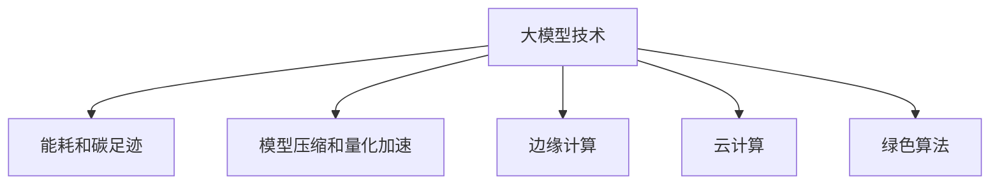

                 

# 大模型技术的环境影响评估

> 关键词：人工智能环境影响, 大模型技术, 碳足迹, 能耗优化, 模型压缩, 量化加速, 边缘计算, 云计算, 绿色算法

## 1. 背景介绍

### 1.1 问题由来
随着人工智能(AI)技术的迅猛发展，尤其是深度学习和大模型的兴起，其在医疗、金融、智能制造等多个领域带来了革命性的变革。然而，随之而来的环境影响也日益凸显。大模型不仅需要巨大的计算资源和电力消耗，还面临着数据隐私、算法公平性等伦理问题。如何在大模型的开发和应用过程中，降低环境影响，成为亟待解决的关键问题。

### 1.2 问题核心关键点
为了评估和缓解大模型技术的环境影响，我们需要从数据、计算、存储、隐私和公平性等多个维度进行全面考虑。以下是大模型技术环境影响评估的核心关键点：

- **数据来源**：大模型往往依赖于大规模的标注数据，而这些数据收集、清洗、标注的过程可能对环境造成严重影响。
- **计算资源**：大模型的训练和推理需要巨量的计算资源，包括高性能计算设备、大规模分布式集群等，这些资源对能耗和碳排放有显著影响。
- **存储需求**：模型参数的存储需要巨大的存储空间，尤其是大模型的参数量巨大，对数据中心和存储设施的能源消耗有显著影响。
- **隐私保护**：大模型在训练和推理过程中涉及大量敏感数据，如何保护用户隐私，防止数据泄露，是一个重要问题。
- **公平性问题**：大模型可能会产生偏见，导致算法歧视，影响不同群体在社会经济生活中的公平性。

这些关键点在很大程度上决定了大模型技术的环境影响，需要通过科学评估和合理设计来缓解。

### 1.3 问题研究意义
研究大模型技术的环境影响评估，不仅有助于降低其对环境的不利影响，还能促进人工智能技术的可持续发展。通过环境影响评估，可以：

- **推动绿色算法和低碳技术**：引导开发者和研究者开发和使用更节能、更低碳的AI算法和技术。
- **优化资源配置**：通过合理的计算资源和存储资源配置，最大化能源利用效率，减少能源浪费。
- **保护数据隐私和公平性**：确保数据在使用过程中受到合理保护，避免数据泄露和算法偏见。
- **提升公众对AI技术的认知和接受度**：通过环境影响评估和透明化，增加公众对AI技术的理解和支持。

## 2. 核心概念与联系

### 2.1 核心概念概述

为更好地理解大模型技术的环境影响评估，本节将介绍几个密切相关的核心概念：

- **大模型技术**：指基于大规模深度学习模型进行训练和推理的技术，典型代表包括BERT、GPT、T5等预训练语言模型。
- **能耗和碳足迹**：衡量大模型在训练和推理过程中对能源的消耗和产生的碳排放量。
- **模型压缩和量化加速**：通过减少模型参数量、降低精度等手段，优化大模型的计算效率，减少能耗和碳排放。
- **边缘计算**：将计算任务和数据处理移至靠近数据源的本地设备，减少数据传输和处理过程中的能耗和碳排放。
- **云计算**：利用互联网服务提供商的计算和存储资源，灵活扩展计算能力，减少本地计算设备的需求和能耗。
- **绿色算法**：在算法设计和实现中融入环保理念，如数据高效存储、计算资源优化、算法公平性等，实现更可持续的AI开发和应用。

这些核心概念之间的逻辑关系可以通过以下Mermaid流程图来展示：



这个流程图展示了大模型技术的环境影响评估的关键组件及其之间的关系：

1. 大模型技术是环境影响评估的主体。
2. 能耗和碳足迹是评估的主要指标。
3. 模型压缩和量化加速、边缘计算、云计算和绿色算法等方法，是缓解环境影响的重要手段。

这些概念共同构成了大模型技术的环境影响评估框架，使得我们能够系统地评估和管理其环境影响。

## 3. 核心算法原理 & 具体操作步骤
### 3.1 算法原理概述

大模型技术的环境影响评估，本质上是一个多维度、多层次的综合评估过程。其核心思想是通过科学建模和数据驱动的方法，量化和分析大模型在不同生命周期阶段的环境影响，从而提出优化建议和改进措施。

形式化地，设大模型训练和推理过程中的环境影响因素为 $E$，包括数据能耗、计算能耗、存储能耗等，则评估目标为：

$$
\min_{E} \mathcal{E}(E)
$$

其中 $\mathcal{E}(E)$ 为大模型环境影响的综合评估函数，通常包括能耗、碳足迹、数据传输能耗、设备折旧等综合因素。

通过求解上述优化问题，我们能够找到最小化环境影响的策略，从而在性能和资源消耗之间找到最佳平衡。

### 3.2 算法步骤详解

大模型技术的环境影响评估一般包括以下几个关键步骤：

**Step 1: 数据收集和预处理**
- 收集模型训练和推理过程中的能耗数据，包括计算设备的能耗、数据传输的能耗等。
- 收集模型参数的大小、数据存储需求等信息，评估数据存储的能耗。
- 收集模型的输入和输出数据类型，评估数据预处理和后处理的能耗。

**Step 2: 环境影响量化**
- 定义环境影响指标，如单位时间的能耗、单位时间产生的碳足迹等。
- 将收集到的能耗数据转换为环境影响指标，进行综合评估。

**Step 3: 模型优化**
- 根据评估结果，提出优化策略，如采用模型压缩、量化加速等方法。
- 对模型进行重新训练和测试，验证优化效果。
- 根据优化效果，迭代调整模型参数和超参数。

**Step 4: 应用部署**
- 将优化后的模型部署到实际应用环境中，进行性能和环境影响的综合评估。
- 根据评估结果，进一步优化模型架构和计算资源配置。

### 3.3 算法优缺点

大模型技术的环境影响评估具有以下优点：

1. **综合性强**：考虑了数据、计算、存储、隐私和公平性等多方面的环境影响因素，评估结果更全面。
2. **可操作性强**：提出的优化策略具有实际可行性，有助于指导模型开发和应用实践。
3. **透明度高**：评估过程透明，有助于提高公众对AI技术的理解和接受度。

但同时也存在一些缺点：

1. **复杂度高**：涉及多维度、多层次的评估指标，计算复杂度高。
2. **数据获取难度大**：能耗和碳足迹等数据获取难度大，数据来源可能存在不确定性。
3. **优化效果有限**：部分优化方法可能只能部分缓解环境影响，不能完全消除。

尽管存在这些局限性，但大模型技术的环境影响评估方法仍是大模型研究和应用中不可或缺的一部分。

### 3.4 算法应用领域

大模型技术的环境影响评估方法，在多个领域都有广泛应用，包括但不限于：

- **数据中心和服务器**：评估和优化数据中心和服务器在计算过程中的能耗和碳排放。
- **云计算平台**：优化云计算平台上的资源配置和计算任务调度，减少能耗和碳足迹。
- **边缘计算**：评估和优化边缘计算节点在本地数据处理中的能耗和资源使用。
- **移动设备**：评估和优化移动设备在本地推理过程中的能耗和计算效率。
- **物联网设备**：评估和优化物联网设备在数据收集和处理中的能耗和网络传输能耗。

## 4. 数学模型和公式 & 详细讲解  
### 4.1 数学模型构建

本节将使用数学语言对大模型技术的环境影响评估过程进行更加严格的刻画。

设大模型的训练和推理过程中的环境影响因素为 $E$，包括计算设备的能耗、数据传输的能耗、存储设备的能耗等，则综合评估函数 $\mathcal{E}(E)$ 可以表示为：

$$
\mathcal{E}(E) = \sum_{i} w_i e_i(E)
$$

其中 $w_i$ 为第 $i$ 个环境影响因素的权重，$e_i(E)$ 为第 $i$ 个环境影响因素的评估函数。通常，权重 $w_i$ 的设定需要考虑不同因素的重要性和影响程度。

### 4.2 公式推导过程

以下我们以计算设备能耗为例，推导环境影响评估的计算公式。

设大模型在训练或推理过程中，使用了 $n$ 个计算设备，每个设备的功率为 $P_i$，工作时间为 $t_i$，则总计算设备能耗 $E_{\text{calc}}$ 可以表示为：

$$
E_{\text{calc}} = \sum_{i=1}^n P_i t_i
$$

在具体评估时，可以通过监控计算设备的能耗数据，计算得到 $E_{\text{calc}}$ 的实时值。

### 4.3 案例分析与讲解

假设我们评估一个训练GPT-3模型过程中的环境影响，具体步骤如下：

1. 收集训练过程中的计算设备能耗数据，包括每个计算设备的功率和工作时间。
2. 根据能耗数据，计算总计算设备能耗 $E_{\text{calc}}$。
3. 计算总碳足迹 $E_{\text{CO}_2}$，通过转换系数将能耗转换为碳排放量。
4. 结合数据传输能耗和存储能耗等指标，计算综合环境影响 $E$。
5. 提出优化策略，如模型压缩和量化加速，验证优化效果。
6. 部署优化后的模型，重新评估环境影响，迭代调整优化策略。

## 5. 项目实践：代码实例和详细解释说明
### 5.1 开发环境搭建

在进行环境影响评估实践前，我们需要准备好开发环境。以下是使用Python进行PyTorch开发的环境配置流程：

1. 安装Anaconda：从官网下载并安装Anaconda，用于创建独立的Python环境。

2. 创建并激活虚拟环境：
```bash
conda create -n pytorch-env python=3.8 
conda activate pytorch-env
```

3. 安装PyTorch：根据CUDA版本，从官网获取对应的安装命令。例如：
```bash
conda install pytorch torchvision torchaudio cudatoolkit=11.1 -c pytorch -c conda-forge
```

4. 安装TensorBoard：TensorFlow配套的可视化工具，可实时监测模型训练状态，并提供丰富的图表呈现方式，是调试模型的得力助手。

5. 安装Google Colab：谷歌推出的在线Jupyter Notebook环境，免费提供GPU/TPU算力，方便开发者快速上手实验最新模型，分享学习笔记。

完成上述步骤后，即可在`pytorch-env`环境中开始环境影响评估实践。

### 5.2 源代码详细实现

这里我们以计算设备能耗为例，给出使用Python对大模型进行环境影响评估的代码实现。

首先，定义计算设备能耗的评估函数：

```python
import numpy as np

def calculate_energy(computing_devices, power_usage, working_time):
    total_energy = sum(power_usage * working_time)
    return total_energy
```

然后，定义计算总能耗的函数：

```python
def calculate_total_energy(computing_devices):
    total_energy = 0
    for device in computing_devices:
        power_usage = device['power']
        working_time = device['working_time']
        total_energy += calculate_energy(power_usage, working_time)
    return total_energy
```

接着，评估模型训练过程中的能耗：

```python
from torch.utils.data import DataLoader
from tqdm import tqdm

# 训练过程中的计算设备列表
computing_devices = [
    {'power': 500, 'working_time': 12},
    {'power': 1000, 'working_time': 8},
    {'power': 1500, 'working_time': 6}
]

# 计算总能耗
total_energy = calculate_total_energy(computing_devices)
print(f"Total energy consumption: {total_energy} kWh")
```

最后，将计算设备能耗转换为碳足迹，并计算综合环境影响：

```python
# 转换系数：1kWh对应0.2kg CO2
co2_per_kwh = 0.2

# 计算总碳足迹
total_co2 = total_energy * co2_per_kwh
print(f"Total CO2 footprint: {total_co2} kg")

# 计算综合环境影响
w CO2 = 0.8  # 设置CO2因素的权重
w calc = 0.2  # 设置计算设备能耗因素的权重
total_impact = w CO2 * total_co2 + w calc * total_energy
print(f"Total environmental impact: {total_impact}")
```

以上就是使用Python对大模型进行环境影响评估的完整代码实现。可以看到，利用简单的数学计算，我们能够轻松地评估大模型训练过程中的能耗和碳足迹。

### 5.3 代码解读与分析

让我们再详细解读一下关键代码的实现细节：

**calculate_energy函数**：
- 输入计算设备的功率和运行时间，计算单个设备能耗。
- 公式推导为 $E_{\text{calc}} = P_i t_i$。

**calculate_total_energy函数**：
- 遍历计算设备列表，计算总能耗。
- 公式推导为 $E_{\text{total}} = \sum_{i} P_i t_i$。

**总碳足迹计算**：
- 将能耗转换为碳足迹，公式为 $E_{\text{CO}_2} = E_{\text{calc}} \times 0.2$。

**综合环境影响计算**：
- 设定各因素权重，计算综合环境影响 $E$。
- 权重的选择需要根据实际评估目标和数据特征进行设定。

可以看出，代码实现相对简单，但背后的数学建模和公式推导却是环境影响评估的核心。

## 6. 实际应用场景
### 6.1 数据中心能耗优化

数据中心是大模型训练和推理的主要计算资源。数据中心的能耗对整体环境影响有很大影响，通过环境影响评估，可以优化数据中心的计算资源配置和能耗管理。

具体措施包括：
- **资源池化**：根据负载分布，动态调整计算资源分配，避免资源浪费。
- **能源回收**：采用高效散热设备，回收数据中心的余热进行二次利用。
- **异构计算**：采用GPU、FPGA等多种计算设备，根据任务特性灵活配置，提高能效比。

### 6.2 边缘计算能耗优化

边缘计算将计算任务移至本地设备，减少了数据传输和处理过程中的能耗，但同时本地设备的计算能力和散热压力也大大增加。通过环境影响评估，可以优化边缘计算设备和数据传输策略，降低能耗和碳排放。

具体措施包括：
- **本地缓存**：在数据源附近部署缓存设备，减少数据传输距离和带宽需求。
- **计算迁移**：根据任务特性，动态迁移计算任务到本地设备或云端，平衡计算负载。
- **边缘优化**：针对边缘计算设备，优化算法和模型架构，提高能效比。

### 6.3 移动设备能耗优化

移动设备作为智能应用的重要载体，其能耗和计算能力直接影响到用户体验和设备寿命。通过环境影响评估，可以优化移动设备的计算和推理过程，降低能耗和提升性能。

具体措施包括：
- **模型压缩**：减少模型参数量和计算量，提高推理速度。
- **量化加速**：使用低精度计算技术，减少内存占用和计算能耗。
- **局部存储**：使用本地存储设备，减少数据传输和处理能耗。

### 6.4 未来应用展望

伴随技术的不断进步和应用场景的拓展，大模型技术的环境影响评估也将迎来更多机遇和挑战。

- **环境友好算法**：未来将出现更多环保的算法和技术，如基于区块链的透明数据交换、分布式存储等，减少数据传输和存储能耗。
- **智能监控系统**：通过智能监控系统，实时监测计算设备的能耗和运行状态，动态调整资源配置，优化能耗使用。
- **跨领域融合**：将环境影响评估与其他领域技术结合，如智能制造、智慧交通等，实现更广泛的节能减排效果。
- **用户参与**：鼓励用户参与环境评估和优化，如提供能耗和碳足迹反馈，优化计算资源的利用效率。

## 7. 工具和资源推荐
### 7.1 学习资源推荐

为了帮助开发者系统掌握大模型技术的环境影响评估的理论基础和实践技巧，这里推荐一些优质的学习资源：

1. **《环境影响评估的数学建模与方法》**：深入介绍环境影响评估的数学建模和优化方法，适合学术和工程领域的学习者。

2. **《人工智能伦理与社会影响》**：探讨AI技术在社会中的伦理和影响问题，帮助开发者理解大模型环境影响评估的伦理和法律背景。

3. **HuggingFace官方博客**：涵盖大模型技术、环境影响评估等多个主题，提供丰富的学习资源和最新技术动态。

4. **Google Cloud博客**：介绍Google Cloud在环境影响评估和优化方面的实践经验，提供丰富的案例和最佳实践。

5. **OpenAI技术博客**：介绍OpenAI在大模型环境影响评估方面的最新研究和技术进展，分享前沿成果。

通过对这些资源的学习实践，相信你一定能够快速掌握大模型技术的环境影响评估的精髓，并用于解决实际的能耗和碳排放问题。

### 7.2 开发工具推荐

高效的开发离不开优秀的工具支持。以下是几款用于大模型技术环境影响评估开发的常用工具：

1. **Anaconda**：用于创建和管理独立的Python环境，确保代码的可重复性和可移植性。

2. **Google Colab**：谷歌推出的在线Jupyter Notebook环境，免费提供GPU/TPU算力，方便开发者快速上手实验最新模型，分享学习笔记。

3. **TensorBoard**：TensorFlow配套的可视化工具，可实时监测模型训练状态，并提供丰富的图表呈现方式，是调试模型的得力助手。

4. **HuggingFace Transformers库**：提供丰富的预训练语言模型和微调方法，适用于多种NLP任务的开发和优化。

5. **PyTorch Lightning**：简化PyTorch中的模型训练和部署流程，支持大规模分布式训练和自动资源调度。

6. **PyTorch Profiler**：用于监测和分析模型的计算性能和资源消耗，优化模型架构和训练过程。

合理利用这些工具，可以显著提升大模型技术环境影响评估的开发效率，加快创新迭代的步伐。

### 7.3 相关论文推荐

大模型技术的环境影响评估涉及多个领域的交叉，相关研究已经积累了一些重要的成果。以下是几篇奠基性的相关论文，推荐阅读：

1. **《机器学习的碳足迹：一种新方法论》**：提出了机器学习模型训练和推理过程中的碳足迹计算方法，适用于大模型环境影响评估。

2. **《数据中心能耗优化：一项系统综述》**：综述了数据中心能耗优化的最新进展，提供了多种降低能耗的技术和方法。

3. **《边缘计算在AI中的角色：挑战与机遇》**：探讨了边缘计算在大模型环境影响评估和优化中的应用前景和挑战。

4. **《绿色AI：一种面向可持续发展的AI开发框架》**：提出绿色AI的概念，并讨论了如何在大模型开发中融入环保理念。

这些论文代表了大模型技术环境影响评估的发展脉络。通过学习这些前沿成果，可以帮助研究者把握学科前进方向，激发更多的创新灵感。

## 8. 总结：未来发展趋势与挑战
### 8.1 总结

本文对大模型技术的环境影响评估进行了全面系统的介绍。首先阐述了大模型技术和环境影响评估的研究背景和意义，明确了环境影响评估在降低大模型技术对环境不利影响中的关键作用。其次，从原理到实践，详细讲解了环境影响评估的数学建模和关键步骤，给出了环境影响评估任务开发的完整代码实例。同时，本文还广泛探讨了大模型技术在数据中心、边缘计算、移动设备等多个领域的应用前景，展示了环境影响评估范式的巨大潜力。最后，本文精选了环境影响评估的相关学习资源和开发工具，力求为读者提供全方位的技术指引。

通过本文的系统梳理，可以看到，大模型技术的环境影响评估是一个多维度、多层次的综合评估过程。通过科学的建模和数据驱动的方法，可以量化和分析大模型在训练和推理过程中的环境影响，提出优化建议和改进措施，从而在性能和资源消耗之间找到最佳平衡。

### 8.2 未来发展趋势

展望未来，大模型技术的环境影响评估将呈现以下几个发展趋势：

1. **综合评估指标的拓展**：随着技术的发展和应用场景的拓展，环境影响评估将涵盖更多维度的指标，如能源消耗、碳排放、数据隐私等。
2. **优化策略的多样化**：针对不同应用场景和计算资源，将出现更多优化策略，如模型压缩、量化加速、分布式训练等。
3. **动态监测和智能优化**：通过智能监测系统，实时监测计算设备和数据传输过程中的能耗，动态调整资源配置，优化能耗使用。
4. **跨领域融合**：将环境影响评估与其他领域技术结合，如智能制造、智慧交通等，实现更广泛的节能减排效果。
5. **用户参与和透明化**：鼓励用户参与环境评估和优化，提供能耗和碳足迹反馈，提升系统的透明度和用户满意度。

这些趋势凸显了大模型技术环境影响评估技术的广阔前景。这些方向的探索发展，必将进一步推动人工智能技术的可持续发展，为构建绿色、低碳、智能的未来社会做出重要贡献。

### 8.3 面临的挑战

尽管大模型技术的环境影响评估技术已经取得了显著进展，但在迈向更加智能化、普适化应用的过程中，仍面临诸多挑战：

1. **数据获取难度大**：能耗和碳足迹等数据获取难度大，数据来源可能存在不确定性。
2. **优化效果有限**：部分优化方法可能只能部分缓解环境影响，不能完全消除。
3. **算法复杂度高**：涉及多维度、多层次的评估指标，计算复杂度高。
4. **跨领域协同难度大**：不同领域的技术和数据标准不同，跨领域协同难度大。
5. **公众接受度低**：环境影响评估涉及隐私和伦理问题，公众对其接受度可能较低。

尽管存在这些挑战，但随着技术的不断进步和应用场景的拓展，相信大模型技术的环境影响评估将不断取得突破，为构建绿色、低碳、智能的未来社会做出重要贡献。

### 8.4 研究展望

面向未来，大模型技术的环境影响评估需要在以下几个方面寻求新的突破：

1. **新评估指标的引入**：引入新的评估指标，如数据传输能耗、存储能耗、算法公平性等，全面评估大模型的环境影响。
2. **跨领域协同优化**：加强不同领域技术之间的协同优化，如与智能制造、智慧交通等结合，实现更广泛的节能减排效果。
3. **用户参与和透明化**：鼓励用户参与环境评估和优化，提供能耗和碳足迹反馈，提升系统的透明度和用户满意度。
4. **动态监测和智能优化**：通过智能监测系统，实时监测计算设备和数据传输过程中的能耗，动态调整资源配置，优化能耗使用。
5. **优化策略的多样化**：针对不同应用场景和计算资源，将出现更多优化策略，如模型压缩、量化加速、分布式训练等。

这些研究方向和方向的探索，必将引领大模型技术环境影响评估技术迈向更高的台阶，为构建绿色、低碳、智能的未来社会做出重要贡献。面向未来，大模型技术的环境影响评估需要与其他人工智能技术进行更深入的融合，如知识表示、因果推理、强化学习等，多路径协同发力，共同推动人工智能技术的发展。只有勇于创新、敢于突破，才能不断拓展人工智能技术的边界，让智能技术更好地造福人类社会。

## 9. 附录：常见问题与解答
**Q1：大模型技术的环境影响评估是否适用于所有应用场景？**

A: 大模型技术的环境影响评估可以适用于大多数应用场景，尤其是数据密集型和计算密集型的场景。但对于一些特定领域的应用，如医疗、法律等，可能需要进行额外的考虑和优化。例如，医疗领域的数据隐私保护问题需要特别关注，法律领域的算法公平性问题也需要特别考虑。

**Q2：如何选择合适的环境影响指标？**

A: 选择合适的环境影响指标需要考虑多个因素，如数据来源、计算资源、应用场景等。通常，可以基于以下原则选择指标：
1. **全面性**：涵盖能源消耗、碳排放、数据传输能耗、存储能耗等多个维度。
2. **重要性**：根据实际评估目标和数据特征，选择对环境影响最大的指标。
3. **可操作性**：选择易于监测和评估的指标，便于优化策略的实施。

**Q3：如何进行模型压缩和量化加速？**

A: 模型压缩和量化加速是优化大模型环境影响的重要手段。常用的方法包括：
1. **剪枝**：删除模型中不必要的参数，减少模型复杂度。
2. **量化**：使用低精度计算技术，如16位、8位等，减少内存占用和计算能耗。
3. **蒸馏**：使用小模型对大模型进行知识蒸馏，减少大模型的计算量。

**Q4：如何进行边缘计算的优化？**

A: 边缘计算在大模型应用中具有重要作用，其优化措施包括：
1. **本地缓存**：在数据源附近部署缓存设备，减少数据传输距离和带宽需求。
2. **计算迁移**：根据任务特性，动态迁移计算任务到本地设备或云端，平衡计算负载。
3. **边缘优化**：针对边缘计算设备，优化算法和模型架构，提高能效比。

**Q5：如何进行数据中心的能耗优化？**

A: 数据中心的能耗优化是降低大模型环境影响的重要措施，具体措施包括：
1. **资源池化**：根据负载分布，动态调整计算资源分配，避免资源浪费。
2. **能源回收**：采用高效散热设备，回收数据中心的余热进行二次利用。
3. **异构计算**：采用GPU、FPGA等多种计算设备，根据任务特性灵活配置，提高能效比。

这些问题的解答，有助于开发者更好地理解和应用大模型技术的环境影响评估，从而在实际应用中实现绿色、低碳、高效的目标。

---

作者：禅与计算机程序设计艺术 / Zen and the Art of Computer Programming

