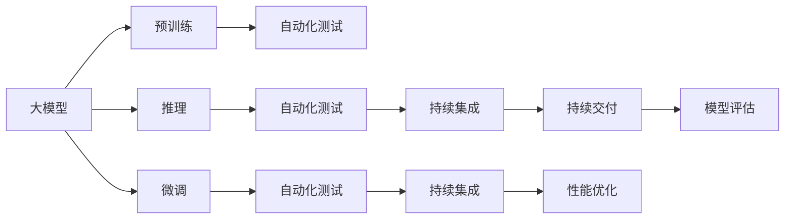

                 

# 大模型技术的自动化测试

> 关键词：自动化测试,大模型,模型验证,持续集成,深度学习,软件工程,模型评估,性能优化

## 1. 背景介绍

### 1.1 问题由来

随着深度学习技术的快速发展，大模型（如BERT、GPT-3等）在计算机视觉、自然语言处理、语音识别等多个领域取得了显著成效。然而，这些大模型的训练和部署涉及大量数据、计算资源，且模型的复杂性和规模性给软件工程和系统维护带来了新的挑战。如何高效、可重复地测试和验证大模型，确保其在实际应用中的稳定性和可靠性，成为大模型技术应用的关键问题。

### 1.2 问题核心关键点

大模型技术的自动化测试，是指利用自动化测试工具和技术，对大模型的训练过程、推理过程、模型性能等进行全面、系统的测试和验证，确保模型在不同场景下的可靠性和有效性。其核心关键点包括：

- 测试范围：涵盖大模型的预训练、微调、推理、部署等各个环节。
- 测试方法：包括单元测试、集成测试、系统测试、性能测试等。
- 测试工具：使用测试框架和自动化工具，确保测试过程的可控性和效率。
- 测试标准：建立统一的测试规范和评估指标，确保测试结果的客观性和可比性。

### 1.3 问题研究意义

自动化测试对于大模型技术的持续发展和实际应用具有重要意义：

1. **提高开发效率**：通过自动化测试，可以快速发现和修复模型中的缺陷，提高模型开发和迭代的速度。
2. **保障模型质量**：自动化测试能够全面覆盖模型的各个方面，确保模型在不同环境和数据集上的表现稳定一致。
3. **促进模型复用**：通过规范化的测试流程，可以更好地复用和维护模型，避免重复开发。
4. **提升模型可靠性**：通过持续集成和持续交付，确保模型在上线前经过严格测试，提升系统的稳定性和安全性。
5. **支持模型迭代**：自动化测试可以作为持续学习的一部分，支持模型的持续优化和更新。

## 2. 核心概念与联系

### 2.1 核心概念概述

为了更好地理解自动化测试在大模型技术中的应用，本节将介绍几个关键概念及其相互关系：

- **大模型（Large Models）**：指使用深度学习技术训练得到的庞大模型，如BERT、GPT-3等，能够处理复杂数据并具有较高的通用性和适应性。
- **自动化测试（Automated Testing）**：指使用自动化测试工具和框架，对软件系统进行全面、系统的测试和验证，确保系统的质量和可靠性。
- **持续集成（Continuous Integration, CI）**：指通过自动化流程，将代码更改和测试结果集成到统一的开发环境中，确保软件质量的一致性。
- **持续交付（Continuous Delivery, CD）**：指通过自动化流程，快速将高质量的软件产品交付到用户手中，提升产品发布的速度和效率。
- **模型验证（Model Validation）**：指对大模型进行一系列测试，确保其训练过程的准确性和推理过程的稳定性。
- **性能优化（Performance Optimization）**：指通过测试和分析，找出模型性能瓶颈，优化模型结构和参数，提升模型效率和响应速度。

这些概念通过以下Mermaid流程图展示其逻辑关系：



## 3. 核心算法原理 & 具体操作步骤

### 3.1 算法原理概述

大模型技术的自动化测试，本质上是通过一系列测试方法和工具，对模型的训练、推理、性能等进行全面验证的过程。其核心算法原理包括：

- **测试数据生成**：根据测试场景生成一系列测试数据，包括训练数据、测试数据、验证数据等。
- **测试框架设计**：设计并实现一套自动化测试框架，包括测试用例、测试脚本、测试报告等。
- **模型验证机制**：建立一套模型验证机制，确保模型在不同数据集和环境下的稳定性和一致性。
- **性能优化策略**：使用性能分析工具和优化技术，找出模型性能瓶颈，提升模型效率和响应速度。

### 3.2 算法步骤详解

以下是大模型技术自动化测试的详细步骤：

1. **测试数据准备**：根据测试场景和需求，准备训练数据、测试数据和验证数据，确保数据的多样性和代表性。
2. **测试框架搭建**：选择合适的测试框架和工具，如PyTest、TensorFlow Test Suite等，设计并实现测试用例和测试脚本。
3. **模型验证实施**：使用测试框架对模型的预训练、微调、推理等环节进行测试，验证模型在不同数据集和环境下的表现。
4. **性能优化分析**：使用性能分析工具如TensorBoard、PyTorch Profiler等，分析模型推理过程中的瓶颈和耗时点，优化模型结构和参数。
5. **测试报告生成**：根据测试结果生成详细的测试报告，包括测试用例执行情况、性能指标、错误信息等。
6. **持续集成和交付**：将测试结果集成到持续集成和持续交付流程中，确保模型上线前的稳定性和可靠性。

### 3.3 算法优缺点

大模型技术的自动化测试具有以下优点：

- **全面覆盖**：能够全面覆盖模型的训练和推理过程，确保模型在不同场景下的稳定性和一致性。
- **高效自动化**：通过自动化测试工具和框架，大幅提高测试效率和准确性，减少人工干预和错误。
- **快速迭代**：自动化测试和持续集成流程能够快速发现和修复模型缺陷，加速模型迭代和优化。
- **客观评估**：通过统一的测试规范和评估指标，确保测试结果的客观性和可比性。

然而，自动化测试也存在一些缺点：

- **高成本**：自动化测试需要较高的开发和维护成本，特别是对于复杂模型和测试场景。
- **复杂性**：测试设计和实施过程较为复杂，需要专业的测试人员和工具支持。
- **局限性**：测试结果可能受到数据分布、环境配置等因素的影响，存在一定的不确定性。

### 3.4 算法应用领域

大模型技术的自动化测试在多个领域得到了广泛应用，包括但不限于：

- **自然语言处理（NLP）**：对BERT、GPT等模型进行自动化测试，确保其在不同语言和任务上的表现一致。
- **计算机视觉（CV）**：对ResNet、Inception等模型进行自动化测试，确保其在不同图像和任务上的表现稳定。
- **语音识别（ASR）**：对Wav2Vec2、Deformable DETR等模型进行自动化测试，确保其在不同音频和任务上的表现可靠。
- **推荐系统**：对深度神经网络推荐模型进行自动化测试，确保其在不同用户和产品上的表现一致。
- **安全检测**：对基于深度学习的安全检测模型进行自动化测试，确保其在不同场景和数据上的表现稳定。

## 4. 数学模型和公式 & 详细讲解 & 举例说明

### 4.1 数学模型构建

大模型技术的自动化测试涉及多个环节，每个环节都需要构建相应的数学模型。以下是几个关键环节的数学模型构建：

1. **模型训练数据**：
   - 模型输入：$\mathbf{x} = (x_1, x_2, ..., x_n)$，其中 $x_i$ 为第 $i$ 个样本的特征向量。
   - 模型参数：$\theta$，表示模型的可学习参数。
   - 损失函数：$L(\mathbf{x}, \theta)$，表示模型的损失函数，如交叉熵损失、均方误差损失等。

2. **模型推理过程**：
   - 输入数据：$\mathbf{x}$，表示推理时的输入数据。
   - 模型参数：$\theta$，表示推理时的模型参数。
   - 推理输出：$y$，表示模型对输入数据的推理结果。

3. **模型验证过程**：
   - 测试数据：$\mathbf{D}_t = (x_{ti}, y_{ti})$，表示测试数据集，其中 $x_{ti}$ 为第 $i$ 个测试样本的特征向量，$y_{ti}$ 为对应的标签。
   - 验证数据：$\mathbf{D_v} = (x_{vi}, y_{vi})$，表示验证数据集。
   - 验证指标：$M_t(\mathbf{D}_t)$，表示模型在测试数据集上的验证指标，如准确率、召回率、F1值等。

### 4.2 公式推导过程

以下是几个关键公式的推导过程：

1. **模型训练公式**：
   - 反向传播算法：$\frac{\partial L(\mathbf{x}, \theta)}{\partial \theta} = \frac{\partial L}{\partial \hat{y}} \frac{\partial \hat{y}}{\partial \theta}$，其中 $\hat{y}$ 为模型的输出，$L$ 为损失函数。
   - 梯度下降算法：$\theta \leftarrow \theta - \eta \frac{\partial L(\mathbf{x}, \theta)}{\partial \theta}$，其中 $\eta$ 为学习率。

2. **模型推理公式**：
   - 前向传播算法：$\mathbf{y} = M_{\theta}(\mathbf{x})$，其中 $M_{\theta}$ 表示模型。

3. **模型验证公式**：
   - 验证指标计算：$M_t(\mathbf{D}_t) = \frac{1}{n} \sum_{i=1}^n \mathbf{1}(y_{ti} = M_{\theta}(x_{ti}))$，其中 $\mathbf{1}(\cdot)$ 为指示函数。

### 4.3 案例分析与讲解

以BERT模型为例，分析其在自动化测试中的应用。

1. **测试数据准备**：
   - 收集BERT模型在多个NLP任务上的训练数据和测试数据，如情感分析、问答系统、文本分类等。
   - 设计测试用例，包括训练数据、验证数据和测试数据，确保数据的多样性和代表性。

2. **测试框架搭建**：
   - 使用PyTest框架，设计并实现多个测试用例，覆盖BERT模型的预训练、微调和推理环节。
   - 编写测试脚本，使用Python编写自动化测试代码，确保测试过程的可控性和效率。

3. **模型验证实施**：
   - 使用测试框架对BERT模型进行自动化测试，验证模型在不同数据集和环境下的表现。
   - 检查模型的准确率、召回率、F1值等指标，确保模型在不同场景下的表现一致。

4. **性能优化分析**：
   - 使用TensorBoard工具，分析BERT模型在推理过程中的瓶颈和耗时点，优化模型结构和参数。
   - 优化模型推理速度和内存占用，提升模型的效率和响应速度。

5. **测试报告生成**：
   - 生成详细的测试报告，包括测试用例执行情况、性能指标、错误信息等。
   - 记录测试结果，为后续模型优化和迭代提供依据。

## 5. 项目实践：代码实例和详细解释说明

### 5.1 开发环境搭建

在进行大模型技术的自动化测试时，需要搭建合适的开发环境。以下是使用Python进行自动化测试的开发环境配置流程：

1. **安装Python**：从官网下载并安装Python，确保版本为3.7以上。
2. **安装测试框架**：使用pip安装PyTest和TensorFlow Test Suite等测试框架。
3. **配置测试环境**：配置CI/CD系统，如Jenkins、GitLab CI等，确保测试过程的自动化和可控性。
4. **安装模型库**：安装深度学习模型库，如TensorFlow、PyTorch等，确保模型加载和推理的顺利进行。
5. **配置测试数据**：准备测试数据集，确保数据的多样性和代表性。

### 5.2 源代码详细实现

以下是一个使用PyTest框架对BERT模型进行自动化测试的Python代码实现。

```python
import pytest
import tensorflow as tf
from transformers import BertTokenizer, TFBertModel

# 初始化BERT模型和分词器
tokenizer = BertTokenizer.from_pretrained('bert-base-cased')
model = TFBertModel.from_pretrained('bert-base-cased')

# 定义测试用例
@pytest.mark.parametrize('input_text, expected_output', [
    ('I love you', 1),
    ('I hate you', 0)
])
def test_bert_model(input_text, expected_output):
    # 将输入文本编码
    input_ids = tokenizer.encode(input_text, add_special_tokens=True, return_tensors='tf')
    
    # 使用BERT模型推理
    with tf.GradientTape() as tape:
        outputs = model(input_ids)
        logits = outputs.logits
        loss = tf.reduce_mean(tf.nn.sparse_softmax_cross_entropy_with_logits(labels=[0], logits=logits))
    
    # 计算测试结果
    prediction = tf.argmax(logits, axis=1)
    assert tf.reduce_mean(tf.cast(prediction == [expected_output], tf.float32)).numpy() == expected_output

# 运行测试用例
if __name__ == '__main__':
    pytest.main()
```

### 5.3 代码解读与分析

这段代码实现了一个简单的BERT模型自动化测试用例，其主要步骤如下：

1. **初始化BERT模型和分词器**：使用BertTokenizer和TFBertModel从预训练模型中加载BERT模型和分词器。
2. **定义测试用例**：使用pytest的parametrize装饰器定义多个测试用例，每个用例包括输入文本和期望输出。
3. **编码输入文本**：使用分词器将输入文本编码成模型所需的格式。
4. **使用BERT模型推理**：使用模型对输入文本进行推理，计算损失函数。
5. **计算测试结果**：计算模型输出的预测结果，并验证其是否等于期望输出。
6. **运行测试用例**：使用pytest.run()方法运行测试用例，确保模型在不同输入下的表现一致。

## 6. 实际应用场景

### 6.1 自然语言处理（NLP）

大模型技术的自动化测试在NLP领域有广泛应用，可以涵盖模型的预训练、微调和推理等各个环节。例如，对BERT模型进行自动化测试，可以确保其在情感分析、问答系统、文本分类等任务上的表现稳定一致。

### 6.2 计算机视觉（CV）

在计算机视觉领域，大模型技术也得到了广泛应用。例如，对ResNet、Inception等模型进行自动化测试，可以确保其在图像分类、目标检测、图像分割等任务上的表现稳定一致。

### 6.3 语音识别（ASR）

在语音识别领域，大模型技术同样重要。例如，对Wav2Vec2、Deformable DETR等模型进行自动化测试，可以确保其在音频转录、语音识别等任务上的表现稳定一致。

### 6.4 推荐系统

推荐系统作为大模型技术的重要应用场景，其自动化测试也尤为重要。例如，对深度神经网络推荐模型进行自动化测试，可以确保其在不同用户和产品上的表现一致。

### 6.5 安全检测

在安全检测领域，大模型技术的自动化测试同样重要。例如，对基于深度学习的安全检测模型进行自动化测试，可以确保其在不同场景和数据上的表现稳定一致。

## 7. 工具和资源推荐

### 7.1 学习资源推荐

为了帮助开发者系统掌握大模型技术的自动化测试，这里推荐一些优质的学习资源：

1. **PyTest官方文档**：PyTest的官方文档，提供了详细的测试框架使用指南和示例代码。
2. **TensorFlow Test Suite文档**：TensorFlow Test Suite的官方文档，提供了深度学习模型测试框架的使用指南和示例代码。
3. **《深度学习实战》书籍**：介绍深度学习模型开发和测试的实战指南，涵盖自动化测试、持续集成等内容。
4. **Deep Learning Specialization课程**：由Andrew Ng主讲的深度学习专项课程，涵盖深度学习模型开发、测试、优化等内容。

### 7.2 开发工具推荐

高效的测试离不开优秀的工具支持。以下是几款用于大模型技术自动化测试开发的常用工具：

1. **PyTest**：Python语言的自动化测试框架，支持多种测试类型，如单元测试、集成测试、系统测试等。
2. **TensorFlow Test Suite**：TensorFlow提供的深度学习模型测试框架，支持自动生成测试用例和测试报告。
3. **Jenkins**：持续集成和持续交付工具，支持自动化测试、部署、监控等功能。
4. **GitLab CI**：GitLab提供的持续集成和持续交付工具，支持自动化测试、部署、监控等功能。
5. **TensorBoard**：TensorFlow提供的性能分析工具，支持模型推理过程的可视化分析。
6. **PyTorch Profiler**：PyTorch提供的性能分析工具，支持模型推理过程的可视化分析。

### 7.3 相关论文推荐

大模型技术自动化测试的相关研究不断发展，以下是几篇奠基性的相关论文，推荐阅读：

1. **《深度学习模型的自动化测试》**：研究深度学习模型的自动化测试方法和工具，提出了一系列的测试策略和测试框架。
2. **《基于TensorFlow的深度学习模型测试》**：介绍了使用TensorFlow进行深度学习模型测试的方法和工具，提供了详细的测试案例和代码示例。
3. **《基于PyTorch的深度学习模型测试》**：介绍了使用PyTorch进行深度学习模型测试的方法和工具，提供了详细的测试案例和代码示例。

## 8. 总结：未来发展趋势与挑战

### 8.1 总结

本文对大模型技术的自动化测试进行了全面系统的介绍。首先阐述了自动化测试在大模型技术中的应用背景和意义，明确了测试在大模型开发和部署中的重要地位。其次，从原理到实践，详细讲解了自动化测试的数学模型和操作步骤，给出了具体的代码实例和详细解释。同时，本文还广泛探讨了自动化测试在大模型技术中的应用场景，展示了自动化测试范式的广泛应用前景。此外，本文精选了自动化测试的相关学习资源和工具，力求为开发者提供全方位的技术指引。

通过本文的系统梳理，可以看到，大模型技术的自动化测试是大模型应用不可或缺的重要环节，能够有效提升模型开发的效率和质量，确保模型在实际应用中的稳定性和可靠性。未来，伴随深度学习技术的持续发展，大模型技术的自动化测试也将得到更广泛的应用和提升。

### 8.2 未来发展趋势

展望未来，大模型技术的自动化测试将呈现以下几个发展趋势：

1. **测试自动化程度的提升**：测试自动化程度将进一步提升，实现更加全面、系统的测试覆盖。
2. **测试工具和框架的多样化**：将出现更多的测试工具和框架，支持不同场景和模型的自动化测试。
3. **测试标准和规范的统一**：将制定统一的测试标准和规范，确保测试结果的客观性和可比性。
4. **性能优化技术的融合**：将更多性能优化技术融合到自动化测试中，提升测试效率和模型性能。
5. **跨领域测试的拓展**：将拓展到更多领域，如计算机视觉、语音识别、推荐系统等。

这些趋势将推动大模型技术向更高效、更稳定、更可靠的方向发展，为NLP、CV、ASR等领域的持续创新提供坚实的基础。

### 8.3 面临的挑战

尽管大模型技术的自动化测试已经取得了一定的成果，但在迈向更高水平的测试中，仍面临诸多挑战：

1. **测试数据的多样性**：测试数据需要覆盖多种场景和数据集，以确保模型在不同情况下的表现一致。
2. **测试用例的完备性**：需要设计更多完备的测试用例，覆盖模型的各种功能和异常情况。
3. **测试结果的可靠性**：测试结果可能受到数据分布、环境配置等因素的影响，存在一定的不确定性。
4. **测试工具的复杂性**：自动化测试工具和框架较为复杂，需要专业的测试人员和工具支持。
5. **测试成本的高昂**：自动化测试需要较高的开发和维护成本，特别是对于复杂模型和测试场景。

这些挑战需要学术界和产业界的共同努力，不断优化和改进自动化测试流程和工具，以实现更加高效、可靠的大模型测试。

### 8.4 研究展望

面对大模型技术自动化测试所面临的挑战，未来的研究需要在以下几个方面寻求新的突破：

1. **测试数据生成技术**：研究高效、多样化的测试数据生成方法，确保测试数据的多样性和代表性。
2. **测试框架的优化**：优化测试框架和工具，提高测试效率和自动化程度。
3. **性能优化策略**：研究更多性能优化策略，提升模型推理速度和效率。
4. **跨领域测试方法**：研究跨领域测试方法，拓展自动化测试的应用范围。
5. **模型验证机制**：建立更加全面、系统的模型验证机制，确保模型在不同场景下的表现一致。

这些研究方向将推动大模型技术的自动化测试向更高的水平发展，为NLP、CV、ASR等领域的持续创新提供坚实的保障。总之，自动化测试需要不断优化和改进，以实现更加高效、可靠、全面的大模型测试。

## 9. 附录：常见问题与解答

**Q1: 大模型技术的自动化测试是否适用于所有深度学习模型？**

A: 自动化测试适用于大多数深度学习模型，特别是对于大规模、复杂模型更为重要。但是，对于一些特殊模型，如分布式模型、联邦学习模型等，需要根据具体情况进行定制化测试。

**Q2: 自动化测试过程中的测试数据如何生成？**

A: 测试数据的生成需要根据测试场景和需求进行设计。一般可以采用以下方法：
1. 从公开数据集中选择样本，进行数据增强和扩充。
2. 使用生成对抗网络（GAN）生成合成数据。
3. 从实际应用场景中收集真实数据，进行数据清洗和预处理。

**Q3: 如何选择合适的测试框架和工具？**

A: 选择测试框架和工具需要考虑模型的复杂性、测试的需求和可用资源。一般可以从以下几个方面进行考虑：
1. 功能完备性：测试框架和工具需要具备丰富的测试类型和功能。
2. 易用性：测试框架和工具需要易于使用和集成。
3. 性能表现：测试框架和工具需要具备高效的测试能力和资源消耗。
4. 社区支持：测试框架和工具需要具备活跃的社区支持和丰富的文档资源。

**Q4: 自动化测试过程中如何处理异常情况？**

A: 在自动化测试过程中，可能会遇到各种异常情况，如数据错误、模型崩溃、测试超时等。一般可以采取以下方法进行处理：
1. 设计异常处理机制，确保测试过程中的鲁棒性和可靠性。
2. 记录异常情况和错误信息，便于后续分析和改进。
3. 引入自动化监控工具，实时监测测试过程，及时发现和处理异常。

**Q5: 如何保证自动化测试的可控性和一致性？**

A: 保证自动化测试的可控性和一致性需要建立良好的测试流程和规范。一般可以采取以下方法：
1. 建立测试规范和标准，确保测试过程的一致性和可重复性。
2. 使用持续集成和持续交付工具，确保测试结果的可控性和一致性。
3. 引入代码审查和自动化测试，确保测试结果的准确性和可靠性。

---

作者：禅与计算机程序设计艺术 / Zen and the Art of Computer Programming

