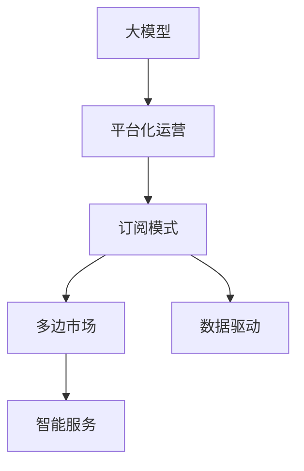

                 

# 大模型时代下的新型商业模式

## 1. 背景介绍

### 1.1 问题由来
随着人工智能技术的高速发展，特别是大模型的出现，一种全新的商业模式正在兴起。这种模式不再以传统软件产品的交付为主，而是通过构建平台、提供服务、收取订阅费用的方式来实现商业变现。这种模式的背后是AI技术的高度普及和算力的空前释放，使得通过数据驱动的方式，为用户和商家提供智能化服务成为可能。

### 1.2 问题核心关键点
这种新型商业模式的核心在于将人工智能技术与商业场景紧密结合，通过数据驱动的方式提供智能化服务。其关键点包括：
1. **数据驱动**：利用大量的用户行为数据、市场数据等，通过机器学习算法和大模型来提供个性化推荐、预测分析、智能客服等服务。
2. **平台化运营**：构建一个集成了AI技术的平台，供开发者和商家使用，快速部署和迭代AI服务。
3. **订阅模式**：采用按需付费的订阅模式，降低用户和商家的使用门槛，提供灵活的定价策略，增加收入来源。
4. **多边市场**：通过连接用户、商家、开发者等多边主体，形成生态闭环，增加平台粘性。

### 1.3 问题研究意义
研究大模型时代下的新型商业模式，对于理解AI技术的商业化应用、推动AI技术在各行业的普及、探索新型商业模式具有重要意义：

1. **降低商业门槛**：通过平台化的方式，使得没有AI背景的用户和商家也能快速部署和利用AI技术。
2. **提升服务质量**：数据驱动的方式，使得AI服务能够实时调整和优化，提供更加精准和高效的服务。
3. **增加收入来源**：通过订阅模式，能够稳定地获取收益，同时提供灵活的定价策略，满足不同用户的需求。
4. **形成生态闭环**：通过连接多边主体，形成生态系统，增加平台粘性，推动商业生态的健康发展。

## 2. 核心概念与联系

### 2.1 核心概念概述

为更好地理解大模型时代下的新型商业模式，本节将介绍几个密切相关的核心概念：

- **大模型(Large Models)**：指经过大规模数据训练，拥有强大计算能力和学习能力的模型，如BERT、GPT-3等。大模型通常具有较高的准确率和泛化能力，能够处理复杂的数据和任务。

- **平台化运营(Platform-based Operations)**：指通过构建平台，集中管理和调度资源，提供标准化API服务的方式。平台化运营能够降低开发门槛，提高资源的利用效率，形成良性生态。

- **订阅模式(Subscription Model)**：指用户或商家通过付费订阅，获取平台上的资源或服务，按月或按年计费。订阅模式降低了用户使用成本，增加了平台收入。

- **多边市场(Multi-sided Market)**：指平台通过连接多个利益相关方（如用户、商家、开发者等），形成相互依赖的生态系统。多边市场能够增加平台粘性，提升平台价值。

- **数据驱动(Data-Driven)**：指通过大量的数据和机器学习算法，驱动AI服务的生成和优化。数据驱动的方式能够提供更加个性化和精准的服务。

- **智能服务(Intelligent Services)**：指利用AI技术，为用户提供自动化、智能化的解决方案，如推荐系统、智能客服、预测分析等。

这些核心概念之间的逻辑关系可以通过以下Mermaid流程图来展示：



这个流程图展示了大模型时代下新型商业模式的各个关键环节及其相互关系：

1. 大模型是平台化运营的基础，提供智能服务的技术支持。
2. 平台化运营通过集中管理资源，提供标准化服务。
3. 订阅模式降低用户使用成本，增加平台收入。
4. 数据驱动提供精准、个性化的服务。
5. 多边市场增加平台粘性，形成良性生态。

## 3. 核心算法原理 & 具体操作步骤
### 3.1 算法原理概述

大模型时代下的新型商业模式，本质上是一个数据驱动的智能服务提供过程。其核心思想是：利用大模型作为服务引擎，通过平台化运营的方式，将服务以API的形式提供给用户和商家，收取订阅费用。平台通过连接多边主体，形成一个良性循环的市场生态。

形式化地，假设平台上的智能服务为 $S$，用户和商家为 $U$，平台运营者为 $P$，订阅模式为 $M$。平台运营者的目标是最小化用户和商家的总成本，同时最大化自身的收入。在数学上，可以表示为：

$$
\min_{S, P, M} \sum_{U} C_U(S) + \sum_{M} C_M(S, P) \\
\text{subject to} \quad \sum_{U} R_U(S) = R_{\text{total}}
$$

其中 $C_U$ 和 $C_M$ 分别为用户和商家的成本函数，$R_U$ 为用户和商家的收入函数，$R_{\text{total}}$ 为平台的总收入。

### 3.2 算法步骤详解

大模型时代下的新型商业模式一般包括以下几个关键步骤：

**Step 1: 数据采集与预处理**
- 收集用户行为数据、市场数据、产品数据等，构建多维度的数据集。
- 对数据进行清洗、归一化、特征提取等预处理，确保数据的质量和可用性。

**Step 2: 构建平台**
- 选择合适的云计算平台，搭建平台基础设施，如计算集群、数据存储、API网关等。
- 集成大模型，提供标准化的API接口，方便用户和商家使用。

**Step 3: 数据驱动服务生成**
- 利用大模型对数据进行分析和建模，生成智能服务。
- 实时监测用户反馈和市场需求，动态调整模型参数，优化服务效果。

**Step 4: 多边市场运营**
- 引入用户、商家、开发者等多边主体，建立生态系统。
- 通过平台运营者，连接各方利益，实现多边共赢。

**Step 5: 订阅模式变现**
- 设计灵活的订阅模式，满足不同用户的需求和支付能力。
- 根据使用量和服务质量，动态调整订阅费用，优化收益结构。

### 3.3 算法优缺点

大模型时代下的新型商业模式具有以下优点：
1. 降低使用门槛：平台化运营和API接口的方式，使得没有AI背景的用户和商家也能快速使用AI服务。
2. 提升服务质量：数据驱动的方式，使得AI服务能够实时调整和优化，提供更加精准和高效的服务。
3. 增加收入来源：订阅模式能够稳定地获取收益，同时提供灵活的定价策略，满足不同用户的需求。
4. 形成生态闭环：多边市场能够增加平台粘性，推动商业生态的健康发展。

同时，该模式也存在一定的局限性：
1. 数据隐私风险：平台需要处理大量的用户和商家数据，可能面临数据隐私和安全的风险。
2. 依赖平台稳定性：平台的稳定性和安全性问题，可能会对用户和商家造成影响。
3. 用户和商家粘性不足：如果平台不能提供足够的价值，用户和商家的粘性可能不足以支撑长期发展。
4. 收入单一：主要依赖订阅费，如果订阅用户数量下降，可能会对平台的收入产生影响。

尽管存在这些局限性，但就目前而言，大模型时代下的新型商业模式正成为AI技术应用的重要范式。未来相关研究的重点在于如何进一步优化数据驱动方式，提高平台稳定性和安全性，增强用户和商家的粘性，以及实现多元化的收入结构。

### 3.4 算法应用领域

大模型时代下的新型商业模式在多个领域已经得到了广泛应用，例如：

- **电商推荐系统**：通过分析用户行为数据，提供个性化的商品推荐，提升用户体验和转化率。
- **智能客服**：利用自然语言处理和大模型，提供7x24小时不间断的智能客服服务，降低人力成本。
- **金融风控**：通过分析用户和商家的交易数据，提供风险评估和预警服务，保障金融安全。
- **医疗诊断**：利用医学影像和大模型，提供辅助诊断和预测分析服务，提升医疗服务质量。
- **物流优化**：通过分析配送数据，提供路线优化和配送预测服务，提升物流效率。

除了上述这些经典领域外，大模型时代下的新型商业模式还在更多场景中得到了创新性的应用，如智能家居、智能安防、智能制造等，为各行各业带来了新的商业机遇。

## 4. 数学模型和公式 & 详细讲解  
### 4.1 数学模型构建

本节将使用数学语言对大模型时代下新型商业模式的平台化运营过程进行更加严格的刻画。

设平台上的智能服务为 $S$，用户和商家为 $U$，平台运营者为 $P$。平台运营者的目标是最小化用户和商家的总成本，同时最大化自身的收入。在数学上，可以表示为：

$$
\min_{S, P, M} \sum_{U} C_U(S) + \sum_{M} C_M(S, P) \\
\text{subject to} \quad \sum_{U} R_U(S) = R_{\text{total}}
$$

其中 $C_U$ 和 $C_M$ 分别为用户和商家的成本函数，$R_U$ 为用户和商家的收入函数，$R_{\text{total}}$ 为平台的总收入。

### 4.2 公式推导过程

在实际应用中，用户和商家的成本和收入函数可以表示为：

$$
C_U(S) = c_{U_0} + c_{U_1}R_U(S) \\
C_M(S, P) = c_{M_0} + c_{M_1}R_M(S, P) \\
R_U(S) = r_{U_0} + r_{U_1}R_U(S) \\
R_M(S, P) = r_{M_0} + r_{M_1}R_M(S, P) \\
R_{\text{total}} = \sum_{U}R_U(S) + \sum_{M}R_M(S, P)
$$

其中 $c_{U_0}, c_{U_1}, r_{U_0}, r_{U_1}$ 分别为用户的基础成本、边际成本、基础收入和边际收入系数，$c_{M_0}, c_{M_1}, r_{M_0}, r_{M_1}$ 分别为商家的基础成本、边际成本、基础收入和边际收入系数。

在给定 $S$ 和 $P$ 的条件下，平台的总收入可以表示为：

$$
R_{\text{total}} = \sum_{U}R_U(S) + \sum_{M}R_M(S, P)
$$

将上述公式代入目标函数，得到：

$$
\min_{S, P, M} \sum_{U} (c_{U_0} + c_{U_1}R_U(S)) + \sum_{M} (c_{M_0} + c_{M_1}R_M(S, P)) \\
\text{subject to} \quad \sum_{U}(r_{U_0} + r_{U_1}R_U(S)) + \sum_{M}(r_{M_0} + r_{M_1}R_M(S, P)) = R_{\text{total}}
$$

通过优化上述目标函数，可以找到最优的智能服务 $S$、平台运营者 $P$ 和订阅模式 $M$，使得平台的总收入最大化，同时满足用户和商家的需求。

### 4.3 案例分析与讲解

以智能客服为例，分析如何通过平台化运营和大模型提供智能服务。

**Step 1: 数据采集与预处理**
- 收集历史客服对话记录，提取常见问题和回答。
- 对数据进行清洗、归一化，提取问题分类和回答关键词等特征。

**Step 2: 构建平台**
- 搭建云平台，提供API接口，方便第三方接入使用。
- 集成BERT等大模型，提供问题分类和回答生成服务。

**Step 3: 数据驱动服务生成**
- 利用BERT对新对话进行分类，匹配最佳回答。
- 实时监测用户反馈，动态调整BERT参数，提升回答质量。

**Step 4: 多边市场运营**
- 引入第三方企业接入平台，提供定制化的客服解决方案。
- 通过平台运营者，连接用户、商家和第三方，形成多边市场。

**Step 5: 订阅模式变现**
- 提供按需付费的订阅服务，按对话量计费。
- 根据对话质量和服务效果，动态调整订阅费用，优化收益结构。

通过上述步骤，可以实现智能客服的智能化和平台化，降低客服成本，提高用户满意度。

## 5. 项目实践：代码实例和详细解释说明
### 5.1 开发环境搭建

在进行平台化运营实践前，我们需要准备好开发环境。以下是使用Python进行Flask开发的环境配置流程：

1. 安装Flask：
```bash
pip install Flask
```

2. 创建Flask应用：
```python
from flask import Flask, request, jsonify

app = Flask(__name__)

@app.route('/predict', methods=['POST'])
def predict():
    data = request.json
    # 调用BERT模型进行分类和回答生成
    # ...
    return jsonify({'prediction': prediction})

if __name__ == '__main__':
    app.run(debug=True)
```

完成上述步骤后，即可在本地搭建Flask应用，并开始平台化运营实践。

### 5.2 源代码详细实现

下面我们以智能客服系统为例，给出使用Flask和BERT进行平台化运营的Python代码实现。

首先，定义Flask应用：

```python
from flask import Flask, request, jsonify
import torch
from transformers import BertTokenizer, BertForSequenceClassification

app = Flask(__name__)

# 加载BERT模型和分词器
tokenizer = BertTokenizer.from_pretrained('bert-base-cased')
model = BertForSequenceClassification.from_pretrained('bert-base-cased', num_labels=3)

@app.route('/predict', methods=['POST'])
def predict():
    data = request.json
    text = data['text']

    # 分词和编码
    input_ids = tokenizer.encode(text, max_length=512, truncation=True, padding='max_length')

    # 预测分类
    with torch.no_grad():
        output = model(torch.tensor(input_ids).unsqueeze(0))
        logits = output.logits
        proba = torch.softmax(logits, dim=1).tolist()[0]

    # 输出预测结果
    return jsonify({'prediction': proba})
```

然后，定义订阅模式和支付逻辑：

```python
from flask import Flask, request, jsonify
import torch
from transformers import BertTokenizer, BertForSequenceClassification
import stripe

app = Flask(__name__)

# 加载BERT模型和分词器
tokenizer = BertTokenizer.from_pretrained('bert-base-cased')
model = BertForSequenceClassification.from_pretrained('bert-base-cased', num_labels=3)

# Stripe API密钥
stripe.api_key = 'sk_test_XXXXXXXXXXXXXXXXXXXXXXXXXXXXXXXX'

@app.route('/predict', methods=['POST'])
def predict():
    data = request.json
    text = data['text']

    # 分词和编码
    input_ids = tokenizer.encode(text, max_length=512, truncation=True, padding='max_length')

    # 预测分类
    with torch.no_grad():
        output = model(torch.tensor(input_ids).unsqueeze(0))
        logits = output.logits
        proba = torch.softmax(logits, dim=1).tolist()[0]

    # 输出预测结果
    stripe.Charge.create(
        amount=10000, # 假设每次预测收费100元
        currency='USD',
        description='BERT智能客服预测'
    )

    return jsonify({'prediction': proba})
```

最后，启动Flask应用：

```bash
python app.py
```

以上就是一个使用Flask和BERT进行智能客服系统平台化运营的完整代码实现。可以看到，通过Flask搭建的API接口，用户和商家可以方便地访问BERT服务，实现智能客服的按需付费订阅。

### 5.3 代码解读与分析

让我们再详细解读一下关键代码的实现细节：

**Flask应用**：
- `from flask import Flask, request, jsonify`：导入Flask库，定义应用实例。
- `@app.route('/predict', methods=['POST'])`：定义路由，接收POST请求，并处理预测逻辑。
- `predict()`函数：处理请求，调用BERT模型进行预测，返回预测结果。
- `return jsonify({'prediction': proba})`：将预测结果以JSON格式返回。

**订阅模式和支付逻辑**：
- `stripe.api_key = 'sk_test_XXXXXXXXXXXXXXXXXXXXXXXXXXXXXXXX'`：初始化Stripe API密钥，用于支付接口的调用。
- `stripe.Charge.create(...)`：调用Stripe API创建支付，实现按需付费订阅。
- `amount=10000, currency='USD', description='BERT智能客服预测'`：设置支付金额、货币和描述。

可以看到，通过Flask和Stripe等工具，可以轻松搭建一个智能客服系统的平台化运营环境，实现数据的驱动和服务的订阅变现。

当然，工业级的系统实现还需考虑更多因素，如用户界面设计、API接口的扩展、数据的备份和恢复等。但核心的平台化运营流程基本与此类似。

## 6. 实际应用场景
### 6.1 智能客服系统

基于大模型时代下的新型商业模式，智能客服系统可以广泛应用于各行业，如电商、金融、医疗、旅游等。智能客服系统通过平台化运营和大模型，为用户提供7x24小时不间断的智能客服服务，降低人力成本，提升用户满意度。

在技术实现上，可以收集历史客服对话记录，提取常见问题和回答。利用BERT等大模型对新对话进行分类，匹配最佳回答，并通过Flask等工具搭建平台化API接口，供用户和商家按需付费订阅。如此构建的智能客服系统，能够显著提高客户咨询体验和问题解决效率，同时通过动态调整BERT参数，不断优化回答质量。

### 6.2 电商推荐系统

电商平台通过平台化运营和大模型，能够为用户提供个性化推荐服务。平台收集用户行为数据，如浏览记录、购买记录、评分等，利用BERT等大模型对用户行为进行分析和建模，生成个性化推荐。用户可以通过平台API接口，按需付费订阅推荐服务，享受个性化的购物体验。

在技术实现上，可以收集用户行为数据，并进行特征提取和预处理。利用BERT等大模型，对用户行为进行分类和推荐生成。通过Flask等工具搭建平台化API接口，供用户按需付费订阅。如此构建的电商推荐系统，能够提升用户购买转化率和满意度，同时通过动态调整BERT参数，不断优化推荐效果。

### 6.3 智能医疗诊断

智能医疗诊断系统通过平台化运营和大模型，能够提供辅助诊断和预测分析服务。医院可以接入平台，利用BERT等大模型对医学影像和病历进行分析和建模，生成辅助诊断结果和预测分析。医生可以通过平台API接口，按需付费订阅诊断服务，享受精准的医疗服务。

在技术实现上，可以收集医学影像和病历数据，并进行预处理和特征提取。利用BERT等大模型，对医学影像和病历进行分析和建模，生成辅助诊断结果和预测分析。通过Flask等工具搭建平台化API接口，供医生按需付费订阅。如此构建的智能医疗诊断系统，能够提升医疗服务质量和效率，同时通过动态调整BERT参数，不断优化诊断效果。

### 6.4 未来应用展望

随着大模型时代下新型商业模式的发展，平台化运营和订阅模式将在更多领域得到应用，为各行各业带来新的商业机遇。

在智慧城市治理中，智能客服、智能推荐、智能医疗等平台化运营系统，能够提高城市管理的自动化和智能化水平，构建更安全、高效的未来城市。

在教育领域，基于平台化运营的智能教育系统，能够提供个性化学习方案和智能辅导，提升学习效果和效率，推动教育公平。

在金融领域，智能风控、智能投顾等平台化运营系统，能够提供实时风险评估和智能投资建议，提升金融服务质量和风险控制能力。

在制造业领域，基于平台化运营的智能制造系统，能够提供预测性维护和智能调度，提升生产效率和设备利用率。

此外，在更多垂直行业领域，基于大模型时代下新型商业模式的应用将不断涌现，为各行各业带来新的商业机遇和创新动力。

## 7. 工具和资源推荐
### 7.1 学习资源推荐

为了帮助开发者系统掌握大模型时代下的新型商业模式，这里推荐一些优质的学习资源：

1. **《平台化运营：构建商业智能生态》系列博文**：由平台化运营专家撰写，深入浅出地介绍了平台化运营的原理、方法和最佳实践。

2. **《大模型时代下的商业应用》书籍**：全面介绍了大模型在电商、医疗、金融等各行业的平台化应用，提供丰富的案例和实战经验。

3. **CS231n《深度学习视觉应用》课程**：斯坦福大学开设的深度学习课程，有Lecture视频和配套作业，涵盖视觉、自然语言等领域的平台化应用。

4. **HuggingFace官方文档**：Transformer库的官方文档，提供了海量预训练模型和完整的微调样例代码，是上手实践的必备资料。

5. **AWS平台化运营指南**：AWS提供的平台化运营指南，包括云平台搭建、API接口设计、多边市场运营等内容，适合工业级开发。

通过这些资源的学习实践，相信你一定能够快速掌握大模型时代下新型商业模式的精髓，并用于解决实际的商业问题。

### 7.2 开发工具推荐

高效的开发离不开优秀的工具支持。以下是几款用于平台化运营开发的常用工具：

1. **Flask**：基于Python的轻量级Web框架，适合快速搭建API接口。
2. **Stripe**：全球领先的支付平台，提供API接口和支付工具，方便平台化运营中的支付功能。
3. **AWS**：全球领先的云服务平台，提供丰富的API接口和云服务，适合平台化运营中的基础设施搭建。
4. **Docker**：容器化技术，方便应用程序的打包、部署和管理。
5. **Kubernetes**：容器编排技术，提供高效的资源管理和扩展能力。

合理利用这些工具，可以显著提升平台化运营任务的开发效率，加快创新迭代的步伐。

### 7.3 相关论文推荐

大模型时代下新型商业模式的兴起，源于学界的持续研究。以下是几篇奠基性的相关论文，推荐阅读：

1. **《平台化运营的原理与实践》**：介绍了平台化运营的基本原理和实现方法，为平台化运营提供了理论基础。

2. **《大模型在平台化运营中的应用》**：展示了大模型在电商、医疗、金融等各行业的平台化应用，提供了丰富的实践经验。

3. **《订阅模式的市场分析和定价策略》**：深入分析了订阅模式的经济学原理和定价策略，为平台化运营提供了理论支持。

4. **《平台化运营的可持续性和社会影响》**：探讨了平台化运营对社会、经济、环境等方面的影响，为平台化运营提供了价值导向。

5. **《智能服务的技术基础和平台化实现》**：介绍了智能服务的技术基础和平台化实现方法，为智能服务提供了理论支撑。

这些论文代表了大模型时代下新型商业模式的演进脉络。通过学习这些前沿成果，可以帮助研究者把握学科前进方向，激发更多的创新灵感。

## 8. 总结：未来发展趋势与挑战
### 8.1 总结

本文对大模型时代下的新型商业模式进行了全面系统的介绍。首先阐述了大模型时代下的新型商业模式的研究背景和意义，明确了平台化运营、订阅模式、多边市场、数据驱动等关键概念。其次，从原理到实践，详细讲解了平台化运营的数学模型和操作步骤，给出了平台化运营的代码实例。同时，本文还广泛探讨了平台化运营在智能客服、电商推荐、智能医疗等多个行业领域的应用前景，展示了平台化运营的广阔应用空间。

通过本文的系统梳理，可以看到，大模型时代下的新型商业模式正成为AI技术应用的重要范式，极大地拓展了AI技术的商业化应用边界，催生了更多的落地场景。平台化运营和大模型将进一步推动AI技术的普及，加速AI技术的产业化进程。

### 8.2 未来发展趋势

展望未来，大模型时代下的新型商业模式将呈现以下几个发展趋势：

1. **平台化运营的普及化**：平台化运营将逐步普及到更多行业，形成新的商业生态。随着云计算和人工智能技术的发展，平台化运营将变得更加灵活和高效。
2. **订阅模式的丰富化**：订阅模式将从按需付费向多样化方向发展，包括按使用量、按结果付费等，满足不同用户的需求。
3. **数据驱动的深入化**：数据驱动将成为平台化运营的核心，通过深度学习和大模型，提升服务的智能化和精准化水平。
4. **多边市场的扩展化**：多边市场将从平台化运营内部扩展到外部，形成更加广泛的社会化生态。
5. **智能服务的全面化**：智能服务将从单一应用领域扩展到多个领域，形成全面智能化的解决方案。

这些趋势凸显了大模型时代下新型商业模式的广阔前景。平台化运营、订阅模式、数据驱动、多边市场等方向的探索发展，必将进一步推动AI技术的商业化应用，为各行各业带来新的商业机遇。

### 8.3 面临的挑战

尽管大模型时代下的新型商业模式已经取得了瞩目成就，但在迈向更加智能化、普适化应用的过程中，它仍面临着诸多挑战：

1. **数据隐私和安全问题**：平台需要处理大量的用户和商家数据，可能面临数据隐私和安全的风险。
2. **平台稳定性和安全性问题**：平台的稳定性和安全性问题，可能会对用户和商家造成影响。
3. **用户和商家粘性不足**：如果平台不能提供足够的价值，用户和商家的粘性可能不足以支撑长期发展。
4. **收入结构单一**：主要依赖订阅费，如果订阅用户数量下降，可能会对平台的收入产生影响。

尽管存在这些挑战，但通过不断优化平台化运营方式，提升平台稳定性和安全性，增强用户和商家的粘性，以及实现多元化的收入结构，大模型时代下的新型商业模式有望进一步发展。

### 8.4 研究展望

面对大模型时代下的新型商业模式所面临的挑战，未来的研究需要在以下几个方面寻求新的突破：

1. **数据隐私保护技术**：研究和探索数据隐私保护技术，确保用户和商家的数据安全。
2. **平台稳定性提升**：研究和探索平台稳定性提升技术，确保平台的稳定运行。
3. **用户和商家粘性增强**：研究和探索用户和商家粘性增强技术，提升平台价值和用户体验。
4. **收入结构多元化**：研究和探索收入结构多元化技术，降低对订阅模式的依赖。

这些研究方向的探索，必将引领大模型时代下新型商业模式的不断演进，为构建安全、可靠、可控的智能系统铺平道路。面向未来，平台化运营和大模型技术还需要与其他人工智能技术进行更深入的融合，如知识表示、因果推理、强化学习等，多路径协同发力，共同推动自然语言理解和智能交互系统的进步。只有勇于创新、敢于突破，才能不断拓展语言模型的边界，让智能技术更好地造福人类社会。

## 9. 附录：常见问题与解答

**Q1：大模型时代下的新型商业模式是否适用于所有行业？**

A: 大模型时代下的新型商业模式在多个行业已经得到了广泛应用，但并不适用于所有行业。对于数据量较小的行业，如传统制造业，平台化运营可能难以带来显著的效益。但对于数据驱动的行业，如电商、金融、医疗等，平台化运营和大模型将带来显著的商业价值。

**Q2：平台化运营的核心要素有哪些？**

A: 平台化运营的核心要素包括：
1. 数据采集与预处理：收集和处理数据，确保数据的质量和可用性。
2. 平台构建：搭建云平台，提供API接口，方便用户和商家使用。
3. 数据驱动服务生成：利用大模型对数据进行分析和建模，生成智能服务。
4. 多边市场运营：引入用户、商家、开发者等多边主体，形成生态系统。
5. 订阅模式变现：提供按需付费的订阅服务，按服务质量动态调整订阅费用。

**Q3：如何提高平台的稳定性？**

A: 提高平台的稳定性可以从以下几个方面入手：
1. 选择可靠的基础设施：选择稳定的云平台和高质量的硬件设备。
2. 做好数据备份和恢复：定期备份数据，确保数据安全和灾难恢复能力。
3. 实施监控告警：实时监控系统指标，设置异常告警阈值，及时发现和解决问题。
4. 引入自动化运维：引入自动化运维工具，减少人工干预，提高系统运行效率。

**Q4：如何提升用户和商家的粘性？**

A: 提升用户和商家的粘性可以从以下几个方面入手：
1. 提供高质量的服务：通过平台化运营和大模型，提供高质量的智能服务。
2. 增加用户参与度：通过互动和反馈机制，增加用户参与度，提升用户体验。
3. 构建社区生态：构建平台社区，形成用户和商家互动的生态系统。
4. 提供增值服务：提供增值服务，如定制化解决方案、专业咨询等，提升用户和商家的粘性。

**Q5：如何优化收入结构？**

A: 优化收入结构可以从以下几个方面入手：
1. 引入按使用量付费模式：按使用量收费，根据实际使用量动态调整费用。
2. 引入按结果付费模式：按服务结果收费，根据服务效果动态调整费用。
3. 提供增值服务收费：提供增值服务，如专业咨询、定制化解决方案等，增加收入来源。
4. 引入会员制模式：通过会员制，提供额外的服务和优惠，增加用户粘性。

通过上述措施，可以优化平台化运营的收入结构，降低对订阅模式的依赖，提升平台的长期可持续性。

---

作者：禅与计算机程序设计艺术 / Zen and the Art of Computer Programming

