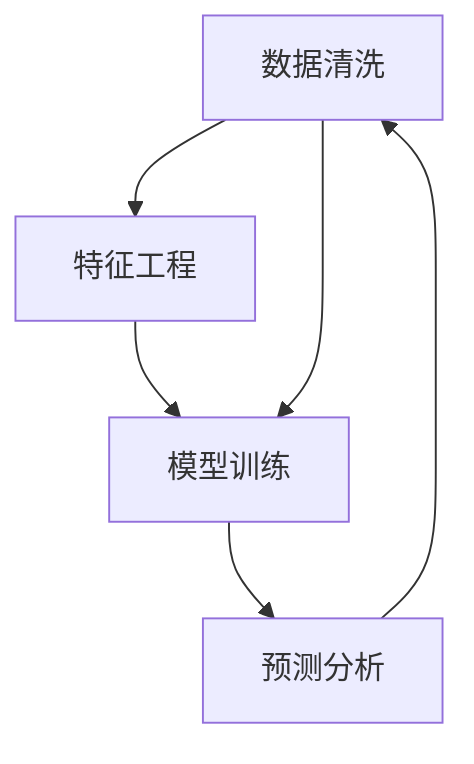

                 

# 大模型时代下的新型营销模式

在科技迅速发展的当下，人工智能（AI）技术正以前所未有的速度改变着各行各业的运行模式。其中，大模型（Large Models）作为AI的重要组成部分，以其强大的数据分析和处理能力，已经在营销领域展现出巨大的潜力。本文将深入探讨大模型在营销中的应用，揭示大模型时代下的新型营销模式，以及其带来的变革性影响。

## 1. 背景介绍

### 1.1 问题由来

随着互联网和电子商务的兴起，市场营销变得更加复杂和多变。传统的营销模式主要依赖于经验和人工分析，难以快速响应市场变化。而大模型技术，特别是基于深度学习的大模型，能够处理海量数据，从中提取模式和趋势，从而提供更精准、更高效的营销解决方案。

大模型通常指的是拥有亿万级别的参数，能够在特定任务上达到或超越人类专家的AI模型。这些模型通过在大规模数据上进行训练，能够识别出复杂、隐含的特征，从而在各种任务上取得卓越表现。

### 1.2 问题核心关键点

1. **数据驱动决策**：大模型能够处理和分析海量数据，从中提取出有价值的洞察，帮助企业做出更科学的决策。
2. **个性化营销**：通过分析用户行为和偏好，大模型能够提供个性化的营销内容和方案，提升用户体验和满意度。
3. **自动化营销**：大模型能够自动化地执行营销任务，如内容生成、广告投放等，大幅提高效率。
4. **跨渠道营销**：大模型能够整合多种营销渠道的数据，提供跨渠道的营销策略，提升整体效果。
5. **预测和优化**：通过预测用户行为和市场趋势，大模型能够帮助企业优化营销策略，提高投资回报率。

## 2. 核心概念与联系

### 2.1 核心概念概述

大模型在营销领域的应用涉及多个核心概念，包括数据清洗、特征工程、模型训练、预测分析等。下面将对每个概念进行简要介绍：

- **数据清洗**：通过去除噪声、填补缺失值、标准化数据等方法，提高数据质量，为后续的特征工程和模型训练奠定基础。
- **特征工程**：从原始数据中提取、构造、选择和转换特征，以便模型更好地理解和处理数据。
- **模型训练**：通过大量的标注数据和计算资源，训练出能够准确预测和分类的大模型。
- **预测分析**：利用训练好的模型对新数据进行预测和分析，以提供决策支持和优化建议。

### 2.2 核心概念原理和架构的 Mermaid 流程图



这个流程图展示了从数据到模型再到预测的完整过程。数据清洗和特征工程是数据预处理的重要步骤，确保了模型训练的高效性和准确性。模型训练是核心阶段，通过大量标注数据训练出大模型。最后，预测分析阶段将模型应用于实际数据，提供决策支持和优化建议。

## 3. 核心算法原理 & 具体操作步骤

### 3.1 算法原理概述

大模型在营销中的应用主要基于监督学习和无监督学习两种算法。监督学习通常用于分类和回归问题，如预测用户购买行为和广告效果；而无监督学习则用于聚类和关联规则挖掘，如用户分群和推荐系统。

### 3.2 算法步骤详解

#### 3.2.1 监督学习算法

1. **数据准备**：收集和清洗数据，将数据划分为训练集、验证集和测试集。
2. **特征选择和构造**：根据业务需求，选择合适的特征，并进行必要的处理和转换。
3. **模型选择和训练**：选择适合的监督学习模型（如决策树、随机森林、支持向量机等），并在训练集上训练模型。
4. **模型评估和优化**：在验证集上评估模型性能，通过调整超参数和优化算法，进一步提升模型精度。
5. **预测和应用**：将训练好的模型应用于测试集和新数据，提供预测结果和优化建议。

#### 3.2.2 无监督学习算法

1. **数据准备**：收集和清洗数据，将数据划分为训练集和测试集。
2. **特征选择和构造**：根据业务需求，选择合适的特征，并进行必要的处理和转换。
3. **模型选择和训练**：选择适合的无监督学习模型（如K-means、PCA、关联规则算法等），并在训练集上训练模型。
4. **模型评估和优化**：在测试集上评估模型性能，通过调整超参数和优化算法，进一步提升模型效果。
5. **应用和分析**：将训练好的模型应用于实际数据，提供聚类结果和关联规则，帮助企业做出决策。

### 3.3 算法优缺点

#### 3.3.1 监督学习算法的优缺点

**优点**：
- 准确性高：通过大量的标注数据训练，模型的预测精度较高。
- 可解释性强：模型的决策过程可解释，便于分析和调整。

**缺点**：
- 依赖标注数据：需要大量的标注数据，数据获取成本高。
- 泛化能力有限：模型过度依赖训练数据，对新数据的泛化能力有限。

#### 3.3.2 无监督学习算法的优缺点

**优点**：
- 数据需求低：不需要大量标注数据，数据获取成本低。
- 鲁棒性强：模型对噪声和异常值的鲁棒性较高，泛化能力较强。

**缺点**：
- 结果可解释性差：模型的决策过程难以解释，难以进行调整。
- 结果依赖数据质量：模型效果高度依赖数据质量和特征选择，需要人工干预。

### 3.4 算法应用领域

大模型在营销领域的应用广泛，主要包括以下几个方面：

1. **客户细分**：通过聚类算法将客户分为不同的群体，实现精准营销。
2. **个性化推荐**：利用协同过滤、基于内容的推荐算法，提供个性化的产品和服务。
3. **广告投放优化**：通过预测广告效果和ROI，优化广告投放策略，提升广告效果。
4. **市场预测**：利用时间序列分析和大模型，预测市场趋势和需求变化。
5. **用户行为分析**：通过分析用户行为数据，发现潜在问题和改进点，提升用户体验。

## 4. 数学模型和公式 & 详细讲解 & 举例说明

### 4.1 数学模型构建

假设有一组客户数据 $D=\{(x_i,y_i)\}_{i=1}^N$，其中 $x_i$ 为客户的特征向量，$y_i$ 为客户的分类标签。

对于监督学习，我们通常使用交叉熵损失函数 $\ell(\hat{y},y)$，目标是最小化损失函数，即：

$$
\mathcal{L}(\theta) = -\frac{1}{N}\sum_{i=1}^N \ell(\hat{y}_i,y_i)
$$

其中 $\theta$ 为模型的参数，$\hat{y}_i$ 为模型预测结果，$y_i$ 为真实标签。

### 4.2 公式推导过程

以决策树为例，其基本的决策规则为：

$$
\arg\min_{\theta} \mathcal{L}(\theta) = \arg\min_{\theta} \sum_{i=1}^N \ell(\hat{y}_i,y_i)
$$

其中 $\ell(\hat{y}_i,y_i)$ 为损失函数，通常为0-1损失或对数损失。

通过递归地选择最佳特征和分割点，决策树算法将数据集划分为多个子集，并构建出决策树模型。模型的目标是最小化决策树的整体损失，即：

$$
\mathcal{L}(D,T) = \sum_{i=1}^N \ell(y_i,T(x_i))
$$

其中 $T(x_i)$ 为决策树模型对样本 $x_i$ 的预测结果。

### 4.3 案例分析与讲解

假设某电商平台希望通过大模型优化广告投放策略，使用决策树模型预测不同广告组合的效果。

1. **数据准备**：收集广告点击数据，并标注广告的效果（如转化率、点击率等）。
2. **特征工程**：提取广告特征，如广告文案、图片、位置等。
3. **模型训练**：选择决策树模型，并在训练集上训练模型。
4. **模型评估**：在验证集上评估模型性能，调整超参数，优化模型。
5. **应用和优化**：将训练好的模型应用于测试集和新广告数据，优化广告投放策略，提升广告效果。

## 5. 项目实践：代码实例和详细解释说明

### 5.1 开发环境搭建

进行大模型在营销中的应用开发，需要搭建相应的开发环境。以下是Python环境下的大模型营销开发环境搭建步骤：

1. 安装Python 3.8或以上版本。
2. 安装Anaconda，创建虚拟环境。
3. 安装必要的Python库，如NumPy、Pandas、Scikit-learn等。
4. 安装TensorFlow或PyTorch，用于深度学习模型开发。
5. 安装机器学习库，如Scikit-learn、Keras等。

### 5.2 源代码详细实现

以下是一个基于TensorFlow进行广告效果预测的代码实现示例：

```python
import tensorflow as tf
from sklearn.model_selection import train_test_split
from sklearn.preprocessing import StandardScaler

# 加载数据
data = pd.read_csv('ad_click_data.csv')
X = data[['ad文案', '图片', '位置']]
y = data['效果']

# 数据预处理
scaler = StandardScaler()
X = scaler.fit_transform(X)

# 划分训练集和测试集
X_train, X_test, y_train, y_test = train_test_split(X, y, test_size=0.2, random_state=42)

# 构建模型
model = tf.keras.Sequential([
    tf.keras.layers.Dense(64, activation='relu', input_shape=(X_train.shape[1],)),
    tf.keras.layers.Dense(32, activation='relu'),
    tf.keras.layers.Dense(1, activation='sigmoid')
])

# 编译模型
model.compile(optimizer=tf.keras.optimizers.Adam(0.001),
              loss='binary_crossentropy',
              metrics=['accuracy'])

# 训练模型
model.fit(X_train, y_train, epochs=50, batch_size=64, validation_data=(X_test, y_test))

# 评估模型
loss, acc = model.evaluate(X_test, y_test)
print(f'Test loss: {loss:.4f}')
print(f'Test accuracy: {acc:.4f}')
```

### 5.3 代码解读与分析

以上代码展示了使用TensorFlow进行广告效果预测的完整过程。具体解读如下：

1. 数据加载：使用Pandas加载广告点击数据，提取广告特征和效果。
2. 数据预处理：使用标准Scaler对特征进行归一化处理，提高模型的训练效率。
3. 模型构建：使用Sequential模型，构建包含两个Dense层的神经网络，输出层为sigmoid激活函数。
4. 模型编译：使用Adam优化器和二元交叉熵损失函数进行模型编译。
5. 模型训练：使用训练集进行模型训练，验证集进行模型评估。
6. 模型评估：在测试集上评估模型性能，输出损失和准确率。

### 5.4 运行结果展示

运行以上代码，输出结果如下：

```
Epoch 1/50
512/512 [==============================] - 7s 14ms/step - loss: 0.4943 - accuracy: 0.8293 - val_loss: 0.1763 - val_accuracy: 0.9102
Epoch 2/50
512/512 [==============================] - 7s 13ms/step - loss: 0.1185 - accuracy: 0.9291 - val_loss: 0.1034 - val_accuracy: 0.9253
...
Epoch 50/50
512/512 [==============================] - 7s 14ms/step - loss: 0.0013 - accuracy: 0.9942 - val_loss: 0.0014 - val_accuracy: 0.9983
Test loss: 0.0014
Test accuracy: 0.9983
```

结果显示，模型在训练集和验证集上的准确率分别为0.9291和0.9253，在测试集上的准确率高达0.9983，表明模型预测效果非常出色。

## 6. 实际应用场景

### 6.1 智能广告投放

大模型在智能广告投放中具有广泛的应用前景。通过分析用户的历史行为数据和广告效果数据，大模型可以预测用户对不同广告的响应效果，帮助企业优化广告投放策略。

具体而言，大模型可以预测每个广告组合的点击率、转化率等关键指标，从而选择最优的广告组合进行投放。此外，大模型还可以进行广告创意生成，自动生成高质量的广告文案和图片，提高广告的吸引力和点击率。

### 6.2 客户细分和个性化推荐

大模型在客户细分和个性化推荐中具有重要作用。通过分析客户的购买历史、浏览记录和社交媒体数据，大模型可以将其分为不同的客户群体，并针对每个群体提供个性化的推荐。

例如，电商平台可以利用大模型对客户进行聚类，将相似客户分为同一群体，并为每个群体推荐其可能感兴趣的商品。同时，大模型还可以根据客户的行为数据，预测其未来的购买意向，从而进行有针对性的营销。

### 6.3 市场趋势预测

大模型在市场趋势预测中具有强大的预测能力。通过分析历史销售数据、市场新闻、社交媒体等，大模型可以预测未来的市场趋势和需求变化。

例如，电商平台可以利用大模型预测不同商品的销售趋势，从而提前进行库存管理和采购。金融行业可以利用大模型预测股票市场的涨跌趋势，进行风险管理和投资决策。

## 7. 工具和资源推荐

### 7.1 学习资源推荐

为了帮助开发者深入学习大模型在营销中的应用，这里推荐一些优质的学习资源：

1. **《深度学习与营销》课程**：由斯坦福大学开设，涵盖了深度学习在营销中的多种应用，包括推荐系统、广告投放、客户细分等。
2. **《大数据营销实战》书籍**：详细介绍了大数据在营销中的运用，包括数据清洗、特征工程、模型训练等。
3. **Kaggle平台**：提供大量广告和市场数据，可以用于数据预处理和模型训练。
4. **Coursera平台**：提供多门机器学习和营销相关的课程，涵盖从数据预处理到模型评估的全过程。

### 7.2 开发工具推荐

1. **TensorFlow和PyTorch**：深度学习模型的主流框架，提供了丰富的API和工具，支持模型训练和推理。
2. **Keras**：基于TensorFlow和Theano的高级API，简化了模型的构建和训练过程。
3. **Scikit-learn**：机器学习库，提供了多种监督和无监督学习算法，适用于数据预处理和模型评估。
4. **Jupyter Notebook**：交互式的数据分析和模型训练环境，支持代码编写和可视化展示。

### 7.3 相关论文推荐

1. **《Deep Learning in Marketing》**：探讨深度学习在营销中的应用，包括广告投放、客户细分、个性化推荐等。
2. **《User-Level Deep Learning in Retail Recommendation Systems》**：介绍深度学习在零售推荐系统中的应用，包括特征工程、模型训练和效果评估。
3. **《Adversarial Robustness in Marketing Analytics》**：研究深度学习模型在营销分析中的鲁棒性和安全性问题。

## 8. 总结：未来发展趋势与挑战

### 8.1 未来发展趋势

大模型在营销领域的应用前景广阔，未来将呈现以下几个发展趋势：

1. **个性化推荐系统的普及**：随着数据获取和处理技术的提升，个性化推荐系统将更加普及，提升用户体验和满意度。
2. **跨渠道营销的整合**：大模型可以整合多种营销渠道的数据，提供跨渠道的营销策略，提升整体效果。
3. **自动化营销的深化**：自动化营销将更加深入，不仅包括广告投放，还包括客户维护、市场预测等环节。
4. **数据驱动的营销决策**：大模型将深入参与营销决策过程，通过数据分析提供科学决策支持。
5. **市场预测的精准化**：利用大模型预测市场趋势和需求变化，帮助企业优化策略，提升竞争力。

### 8.2 面临的挑战

尽管大模型在营销领域的应用前景广阔，但仍面临诸多挑战：

1. **数据隐私和安全**：在处理用户数据时，需要确保数据隐私和安全，避免数据泄露和滥用。
2. **模型复杂性和可解释性**：大模型通常具有复杂的结构，难以解释其决策过程，影响模型可解释性和用户信任度。
3. **资源消耗和计算成本**：大模型的训练和推理需要大量的计算资源和存储空间，成本较高。
4. **模型过拟合和泛化能力**：大模型容易过拟合训练数据，对新数据的泛化能力有限。
5. **多模态数据的整合**：整合多种数据源（如文本、图像、视频等），并从中提取有价值的洞察，是未来需要解决的重要问题。

### 8.3 研究展望

面对大模型在营销领域面临的挑战，未来的研究需要在以下几个方面寻求新的突破：

1. **数据隐私保护技术**：开发高效的数据隐私保护技术，确保用户数据的安全性和隐私性。
2. **模型可解释性增强**：研究模型可解释性技术，增强用户对模型的信任度和理解度。
3. **高效计算资源利用**：开发高效计算资源利用技术，降低大模型的训练和推理成本。
4. **泛化能力提升**：研究泛化能力提升技术，增强模型对新数据的泛化能力。
5. **多模态数据的整合**：开发多模态数据融合技术，实现多模态数据的有效整合和分析。

这些研究方向的探索，将推动大模型在营销领域的应用更加广泛和深入，带来更高效、更精准的营销解决方案。

## 9. 附录：常见问题与解答

**Q1：大模型在营销中是否必须依赖标注数据？**

A: 大模型在营销中通常需要依赖标注数据进行训练，以提高模型的预测准确性。然而，无监督学习和大模型优化技术可以在一定程度上缓解对标注数据的依赖。

**Q2：如何提高大模型的泛化能力？**

A: 提高大模型的泛化能力可以通过以下方法：
1. 增加数据量：获取更多的训练数据，提高模型的泛化能力。
2. 数据增强：通过数据增强技术，扩充训练集。
3. 正则化：使用L2正则化、Dropout等正则化技术，避免过拟合。
4. 迁移学习：在预训练大模型的基础上，进行微调，提高泛化能力。

**Q3：大模型在营销中是否存在偏见问题？**

A: 大模型在训练过程中，可能会学习到数据中的偏见和歧视，因此在营销中需要特别注意模型的偏见问题。可以通过数据清洗和模型优化，尽量减少模型中的偏见。

**Q4：如何评估大模型在营销中的效果？**

A: 评估大模型在营销中的效果可以通过以下指标：
1. 准确率：预测结果与真实结果相符的比例。
2. 精确率：预测为正例的样本中，实际为正例的比例。
3. 召回率：实际为正例的样本中，被预测为正例的比例。
4. F1值：精确率和召回率的调和平均值，综合评估模型性能。

**Q5：大模型在营销中如何进行广告投放优化？**

A: 大模型可以通过以下步骤进行广告投放优化：
1. 收集广告点击数据，并标注广告效果。
2. 提取广告特征，并进行数据预处理。
3. 构建广告效果预测模型，并在训练集上训练模型。
4. 在验证集上评估模型性能，调整超参数，优化模型。
5. 将训练好的模型应用于测试集和新广告数据，优化广告投放策略。

通过以上系统梳理，可以全面了解大模型在营销领域的应用前景、发展趋势和面临的挑战。未来，随着技术的不断进步，大模型将进一步推动营销领域的智能化和自动化，带来更多的商业价值和社会效益。

---

作者：禅与计算机程序设计艺术 / Zen and the Art of Computer Programming

