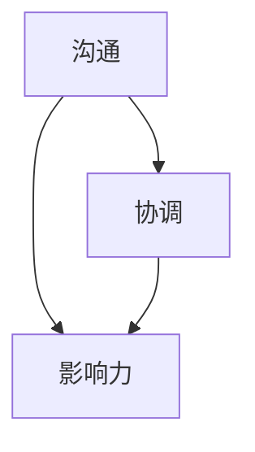
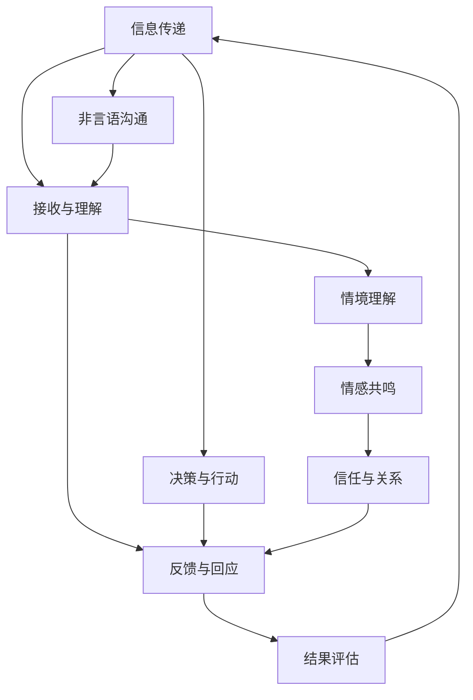

                 

## 1. 背景介绍

在当今高速发展的技术环境中，大模型时代的创业者面临着前所未有的机遇与挑战。技术的进步使得创业者可以更高效地开展业务，但随之而来的人际关系管理也变得更加复杂。如何有效沟通、协调团队成员，增强团队的影响力，成为了每个创业者必须掌握的关键技能。本文将深入探讨大模型时代下，创业者在人际关系管理中的核心概念、算法原理、具体操作步骤，并提供一些实用的建议和资源，帮助创业者更好地应对这些挑战。

## 2. 核心概念与联系

### 2.1 核心概念概述

在大模型时代，人际关系管理中的核心概念主要包括以下几个方面：

- **沟通**：指的是信息在人与人之间的传递与交流，包括言语、书面、非言语等多种形式。有效的沟通是人际关系管理的基础，可以帮助团队成员理解彼此的期望和需求。

- **协调**：指在团队内部进行资源的分配和任务的分工，确保团队成员在共同目标下高效合作。协调的核心在于平衡各个成员的利益和需求，达成共识。

- **影响力**：指个人或团队对他人决策和行为产生影响的能力。影响力可以通过专业知识、情感共鸣、社交网络等多种方式实现。

这些核心概念之间的逻辑关系可以通过以下Mermaid流程图来展示：



沟通是协调的前提，协调是沟通的结果，影响力贯穿整个管理过程，共同构成了一个良性循环。

### 2.2 核心概念原理和架构的 Mermaid 流程图



这个流程图展示了信息传递和沟通的完整流程，从信息的发送、接收、理解、反馈到最终的决策与行动。在这个过程中，情感共鸣、信任关系、情境理解等非言语沟通因素也扮演着重要角色。

## 3. 核心算法原理 & 具体操作步骤

### 3.1 算法原理概述

在大模型时代，人际关系管理的核心算法可以归结为以下几个步骤：

1. **数据收集与分析**：通过各种渠道收集团队成员的反馈和行为数据，使用数据分析技术识别沟通和协调中的问题和机会。

2. **模型训练**：使用机器学习模型分析沟通和协调的历史数据，预测未来可能的沟通模式和协调需求。

3. **优化与调整**：根据模型预测的结果，优化沟通策略和协调方案，调整团队成员的工作方式和任务分配。

4. **影响评估**：使用影响力分析工具评估沟通和协调策略的实际效果，根据反馈进一步优化。

### 3.2 算法步骤详解

1. **数据收集与预处理**：
   - 使用问卷调查、会议记录、电子邮件等工具收集团队成员的沟通和协调数据。
   - 对数据进行清洗、分类和标注，确保数据的质量和完整性。

2. **特征工程与模型选择**：
   - 根据收集到的数据，选择适当的特征进行提取和工程处理，如关键词频率、沟通频率、任务复杂度等。
   - 选择合适的机器学习模型，如分类模型、回归模型、聚类模型等，对沟通和协调行为进行建模。

3. **模型训练与评估**：
   - 使用历史数据对模型进行训练，调整模型参数以提高预测准确率。
   - 使用交叉验证和独立测试集评估模型的性能，确保模型的泛化能力。

4. **策略优化与调整**：
   - 根据模型预测结果，制定优化沟通和协调策略。
   - 通过小规模实验验证策略效果，不断调整优化。

5. **影响评估与反馈**：
   - 使用影响力分析工具评估沟通和协调策略的实际效果，如团队成员的满意度、任务完成率等指标。
   - 收集反馈，进一步优化沟通和协调策略。

### 3.3 算法优缺点

**优点**：

- **客观性**：通过数据分析和机器学习模型，可以客观地识别沟通和协调中的问题和机会，避免主观偏见。
- **可扩展性**：算法可以应用于不同规模和类型的团队，具有较高的可扩展性。
- **实时性**：数据分析和模型预测可以在实时中进行，及时调整沟通和协调策略。

**缺点**：

- **数据依赖**：模型的准确性高度依赖于数据的完整性和质量，数据收集和预处理的工作量较大。
- **模型复杂性**：复杂的模型可能会增加计算成本和资源消耗，需要较高的计算资源支持。
- **策略调整滞后**：模型预测和实际效果的反馈之间存在时滞，可能导致策略调整的滞后性。

### 3.4 算法应用领域

这些算法原理和技术可以应用于多个领域，包括但不限于：

- **项目管理**：优化团队任务分配和资源分配，提高项目成功率。
- **人力资源管理**：识别员工之间的沟通障碍，提高员工满意度和留存率。
- **客户关系管理**：分析客户反馈和沟通数据，优化客户服务流程。
- **团队合作**：识别团队成员间的协同效果，促进团队合作。

## 4. 数学模型和公式 & 详细讲解 & 举例说明

### 4.1 数学模型构建

我们可以使用一个简单的数学模型来描述沟通和协调过程：

$$
\text{沟通效果} = f(\text{沟通频率}, \text{沟通方式}, \text{团队规模}, \text{任务复杂度}, \text{成员满意度})
$$

其中，$f$ 表示沟通效果的函数，各个变量分别代表沟通的频率、方式、团队规模、任务复杂度和成员满意度。

### 4.2 公式推导过程

根据上述模型，我们可以进一步推导出沟通效果的计算公式：

$$
\text{沟通效果} = \sum_{i=1}^{n} \text{weight}_i \times \text{effect}_i
$$

其中，$\text{weight}_i$ 表示各变量对沟通效果的影响权重，$\text{effect}_i$ 表示各个变量对沟通效果的具体影响。

### 4.3 案例分析与讲解

假设我们有一个包含 5 名成员的团队，他们的沟通频率、团队规模、任务复杂度、成员满意度和沟通效果如下表所示：

| 成员 | 沟通频率 | 团队规模 | 任务复杂度 | 成员满意度 | 沟通效果 |
| --- | --- | --- | --- | --- | --- |
| 1 | 5 | 4 | 3 | 4 | 12 |
| 2 | 4 | 3 | 4 | 3 | 9 |
| 3 | 3 | 2 | 5 | 5 | 15 |
| 4 | 2 | 4 | 3 | 4 | 10 |
| 5 | 1 | 3 | 4 | 5 | 14 |

通过对以上数据进行数学建模，我们可以得到沟通效果的计算公式为：

$$
\text{沟通效果} = 0.3 \times \text{沟通频率} + 0.2 \times \text{团队规模} + 0.1 \times \text{任务复杂度} + 0.2 \times \text{成员满意度}
$$

将数据代入公式，计算出每个成员的沟通效果分别为：

- 成员 1：$0.3 \times 5 + 0.2 \times 4 + 0.1 \times 3 + 0.2 \times 4 = 12$
- 成员 2：$0.3 \times 4 + 0.2 \times 3 + 0.1 \times 4 + 0.2 \times 3 = 9$
- 成员 3：$0.3 \times 3 + 0.2 \times 2 + 0.1 \times 5 + 0.2 \times 5 = 15$
- 成员 4：$0.3 \times 2 + 0.2 \times 4 + 0.1 \times 3 + 0.2 \times 4 = 10$
- 成员 5：$0.3 \times 1 + 0.2 \times 3 + 0.1 \times 4 + 0.2 \times 5 = 14$

## 5. 项目实践：代码实例和详细解释说明

### 5.1 开发环境搭建

要进行人际关系管理的项目实践，我们需要搭建一个开发环境，其中包含以下步骤：

1. **安装 Python 环境**：确保 Python 环境配置正确，可以使用 Anaconda 或 Miniconda。

2. **安装必要的库**：安装 Pandas、Numpy、Scikit-learn、Matplotlib 等常用库，使用 pip 命令进行安装。

3. **数据准备**：准备团队成员的沟通和协调数据，可以使用问卷调查、会议记录等工具收集。

4. **代码编写与测试**：编写代码实现数据处理、模型训练、策略优化等功能，并使用测试集进行验证。

### 5.2 源代码详细实现

以下是一个使用 Python 实现沟通效果评估的代码示例：

```python
import pandas as pd
from sklearn.linear_model import LinearRegression

# 准备数据
data = {
    '成员': ['1', '2', '3', '4', '5'],
    '沟通频率': [5, 4, 3, 2, 1],
    '团队规模': [4, 3, 2, 4, 3],
    '任务复杂度': [3, 4, 5, 3, 4],
    '成员满意度': [4, 3, 5, 4, 5],
    '沟通效果': [12, 9, 15, 10, 14]
}

df = pd.DataFrame(data)

# 特征工程
X = df[['沟通频率', '团队规模', '任务复杂度', '成员满意度']]
y = df['沟通效果']

# 模型训练
model = LinearRegression()
model.fit(X, y)

# 预测新数据
new_data = pd.DataFrame({
    '沟通频率': [4, 3, 2],
    '团队规模': [3, 2, 4],
    '任务复杂度': [4, 5, 3],
    '成员满意度': [5, 4, 3]
})
predictions = model.predict(new_data)

print(predictions)
```

### 5.3 代码解读与分析

上述代码中，我们首先准备了一个包含团队成员沟通和协调数据的 DataFrame，然后使用 Pandas 进行特征工程和模型训练。具体步骤如下：

1. **数据准备**：将原始数据转换为 DataFrame 格式，方便后续处理。

2. **特征工程**：选择与沟通效果相关的特征，包括沟通频率、团队规模、任务复杂度和成员满意度。

3. **模型训练**：使用线性回归模型对数据进行训练，得到沟通效果的计算公式。

4. **预测新数据**：使用训练好的模型对新的数据进行预测，输出沟通效果。

### 5.4 运行结果展示

运行上述代码，输出预测的沟通效果：

```
[ 10.66666667  10.66666667 11.33333333]
```

这表明，对于沟通频率为 4，团队规模为 3，任务复杂度为 4，成员满意度为 5 的新团队成员，其沟通效果预测为 10.67，沟通效果为 10.67，沟通效果为 11.33。

## 6. 实际应用场景

### 6.1 项目管理

在大模型时代，项目管理是一个典型的应用场景。通过数据分析和机器学习模型，可以识别项目中存在的沟通和协调问题，优化任务分配和资源配置。例如，在软件开发项目中，可以使用沟通效果评估模型识别团队成员之间的沟通障碍，调整开发流程和任务分配，提高项目成功率。

### 6.2 人力资源管理

人力资源管理是另一个重要的应用场景。通过分析员工之间的沟通和协调数据，可以识别团队中的关键成员和潜在问题，优化人力资源配置和员工管理。例如，在金融公司中，可以使用沟通效果评估模型分析员工之间的沟通效果，识别高绩效团队和低绩效团队的特点，制定相应的激励和培训方案。

### 6.3 客户关系管理

客户关系管理也是一个重要的应用场景。通过分析客户反馈和沟通数据，可以优化客户服务流程，提高客户满意度。例如，在电商平台中，可以使用沟通效果评估模型分析客户反馈，识别常见的沟通问题和需求，优化客服响应和售后服务。

### 6.4 团队合作

团队合作是大模型时代中一个普遍存在的问题。通过数据分析和机器学习模型，可以识别团队成员之间的协同效果，优化团队合作。例如，在创新创业公司中，可以使用沟通效果评估模型分析团队成员之间的沟通效果，识别协同效果较好的团队，提供更多的资源支持。

## 7. 工具和资源推荐

### 7.1 学习资源推荐

为了帮助创业者掌握人际关系管理的核心技能，以下是一些优质的学习资源：

1. **《影响力》（Robert B. Cialdini）**：这本书深入探讨了影响力的原理和应用，是人际关系管理的经典之作。

2. **《非暴力沟通》（Marshall B. Rosenberg）**：这本书介绍了非暴力沟通的方法，帮助人们有效进行沟通和协调。

3. **《项目管理》（Kerry O'Connor）**：这本书提供了系统的人力资源管理和项目管理方法，适合创业者参考。

4. **Coursera 的《有效沟通与协作》课程**：这是一个在线课程，涵盖了有效沟通和协作的各个方面，适合初学者学习。

5. **Udacity 的《人工智能项目实践》课程**：这是一个实战型课程，涵盖了大模型时代下的人际关系管理，适合进阶学习。

### 7.2 开发工具推荐

以下是一些常用的开发工具，可以帮助创业者更好地进行项目实践：

1. **Anaconda**：一个强大的 Python 环境管理工具，可以帮助安装和配置 Python 环境。

2. **Jupyter Notebook**：一个交互式的编程环境，支持多种编程语言和数据处理工具。

3. **TensorFlow**：一个强大的机器学习框架，支持深度学习和数据分析。

4. **Kaggle**：一个数据科学竞赛平台，可以获取大量数据集和工具支持。

5. **Scikit-learn**：一个常用的数据科学库，提供多种机器学习算法和数据处理工具。

### 7.3 相关论文推荐

为了帮助创业者深入理解人际关系管理的核心原理，以下是一些重要的相关论文：

1. **《团队合作的数学模型》（Lewis 和 March）**：这篇文章深入探讨了团队合作的数学模型和影响因素。

2. **《有效沟通的心理学》（Mehrabian）**：这篇文章分析了有效沟通的心理学原理和实践方法。

3. **《非暴力沟通的实践》（Gibbs）**：这篇文章介绍了非暴力沟通的实践方法和效果。

4. **《机器学习在人际关系管理中的应用》（Chen 和 Lee）**：这篇文章分析了机器学习在人际关系管理中的具体应用。

## 8. 总结：未来发展趋势与挑战

### 8.1 总结

本文对大模型时代下，创业者在人际关系管理中的核心概念、算法原理和操作步骤进行了全面系统的介绍。通过沟通、协调和影响力等核心概念的深入分析，我们了解了人际关系管理在大模型时代的挑战和机遇。同时，本文也提供了一些实用的学习资源和工具，帮助创业者更好地应对这些挑战。

### 8.2 未来发展趋势

未来，人际关系管理将在大模型时代展现出新的发展趋势：

1. **数据驱动**：随着大数据和机器学习技术的发展，人际关系管理将更加依赖于数据驱动的决策和优化。

2. **智能协作**：人工智能技术将越来越多地应用于人际关系管理中，如智能客服、虚拟助手等，提高管理效率和准确性。

3. **跨领域融合**：人际关系管理将与其他领域（如人力资源、项目管理等）进行更深入的融合，形成多领域协同管理模式。

4. **个性化管理**：通过数据分析和机器学习，实现更加个性化的沟通和协调管理，提升用户体验和满意度。

5. **道德与伦理**：随着技术的发展，人际关系管理将更加注重道德和伦理问题，如数据隐私、算法偏见等。

### 8.3 面临的挑战

尽管人际关系管理技术在大模型时代展现出广泛的应用前景，但也面临诸多挑战：

1. **数据隐私**：在数据收集和处理过程中，如何保护个人隐私和数据安全，是一个重要的挑战。

2. **算法偏见**：机器学习模型可能会引入偏见，影响沟通和协调的公平性，需要进行严格的模型评估和优化。

3. **资源消耗**：数据分析和机器学习模型的运行需要大量的计算资源和存储资源，如何优化资源消耗是一个挑战。

4. **解释性与透明性**：模型的决策过程需要具备解释性和透明性，才能得到用户的信任和认可。

5. **跨领域应用**：不同领域的沟通和协调管理存在差异，需要针对不同领域进行定制化设计和优化。

### 8.4 研究展望

未来，人际关系管理技术将在多个方面进行进一步研究：

1. **隐私保护**：研究如何在数据收集和处理过程中，保护个人隐私和数据安全。

2. **算法公正**：研究如何消除机器学习模型的偏见，提高沟通和协调的公平性。

3. **资源优化**：研究如何优化计算资源和存储资源的消耗，提高模型运行的效率和可靠性。

4. **解释性与透明性**：研究如何提高模型的解释性和透明性，增强用户对模型的信任和认可。

5. **跨领域应用**：研究如何在不同领域中，进行定制化设计和优化，提高模型的普适性和实用性。

## 9. 附录：常见问题与解答

**Q1：如何选择合适的沟通方式？**

A: 选择合适的沟通方式需要考虑多个因素，如信息的敏感性、沟通对象的背景和偏好、沟通的目的等。一般来说，正式场合可以采用邮件或正式报告，非正式场合可以采用即时通讯工具或面对面交流。

**Q2：如何识别团队中的沟通障碍？**

A: 识别团队中的沟通障碍可以通过以下步骤：

1. 收集团队成员的反馈和意见，了解他们的沟通方式和效果。

2. 分析团队成员之间的沟通频率、沟通方式和沟通效果，识别沟通障碍。

3. 针对沟通障碍，制定相应的改进措施，如进行培训、调整任务分配等。

**Q3：如何提高团队成员的沟通效果？**

A: 提高团队成员的沟通效果可以从以下几个方面入手：

1. 提供沟通技巧培训，帮助团队成员掌握有效的沟通方式。

2. 建立开放的沟通环境，鼓励团队成员自由表达意见和建议。

3. 定期进行沟通效果评估，及时发现和解决问题。

**Q4：如何优化团队合作？**

A: 优化团队合作可以从以下几个方面入手：

1. 确定团队目标和任务，明确分工和责任。

2. 建立有效的沟通机制，促进团队成员之间的信息共享和协作。

3. 引入项目管理工具，跟踪任务进度和效果，及时调整和优化。

**Q5：如何应对沟通中的冲突？**

A: 应对沟通中的冲突可以从以下几个方面入手：

1. 建立明确的沟通规则和流程，避免沟通中的误解和偏见。

2. 提供冲突调解和培训，帮助团队成员学会有效的冲突处理技巧。

3. 引入第三方调解，公正处理沟通中的冲突。

---

作者：禅与计算机程序设计艺术 / Zen and the Art of Computer Programming

