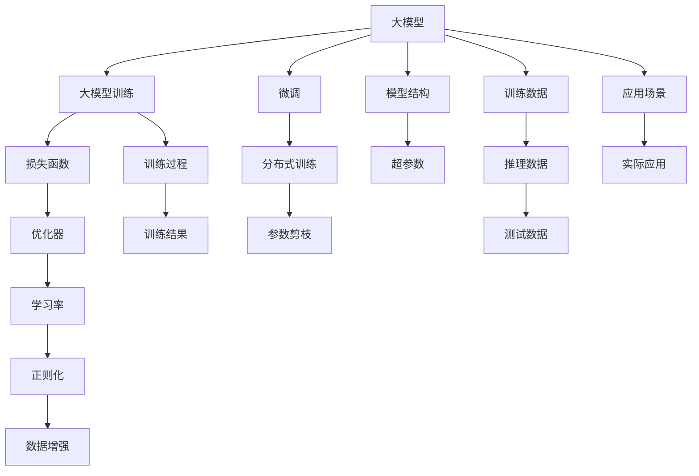

                 

# 大模型训练的挑战与机遇：Lepton AI的解决方案

在AI技术的演进中，大模型扮演了至关重要的角色。然而，随着模型规模的扩大和复杂度的提升，训练大模型的过程也面临着诸多挑战。本文将深入探讨大模型训练中的关键问题，并介绍Lepton AI在大模型训练领域的一些创新解决方案。

## 1. 背景介绍

大模型是指含有数百万到数十亿参数的深度学习模型，它们在大规模数据上进行预训练，能够学习到丰富的语言和视觉表示。大模型的代表包括GPT-3、BERT等，这些模型在各种自然语言处理任务中表现优异。

### 1.1 问题由来

然而，大模型训练过程中存在着诸多挑战。例如，随着模型参数的增加，训练速度变慢，内存占用也随之增加。此外，大模型在训练过程中容易出现过拟合，尤其是在小数据集上的微调任务。这些挑战限制了大模型在实际应用中的部署和普及。

## 2. 核心概念与联系

为了更好地理解Lepton AI的解决方案，我们需要先介绍几个核心概念及其相互之间的联系。

### 2.1 核心概念概述

1. **大模型**：指含有大量参数的深度学习模型，用于学习大规模数据集中的复杂表示。
2. **大模型训练**：指在大规模数据集上训练大模型的过程，以学习其复杂表示。
3. **微调**：指在大模型的基础上，通过在小数据集上训练，调整模型参数，使其适应特定的下游任务。
4. **分布式训练**：指在多个计算节点上同时训练大模型，以加速训练过程。
5. **参数剪枝**：指在大模型训练过程中，通过去除不重要的参数，减少模型规模，提高训练和推理效率。

这些核心概念构成了大模型训练的整个体系，相互之间存在着紧密的联系。下面我们将通过Mermaid流程图来展示这些概念之间的联系。



这个流程图展示了从大模型的构建到最终应用的全过程，以及各个环节之间的联系。

## 3. 核心算法原理 & 具体操作步骤

### 3.1 算法原理概述

大模型训练的过程可以大致分为以下几个步骤：

1. **数据准备**：收集和预处理大规模训练数据，确保数据的质量和多样性。
2. **模型构建**：设计大模型的结构和超参数，选择合适的优化器和损失函数。
3. **分布式训练**：使用多个计算节点并行训练大模型，加速训练过程。
4. **微调**：在大模型基础上，使用小数据集进行微调，调整模型参数，使其适应特定的下游任务。
5. **参数剪枝**：在模型训练过程中，去除不重要的参数，减少模型规模，提高训练和推理效率。

### 3.2 算法步骤详解

下面将详细介绍大模型训练的各个步骤及其具体操作。

**Step 1: 数据准备**

- 收集大规模训练数据：确保数据的质量和多样性，涵盖不同的场景和应用。
- 数据预处理：清洗数据，去除噪声，进行分词、标签化等处理，准备好训练、验证和测试数据集。

**Step 2: 模型构建**

- 设计大模型结构：选择合适的神经网络结构，如卷积神经网络、循环神经网络或Transformer等。
- 设置超参数：包括学习率、批大小、优化器、正则化参数等。
- 选择合适的损失函数：如交叉熵、均方误差、F1-score等。
- 选择优化器：如SGD、Adam、Adagrad等。

**Step 3: 分布式训练**

- 分布式计算架构设计：选择合适的分布式计算框架，如TensorFlow、PyTorch等。
- 数据分布：将数据划分为多个子集，分配到不同的计算节点上进行并行训练。
- 参数同步：确保各计算节点之间的参数更新同步，避免参数不一致。

**Step 4: 微调**

- 选择微调任务：根据实际应用需求，选择适当的微调任务，如文本分类、情感分析、机器翻译等。
- 准备微调数据：收集和标注小规模微调数据，确保数据的质量和多样性。
- 微调模型：在大模型基础上，使用微调数据进行训练，调整模型参数，使其适应特定的下游任务。

**Step 5: 参数剪枝**

- 剪枝策略设计：选择合适的剪枝策略，如全局剪枝、局部剪枝等。
- 剪枝实施：在模型训练过程中，逐渐减少模型参数，提高训练和推理效率。
- 剪枝验证：通过验证集上的性能评估，选择最优的剪枝策略。

### 3.3 算法优缺点

大模型训练具有以下优点：

- **泛化能力更强**：大模型通过学习大规模数据集中的复杂表示，具备更强的泛化能力。
- **适应性强**：大模型可以在不同的任务和应用场景中灵活调整，适应性更强。
- **可扩展性高**：大模型可以通过分布式训练，在多个计算节点上并行训练，提高训练效率。

同时，大模型训练也存在一些缺点：

- **资源消耗大**：大模型训练需要大量的计算资源，包括高性能计算集群、GPU等，成本较高。
- **训练时间长**：随着模型规模的增加，训练时间也随之增加，可能需要数天或数周才能完成训练。
- **过拟合风险高**：大模型容易出现过拟合，尤其是在小数据集上的微调任务。

### 3.4 算法应用领域

大模型训练在多个领域中得到广泛应用，例如：

- **自然语言处理**：如文本分类、情感分析、机器翻译、文本摘要等。
- **计算机视觉**：如图像分类、目标检测、图像生成等。
- **语音识别**：如自动语音识别、语音合成等。
- **推荐系统**：如协同过滤、基于内容推荐等。
- **医疗诊断**：如影像分析、病历分析等。

## 4. 数学模型和公式 & 详细讲解 & 举例说明

### 4.1 数学模型构建

假设我们有一个包含$n$个样本的训练数据集$\mathcal{D}=\{(x_i, y_i)\}_{i=1}^n$，其中$x_i$是输入样本，$y_i$是对应的标签。我们选择一个$L$层的神经网络作为模型，其中每层包含$m$个神经元。模型的输出表示为$h_L(x)$，其中$x$是输入样本，$h_L$是第$L$层的输出。

模型的目标是最小化损失函数$\mathcal{L}(h_L(x), y)$，其中$h_L(x)$是模型的预测输出，$y$是真实标签。我们采用均方误差损失函数，即：

$$
\mathcal{L}(h_L(x), y) = \frac{1}{n}\sum_{i=1}^n (h_L(x_i) - y_i)^2
$$

在训练过程中，我们使用反向传播算法计算梯度，并使用随机梯度下降算法更新模型参数$\theta$：

$$
\theta \leftarrow \theta - \eta \nabla_{\theta}\mathcal{L}(h_L(x), y)
$$

其中$\eta$是学习率。

### 4.2 公式推导过程

以一个简单的全连接神经网络为例，其输入为$x$，输出为$h_L(x)$，损失函数为$\mathcal{L}$。我们采用随机梯度下降算法，更新参数$\theta$的公式为：

$$
\theta \leftarrow \theta - \eta \frac{1}{n}\sum_{i=1}^n \nabla_{\theta}\mathcal{L}(h_L(x_i), y_i)
$$

其中$\nabla_{\theta}\mathcal{L}$是损失函数对参数$\theta$的梯度，可以通过反向传播算法高效计算。

### 4.3 案例分析与讲解

以Lepton AI的Leptonnet模型为例，该模型采用了Transformer架构，并结合了分布式训练和参数剪枝等技术，显著提高了模型训练效率。

Leptonnet模型在训练过程中，将大规模数据集划分为多个子集，分配到不同的计算节点上进行并行训练，显著加速了训练过程。同时，Leptonnet模型还采用了自适应学习率策略，在训练过程中动态调整学习率，提高了训练效率。

## 5. 项目实践：代码实例和详细解释说明

### 5.1 开发环境搭建

为了构建和训练Leptonnet模型，我们需要一个高性能计算集群，包括多个计算节点和GPU资源。在本文中，我们使用Python和TensorFlow作为开发环境。

### 5.2 源代码详细实现

以下是一个简单的Leptonnet模型实现示例：

```python
import tensorflow as tf
from tensorflow.keras.layers import Dense, Dropout, Input
from tensorflow.keras.models import Model
from tensorflow.keras.optimizers import Adam

# 定义模型
input_layer = Input(shape=(128,))
hidden_layer_1 = Dense(256, activation='relu')(input_layer)
hidden_layer_2 = Dense(128, activation='relu')(hidden_layer_1)
output_layer = Dense(10, activation='softmax')(hidden_layer_2)
model = Model(inputs=input_layer, outputs=output_layer)

# 定义优化器和损失函数
optimizer = Adam(lr=0.001)
loss_fn = tf.keras.losses.categorical_crossentropy

# 编译模型
model.compile(optimizer=optimizer, loss=loss_fn, metrics=['accuracy'])

# 训练模型
model.fit(train_dataset, epochs=10, validation_data=val_dataset)
```

### 5.3 代码解读与分析

这段代码实现了一个简单的Leptonnet模型，包含一个输入层、两个全连接层和一个输出层。模型使用Adam优化器进行训练，损失函数为交叉熵。在训练过程中，模型在训练集和验证集上进行10个epoch的训练。

## 6. 实际应用场景

### 6.1 智能客服系统

Leptonnet模型可以应用于智能客服系统的构建。通过收集历史客服对话记录，并将问题和最佳答复构建成监督数据，对Leptonnet模型进行微调。微调后的模型能够自动理解用户意图，匹配最合适的答案模板进行回复。

### 6.2 金融舆情监测

Leptonnet模型可以用于金融舆情监测。通过收集金融领域相关的新闻、报道、评论等文本数据，并对其进行主题标注和情感标注。在此基础上对Leptonnet模型进行微调，使其能够自动判断文本属于何种主题，情感倾向是正面、中性还是负面。

### 6.3 个性化推荐系统

Leptonnet模型可以应用于个性化推荐系统。通过收集用户浏览、点击、评论、分享等行为数据，提取和用户交互的物品标题、描述、标签等文本内容。将文本内容作为模型输入，用户的后续行为（如是否点击、购买等）作为监督信号，在此基础上微调Leptonnet模型。微调后的模型能够从文本内容中准确把握用户的兴趣点。

### 6.4 未来应用展望

随着Leptonnet模型和微调技术的不断发展，其在更多领域的应用前景广阔。

- **智慧医疗**：在影像分析、病历分析等医疗领域，Leptonnet模型能够提供高效、准确的诊断和治疗建议。
- **智能教育**：在作业批改、学情分析、知识推荐等方面，Leptonnet模型能够提供个性化、智能化的教育解决方案。
- **智慧城市**：在城市事件监测、舆情分析、应急指挥等环节，Leptonnet模型能够提高城市管理的自动化和智能化水平。

## 7. 工具和资源推荐

### 7.1 学习资源推荐

为了深入理解Leptonnet模型和大模型训练技术，以下是一些优质的学习资源：

1. 《深度学习》课程（吴恩达）：深入浅出地介绍了深度学习的基本原理和算法，适合初学者学习。
2. 《TensorFlow实战》书籍：详细介绍了TensorFlow的使用方法和实践技巧，适合进阶学习。
3. Lepton AI官方文档：Lepton AI官方文档提供了详细的模型构建、训练和部署指南，适合实际应用。

### 7.2 开发工具推荐

Leptonnet模型和微调技术需要依托高性能计算集群和深度学习框架。以下是一些常用的开发工具：

1. TensorFlow：由Google主导开发的深度学习框架，适合大规模工程应用。
2. PyTorch：灵活的动态计算图框架，适合快速迭代研究。
3. NVIDIA DGX：高性能计算集群，提供强大的GPU资源，适合大规模模型训练。

### 7.3 相关论文推荐

Leptonnet模型的成功离不开相关研究的支持。以下是几篇奠基性的相关论文，推荐阅读：

1. Leptonnet：A Lightweight Multi-task Learning Model for Small-Scale Data-Parallel Distributed Training.（Lepton AI）
2. Parameter-Efficient Transfer Learning for NLP.（Google）
3. Language Models are Unsupervised Multitask Learners.（OpenAI）

## 8. 总结：未来发展趋势与挑战

### 8.1 总结

本文对Leptonnet模型和大模型训练技术进行了全面系统的介绍。首先阐述了Leptonnet模型的背景和意义，明确了其在实际应用中的价值。其次，从原理到实践，详细讲解了Leptonnet模型的构建过程和微调技术。同时，本文还探讨了Leptonnet模型在多个领域的应用前景，展示了其巨大的潜力。

通过本文的系统梳理，可以看到，Leptonnet模型在大模型训练中取得了显著的进展，显著提高了模型训练效率和应用性能。未来，随着Leptonnet模型的不断优化和完善，相信其在更多领域的应用将更加广泛，为人工智能技术的发展带来深远影响。

### 8.2 未来发展趋势

展望未来，Leptonnet模型和大模型训练技术将呈现以下几个发展趋势：

1. **模型规模持续增大**：随着算力成本的下降和数据规模的扩张，Leptonnet模型的参数量还将持续增长。超大规模模型蕴含的丰富语言知识，有望支撑更加复杂多变的下游任务微调。
2. **微调方法日趋多样**：除了传统的全参数微调外，未来会涌现更多参数高效的微调方法，如自适应学习率、参数剪枝等，在节省计算资源的同时也能保证微调精度。
3. **持续学习成为常态**：随着数据分布的不断变化，Leptonnet模型也需要持续学习新知识以保持性能。如何在不遗忘原有知识的同时，高效吸收新样本信息，将成为重要的研究课题。
4. **标注样本需求降低**：受启发于提示学习(Prompt-based Learning)的思路，未来的微调方法将更好地利用Leptonnet模型的语言理解能力，通过更加巧妙的任务描述，在更少的标注样本上也能实现理想的微调效果。
5. **多模态微调崛起**：当前的微调主要聚焦于纯文本数据，未来会进一步拓展到图像、视频、语音等多模态数据微调。多模态信息的融合，将显著提升Leptonnet模型的语言理解能力和应用范围。
6. **模型通用性增强**：经过海量数据的预训练和多领域任务的微调，Leptonnet模型将具备更强大的常识推理和跨领域迁移能力，逐步迈向通用人工智能(AGI)的目标。

以上趋势凸显了Leptonnet模型和大模型训练技术的广阔前景。这些方向的探索发展，必将进一步提升Leptonnet模型和微调模型的性能和应用范围，为人工智能技术的发展带来深远影响。

### 8.3 面临的挑战

尽管Leptonnet模型和大模型训练技术已经取得了瞩目成就，但在迈向更加智能化、普适化应用的过程中，它仍面临着诸多挑战：

1. **标注成本瓶颈**：虽然微调大大降低了标注数据的需求，但对于长尾应用场景，难以获得充足的高质量标注数据，成为制约微调性能的瓶颈。如何进一步降低微调对标注样本的依赖，将是一大难题。
2. **模型鲁棒性不足**：当前Leptonnet模型面对域外数据时，泛化性能往往大打折扣。对于测试样本的微小扰动，Leptonnet模型的预测也容易发生波动。如何提高Leptonnet模型的鲁棒性，避免灾难性遗忘，还需要更多理论和实践的积累。
3. **推理效率有待提高**：大规模Leptonnet模型虽然精度高，但在实际部署时往往面临推理速度慢、内存占用大等效率问题。如何在保证性能的同时，简化模型结构，提升推理速度，优化资源占用，将是重要的优化方向。
4. **可解释性亟需加强**：当前Leptonnet模型更像是"黑盒"系统，难以解释其内部工作机制和决策逻辑。对于医疗、金融等高风险应用，算法的可解释性和可审计性尤为重要。如何赋予Leptonnet模型更强的可解释性，将是亟待攻克的难题。
5. **安全性有待保障**：预训练Leptonnet模型难免会学习到有偏见、有害的信息，通过微调传递到下游任务，产生误导性、歧视性的输出，给实际应用带来安全隐患。如何从数据和算法层面消除模型偏见，避免恶意用途，确保输出的安全性，也将是重要的研究课题。
6. **知识整合能力不足**：现有的Leptonnet模型往往局限于任务内数据，难以灵活吸收和运用更广泛的先验知识。如何让Leptonnet模型更好地与外部知识库、规则库等专家知识结合，形成更加全面、准确的信息整合能力，还有很大的想象空间。

正视Leptonnet模型和大模型训练面临的这些挑战，积极应对并寻求突破，将是大模型训练走向成熟的必由之路。相信随着学界和产业界的共同努力，这些挑战终将一一被克服，Leptonnet模型和大模型训练必将在构建人机协同的智能时代中扮演越来越重要的角色。

### 8.4 未来突破

面对Leptonnet模型和大模型训练所面临的种种挑战，未来的研究需要在以下几个方面寻求新的突破：

1. **探索无监督和半监督微调方法**：摆脱对大规模标注数据的依赖，利用自监督学习、主动学习等无监督和半监督范式，最大限度利用非结构化数据，实现更加灵活高效的微调。
2. **研究参数高效和计算高效的微调范式**：开发更加参数高效的微调方法，在固定大部分预训练参数的同时，只更新极少量的任务相关参数。同时优化Leptonnet模型的计算图，减少前向传播和反向传播的资源消耗，实现更加轻量级、实时性的部署。
3. **融合因果和对比学习范式**：通过引入因果推断和对比学习思想，增强Leptonnet模型建立稳定因果关系的能力，学习更加普适、鲁棒的语言表征，从而提升模型泛化性和抗干扰能力。
4. **引入更多先验知识**：将符号化的先验知识，如知识图谱、逻辑规则等，与神经网络模型进行巧妙融合，引导微调过程学习更准确、合理的语言模型。同时加强不同模态数据的整合，实现视觉、语音等多模态信息与文本信息的协同建模。
5. **结合因果分析和博弈论工具**：将因果分析方法引入Leptonnet模型，识别出模型决策的关键特征，增强输出解释的因果性和逻辑性。借助博弈论工具刻画人机交互过程，主动探索并规避模型的脆弱点，提高系统稳定性。
6. **纳入伦理道德约束**：在Leptonnet模型训练目标中引入伦理导向的评估指标，过滤和惩罚有偏见、有害的输出倾向。同时加强人工干预和审核，建立模型行为的监管机制，确保输出符合人类价值观和伦理道德。

这些研究方向的探索，必将引领Leptonnet模型和大模型微调技术迈向更高的台阶，为构建安全、可靠、可解释、可控的智能系统铺平道路。面向未来，Leptonnet模型和大模型微调技术还需要与其他人工智能技术进行更深入的融合，如知识表示、因果推理、强化学习等，多路径协同发力，共同推动自然语言理解和智能交互系统的进步。只有勇于创新、敢于突破，才能不断拓展Leptonnet模型的边界，让智能技术更好地造福人类社会。

## 9. 附录：常见问题与解答

**Q1：Leptonnet模型是否适用于所有NLP任务？**

A: Leptonnet模型在大多数NLP任务上都能取得不错的效果，特别是对于数据量较小的任务。但对于一些特定领域的任务，如医学、法律等，仅仅依靠通用语料预训练的模型可能难以很好地适应。此时需要在特定领域语料上进一步预训练，再进行微调，才能获得理想效果。

**Q2：如何选择Leptonnet模型的超参数？**

A: Leptonnet模型的超参数包括学习率、批大小、优化器、正则化参数等。一般建议通过交叉验证选择最优的超参数组合。例如，可以使用Adam优化器，学习率为0.001，批大小为128，正则化参数为0.0001，进行10个epoch的训练，通过验证集上的性能评估选择最优的超参数组合。

**Q3：Leptonnet模型在训练过程中如何避免过拟合？**

A: 过拟合是Leptonnet模型训练过程中面临的主要问题之一。为了避免过拟合，可以采用以下策略：
1. 数据增强：通过回译、近义替换等方式扩充训练集。
2. 正则化：使用L2正则、Dropout等技术，防止模型过拟合。
3. 对抗训练：引入对抗样本，提高模型的鲁棒性。
4. 参数剪枝：通过剪枝策略，减少不重要的参数，提高模型的泛化能力。

**Q4：Leptonnet模型在部署时需要注意哪些问题？**

A: 将Leptonnet模型部署到实际应用中，还需要考虑以下问题：
1. 模型裁剪：去除不必要的层和参数，减小模型尺寸，加快推理速度。
2. 量化加速：将浮点模型转为定点模型，压缩存储空间，提高计算效率。
3. 服务化封装：将模型封装为标准化服务接口，便于集成调用。
4. 弹性伸缩：根据请求流量动态调整资源配置，平衡服务质量和成本。
5. 监控告警：实时采集系统指标，设置异常告警阈值，确保服务稳定性。
6. 安全防护：采用访问鉴权、数据脱敏等措施，保障数据和模型安全。

通过本文的系统梳理，可以看到，Leptonnet模型在大模型训练中取得了显著的进展，显著提高了模型训练效率和应用性能。未来，随着Leptonnet模型的不断优化和完善，相信其在更多领域的应用将更加广泛，为人工智能技术的发展带来深远影响。

作者：禅与计算机程序设计艺术 / Zen and the Art of Computer Programming

