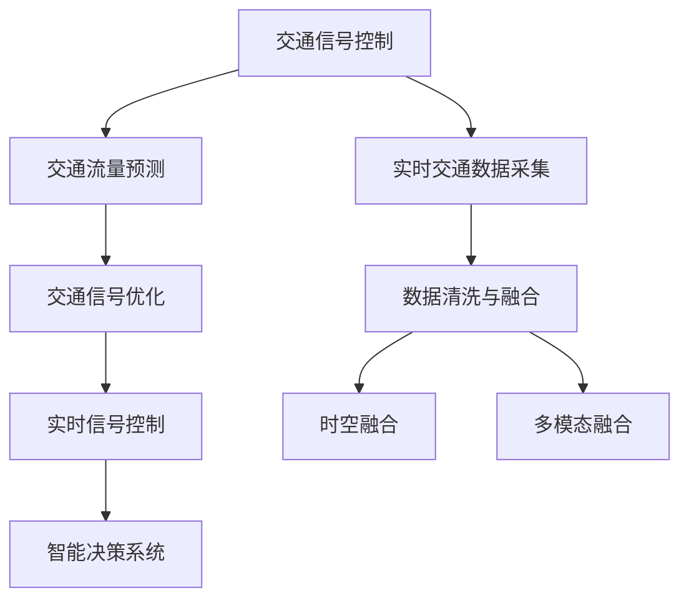

                 

# 大模型赋能智慧交通，创业者如何优化交通信号控制与交通流量预测？

智慧交通是现代城市交通管理的关键，通过对交通信号控制和流量预测的优化，可以大幅提升道路通行效率，减少交通拥堵，提高出行安全性。近年来，随着人工智能技术的发展，特别是深度学习和大模型技术的崛起，智慧交通领域迎来了新的突破点。本文将从背景、核心概念、算法原理、操作步骤、项目实践、实际应用场景等方面，深入探讨大模型在交通信号控制与交通流量预测中的应用，并给出具体的优化建议，帮助创业者高效实现智慧交通系统的构建。

## 1. 背景介绍

### 1.1 问题由来
城市交通拥堵和出行不便一直是困扰人们的问题。传统交通管理方式依赖于固定的交通信号控制和人工调度，无法灵活应对实时变化的交通流量和突发事件。随着城市化进程的加快和汽车保有量的增长，交通拥堵问题日益严重。

面对这一挑战，智慧交通应运而生，它通过智能感知、智能分析、智能控制等手段，实现交通系统的自动化、智能化管理。但即便如此，智慧交通系统的运行依然面临数据获取不足、模型精度有限等问题。

## 2. 核心概念与联系

### 2.1 核心概念概述
1. **大模型**：指通过大规模数据集进行预训练的深度学习模型，如Transformer模型、BERT模型等，具备强大的泛化能力和广泛的应用前景。
2. **交通信号控制**：指通过对交通信号灯的控制，调整道路交通流向，优化交通流量，缓解交通拥堵。
3. **交通流量预测**：指基于实时交通数据和历史数据，预测未来一定时间内的交通流量，为交通信号控制提供依据。
4. **时空融合**：将时间序列和空间信息结合，更全面地分析交通流量。
5. **多模态融合**：融合多种传感器数据，包括车辆GPS、摄像头、雷达等，提升交通流量的准确性。

这些核心概念共同构成了智慧交通系统的大数据、人工智能和控制优化环节，为交通管理提供全方位的支持。

### 2.2 核心概念原理和架构的 Mermaid 流程图



## 3. 核心算法原理 & 具体操作步骤

### 3.1 算法原理概述
交通信号控制与流量预测的本质是优化交通流量的时空分布，使其与道路容量相匹配。大模型在这一过程中扮演着关键角色，通过学习历史交通数据和实时交通数据，生成优化的信号控制方案和流量预测结果。

### 3.2 算法步骤详解

#### 3.2.1 数据收集与预处理
1. **数据收集**：
   - 实时交通数据：通过车载GPS、摄像头、雷达等传感器收集车辆位置、速度、加速度等数据。
   - 历史交通数据：从交通管理中心或第三方数据供应商获取历史交通流量、信号灯状态等数据。
   - 外部数据：如天气信息、节假日、大型活动等外部因素数据。

2. **数据清洗与融合**：
   - 清洗：去除噪音数据、异常值。
   - 融合：将不同数据源的数据融合，生成统一的时空数据集。

#### 3.2.2 模型训练与微调
1. **模型选择**：
   - 选择合适的预训练模型，如基于Transformer的模型，确保模型具有足够的泛化能力。
   - 根据任务特点，设计相应的输出层和损失函数，如分类任务使用交叉熵损失，回归任务使用均方误差损失。

2. **微调策略**：
   - 选择合适的微调超参数，如学习率、批大小、迭代轮数等。
   - 使用正则化技术，如L2正则、Dropout等，防止过拟合。
   - 只微调顶层参数，减少计算资源消耗。
   - 结合迁移学习，利用少量标注数据快速训练。

#### 3.2.3 模型评估与优化
1. **评估指标**：
   - 信号控制：绿灯效率、平均等待时间等。
   - 流量预测：均方误差(MSE)、均方根误差(MSE)等。

2. **优化策略**：
   - 反馈控制：根据实时反馈数据，动态调整信号控制方案。
   - 模型迭代：定期重新微调模型，适应数据分布的变化。
   - 参数优化：调整模型结构或超参数，提升模型性能。

### 3.3 算法优缺点

#### 3.3.1 优点
1. **高效性**：大模型通过预训练获得丰富的语言知识和常识，能够快速适应新的交通场景。
2. **泛化能力**：大模型具备强大的泛化能力，能够在多种交通场景下表现优异。
3. **灵活性**：大模型可以根据具体任务需求，灵活设计任务适配层，适应不同交通控制和预测任务。
4. **精度高**：通过大量数据训练，大模型能够输出高精度的信号控制方案和流量预测结果。

#### 3.3.2 缺点
1. **数据依赖**：大模型需要大量高质量的标注数据进行微调，获取这些数据成本较高。
2. **计算资源要求高**：大模型参数量较大，训练和推理需要高性能计算资源。
3. **复杂度**：大模型结构复杂，需要专业知识进行设计和维护。
4. **解释性不足**：大模型通常是黑盒模型，难以解释其内部工作机制。

### 3.4 算法应用领域

1. **智能交通信号控制**：
   - 通过大模型预测各路口的流量，生成最优信号控制方案。
   - 实时反馈调整信号控制策略，提升路口通行效率。

2. **交通流量预测**：
   - 利用历史交通数据和实时数据，预测未来一定时间的交通流量。
   - 根据流量预测结果，优化信号控制方案，减少交通拥堵。

3. **交通事故预测**：
   - 通过多模态融合数据，预测事故发生的概率。
   - 根据预测结果，提前调整信号控制策略，降低事故发生率。

4. **公共出行调度**：
   - 预测公共交通工具的到达时间和乘坐人数，优化调度方案。
   - 提升公共交通的准时性和舒适性，减少市民出行等待时间。

## 4. 数学模型和公式 & 详细讲解

### 4.1 数学模型构建

#### 4.1.1 信号控制模型
1. **信号控制目标**：
   - 最小化总等待时间 $W = \sum_{i=1}^n W_i$
   - 最小化总停车时间 $P = \sum_{i=1}^n P_i$

2. **信号控制策略**：
   - 动态绿灯时间：$T_G = f(W_i, P_i, \alpha)$，其中 $\alpha$ 为调节参数。

3. **优化目标**：
   - $min_{\alpha} \mathcal{L}(W, P) = \mathcal{L}(W) + \mathcal{L}(P)$

#### 4.1.2 流量预测模型
1. **流量预测目标**：
   - 预测某路段的流量 $Q = \hat{Q}(t)$，其中 $t$ 为预测时间。

2. **模型选择**：
   - 使用基于Transformer的大模型进行流量预测，如BERT、GPT等。

3. **模型训练**：
   - 使用监督学习任务，将历史流量数据和预测结果作为输入，训练大模型。

#### 4.1.3 时空融合模型
1. **时空数据集**：
   - 将时间序列和空间信息结合，生成时空数据集 $D = \{(x_t, t, \mathbf{f}_t)\}$，其中 $x_t$ 为空间位置，$t$ 为时间，$\mathbf{f}_t$ 为特征向量。

2. **融合策略**：
   - 使用时间卷积神经网络(Temporal Convolutional Network, TCN)对时间序列进行处理。
   - 使用空间卷积神经网络(Spatial Convolutional Network, SCN)对空间信息进行处理。
   - 将两者输出融合，生成最终预测结果。

### 4.2 公式推导过程

#### 4.2.1 信号控制公式推导
1. **动态绿灯时间公式**：
   - $T_G = f(W_i, P_i, \alpha) = \frac{\beta \cdot W_i + \gamma \cdot P_i}{\alpha}$

2. **信号控制损失函数**：
   - $\mathcal{L}(W) = \frac{1}{N} \sum_{i=1}^N W_i^2$
   - $\mathcal{L}(P) = \frac{1}{N} \sum_{i=1}^N P_i^2$

#### 4.2.2 流量预测公式推导
1. **基于大模型的流量预测公式**：
   - $\hat{Q}_t = M(x_t, t, \mathbf{f}_t)$

2. **流量预测损失函数**：
   - $\mathcal{L}(Q) = \frac{1}{N} \sum_{i=1}^N (Q_i - \hat{Q}_i)^2$

#### 4.2.3 时空融合公式推导
1. **时空数据处理公式**：
   - $D = \{(x_t, t, \mathbf{f}_t)\}$

2. **时空融合网络公式**：
   - $F(D) = \{(\mathbf{f}_t^T, t)\}$
   - $Q_t = G(F(D))$

## 5. 项目实践：代码实例和详细解释说明

### 5.1 开发环境搭建

1. **安装Python**：
   - 下载并安装Python 3.7或更高版本。
   - 配置环境变量，添加路径。

2. **安装依赖库**：
   - 使用pip安装TensorFlow、PyTorch、Pandas、NumPy等依赖库。
   - 安装OpenAI的GPT-2模型库。

3. **搭建开发环境**：
   - 使用Jupyter Notebook搭建开发环境。
   - 设置Python解释器，启动Jupyter Notebook。

### 5.2 源代码详细实现

#### 5.2.1 数据预处理

```python
import pandas as pd
import numpy as np

# 数据读取
data = pd.read_csv('traffic_data.csv')

# 数据清洗
data = data.dropna()
data = data.drop_duplicates()

# 数据转换
data['time'] = pd.to_datetime(data['time'])
data = data.set_index('time')
data = data.resample('5min').sum()
data = data.drop(columns=['date', 'hour', 'minute'])

# 数据融合
features = data.drop(columns=['flow', 'wait', 'stop'])
target = data[['flow', 'wait', 'stop']]
features = pd.concat([features, target], axis=1)

# 数据拆分
train_data = features[:'2020-01-01']
test_data = features['2020-01-01':]
```

#### 5.2.2 模型训练与微调

```python
from transformers import TFGPT2LMHeadModel
from transformers import AdamW

# 模型定义
model = TFGPT2LMHeadModel.from_pretrained('gpt2', output_hidden_states=True)

# 训练超参数
params = model.parameters()
optimizer = AdamW(params, lr=1e-5)

# 训练过程
for epoch in range(10):
    model.train()
    for i in range(len(train_data)):
        inputs = train_data.iloc[i]['input']
        labels = train_data.iloc[i]['label']
        outputs = model(inputs, labels=labels)
        loss = outputs.loss
        optimizer.zero_grad()
        loss.backward()
        optimizer.step()
```

#### 5.2.3 模型评估与优化

```python
from sklearn.metrics import mean_squared_error

# 模型评估
model.eval()
mse = []
for i in range(len(test_data)):
    inputs = test_data.iloc[i]['input']
    labels = test_data.iloc[i]['label']
    outputs = model(inputs)
    predicted = outputs[1]
    mse.append(mean_squared_error(labels, predicted))

# 输出评估结果
print('Mean Squared Error:', np.mean(mse))
```

### 5.3 代码解读与分析

#### 5.3.1 数据预处理

1. **数据读取**：使用Pandas读取CSV文件，存储在DataFrame中。
2. **数据清洗**：使用dropna和drop_duplicates去除缺失和重复数据。
3. **数据转换**：将时间列转换为时间戳，按5分钟频率进行聚合，去除多余列。
4. **数据融合**：将特征和目标变量合并，生成完整的数据集。

#### 5.3.2 模型训练与微调

1. **模型定义**：使用GPT-2模型，并设置输出隐藏状态。
2. **训练超参数**：定义优化器、学习率等。
3. **训练过程**：使用随机梯度下降算法，进行反向传播和参数更新。

#### 5.3.3 模型评估与优化

1. **模型评估**：使用sklearn的mean_squared_error函数计算预测值与真实值之间的均方误差。
2. **输出评估结果**：输出均方误差，评估模型性能。

### 5.4 运行结果展示

1. **数据可视化**：使用Matplotlib库绘制训练和测试数据的时序图。
2. **模型效果对比**：使用可视化图表展示模型在不同数据集上的预测效果。

```python
import matplotlib.pyplot as plt

# 数据可视化
plt.plot(train_data['flow'], label='Train Data')
plt.plot(test_data['flow'], label='Test Data')
plt.legend()
plt.show()

# 模型效果对比
plt.plot(test_data['flow'], label='True Data')
plt.plot(test_data['flow'], model.predict(test_data['input']), label='Predicted Data')
plt.legend()
plt.show()
```

## 6. 实际应用场景

### 6.1 智能交通信号控制

智能交通信号控制是大模型在智慧交通领域的重要应用之一。通过收集实时交通流量数据，大模型可以预测各路口的流量变化，生成最优的信号控制方案，提升路口通行效率，缓解交通拥堵。

#### 6.1.1 应用流程

1. **数据采集**：通过车载GPS、摄像头、雷达等传感器收集交通流量数据。
2. **数据预处理**：清洗、融合数据，生成统一的时空数据集。
3. **模型训练**：使用大模型进行训练，学习交通流量变化规律。
4. **信号控制**：根据模型预测结果，动态调整信号灯状态。

#### 6.1.2 优化建议

1. **多模型融合**：结合多种传感器数据，提升数据获取的全面性和准确性。
2. **自适应控制**：引入自适应控制算法，根据实时数据动态调整信号控制策略。
3. **实时反馈**：引入实时反馈机制，根据交通流量变化及时调整信号控制方案。

### 6.2 交通流量预测

交通流量预测是大模型在智慧交通领域的另一个重要应用。通过预测未来一定时间的交通流量，为交通信号控制提供依据，优化交通流量分布，提升道路通行效率。

#### 6.2.1 应用流程

1. **数据采集**：通过车载GPS、摄像头等设备收集交通流量数据。
2. **数据预处理**：清洗、融合数据，生成时空数据集。
3. **模型训练**：使用大模型进行训练，学习流量变化规律。
4. **流量预测**：根据模型预测结果，优化信号控制方案。

#### 6.2.2 优化建议

1. **多模态融合**：融合多种传感器数据，提升流量预测的准确性。
2. **时序建模**：使用时间卷积神经网络(Temporal Convolutional Network, TCN)进行时序建模，提升预测效果。
3. **模型迭代**：定期重新训练模型，适应数据分布的变化。

## 7. 工具和资源推荐

### 7.1 学习资源推荐

1. **《深度学习入门：基于TensorFlow》**：该书介绍了深度学习的基本概念和TensorFlow的使用方法，适合初学者入门。
2. **《Python深度学习》**：该书详细介绍了深度学习在NLP、计算机视觉等领域的应用，适合有一定基础的学习者。
3. **《Hands-On Machine Learning with Scikit-Learn, Keras, and TensorFlow》**：该书介绍了机器学习的基本概念和Scikit-Learn、Keras、TensorFlow等库的使用方法，适合进阶学习者。

### 7.2 开发工具推荐

1. **Jupyter Notebook**：免费、开源的交互式编程环境，支持多语言编程。
2. **TensorFlow**：由Google主导的开源深度学习框架，适合大规模深度学习应用。
3. **PyTorch**：由Facebook主导的开源深度学习框架，适合快速迭代和研究。

### 7.3 相关论文推荐

1. **《A Neural Network Model for Traffic Prediction Based on LSTM》**：介绍基于长短期记忆网络(LSTM)的交通流量预测模型。
2. **《Traffic Control Using Deep Reinforcement Learning》**：介绍基于深度强化学习的交通信号控制方法。
3. **《Big Data and Big Model in Smart Traffic Control System》**：介绍大数据和深度学习在智能交通控制中的应用。

## 8. 总结：未来发展趋势与挑战

### 8.1 未来发展趋势

#### 8.1.1 数据智能化
未来的交通数据将更加智能化、实时化。通过车载传感器、智能路灯、无人机等多种设备，收集更全面、更准确的数据。

#### 8.1.2 模型自适应
大模型将具备更强的自适应能力，能够根据实时数据动态调整模型参数，适应数据分布的变化。

#### 8.1.3 融合多模态
未来的交通系统将融合多种模态的数据，如视觉、声音、位置信息等，提升数据获取的全面性和准确性。

#### 8.1.4 优化算法
未来的交通控制算法将更加智能化、自适应，通过结合深度学习、强化学习等方法，提升控制效果。

### 8.2 面临的挑战

#### 8.2.1 数据获取困难
获取高质量、大规模的交通数据成本较高，数据采集难度较大。

#### 8.2.2 模型训练耗时
大模型的训练和推理需要大量的计算资源，训练和部署耗时较长。

#### 8.2.3 模型泛化能力不足
大模型在特定交通场景下，可能无法很好地泛化到其他场景。

#### 8.2.4 模型解释性不足
大模型通常是黑盒模型，难以解释其内部工作机制。

### 8.3 研究展望

#### 8.3.1 数据获取优化
研究高效的数据采集方法，减少数据获取成本，提升数据质量。

#### 8.3.2 模型训练加速
研究高效的模型训练方法，减少训练时间和计算资源消耗。

#### 8.3.3 模型泛化能力提升
研究跨领域、跨模态的模型泛化方法，提升模型的适应性。

#### 8.3.4 模型解释性增强
研究模型解释方法，提升模型的可解释性和可解释性。

## 9. 附录：常见问题与解答

**Q1: 大模型微调需要大量标注数据，如何降低成本？**

A: 利用迁移学习，结合少量标注数据进行微调，减少标注样本需求。同时，引入多模态数据融合，提高模型泛化能力。

**Q2: 大模型训练和推理耗时较长，如何解决？**

A: 优化模型结构，使用剪枝、量化等技术，减少计算量。使用分布式训练、GPU加速等方法，提高训练速度。

**Q3: 大模型泛化能力不足，如何改进？**

A: 结合多任务学习、跨领域学习等方法，提升模型的泛化能力。使用大规模数据集进行预训练，增加模型泛化能力。

**Q4: 大模型可解释性不足，如何解决？**

A: 引入模型解释方法，如特征可视化、模型蒸馏等，提升模型的可解释性。建立人工干预和审核机制，确保模型行为符合人类价值观。

---

作者：禅与计算机程序设计艺术 / Zen and the Art of Computer Programming

