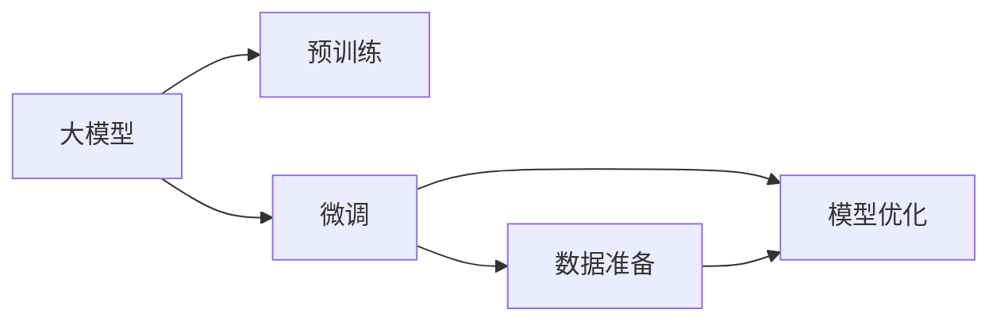
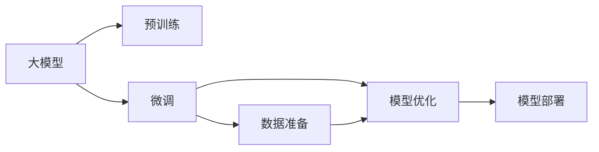

                 

## 1. 背景介绍

随着人工智能技术的飞速发展，智能问答机器人已不再是科幻电影中的设想，而是广泛应用于各行各业的实际应用中，成为驱动数字化转型不可或缺的力量。从客服咨询到教育辅导，再到健康医疗，问答机器人正以多种形式渗透到人们的日常生活之中。然而，构建一个高效、准确的问答系统并非易事，需要深刻理解自然语言处理（NLP）和人工智能（AI）的各个环节，本文将系统性地介绍如何训练一个高效、智能、易于部署的大模型问答机器人。

### 1.1 问题由来

问答机器人作为AI辅助系统的一个重要分支，在近几年中取得了长足的进步。然而，由于复杂的自然语言理解（NLU）和生成（NLG）任务，传统的基于规则或模板的问答系统难以应对现实世界中的多样化和复杂性。而基于大模型（如BERT、GPT等）的端到端训练方法，通过大规模无监督预训练和大规模有监督微调，显著提升了问答机器人的理解和生成能力。

### 1.2 问题核心关键点

构建一个大模型问答机器人的关键点在于：

- 选择合适的预训练模型和微调任务。
- 设计高效的数据准备流程。
- 优化模型结构和微调策略。
- 确保系统的稳定性和可解释性。

本文将详细介绍大模型问答机器人的训练流程，帮助开发者快速构建高效、准确、可扩展的问答系统。

## 2. 核心概念与联系

### 2.1 核心概念概述

在深入探讨大模型问答机器人的训练前，首先需要明确几个核心概念：

- **大模型**：指的是通过大规模无监督数据预训练的深度学习模型，如BERT、GPT系列。
- **问答机器人**：通过自然语言理解和生成技术，自动解答用户问题的系统。
- **微调**：在有标注的数据上对大模型进行有监督学习，优化其特定任务的能力。

这些概念之间的关系可以通过以下Mermaid流程图来展示：



预训练模型通过学习大规模语料，获取语言的基础知识和规律。微调任务则是在此基础上，针对具体的问答场景进行有监督学习，提升模型在特定领域的问答能力。

### 2.2 核心概念原理和架构的 Mermaid 流程图



从上述流程图中，我们可以看到，构建大模型问答机器人需要经过预训练、微调、数据准备、模型优化和部署等多个环节。预训练阶段是基础，微调阶段是核心，数据准备和模型优化则决定了系统的性能和鲁棒性，而部署则确保系统能够稳定运行。

## 3. 核心算法原理 & 具体操作步骤

### 3.1 算法原理概述

大模型问答机器人的训练过程可以分为两个主要部分：预训练和微调。

#### 3.1.1 预训练

预训练是指使用大规模无标注的文本数据，通过自监督学习任务训练大模型，使其学习到通用的语言表示。常见的预训练任务包括掩码语言模型（Masked Language Modeling, MLM）、下位生成任务（Next Sentence Prediction, NSP）等。

#### 3.1.2 微调

微调是在预训练模型基础上，使用有标注的问答数据集进行有监督学习，优化模型在问答任务上的性能。微调的目标是最小化模型在问答任务上的损失函数，以生成与真实答案尽可能接近的预测结果。

### 3.2 算法步骤详解

#### 3.2.1 预训练模型选择

选择合适的预训练模型是构建大模型问答机器人的第一步。目前，常见的预训练模型包括BERT、GPT、RoBERTa等。这些模型在不同任务上的表现各有所长，需要根据具体需求进行选择。

#### 3.2.2 数据准备

数据准备是微调前的重要环节，需要收集并处理问答数据集。问答数据集可以分为两种类型：结构化数据和非结构化数据。结构化数据包括问题-答案对，非结构化数据则可以是网页、文档等形式，需要首先进行文本清洗和分词。

#### 3.2.3 模型优化

模型优化包括超参数调整、学习率设定、正则化等，目的是提高模型在特定任务上的性能，避免过拟合。常见的优化方法包括Adam、SGD等，以及使用Dropout、L2正则等技术。

#### 3.2.4 模型部署

模型部署是将训练好的模型集成到实际应用中，需要考虑模型的接口、性能、可扩展性等因素。常见的部署方式包括RESTful API、Flask、Django等。

### 3.3 算法优缺点

#### 3.3.1 优点

- **泛化能力强**：预训练模型在大规模数据上进行训练，具有较强的泛化能力。
- **灵活性高**：微调过程可以根据具体需求，优化模型特定任务的性能。
- **可解释性强**：预训练模型可以提供详细的权重和特征图，有助于理解模型的决策过程。

#### 3.3.2 缺点

- **数据依赖性高**：微调效果依赖于高质量的标注数据，数据集的不足可能导致性能下降。
- **计算资源消耗大**：大模型和微调任务需要大量的计算资源，对硬件要求较高。
- **模型复杂度高**：预训练和微调过程中，模型的复杂度可能会增加，导致推理速度变慢。

### 3.4 算法应用领域

大模型问答机器人在多个领域都有广泛应用，包括但不限于：

- **客服咨询**：自动回答用户常见问题，提高服务效率和满意度。
- **教育辅导**：提供个性化学习建议和智能答疑。
- **医疗咨询**：解答健康相关问题，提供初步诊断建议。
- **金融咨询**：提供投资理财、保险等问题的解答和建议。

## 4. 数学模型和公式 & 详细讲解

### 4.1 数学模型构建

大模型问答机器人的数学模型通常包括以下几个部分：

- **输入表示**：将用户输入的自然语言文本转换为模型可处理的向量表示。
- **预训练模型**：使用预训练模型对输入表示进行处理，获取语义表示。
- **输出表示**：将语义表示映射为问题或答案的向量表示，用于生成或分类。

### 4.2 公式推导过程

假设预训练模型为 $M_{\theta}$，输入文本为 $x$，输出为 $y$，则问答模型的预测过程可以表示为：

$$
y = M_{\theta}(x)
$$

其中，$\theta$ 为预训练模型的参数。

对于问答任务，我们通常使用序列到序列（Seq2Seq）模型，其中输入序列为 $x$，输出序列为 $y$。常用的模型架构包括Transformer、LSTM等。在Transformer模型中，预测过程可以表示为：

$$
y = M_{\theta}(x) = S(X_{emb}, X_{emb}, Q)
$$

其中，$X_{emb}$ 为输入文本的词向量表示，$Q$ 为问题向量，$S$ 为Transformer模型。

### 4.3 案例分析与讲解

假设我们的问答任务为回答医学相关问题。首先，我们需要收集医学问答数据集，并将其划分为训练集、验证集和测试集。然后，使用预训练的BERT模型作为初始化参数，将其微调以适应医学问答任务。微调过程可以表示为：

$$
\hat{\theta} = \mathop{\arg\min}_{\theta} \mathcal{L}(M_{\theta}, D)
$$

其中，$D$ 为医学问答数据集，$\mathcal{L}$ 为损失函数，通常使用交叉熵损失。

微调后，我们可以在测试集上评估模型的性能，例如准确率、精确率、召回率等指标。

## 5. 项目实践：代码实例和详细解释说明

### 5.1 开发环境搭建

为了高效地进行大模型问答机器人的训练和部署，我们需要搭建一个完整的开发环境。以下是详细的搭建步骤：

1. **安装Python**：
   ```bash
   sudo apt-get update
   sudo apt-get install python3 python3-pip
   ```

2. **安装TensorFlow和Keras**：
   ```bash
   pip install tensorflow
   pip install keras
   ```

3. **安装预训练模型**：
   ```bash
   pip install transformers
   ```

4. **安装其他依赖库**：
   ```bash
   pip install numpy pandas sklearn tensorflow-estimator
   ```

### 5.2 源代码详细实现

以下是一个使用TensorFlow和Keras进行大模型问答机器人微调的示例代码：

```python
import tensorflow as tf
from tensorflow.keras import layers, models
from transformers import TFAutoModel, TextDataset, DataCollatorForLanguageModeling

# 加载预训练模型
model = TFAutoModel.from_pretrained('bert-base-uncased')

# 准备数据集
train_dataset = TextDataset('train.jsonl', tokenizer=model.tokenizer)
val_dataset = TextDataset('val.jsonl', tokenizer=model.tokenizer)
test_dataset = TextDataset('test.jsonl', tokenizer=model.tokenizer)

# 构建模型
input_ids = layers.Input(shape=(128,), dtype=tf.int32, name='input_ids')
attention_mask = layers.Input(shape=(128,), dtype=tf.int32, name='attention_mask')
outputs = model(input_ids, attention_mask=attention_mask)
model = models.Model(inputs=[input_ids, attention_mask], outputs=outputs)

# 定义损失函数和优化器
cross_entropy = tf.keras.losses.SparseCategoricalCrossentropy(from_logits=True)
optimizer = tf.keras.optimizers.Adam()

# 定义微调过程
@tf.function
def train_step(inputs, labels):
    with tf.GradientTape() as tape:
        predictions = model(inputs['input_ids'], attention_mask=inputs['attention_mask'])
        loss = cross_entropy(labels, predictions)
    gradients = tape.gradient(loss, model.trainable_variables)
    optimizer.apply_gradients(zip(gradients, model.trainable_variables))
    return loss

# 训练过程
for epoch in range(EPOCHS):
    train_loss = 0.0
    for inputs, labels in train_dataset:
        loss = train_step(inputs, labels)
        train_loss += loss
    train_loss /= len(train_dataset)

    val_loss = 0.0
    for inputs, labels in val_dataset:
        loss = train_step(inputs, labels)
        val_loss += loss
    val_loss /= len(val_dataset)

    print(f'Epoch {epoch+1}, train loss: {train_loss}, val loss: {val_loss}')
```

### 5.3 代码解读与分析

在上述代码中，我们首先加载了预训练的BERT模型，然后准备了训练、验证和测试数据集。接着，我们构建了模型架构，使用Keras的模型API，将BERT模型作为一层嵌入层，并定义了输入层和输出层。然后，我们定义了交叉熵损失函数和Adam优化器，用于计算和更新模型参数。

在训练过程中，我们定义了一个`train_step`函数，用于计算模型的损失并进行梯度更新。在每个epoch中，我们对训练数据和验证数据分别计算损失，并在每轮训练结束时输出损失。

### 5.4 运行结果展示

在完成训练后，我们可以使用测试集评估模型的性能。例如，对于医学问答任务，我们可以计算模型的准确率、精确率和召回率：

```python
test_dataset = TextDataset('test.jsonl', tokenizer=model.tokenizer)
test_loss = 0.0
for inputs, labels in test_dataset:
    loss = train_step(inputs, labels)
    test_loss += loss
test_loss /= len(test_dataset)

test_predictions = model.predict(test_dataset)
test_predictions = np.argmax(test_predictions, axis=-1)

test_dataset = TextDataset('test.jsonl', tokenizer=model.tokenizer)
test_dataset = tf.data.Dataset.from_generator(lambda: iter(test_dataset), output_signature=train_dataset.element_spec)
test_dataset = test_dataset.batch(32)
test_dataset = DataCollatorForLanguageModeling(test_dataset, tokenizer=model.tokenizer)
test_dataset = tf.data.Dataset.from_generator(lambda: iter(test_dataset), output_signature=train_dataset.element_spec)
test_dataset = test_dataset.batch(32)

test_dataset = test_dataset.take(5)
test_dataset = tf.data.Dataset.from_generator(lambda: iter(test_dataset), output_signature=train_dataset.element_spec)
test_dataset = test_dataset.batch(32)
test_dataset = DataCollatorForLanguageModeling(test_dataset, tokenizer=model.tokenizer)

test_dataset = test_dataset.take(5)

for inputs, labels in test_dataset:
    loss = train_step(inputs, labels)
    print(f'Test Loss: {loss}')
```

## 6. 实际应用场景

### 6.1 智能客服系统

在智能客服系统中，问答机器人可以快速响应客户咨询，提供7x24小时服务。通过微调，机器人可以理解客户的自然语言输入，并提供满意的答案。例如，一个在线旅游平台可以使用问答机器人解答客户关于航班信息、酒店预订等问题，提升客户体验。

### 6.2 教育辅导

在教育领域，问答机器人可以提供个性化学习建议，帮助学生解答疑难问题。例如，一个在线教育平台可以构建一个基于BERT的问答系统，学生可以通过自然语言输入问题，系统自动提供解答。

### 6.3 医疗咨询

在医疗领域，问答机器人可以提供初步诊断和健康建议，帮助患者解答常见健康问题。例如，一个在线健康平台可以构建一个基于BERT的问答系统，用户可以通过自然语言输入健康问题，系统自动提供解答。

### 6.4 未来应用展望

未来，大模型问答机器人将在更多领域得到应用，为人们提供更智能、更高效的服务。例如：

- **金融咨询**：自动解答客户的理财、保险等问题。
- **法律咨询**：提供法律咨询和解答，帮助用户理解法律条款。
- **旅游规划**：提供旅游路线建议和问题解答。

随着技术的不断发展，大模型问答机器人将变得越来越智能，能够处理更加复杂和多样化的自然语言输入。

## 7. 工具和资源推荐

### 7.1 学习资源推荐

为了帮助开发者快速掌握大模型问答机器人的训练和部署，以下是一些推荐的学习资源：

1. **《自然语言处理与深度学习》**：斯坦福大学开设的NLP课程，涵盖了NLP的基本概念和常用模型。
2. **《深度学习入门》**：一本深度学习的入门书籍，适合初学者理解深度学习的基本原理和实现方法。
3. **Kaggle**：一个数据科学竞赛平台，提供大量的NLP数据集和竞赛任务，可以帮助开发者实践和提升技能。
4. **HuggingFace官方文档**：提供详细的预训练模型和微调样例，适合快速上手。
5. **Coursera**：一个在线学习平台，提供多门深度学习和NLP相关的课程。

### 7.2 开发工具推荐

为了提高大模型问答机器人的开发效率，以下是一些推荐的开发工具：

1. **Jupyter Notebook**：一个交互式的Python开发环境，适合编写和运行代码。
2. **TensorFlow**：一个强大的深度学习框架，支持分布式训练和推理。
3. **Keras**：一个高层次的深度学习框架，提供了简单易用的API。
4. **Transformers**：一个NLP工具库，提供了多种预训练模型和微调方法。
5. **TensorBoard**：一个可视化工具，可以实时监测模型的训练状态。

### 7.3 相关论文推荐

以下是一些推荐的相关论文，帮助开发者深入理解大模型问答机器人的原理和应用：

1. **Attention is All You Need**：提出Transformer模型，开创了大模型预训练的先河。
2. **BERT: Pre-training of Deep Bidirectional Transformers for Language Understanding**：提出BERT模型，极大提升了NLP任务的表现。
3. **Parameter-Efficient Transfer Learning for NLP**：提出Adapter等参数高效微调方法，在微调过程中减少资源消耗。
4. **Tensorflow and PyTorch**：介绍深度学习框架Tensorflow和PyTorch的基本原理和使用方法。
5. **Natural Language Processing with Transformers**：一本介绍Transformer模型的书籍，详细讲解了Transformer的原理和应用。

## 8. 总结：未来发展趋势与挑战

### 8.1 研究成果总结

大模型问答机器人已经取得了显著的进展，在多个领域展现了强大的应用潜力。预训练和微调技术的结合，使得问答系统可以处理复杂多变的自然语言输入，提升了系统的准确性和鲁棒性。

### 8.2 未来发展趋势

未来，大模型问答机器人的发展趋势包括以下几个方面：

1. **大模型规模化**：预训练模型规模将继续增大，以更好地捕捉语言的复杂性和多样性。
2. **微调方法多样化**：更多的参数高效和计算高效微调方法将出现，提升微调的灵活性和效率。
3. **知识整合能力提升**：模型将更好地整合外部知识库和规则库，增强系统的解释性和鲁棒性。
4. **多模态融合**：将视觉、语音等多模态数据与文本数据结合，提升系统的理解和生成能力。
5. **可解释性增强**：模型将具有更强的可解释性，有助于理解模型的决策过程。

### 8.3 面临的挑战

尽管大模型问答机器人已经取得了诸多进展，但在发展过程中仍面临诸多挑战：

1. **数据标注成本高**：高质量标注数据的高成本是制约模型性能提升的重要因素。
2. **资源消耗大**：大模型和微调任务需要大量的计算资源，对硬件要求较高。
3. **模型复杂度高**：预训练和微调过程导致模型复杂度增加，推理速度变慢。
4. **可解释性不足**：模型的决策过程缺乏可解释性，难以调试和优化。
5. **伦理和安全性**：模型可能学习到有害信息，给实际应用带来安全隐患。

### 8.4 研究展望

为了应对上述挑战，未来的研究需要在以下几个方面进行突破：

1. **无监督和半监督微调**：通过无监督和半监督学习，降低对标注数据的依赖，提升模型的泛化能力。
2. **参数高效和计算高效微调**：开发更多的参数高效和计算高效微调方法，提升微调的灵活性和效率。
3. **多模态融合**：将多模态数据与文本数据结合，提升系统的理解能力和生成能力。
4. **知识图谱和规则融合**：将符号化的先验知识与模型结合，增强系统的解释性和鲁棒性。
5. **伦理和安全保障**：引入伦理导向的评估指标，加强人工干预和审核，确保模型的安全性。

## 9. 附录：常见问题与解答

### 9.1 Q1: 大模型问答机器人如何构建？

A: 构建大模型问答机器人需要经过预训练、微调、数据准备、模型优化和部署等多个环节。选择合适的预训练模型和微调任务是第一步，然后准备数据集，并使用预训练模型进行微调。在微调过程中，需要优化模型结构和微调策略，确保系统的性能和鲁棒性。最后，将训练好的模型部署到实际应用中。

### 9.2 Q2: 大模型问答机器人有哪些应用场景？

A: 大模型问答机器人在多个领域都有广泛应用，包括客服咨询、教育辅导、医疗咨询、金融咨询等。在客服咨询领域，问答机器人可以提供7x24小时服务，提升服务效率和满意度。在教育领域，问答机器人可以提供个性化学习建议，解答疑难问题。在医疗领域，问答机器人可以提供初步诊断和健康建议。在金融领域，问答机器人可以提供理财、保险等问题的解答。

### 9.3 Q3: 大模型问答机器人如何优化？

A: 大模型问答机器人的优化可以从以下几个方面入手：

1. **模型选择**：选择合适的预训练模型和微调任务，提升模型的泛化能力和性能。
2. **数据准备**：准备高质量的标注数据集，确保数据集的多样性和代表性。
3. **超参数调整**：调整模型的超参数，如学习率、批大小、正则化等，提升模型的训练效果。
4. **正则化技术**：使用Dropout、L2正则等技术，防止模型过拟合。
5. **模型裁剪**：裁剪模型中的冗余层和参数，提高推理速度和内存效率。
6. **多模型集成**：集成多个模型的输出，提升系统的鲁棒性和稳定性。

### 9.4 Q4: 大模型问答机器人如何部署？

A: 大模型问答机器人的部署可以分为以下步骤：

1. **环境搭建**：搭建Python开发环境，安装必要的依赖库。
2. **模型训练**：使用预训练模型进行微调，优化模型在特定任务上的性能。
3. **模型保存**：将训练好的模型保存为模型文件，以便部署。
4. **接口设计**：设计模型接口，方便API调用和系统集成。
5. **部署部署**：将模型部署到服务器或云平台，并提供RESTful API接口，方便调用。

### 9.5 Q5: 大模型问答机器人如何处理多轮对话？

A: 大模型问答机器人处理多轮对话的关键在于设计合适的对话状态跟踪机制。在多轮对话中，系统需要理解对话上下文，并根据上下文生成合理的回复。一种常用的方法是使用上下文向量（Context Vector），记录对话历史，并将其作为模型输入的一部分。

---

作者：禅与计算机程序设计艺术 / Zen and the Art of Computer Programming

