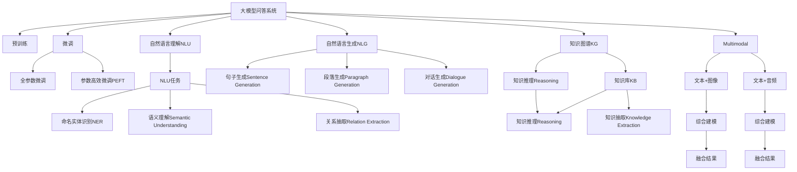

                 

## 1. 背景介绍

### 1.1 问题由来
随着人工智能技术的不断进步，基于深度学习模型的问答系统（Question Answering，QA）成为了人工智能领域的热点研究方向之一。问答系统可以用于各种自然语言处理任务，如知识图谱查询、智能客服、文档检索等。然而，在实际应用中，传统的QA系统常常存在回答质量不稳定、缺乏可解释性、泛化能力不足等问题。

近年来，大模型（如BERT、GPT等）在问答领域取得了显著进展，通过在大规模无标签文本语料上进行预训练，学习到丰富的语言知识，并在下游问答任务上进行微调，获得了很好的效果。但即使在大模型基础上进行微调，QA系统依然面临一些挑战，如回答精准度、泛化能力、效率、可解释性等问题。因此，如何进一步优化问答系统成为当下亟待解决的问题。

### 1.2 问题核心关键点
优化问答系统的主要核心问题包括：

- **回答精准度**：在给定查询的情况下，如何生成准确的回答？
- **泛化能力**：如何使模型在各种类型的数据上表现良好，避免过拟合？
- **模型效率**：如何在保证回答质量的同时，提高推理效率？
- **可解释性**：如何使模型输出具备可解释性，以便于调试和改进？

这些问题涉及到问答系统的核心技术点，需要综合考虑预训练、微调、推理、解释等环节的优化策略。

### 1.3 问题研究意义
优化问答系统对于推动人工智能技术的落地应用具有重要意义：

1. **提升用户体验**：优质的问答系统能快速准确地回答用户问题，提升用户体验。
2. **降低开发成本**：使用预训练大模型，可以减少从头训练所需的数据和计算资源，降低开发成本。
3. **促进智能化应用**：问答系统可以作为各种智能应用的基础，推动更多垂直领域的应用。
4. **激发技术创新**：优化问答系统需要创新算法和模型结构，为自然语言处理技术的发展提供新的思路。
5. **提升智能交互**：优质的问答系统能显著提升人机交互的效率和质量，为未来的智能社会奠定基础。

## 2. 核心概念与联系

### 2.1 核心概念概述

为更好地理解问答系统回答优化的相关概念，本节将介绍几个核心概念：

- **大模型问答系统**：以自回归（如GPT）或自编码（如BERT）模型为代表的大规模预训练语言模型。通过在大规模无标签文本语料上进行预训练，学习通用的语言表示，具备强大的语言理解和生成能力。
- **预训练（Pre-training）**：指在大规模无标签文本语料上，通过自监督学习任务训练通用语言模型的过程。常见的预训练任务包括言语建模、掩码语言模型等。
- **微调（Fine-tuning）**：指在预训练模型的基础上，使用下游任务的少量标注数据，通过有监督学习优化模型在该任务上的性能。通常只需要调整顶层分类器或解码器，并以较小的学习率更新全部或部分的模型参数。
- **自然语言理解（Natural Language Understanding，NLU）**：指机器理解自然语言的能力，包括分词、命名实体识别、语义理解等。
- **自然语言生成（Natural Language Generation，NLG）**：指机器生成自然语言的能力，包括句子生成、段落生成、对话生成等。
- **知识图谱（Knowledge Graph）**：通过语义网络图的形式，将实体、关系、属性等知识元素结构化，以便于机器理解和推理。
- **知识库（Knowledge Base）**：由结构化或非结构化的知识元素组成的集合，提供机器进行知识推理的依据。
- **推理（Reasoning）**：指从已有知识出发，推导出新的知识的过程。知识图谱中的推理常涉及图神经网络（Graph Neural Network，GNN）等方法。
- **多模态（Multimodal）**：指同时考虑文本、图像、音频等多类型数据，进行综合建模。

这些核心概念之间的逻辑关系可以通过以下Mermaid流程图来展示：



这个流程图展示了大模型问答系统的核心概念及其之间的关系：

1. 大模型问答系统通过预训练获得基础能力。
2. 微调是对预训练模型进行任务特定的优化，可以分为全参数微调和参数高效微调（PEFT）。
3. 自然语言理解（NLU）和生成（NLG）是问答系统的重要组成部分，包括分词、命名实体识别、语义理解、句子生成、段落生成等。
4. 知识图谱和知识库为问答系统提供了知识推理的基础，用于处理复杂的问答任务。
5. 推理常涉及图神经网络（GNN）等方法，用于从知识图谱中抽取推理路径。
6. 多模态信息的融合可以提高问答系统的表现，特别是在包含图像、音频等非文本数据的场景中。

这些概念共同构成了问答系统的技术框架，使其能够在各种场景下发挥强大的语言理解和生成能力。

## 3. 核心算法原理 & 具体操作步骤
### 3.1 算法原理概述

问答系统的回答优化主要基于深度学习和自然语言处理技术，通过预训练模型在大量数据上进行预训练，然后通过微调的方式针对具体任务进行优化。其核心原理包括以下几个方面：

1. **预训练与微调结合**：预训练模型在大规模无标签文本语料上进行自监督学习，学习到通用的语言表示。微调则针对下游问答任务进行有监督学习，优化模型在该任务上的表现。
2. **多任务联合训练**：除了常见的问答任务，还可以结合命名实体识别、语义理解等NLU任务进行联合训练，提高模型在多任务上的泛化能力。
3. **知识图谱融合**：将知识图谱中的知识元素嵌入到问答系统中，利用图神经网络进行知识推理，提升模型的推理能力和泛化能力。
4. **多模态融合**：结合文本、图像、音频等多类型数据，进行综合建模，提高模型的多模态处理能力。
5. **可解释性增强**：通过加入可解释性模块，如自注意力机制（Self-Attention），提高模型的可解释性，便于调试和改进。

### 3.2 算法步骤详解

基于深度学习和自然语言处理技术，问答系统的回答优化主要包括以下步骤：

**Step 1: 准备预训练模型和数据集**

1. 选择合适的预训练语言模型（如BERT、GPT等）作为初始化参数。
2. 准备下游问答任务的数据集，包含查询和回答的样本。
3. 划分训练集、验证集和测试集，确保数据分布的一致性。

**Step 2: 添加任务适配层**

1. 根据问答任务类型，设计合适的任务适配层，如分类层、解码器等。
2. 定义损失函数，如交叉熵损失、均方误差损失等，用于衡量模型输出与真实答案之间的差异。

**Step 3: 设置微调超参数**

1. 选择合适的优化算法及其参数，如AdamW、SGD等，设置学习率、批大小、迭代轮数等。
2. 设置正则化技术及强度，包括权重衰减、Dropout、Early Stopping等，防止过拟合。
3. 确定冻结预训练参数的策略，如仅微调顶层，或全部参数都参与微调。

**Step 4: 执行梯度训练**

1. 将训练集数据分批次输入模型，前向传播计算损失函数。
2. 反向传播计算参数梯度，根据设定的优化算法和学习率更新模型参数。
3. 周期性在验证集上评估模型性能，根据性能指标决定是否触发Early Stopping。
4. 重复上述步骤直到满足预设的迭代轮数或Early Stopping条件。

**Step 5: 测试和部署**

1. 在测试集上评估微调后模型的性能，对比微调前后的精度提升。
2. 使用微调后的模型对新样本进行推理预测，集成到实际的应用系统中。
3. 持续收集新的数据，定期重新微调模型，以适应数据分布的变化。

以上是问答系统回答优化的一般流程。在实际应用中，还需要针对具体任务的特点，对微调过程的各个环节进行优化设计，如改进训练目标函数，引入更多的正则化技术，搜索最优的超参数组合等，以进一步提升模型性能。

### 3.3 算法优缺点

基于深度学习和自然语言处理技术的问答系统回答优化方法具有以下优点：

1. **高效性**：预训练模型提供了强大的语言表示能力，微调过程可以快速收敛，达到较优的性能。
2. **泛化能力**：多任务联合训练和知识图谱融合等技术，可以提高模型在多种问答任务上的泛化能力。
3. **多模态融合**：结合文本、图像、音频等多类型数据，进行综合建模，提升模型的多模态处理能力。
4. **可解释性**：自注意力机制等技术，增强了模型的可解释性，便于调试和改进。

同时，该方法也存在一些局限性：

1. **数据依赖**：微调的效果很大程度上取决于标注数据的质量和数量，获取高质量标注数据的成本较高。
2. **泛化能力有限**：当目标任务与预训练数据的分布差异较大时，微调的性能提升有限。
3. **可解释性不足**：模型输出通常缺乏可解释性，难以对其推理逻辑进行分析和调试。
4. **训练复杂度**：多任务联合训练和知识图谱融合等技术，增加了训练的复杂度，需要更多的计算资源和时间。

尽管存在这些局限性，但就目前而言，基于深度学习和自然语言处理技术的问答系统回答优化方法仍是主流范式，广泛应用于各类问答任务中。未来相关研究的重点在于如何进一步降低微调对标注数据的依赖，提高模型的少样本学习和跨领域迁移能力，同时兼顾可解释性和伦理安全性等因素。

### 3.4 算法应用领域

基于深度学习和自然语言处理技术的问答系统回答优化方法在多个领域得到了应用：

- **知识图谱查询**：通过结合知识图谱和问答系统，提供高效的知识检索和推理服务。
- **智能客服系统**：在客户咨询时，通过问答系统快速回答常见问题，提升客户满意度。
- **文档检索**：从大量文本数据中检索与查询相关的答案，提升信息获取效率。
- **智能写作辅助**：通过问答系统提供文章写作指导，辅助作家创作。
- **医疗问答系统**：帮助患者快速获得医疗知识，辅助医生诊疗。
- **金融问答系统**：提供金融咨询和理财建议，提升金融服务体验。

除了这些常见应用外，问答系统还在智能家居、智能制造、智能交通等众多领域得到应用，为各行各业带来了便捷和智能化服务。

## 4. 数学模型和公式 & 详细讲解  
### 4.1 数学模型构建

本节将使用数学语言对问答系统回答优化的数学模型进行更加严格的刻画。

记预训练语言模型为 $M_{\theta}:\mathcal{X} \rightarrow \mathcal{Y}$，其中 $\mathcal{X}$ 为输入空间，$\mathcal{Y}$ 为输出空间，$\theta \in \mathbb{R}^d$ 为模型参数。假设问答任务的训练集为 $D=\{(x_i,y_i)\}_{i=1}^N, x_i \in \mathcal{X}, y_i \in \mathcal{Y}$。

定义模型 $M_{\theta}$ 在输入 $x$ 上的输出为 $\hat{y}=M_{\theta}(x)$，其中 $\hat{y}$ 为模型预测答案。定义真实答案为 $y$，则定义模型输出与真实答案之间的差异为损失函数 $\ell(\hat{y}, y)$。假设损失函数为交叉熵损失函数，则经验风险为：

$$
\mathcal{L}(\theta) = \frac{1}{N}\sum_{i=1}^N \ell(\hat{y}_i, y_i)
$$

微调的优化目标是最小化经验风险，即找到最优参数：

$$
\theta^* = \mathop{\arg\min}_{\theta} \mathcal{L}(\theta)
$$

在实践中，我们通常使用基于梯度的优化算法（如AdamW、SGD等）来近似求解上述最优化问题。设 $\eta$ 为学习率，则参数的更新公式为：

$$
\theta \leftarrow \theta - \eta \nabla_{\theta}\mathcal{L}(\theta)
$$

其中 $\nabla_{\theta}\mathcal{L}(\theta)$ 为损失函数对参数 $\theta$ 的梯度，可通过反向传播算法高效计算。

### 4.2 公式推导过程

以下我们以问答任务中的二分类任务为例，推导交叉熵损失函数及其梯度的计算公式。

假设模型 $M_{\theta}$ 在输入 $x$ 上的输出为 $\hat{y}=M_{\theta}(x) \in [0,1]$，表示样本属于正类的概率。真实答案 $y \in \{0,1\}$。则二分类交叉熵损失函数定义为：

$$
\ell(\hat{y}, y) = -[y\log \hat{y} + (1-y)\log (1-\hat{y})]
$$

将其代入经验风险公式，得：

$$
\mathcal{L}(\theta) = -\frac{1}{N}\sum_{i=1}^N [y_i\log M_{\theta}(x_i)+(1-y_i)\log(1-M_{\theta}(x_i))]
$$

根据链式法则，损失函数对参数 $\theta_k$ 的梯度为：

$$
\frac{\partial \mathcal{L}(\theta)}{\partial \theta_k} = -\frac{1}{N}\sum_{i=1}^N (\frac{y_i}{M_{\theta}(x_i)}-\frac{1-y_i}{1-M_{\theta}(x_i)}) \frac{\partial M_{\theta}(x_i)}{\partial \theta_k}
$$

其中 $\frac{\partial M_{\theta}(x_i)}{\partial \theta_k}$ 可进一步递归展开，利用自动微分技术完成计算。

在得到损失函数的梯度后，即可带入参数更新公式，完成模型的迭代优化。重复上述过程直至收敛，最终得到适应下游任务的最优模型参数 $\theta^*$。

## 5. 项目实践：代码实例和详细解释说明
### 5.1 开发环境搭建

在进行问答系统回答优化实践前，我们需要准备好开发环境。以下是使用Python进行PyTorch开发的环境配置流程：

1. 安装Anaconda：从官网下载并安装Anaconda，用于创建独立的Python环境。

2. 创建并激活虚拟环境：
```bash
conda create -n pytorch-env python=3.8 
conda activate pytorch-env
```

3. 安装PyTorch：根据CUDA版本，从官网获取对应的安装命令。例如：
```bash
conda install pytorch torchvision torchaudio cudatoolkit=11.1 -c pytorch -c conda-forge
```

4. 安装Transformers库：
```bash
pip install transformers
```

5. 安装各类工具包：
```bash
pip install numpy pandas scikit-learn matplotlib tqdm jupyter notebook ipython
```

完成上述步骤后，即可在`pytorch-env`环境中开始问答系统回答优化实践。

### 5.2 源代码详细实现

这里我们以问答系统中的命名实体识别（Named Entity Recognition，NER）任务为例，给出使用Transformers库对BERT模型进行微调的PyTorch代码实现。

首先，定义NER任务的数据处理函数：

```python
from transformers import BertTokenizer
from torch.utils.data import Dataset
import torch

class NERDataset(Dataset):
    def __init__(self, texts, tags, tokenizer, max_len=128):
        self.texts = texts
        self.tags = tags
        self.tokenizer = tokenizer
        self.max_len = max_len
        
    def __len__(self):
        return len(self.texts)
    
    def __getitem__(self, item):
        text = self.texts[item]
        tags = self.tags[item]
        
        encoding = self.tokenizer(text, return_tensors='pt', max_length=self.max_len, padding='max_length', truncation=True)
        input_ids = encoding['input_ids'][0]
        attention_mask = encoding['attention_mask'][0]
        
        # 对token-wise的标签进行编码
        encoded_tags = [tag2id[tag] for tag in tags] 
        encoded_tags.extend([tag2id['O']] * (self.max_len - len(encoded_tags)))
        labels = torch.tensor(encoded_tags, dtype=torch.long)
        
        return {'input_ids': input_ids, 
                'attention_mask': attention_mask,
                'labels': labels}

# 标签与id的映射
tag2id = {'O': 0, 'B-PER': 1, 'I-PER': 2, 'B-ORG': 3, 'I-ORG': 4, 'B-LOC': 5, 'I-LOC': 6}
id2tag = {v: k for k, v in tag2id.items()}

# 创建dataset
tokenizer = BertTokenizer.from_pretrained('bert-base-cased')

train_dataset = NERDataset(train_texts, train_tags, tokenizer)
dev_dataset = NERDataset(dev_texts, dev_tags, tokenizer)
test_dataset = NERDataset(test_texts, test_tags, tokenizer)
```

然后，定义模型和优化器：

```python
from transformers import BertForTokenClassification, AdamW

model = BertForTokenClassification.from_pretrained('bert-base-cased', num_labels=len(tag2id))

optimizer = AdamW(model.parameters(), lr=2e-5)
```

接着，定义训练和评估函数：

```python
from torch.utils.data import DataLoader
from tqdm import tqdm
from sklearn.metrics import classification_report

device = torch.device('cuda') if torch.cuda.is_available() else torch.device('cpu')
model.to(device)

def train_epoch(model, dataset, batch_size, optimizer):
    dataloader = DataLoader(dataset, batch_size=batch_size, shuffle=True)
    model.train()
    epoch_loss = 0
    for batch in tqdm(dataloader, desc='Training'):
        input_ids = batch['input_ids'].to(device)
        attention_mask = batch['attention_mask'].to(device)
        labels = batch['labels'].to(device)
        model.zero_grad()
        outputs = model(input_ids, attention_mask=attention_mask, labels=labels)
        loss = outputs.loss
        epoch_loss += loss.item()
        loss.backward()
        optimizer.step()
    return epoch_loss / len(dataloader)

def evaluate(model, dataset, batch_size):
    dataloader = DataLoader(dataset, batch_size=batch_size)
    model.eval()
    preds, labels = [], []
    with torch.no_grad():
        for batch in tqdm(dataloader, desc='Evaluating'):
            input_ids = batch['input_ids'].to(device)
            attention_mask = batch['attention_mask'].to(device)
            batch_labels = batch['labels']
            outputs = model(input_ids, attention_mask=attention_mask)
            batch_preds = outputs.logits.argmax(dim=2).to('cpu').tolist()
            batch_labels = batch_labels.to('cpu').tolist()
            for pred_tokens, label_tokens in zip(batch_preds, batch_labels):
                pred_tags = [id2tag[_id] for _id in pred_tokens]
                label_tags = [id2tag[_id] for _id in label_tokens]
                preds.append(pred_tags[:len(label_tags)])
                labels.append(label_tags)
                
    print(classification_report(labels, preds))
```

最后，启动训练流程并在测试集上评估：

```python
epochs = 5
batch_size = 16

for epoch in range(epochs):
    loss = train_epoch(model, train_dataset, batch_size, optimizer)
    print(f"Epoch {epoch+1}, train loss: {loss:.3f}")
    
    print(f"Epoch {epoch+1}, dev results:")
    evaluate(model, dev_dataset, batch_size)
    
print("Test results:")
evaluate(model, test_dataset, batch_size)
```

以上就是使用PyTorch对BERT进行命名实体识别任务微调的完整代码实现。可以看到，得益于Transformers库的强大封装，我们可以用相对简洁的代码完成BERT模型的加载和微调。

### 5.3 代码解读与分析

让我们再详细解读一下关键代码的实现细节：

**NERDataset类**：
- `__init__`方法：初始化文本、标签、分词器等关键组件。
- `__len__`方法：返回数据集的样本数量。
- `__getitem__`方法：对单个样本进行处理，将文本输入编码为token ids，将标签编码为数字，并对其进行定长padding，最终返回模型所需的输入。

**tag2id和id2tag字典**：
- 定义了标签与数字id之间的映射关系，用于将token-wise的预测结果解码回真实的标签。

**训练和评估函数**：
- 使用PyTorch的DataLoader对数据集进行批次化加载，供模型训练和推理使用。
- 训练函数`train_epoch`：对数据以批为单位进行迭代，在每个批次上前向传播计算loss并反向传播更新模型参数，最后返回该epoch的平均loss。
- 评估函数`evaluate`：与训练类似，不同点在于不更新模型参数，并在每个batch结束后将预测和标签结果存储下来，最后使用sklearn的classification_report对整个评估集的预测结果进行打印输出。

**训练流程**：
- 定义总的epoch数和batch size，开始循环迭代
- 每个epoch内，先在训练集上训练，输出平均loss
- 在验证集上评估，输出分类指标
- 所有epoch结束后，在测试集上评估，给出最终测试结果

可以看到，PyTorch配合Transformers库使得BERT微调的代码实现变得简洁高效。开发者可以将更多精力放在数据处理、模型改进等高层逻辑上，而不必过多关注底层的实现细节。

当然，工业级的系统实现还需考虑更多因素，如模型的保存和部署、超参数的自动搜索、更灵活的任务适配层等。但核心的微调范式基本与此类似。

## 6. 实际应用场景
### 6.1 智能客服系统

基于大模型问答系统的对话技术，可以广泛应用于智能客服系统的构建。传统客服往往需要配备大量人力，高峰期响应缓慢，且一致性和专业性难以保证。而使用问答系统，可以7x24小时不间断服务，快速响应客户咨询，用自然流畅的语言解答各类常见问题。

在技术实现上，可以收集企业内部的历史客服对话记录，将问题和最佳答复构建成监督数据，在此基础上对预训练问答模型进行微调。微调后的问答系统能够自动理解用户意图，匹配最合适的答案模板进行回复。对于客户提出的新问题，还可以接入检索系统实时搜索相关内容，动态组织生成回答。如此构建的智能客服系统，能大幅提升客户咨询体验和问题解决效率。

### 6.2 金融舆情监测

金融机构需要实时监测市场舆论动向，以便及时应对负面信息传播，规避金融风险。传统的人工监测方式成本高、效率低，难以应对网络时代海量信息爆发的挑战。基于大模型问答系统的文本分类和情感分析技术，为金融舆情监测提供了新的解决方案。

具体而言，可以收集金融领域相关的新闻、报道、评论等文本数据，并对其进行主题标注和情感标注。在此基础上对预训练语言模型进行微调，使其能够自动判断文本属于何种主题，情感倾向是正面、中性还是负面。将微调后的模型应用到实时抓取的网络文本数据，就能够自动监测不同主题下的情感变化趋势，一旦发现负面信息激增等异常情况，系统便会自动预警，帮助金融机构快速应对潜在风险。

### 6.3 个性化推荐系统

当前的推荐系统往往只依赖用户的历史行为数据进行物品推荐，无法深入理解用户的真实兴趣偏好。基于大模型问答系统的个性化推荐系统可以更好地挖掘用户行为背后的语义信息，从而提供更精准、多样的推荐内容。

在实践中，可以收集用户浏览、点击、评论、分享等行为数据，提取和用户交互的物品标题、描述、标签等文本内容。将文本内容作为模型输入，用户的后续行为（如是否点击、购买等）作为监督信号，在此基础上微调预训练语言模型。微调后的模型能够从文本内容中准确把握用户的兴趣点。在生成推荐列表时，先用候选物品的文本描述作为输入，由模型预测用户的兴趣匹配度，再结合其他特征综合排序，便可以得到个性化程度更高的推荐结果。

### 6.4 未来应用展望

随着大模型问答系统的不断发展，基于问答系统的智能应用将得到更广泛的应用，为传统行业带来变革性影响。

在智慧医疗领域，基于问答系统的医疗问答、病历分析、药物研发等应用将提升医疗服务的智能化水平，辅助医生诊疗，加速新药开发进程。

在智能教育领域，问答系统可以作为作业批改、学情分析、知识推荐等工具，因材施教，促进教育公平，提高教学质量。

在智慧城市治理中，问答系统可以用于城市事件监测、舆情分析、应急指挥等环节，提高城市管理的自动化和智能化水平，构建更安全、高效的未来城市。

此外，在企业生产、社会治理、文娱传媒等众多领域，基于问答系统的智能应用也将不断涌现，为经济社会发展注入新的动力。相信随着技术的日益成熟，问答系统必将在更广阔的应用领域大放异彩，深刻影响人类的生产生活方式。

## 7. 工具和资源推荐
### 7.1 学习资源推荐

为了帮助开发者系统掌握问答系统回答优化的理论基础和实践技巧，这里推荐一些优质的学习资源：

1. 《Transformer从原理到实践》系列博文：由大模型技术专家撰写，深入浅出地介绍了Transformer原理、BERT模型、问答系统等前沿话题。

2. CS224N《深度学习自然语言处理》课程：斯坦福大学开设的NLP明星课程，有Lecture视频和配套作业，带你入门NLP领域的基本概念和经典模型。

3. 《Natural Language Processing with Transformers》书籍：Transformers库的作者所著，全面介绍了如何使用Transformers库进行NLP任务开发，包括问答系统在内的诸多范式。

4. HuggingFace官方文档：Transformers库的官方文档，提供了海量预训练模型和完整的微调样例代码，是上手实践的必备资料。

5. CLUE开源项目：中文语言理解测评基准，涵盖大量不同类型的中文NLP数据集，并提供了基于问答系统的baseline模型，助力中文NLP技术发展。

通过对这些资源的学习实践，相信你一定能够快速掌握问答系统回答优化的精髓，并用于解决实际的NLP问题。
###  7.2 开发工具推荐

高效的开发离不开优秀的工具支持。以下是几款用于问答系统回答优化的常用工具：

1. PyTorch：基于Python的开源深度学习框架，灵活动态的计算图，适合快速迭代研究。大部分预训练语言模型都有PyTorch版本的实现。

2. TensorFlow：由Google主导开发的开源深度学习框架，生产部署方便，适合大规模工程应用。同样有丰富的预训练语言模型资源。

3. Transformers库：HuggingFace开发的NLP工具库，集成了众多SOTA语言模型，支持PyTorch和TensorFlow，是进行问答系统优化的利器。

4. Weights & Biases：模型训练的实验跟踪工具，可以记录和可视化模型训练过程中的各项指标，方便对比和调优。与主流深度学习框架无缝集成。

5. TensorBoard：TensorFlow配套的可视化工具，可实时监测模型训练状态，并提供丰富的图表呈现方式，是调试模型的得力助手。

6. Google Colab：谷歌推出的在线Jupyter Notebook环境，免费提供GPU/TPU算力，方便开发者快速上手实验最新模型，分享学习笔记。

合理利用这些工具，可以显著提升问答系统回答优化的开发效率，加快创新迭代的步伐。

### 7.3 相关论文推荐

问答系统回答优化技术的发展源于学界的持续研究。以下是几篇奠基性的相关论文，推荐阅读：

1. Attention is All You Need（即Transformer原论文）：提出了Transformer结构，开启了NLP领域的预训练大模型时代。

2. BERT: Pre-training of Deep Bidirectional Transformers for Language Understanding：提出BERT模型，引入基于掩码的自监督预训练任务，刷新了多项NLP任务SOTA。

3. Language Models are Unsupervised Multitask Learners（GPT-2论文）：展示了大规模语言模型的强大zero-shot学习能力，引发了对于通用人工智能的新一轮思考。

4. Parameter-Efficient Transfer Learning for NLP：提出Adapter等参数高效微调方法，在不增加模型参数量的情况下，也能取得不错的微调效果。

5. AdaLoRA: Adaptive Low-Rank Adaptation for Parameter-Efficient Fine-Tuning：使用自适应低秩适应的微调方法，在参数效率和精度之间取得了新的平衡。

6. Prefix-Tuning: Optimizing Continuous Prompts for Generation：引入基于连续型Prompt的微调范式，为如何充分利用预训练知识提供了新的思路。

这些论文代表了大语言模型问答系统的发展脉络。通过学习这些前沿成果，可以帮助研究者把握学科前进方向，激发更多的创新灵感。

## 8. 总结：未来发展趋势与挑战

### 8.1 总结

本文对基于深度学习和自然语言处理技术的问答系统回答优化方法进行了全面系统的介绍。首先阐述了问答系统回答优化的研究背景和意义，明确了回答优化在拓展问答系统应用、提升系统性能方面的独特价值。其次，从原理到实践，详细讲解了问答系统回答优化的数学原理和关键步骤，给出了问答系统回答优化的完整代码实例。同时，本文还广泛探讨了回答优化方法在智能客服、金融舆情、个性化推荐等多个领域的应用前景，展示了回答优化范式的巨大潜力。此外，本文精选了回答优化技术的各类学习资源，力求为读者提供全方位的技术指引。

通过本文的系统梳理，可以看到，基于深度学习和自然语言处理技术的问答系统回答优化方法正在成为问答系统的重要范式，极大地拓展了预训练语言模型的应用边界，催生了更多的落地场景。受益于大规模语料的预训练，回答优化模型以更低的时间和标注成本，在小样本条件下也能取得不俗的效果，有力推动了问答系统的产业化进程。未来，伴随预训练语言模型和回答优化方法的持续演进，相信问答系统必将在更广阔的应用领域大放异彩，深刻影响人类的生产生活方式。

### 8.2 未来发展趋势

展望未来，问答系统回答优化技术将呈现以下几个发展趋势：

1. **模型规模持续增大**：随着算力成本的下降和数据规模的扩张，预训练语言模型的参数量还将持续增长。超大规模语言模型蕴含的丰富语言知识，有望支撑更加复杂多变的问答任务。

2. **回答质量提升**：结合多任务联合训练、知识图谱融合等技术，可以提高问答系统的回答质量，减少误回答率。

3. **可解释性增强**：通过加入可解释性模块，如自注意力机制（Self-Attention），提高问答系统的可解释性，便于调试和改进。

4. **多模态融合**：结合文本、图像、音频等多类型数据，进行综合建模，提升问答系统的多模态处理能力。

5. **知识图谱应用**：将知识图谱中的知识元素嵌入到问答系统中，利用图神经网络进行知识推理，提升问答系统的推理能力和泛化能力。

6. **知识抽取和推理**：结合知识图谱、规则库等，进行知识抽取和推理，提升问答系统的智能化水平。

以上趋势凸显了问答系统回答优化技术的广阔前景。这些方向的探索发展，必将进一步提升问答系统的性能和应用范围，为人工智能技术的落地应用提供新的推动力。

### 8.3 面临的挑战

尽管问答系统回答优化技术已经取得了显著进展，但在迈向更加智能化、普适化应用的过程中，仍面临诸多挑战：

1. **数据依赖**：问答系统的回答优化效果很大程度上取决于标注数据的质量和数量，获取高质量标注数据的成本较高。如何进一步降低问答系统对标注样本的依赖，将是一大难题。

2. **泛化能力不足**：当目标任务与预训练数据的分布差异较大时，问答系统的回答质量可能下降。如何提高问答系统的泛化能力，避免过拟合，是需要解决的重要问题。

3. **推理效率有待提高**：问答系统虽然精度高，但在实际部署时往往面临推理速度慢、内存占用大等效率问题。如何优化问答系统的推理速度，减少资源消耗，是未来的重要研究方向。

4. **可解释性亟需加强**：问答系统的输出通常缺乏可解释性，难以对其推理逻辑进行分析和调试。对于医疗、金融等高风险应用，算法的可解释性和可审计性尤为重要。

5. **安全性有待保障**：问答系统容易学习到有偏见、有害的信息，通过回答传递到实际应用，可能造成误导性、歧视性的输出，给实际应用带来安全隐患。如何从数据和算法层面消除问答系统偏见，避免恶意用途，确保输出的安全性，也将是重要的研究课题。

6. **知识整合能力不足**：现有的问答系统往往局限于任务内数据，难以灵活吸收和运用更广泛的先验知识。如何让问答系统更好地与外部知识库、规则库等专家知识结合，形成更加全面、准确的信息整合能力，还有很大的想象空间。

正视问答系统回答优化面临的这些挑战，积极应对并寻求突破，将使问答系统迈向成熟的实用阶段。相信随着学界和产业界的共同努力，这些问题终将一一被克服，问答系统必将在构建人机协同的智能时代中扮演越来越重要的角色。

### 8.4 研究展望

面对问答系统回答优化所面临的种种挑战，未来的研究需要在以下几个方面寻求新的突破：

1. **探索无监督和半监督回答优化方法**：摆脱对大规模标注数据的依赖，利用自监督学习、主动学习等无监督和半监督范式，最大限度利用非结构化数据，实现更加灵活高效的回答优化。

2. **研究参数高效和计算高效的问答系统**：开发更加参数高效的问答系统，在固定大部分预训练参数的同时，只更新极少量的任务相关参数。同时优化问答系统的计算图，减少前向传播和反向传播的资源消耗，实现更加轻量级、实时性的部署。

3. **引入因果和对比学习范式**：通过引入因果推断和对比学习思想，增强问答系统建立稳定因果关系的能力，学习更加普适、鲁棒的语言表征，从而提升模型泛化性和抗干扰能力。

4. **结合因果分析和博弈论工具**：将因果分析方法引入问答系统，识别出问答系统决策的关键特征，增强输出解释的因果性和逻辑性。借助博弈论工具刻画人机交互过程，主动探索并规避问答系统的脆弱点，提高系统稳定性。

5. **纳入伦理道德约束**：在问答系统的训练目标中引入伦理导向的评估指标，过滤和惩罚有偏见、有害的输出倾向。同时加强人工干预和审核，建立问答系统的监管机制，确保输出符合人类价值观和伦理道德。

这些研究方向的探索，必将引领问答系统回答优化技术迈向更高的台阶，为构建安全、可靠、可解释、可控的智能系统铺平道路。面向未来，问答系统回答优化技术还需要与其他人工智能技术进行更深入的融合，如知识表示、因果推理、强化学习等，多路径协同发力，共同推动自然语言理解和智能交互系统的进步。只有勇于创新、敢于突破，才能不断拓展问答系统的边界，让智能技术更好地造福人类社会。

## 9. 附录：常见问题与解答
### 附录

**Q1: 问答系统为什么需要微调？**

A: 问答系统通常依赖于大规模预训练模型进行自然语言理解和生成，但预训练模型在特定任务上的表现可能不理想。微调通过有监督学习，优化模型在特定问答任务上的性能，使其能够更准确地回答用户问题。

**Q2: 问答系统微调时需要哪些超参数？**

A: 问答系统微调时，常见的超参数包括学习率、批大小、迭代轮数、正则化系数、权重衰减、Dropout等。这些超参数的选择和调整，会直接影响微调的效果。

**Q3: 问答系统微调过程中如何缓解过拟合？**

A: 问答系统微调过程中，可以通过数据增强、正则化技术、Dropout、Early Stopping等方法缓解过拟合。特别是数据增强，可以通过回译、近义替换等方式扩充训练集，提升模型的泛化能力。

**Q4: 问答系统微调后如何进行测试和评估？**

A: 问答系统微调后，通常在测试集上进行推理预测，评估模型在未见过的样本上的表现。评估指标可以包括精确率、召回率、F1值、回答准确率等。同时，也可以通过人工评估等方式，评估回答的质量和用户满意度。

**Q5: 问答系统如何结合知识图谱进行优化？**

A: 问答系统结合知识图谱进行优化，主要通过在问答任务中引入知识抽取和知识推理任务，利用图神经网络进行知识推理。具体而言，可以将知识图谱中的知识元素嵌入到问答系统中，设计合适的任务适配层，进行联合训练，提升问答系统的推理能力和泛化能力。

以上常见问题的解答，希望能帮助开发者更好地理解和实践问答系统的回答优化技术。问答系统作为自然语言处理的重要分支，其回答优化技术将在未来的智能交互、知识获取、信息检索等领域发挥重要作用，推动人工智能技术的进一步发展。

