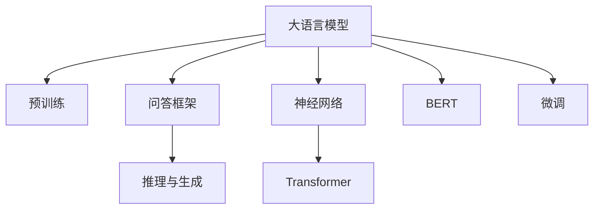

                 

# 大模型问答机器人的智能化程度

> 关键词：大语言模型,问答机器人,深度学习,自然语言处理,NLP,神经网络,Transformer,BERT,模型微调,智能决策

## 1. 背景介绍

### 1.1 问题由来

在现代社会，随着信息爆炸和知识的快速增长，人类需要高效地获取和处理海量信息。传统的搜索引擎、问答系统等技术，虽然能够提供信息检索和初步回答，但无法深度理解用户的查询意图和上下文，也无法进行复杂的推理和生成。因此，大模型问答机器人的研究应运而生，旨在构建能够理解自然语言、智能推理并生成人类自然语言回答的系统，提升信息检索和知识处理的智能化程度。

### 1.2 问题核心关键点

大模型问答机器人的核心在于如何构建一个能够高效理解自然语言、具有强大推理和生成能力的人工智能系统。其核心关键点包括：

1. **大语言模型的选择**：目前主流的大语言模型有GPT、BERT等，这些模型在预训练阶段已具备强大的语言理解能力。
2. **问答框架的设计**：如何设计一个高效、可扩展的问答框架，能够快速响应用户问题，并提供高质量的语义理解与推理。
3. **推理与生成能力**：如何增强模型的推理与生成能力，使其能够进行复杂的逻辑推理，并生成符合语义的自然语言回答。
4. **用户交互设计**：如何设计一个自然流畅、易于用户操作的问答界面，提升用户体验。
5. **系统优化与部署**：如何优化模型性能，提升系统响应速度，并在实际应用中实现高效的部署。

### 1.3 问题研究意义

大模型问答机器人的研究具有重要意义：

1. **提升信息获取效率**：大模型问答机器人能够深入理解用户查询，提供更精准、更全面的答案，大大提升信息获取的效率。
2. **增强知识应用能力**：通过大语言模型，机器人能够处理和应用更广泛的先验知识，增强智能决策能力。
3. **改善人机交互体验**：通过自然语言处理技术，大模型问答机器人能够与用户进行流畅、自然的交互，提高用户体验。
4. **推动AI技术落地**：大模型问答机器人可以作为AI技术落地的重要示范，加速AI技术在各个行业的应用。

## 2. 核心概念与联系

### 2.1 核心概念概述

为更好地理解大模型问答机器人，本节将介绍几个关键概念：

- **大语言模型(Large Language Model, LLM)**：如GPT、BERT等，通过大规模预训练学习通用语言表示，具备强大的语言理解能力。
- **预训练(Pre-training)**：在大规模无标签文本上进行的自监督学习，学习语言的通用表示。
- **问答机器人(QA Robot)**：基于大语言模型构建的智能系统，能够理解自然语言并自动回答问题。
- **推理与生成(Reasoning and Generation)**：通过推理与生成能力，问答机器人能够进行复杂的逻辑推理，并生成符合语义的自然语言回答。
- **神经网络(Neural Network)**：构成问答机器人的核心计算单元，进行特征提取和处理。
- **Transformer**：一种高效的神经网络架构，广泛用于大语言模型的构建和优化。
- **BERT**：一种基于Transformer的预训练语言模型，广泛应用于自然语言处理任务。
- **微调(Fine-tuning)**：在大语言模型的基础上，通过微调使其适应特定任务，提升性能。

这些概念之间的逻辑关系可以通过以下Mermaid流程图来展示：



这个流程图展示了大语言模型的核心概念及其之间的关系：

1. 大语言模型通过预训练获得基础能力。
2. 问答框架设计，使得模型能够理解自然语言并自动回答问题。
3. 推理与生成能力，使模型能够进行复杂的逻辑推理。
4. 神经网络架构，是模型计算的核心。
5. Transformer模型，作为神经网络的一种重要架构。
6. BERT预训练模型，在自然语言处理任务中广泛应用。
7. 微调方法，在大语言模型上进一步优化，适应特定任务。

这些概念共同构成了大模型问答机器人的学习和应用框架，使其能够在各种场景下发挥强大的智能能力。通过理解这些核心概念，我们可以更好地把握大模型问答机器人的工作原理和优化方向。

## 3. 核心算法原理 & 具体操作步骤

### 3.1 算法原理概述

大模型问答机器人的核心算法原理可以概括为：

1. **大语言模型预训练**：通过大规模无标签文本数据进行预训练，学习语言的通用表示。
2. **问答框架设计**：设计一个高效的问答框架，能够理解用户查询并自动回答问题。
3. **推理与生成**：利用大语言模型的推理与生成能力，进行复杂的逻辑推理，并生成符合语义的自然语言回答。
4. **微调优化**：通过微调优化模型，适应特定任务，提升性能。

### 3.2 算法步骤详解

基于大语言模型的大模型问答机器人一般包括以下几个关键步骤：

**Step 1: 数据准备与处理**
- 收集问题与答案数据，并进行清洗、标注和分词。
- 将问题与答案对转换为模型可处理的形式，如pair编码。
- 使用分词器对文本进行分词处理，转换为模型输入。

**Step 2: 大语言模型选择与预训练**
- 选择合适的大语言模型，如GPT、BERT等。
- 在预训练语料上对模型进行预训练，学习语言的通用表示。

**Step 3: 问答框架设计**
- 设计一个高效的问答框架，包括问题理解和答案生成两部分。
- 问题理解部分使用大语言模型进行语义理解和特征提取。
- 答案生成部分使用大语言模型进行推理和生成，生成符合语义的自然语言回答。

**Step 4: 推理与生成**
- 在问答框架的基础上，使用大语言模型的推理与生成能力，对问题进行理解，并生成答案。
- 通过逻辑推理和语义生成，提供高质量的语义理解与回答。

**Step 5: 模型微调**
- 在问答框架的基础上，通过微调优化模型，适应特定任务，提升性能。
- 使用小规模标注数据进行微调，调整模型参数，使其能够更好地适应问答任务。

**Step 6: 系统部署与优化**
- 将优化后的模型部署到实际应用系统中。
- 对系统进行优化，提升响应速度和稳定性。

### 3.3 算法优缺点

基于大语言模型的大模型问答机器人具有以下优点：
1. **高效处理自然语言**：大语言模型具备强大的自然语言处理能力，能够高效地理解和生成自然语言。
2. **灵活的微调能力**：通过微调，模型能够适应不同领域和任务，提升问答性能。
3. **丰富的知识背景**：大语言模型已经通过大规模预训练，具备丰富的知识背景，能够提供高质量的回答。

同时，该方法也存在一定的局限性：
1. **依赖高质量标注数据**：微调需要小规模标注数据进行训练，标注成本较高。
2. **推理与生成能力有限**：当前大语言模型在复杂的推理和生成任务上仍存在挑战，需要进一步优化。
3. **计算资源消耗大**：大语言模型和推理生成的计算资源消耗较大，需要高性能计算设备支持。
4. **解释性不足**：大语言模型缺乏可解释性，难以理解其内部推理过程。

尽管存在这些局限性，但就目前而言，基于大语言模型的大模型问答机器人仍是大规模自然语言处理任务的重要范式。未来相关研究的重点在于如何进一步降低微调对标注数据的依赖，提高模型的推理与生成能力，同时兼顾可解释性和伦理安全性等因素。

### 3.4 算法应用领域

基于大语言模型的大模型问答机器人已经在诸多领域得到了广泛应用，例如：

- **智能客服**：提供7x24小时不间断的智能客服服务，能够理解用户查询并自动回答常见问题。
- **金融咨询**：提供金融产品的信息查询、风险评估和投资建议等服务，提升客户体验。
- **医疗咨询**：提供医疗知识查询、疾病诊断和治疗建议等服务，帮助患者更好地了解自身健康状况。
- **教育辅导**：提供学习资源查询、作业解答和个性化辅导等服务，提升学习效率。
- **智能家居**：提供设备控制、智能提醒和家庭安全等服务，提升家庭生活质量。

除了上述这些经典应用外，大模型问答机器人也被创新性地应用到更多场景中，如法律咨询、旅游规划、物流查询等，为各行各业提供智能化解决方案。

## 4. 数学模型和公式 & 详细讲解 & 举例说明

### 4.1 数学模型构建

假设问题-答案对为 $(x_i, y_i)$，其中 $x_i$ 为问题，$y_i$ 为答案。模型的输入为 $x_i$，输出为 $y_i$。模型的目标是最大化似然函数 $P(y_i|x_i)$，即：

$$
P(y_i|x_i) = \frac{e^{y_i \log P(y_i|x_i)}}{\sum_j e^{y_j \log P(y_j|x_i)}} = \frac{e^{\log P(y_i|x_i)}}{\sum_j e^{\log P(y_j|x_i)}} = \frac{P(y_i|x_i)}{\sum_j P(y_j|x_i)}
$$

其中 $P(y_i|x_i)$ 为模型在给定问题 $x_i$ 下预测答案 $y_i$ 的概率，可以通过大语言模型的推理和生成能力来计算。

### 4.2 公式推导过程

为了简化计算，我们假设问题 $x_i$ 和答案 $y_i$ 的长度固定，使用pair编码的方式进行表示。模型的推理过程可以表示为：

$$
\begin{aligned}
P(y_i|x_i) &= \frac{e^{y_i \log P(y_i|x_i)}}{\sum_j e^{y_j \log P(y_j|x_i)}} \\
&= \frac{e^{y_i \log P(y_i|x_i)}}{\sum_j e^{y_j \log P(y_j|x_i)}} \\
&= \frac{e^{\log P(y_i|x_i)}}{\sum_j e^{\log P(y_j|x_i)}} \\
&= \frac{P(y_i|x_i)}{\sum_j P(y_j|x_i)}
\end{aligned}
$$

其中 $P(y_i|x_i)$ 可以通过大语言模型的推理和生成能力计算得到。具体而言，模型首先对问题 $x_i$ 进行语义理解，提取出关键特征。然后根据这些特征，模型生成若干个可能的答案候选 $y_j$，并计算每个候选的概率 $P(y_j|x_i)$。最后，模型选择概率最大的答案作为预测结果。

### 4.3 案例分析与讲解

以智能客服为例，假设有如下问答数据：

- 问题：您的订单状态是什么？
- 答案：您的订单状态为已发货。

模型的推理过程如下：

1. 对问题进行语义理解，提取出关键特征。
2. 根据特征，生成若干个可能的答案候选。
3. 计算每个候选的概率 $P(y_j|x_i)$。
4. 选择概率最大的答案作为预测结果。

在实践中，可以使用Transformer等神经网络架构进行推理计算，通过并行计算加速推理过程。Transformer架构在自然语言处理任务中表现优异，能够高效处理长序列数据，适用于问答机器人中的自然语言推理任务。

## 5. 项目实践：代码实例和详细解释说明

### 5.1 开发环境搭建

在进行问答机器人开发前，我们需要准备好开发环境。以下是使用Python进行PyTorch开发的环境配置流程：

1. 安装Anaconda：从官网下载并安装Anaconda，用于创建独立的Python环境。

2. 创建并激活虚拟环境：
```bash
conda create -n pytorch-env python=3.8 
conda activate pytorch-env
```

3. 安装PyTorch：根据CUDA版本，从官网获取对应的安装命令。例如：
```bash
conda install pytorch torchvision torchaudio cudatoolkit=11.1 -c pytorch -c conda-forge
```

4. 安装各类工具包：
```bash
pip install numpy pandas scikit-learn matplotlib tqdm jupyter notebook ipython
```

完成上述步骤后，即可在`pytorch-env`环境中开始问答机器人开发。

### 5.2 源代码详细实现

下面我们以智能客服问答机器人为例，给出使用Transformers库对BERT模型进行问答的PyTorch代码实现。

首先，定义问答任务的数据处理函数：

```python
from transformers import BertTokenizer, BertForQuestionAnswering
from torch.utils.data import Dataset
import torch

class QADataset(Dataset):
    def __init__(self, questions, contexts, tokenizer, max_len=128):
        self.questions = questions
        self.contexts = contexts
        self.tokenizer = tokenizer
        self.max_len = max_len
        
    def __len__(self):
        return len(self.questions)
    
    def __getitem__(self, item):
        question = self.questions[item]
        context = self.contexts[item]
        
        encoding = self.tokenizer(question, context, return_tensors='pt', max_length=self.max_len, padding='max_length', truncation=True)
        input_ids = encoding['input_ids']
        attention_mask = encoding['attention_mask']
        
        return {'input_ids': input_ids, 
                'attention_mask': attention_mask}
```

然后，定义模型和优化器：

```python
from transformers import BertForQuestionAnswering, AdamW

model = BertForQuestionAnswering.from_pretrained('bert-base-cased')

optimizer = AdamW(model.parameters(), lr=2e-5)
```

接着，定义训练和评估函数：

```python
from torch.utils.data import DataLoader
from tqdm import tqdm

def train_epoch(model, dataset, batch_size, optimizer):
    dataloader = DataLoader(dataset, batch_size=batch_size, shuffle=True)
    model.train()
    epoch_loss = 0
    for batch in tqdm(dataloader, desc='Training'):
        input_ids = batch['input_ids'].to(device)
        attention_mask = batch['attention_mask'].to(device)
        model.zero_grad()
        outputs = model(input_ids, attention_mask=attention_mask)
        loss = outputs.loss
        epoch_loss += loss.item()
        loss.backward()
        optimizer.step()
    return epoch_loss / len(dataloader)

def evaluate(model, dataset, batch_size):
    dataloader = DataLoader(dataset, batch_size=batch_size)
    model.eval()
    preds, labels = [], []
    with torch.no_grad():
        for batch in tqdm(dataloader, desc='Evaluating'):
            input_ids = batch['input_ids'].to(device)
            attention_mask = batch['attention_mask'].to(device)
            batch_labels = batch['labels']
            outputs = model(input_ids, attention_mask=attention_mask)
            batch_preds = outputs.logits.argmax(dim=2).to('cpu').tolist()
            batch_labels = batch_labels.to('cpu').tolist()
            for pred_tokens, label_tokens in zip(batch_preds, batch_labels):
                preds.append(pred_tokens[:len(label_tokens)])
                labels.append(label_tokens)
                
    print(classification_report(labels, preds))
```

最后，启动训练流程并在测试集上评估：

```python
epochs = 5
batch_size = 16

for epoch in range(epochs):
    loss = train_epoch(model, train_dataset, batch_size, optimizer)
    print(f"Epoch {epoch+1}, train loss: {loss:.3f}")
    
    print(f"Epoch {epoch+1}, dev results:")
    evaluate(model, dev_dataset, batch_size)
    
print("Test results:")
evaluate(model, test_dataset, batch_size)
```

以上就是使用PyTorch对BERT进行问答机器人开发的完整代码实现。可以看到，得益于Transformers库的强大封装，我们可以用相对简洁的代码完成BERT模型的加载和问答任务的微调。

### 5.3 代码解读与分析

让我们再详细解读一下关键代码的实现细节：

**QADataset类**：
- `__init__`方法：初始化问题和上下文数据，以及分词器。
- `__len__`方法：返回数据集的样本数量。
- `__getitem__`方法：对单个样本进行处理，将问题与上下文文本输入编码为token ids，并对其进行定长padding，最终返回模型所需的输入。

**模型选择与优化器**：
- 使用BertForQuestionAnswering模型进行问答任务，并设置AdamW优化器。

**训练和评估函数**：
- 使用PyTorch的DataLoader对数据集进行批次化加载，供模型训练和推理使用。
- 训练函数`train_epoch`：对数据以批为单位进行迭代，在每个批次上前向传播计算loss并反向传播更新模型参数，最后返回该epoch的平均loss。
- 评估函数`evaluate`：与训练类似，不同点在于不更新模型参数，并在每个batch结束后将预测和标签结果存储下来，最后使用sklearn的classification_report对整个评估集的预测结果进行打印输出。

**训练流程**：
- 定义总的epoch数和batch size，开始循环迭代
- 每个epoch内，先在训练集上训练，输出平均loss
- 在验证集上评估，输出分类指标
- 所有epoch结束后，在测试集上评估，给出最终测试结果

可以看到，PyTorch配合Transformers库使得BERT问答任务的代码实现变得简洁高效。开发者可以将更多精力放在数据处理、模型改进等高层逻辑上，而不必过多关注底层的实现细节。

当然，工业级的系统实现还需考虑更多因素，如模型的保存和部署、超参数的自动搜索、更灵活的任务适配层等。但核心的问答范式基本与此类似。

## 6. 实际应用场景

### 6.1 智能客服系统

基于大语言模型的大模型问答机器人可以广泛应用于智能客服系统的构建。传统客服往往需要配备大量人力，高峰期响应缓慢，且一致性和专业性难以保证。而使用问答机器人，可以7x24小时不间断服务，快速响应客户咨询，用自然流畅的语言解答各类常见问题。

在技术实现上，可以收集企业内部的历史客服对话记录，将问题和最佳答复构建成监督数据，在此基础上对预训练问答模型进行微调。微调后的问答模型能够自动理解用户意图，匹配最合适的答复模板进行回复。对于客户提出的新问题，还可以接入检索系统实时搜索相关内容，动态组织生成回答。如此构建的智能客服系统，能大幅提升客户咨询体验和问题解决效率。

### 6.2 金融舆情监测

金融机构需要实时监测市场舆论动向，以便及时应对负面信息传播，规避金融风险。传统的人工监测方式成本高、效率低，难以应对网络时代海量信息爆发的挑战。基于大语言模型的大模型问答机器人，能够实时抓取和解析金融领域相关的新闻、报道、评论等文本数据，并自动判断文本属于何种情感倾向，提供市场舆情分析报告，帮助金融机构快速应对潜在风险。

### 6.3 个性化推荐系统

当前的推荐系统往往只依赖用户的历史行为数据进行物品推荐，无法深入理解用户的真实兴趣偏好。基于大语言模型的大模型问答机器人可以更好地挖掘用户行为背后的语义信息，从而提供更精准、更个性化的推荐内容。

在实践中，可以收集用户浏览、点击、评论、分享等行为数据，提取和用户交互的物品标题、描述、标签等文本内容。将文本内容作为模型输入，用户的后续行为（如是否点击、购买等）作为监督信号，在此基础上微调预训练语言模型。微调后的模型能够从文本内容中准确把握用户的兴趣点。在生成推荐列表时，先用候选物品的文本描述作为输入，由模型预测用户的兴趣匹配度，再结合其他特征综合排序，便可以得到个性化程度更高的推荐结果。

### 6.4 未来应用展望

随着大语言模型和大模型问答机器人的不断发展，其在更广泛的应用场景中将发挥更大的作用。

在智慧医疗领域，基于大语言模型的问答机器人可以提供智能医疗咨询、疾病诊断和治疗建议等服务，提升医疗服务的智能化水平，辅助医生诊疗，加速新药开发进程。

在智能教育领域，问答机器人可以提供学习资源查询、作业解答和个性化辅导等服务，提升学习效率。

在智慧城市治理中，问答机器人可以应用于城市事件监测、舆情分析、应急指挥等环节，提高城市管理的自动化和智能化水平，构建更安全、高效的未来城市。

此外，在企业生产、社会治理、文娱传媒等众多领域，基于大模型问答机器人的智能应用也将不断涌现，为NLP技术带来全新的突破。相信随着技术的日益成熟，问答机器人必将在更广阔的应用领域大放异彩，深刻影响人类的生产生活方式。

## 7. 工具和资源推荐

### 7.1 学习资源推荐

为了帮助开发者系统掌握大语言模型和大模型问答机器人的理论基础和实践技巧，这里推荐一些优质的学习资源：

1. 《Transformer from the Inside Out》系列博文：由大模型技术专家撰写，深入浅出地介绍了Transformer原理、BERT模型、问答机器人等前沿话题。

2. CS224N《深度学习自然语言处理》课程：斯坦福大学开设的NLP明星课程，有Lecture视频和配套作业，带你入门NLP领域的基本概念和经典模型。

3. 《Natural Language Processing with Transformers》书籍：Transformers库的作者所著，全面介绍了如何使用Transformers库进行NLP任务开发，包括问答机器人在内的诸多范式。

4. HuggingFace官方文档：Transformers库的官方文档，提供了海量预训练模型和完整的问答机器人样例代码，是上手实践的必备资料。

5. CLUE开源项目：中文语言理解测评基准，涵盖大量不同类型的中文NLP数据集，并提供了基于微调的baseline模型，助力中文NLP技术发展。

通过对这些资源的学习实践，相信你一定能够快速掌握大语言模型和大模型问答机器人的精髓，并用于解决实际的NLP问题。

### 7.2 开发工具推荐

高效的开发离不开优秀的工具支持。以下是几款用于大模型问答机器人开发的常用工具：

1. PyTorch：基于Python的开源深度学习框架，灵活动态的计算图，适合快速迭代研究。大部分预训练语言模型都有PyTorch版本的实现。

2. TensorFlow：由Google主导开发的开源深度学习框架，生产部署方便，适合大规模工程应用。同样有丰富的预训练语言模型资源。

3. Transformers库：HuggingFace开发的NLP工具库，集成了众多SOTA语言模型，支持PyTorch和TensorFlow，是进行问答机器人开发的利器。

4. Weights & Biases：模型训练的实验跟踪工具，可以记录和可视化模型训练过程中的各项指标，方便对比和调优。与主流深度学习框架无缝集成。

5. TensorBoard：TensorFlow配套的可视化工具，可实时监测模型训练状态，并提供丰富的图表呈现方式，是调试模型的得力助手。

6. Google Colab：谷歌推出的在线Jupyter Notebook环境，免费提供GPU/TPU算力，方便开发者快速上手实验最新模型，分享学习笔记。

合理利用这些工具，可以显著提升大语言模型和大模型问答机器人的开发效率，加快创新迭代的步伐。

### 7.3 相关论文推荐

大语言模型和大模型问答机器人的研究源于学界的持续研究。以下是几篇奠基性的相关论文，推荐阅读：

1. Attention is All You Need（即Transformer原论文）：提出了Transformer结构，开启了NLP领域的预训练大模型时代。

2. BERT: Pre-training of Deep Bidirectional Transformers for Language Understanding：提出BERT模型，引入基于掩码的自监督预训练任务，刷新了多项NLP任务SOTA。

3. Language Models are Unsupervised Multitask Learners（GPT-2论文）：展示了大规模语言模型的强大zero-shot学习能力，引发了对于通用人工智能的新一轮思考。

4. Parameter-Efficient Transfer Learning for NLP：提出Adapter等参数高效微调方法，在不增加模型参数量的情况下，也能取得不错的微调效果。

5. Adaptation to Zero-Shot Knowledge for Language Models：探讨了如何在大语言模型中引入零样本知识，提升模型的智能推理能力。

6. Relation-Aware Pre-Training for Enhanced Question Answering：提出关系感知预训练方法，提升问答模型的语义理解能力。

这些论文代表了大语言模型和大模型问答机器人的发展脉络。通过学习这些前沿成果，可以帮助研究者把握学科前进方向，激发更多的创新灵感。

## 8. 总结：未来发展趋势与挑战

### 8.1 总结

本文对基于大语言模型的大模型问答机器人进行了全面系统的介绍。首先阐述了大语言模型和大模型问答机器人的研究背景和意义，明确了问答机器人能够高效处理自然语言、智能推理并生成自然语言回答的核心关键点。其次，从原理到实践，详细讲解了大模型问答机器人的数学原理和关键步骤，给出了问答任务开发的完整代码实例。同时，本文还广泛探讨了问答机器人技术在智能客服、金融舆情、个性化推荐等多个行业领域的应用前景，展示了问答机器人技术的巨大潜力。此外，本文精选了问答机器人的各类学习资源，力求为读者提供全方位的技术指引。

通过本文的系统梳理，可以看到，基于大语言模型的大模型问答机器人正在成为NLP领域的重要范式，极大地拓展了问答系统的应用边界，催生了更多的落地场景。得益于大规模语料的预训练，问答机器人能够深度理解自然语言，并生成符合语义的自然语言回答，大大提升信息获取和处理的智能化程度。未来，伴随大语言模型和大模型问答机器人的不断发展，其在更多领域的应用将进一步拓展，为各行各业带来新的变革。

### 8.2 未来发展趋势

展望未来，大模型问答机器人技术将呈现以下几个发展趋势：

1. **模型规模持续增大**：随着算力成本的下降和数据规模的扩张，大语言模型的参数量还将持续增长。超大规模语言模型蕴含的丰富语言知识，将支撑更加复杂多变的问答任务。

2. **推理与生成能力提升**：未来的大语言模型将具备更强大的推理与生成能力，能够在复杂的语义理解任务中表现更好。

3. **知识整合能力增强**：通过融合符号化的先验知识，如知识图谱、逻辑规则等，问答机器人将具备更全面的信息整合能力，提升智能决策能力。

4. **多模态问答系统发展**：未来的大语言模型将支持视觉、语音等多模态数据，提升问答系统的智能化程度。

5. **少样本学习和零样本学习**：基于大语言模型的问答机器人将更好地利用先验知识，在少量标注数据或无标注数据的情况下，仍能提供高质量的答案。

6. **可解释性增强**：未来的大语言模型将具备更强的可解释性，能够通过因果分析和推理过程的可视化，帮助用户理解和信任模型的输出。

7. **系统优化与部署**：未来的问答系统将更加注重模型的优化和部署，提高响应速度和稳定性。

以上趋势凸显了大语言模型和大模型问答机器人的广阔前景。这些方向的探索发展，将进一步提升问答系统的性能和应用范围，为人工智能技术在各行业的落地提供新的动力。

### 8.3 面临的挑战

尽管大语言模型和大模型问答机器人技术已经取得了显著进展，但在迈向更加智能化、普适化应用的过程中，仍面临诸多挑战：

1. **标注成本瓶颈**：微调需要小规模标注数据进行训练，标注成本较高，难以适应长尾应用场景。如何进一步降低标注数据的需求，将是未来的重要研究方向。

2. **推理与生成能力有限**：当前大语言模型在复杂的推理和生成任务上仍存在挑战，需要进一步优化。如何提升模型的推理与生成能力，提高问答系统的智能化程度，是一个重要的课题。

3. **计算资源消耗大**：大语言模型和推理生成的计算资源消耗较大，需要高性能计算设备支持。如何降低计算成本，提升系统的实时性，是一个重要的研究方向。

4. **可解释性不足**：大语言模型缺乏可解释性，难以理解其内部推理过程。如何赋予问答机器人更强的可解释性，将是亟待攻克的难题。

5. **安全性有待保障**：预训练语言模型难免会学习到有偏见、有害的信息，通过问答机器人传递到下游任务，可能造成负面影响。如何从数据和算法层面消除模型偏见，避免恶意用途，确保输出的安全性，也将是重要的研究课题。

6. **知识整合能力不足**：现有的问答机器人往往局限于任务内数据，难以灵活吸收和运用更广泛的先验知识。如何让问答机器人更好地与外部知识库、规则库等专家知识结合，形成更加全面、准确的信息整合能力，还有很大的想象空间。

正视问答机器人面临的这些挑战，积极应对并寻求突破，将是大语言模型问答机器人技术迈向成熟的必由之路。相信随着学界和产业界的共同努力，这些挑战终将一一被克服，问答机器人必将在构建人机协同的智能系统上发挥更大作用。

### 8.4 研究展望

面向未来，大语言模型和大模型问答机器人的研究需要在以下几个方面寻求新的突破：

1. **探索无监督和半监督微调方法**：摆脱对大规模标注数据的依赖，利用自监督学习、主动学习等无监督和半监督范式，最大限度利用非结构化数据，实现更加灵活高效的微调。

2. **研究参数高效和计算高效的微调范式**：开发更加参数高效的微调方法，在固定大部分预训练参数的情况下，只更新极少量的任务相关参数。同时优化微调模型的计算图，减少前向传播和反向传播的资源消耗，实现更加轻量级、实时性的部署。

3. **融合因果和对比学习范式**：通过引入因果推断和对比学习思想，增强问答机器人建立稳定因果关系的能力，学习更加普适、鲁棒的语言表征，从而提升模型泛化性和抗干扰能力。

4. **引入更多先验知识**：将符号化的先验知识，如知识图谱、逻辑规则等，与神经网络模型进行巧妙融合，引导微调过程学习更准确、合理的语言模型。同时加强不同模态数据的整合，实现视觉、语音等多模态信息与文本信息的协同建模。

5. **结合因果分析和博弈论工具**：将因果分析方法引入问答模型，识别出模型决策的关键特征，增强输出解释的因果性和逻辑性。借助博弈论工具刻画人机交互过程，主动探索并规避模型的脆弱点，提高系统稳定性。

6. **纳入伦理道德约束**：在模型训练目标中引入伦理导向的评估指标，过滤和惩罚有偏见、有害的输出倾向。同时加强人工干预和审核，建立模型行为的监管机制，确保输出符合人类价值观和伦理道德。

这些研究方向的探索，必将引领大语言模型和大模型问答机器人技术迈向更高的台阶，为构建安全、可靠、可解释、可控的智能系统铺平道路。面向未来，大语言模型和大模型问答机器人技术还需要与其他人工智能技术进行更深入的融合，如知识表示、因果推理、强化学习等，多路径协同发力，共同推动自然语言理解和智能交互系统的进步。只有勇于创新、敢于突破，才能不断拓展语言模型的边界，让智能技术更好地造福人类社会。

## 9. 附录：常见问题与解答

**Q1：大语言模型和大模型问答机器人是否适用于所有NLP任务？**

A: 大语言模型和大模型问答机器人在大多数NLP任务上都能取得不错的效果，特别是对于数据量较小的任务。但对于一些特定领域的任务，如医学、法律等，仅仅依靠通用语料预训练的模型可能难以很好地适应。此时需要在特定领域语料上进一步预训练，再进行微调，才能获得理想效果。此外，对于一些需要时效性、个性化很强的任务，如对话、推荐等，问答机器人也需要针对性的改进优化。

**Q2：如何选择合适的学习率？**

A: 大模型问答机器人的学习率一般要比预训练时小1-2个数量级，如果使用过大的学习率，容易破坏预训练权重，导致过拟合。一般建议从1e-5开始调参，逐步减小学习率，直至收敛。也可以使用warmup策略，在开始阶段使用较小的学习率，再逐渐过渡到预设值。需要注意的是，不同的优化器(如AdamW、Adafactor等)以及不同的学习率调度策略，可能需要设置不同的学习率阈值。

**Q3：使用大语言模型进行问答时，计算资源消耗大吗？**

A: 大语言模型和推理生成的计算资源消耗较大，需要高性能计算设备支持。在实际部署时，可以考虑使用模型压缩、混合精度训练、模型并行等方法进行优化，以降低计算成本。同时，通过合理的模型结构和算法设计，也可以提升推理速度，优化资源占用。

**Q4：大语言模型在大规模问答任务中表现如何？**

A: 大语言模型在大规模问答任务中表现优异。通过大规模预训练，模型能够学习到丰富的语言知识，提升语义理解能力。在问答任务中，大语言模型通常能够自动理解问题并匹配最佳答案，其性能表现优于传统的基于规则或模板的问答系统。

**Q5：大语言模型在大规模问答任务中的优势是什么？**

A: 大语言模型在大规模问答任务中的优势主要体现在以下几个方面：
1. 能够自动理解自然语言，不需要手动编写规则或模板。
2. 具备强大的语义理解能力，能够理解复杂的多层次语义结构。
3. 能够通过推理和生成，提供符合语义的自然语言回答。
4. 能够适应不同类型的问答任务，如事实查询、情感分析、意图识别等。

**Q6：大语言模型和大模型问答机器人在实际应用中面临哪些挑战？**

A: 大语言模型和大模型问答机器人在实际应用中面临以下挑战：
1. 标注成本高：微调需要小规模标注数据进行训练，标注成本较高。
2. 推理与生成能力有限：当前大语言模型在复杂的推理和生成任务上仍存在挑战，需要进一步优化。
3. 计算资源消耗大：大语言模型和推理生成的计算资源消耗较大，需要高性能计算设备支持。
4. 可解释性不足：大语言模型缺乏可解释性，难以理解其内部推理过程。
5. 安全性有待保障：预训练语言模型难免会学习到有偏见、有害的信息，通过问答机器人传递到下游任务，可能造成负面影响。
6. 知识整合能力不足：现有的问答机器人往往局限于任务内数据，难以灵活吸收和运用更广泛的先验知识。

综上所述，大语言模型和大模型问答机器人技术正处于快速发展阶段，未来有巨大的应用潜力。但要想充分发挥其优势，还需要在多个方面进行深入研究和探索。

---

作者：禅与计算机程序设计艺术 / Zen and the Art of Computer Programming

