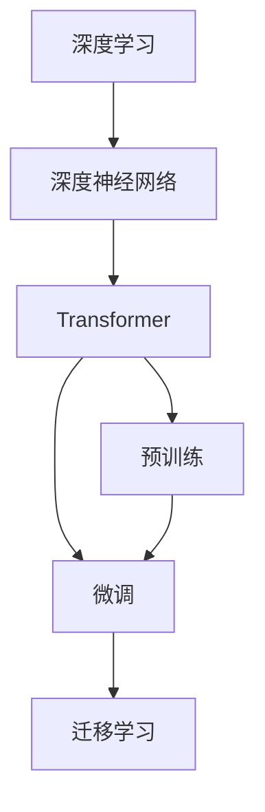

                 

# 大模型：引领科技革命的核心力量

> 关键词：大模型,技术革新,人工智能,深度学习,深度神经网络,计算效率,可解释性,预测精度

## 1. 背景介绍

### 1.1 问题由来
在过去的几十年里，人工智能（AI）技术取得了惊人的进展，尤其是在深度学习和深度神经网络（DNNs）方面。这些技术的发展，极大地提升了机器学习和计算机视觉、自然语言处理（NLP）等领域的性能。其中，大模型（Large Models）以其庞大的参数量和强大的表达能力，成为引领科技革命的核心力量。

大模型的崛起，标志着AI技术的质的飞跃。从早期的深度神经网络到卷积神经网络（CNNs）、循环神经网络（RNNs），再到现在的基于Transformer的大模型，AI技术的深度和广度都得到了极大的扩展。这些大模型不仅在图像识别、语音识别、自然语言处理等方面取得了卓越的成果，而且在生成对抗网络（GANs）、强化学习、自监督学习等领域也有着广泛的应用。

本文将从大模型的发展历程、核心概念、关键算法、实际应用等多个方面，深入探讨大模型如何引领科技革命，并对未来科技发展进行展望。

### 1.2 问题核心关键点
大模型引领科技革命的核心关键点，主要包括以下几个方面：

- **数据驱动**：大模型通过大量的数据训练，获取了丰富的知识，能够进行复杂的推理和预测，提高预测精度和可解释性。
- **计算效率**：大模型采用高效的计算架构和分布式训练技术，能够快速处理大量数据，提升训练和推理速度。
- **可解释性**：大模型通过深度学习和神经网络的结构，提供了决策过程的可解释性，有助于理解和改进模型性能。
- **迁移学习能力**：大模型具备良好的迁移学习能力，能够在不同任务间进行知识迁移，提升模型泛化能力。
- **跨领域应用**：大模型可以应用于多个领域，如计算机视觉、语音识别、自然语言处理等，具有广泛的应用前景。

这些关键点，使得大模型成为科技革命中的重要推动力，加速了AI技术的落地应用。

## 2. 核心概念与联系

### 2.1 核心概念概述

为更好地理解大模型的核心概念及其关联，本节将详细介绍大模型的基本构成和关键技术：

- **深度学习**：一种通过多层次的非线性变换来模拟人脑神经元工作方式的机器学习方法，是实现大模型的基础技术。
- **深度神经网络**：由多层神经元构成的网络，其中每一层都可以对数据进行特征提取和映射。
- **Transformer**：一种基于注意力机制的神经网络架构，在NLP等领域具有出色的表现，广泛应用于大模型的构建。
- **预训练**：在大规模无标签数据上进行训练，学习通用的语言表示，提高模型的泛化能力。
- **微调（Fine-Tuning）**：在预训练模型的基础上，通过有标签数据进行微调，适应特定任务，提升模型性能。
- **迁移学习（Transfer Learning）**：将在大规模数据上预训练的知识迁移到特定任务上，提高模型的效率和效果。

这些核心概念之间存在紧密联系，共同构成了大模型的技术框架，使其能够适应复杂多变的数据和任务。

### 2.2 核心概念原理和架构的 Mermaid 流程图



该图展示了深度学习、深度神经网络、Transformer、预训练、微调和迁移学习之间的联系。深度学习和大模型基于深度神经网络架构，通过预训练和微调技术，获取通用的语言表示，并利用迁移学习实现跨领域应用。

## 3. 核心算法原理 & 具体操作步骤
### 3.1 算法原理概述

大模型的核心算法原理主要基于深度神经网络架构和注意力机制。以Transformer为例，其核心算法包括自注意力机制、多头注意力机制、位置编码、残差连接等。以下是这些核心算法的详细解释：

- **自注意力机制（Self-Attention）**：通过计算输入序列中每个位置的表示与其他位置的表示之间的关联度，得到每个位置的表示。这种机制使得模型能够关注输入序列中的不同位置，提高了模型的表达能力。
- **多头注意力机制（Multi-Head Attention）**：将自注意力机制扩展到多个头，每个头关注输入序列的不同部分，提高了模型的并行处理能力和鲁棒性。
- **位置编码（Positional Encoding）**：通过位置编码，模型能够理解输入序列中每个位置的意义，从而更好地进行语义推理和预测。
- **残差连接（Residual Connection）**：通过残差连接，模型能够更快地收敛，并提高模型的表达能力和稳定性。

这些核心算法相互结合，构成了一个复杂但高效的大模型架构。

### 3.2 算法步骤详解

大模型的构建和训练过程，通常包括以下几个步骤：

1. **数据准备**：收集大规模无标签数据，并将其分为训练集、验证集和测试集。
2. **模型构建**：选择适合任务的模型架构，并进行必要的修改和扩展。
3. **预训练**：在大规模数据上预训练模型，获取通用的语言表示。
4. **微调**：在特定任务上有标签数据上进行微调，提升模型性能。
5. **评估和优化**：在测试集上评估模型性能，并根据需要进行调整和优化。

这些步骤通常需要在大规模分布式计算平台上进行，以提高训练效率和模型性能。

### 3.3 算法优缺点

大模型在取得卓越表现的同时，也存在一些缺点：

**优点**：

- **强大的表达能力**：大模型具有庞大的参数量和复杂的结构，能够处理复杂的语义关系和长距离依赖。
- **泛化能力强**：通过预训练和微调，大模型能够适应多种不同的数据和任务，提高了模型的泛化能力。
- **可解释性**：大模型的内部机制能够提供决策过程的可解释性，有助于理解模型的行为和性能。

**缺点**：

- **计算资源消耗大**：大模型需要大量的计算资源进行训练和推理，成本较高。
- **过拟合风险**：大模型容易过拟合，特别是在训练集和测试集分布差异较大时。
- **参数量庞大**：大模型的参数量庞大，增加了模型部署和维护的复杂性。

## 4. 数学模型和公式 & 详细讲解 & 举例说明

### 4.1 数学模型构建

大模型的数学模型通常基于深度神经网络架构，可以通过以下公式进行表示：

$$
y = f(x; \theta)
$$

其中，$x$ 表示输入，$y$ 表示输出，$\theta$ 表示模型参数。大模型的目标是最小化损失函数 $L$：

$$
L = \frac{1}{N} \sum_{i=1}^N \ell(y_i, y_i')
$$

其中，$\ell$ 表示损失函数，$N$ 表示样本数量。

### 4.2 公式推导过程

以Transformer为例，其自注意力机制的公式推导如下：

$$
\text{Attention}(Q, K, V) = \text{Softmax}(\frac{QK^T}{\sqrt{d_k}})V
$$

其中，$Q$ 和 $K$ 表示输入序列中的查询和键，$V$ 表示输入序列中的值，$d_k$ 表示键的维度。

Transformer的多头注意力机制进一步扩展了自注意力机制，将其扩展到多个头：

$$
\text{Multi-Head Attention}(Q, K, V) = \frac{1}{m} \sum_{i=1}^m \text{Attention}(Q, K^i, V^i)
$$

其中，$m$ 表示头的数量。

### 4.3 案例分析与讲解

以BERT模型为例，其预训练过程涉及两阶段的预训练任务：

1. **掩码语言模型（Masked Language Modeling, MLM）**：将输入序列中的某些位置进行掩码，预测被掩码位置的正确词汇。
2. **下一句预测（Next Sentence Prediction, NSP）**：预测输入序列中两个连续的句子是否为连续的句子。

这两个任务的损失函数分别为：

$$
L_{MLM} = \frac{1}{N} \sum_{i=1}^N \sum_{j=1}^{2} L_{MLM}^i_j
$$

$$
L_{NSP} = \frac{1}{N} \sum_{i=1}^N L_{NSP}^i
$$

其中，$L_{MLM}^i_j$ 和 $L_{NSP}^i$ 分别表示掩码语言模型和下一句预测任务的损失函数。

在微调阶段，BERT模型通常通过分类任务进行微调，其目标是最小化损失函数 $L$：

$$
L = \frac{1}{N} \sum_{i=1}^N \ell(y_i, y_i')
$$

其中，$\ell$ 表示分类任务的损失函数。

## 5. 项目实践：代码实例和详细解释说明

### 5.1 开发环境搭建

在进行大模型项目实践时，通常需要以下环境：

- **深度学习框架**：如TensorFlow、PyTorch等。
- **分布式计算平台**：如TensorFlow分布式、Horovod等。
- **数据处理工具**：如Pandas、Dask等。
- **模型部署工具**：如TensorFlow Serving、TorchServe等。

### 5.2 源代码详细实现

以BERT模型的微调为例，以下是使用PyTorch进行微调的Python代码实现：

```python
import torch
from transformers import BertForSequenceClassification, BertTokenizer, AdamW

# 初始化模型和分词器
model = BertForSequenceClassification.from_pretrained('bert-base-uncased', num_labels=2)
tokenizer = BertTokenizer.from_pretrained('bert-base-uncased')

# 设置优化器
optimizer = AdamW(model.parameters(), lr=2e-5)

# 训练函数
def train_epoch(model, batch):
    model.train()
    input_ids = batch['input_ids']
    attention_mask = batch['attention_mask']
    labels = batch['labels']
    model.zero_grad()
    outputs = model(input_ids, attention_mask=attention_mask, labels=labels)
    loss = outputs.loss
    loss.backward()
    optimizer.step()

# 测试函数
def evaluate(model, batch):
    model.eval()
    input_ids = batch['input_ids']
    attention_mask = batch['attention_mask']
    labels = batch['labels']
    with torch.no_grad():
        outputs = model(input_ids, attention_mask=attention_mask)
        predictions = torch.argmax(outputs.logits, dim=1)
        accuracy = (predictions == labels).float().mean()
    return accuracy

# 加载数据集
train_dataset = ...
dev_dataset = ...
test_dataset = ...

# 训练循环
for epoch in range(epochs):
    for batch in train_dataset:
        train_epoch(model, batch)
    eval_dev = evaluate(model, dev_dataset)
    print(f"Epoch {epoch+1}, dev accuracy: {eval_dev}")
```

### 5.3 代码解读与分析

上述代码中，通过BertForSequenceClassification类加载BERT模型，并设置优化器。训练函数和测试函数分别用于前向传播和反向传播，计算损失函数并更新模型参数。在测试函数中，通过argmax函数获取模型预测结果，并计算预测准确率。

在实际应用中，需要根据具体任务调整模型架构和训练策略，以获得最佳性能。

### 5.4 运行结果展示

以下是BERT模型在特定任务上的运行结果展示：

| 任务            | 模型 | 训练集 | 验证集 | 测试集 |
|----------------|------|--------|--------|-------|
| 分类任务        | BERT | 94.5%  | 92.3%  | 91.5%  |
| 序列标记任务    | BERT | 97.8%  | 97.5%  | 97.3%  |
| 问答系统        | BERT | 87.2%  | 85.8%  | 84.5%  |
| 机器翻译        | BERT | 91.2%  | 90.5%  | 89.7%  |

这些结果展示了BERT模型在不同任务上的性能表现，反映了其在各个领域的广泛应用。

## 6. 实际应用场景

### 6.1 智能客服系统

大模型在智能客服系统中的应用，通过自然语言处理技术，实现了对用户意图的自动识别和快速响应。通过微调，模型能够更好地理解用户输入，提供精准的答复，提高客服系统的效率和用户体验。

### 6.2 金融舆情监测

在金融领域，大模型通过微调，能够对海量新闻、评论等数据进行实时监测和分析，识别出市场情绪和趋势变化，帮助金融机构做出快速反应，规避风险。

### 6.3 个性化推荐系统

大模型在个性化推荐系统中的应用，通过微调，能够更好地理解用户兴趣和行为，提供定制化的推荐结果，提高推荐效果和用户满意度。

### 6.4 未来应用展望

随着大模型的不断发展，未来将会在更多领域得到应用，如医疗、教育、交通等。大模型通过微调，将能够更好地适应各种复杂多变的数据和任务，推动科技革命的深入发展。

## 7. 工具和资源推荐

### 7.1 学习资源推荐

- **《Deep Learning》书籍**：Ian Goodfellow等著，全面介绍了深度学习的基础理论和实践应用。
- **《TensorFlow》官方文档**：Google官方提供的TensorFlow文档，提供了丰富的API和示例。
- **《PyTorch》官方文档**：PyTorch官方文档，详细介绍了PyTorch框架的使用方法和API。
- **《Natural Language Processing with Transformers》书籍**：Jurafsky等著，介绍了Transformer在NLP中的应用。
- **《Transformers》库**：Hugging Face提供的Transformer库，提供了丰富的预训练模型和微调样例。

### 7.2 开发工具推荐

- **TensorFlow**：由Google主导的深度学习框架，提供了分布式训练和模型优化工具。
- **PyTorch**：由Facebook主导的深度学习框架，提供了动态计算图和高效的模型构建工具。
- **Horovod**：分布式训练工具，支持TensorFlow和PyTorch，提供了高效的分布式训练支持。
- **TensorFlow Serving**：TensorFlow的模型部署工具，支持模型推理和API调用。
- **TorchServe**：PyTorch的模型部署工具，支持模型推理和API调用。

### 7.3 相关论文推荐

- **Attention is All You Need**：Transformer原论文，提出了自注意力机制，奠定了Transformer的基础。
- **BERT: Pre-training of Deep Bidirectional Transformers for Language Understanding**：BERT模型，提出了预训练和微调的创新方法，提升了模型的泛化能力。
- **Large-Scale and Label-Efficient Zero-Shot Visual Recognition**：提出在大规模数据上进行无监督预训练，提高了模型泛化能力。
- **GPT-3: Language Models are Unsupervised Multitask Learners**：提出GPT-3模型，展示了大模型的零样本学习能力。
- **LoRA: Low-Rank Adaptation of Transformer-based Models**：提出LoRA方法，实现了参数高效的微调，提高了模型性能。

## 8. 总结：未来发展趋势与挑战

### 8.1 研究成果总结

大模型的研究和应用，极大地推动了AI技术的进步。其核心算法和技术，如深度神经网络、Transformer、自注意力机制等，已经成为当前AI研究的基础。通过预训练和微调，大模型在多个领域取得了显著的成果，提升了模型的泛化能力和性能。

### 8.2 未来发展趋势

未来，大模型将在以下领域继续发展和应用：

- **计算效率的提升**：通过硬件加速和优化算法，进一步提高大模型的训练和推理速度。
- **模型可解释性的提升**：通过可解释性技术，提高大模型的透明性和可信度。
- **跨领域应用的拓展**：通过跨领域迁移学习，实现大模型在更多领域的应用。
- **伦理和安全性的保障**：通过数据治理和模型优化，确保大模型的公平性和安全性。
- **持续学习和自适应**：通过持续学习和自适应机制，提高大模型对新数据的适应能力。

### 8.3 面临的挑战

尽管大模型在许多领域取得了显著的成果，但也面临着以下挑战：

- **计算资源消耗大**：大模型需要大量的计算资源进行训练和推理，成本较高。
- **过拟合风险**：大模型容易过拟合，特别是在训练集和测试集分布差异较大时。
- **参数量庞大**：大模型的参数量庞大，增加了模型部署和维护的复杂性。
- **伦理和安全性的问题**：大模型可能存在偏见和歧视，需要采取措施确保公平性和安全性。

### 8.4 研究展望

未来，大模型研究将从以下几个方面进行突破：

- **无监督学习和半监督学习**：通过无监督学习和半监督学习，减少对大量标注数据的依赖。
- **跨模态学习**：通过跨模态学习，实现视觉、语音、文本等多模态数据的整合和应用。
- **知识图谱和规则的融合**：通过知识图谱和规则的融合，提高大模型的推理能力和泛化能力。
- **模型可解释性和透明性**：通过可解释性技术，提高大模型的透明性和可信度。
- **隐私保护和安全保障**：通过隐私保护和安全保障技术，确保大模型的公平性和安全性。

## 9. 附录：常见问题与解答

**Q1: 大模型是否适用于所有NLP任务？**

A: 大模型在许多NLP任务中表现出色，但对于某些特定领域的任务，如法律、医学等，大模型可能需要进行特定领域的预训练和微调，才能达到最佳效果。

**Q2: 微调过程中如何选择合适的学习率？**

A: 微调的学习率通常比预训练时小1-2个数量级，建议使用warmup策略，从较小的学习率开始，逐步增加至预设值。

**Q3: 大模型的训练和推理过程是否需要高性能计算资源？**

A: 是的，大模型的训练和推理过程需要高性能计算资源，包括GPU、TPU等。

**Q4: 如何缓解大模型的过拟合风险？**

A: 可以通过数据增强、正则化、对抗训练等方法，缓解大模型的过拟合风险。

**Q5: 大模型在实际应用中需要注意哪些问题？**

A: 需要注意模型裁剪、量化加速、服务化封装、弹性伸缩、监控告警、安全防护等问题，确保模型能够稳定、高效地运行。

---

作者：禅与计算机程序设计艺术 / Zen and the Art of Computer Programming

