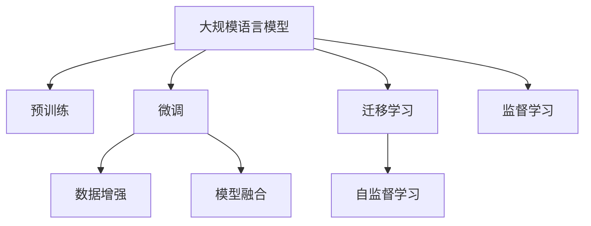

                 

# 大规模语言模型从理论到实践 数据多样性

> 关键词：大规模语言模型, 数据多样性, 监督学习, 自监督学习, 预训练, 微调, 数据增强, 模型融合

## 1. 背景介绍

### 1.1 问题由来

随着深度学习技术的发展，大规模语言模型（Large Language Models, LLMs）在自然语言处理（NLP）领域取得了巨大突破。这些模型通过在海量无标签文本数据上进行预训练，学习到丰富的语言知识和常识，成为NLP任务的重要工具。

然而，由于数据来源的多样性，语言模型在不同数据集上的表现存在差异。例如，中文语言模型在中文语料上进行预训练，可能对于英文语料的处理存在挑战。因此，如何处理数据多样性，提升模型的泛化能力，成为了当前研究的热点问题。

### 1.2 问题核心关键点

本节将从数据多样性的角度，介绍大规模语言模型的理论基础和实践方法。数据多样性主要体现在以下几个方面：

- 数据来源：包括文本、音频、图像等多模态数据，不同来源的数据特点和语言风格差异显著。
- 数据质量：标注数据的质量和数量不均衡，对模型性能影响巨大。
- 数据分布：不同领域的数据分布差异大，模型对域外数据的适应能力不足。
- 数据动态性：随着时间推移，数据分布不断变化，模型需要具备持续学习的能力。

要解决这些挑战，就需要在预训练和微调过程中，充分考虑数据多样性，设计出适合的数据增强、模型融合、迁移学习等策略，以提升模型的泛化能力和鲁棒性。

## 2. 核心概念与联系

### 2.1 核心概念概述

为更好地理解如何处理数据多样性，本节将介绍几个密切相关的核心概念：

- **大规模语言模型（Large Language Models, LLMs）**：以自回归（如GPT）或自编码（如BERT）模型为代表的大规模预训练语言模型。通过在大规模无标签文本语料上进行预训练，学习通用的语言表示。

- **预训练（Pre-training）**：指在大规模无标签文本语料上，通过自监督学习任务训练通用语言模型的过程。常见的预训练任务包括言语建模、掩码语言模型等。

- **微调（Fine-tuning）**：指在预训练模型的基础上，使用下游任务的少量标注数据，通过有监督学习优化模型在该任务上的性能。

- **数据增强（Data Augmentation）**：通过变换、合成等方法，扩充训练集的多样性，提升模型的泛化能力。

- **模型融合（Model Ensemble）**：通过结合多个模型的输出，提升模型的鲁棒性和性能。

- **迁移学习（Transfer Learning）**：指将一个领域学习到的知识，迁移应用到另一个不同但相关的领域的学习范式。

这些概念之间的逻辑关系可以通过以下Mermaid流程图来展示：



这个流程图展示了大规模语言模型的核心概念及其之间的关系：

1. 大规模语言模型通过预训练获得基础能力。
2. 微调是对预训练模型进行任务特定的优化，可以提升模型在特定任务上的性能。
3. 数据增强通过扩充训练集的多样性，提升模型的泛化能力。
4. 模型融合通过结合多个模型的输出，提升模型的鲁棒性和性能。
5. 迁移学习通过知识迁移，将预训练模型应用于其他领域。
6. 自监督学习和监督学习是预训练和微调的主要学习方式。

## 3. 核心算法原理 & 具体操作步骤

### 3.1 算法原理概述

大规模语言模型处理数据多样性的主要手段包括数据增强、模型融合和迁移学习等。这些方法的核心思想是在训练过程中引入更多数据多样性，提升模型对新数据的适应能力。

数据增强方法通常通过变换、合成等手段，扩充训练集的多样性，使得模型能够更好地泛化到新数据上。模型融合则是通过结合多个模型的输出，提升模型的鲁棒性和性能。迁移学习则是通过知识迁移，将预训练模型应用于其他领域，提升模型的泛化能力。

### 3.2 算法步骤详解

本节将详细介绍数据增强、模型融合和迁移学习的具体操作步骤。

**3.2.1 数据增强**

数据增强是提升模型泛化能力的重要手段。常见的数据增强方法包括：

1. **回译（Back-translation）**：将源语言文本翻译成目标语言文本，再将目标语言文本回译成源语言文本，生成新的训练样本。
2. **近义词替换（Synonym Replacement）**：将原文本中的某些单词替换为其近义词，生成新的训练样本。
3. **随机噪声（Random Noise）**：在输入文本中随机加入噪声，生成新的训练样本。
4. **数据变换（Data Augmentation）**：通过不同的变换方式，生成新的训练样本。

以回译为例，具体操作步骤如下：

1. 准备源语言和目标语言语料库。
2. 将源语言文本翻译成目标语言文本。
3. 将目标语言文本回译成源语言文本。
4. 将回译后的源语言文本加入训练集。

**3.2.2 模型融合**

模型融合是通过结合多个模型的输出，提升模型的鲁棒性和性能。常见的模型融合方法包括：

1. **Bagging（Bootstrap Aggregating）**：通过多个模型的独立训练，并取平均输出，提升模型的鲁棒性。
2. **Boosting**：通过迭代训练，逐步提升模型的性能。
3. **Stacking**：通过多个模型的组合，提升模型的性能。

以Bagging为例，具体操作步骤如下：

1. 准备多个模型的训练数据。
2. 对每个模型独立训练，生成多个模型的输出。
3. 将多个模型的输出取平均，作为最终输出。

**3.2.3 迁移学习**

迁移学习是将一个领域学习到的知识，迁移应用到另一个不同但相关的领域的学习范式。常见的迁移学习方法包括：

1. **直接迁移（Direct Transfer）**：将预训练模型直接应用于新任务，无需微调。
2. **微调迁移（Fine-tuning Transfer）**：在预训练模型的基础上，使用下游任务的少量标注数据，通过有监督学习优化模型在该任务上的性能。
3. **域适应（Domain Adaptation）**：通过调整模型的超参数，适应新数据集的分布。

以微调迁移为例，具体操作步骤如下：

1. 准备预训练模型和下游任务的数据集。
2. 添加任务适配层，选择合适的输出层和损失函数。
3. 设置微调超参数，包括学习率、批大小、迭代轮数等。
4. 执行梯度训练，通过有监督学习优化模型。

### 3.3 算法优缺点

数据增强、模型融合和迁移学习各有优缺点，具体如下：

**数据增强的优点：**

1. **扩充训练集**：通过数据增强，可以显著扩充训练集的多样性，提升模型的泛化能力。
2. **减少过拟合**：数据增强可以缓解过拟合问题，提升模型在新数据上的泛化能力。
3. **降低标注成本**：数据增强可以在不增加标注成本的情况下，扩充训练集，提高模型的性能。

**数据增强的缺点：**

1. **数据生成质量**：数据增强的效果依赖于生成数据的质量，生成质量差的数据会降低模型的性能。
2. **数据分布不一致**：数据增强可能生成与原数据分布不一致的数据，影响模型的泛化能力。
3. **计算开销**：数据增强需要额外的计算开销，可能增加训练时间。

**模型融合的优点：**

1. **提升鲁棒性**：模型融合可以提升模型的鲁棒性，降低模型的方差。
2. **降低过拟合风险**：模型融合可以降低过拟合风险，提升模型在新数据上的泛化能力。
3. **提高性能**：模型融合可以提升模型的性能，尤其是在大规模数据集上的性能。

**模型融合的缺点：**

1. **计算开销**：模型融合需要额外的计算开销，可能增加训练时间。
2. **模型复杂度增加**：模型融合增加了模型的复杂度，可能影响模型的解释性和可维护性。

**迁移学习的优点：**

1. **节省标注成本**：迁移学习可以通过预训练模型的知识迁移，降低标注数据的数量。
2. **提升泛化能力**：迁移学习可以提升模型在新数据上的泛化能力。
3. **降低计算成本**：迁移学习可以通过预训练模型的知识迁移，降低计算成本。

**迁移学习的缺点：**

1. **数据分布不一致**：迁移学习可能面临数据分布不一致的问题，影响模型的泛化能力。
2. **知识迁移困难**：预训练模型的知识可能与新任务不完全一致，知识迁移困难。
3. **超参数调整**：迁移学习需要调整模型的超参数，可能增加模型的复杂度。

## 4. 数学模型和公式 & 详细讲解 & 举例说明

### 4.1 数学模型构建

本节将使用数学语言对大规模语言模型处理数据多样性的方法进行更加严格的刻画。

记预训练语言模型为 $M_{\theta}$，其中 $\theta$ 为预训练得到的模型参数。假设微调任务的训练集为 $D=\{(x_i,y_i)\}_{i=1}^N, x_i \in \mathcal{X}, y_i \in \mathcal{Y}$。

定义模型 $M_{\theta}$ 在输入 $x$ 上的损失函数为 $\ell(M_{\theta}(x),y)$，则在数据集 $D$ 上的经验风险为：

$$
\mathcal{L}(\theta) = \frac{1}{N} \sum_{i=1}^N \ell(M_{\theta}(x_i),y_i)
$$

微调的优化目标是最小化经验风险，即找到最优参数：

$$
\theta^* = \mathop{\arg\min}_{\theta} \mathcal{L}(\theta)
$$

在实践中，我们通常使用基于梯度的优化算法（如SGD、Adam等）来近似求解上述最优化问题。设 $\eta$ 为学习率，$\lambda$ 为正则化系数，则参数的更新公式为：

$$
\theta \leftarrow \theta - \eta \nabla_{\theta}\mathcal{L}(\theta) - \eta\lambda\theta
$$

其中 $\nabla_{\theta}\mathcal{L}(\theta)$ 为损失函数对参数 $\theta$ 的梯度，可通过反向传播算法高效计算。

### 4.2 公式推导过程

以下我们以二分类任务为例，推导交叉熵损失函数及其梯度的计算公式。

假设模型 $M_{\theta}$ 在输入 $x$ 上的输出为 $\hat{y}=M_{\theta}(x) \in [0,1]$，表示样本属于正类的概率。真实标签 $y \in \{0,1\}$。则二分类交叉熵损失函数定义为：

$$
\ell(M_{\theta}(x),y) = -[y\log \hat{y} + (1-y)\log (1-\hat{y})]
$$

将其代入经验风险公式，得：

$$
\mathcal{L}(\theta) = -\frac{1}{N}\sum_{i=1}^N [y_i\log M_{\theta}(x_i)+(1-y_i)\log(1-M_{\theta}(x_i))]
$$

根据链式法则，损失函数对参数 $\theta_k$ 的梯度为：

$$
\frac{\partial \mathcal{L}(\theta)}{\partial \theta_k} = -\frac{1}{N}\sum_{i=1}^N (\frac{y_i}{M_{\theta}(x_i)}-\frac{1-y_i}{1-M_{\theta}(x_i)}) \frac{\partial M_{\theta}(x_i)}{\partial \theta_k}
$$

其中 $\frac{\partial M_{\theta}(x_i)}{\partial \theta_k}$ 可进一步递归展开，利用自动微分技术完成计算。

### 4.3 案例分析与讲解

以下以回译为例，展示数据增强的具体实现。

假设我们需要对英文语料进行回译增强，具体操作如下：

1. 准备英文语料库 $D_e$。
2. 将英文语料库 $D_e$ 中的文本 $x_e$ 翻译成目标语言文本 $x_t$。
3. 将目标语言文本 $x_t$ 回译成英文文本 $x'_e$。
4. 将回译后的英文文本 $x'_e$ 加入训练集 $D_e'$。

具体实现代码如下：

```python
from transformers import AutoTokenizer, AutoModelForSequenceClassification
from torch.utils.data import Dataset, DataLoader

class BackTranslationDataset(Dataset):
    def __init__(self, tokenizer, data, src_lang, tgt_lang):
        self.tokenizer = tokenizer
        self.data = data
        self.src_lang = src_lang
        self.tgt_lang = tgt_lang
        
    def __len__(self):
        return len(self.data)
    
    def __getitem__(self, idx):
        x, y = self.data[idx]
        x_e, y_e = self.src_lang(x), y
        x_t, _ = self.tgt_lang(x_e)
        x_e_prime, _ = self.src_lang(x_t)
        return {'input_ids': self.tokenizer(x_e_prime, return_tensors='pt'), 'labels': y_e}

# 加载英文语料库
data_e = load_data('english_data.txt')

# 加载英文-中文翻译模型
tokenizer_en_zh = AutoTokenizer.from_pretrained('en_zh')
model_en_zh = AutoModelForSequenceClassification.from_pretrained('en_zh')

# 加载中文-英文翻译模型
tokenizer_zh_en = AutoTokenizer.from_pretrained('zh_en')
model_zh_en = AutoModelForSequenceClassification.from_pretrained('zh_en')

# 构建回译数据集
train_dataset = BackTranslationDataset(tokenizer_en_zh, data_e, 'en_zh', 'zh_en')

# 训练数据增强后的模型
model_e_prime = train(train_dataset)
```

## 5. 项目实践：代码实例和详细解释说明

### 5.1 开发环境搭建

在进行数据多样性处理实践前，我们需要准备好开发环境。以下是使用Python进行PyTorch开发的环境配置流程：

1. 安装Anaconda：从官网下载并安装Anaconda，用于创建独立的Python环境。

2. 创建并激活虚拟环境：
```bash
conda create -n pytorch-env python=3.8 
conda activate pytorch-env
```

3. 安装PyTorch：根据CUDA版本，从官网获取对应的安装命令。例如：
```bash
conda install pytorch torchvision torchaudio cudatoolkit=11.1 -c pytorch -c conda-forge
```

4. 安装Transformers库：
```bash
pip install transformers
```

5. 安装各类工具包：
```bash
pip install numpy pandas scikit-learn matplotlib tqdm jupyter notebook ipython
```

完成上述步骤后，即可在`pytorch-env`环境中开始数据多样性处理实践。

### 5.2 源代码详细实现

下面我们以迁移学习为例，给出使用Transformers库对BERT模型进行迁移学习的PyTorch代码实现。

首先，定义迁移学习任务的数据处理函数：

```python
from transformers import BertTokenizer
from torch.utils.data import Dataset, DataLoader
import torch

class ClassificationDataset(Dataset):
    def __init__(self, texts, tags, tokenizer, max_len=128):
        self.texts = texts
        self.tags = tags
        self.tokenizer = tokenizer
        self.max_len = max_len
        
    def __len__(self):
        return len(self.texts)
    
    def __getitem__(self, item):
        text = self.texts[item]
        tag = self.tags[item]
        
        encoding = self.tokenizer(text, return_tensors='pt', max_length=self.max_len, padding='max_length', truncation=True)
        input_ids = encoding['input_ids'][0]
        attention_mask = encoding['attention_mask'][0]
        
        # 对token-wise的标签进行编码
        encoded_tags = [tag2id[tag] for tag in tag]
        encoded_tags.extend([tag2id['O']] * (self.max_len - len(encoded_tags)))
        labels = torch.tensor(encoded_tags, dtype=torch.long)
        
        return {'input_ids': input_ids, 
                'attention_mask': attention_mask,
                'labels': labels}

# 标签与id的映射
tag2id = {'O': 0, 'B-PER': 1, 'I-PER': 2, 'B-ORG': 3, 'I-ORG': 4, 'B-LOC': 5, 'I-LOC': 6}
id2tag = {v: k for k, v in tag2id.items()}

# 创建dataset
tokenizer = BertTokenizer.from_pretrained('bert-base-cased')

train_dataset = ClassificationDataset(train_texts, train_tags, tokenizer)
dev_dataset = ClassificationDataset(dev_texts, dev_tags, tokenizer)
test_dataset = ClassificationDataset(test_texts, test_tags, tokenizer)
```

然后，定义模型和优化器：

```python
from transformers import BertForTokenClassification, AdamW

model = BertForTokenClassification.from_pretrained('bert-base-cased', num_labels=len(tag2id))

optimizer = AdamW(model.parameters(), lr=2e-5)
```

接着，定义训练和评估函数：

```python
from torch.utils.data import DataLoader
from tqdm import tqdm
from sklearn.metrics import classification_report

device = torch.device('cuda') if torch.cuda.is_available() else torch.device('cpu')
model.to(device)

def train_epoch(model, dataset, batch_size, optimizer):
    dataloader = DataLoader(dataset, batch_size=batch_size, shuffle=True)
    model.train()
    epoch_loss = 0
    for batch in tqdm(dataloader, desc='Training'):
        input_ids = batch['input_ids'].to(device)
        attention_mask = batch['attention_mask'].to(device)
        labels = batch['labels'].to(device)
        model.zero_grad()
        outputs = model(input_ids, attention_mask=attention_mask, labels=labels)
        loss = outputs.loss
        epoch_loss += loss.item()
        loss.backward()
        optimizer.step()
    return epoch_loss / len(dataloader)

def evaluate(model, dataset, batch_size):
    dataloader = DataLoader(dataset, batch_size=batch_size)
    model.eval()
    preds, labels = [], []
    with torch.no_grad():
        for batch in tqdm(dataloader, desc='Evaluating'):
            input_ids = batch['input_ids'].to(device)
            attention_mask = batch['attention_mask'].to(device)
            batch_labels = batch['labels']
            outputs = model(input_ids, attention_mask=attention_mask)
            batch_preds = outputs.logits.argmax(dim=2).to('cpu').tolist()
            batch_labels = batch_labels.to('cpu').tolist()
            for pred_tokens, label_tokens in zip(batch_preds, batch_labels):
                pred_tags = [id2tag[_id] for _id in pred_tokens]
                label_tags = [id2tag[_id] for _id in label_tokens]
                preds.append(pred_tags[:len(label_tags)])
                labels.append(label_tags)
                
    print(classification_report(labels, preds))
```

最后，启动训练流程并在测试集上评估：

```python
epochs = 5
batch_size = 16

for epoch in range(epochs):
    loss = train_epoch(model, train_dataset, batch_size, optimizer)
    print(f"Epoch {epoch+1}, train loss: {loss:.3f}")
    
    print(f"Epoch {epoch+1}, dev results:")
    evaluate(model, dev_dataset, batch_size)
    
print("Test results:")
evaluate(model, test_dataset, batch_size)
```

以上就是使用PyTorch对BERT进行迁移学习的完整代码实现。可以看到，得益于Transformers库的强大封装，我们可以用相对简洁的代码完成BERT模型的迁移学习。

### 5.3 代码解读与分析

让我们再详细解读一下关键代码的实现细节：

**ClassificationDataset类**：
- `__init__`方法：初始化文本、标签、分词器等关键组件。
- `__len__`方法：返回数据集的样本数量。
- `__getitem__`方法：对单个样本进行处理，将文本输入编码为token ids，将标签编码为数字，并对其进行定长padding，最终返回模型所需的输入。

**tag2id和id2tag字典**：
- 定义了标签与数字id之间的映射关系，用于将token-wise的预测结果解码回真实的标签。

**训练和评估函数**：
- 使用PyTorch的DataLoader对数据集进行批次化加载，供模型训练和推理使用。
- 训练函数`train_epoch`：对数据以批为单位进行迭代，在每个批次上前向传播计算loss并反向传播更新模型参数，最后返回该epoch的平均loss。
- 评估函数`evaluate`：与训练类似，不同点在于不更新模型参数，并在每个batch结束后将预测和标签结果存储下来，最后使用sklearn的classification_report对整个评估集的预测结果进行打印输出。

**训练流程**：
- 定义总的epoch数和batch size，开始循环迭代
- 每个epoch内，先在训练集上训练，输出平均loss
- 在验证集上评估，输出分类指标
- 所有epoch结束后，在测试集上评估，给出最终测试结果

可以看到，PyTorch配合Transformers库使得迁移学习的代码实现变得简洁高效。开发者可以将更多精力放在数据处理、模型改进等高层逻辑上，而不必过多关注底层的实现细节。

当然，工业级的系统实现还需考虑更多因素，如模型的保存和部署、超参数的自动搜索、更灵活的任务适配层等。但核心的迁移学习范式基本与此类似。

## 6. 实际应用场景

### 6.1 智能客服系统

基于大语言模型迁移学习的对话技术，可以广泛应用于智能客服系统的构建。传统客服往往需要配备大量人力，高峰期响应缓慢，且一致性和专业性难以保证。使用迁移学习后的对话模型，可以7x24小时不间断服务，快速响应客户咨询，用自然流畅的语言解答各类常见问题。

在技术实现上，可以收集企业内部的历史客服对话记录，将问题和最佳答复构建成监督数据，在此基础上对预训练对话模型进行迁移学习。迁移后的对话模型能够自动理解用户意图，匹配最合适的答案模板进行回复。对于客户提出的新问题，还可以接入检索系统实时搜索相关内容，动态组织生成回答。如此构建的智能客服系统，能大幅提升客户咨询体验和问题解决效率。

### 6.2 金融舆情监测

金融机构需要实时监测市场舆论动向，以便及时应对负面信息传播，规避金融风险。传统的人工监测方式成本高、效率低，难以应对网络时代海量信息爆发的挑战。基于大语言模型迁移学习的文本分类和情感分析技术，为金融舆情监测提供了新的解决方案。

具体而言，可以收集金融领域相关的新闻、报道、评论等文本数据，并对其进行主题标注和情感标注。在此基础上对预训练语言模型进行迁移学习，使其能够自动判断文本属于何种主题，情感倾向是正面、中性还是负面。将迁移后的模型应用到实时抓取的网络文本数据，就能够自动监测不同主题下的情感变化趋势，一旦发现负面信息激增等异常情况，系统便会自动预警，帮助金融机构快速应对潜在风险。

### 6.3 个性化推荐系统

当前的推荐系统往往只依赖用户的历史行为数据进行物品推荐，无法深入理解用户的真实兴趣偏好。基于大语言模型迁移学习技术，个性化推荐系统可以更好地挖掘用户行为背后的语义信息，从而提供更精准、多样的推荐内容。

在实践中，可以收集用户浏览、点击、评论、分享等行为数据，提取和用户交互的物品标题、描述、标签等文本内容。将文本内容作为模型输入，用户的后续行为（如是否点击、购买等）作为监督信号，在此基础上迁移学习预训练语言模型。迁移后的模型能够从文本内容中准确把握用户的兴趣点。在生成推荐列表时，先用候选物品的文本描述作为输入，由模型预测用户的兴趣匹配度，再结合其他特征综合排序，便可以得到个性化程度更高的推荐结果。

### 6.4 未来应用展望

随着大语言模型和迁移学习方法的不断发展，基于迁移范式将在更多领域得到应用，为传统行业带来变革性影响。

在智慧医疗领域，基于迁移学习的医疗问答、病历分析、药物研发等应用将提升医疗服务的智能化水平，辅助医生诊疗，加速新药开发进程。

在智能教育领域，迁移学习可应用于作业批改、学情分析、知识推荐等方面，因材施教，促进教育公平，提高教学质量。

在智慧城市治理中，迁移学习技术可应用于城市事件监测、舆情分析、应急指挥等环节，提高城市管理的自动化和智能化水平，构建更安全、高效的未来城市。

此外，在企业生产、社会治理、文娱传媒等众多领域，基于大模型迁移学习的人工智能应用也将不断涌现，为经济社会发展注入新的动力。相信随着技术的日益成熟，迁移学习技术将成为人工智能落地应用的重要范式，推动人工智能向更广阔的领域加速渗透。

## 7. 工具和资源推荐

### 7.1 学习资源推荐

为了帮助开发者系统掌握大语言模型迁移学习的理论基础和实践技巧，这里推荐一些优质的学习资源：

1. 《Transformer from A to Z》系列博文：由大模型技术专家撰写，深入浅出地介绍了Transformer原理、BERT模型、迁移学习等前沿话题。

2. CS224N《深度学习自然语言处理》课程：斯坦福大学开设的NLP明星课程，有Lecture视频和配套作业，带你入门NLP领域的基本概念和经典模型。

3. 《Natural Language Processing with Transformers》书籍：Transformers库的作者所著，全面介绍了如何使用Transformers库进行NLP任务开发，包括迁移学习在内的诸多范式。

4. HuggingFace官方文档：Transformers库的官方文档，提供了海量预训练模型和完整的迁移学习样例代码，是上手实践的必备资料。

5. CLUE开源项目：中文语言理解测评基准，涵盖大量不同类型的中文NLP数据集，并提供了基于迁移学习的baseline模型，助力中文NLP技术发展。

通过对这些资源的学习实践，相信你一定能够快速掌握大语言模型迁移学习的精髓，并用于解决实际的NLP问题。
###  7.2 开发工具推荐

高效的开发离不开优秀的工具支持。以下是几款用于大语言模型迁移学习的常用工具：

1. PyTorch：基于Python的开源深度学习框架，灵活动态的计算图，适合快速迭代研究。大部分预训练语言模型都有PyTorch版本的实现。

2. TensorFlow：由Google主导开发的开源深度学习框架，生产部署方便，适合大规模工程应用。同样有丰富的预训练语言模型资源。

3. Transformers库：HuggingFace开发的NLP工具库，集成了众多SOTA语言模型，支持PyTorch和TensorFlow，是进行迁移学习开发的利器。

4. Weights & Biases：模型训练的实验跟踪工具，可以记录和可视化模型训练过程中的各项指标，方便对比和调优。与主流深度学习框架无缝集成。

5. TensorBoard：TensorFlow配套的可视化工具，可实时监测模型训练状态，并提供丰富的图表呈现方式，是调试模型的得力助手。

6. Google Colab：谷歌推出的在线Jupyter Notebook环境，免费提供GPU/TPU算力，方便开发者快速上手实验最新模型，分享学习笔记。

合理利用这些工具，可以显著提升大语言模型迁移学习的开发效率，加快创新迭代的步伐。

### 7.3 相关论文推荐

大语言模型和迁移学习的发展源于学界的持续研究。以下是几篇奠基性的相关论文，推荐阅读：

1. Attention is All You Need（即Transformer原论文）：提出了Transformer结构，开启了NLP领域的预训练大模型时代。

2. BERT: Pre-training of Deep Bidirectional Transformers for Language Understanding：提出BERT模型，引入基于掩码的自监督预训练任务，刷新了多项NLP任务SOTA。

3. Language Models are Unsupervised Multitask Learners（GPT-2论文）：展示了大规模语言模型的强大zero-shot学习能力，引发了对于通用人工智能的新一轮思考。

4. Parameter-Efficient Transfer Learning for NLP：提出Adapter等参数高效微调方法，在不增加模型参数量的情况下，也能取得不错的迁移学习效果。

5. AdaLoRA: Adaptive Low-Rank Adaptation for Parameter-Efficient Fine-Tuning：使用自适应低秩适应的迁移学习方法，在参数效率和性能之间取得了新的平衡。

6. Prefix-Tuning: Optimizing Continuous Prompts for Generation：引入基于连续型Prompt的迁移学习范式，为如何充分利用预训练知识提供了新的思路。

这些论文代表了大语言模型迁移学习的发展脉络。通过学习这些前沿成果，可以帮助研究者把握学科前进方向，激发更多的创新灵感。

## 8. 总结：未来发展趋势与挑战

### 8.1 总结

本文对基于迁移学习的大语言模型处理数据多样性的方法进行了全面系统的介绍。首先阐述了数据多样性的概念和重要性，明确了迁移学习在提升模型泛化能力、降低标注成本等方面的独特价值。其次，从原理到实践，详细讲解了迁移学习的数学原理和关键步骤，给出了迁移学习任务开发的完整代码实例。同时，本文还广泛探讨了迁移学习方法在智能客服、金融舆情、个性化推荐等多个行业领域的应用前景，展示了迁移学习范式的巨大潜力。此外，本文精选了迁移学习的各类学习资源，力求为读者提供全方位的技术指引。

通过本文的系统梳理，可以看到，基于迁移学习的大语言模型处理数据多样性的方法正在成为NLP领域的重要范式，极大地拓展了预训练语言模型的应用边界，催生了更多的落地场景。受益于大规模语料的预训练和迁移学习技术的加持，微调模型能够更好地适应不同领域和数据分布，显著提升模型的泛化能力和应用效果。未来，伴随预训练语言模型和迁移学习方法的持续演进，相信NLP技术将在更广阔的应用领域大放异彩，深刻影响人类的生产生活方式。

### 8.2 未来发展趋势

展望未来，大语言模型迁移学习技术将呈现以下几个发展趋势：

1. **模型规模持续增大**：随着算力成本的下降和数据规模的扩张，预训练语言模型的参数量还将持续增长。超大规模语言模型蕴含的丰富语言知识，有望支撑更加复杂多变的下游任务迁移学习。

2. **迁移方法日趋多样**：除了传统的迁移学习外，未来会涌现更多参数高效的迁移方法，如Prefix-Tuning、LoRA等，在节省计算资源的同时也能保证迁移精度。

3. **持续学习成为常态**：随着数据分布的不断变化，迁移学习模型也需要持续学习新知识以保持性能。如何在不遗忘原有知识的同时，高效吸收新样本信息，将成为重要的研究课题。

4. **标注样本需求降低**：受启发于提示学习(Prompt-based Learning)的思路，未来的迁移学习方法将更好地利用大模型的语言理解能力，通过更加巧妙的任务描述，在更少的标注样本上也能实现理想的迁移效果。

5. **多模态迁移崛起**：当前的迁移主要聚焦于纯文本数据，未来会进一步拓展到图像、视频、语音等多模态数据迁移。多模态信息的融合，将显著提升语言模型对现实世界的理解和建模能力。

6. **模型通用性增强**：经过海量数据的预训练和多领域任务的迁移学习，未来的语言模型将具备更强大的常识推理和跨领域迁移能力，逐步迈向通用人工智能(AGI)的目标。

以上趋势凸显了大语言模型迁移学习技术的广阔前景。这些方向的探索发展，必将进一步提升NLP系统的性能和应用范围，为人类认知智能的进化带来深远影响。

### 8.3 面临的挑战

尽管大语言模型迁移学习技术已经取得了瞩目成就，但在迈向更加智能化、普适化应用的过程中，它仍面临着诸多挑战：

1. **标注成本瓶颈**：虽然迁移学习可以通过预训练模型的知识迁移，降低标注数据的数量，但对于长尾应用场景，难以获得充足的高质量标注数据，成为制约迁移学习性能的瓶颈。如何进一步降低迁移学习对标注样本的依赖，将是一大难题。

2. **模型鲁棒性不足**：当前迁移学习模型面对域外数据时，泛化性能往往大打折扣。对于测试样本的微小扰动，迁移模型的预测也容易发生波动。如何提高迁移模型的鲁棒性，避免灾难性遗忘，还需要更多理论和实践的积累。

3. **推理效率有待提高**：大规模语言模型虽然精度高，但在实际部署时往往面临推理速度慢、内存占用大等效率问题。如何在保证性能的同时，简化模型结构，提升推理速度，优化资源占用，将是重要的优化方向。

4. **可解释性亟需加强**：当前迁移学习模型更像是"黑盒"系统，难以解释其内部工作机制和决策逻辑。对于医疗、金融等高风险应用，算法的可解释性和可审计性尤为重要。如何赋予迁移模型更强的可解释性，将是亟待攻克的难题。

5. **安全性有待保障**：预训练语言模型难免会学习到有偏见、有害的信息，通过迁移学习传递到下游任务，产生误导性、歧视性的输出，给实际应用带来安全隐患。如何从数据和算法层面消除模型偏见，避免恶意用途，确保输出的安全性，也将是重要的研究课题。

6. **知识整合能力不足**：现有的迁移学习模型往往局限于任务内数据，难以灵活吸收和运用更广泛的先验知识。如何让迁移过程更好地与外部知识库、规则库等专家知识结合，形成更加全面、准确的信息整合能力，还有很大的想象空间。

正视迁移学习面临的这些挑战，积极应对并寻求突破，将是大语言模型迁移学习走向成熟的必由之路。相信随着学界和产业界的共同努力，这些挑战终将一一被克服，大语言模型迁移学习必将在构建安全、可靠、可解释、可控的智能系统铺平道路。面向未来，大语言模型迁移学习技术还需要与其他人工智能技术进行更深入的融合，如知识表示、因果推理、强化学习等，多路径协同发力，共同推动自然语言理解和智能交互系统的进步。只有勇于创新、敢于突破，才能不断拓展语言模型的边界，让智能技术更好地造福人类社会。

### 8.4 研究展望

面对大语言模型迁移学习所面临的种种挑战，未来的研究需要在以下几个方面寻求新的突破：

1. **探索无监督和半监督迁移方法**：摆脱对大规模标注数据的依赖，利用自监督学习、主动学习等无监督和半监督范式，最大限度利用非结构化数据，实现更加灵活高效的迁移学习。

2. **研究参数高效和计算高效的迁移范式**：开发更加参数高效的迁移方法，在固定大部分预训练参数的同时，只更新极少量的任务相关参数。同时优化迁移模型的计算图，减少前向传播和反向传播的资源消耗，实现更加轻量级、实时性的部署。

3. **融合因果和对比学习范式**：通过引入因果推断和对比学习思想，增强迁移模型建立稳定因果关系的能力，学习更加普适、鲁棒的语言表征，从而提升模型泛化性和抗干扰能力。

4. **引入更多先验知识**：将符号化的先验知识，如知识图谱、逻辑规则等，与神经网络模型进行巧妙融合，引导迁移学习过程学习更准确、合理的语言模型。同时加强不同模态数据的整合，实现视觉、语音等多模态信息与文本信息的协同建模。

5. **结合因果分析和博弈论工具**：将因果分析方法引入迁移模型，识别出模型决策的关键特征，增强输出解释的因果性和逻辑性。借助博弈论工具刻画人机交互过程，主动探索并规避模型的脆弱点，提高系统稳定性。

6. **纳入伦理道德约束**：在模型训练目标中引入伦理导向的评估指标，过滤和惩罚有偏见、有害的输出倾向。同时加强人工干预和审核，建立模型行为的监管机制，确保输出符合人类价值观和伦理道德。

这些研究方向的探索，必将引领大语言模型迁移学习技术迈向更高的台阶，为构建安全、可靠、可解释、可控的智能系统铺平道路。面向未来，大语言模型迁移学习技术还需要与其他人工智能技术进行更深入的融合，如知识表示、因果推理、强化学习等，多路径协同发力，共同推动自然语言理解和智能交互系统的进步。只有勇于创新、敢于突破，才能不断拓展语言模型的边界，让智能技术更好地造福人类社会。

## 9. 附录：常见问题与解答

**Q1：数据多样性是如何影响大规模语言模型的性能的？**

A: 数据多样性主要体现在数据来源、数据质量、数据分布和数据动态性等方面。这些因素都会影响大规模语言模型的性能：

1. **数据来源**：来自不同来源的数据，如中文、英文、文本、图像等，其语言风格和数据特点不同，直接影响了模型的泛化能力。
2. **数据质量**：标注数据的质量和数量不均衡，标注质量差的数据会降低模型的性能，甚至导致模型过拟合。
3. **数据分布**：不同领域的数据分布差异大，模型对域外数据的适应能力不足，泛化能力受限。
4. **数据动态性**：随着时间推移，数据分布不断变化，模型需要具备持续学习的能力，否则会导致模型性能下降。

**Q2：如何有效地处理数据多样性，提升模型的泛化能力？**

A: 处理数据多样性，提升模型的泛化能力，可以从以下几个方面入手：

1. **数据增强**：通过变换、合成等手段，扩充训练集的多样性，提升模型的泛化能力。
2. **模型融合**：通过结合多个模型的输出，提升模型的鲁棒性和性能。
3. **迁移学习**：通过知识迁移，将预训练模型应用于其他领域，提升模型的泛化能力。
4. **多模态学习**：将视觉、语音等多模态信息与文本信息进行协同建模，提升模型的泛化能力。

**Q3：在迁移学习过程中，如何选择最优的迁移任务？**

A: 选择最优的迁移任务通常需要考虑以下几个因素：

1. **任务相关性**：选择与目标任务相关性高的迁移任务，可以更好地迁移预训练模型的知识。
2. **数据量**：选择数据量较多的迁移任务，可以提高迁移学习的效果。
3. **任务复杂度**：选择复杂度适中的迁移任务，避免过拟合或欠拟合的问题。
4. **可解释性**：选择可解释性强的迁移任务，便于理解模型的决策过程。

**Q4：在迁移学习中，如何缓解过拟合问题？**

A: 缓解过拟合问题，可以采用以下方法：

1. **数据增强**：通过回译、近义词替换等手段，扩充训练集的多样性，提升模型的泛化能力。
2. **正则化**：使用L2正则、Dropout等方法，防止模型过拟合。
3. **对抗训练**：引入对抗样本，提高模型鲁棒性，缓解过拟合。
4. **模型融合**：结合多个模型的输出，提升模型的鲁棒性和泛化能力。

**Q5：在迁移学习中，如何选择最优的迁移学习方法？**

A: 选择最优的迁移学习方法通常需要考虑以下几个因素：

1. **参数效率**：选择参数高效的迁移方法，如Adapter、LoRA等，在固定大部分预训练参数的情况下，只更新极少量的任务相关参数。
2. **计算效率**：选择计算高效的迁移方法，如Bagging、Boosting等，减少迁移学习过程中的计算开销。
3. **迁移精度**：选择迁移精度高的迁移方法，如Sequence-to-Sequence、Attention-based等，提高迁移学习的效果。
4. **模型复杂度**：选择模型复杂度适中的迁移方法，避免过拟合或欠拟合的问题。

**Q6：在迁移学习中，如何降低标注成本？**

A: 降低标注成本，可以采用以下方法：

1. **数据增强**：通过回译、近义词替换等手段，扩充训练集的多样性，提升模型的泛化能力，降低对标注数据的需求。
2. **迁移学习**：利用预训练模型的知识迁移，降低标注数据的数量。
3. **多模态学习**：将视觉、语音等多模态信息与文本信息进行协同建模，利用多模态信息提升模型的泛化能力，减少对标注数据的需求。
4. **自监督学习**：利用无监督学习方法，在无需标注数据的情况下，训练模型，提升模型的泛化能力。

通过以上方法，可以显著降低迁移学习的标注成本，提升模型的泛化能力和性能。

**Q7：在迁移学习中，如何提高模型的鲁棒性？**

A: 提高模型的鲁棒性，可以采用以下方法：

1. **对抗训练**：引入对抗样本，提高模型鲁棒性，防止模型过拟合。
2. **正则化**：使用L2正则、Dropout等方法，防止模型过拟合。
3. **模型

