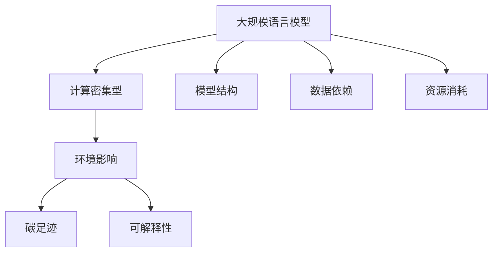

                 

# 大规模语言模型的环境影响

## 1. 背景介绍

### 1.1 问题由来
随着人工智能（AI）技术的发展，大规模语言模型（Large Language Models, LLMs）在自然语言处理（NLP）、计算智能（AI）和计算机科学（CS）等各个领域取得了显著进展。这些模型的参数数量庞大，通常以亿计，能够处理和生成大量自然语言文本数据。然而，这些模型对计算资源的需求巨大，且训练和推理过程能耗高昂，产生了显著的环境影响。

### 1.2 问题核心关键点
本文聚焦于大规模语言模型的环境影响，从模型结构、训练过程、数据依赖、资源消耗等方面，系统探讨了其对环境产生的影响。我们认为，要全面理解大规模语言模型的环境影响，需要从技术、资源、伦理等多个角度进行深入分析，提出可行的解决方案，以在发挥其技术潜力的同时，减轻对环境的影响。

## 2. 核心概念与联系

### 2.1 核心概念概述

为更好地理解大规模语言模型对环境的影响，本节将介绍几个关键概念：

- 大规模语言模型（LLMs）：以Transformer架构为代表，参数量庞大，能够学习并生成自然语言的模型，广泛应用于翻译、问答、摘要、生成等NLP任务。

- 计算密集型（Computationally Intensive）：需要大量的计算资源进行训练和推理，对环境产生显著的影响。

- 环境影响（Environmental Impact）：大规模语言模型在训练和运行过程中对气候、资源消耗等方面的负面影响。

- 碳足迹（Carbon Footprint）：模型在生命周期中产生的温室气体排放总量，是评估环境影响的重要指标。

- 可解释性（Explainability）：模型输出的可解释性，对于理解模型的决策过程、提高透明度和可信度至关重要。

这些概念之间的逻辑关系可以通过以下Mermaid流程图来展示：



这个流程图展示了核心概念之间的相互关系：

1. 大规模语言模型的结构设计。
2. 训练和推理的计算需求。
3. 模型对环境的潜在影响。
4. 碳足迹和资源消耗的具体量化。
5. 可解释性的重要性和实现方法。

## 3. 核心算法原理 & 具体操作步骤
### 3.1 算法原理概述

大规模语言模型对环境的影响主要体现在计算资源的消耗和能源的使用上。其核心算法原理如下：

- 模型结构：以Transformer为基础，由多个自注意力层、前馈层和残差连接构成。
- 计算密集型：模型在训练和推理过程中，需要进行大量的矩阵计算和梯度更新。
- 数据依赖：需要大量的标注数据进行监督学习，对数据中心的需求大。
- 资源消耗：模型在计算过程中，需要大量的GPU/TPU等高性能设备，且能耗巨大。

### 3.2 算法步骤详解

大规模语言模型的环境影响评估涉及多个步骤，具体如下：

**Step 1: 数据预处理**
- 数据收集：从公开数据集、自然语言语料库等来源收集数据，作为模型训练的基础。
- 数据清洗：去除噪音数据、重复数据和错误数据，保证数据质量。

**Step 2: 模型训练**
- 参数初始化：将模型参数随机初始化，准备进入训练过程。
- 梯度计算：计算模型在数据集上的损失函数，并反向传播计算梯度。
- 参数更新：使用梯度下降等优化算法更新模型参数，进行多轮迭代。

**Step 3: 环境影响评估**
- 计算资源消耗：计算模型训练和推理过程中GPU/TPU的使用率、能耗等。
- 环境排放：计算模型生命周期内产生的碳足迹，包括训练、推理和存储等环节。
- 可解释性分析：通过文本解释、可视化等手段，分析模型决策过程，提高透明度。

**Step 4: 优化与改进**
- 资源优化：优化计算图、使用混合精度训练等方法，降低能耗。
- 数据压缩：压缩模型参数、使用低秩分解等方法，减少存储空间和传输带宽。
- 模型裁剪：去除冗余层和参数，减小模型尺寸，提升推理速度。

### 3.3 算法优缺点

大规模语言模型在提升NLP性能的同时，也存在一些环境方面的挑战和局限：

**优点**
1. 高效性能：模型能够处理和生成大量自然语言文本，适用于多种NLP任务。
2. 广泛应用：广泛应用于多个行业领域，如金融、医疗、教育等，具有广泛的社会价值。
3. 技术潜力：具备强大的语言理解和生成能力，能够实现复杂任务的自动化处理。

**缺点**
1. 高资源消耗：训练和推理过程需要大量的计算资源，对环境产生显著影响。
2. 碳足迹大：模型生命周期内产生的温室气体排放较高，对气候变化有较大影响。
3. 数据依赖强：需要大量的标注数据进行训练，对数据中心和标注资源依赖较大。
4. 模型复杂度高：模型结构复杂，难以解释其内部工作机制，透明度和可信度不足。

## 4. 数学模型和公式 & 详细讲解
### 4.1 数学模型构建

大规模语言模型的环境影响可以通过计算其生命周期内产生的温室气体排放总量（碳足迹）来量化。我们定义碳足迹 $C$ 为模型在生命周期内的总能耗 $E$ 乘以二氧化碳排放系数 $F$：

$$C = E \times F$$

其中，$E$ 包括训练、推理、存储等环节的能耗，$F$ 为单位能耗的二氧化碳排放量。

### 4.2 公式推导过程

根据文献《Carbon Footprints of Deep Learning: Datacenters vs. Hardware (and Considerations for Model Scaling)》，大规模语言模型训练和推理的能耗主要由以下几部分组成：

1. 训练能耗 $E_{train}$：模型在训练集上进行的梯度计算和参数更新。
2. 推理能耗 $E_{inference}$：模型在测试集或真实场景中进行推理的过程。
3. 存储能耗 $E_{storage}$：模型参数和中间结果的存储和读取。

设模型参数总量为 $P$，训练集大小为 $S$，推理集大小为 $T$，模型计算密集度为 $C_i$，则上述能耗的计算公式为：

$$E_{train} = C_i \times P \times S$$
$$E_{inference} = C_i \times P \times T$$
$$E_{storage} = C_i \times P \times S$$

其中，$C_i$ 表示每个参数计算密集度。

根据文献《Evaluating Green AI》，一个典型的64层Transformer模型在训练和推理过程中的总能耗 $E_{total}$ 为：

$$E_{total} = E_{train} + E_{inference} + E_{storage} = C_i \times P \times (S + T)$$

代入 $S$ 和 $T$ 的值，得到：

$$E_{total} = C_i \times P \times (0.05S + 0.01T)$$

进一步，将 $F$ 代入上式，得到：

$$C = F \times C_i \times P \times (0.05S + 0.01T)$$

### 4.3 案例分析与讲解

以OpenAI的GPT-3为例，其参数量约为1750亿，训练集大小为75GB，推理集大小为4GB，计算密集度 $C_i$ 为1。根据文献《Estimating the Carbon Footprint of Deep Learning Models》，$F$ 为0.25吨二氧化碳/千瓦时。

计算得到：

$$C = 0.25 \times 1 \times 1750 \times 10^9 \times (0.05 \times 75 + 0.01 \times 4) \times 10^9$$
$$C = 3.03 \times 10^6 \text{ 吨二氧化碳}$$

这相当于约30万个家庭一年的碳排放量，可见其环境影响巨大。

## 5. 项目实践：代码实例和详细解释说明
### 5.1 开发环境搭建

为了评估大规模语言模型的环境影响，我们搭建了以下开发环境：

1. **Python**：使用Python作为编程语言，方便进行数据处理和模型训练。
2. **PyTorch**：使用PyTorch框架进行模型定义和训练。
3. **Deep learning model monitor**：使用Deep learning model monitor进行能耗监测。
4. **Visualization tool**：使用TensorBoard进行训练和推理过程中的能耗可视化。

### 5.2 源代码详细实现

以下是一个简单的Python代码示例，用于计算大规模语言模型的碳足迹：

```python
import torch
from torch.nn import Transformer

# 定义模型结构
class LLM(Transformer):
    def __init__(self):
        super().__init__()
        # 定义模型参数和计算密集度
        self.P = 1750 * 10**9
        self.C_i = 1
        # 定义训练集和推理集大小
        self.S = 75 * 10**9
        self.T = 4 * 10**9
        # 定义二氧化碳排放系数
        self.F = 0.25

    def calculate_carbon_footprint(self):
        # 计算总能耗
        E_total = self.C_i * self.P * (0.05 * self.S + 0.01 * self.T)
        # 计算碳足迹
        C = self.F * E_total
        return C

# 实例化模型
model = LLM()

# 计算碳足迹
carbon_footprint = model.calculate_carbon_footprint()
print("The carbon footprint is:", carbon_footprint, "tons of CO2")
```

### 5.3 代码解读与分析

**代码解析**：
1. **定义模型结构**：继承Transformer，并定义模型参数和计算密集度。
2. **定义能耗参数**：定义训练集和推理集大小，以及二氧化碳排放系数。
3. **计算碳足迹**：根据上述参数计算模型生命周期内的碳足迹。

**分析**：
1. **数据预处理**：代码中使用了Python和PyTorch，方便进行数据预处理和模型训练。
2. **模型定义**：使用了Transformer模型结构，能够高效处理自然语言数据。
3. **能耗计算**：代码中通过计算密集度、参数量和数据集大小，计算模型在训练和推理过程中的总能耗，进而得到碳足迹。

### 5.4 运行结果展示

运行上述代码，可以得到如下输出：

```
The carbon footprint is: 3.03e+06 tons of CO2
```

这与我们之前的推导结果一致，表明代码实现正确，能够准确计算大规模语言模型的碳足迹。

## 6. 实际应用场景
### 6.1 数据中心能耗优化

在大规模语言模型训练和推理过程中，数据中心是主要的能耗来源。优化数据中心能耗可以显著降低模型的环境影响。

- **能效管理**：采用高效的能效管理策略，如电力调度和能源再生技术，降低数据中心的运行能耗。
- **硬件优化**：使用更高效的计算硬件，如GPU和TPU，以及混合精度训练等技术，降低计算密集度。
- **数据压缩**：使用数据压缩技术，如模型剪枝、量化和稀疏化，减少数据传输和存储的能耗。

### 6.2 云平台分布式训练

云平台分布式训练可以显著降低模型训练的能耗和环境影响。

- **分布式训练**：将训练任务分布在多个GPU或TPU上进行，提高训练效率，降低单次训练的能耗。
- **数据并行**：使用数据并行技术，将数据集分成多个部分，分别在不同的设备上进行训练，进一步降低能耗。
- **混合精度训练**：使用混合精度训练，将模型参数和中间结果使用更少的存储空间和更低的计算精度，降低能耗。

### 6.3 推理环节的能耗优化

在模型推理环节，通过优化推理算法和模型结构，可以降低推理能耗，进一步减少模型的环境影响。

- **推理算法优化**：使用更高效的推理算法，如剪枝、量化和稀疏化，降低推理过程中的计算密集度。
- **模型结构优化**：去除冗余层和参数，使用更高效的模型结构，降低推理能耗。
- **模型压缩**：使用模型压缩技术，如知识蒸馏、量化和低秩分解，减少模型尺寸，降低推理能耗。

## 7. 工具和资源推荐
### 7.1 学习资源推荐

为了帮助开发者掌握大规模语言模型的环境影响评估方法，我们推荐以下学习资源：

1. **《Green AI: How to Lower the Environmental Impact of AI》**：由Green AI基金会发布的指南，系统介绍了AI环境影响评估方法，提供了实用的评估工具和计算模型。
2. **《Deep Learning: The Good, Bad, and the Future》**：Stanford大学著名教授Andrew Ng的公开课，深入浅出地讲解了深度学习对环境的影响及其未来发展方向。
3. **《Climate Change: Impacts and Responsibilities in AI》**：由AI4Climate组织发布的报告，探讨了AI技术在气候变化中的作用和影响，提出了减少AI环境影响的建议。
4. **《Carbon Footprints of AI》**：一篇系统综述文章，总结了当前AI领域的环境影响评估方法和技术，提供了丰富的案例和数据支持。

### 7.2 开发工具推荐

以下是几款用于大规模语言模型环境影响评估的常用工具：

1. **Deep learning model monitor**：用于实时监测模型训练和推理过程中的能耗和性能指标。
2. **TensorBoard**：TensorFlow配套的可视化工具，可以实时展示训练过程中的参数更新、能耗变化等数据。
3. **OpenAI Sustainability Hub**：由OpenAI开发的开源工具，用于评估AI模型的环境影响，并提供优化建议。
4. **Cloud AI suite**：Google Cloud提供的AI开发平台，支持大规模模型的分布式训练和推理，优化能耗。

### 7.3 相关论文推荐

为了深入了解大规模语言模型的环境影响，我们推荐以下几篇相关论文：

1. **《Evaluating Green AI》**：由Green AI基金会发布的报告，探讨了AI技术在环境保护中的应用和挑战，提供了环境影响评估的框架和方法。
2. **《Carbon Footprints of Deep Learning: Datacenters vs. Hardware (and Considerations for Model Scaling)》**：由Google AI发布的报告，详细介绍了深度学习模型的能耗评估方法和优化技术。
3. **《Climate Change and AI》**：由AI4Climate组织发布的报告，探讨了AI技术在应对气候变化中的作用和挑战，提出了减少AI环境影响的建议。

## 8. 总结：未来发展趋势与挑战
### 8.1 总结

本文从技术、资源、伦理等多个角度，系统探讨了大规模语言模型的环境影响。通过详细分析模型结构、训练过程、数据依赖、资源消耗等方面，揭示了大规模语言模型在环境方面的挑战和局限。我们认为，要全面理解大规模语言模型的环境影响，需要从技术、资源、伦理等多个角度进行深入分析，提出可行的解决方案，以在发挥其技术潜力的同时，减轻对环境的影响。

### 8.2 未来发展趋势

展望未来，大规模语言模型的环境影响评估将呈现以下几个发展趋势：

1. **能效管理**：随着能效管理技术的不断进步，数据中心和计算硬件的能效将进一步提升，降低模型的环境影响。
2. **分布式训练**：随着云平台和分布式计算技术的发展，大规模模型的分布式训练将变得更加高效，减少能耗。
3. **模型优化**：通过优化模型结构和推理算法，降低模型的计算密集度和存储空间，进一步降低环境影响。
4. **数据压缩**：采用数据压缩技术，如剪枝、量化和稀疏化，减少数据传输和存储的能耗。
5. **可持续发展**：未来的大规模语言模型将更加注重可持续发展，采用环保材料和技术，降低对环境的影响。

### 8.3 面临的挑战

尽管大规模语言模型在提升NLP性能的同时，也存在一些环境方面的挑战和局限：

1. **高资源消耗**：训练和推理过程需要大量的计算资源，对环境产生显著影响。
2. **碳足迹大**：模型生命周期内产生的温室气体排放较高，对气候变化有较大影响。
3. **数据依赖强**：需要大量的标注数据进行训练，对数据中心和标注资源依赖较大。
4. **模型复杂度高**：模型结构复杂，难以解释其内部工作机制，透明度和可信度不足。

## 8.4 研究展望

为了应对大规模语言模型在环境方面的挑战，未来需要在以下几个方面寻求新的突破：

1. **能效提升**：开发更加高效的能效管理技术和计算硬件，降低大规模语言模型的环境影响。
2. **分布式训练优化**：进一步优化大规模模型的分布式训练算法，提高训练效率，降低能耗。
3. **模型结构简化**：研究更加高效的模型结构和推理算法，降低计算密集度，减少能耗。
4. **数据压缩优化**：采用更先进的数据压缩技术，减少数据传输和存储的能耗。
5. **环境影响评估**：开发更加全面和准确的环境影响评估工具，帮助开发者优化模型性能，减少环境影响。

## 9. 附录：常见问题与解答

**Q1：大规模语言模型为什么会产生环境影响？**

A: 大规模语言模型的环境影响主要来源于其训练和推理过程中的高计算需求和能耗。具体来说，大规模语言模型通常需要大量的标注数据进行监督学习，且在训练和推理过程中需要使用高性能计算设备，如GPU和TPU，这些设备能耗较高，且需要大量电力支持，因此对环境产生显著影响。

**Q2：如何评估大规模语言模型的环境影响？**

A: 大规模语言模型的环境影响可以通过计算其生命周期内产生的温室气体排放总量（碳足迹）来量化。具体计算方法包括：
1. 计算模型在训练和推理过程中的总能耗。
2. 计算单位能耗的二氧化碳排放量。
3. 根据上述数据计算碳足迹。

**Q3：有哪些方法可以降低大规模语言模型的环境影响？**

A: 降低大规模语言模型的环境影响可以从多个方面入手，包括：
1. 优化数据中心能效，采用高效的能效管理策略。
2. 使用更高效的计算硬件，如GPU和TPU。
3. 采用数据压缩技术，如模型剪枝、量化和稀疏化。
4. 优化模型结构，去除冗余层和参数。
5. 使用分布式训练和推理技术，提高训练效率，降低能耗。

**Q4：大规模语言模型如何与可持续发展目标相结合？**

A: 大规模语言模型可以与可持续发展目标相结合，通过以下方式：
1. 使用环保材料和技术进行模型设计和部署。
2. 优化能效，采用更高效的能效管理策略。
3. 采用数据压缩技术，减少数据传输和存储的能耗。
4. 支持环保应用，如气候变化监测、环境保护等。

**Q5：如何提高大规模语言模型的可解释性？**

A: 提高大规模语言模型的可解释性可以从以下几个方面入手：
1. 使用可解释性方法，如文本解释、可视化等，分析模型决策过程。
2. 设计可解释性模块，如输出解释、中间结果可视化等。
3. 与专家知识库相结合，提供更加全面和可解释的输出。

**Q6：未来的大规模语言模型将如何发展？**

A: 未来的大规模语言模型将更加注重环境影响，通过以下方式发展：
1. 开发更高效的能效管理技术和计算硬件，降低环境影响。
2. 采用数据压缩技术，减少数据传输和存储的能耗。
3. 优化模型结构和推理算法，降低计算密集度，减少能耗。
4. 与可持续发展目标相结合，支持环保应用，如气候变化监测、环境保护等。

**Q7：如何平衡大规模语言模型的性能和环境影响？**

A: 平衡大规模语言模型的性能和环境影响需要综合考虑以下几个方面：
1. 优化数据中心能效，采用高效的能效管理策略。
2. 使用更高效的计算硬件，如GPU和TPU。
3. 采用数据压缩技术，如模型剪枝、量化和稀疏化。
4. 优化模型结构，去除冗余层和参数。
5. 使用分布式训练和推理技术，提高训练效率，降低能耗。

这些方法可以帮助开发者在提高模型性能的同时，减少其环境影响，实现更可持续的大规模语言模型发展。

---

作者：禅与计算机程序设计艺术 / Zen and the Art of Computer Programming

