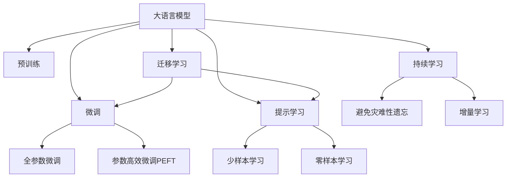

                 

# 大语言模型原理与工程实践：思维链提示

> 关键词：大语言模型,提示学习,思维链,自适应提示,鲁棒性提升,模型效果增强

## 1. 背景介绍

### 1.1 问题由来

随着深度学习技术的快速发展，大语言模型（Large Language Models, LLMs）在自然语言处理（Natural Language Processing, NLP）领域取得了显著的突破。这些模型通过在大规模无标签文本数据上进行预训练，学习到了丰富的语言知识和常识，能够执行复杂的语言理解和生成任务。然而，尽管大语言模型在预训练过程中学习了丰富的语言知识，但其对特定任务的表现仍然依赖于有标签数据集，这对标注数据的获取和质量提出了较高的要求。

提示学习（Prompt Learning）作为一种新兴的NLP技术，能够在不更新模型参数的情况下，通过精心设计的提示（Prompt）模板引导大语言模型进行特定任务的推理和生成，从而在微调（Fine-Tuning）过程中减少模型对标注数据的依赖，提高模型效果。提示学习不仅可以在少样本（Few-shot）甚至零样本（Zero-shot）情况下提升模型性能，还能够通过动态调整提示，增强模型在不同任务上的鲁棒性和适应性。

### 1.2 问题核心关键点

提示学习在大语言模型微调中扮演着关键角色，其核心关键点包括：

- **提示设计**：提示模板的设计直接影响模型输出质量和任务完成度。
- **动态调整**：根据模型输出和任务特点，动态调整提示，提高模型适应性。
- **零样本/少样本学习**：在缺少标注数据的情况下，通过提示学习实现高性能推理和生成。
- **鲁棒性提升**：通过提示学习增强模型对不同输入的鲁棒性，减少过拟合。
- **模型效果增强**：提示学习可以在不增加模型复杂度的情况下，显著提升模型效果。

本文将详细介绍提示学习在大语言模型微调中的原理、操作步骤和实际应用，并通过代码实例和案例分析帮助读者深入理解。

## 2. 核心概念与联系

### 2.1 核心概念概述

为更好地理解提示学习在大语言模型微调中的作用，本节将介绍几个关键概念：

- **大语言模型**：以自回归（如GPT）或自编码（如BERT）模型为代表的大规模预训练语言模型。通过在大规模无标签文本语料上进行预训练，学习到丰富的语言知识和常识，具备强大的语言理解和生成能力。
- **预训练**：指在大规模无标签文本语料上，通过自监督学习任务训练通用语言模型的过程。常见的预训练任务包括言语建模、遮挡语言模型等，使得模型学习到语言的通用表示。
- **微调**：指在预训练模型的基础上，使用下游任务的少量标注数据，通过有监督学习优化模型在特定任务上的性能。通常只需要调整顶层分类器或解码器，并以较小的学习率更新全部或部分的模型参数。
- **提示学习**：通过在输入文本中添加提示模板（Prompt Template），引导大语言模型进行特定任务的推理和生成。可以在不更新模型参数的情况下，实现少样本或零样本学习。
- **少样本学习**：指在只有少量标注样本的情况下，模型能够快速适应新任务的学习方法。在大语言模型中，通常通过在输入中提供少量示例来实现，无需更新模型参数。
- **零样本学习**：指模型在没有见过任何特定任务的训练样本的情况下，仅凭任务描述就能够执行新任务的能力。大语言模型通过预训练获得的广泛知识，使其能够理解任务指令并生成相应输出。

这些概念之间的逻辑关系可以通过以下Mermaid流程图来展示：



这个流程图展示了提示学习在大语言模型中的核心位置，以及其与其他概念之间的联系。

## 3. 核心算法原理 & 具体操作步骤

### 3.1 算法原理概述

提示学习的基本思想是通过在输入文本中添加提示（Prompt）模板，引导大语言模型进行特定任务的推理和生成。提示模板通常包含任务的具体要求和示例，模型通过阅读提示内容，能够更准确地理解任务要求，生成高质量的输出。提示学习的目标是通过精心设计的提示，使得模型能够在少样本或零样本的情况下，获得高性能的推理和生成结果。

形式化地，假设预训练语言模型为 $M_{\theta}$，其中 $\theta$ 为预训练得到的模型参数。给定下游任务 $T$ 的少量标注数据集 $D=\{(x_i, y_i)\}_{i=1}^N$，其中 $x_i$ 为输入文本，$y_i$ 为对应的输出标签。提示学习的目标是找到最优的提示模板 $\mathcal{P}$，使得模型 $M_{\theta}$ 能够准确地生成正确的输出 $y$，即：

$$
y = \mathop{\arg\min}_{y} \mathcal{L}(M_{\theta}, \mathcal{P}, y)
$$

其中 $\mathcal{L}$ 为针对任务 $T$ 设计的损失函数，用于衡量模型生成输出 $y$ 与真实标签 $y_i$ 之间的差异。常见的损失函数包括交叉熵损失、均方误差损失等。

### 3.2 算法步骤详解

基于提示学习的微调过程一般包括以下几个关键步骤：

**Step 1: 准备预训练模型和数据集**

- 选择合适的预训练语言模型 $M_{\theta}$ 作为初始化参数，如 BERT、GPT 等。
- 准备下游任务 $T$ 的少量标注数据集 $D$，划分为训练集、验证集和测试集。一般要求标注数据与预训练数据的分布不要差异过大。

**Step 2: 设计提示模板**

- 根据任务类型，设计合适的提示模板 $\mathcal{P}$。提示模板应包括任务的具体要求、示例和语言提示，以引导模型生成正确的输出。
- 提示模板的设计需要考虑任务特点、语言风格和模型偏好，以提高模型的理解和生成效果。

**Step 3: 训练提示模型**

- 将训练集数据分批次输入模型，前向传播计算损失函数。
- 反向传播计算参数梯度，根据设定的优化算法和学习率更新模型参数。
- 周期性在验证集上评估模型性能，根据性能指标决定是否触发 Early Stopping。
- 重复上述步骤直到满足预设的迭代轮数或 Early Stopping 条件。

**Step 4: 测试和部署**

- 在测试集上评估提示后模型 $M_{\hat{\theta}}$ 的性能，对比提示前后的精度提升。
- 使用提示后模型对新样本进行推理预测，集成到实际的应用系统中。
- 持续收集新的数据，定期重新训练提示模型，以适应数据分布的变化。

以上是基于提示学习的微调范式的一般流程。在实际应用中，还需要针对具体任务的特点，对提示设计、提示更新、训练策略等环节进行优化设计，以进一步提升模型性能。

### 3.3 算法优缺点

基于提示学习的微调方法具有以下优点：

1. **参数高效**：提示学习可以通过调整提示模板，在不更新模型参数的情况下，提高模型性能，避免了传统微调方法中可能出现的过拟合问题。
2. **适应性强**：提示学习能够适应多种任务和数据分布，只需根据任务特点设计合适的提示模板，即可实现高性能推理和生成。
3. **可解释性好**：提示模板提供了模型输出的明确指导，使得模型推理过程透明可解释，便于调试和理解。
4. **鲁棒性好**：提示学习通过动态调整提示模板，可以增强模型对不同输入的鲁棒性，减少过拟合风险。
5. **灵活性强**：提示学习可以在不增加模型复杂度的情况下，通过调整提示模板，实现零样本或少样本学习，灵活性强。

同时，该方法也存在一定的局限性：

1. **提示设计困难**：提示模板的设计需要丰富的领域知识和经验，设计不当可能导致模型性能下降。
2. **模型泛化能力有限**：提示学习依赖于提示模板的设计，对于提示模板未能覆盖的情况，模型性能可能受到影响。
3. **提示模板长度限制**：过长或过短的提示模板可能影响模型性能，需要根据任务特点进行设计。
4. **计算资源消耗大**：提示学习通常需要大量计算资源进行模型训练，提示模板的设计和更新也需耗费较多时间和人力。

尽管存在这些局限性，但提示学习在大语言模型微调中已展现出显著的优势，成为一种高效的微调范式。未来相关研究的重点在于如何进一步提高提示模板的鲁棒性和适应性，降低设计难度，提升提示学习的性能和效率。

### 3.4 算法应用领域

基于提示学习的微调方法在NLP领域已经得到了广泛的应用，覆盖了几乎所有常见任务，例如：

- 文本分类：如情感分析、主题分类、意图识别等。通过设计合适的提示模板，引导模型学习文本-标签映射。
- 命名实体识别：识别文本中的人名、地名、机构名等特定实体。通过提示模板设计，引导模型学习实体边界和类型。
- 关系抽取：从文本中抽取实体之间的语义关系。通过提示模板设计，引导模型学习实体-关系三元组。
- 问答系统：对自然语言问题给出答案。将问题-答案对作为提示模板，训练模型学习匹配答案。
- 机器翻译：将源语言文本翻译成目标语言。通过提示模板设计，引导模型学习语言-语言映射。
- 文本摘要：将长文本压缩成简短摘要。通过提示模板设计，引导模型学习抓取要点。
- 对话系统：使机器能够与人自然对话。通过多轮对话历史作为上下文，微调模型进行回复生成。

除了上述这些经典任务外，提示学习也被创新性地应用到更多场景中，如可控文本生成、常识推理、代码生成、数据增强等，为NLP技术带来了全新的突破。随着提示学习技术的不断进步，相信NLP技术将在更广阔的应用领域大放异彩。

## 4. 数学模型和公式 & 详细讲解 & 举例说明

### 4.1 数学模型构建

本节将使用数学语言对基于提示学习的微调过程进行更加严格的刻画。

记预训练语言模型为 $M_{\theta}$，其中 $\theta$ 为模型参数。假设提示学习任务为 $T$，其训练集为 $D=\{(\mathcal{P}_i, y_i)\}_{i=1}^N$，其中 $\mathcal{P}_i$ 为提示模板，$y_i$ 为对应的输出标签。

定义模型 $M_{\theta}$ 在提示模板 $\mathcal{P}$ 上的损失函数为 $\ell(M_{\theta}, \mathcal{P}, y)$，则在数据集 $D$ 上的经验风险为：

$$
\mathcal{L}(\theta) = \frac{1}{N} \sum_{i=1}^N \ell(M_{\theta}(\mathcal{P}_i), y_i)
$$

提示学习的优化目标是最小化经验风险，即找到最优参数：

$$
\theta^* = \mathop{\arg\min}_{\theta} \mathcal{L}(\theta)
$$

在实践中，我们通常使用基于梯度的优化算法（如SGD、Adam等）来近似求解上述最优化问题。设 $\eta$ 为学习率，$\lambda$ 为正则化系数，则参数的更新公式为：

$$
\theta \leftarrow \theta - \eta \nabla_{\theta}\mathcal{L}(\theta) - \eta\lambda\theta
$$

其中 $\nabla_{\theta}\mathcal{L}(\theta)$ 为损失函数对参数 $\theta$ 的梯度，可通过反向传播算法高效计算。

### 4.2 公式推导过程

以下我们以二分类任务为例，推导交叉熵损失函数及其梯度的计算公式。

假设模型 $M_{\theta}$ 在提示模板 $\mathcal{P}$ 上的输出为 $\hat{y}=M_{\theta}(\mathcal{P}) \in [0,1]$，表示模型对提示模板的分类概率。真实标签 $y \in \{0,1\}$。则二分类交叉熵损失函数定义为：

$$
\ell(M_{\theta}(\mathcal{P}), y) = -[y\log \hat{y} + (1-y)\log (1-\hat{y})]
$$

将其代入经验风险公式，得：

$$
\mathcal{L}(\theta) = -\frac{1}{N}\sum_{i=1}^N [y_i\log M_{\theta}(\mathcal{P}_i)+(1-y_i)\log(1-M_{\theta}(\mathcal{P}_i))]
$$

根据链式法则，损失函数对参数 $\theta_k$ 的梯度为：

$$
\frac{\partial \mathcal{L}(\theta)}{\partial \theta_k} = -\frac{1}{N}\sum_{i=1}^N (\frac{y_i}{M_{\theta}(\mathcal{P}_i)}-\frac{1-y_i}{1-M_{\theta}(\mathcal{P}_i)}) \frac{\partial M_{\theta}(\mathcal{P}_i)}{\partial \theta_k}
$$

其中 $\frac{\partial M_{\theta}(\mathcal{P}_i)}{\partial \theta_k}$ 可进一步递归展开，利用自动微分技术完成计算。

在得到损失函数的梯度后，即可带入参数更新公式，完成模型的迭代优化。重复上述过程直至收敛，最终得到适应下游任务的最优模型参数 $\theta^*$。

## 5. 项目实践：代码实例和详细解释说明

### 5.1 开发环境搭建

在进行提示学习实践前，我们需要准备好开发环境。以下是使用Python进行PyTorch开发的环境配置流程：

1. 安装Anaconda：从官网下载并安装Anaconda，用于创建独立的Python环境。

2. 创建并激活虚拟环境：
```bash
conda create -n pytorch-env python=3.8 
conda activate pytorch-env
```

3. 安装PyTorch：根据CUDA版本，从官网获取对应的安装命令。例如：
```bash
conda install pytorch torchvision torchaudio cudatoolkit=11.1 -c pytorch -c conda-forge
```

4. 安装Transformers库：
```bash
pip install transformers
```

5. 安装各类工具包：
```bash
pip install numpy pandas scikit-learn matplotlib tqdm jupyter notebook ipython
```

完成上述步骤后，即可在`pytorch-env`环境中开始提示学习实践。

### 5.2 源代码详细实现

下面我以命名实体识别（NER）任务为例，给出使用Transformers库对BERT模型进行提示学习的PyTorch代码实现。

首先，定义NER任务的数据处理函数：

```python
from transformers import BertTokenizer
from torch.utils.data import Dataset
import torch

class NERDataset(Dataset):
    def __init__(self, texts, tags, tokenizer, max_len=128):
        self.texts = texts
        self.tags = tags
        self.tokenizer = tokenizer
        self.max_len = max_len
        
    def __len__(self):
        return len(self.texts)
    
    def __getitem__(self, item):
        text = self.texts[item]
        tags = self.tags[item]
        
        encoding = self.tokenizer(text, return_tensors='pt', max_length=self.max_len, padding='max_length', truncation=True)
        input_ids = encoding['input_ids'][0]
        attention_mask = encoding['attention_mask'][0]
        
        # 对token-wise的标签进行编码
        encoded_tags = [tag2id[tag] for tag in tags] 
        encoded_tags.extend([tag2id['O']] * (self.max_len - len(encoded_tags)))
        labels = torch.tensor(encoded_tags, dtype=torch.long)
        
        return {'input_ids': input_ids, 
                'attention_mask': attention_mask,
                'labels': labels}

# 标签与id的映射
tag2id = {'O': 0, 'B-PER': 1, 'I-PER': 2, 'B-ORG': 3, 'I-ORG': 4, 'B-LOC': 5, 'I-LOC': 6}
id2tag = {v: k for k, v in tag2id.items()}

# 创建dataset
tokenizer = BertTokenizer.from_pretrained('bert-base-cased')

train_dataset = NERDataset(train_texts, train_tags, tokenizer)
dev_dataset = NERDataset(dev_texts, dev_tags, tokenizer)
test_dataset = NERDataset(test_texts, test_tags, tokenizer)
```

然后，定义模型和优化器：

```python
from transformers import BertForTokenClassification, AdamW

model = BertForTokenClassification.from_pretrained('bert-base-cased', num_labels=len(tag2id))

optimizer = AdamW(model.parameters(), lr=2e-5)
```

接着，定义训练和评估函数：

```python
from torch.utils.data import DataLoader
from tqdm import tqdm
from sklearn.metrics import classification_report

device = torch.device('cuda') if torch.cuda.is_available() else torch.device('cpu')
model.to(device)

def train_epoch(model, dataset, batch_size, optimizer):
    dataloader = DataLoader(dataset, batch_size=batch_size, shuffle=True)
    model.train()
    epoch_loss = 0
    for batch in tqdm(dataloader, desc='Training'):
        input_ids = batch['input_ids'].to(device)
        attention_mask = batch['attention_mask'].to(device)
        labels = batch['labels'].to(device)
        model.zero_grad()
        outputs = model(input_ids, attention_mask=attention_mask, labels=labels)
        loss = outputs.loss
        epoch_loss += loss.item()
        loss.backward()
        optimizer.step()
    return epoch_loss / len(dataloader)

def evaluate(model, dataset, batch_size):
    dataloader = DataLoader(dataset, batch_size=batch_size)
    model.eval()
    preds, labels = [], []
    with torch.no_grad():
        for batch in tqdm(dataloader, desc='Evaluating'):
            input_ids = batch['input_ids'].to(device)
            attention_mask = batch['attention_mask'].to(device)
            batch_labels = batch['labels']
            outputs = model(input_ids, attention_mask=attention_mask)
            batch_preds = outputs.logits.argmax(dim=2).to('cpu').tolist()
            batch_labels = batch_labels.to('cpu').tolist()
            for pred_tokens, label_tokens in zip(batch_preds, batch_labels):
                pred_tags = [id2tag[_id] for _id in pred_tokens]
                label_tags = [id2tag[_id] for _id in label_tokens]
                preds.append(pred_tags[:len(label_tags)])
                labels.append(label_tags)
                
    print(classification_report(labels, preds))
```

最后，启动训练流程并在测试集上评估：

```python
epochs = 5
batch_size = 16

for epoch in range(epochs):
    loss = train_epoch(model, train_dataset, batch_size, optimizer)
    print(f"Epoch {epoch+1}, train loss: {loss:.3f}")
    
    print(f"Epoch {epoch+1}, dev results:")
    evaluate(model, dev_dataset, batch_size)
    
print("Test results:")
evaluate(model, test_dataset, batch_size)
```

以上就是使用PyTorch对BERT进行命名实体识别任务提示学习的完整代码实现。可以看到，得益于Transformers库的强大封装，我们可以用相对简洁的代码完成BERT模型的加载和提示学习。

### 5.3 代码解读与分析

让我们再详细解读一下关键代码的实现细节：

**NERDataset类**：
- `__init__`方法：初始化文本、标签、分词器等关键组件。
- `__len__`方法：返回数据集的样本数量。
- `__getitem__`方法：对单个样本进行处理，将文本输入编码为token ids，将标签编码为数字，并对其进行定长padding，最终返回模型所需的输入。

**tag2id和id2tag字典**：
- 定义了标签与数字id之间的映射关系，用于将token-wise的预测结果解码回真实的标签。

**训练和评估函数**：
- 使用PyTorch的DataLoader对数据集进行批次化加载，供模型训练和推理使用。
- 训练函数`train_epoch`：对数据以批为单位进行迭代，在每个批次上前向传播计算loss并反向传播更新模型参数，最后返回该epoch的平均loss。
- 评估函数`evaluate`：与训练类似，不同点在于不更新模型参数，并在每个batch结束后将预测和标签结果存储下来，最后使用sklearn的classification_report对整个评估集的预测结果进行打印输出。

**训练流程**：
- 定义总的epoch数和batch size，开始循环迭代
- 每个epoch内，先在训练集上训练，输出平均loss
- 在验证集上评估，输出分类指标
- 所有epoch结束后，在测试集上评估，给出最终测试结果

可以看到，PyTorch配合Transformers库使得BERT提示学习的代码实现变得简洁高效。开发者可以将更多精力放在数据处理、模型改进等高层逻辑上，而不必过多关注底层的实现细节。

当然，工业级的系统实现还需考虑更多因素，如模型的保存和部署、超参数的自动搜索、更灵活的任务适配层等。但核心的提示学习范式基本与此类似。

## 6. 实际应用场景

### 6.1 智能客服系统

基于提示学习的大语言模型对话技术，可以广泛应用于智能客服系统的构建。传统客服往往需要配备大量人力，高峰期响应缓慢，且一致性和专业性难以保证。而使用提示学习的大语言模型，可以7x24小时不间断服务，快速响应客户咨询，用自然流畅的语言解答各类常见问题。

在技术实现上，可以收集企业内部的历史客服对话记录，将问题和最佳答复构建成监督数据，在此基础上对预训练对话模型进行提示学习。提示学习后的对话模型能够自动理解用户意图，匹配最合适的答案模板进行回复。对于客户提出的新问题，还可以接入检索系统实时搜索相关内容，动态组织生成回答。如此构建的智能客服系统，能大幅提升客户咨询体验和问题解决效率。

### 6.2 金融舆情监测

金融机构需要实时监测市场舆论动向，以便及时应对负面信息传播，规避金融风险。传统的人工监测方式成本高、效率低，难以应对网络时代海量信息爆发的挑战。基于提示学习的大语言模型文本分类和情感分析技术，为金融舆情监测提供了新的解决方案。

具体而言，可以收集金融领域相关的新闻、报道、评论等文本数据，并对其进行主题标注和情感标注。在此基础上对预训练语言模型进行提示学习，使其能够自动判断文本属于何种主题，情感倾向是正面、中性还是负面。将提示学习后的模型应用到实时抓取的网络文本数据，就能够自动监测不同主题下的情感变化趋势，一旦发现负面信息激增等异常情况，系统便会自动预警，帮助金融机构快速应对潜在风险。

### 6.3 个性化推荐系统

当前的推荐系统往往只依赖用户的历史行为数据进行物品推荐，无法深入理解用户的真实兴趣偏好。基于提示学习的大语言模型个性化推荐系统可以更好地挖掘用户行为背后的语义信息，从而提供更精准、多样的推荐内容。

在实践中，可以收集用户浏览、点击、评论、分享等行为数据，提取和用户交互的物品标题、描述、标签等文本内容。将文本内容作为模型输入，用户的后续行为（如是否点击、购买等）作为监督信号，在此基础上微调预训练语言模型。提示学习后的模型能够从文本内容中准确把握用户的兴趣点。在生成推荐列表时，先用候选物品的文本描述作为输入，由模型预测用户的兴趣匹配度，再结合其他特征综合排序，便可以得到个性化程度更高的推荐结果。

### 6.4 未来应用展望

随着提示学习技术的不断发展，基于提示学习的微调方法将呈现以下几个发展趋势：

1. **自适应提示设计**：基于模型输出动态调整提示模板，提高模型的适应性和鲁棒性。
2. **多模态提示学习**：结合图像、视频、语音等多模态信息，增强语言模型的语义理解能力。
3. **跨领域迁移能力**：通过提示学习实现跨领域的知识迁移，提升模型在多个任务上的性能。
4. **知识图谱融合**：将知识图谱中的结构化知识与自然语言信息结合，增强语言模型的推理能力。
5. **低资源环境应用**：在计算资源有限的设备上，实现高效的提示学习。
6. **交互式提示学习**：通过与用户交互获取更多信息，引导模型生成更符合用户需求的回答。

以上趋势凸显了大语言模型提示学习的广阔前景。这些方向的探索发展，必将进一步提升语言模型的性能和应用范围，为构建智能、高效、灵活的语言处理系统铺平道路。相信随着技术的日益成熟，提示学习将成为NLP技术的重要范式，推动人工智能技术在更广泛的领域落地应用。

## 7. 工具和资源推荐

### 7.1 学习资源推荐

为了帮助开发者系统掌握提示学习的大语言模型微调技术，这里推荐一些优质的学习资源：

1. 《Transformers from Scratch》系列博文：由大模型技术专家撰写，深入浅出地介绍了Transformer原理、提示学习、自适应提示等前沿话题。

2. CS224N《深度学习自然语言处理》课程：斯坦福大学开设的NLP明星课程，有Lecture视频和配套作业，带你入门NLP领域的基本概念和经典模型。

3. 《Natural Language Processing with Transformers》书籍：Transformers库的作者所著，全面介绍了如何使用Transformers库进行NLP任务开发，包括提示学习的在内诸多范式。

4. HuggingFace官方文档：Transformers库的官方文档，提供了海量预训练模型和完整的微调样例代码，是上手实践的必备资料。

5. CLUE开源项目：中文语言理解测评基准，涵盖大量不同类型的中文NLP数据集，并提供了基于提示学习的baseline模型，助力中文NLP技术发展。

通过对这些资源的学习实践，相信你一定能够快速掌握提示学习的大语言模型微调技术，并用于解决实际的NLP问题。
###  7.2 开发工具推荐

高效的开发离不开优秀的工具支持。以下是几款用于大语言模型提示学习开发的常用工具：

1. PyTorch：基于Python的开源深度学习框架，灵活动态的计算图，适合快速迭代研究。大部分预训练语言模型都有PyTorch版本的实现。

2. TensorFlow：由Google主导开发的开源深度学习框架，生产部署方便，适合大规模工程应用。同样有丰富的预训练语言模型资源。

3. Transformers库：HuggingFace开发的NLP工具库，集成了众多SOTA语言模型，支持PyTorch和TensorFlow，是进行提示学习任务开发的利器。

4. Weights & Biases：模型训练的实验跟踪工具，可以记录和可视化模型训练过程中的各项指标，方便对比和调优。与主流深度学习框架无缝集成。

5. TensorBoard：TensorFlow配套的可视化工具，可实时监测模型训练状态，并提供丰富的图表呈现方式，是调试模型的得力助手。

6. Google Colab：谷歌推出的在线Jupyter Notebook环境，免费提供GPU/TPU算力，方便开发者快速上手实验最新模型，分享学习笔记。

合理利用这些工具，可以显著提升大语言模型提示学习的开发效率，加快创新迭代的步伐。

### 7.3 相关论文推荐

大语言模型和提示学习的发展源于学界的持续研究。以下是几篇奠基性的相关论文，推荐阅读：

1. Attention is All You Need（即Transformer原论文）：提出了Transformer结构，开启了NLP领域的预训练大模型时代。

2. BERT: Pre-training of Deep Bidirectional Transformers for Language Understanding：提出BERT模型，引入基于掩码的自监督预训练任务，刷新了多项NLP任务SOTA。

3. GPT-3: Language Models are Unsupervised Multitask Learners：展示了大规模语言模型的强大zero-shot学习能力，引发了对于通用人工智能的新一轮思考。

4. Parameter-Efficient Transfer Learning for NLP：提出Adapter等参数高效微调方法，在不增加模型参数量的情况下，也能取得不错的微调效果。

5. Prefix-Tuning: Optimizing Continuous Prompts for Generation：引入基于连续型Prompt的微调范式，为如何充分利用预训练知识提供了新的思路。

6. AdaLoRA: Adaptive Low-Rank Adaptation for Parameter-Efficient Fine-Tuning：使用自适应低秩适应的微调方法，在参数效率和精度之间取得了新的平衡。

这些论文代表了大语言模型提示学习的发展脉络。通过学习这些前沿成果，可以帮助研究者把握学科前进方向，激发更多的创新灵感。

## 8. 总结：未来发展趋势与挑战

### 8.1 总结

本文对基于提示学习的大语言模型微调方法进行了全面系统的介绍。首先阐述了大语言模型和提示学习的背景和意义，明确了提示学习在拓展预训练模型应用、提升下游任务性能方面的独特价值。其次，从原理到实践，详细讲解了提示学习的数学原理和关键步骤，给出了提示学习任务开发的完整代码实例。同时，本文还广泛探讨了提示学习在大语言模型微调中的实际应用场景，展示了提示学习范式的巨大潜力。最后，本文精选了提示学习的各类学习资源，力求为读者提供全方位的技术指引。

通过本文的系统梳理，可以看到，基于提示学习的大语言模型微调方法正在成为NLP领域的重要范式，极大地拓展了预训练语言模型的应用边界，催生了更多的落地场景。受益于大规模语料的预训练和提示学习的灵活设计，微调模型可以在更少的标注样本下获得高性能的推理和生成结果，灵活性强、适应性好，值得在实际应用中广泛推广。

### 8.2 未来发展趋势

展望未来，基于提示学习的大语言模型微调技术将呈现以下几个发展趋势：

1. **自适应提示设计**：基于模型输出动态调整提示模板，提高模型的适应性和鲁棒性。
2. **多模态提示学习**：结合图像、视频、语音等多模态信息，增强语言模型的语义理解能力。
3. **跨领域迁移能力**：通过提示学习实现跨领域的知识迁移，提升模型在多个任务上的性能。
4. **知识图谱融合**：将知识图谱中的结构化知识与自然语言信息结合，增强语言模型的推理能力。
5. **低资源环境应用**：在计算资源有限的设备上，实现高效的提示学习。
6. **交互式提示学习**：通过与用户交互获取更多信息，引导模型生成更符合用户需求的回答。

以上趋势凸显了大语言模型提示学习的广阔前景。这些方向的探索发展，必将进一步提升语言模型的性能和应用范围，为构建智能、高效、灵活的语言处理系统铺平道路。

### 8.3 面临的挑战

尽管大语言模型提示学习已经取得了瞩目成就，但在迈向更加智能化、普适化应用的过程中，它仍面临着诸多挑战：

1. **提示模板设计难度**：提示模板的设计需要丰富的领域知识和经验，设计不当可能导致模型性能下降。
2. **模型泛化能力有限**：提示学习依赖于提示模板的设计，对于提示模板未能覆盖的情况，模型性能可能受到影响。
3. **提示模板长度限制**：过长或过短的提示模板可能影响模型性能，需要根据任务特点进行设计。
4. **计算资源消耗大**：提示学习通常需要大量计算资源进行模型训练，提示模板的设计和更新也需耗费较多时间和人力。
5. **可解释性不足**：提示学习的黑盒特性可能导致模型推理过程难以解释，缺乏透明度。
6. **安全性问题**：提示学习模型可能学习到有偏见、有害的信息，通过模型输出导致负面影响。

尽管存在这些挑战，但提示学习在大语言模型微调中已展现出显著的优势，成为一种高效的微调范式。未来相关研究的重点在于如何进一步提高提示模板的鲁棒性和适应性，降低设计难度，提升提示学习的性能和效率。

### 8.4 研究展望

面对大语言模型提示学习所面临的挑战，未来的研究需要在以下几个方面寻求新的突破：

1. **自动化提示设计**：开发能够自动生成提示模板的算法，减少提示设计的人力和时间成本。
2. **跨任务提示学习**：研究如何将提示模板应用于多种任务，提升模型的通用性和迁移能力。
3. **多任务学习**：结合多任务学习框架，提高模型的泛化能力和任务适应性。
4. **分布式训练**：利用分布式训练技术，加速提示学习模型的训练过程。
5. **模型压缩与优化**：研究如何通过模型压缩和优化，提高提示学习模型的推理效率和资源利用率。
6. **可解释性增强**：通过可解释性技术，提高提示学习模型的透明度和可信度。

这些研究方向的探索，必将引领大语言模型提示学习技术迈向更高的台阶，为构建安全、可靠、可解释、可控的智能系统铺平道路。面向未来，大语言模型提示学习技术还需要与其他人工智能技术进行更深入的融合，如知识表示、因果推理、强化学习等，多路径协同发力，共同推动自然语言理解和智能交互系统的进步。只有勇于创新、敢于突破，才能不断拓展语言模型的边界，让智能技术更好地造福人类社会。

## 9. 附录：常见问题与解答

**Q1：提示学习与微调的关系是什么？**

A: 提示学习与微调是密切相关的。微调是通过在预训练模型的基础上，使用下游任务的少量标注数据，通过有监督地训练来优化模型在该任务上的性能。提示学习则是通过精心设计的提示模板，在不更新模型参数的情况下，引导模型生成高质量的输出，可以在零样本或少样本情况下提升模型性能。两者都可以用于微调，但提示学习更为灵活，可以在更少的标注样本下实现高性能推理和生成。

**Q2：提示学习如何实现零样本学习？**

A: 提示学习实现零样本学习，通常是在模型未见过的任务上，通过设计一个包含任务信息的提示模板，引导模型理解和执行该任务。例如，在文本摘要任务中，提示模板可以包含“请生成文本摘要”的指令，模型通过阅读提示模板，能够理解生成摘要的含义，从而生成高质量的摘要。

**Q3：提示学习的提示模板如何设计？**

A: 提示模板的设计需要考虑任务类型、语言风格和模型偏好，以提高模型的理解和生成效果。通常，提示模板包含任务要求、示例和语言提示，引导模型生成正确的输出。例如，在命名实体识别任务中，提示模板可以包含“请标注文本中的命名实体”的指令，模型通过阅读提示模板，能够准确地识别和标注实体。

**Q4：提示学习对模型的鲁棒性有哪些影响？**

A: 提示学习可以显著提升模型的鲁棒性，通过动态调整提示模板，使得模型对不同输入的鲁棒性增强，减少过拟合风险。例如，在命名实体识别任务中，通过调整提示模板中的示例数据，可以提升模型对新实体的识别能力，从而提高模型的泛化性和鲁棒性。

**Q5：提示学习在实际应用中的效果如何？**

A: 提示学习在实际应用中已经取得了显著的效果。例如，在智能客服系统中，提示学习可以显著提升客户咨询体验和问题解决效率，通过自动理解用户意图，匹配最合适的答案模板进行回复。在金融舆情监测中，提示学习可以实时监测市场舆论动向，及时应对负面信息传播，规避金融风险。在个性化推荐系统中，提示学习可以更好地挖掘用户行为背后的语义信息，提供更精准、多样的推荐内容。

总之，提示学习已经成为大语言模型微调中的重要技术，通过灵活的指令设计，可以在少样本甚至零样本情况下实现高性能的推理和生成，具有广阔的应用前景。

