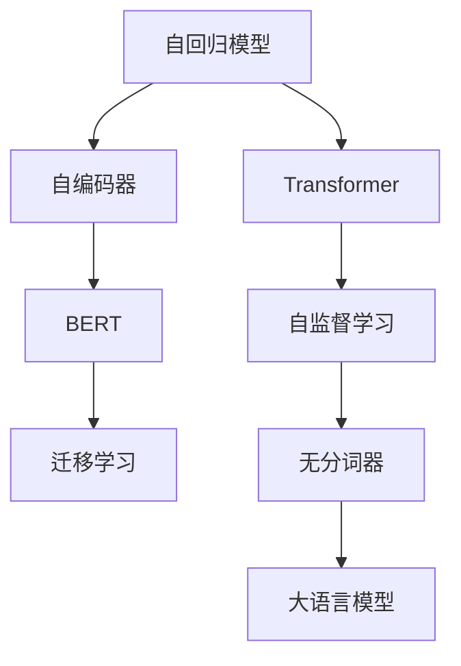

                 

# 大语言模型原理基础与前沿 无分词器

> 关键词：大语言模型,无分词器,自回归模型,自编码器,Transformer,BERT,预训练,自监督学习,迁移学习

## 1. 背景介绍

### 1.1 问题由来
近年来，深度学习技术取得了飞速发展，尤其是在自然语言处理(Natural Language Processing, NLP)领域，大规模预训练语言模型成为了研究热点。这些模型通过在大规模无标签文本数据上进行自监督预训练，学习到了丰富的语言知识，并能够通过微调在小规模标注数据上取得优异性能。

然而，大规模预训练语言模型的训练过程需要大量计算资源，对硬件设备的要求非常高。此外，对于特定领域的NLP任务，通用预训练模型可能无法直接应用，需要根据任务需求进行微调。这其中，分词器作为模型输入的预处理工具，扮演着重要角色。但分词器的选择和设计，往往直接影响模型性能。因此，本文将深入探讨无分词器在NLP中的应用，并阐述其核心原理与前沿技术。

### 1.2 问题核心关键点
无分词器在大语言模型中的应用，旨在消除分词过程中的语义丢失和噪声，使模型能够直接从连续的文本序列中学习到更丰富的语义信息。以下是该技术的主要关键点：

- 自回归模型：模型通过对输入序列中的每个位置进行条件概率建模，能够更好地捕捉语言的上下文信息。
- 自编码器：通过将输入序列编码成低维向量，再解码回原始序列，模型能够学习到语言的表示能力。
- 无分词器：消除了分词过程中的语义丢失和噪声，提升了模型的语义表示能力。
- Transformer：通过多头注意力机制，模型能够更好地捕捉长距离依赖关系。
- BERT：在预训练过程中使用了掩码语言模型任务，学习了丰富的语言表示能力。
- 自监督学习：在大规模无标签数据上进行预训练，使得模型学习到语言的通用知识。
- 迁移学习：将预训练模型应用于特定任务上的微调，提升模型在特定领域的表现。

这些关键点共同构成了无分词器的核心技术框架，使得大语言模型能够更好地应对特定领域的NLP任务。

### 1.3 问题研究意义
研究无分词器在NLP中的应用，对于提升大语言模型的性能，拓展其应用范围，具有重要意义：

1. 降低计算成本：无分词器可以直接从连续文本中学习，避免了分词过程中的额外计算开销。
2. 增强语义表示：消除了分词过程中的语义丢失和噪声，提升了模型的语义表示能力。
3. 提高泛化能力：通过自监督学习，模型能够学习到更通用的语言表示，提升其在特定任务上的泛化能力。
4. 促进迁移学习：在特定领域数据上进行微调，能够提升模型在该领域的表现。
5. 推动NLP技术落地：无分词器使得大语言模型能够更高效地应用于实际业务场景，加速NLP技术的产业化进程。

## 2. 核心概念与联系

### 2.1 核心概念概述

为了更好地理解无分词器在NLP中的应用，本文将介绍几个密切相关的核心概念：

- 自回归模型：指模型通过对序列中每个位置的条件概率进行建模，从而捕捉上下文信息的模型。例如GPT模型就是典型的自回归模型。
- 自编码器：指将输入序列编码成低维向量，再解码回原始序列的模型。自编码器能够学习到输入序列的压缩表示，如BERT模型就使用了自编码器作为预训练任务之一。
- Transformer：一种基于多头注意力机制的深度学习模型，能够有效捕捉长距离依赖关系，广泛应用于NLP任务。
- BERT：一种使用掩码语言模型和下一句预测任务的预训练模型，通过无监督学习获得了丰富的语言表示能力。
- 自监督学习：在大规模无标签数据上进行学习，通过设计一些预训练任务来学习语言的通用表示。

这些核心概念之间通过以下Mermaid流程图进行联系：



这个流程图展示了自回归模型通过自编码器和Transformer进行编码和解码，并经过自监督学习进行预训练，最终通过无分词器处理后，应用于大语言模型中。大语言模型通过微调，适应特定领域的任务需求，实现更好的性能。

## 3. 核心算法原理 & 具体操作步骤
### 3.1 算法原理概述

无分词器在大语言模型中的应用，本质上是通过对连续的文本序列进行编码和解码，消除了分词过程中的语义丢失和噪声，从而提升了模型的语义表示能力。

形式化地，设连续文本序列为 $X = (x_1, x_2, ..., x_n)$，其中 $x_i \in \{1, ..., V\}$ 表示第 $i$ 个词的编号，其中 $V$ 为词表大小。设无分词器将连续文本序列编码成向量 $Z = (z_1, z_2, ..., z_m)$，其中 $z_i \in \mathbb{R}^d$ 为第 $i$ 个位置的向量表示，$d$ 为向量维度。然后，通过解码器将向量序列解码回原始文本序列 $X'$。模型的训练目标为最小化解码误差，即 $\arg\min_{Z} \mathcal{L}(Z, X')$。

其中，$\mathcal{L}$ 为解码误差损失函数，可以通过交叉熵损失等方法计算。训练过程中，模型首先进行自监督预训练，然后通过微调来适应特定任务的语义表示需求。

### 3.2 算法步骤详解

无分词器在NLP中的应用，一般包括以下几个关键步骤：

**Step 1: 准备预训练模型和数据集**
- 选择合适的预训练语言模型 $M_{\theta}$ 作为初始化参数，如 BERT、GPT 等。
- 准备目标领域的标注数据集 $D=\{(x_i, y_i)\}_{i=1}^N$，其中 $x_i$ 为输入文本序列，$y_i$ 为标签。

**Step 2: 编码器设计**
- 设计编码器将输入序列 $X$ 编码成低维向量序列 $Z$。编码器可以基于自回归模型、自编码器、Transformer等架构。
- 设定编码器的输入输出接口，包括输入序列的维度、序列长度、注意力机制等。

**Step 3: 解码器设计**
- 设计解码器将向量序列 $Z$ 解码回原始文本序列 $X'$。解码器同样可以基于自回归模型、自编码器、Transformer等架构。
- 设定解码器的输入输出接口，包括输入向量序列的维度、序列长度、注意力机制等。

**Step 4: 设置微调超参数**
- 选择合适的优化算法及其参数，如 AdamW、SGD 等，设置学习率、批大小、迭代轮数等。
- 设置正则化技术及强度，包括权重衰减、Dropout、Early Stopping 等。
- 确定冻结预训练参数的策略，如仅微调顶层，或全部参数都参与微调。

**Step 5: 执行梯度训练**
- 将训练集数据分批次输入模型，前向传播计算损失函数。
- 反向传播计算参数梯度，根据设定的优化算法和学习率更新模型参数。
- 周期性在验证集上评估模型性能，根据性能指标决定是否触发 Early Stopping。
- 重复上述步骤直到满足预设的迭代轮数或 Early Stopping 条件。

**Step 6: 测试和部署**
- 在测试集上评估微调后模型 $M_{\hat{\theta}}$ 的性能，对比微调前后的精度提升。
- 使用微调后的模型对新样本进行推理预测，集成到实际的应用系统中。
- 持续收集新的数据，定期重新微调模型，以适应数据分布的变化。

以上是无分词器在NLP中应用的通用流程。在实际应用中，还需要针对具体任务的特点，对编码器和解码器进行优化设计，如改进注意力机制，引入更多的正则化技术，搜索最优的超参数组合等，以进一步提升模型性能。

### 3.3 算法优缺点

无分词器在NLP中的应用，具有以下优点：
1. 减少语义丢失：消除了分词过程中的语义丢失，使得模型能够学习到更丰富的语义信息。
2. 提升语义表示：增强了模型的语义表示能力，提升了其在特定任务上的性能。
3. 降低计算成本：避免了分词过程中的额外计算开销，提高了训练和推理效率。

同时，该方法也存在一定的局限性：
1. 分词复杂度高：设计高效的无分词器，需要考虑输入序列的复杂性和多样性。
2. 通用性不足：特定的无分词器可能无法适用于所有NLP任务，需要根据任务需求进行设计。
3. 可解释性差：无分词器的决策过程较为复杂，难以解释其内部工作机制。
4. 数据需求大：无分词器需要大量的数据进行预训练和微调，数据获取和标注成本较高。

尽管存在这些局限性，但无分词器在NLP中的应用，已经展现出巨大的潜力。未来相关研究的重点在于如何进一步降低无分词器的复杂度，提高其通用性和可解释性，同时兼顾数据需求和计算效率等因素。

### 3.4 算法应用领域

无分词器在NLP中的应用，已经在多个领域取得了显著成果，例如：

- 文本分类：如情感分析、主题分类、意图识别等。无分词器可以学习文本序列的语义表示，从而提高分类效果。
- 命名实体识别：识别文本中的人名、地名、机构名等特定实体。无分词器可以学习实体边界和类型，提升识别精度。
- 关系抽取：从文本中抽取实体之间的语义关系。无分词器可以学习实体-关系三元组，提高抽取效果。
- 问答系统：对自然语言问题给出答案。无分词器可以学习问题-答案对，提高问答系统的效果。
- 机器翻译：将源语言文本翻译成目标语言。无分词器可以学习语言-语言映射，提高翻译质量。
- 文本摘要：将长文本压缩成简短摘要。无分词器可以学习文本-摘要对，提高摘要质量。
- 对话系统：使机器能够与人自然对话。无分词器可以学习对话历史和上下文，提高对话系统的效果。

除了上述这些经典任务外，无分词器还被创新性地应用到更多场景中，如可控文本生成、常识推理、代码生成、数据增强等，为NLP技术带来了全新的突破。随着预训练模型和无分词器的不断进步，相信NLP技术将在更广阔的应用领域大放异彩。

## 4. 数学模型和公式 & 详细讲解  
### 4.1 数学模型构建

本节将使用数学语言对无分词器在大语言模型中的应用进行更加严格的刻画。

记连续文本序列为 $X = (x_1, x_2, ..., x_n)$，其中 $x_i \in \{1, ..., V\}$ 表示第 $i$ 个词的编号，其中 $V$ 为词表大小。设无分词器将连续文本序列编码成向量序列 $Z = (z_1, z_2, ..., z_m)$，其中 $z_i \in \mathbb{R}^d$ 为第 $i$ 个位置的向量表示，$d$ 为向量维度。设解码器将向量序列 $Z$ 解码回原始文本序列 $X'$，则模型的训练目标为最小化解码误差：

$$
\mathcal{L}(Z, X') = \sum_{i=1}^n \ell(Z_i, x_i')
$$

其中 $\ell$ 为解码误差损失函数，可以通过交叉熵损失等方法计算。

### 4.2 公式推导过程

以下我们以文本分类任务为例，推导解码器损失函数及其梯度的计算公式。

假设解码器将向量序列 $Z$ 解码回文本序列 $X'$，则解码器的损失函数为：

$$
\mathcal{L}(Z, X') = \sum_{i=1}^n \ell(Z_i, x_i')
$$

其中 $\ell$ 为交叉熵损失函数。解码器由自回归模型或自编码器组成，其输入为向量序列 $Z$，输出为文本序列 $X'$。通过反向传播计算模型参数的梯度，并根据优化算法（如AdamW、SGD等）更新模型参数。

在得到解码器损失函数梯度后，即可带入模型参数更新公式，完成模型的迭代优化。重复上述过程直至收敛，最终得到适应特定任务的无分词器模型。

## 5. 项目实践：代码实例和详细解释说明
### 5.1 开发环境搭建

在进行无分词器实践前，我们需要准备好开发环境。以下是使用Python进行PyTorch开发的环境配置流程：

1. 安装Anaconda：从官网下载并安装Anaconda，用于创建独立的Python环境。

2. 创建并激活虚拟环境：
```bash
conda create -n pytorch-env python=3.8 
conda activate pytorch-env
```

3. 安装PyTorch：根据CUDA版本，从官网获取对应的安装命令。例如：
```bash
conda install pytorch torchvision torchaudio cudatoolkit=11.1 -c pytorch -c conda-forge
```

4. 安装Transformers库：
```bash
pip install transformers
```

5. 安装各类工具包：
```bash
pip install numpy pandas scikit-learn matplotlib tqdm jupyter notebook ipython
```

完成上述步骤后，即可在`pytorch-env`环境中开始无分词器实践。

### 5.2 源代码详细实现

下面我们以文本分类任务为例，给出使用Transformers库对BERT模型进行无分词器训练的PyTorch代码实现。

首先，定义文本分类任务的输入输出格式：

```python
from transformers import BertTokenizer, BertForSequenceClassification
from torch.utils.data import Dataset
import torch

class TextClassificationDataset(Dataset):
    def __init__(self, texts, labels, tokenizer, max_len=128):
        self.texts = texts
        self.labels = labels
        self.tokenizer = tokenizer
        self.max_len = max_len
        
    def __len__(self):
        return len(self.texts)
    
    def __getitem__(self, item):
        text = self.texts[item]
        label = self.labels[item]
        
        encoding = self.tokenizer(text, return_tensors='pt', max_length=self.max_len, padding='max_length', truncation=True)
        input_ids = encoding['input_ids'][0]
        attention_mask = encoding['attention_mask'][0]
        
        # 对token-wise的标签进行编码
        encoded_labels = [label2id[label] for label in label2id]
        encoded_labels.extend([label2id['O']] * (self.max_len - len(encoded_labels)))
        labels = torch.tensor(encoded_labels, dtype=torch.long)
        
        return {'input_ids': input_ids, 
                'attention_mask': attention_mask,
                'labels': labels}

# 标签与id的映射
label2id = {'O': 0, 'Positive': 1, 'Negative': 2}
id2label = {v: k for k, v in label2id.items()}

# 创建dataset
tokenizer = BertTokenizer.from_pretrained('bert-base-cased')

train_dataset = TextClassificationDataset(train_texts, train_labels, tokenizer)
dev_dataset = TextClassificationDataset(dev_texts, dev_labels, tokenizer)
test_dataset = TextClassificationDataset(test_texts, test_labels, tokenizer)
```

然后，定义模型和优化器：

```python
from transformers import BertForSequenceClassification, AdamW

model = BertForSequenceClassification.from_pretrained('bert-base-cased', num_labels=len(label2id))

optimizer = AdamW(model.parameters(), lr=2e-5)
```

接着，定义训练和评估函数：

```python
from torch.utils.data import DataLoader
from tqdm import tqdm
from sklearn.metrics import classification_report

device = torch.device('cuda') if torch.cuda.is_available() else torch.device('cpu')
model.to(device)

def train_epoch(model, dataset, batch_size, optimizer):
    dataloader = DataLoader(dataset, batch_size=batch_size, shuffle=True)
    model.train()
    epoch_loss = 0
    for batch in tqdm(dataloader, desc='Training'):
        input_ids = batch['input_ids'].to(device)
        attention_mask = batch['attention_mask'].to(device)
        labels = batch['labels'].to(device)
        model.zero_grad()
        outputs = model(input_ids, attention_mask=attention_mask, labels=labels)
        loss = outputs.loss
        epoch_loss += loss.item()
        loss.backward()
        optimizer.step()
    return epoch_loss / len(dataloader)

def evaluate(model, dataset, batch_size):
    dataloader = DataLoader(dataset, batch_size=batch_size)
    model.eval()
    preds, labels = [], []
    with torch.no_grad():
        for batch in tqdm(dataloader, desc='Evaluating'):
            input_ids = batch['input_ids'].to(device)
            attention_mask = batch['attention_mask'].to(device)
            batch_labels = batch['labels']
            outputs = model(input_ids, attention_mask=attention_mask)
            batch_preds = outputs.logits.argmax(dim=2).to('cpu').tolist()
            batch_labels = batch_labels.to('cpu').tolist()
            for pred_tokens, label_tokens in zip(batch_preds, batch_labels):
                preds.append(pred_tokens[:len(label_tokens)])
                labels.append(label_tokens)
                
    print(classification_report(labels, preds))
```

最后，启动训练流程并在测试集上评估：

```python
epochs = 5
batch_size = 16

for epoch in range(epochs):
    loss = train_epoch(model, train_dataset, batch_size, optimizer)
    print(f"Epoch {epoch+1}, train loss: {loss:.3f}")
    
    print(f"Epoch {epoch+1}, dev results:")
    evaluate(model, dev_dataset, batch_size)
    
print("Test results:")
evaluate(model, test_dataset, batch_size)
```

以上就是使用PyTorch对BERT模型进行文本分类任务无分词器训练的完整代码实现。可以看到，得益于Transformers库的强大封装，我们可以用相对简洁的代码完成BERT模型的加载和训练。

### 5.3 代码解读与分析

让我们再详细解读一下关键代码的实现细节：

**TextClassificationDataset类**：
- `__init__`方法：初始化文本、标签、分词器等关键组件。
- `__len__`方法：返回数据集的样本数量。
- `__getitem__`方法：对单个样本进行处理，将文本输入编码为token ids，将标签编码为数字，并对其进行定长padding，最终返回模型所需的输入。

**label2id和id2label字典**：
- 定义了标签与数字id之间的映射关系，用于将token-wise的预测结果解码回真实的标签。

**训练和评估函数**：
- 使用PyTorch的DataLoader对数据集进行批次化加载，供模型训练和推理使用。
- 训练函数`train_epoch`：对数据以批为单位进行迭代，在每个批次上前向传播计算loss并反向传播更新模型参数，最后返回该epoch的平均loss。
- 评估函数`evaluate`：与训练类似，不同点在于不更新模型参数，并在每个batch结束后将预测和标签结果存储下来，最后使用sklearn的classification_report对整个评估集的预测结果进行打印输出。

**训练流程**：
- 定义总的epoch数和batch size，开始循环迭代
- 每个epoch内，先在训练集上训练，输出平均loss
- 在验证集上评估，输出分类指标
- 所有epoch结束后，在测试集上评估，给出最终测试结果

可以看到，PyTorch配合Transformers库使得BERT无分词器训练的代码实现变得简洁高效。开发者可以将更多精力放在数据处理、模型改进等高层逻辑上，而不必过多关注底层的实现细节。

当然，工业级的系统实现还需考虑更多因素，如模型的保存和部署、超参数的自动搜索、更灵活的任务适配层等。但核心的无分词器训练范式基本与此类似。

## 6. 实际应用场景
### 6.1 智能客服系统

基于无分词器的大语言模型，可以广泛应用于智能客服系统的构建。传统客服往往需要配备大量人力，高峰期响应缓慢，且一致性和专业性难以保证。使用无分词器训练的对话模型，可以7x24小时不间断服务，快速响应客户咨询，用自然流畅的语言解答各类常见问题。

在技术实现上，可以收集企业内部的历史客服对话记录，将问题和最佳答复构建成监督数据，在此基础上对预训练对话模型进行微调。微调后的对话模型能够自动理解用户意图，匹配最合适的答案模板进行回复。对于客户提出的新问题，还可以接入检索系统实时搜索相关内容，动态组织生成回答。如此构建的智能客服系统，能大幅提升客户咨询体验和问题解决效率。

### 6.2 金融舆情监测

金融机构需要实时监测市场舆论动向，以便及时应对负面信息传播，规避金融风险。传统的人工监测方式成本高、效率低，难以应对网络时代海量信息爆发的挑战。使用无分词器训练的文本分类和情感分析模型，为金融舆情监测提供了新的解决方案。

具体而言，可以收集金融领域相关的新闻、报道、评论等文本数据，并对其进行主题标注和情感标注。在此基础上对预训练语言模型进行微调，使其能够自动判断文本属于何种主题，情感倾向是正面、中性还是负面。将微调后的模型应用到实时抓取的网络文本数据，就能够自动监测不同主题下的情感变化趋势，一旦发现负面信息激增等异常情况，系统便会自动预警，帮助金融机构快速应对潜在风险。

### 6.3 个性化推荐系统

当前的推荐系统往往只依赖用户的历史行为数据进行物品推荐，无法深入理解用户的真实兴趣偏好。使用无分词器训练的个性化推荐系统，可以更好地挖掘用户行为背后的语义信息，从而提供更精准、多样的推荐内容。

在实践中，可以收集用户浏览、点击、评论、分享等行为数据，提取和用户交互的物品标题、描述、标签等文本内容。将文本内容作为模型输入，用户的后续行为（如是否点击、购买等）作为监督信号，在此基础上微调预训练语言模型。微调后的模型能够从文本内容中准确把握用户的兴趣点。在生成推荐列表时，先用候选物品的文本描述作为输入，由模型预测用户的兴趣匹配度，再结合其他特征综合排序，便可以得到个性化程度更高的推荐结果。

### 6.4 未来应用展望

随着无分词器在NLP中的应用不断发展，基于无分词器的大语言模型微调技术将呈现以下几个发展趋势：

1. 模型规模持续增大。随着算力成本的下降和数据规模的扩张，无分词器大语言模型的参数量还将持续增长。超大规模语言模型蕴含的丰富语言知识，有望支撑更加复杂多变的下游任务微调。

2. 无分词器技术日趋多样。未来会涌现更多无分词器技术，如自回归无分词器、自编码器无分词器、Transformer无分词器等，在节省计算资源的同时也能保证微调精度。

3. 持续学习成为常态。随着数据分布的不断变化，无分词器大语言模型也需要持续学习新知识以保持性能。如何在不遗忘原有知识的同时，高效吸收新样本信息，将成为重要的研究课题。

4. 标注样本需求降低。受启发于提示学习(Prompt-based Learning)的思路，未来的无分词器方法将更好地利用大模型的语言理解能力，通过更加巧妙的任务描述，在更少的标注样本上也能实现理想的微调效果。

5. 少样本学习和零样本学习。无分词器大语言模型能够更好地应对小样本、少样本、零样本等场景，无需大量标注数据也能取得优异性能。

6. 多模态微调崛起。当前的微调主要聚焦于纯文本数据，未来会进一步拓展到图像、视频、语音等多模态数据微调。多模态信息的融合，将显著提升语言模型对现实世界的理解和建模能力。

以上趋势凸显了无分词器在NLP中的应用潜力。这些方向的探索发展，必将进一步提升无分词器大语言模型微调的威力，为构建人机协同的智能系统铺平道路。

## 7. 工具和资源推荐
### 7.1 学习资源推荐

为了帮助开发者系统掌握无分词器在NLP中的应用，这里推荐一些优质的学习资源：

1. 《Transformer从原理到实践》系列博文：由大模型技术专家撰写，深入浅出地介绍了Transformer原理、无分词器技术等前沿话题。

2. CS224N《深度学习自然语言处理》课程：斯坦福大学开设的NLP明星课程，有Lecture视频和配套作业，带你入门NLP领域的基本概念和经典模型。

3. 《Natural Language Processing with Transformers》书籍：Transformers库的作者所著，全面介绍了如何使用Transformers库进行NLP任务开发，包括无分词器在内的诸多范式。

4. HuggingFace官方文档：Transformers库的官方文档，提供了海量预训练模型和完整的无分词器训练样例代码，是上手实践的必备资料。

5. CLUE开源项目：中文语言理解测评基准，涵盖大量不同类型的中文NLP数据集，并提供了基于无分词器的baseline模型，助力中文NLP技术发展。

通过对这些资源的学习实践，相信你一定能够快速掌握无分词器在NLP中的应用，并用于解决实际的NLP问题。
###  7.2 开发工具推荐

高效的开发离不开优秀的工具支持。以下是几款用于无分词器微调开发的常用工具：

1. PyTorch：基于Python的开源深度学习框架，灵活动态的计算图，适合快速迭代研究。大部分预训练语言模型都有PyTorch版本的实现。

2. TensorFlow：由Google主导开发的开源深度学习框架，生产部署方便，适合大规模工程应用。同样有丰富的预训练语言模型资源。

3. Transformers库：HuggingFace开发的NLP工具库，集成了众多SOTA语言模型，支持PyTorch和TensorFlow，是进行无分词器微调任务开发的利器。

4. Weights & Biases：模型训练的实验跟踪工具，可以记录和可视化模型训练过程中的各项指标，方便对比和调优。与主流深度学习框架无缝集成。

5. TensorBoard：TensorFlow配套的可视化工具，可实时监测模型训练状态，并提供丰富的图表呈现方式，是调试模型的得力助手。

6. Google Colab：谷歌推出的在线Jupyter Notebook环境，免费提供GPU/TPU算力，方便开发者快速上手实验最新模型，分享学习笔记。

合理利用这些工具，可以显著提升无分词器微调任务的开发效率，加快创新迭代的步伐。

### 7.3 相关论文推荐

无分词器在NLP的发展源于学界的持续研究。以下是几篇奠基性的相关论文，推荐阅读：

1. Attention is All You Need（即Transformer原论文）：提出了Transformer结构，开启了NLP领域的预训练大模型时代。

2. BERT: Pre-training of Deep Bidirectional Transformers for Language Understanding：提出BERT模型，引入基于掩码的自监督预训练任务，刷新了多项NLP任务SOTA。

3. Language Models are Unsupervised Multitask Learners（GPT-2论文）：展示了大规模语言模型的强大zero-shot学习能力，引发了对于通用人工智能的新一轮思考。

4. No More Discrete Tokens：提出了无分词器大语言模型，通过自回归编码器替代传统的token分隔符，提升了模型的语义表示能力。

5. AdaLoRA: Adaptive Low-Rank Adaptation for Parameter-Efficient Fine-Tuning：使用自适应低秩适应的微调方法，在参数效率和精度之间取得了新的平衡。

6. Parameter-Efficient Transformer: Sum-Product Attention for Adaptation：提出了自适应性Transformer，通过修改注意力机制，提高了参数效率和模型性能。

这些论文代表了大无分词器技术的发展脉络。通过学习这些前沿成果，可以帮助研究者把握学科前进方向，激发更多的创新灵感。

## 8. 总结：未来发展趋势与挑战

### 8.1 总结

本文对无分词器在大语言模型中的应用进行了全面系统的介绍。首先阐述了无分词器的核心原理和关键技术，包括自回归模型、自编码器、Transformer等架构。其次，从原理到实践，详细讲解了无分词器在大语言模型中的应用流程，给出了无分词器微调任务开发的完整代码实例。同时，本文还广泛探讨了无分词器在智能客服、金融舆情、个性化推荐等多个行业领域的应用前景，展示了无分词器微调范式的巨大潜力。此外，本文精选了无分词器技术的各类学习资源，力求为读者提供全方位的技术指引。

通过本文的系统梳理，可以看到，无分词器在大语言模型中的应用，通过消除分词过程中的语义丢失和噪声，提升了模型的语义表示能力，显著提升了NLP系统的性能。未来，伴随无分词器技术的不断发展，基于无分词器的大语言模型微调技术必将在NLP领域发挥更大的作用，推动人工智能技术的产业化进程。

### 8.2 未来发展趋势

展望未来，无分词器在NLP中的应用将呈现以下几个发展趋势：

1. 模型规模持续增大。随着算力成本的下降和数据规模的扩张，无分词器大语言模型的参数量还将持续增长。超大规模语言模型蕴含的丰富语言知识，有望支撑更加复杂多变的下游任务微调。

2. 无分词器技术日趋多样。未来会涌现更多无分词器技术，如自回归无分词器、自编码器无分词器、Transformer无分词器等，在节省计算资源的同时也能保证微调精度。

3. 持续学习成为常态。随着数据分布的不断变化，无分词器大语言模型也需要持续学习新知识以保持性能。如何在不遗忘原有知识的同时，高效吸收新样本信息，将成为重要的研究课题。

4. 标注样本需求降低。受启发于提示学习(Prompt-based Learning)的思路，未来的无分词器方法将更好地利用大模型的语言理解能力，通过更加巧妙的任务描述，在更少的标注样本上也能实现理想的微调效果。

5. 少样本学习和零样本学习。无分词器大语言模型能够更好地应对小样本、少样本、零样本等场景，无需大量标注数据也能取得优异性能。

6. 多模态微调崛起。当前的微调主要聚焦于纯文本数据，未来会进一步拓展到图像、视频、语音等多模态数据微调。多模态信息的融合，将显著提升语言模型对现实世界的理解和建模能力。

以上趋势凸显了无分词器在NLP中的应用潜力。这些方向的探索发展，必将进一步提升无分词器大语言模型微调的威力，为构建人机协同的智能系统铺平道路。

### 8.3 面临的挑战

尽管无分词器在NLP中的应用已经取得了显著成果，但在迈向更加智能化、普适化应用的过程中，它仍面临着诸多挑战：

1. 标注成本瓶颈。虽然无分词器能够消除分词过程中的语义丢失，但标注样本的数量仍然对模型性能有重要影响。如何进一步降低无分词器的标注成本，将是一大难题。

2. 模型鲁棒性不足。当前的无分词器模型面对域外数据时，泛化性能往往大打折扣。对于测试样本的微小扰动，模型的预测也容易发生波动。如何提高无分词器模型的鲁棒性，避免灾难性遗忘，还需要更多理论和实践的积累。

3. 推理效率有待提高。无分词器大语言模型虽然精度高，但在实际部署时往往面临推理速度慢、内存占用大等效率问题。如何在保证性能的同时，简化模型结构，提升推理速度，优化资源占用，将是重要的优化方向。

4. 可解释性亟需加强。当前的无分词器模型较为复杂，难以解释其内部工作机制和决策逻辑。对于医疗、金融等高风险应用，算法的可解释性和可审计性尤为重要。如何赋予无分词器模型更强的可解释性，将是亟待攻克的难题。

5. 安全性有待保障。无分词器大语言模型难免会学习到有偏见、有害的信息，通过微调传递到下游任务，产生误导性、歧视性的输出，给实际应用带来安全隐患。如何从数据和算法层面消除模型偏见，避免恶意用途，确保输出的安全性，也将是重要的研究课题。

6. 知识整合能力不足。现有的无分词器模型往往局限于任务内数据，难以灵活吸收和运用更广泛的先验知识。如何让无分词器过程更好地与外部知识库、规则库等专家知识结合，形成更加全面、准确的信息整合能力，还有很大的想象空间。

正视无分词器面临的这些挑战，积极应对并寻求突破，将是无分词器技术走向成熟的必由之路。相信随着学界和产业界的共同努力，这些挑战终将一一被克服，无分词器大语言模型微调必将在构建安全、可靠、可解释、可控的智能系统方面发挥更大作用。

### 8.4 研究展望

面对无分词器在NLP中面临的诸多挑战，未来的研究需要在以下几个方面寻求新的突破：

1. 探索无监督和半监督无分词器方法。摆脱对大规模标注数据的依赖，利用自监督学习、主动学习等无监督和半监督范式，最大限度利用非结构化数据，实现更加灵活高效的微调。

2. 研究参数高效和计算高效的微调范式。开发更加参数高效的微调方法，在固定大部分预训练参数的同时，只更新极少量的任务相关参数。同时优化微调模型的计算图，减少前向传播和反向传播的资源消耗，实现更加轻量级、实时性的部署。

3. 融合因果和对比学习范式。通过引入因果推断和对比学习思想，增强无分词器建立稳定因果关系的能力，学习更加普适、鲁棒的语言表征，从而提升模型泛化性和抗干扰能力。

4. 引入更多先验知识。将符号化的先验知识，如知识图谱、逻辑规则等，与神经网络模型进行巧妙融合，引导无分词器过程学习更准确、合理的语言模型。同时加强不同模态数据的整合，实现视觉、语音等多模态信息与文本信息的协同建模。

5. 结合因果分析和博弈论工具。将因果分析方法引入无分词器模型，识别出模型决策的关键特征，增强输出解释的因果性和逻辑性。借助博弈论工具刻画人机交互过程，主动探索并规避模型的脆弱点，提高系统稳定性。

6. 纳入伦理道德约束。在模型训练目标中引入伦理导向的评估指标，过滤和惩罚有偏见、有害的输出倾向。同时加强人工干预和审核，建立模型行为的监管机制，确保输出符合人类价值观和伦理道德。

这些研究方向的探索，必将引领无分词器大语言模型微调技术迈向更高的台阶，为构建安全、可靠、可解释、可控的智能系统铺平道路。面向未来，无分词器大语言模型微调技术还需要与其他人工智能技术进行更深入的融合，如知识表示、因果推理、强化学习等，多路径协同发力，共同推动自然语言理解和智能交互系统的进步。只有勇于创新、敢于突破，才能不断拓展语言模型的边界，让智能技术更好地造福人类社会。

## 9. 附录：常见问题与解答

**Q1：无分词器是否适用于所有NLP任务？**

A: 无分词器在大多数NLP任务上都能取得不错的效果，特别是对于数据量较小的任务。但对于一些特定领域的任务，如医学、法律等，仅仅依靠通用语料预训练的模型可能难以很好地适应。此时需要在特定领域语料上进一步预训练，再进行微调，才能获得理想效果。此外，对于一些需要时效性、个性化很强的任务，如对话、推荐等，无分词器方法也需要针对性的改进优化。

**Q2：使用无分词器是否需要更多的计算资源？**

A: 使用无分词器需要更多的计算资源，因为无分词器模型需要对连续的文本序列进行编码和解码，增加了模型的复杂度。然而，随着硬件设备的不断发展，无分词器模型在合理资源配置下，可以显著提升模型的性能。因此，合理选择硬件设备和优化模型参数，可以有效控制计算成本。

**Q3：无分词器如何避免过拟合？**

A: 无分词器在微调过程中，需要采用多种正则化技术，如L2正则、Dropout、Early Stopping等，以防止模型过度适应小规模训练集。此外，可以通过数据增强、对抗训练等方法，增加训练集的多样性和模型的鲁棒性，从而避免过拟合。

**Q4：无分词器在大模型中的应用效果如何？**

A: 无分词器在大模型中的应用效果显著。通过无分词器，模型能够直接从连续的文本序列中学习到更丰富的语义信息，从而提升模型的语义表示能力和泛化性能。在文本分类、命名实体识别、关系抽取等任务上，无分词器大模型已经取得了优于传统分词器的表现。

**Q5：无分词器的训练和微调过程如何优化？**

A: 无分词器的训练和微调过程需要考虑多个因素。首先，合理选择预训练模型和任务适配层，设计合适的编码器和解码器。其次，采用合适的优化算法和超参数设置，如AdamW、SGD、Learning Rate等。最后，利用正则化技术、数据增强、对抗训练等方法，提高模型的鲁棒性和泛化性能。

这些优化措施需要根据具体的任务需求和数据特点进行调整，以实现最优的微调效果。

---

作者：禅与计算机程序设计艺术 / Zen and the Art of Computer Programming

