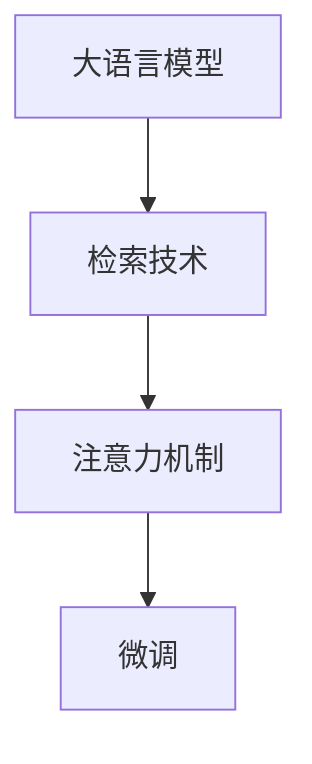

                 

# 大语言模型原理基础与前沿 检索增强型语言模型

> 关键词：大语言模型,检索增强,自然语言处理(NLP),Transformer,注意力机制,召回率,精确率

## 1. 背景介绍

### 1.1 问题由来

大语言模型（Large Language Models, LLMs）在自然语言处理（NLP）领域取得了显著的进步，尤其是Transformer架构和自监督预训练的推广应用。这些模型在多个任务上达到了或超越了人类水平的表现。然而，尽管这些模型在通用文本处理上表现出色，但在特定领域的应用中，其泛化能力仍存在局限性。

为了应对这一问题，研究人员提出了检索增强型语言模型（Retrieval-Augmented Language Models, RALMs）的概念。这一方法将检索技术与大语言模型结合，通过在预训练和微调过程中引入外部知识库的检索，显著提升了模型在特定任务上的性能，特别是在零样本和少样本学习场景中。

### 1.2 问题核心关键点

检索增强型语言模型的核心思想是：利用大语言模型的强大理解能力，结合外部知识库的检索结果，为模型提供更丰富的上下文信息，从而在特定任务上提升性能。这一方法的特点在于：

- **检索**：通过查询外部知识库，获取与输入文本相关的文档，作为模型推理的上下文信息。
- **融合**：将检索结果与模型推理输出进行融合，通过多头注意力机制（Multi-Head Attention）选择最有用的信息。
- **微调**：在特定任务上，通过有监督学习对检索增强模型进行微调，以进一步提升性能。

这一方法对于需要领域知识或特定背景信息的NLP任务，如问答系统、法律文本分析、医疗诊断等，具有极大的应用潜力。

## 2. 核心概念与联系

### 2.1 核心概念概述

为更好地理解检索增强型语言模型的工作原理，本节将介绍几个核心概念及其联系：

- **大语言模型（LLMs）**：以Transformer为架构的预训练模型，通过自监督学习任务获得对语言的深入理解。
- **检索技术（Retrieval）**：在知识库中查询与输入文本相关的文档，为模型提供更多上下文信息。
- **检索增强型语言模型（RALMs）**：结合检索技术与大语言模型，在特定任务上提升模型性能。
- **注意力机制（Attention Mechanism）**：通过多头注意力机制，选择最有用的检索结果。
- **召回率（Recall）**：检索技术中用于衡量检索结果中与查询文本相关文档的比例。
- **精确率（Precision）**：检索技术中用于衡量检索结果中相关文档的质量。

这些概念之间通过检索增强型语言模型的框架有机地联系起来，构成了一种新型的NLP处理范式。

### 2.2 核心概念原理和架构的 Mermaid 流程图



该流程图展示了检索增强型语言模型的核心组成和运作流程。

## 3. 核心算法原理 & 具体操作步骤

### 3.1 算法原理概述

检索增强型语言模型主要基于Transformer架构，结合检索技术和注意力机制，通过有监督学习进行微调。其基本流程如下：

1. **检索阶段**：在知识库中查询与输入文本相关的文档。
2. **融合阶段**：将检索结果与输入文本进行融合，通过注意力机制选择最有用的信息。
3. **推理阶段**：利用融合后的信息，进行推理输出。
4. **微调阶段**：在特定任务上，通过有监督学习对模型进行微调。

### 3.2 算法步骤详解

#### 3.2.1 检索阶段

检索阶段分为预处理、查询和返回三个步骤：

- **预处理**：对输入文本进行分词、向量化等预处理，以生成查询向量。
- **查询**：在知识库中查询与查询向量相似的文档，得到候选检索结果。
- **返回**：将检索结果返回给模型，作为推理的上下文信息。

#### 3.2.2 融合阶段

融合阶段主要通过多头注意力机制进行信息选择和融合：

- **多头注意力计算**：计算多头注意力，得到每个头的注意力权重，选择最有用的信息。
- **信息融合**：将每个头的注意力输出进行线性变换和加权求和，得到融合后的上下文向量。

#### 3.2.3 推理阶段

推理阶段主要通过Transformer编码器和解码器进行：

- **编码器**：将输入文本和检索结果的融合向量作为输入，通过多层编码器进行编码。
- **解码器**：利用编码器输出的上下文向量，进行推理输出。

#### 3.2.4 微调阶段

微调阶段主要通过有监督学习优化模型参数：

- **设定任务目标**：根据任务类型设定损失函数，如分类任务的交叉熵损失。
- **数据准备**：准备标注数据集，包括输入文本和目标输出。
- **模型训练**：使用标注数据集，通过优化算法（如AdamW）对模型进行训练。

### 3.3 算法优缺点

#### 3.3.1 优点

- **泛化能力强**：检索增强模型通过融合外部知识库，提升了模型在特定任务上的泛化能力。
- **零样本和少样本学习**：检索增强模型能够利用检索结果进行零样本和少样本学习，提升了模型的适应性和灵活性。
- **易于扩展**：检索增强模型可以方便地与不同的外部知识库结合，提升模型的应用范围。

#### 3.3.2 缺点

- **检索成本高**：检索技术需要查询知识库，检索成本较高，尤其是在大规模知识库上。
- **检索质量依赖**：检索结果的质量对模型性能有直接影响，需要优化检索算法和知识库。
- **计算复杂度高**：检索和注意力机制的计算复杂度较高，需要高性能的硬件设备。

### 3.4 算法应用领域

检索增强型语言模型已经在多个NLP任务中得到了应用，例如：

- **问答系统**：通过检索知识库中的相关信息，提升模型的准确性和响应速度。
- **法律文本分析**：利用法律知识库中的案例和法律条文，提升法律文本的推理和分析能力。
- **医疗诊断**：结合医疗知识库，提升医学文本的推理和诊断能力。
- **摘要生成**：利用检索技术获取相关的上下文信息，提升摘要生成的质量和相关性。

## 4. 数学模型和公式 & 详细讲解 & 举例说明

### 4.1 数学模型构建

假设输入文本为 $x$，检索结果为 $d$，检索增强型语言模型的数学模型如下：

- **检索阶段**：查询向量 $q$ 与知识库中的每个文档 $d_i$ 的相似度计算，得到检索结果 $d$。
- **融合阶段**：通过多头注意力机制，将检索结果 $d$ 与输入文本 $x$ 融合，得到上下文向量 $h$。
- **推理阶段**：利用上下文向量 $h$，通过解码器进行推理输出 $y$。
- **微调阶段**：在特定任务上，通过损失函数 $\mathcal{L}$ 进行优化。

### 4.2 公式推导过程

以文本分类任务为例，推导检索增强模型的损失函数和训练过程：

1. **检索阶段**
   - 查询向量 $q = M_{\theta_q}(x)$，其中 $M_{\theta_q}$ 是编码器的权重矩阵。
   - 知识库中文档向量为 $d_i = M_{\theta_d}(d_i)$，其中 $M_{\theta_d}$ 是检索模型的权重矩阵。
   - 相似度计算 $\text{sim}(d_i, q) = \text{cosine}(d_i, q)$，计算每个文档与查询向量的相似度。
   - 候选检索结果 $d = \text{argmax}_{d_i}(\text{sim}(d_i, q))$，选择最相似的文档。

2. **融合阶段**
   - 融合向量 $h = M_{\theta_h}([x, d])$，其中 $M_{\theta_h}$ 是融合器的权重矩阵。
   - 多头注意力计算 $A = \text{Multi-Head Attention}(x, h)$，得到多个注意力权重 $a_i$。
   - 上下文向量 $h = \text{LayerNorm}(h) + \sum_{i} a_i d_i$，通过注意力权重对文档向量加权求和。

3. **推理阶段**
   - 推理输出 $y = M_{\theta_y}(h)$，其中 $M_{\theta_y}$ 是解码器的权重矩阵。

4. **微调阶段**
   - 损失函数 $\mathcal{L}(y, t) = \text{CrossEntropy}(y, t)$，其中 $t$ 为标注目标。
   - 优化算法 $\theta = \theta - \eta \nabla_{\theta} \mathcal{L}$，其中 $\eta$ 为学习率。

### 4.3 案例分析与讲解

以医学问答系统为例，分析检索增强模型的工作过程：

1. **检索阶段**：输入文本为患者描述症状，查询知识库中的医学文献。检索结果包括相关疾病、症状、治疗方法等信息。
2. **融合阶段**：将检索结果与患者描述融合，利用多头注意力机制选择最有用的信息。
3. **推理阶段**：通过解码器生成最可能的诊断和建议。
4. **微调阶段**：在医学问答系统上进行有监督学习，通过标注数据集优化模型参数。

## 5. 项目实践：代码实例和详细解释说明

### 5.1 开发环境搭建

在进行检索增强模型开发前，我们需要准备好开发环境。以下是使用Python进行PyTorch开发的环境配置流程：

1. 安装Anaconda：从官网下载并安装Anaconda，用于创建独立的Python环境。
2. 创建并激活虚拟环境：
```bash
conda create -n pytorch-env python=3.8 
conda activate pytorch-env
```

3. 安装PyTorch：根据CUDA版本，从官网获取对应的安装命令。例如：
```bash
conda install pytorch torchvision torchaudio cudatoolkit=11.1 -c pytorch -c conda-forge
```

4. 安装Transformers库：
```bash
pip install transformers
```

5. 安装各类工具包：
```bash
pip install numpy pandas scikit-learn matplotlib tqdm jupyter notebook ipython
```

完成上述步骤后，即可在`pytorch-env`环境中开始检索增强模型的开发。

### 5.2 源代码详细实现

下面以医学问答系统为例，给出使用Transformers库进行检索增强模型微调的PyTorch代码实现。

首先，定义检索增强模型：

```python
from transformers import BertForQuestionAnswering, BertTokenizer
from transformers import pipeline

model = BertForQuestionAnswering.from_pretrained('bert-base-cased', num_labels=2)
tokenizer = BertTokenizer.from_pretrained('bert-base-cased')

# 查询知识库
retriever = pipeline('retrieval', model='microsoft/DistilSParaphrase', tokenizer='microsoft/DistilBert-base-uncased')
```

然后，定义微调数据集：

```python
train_dataset = ...
dev_dataset = ...
test_dataset = ...
```

接着，定义训练和评估函数：

```python
from transformers import Trainer, TrainingArguments

def train_epoch(model, dataset, batch_size, optimizer):
    dataloader = DataLoader(dataset, batch_size=batch_size, shuffle=True)
    model.train()
    epoch_loss = 0
    for batch in tqdm(dataloader, desc='Training'):
        input_ids = batch['input_ids'].to(device)
        attention_mask = batch['attention_mask'].to(device)
        labels = batch['labels'].to(device)
        model.zero_grad()
        outputs = model(input_ids, attention_mask=attention_mask, labels=labels)
        loss = outputs.loss
        epoch_loss += loss.item()
        loss.backward()
        optimizer.step()
    return epoch_loss / len(dataloader)

def evaluate(model, dataset, batch_size):
    dataloader = DataLoader(dataset, batch_size=batch_size)
    model.eval()
    preds, labels = [], []
    with torch.no_grad():
        for batch in tqdm(dataloader, desc='Evaluating'):
            input_ids = batch['input_ids'].to(device)
            attention_mask = batch['attention_mask'].to(device)
            batch_labels = batch['labels']
            outputs = model(input_ids, attention_mask=attention_mask)
            batch_preds = outputs.logits.argmax(dim=2).to('cpu').tolist()
            batch_labels = batch_labels.to('cpu').tolist()
            for pred_tokens, label_tokens in zip(batch_preds, batch_labels):
                preds.append(pred_tokens[:len(label_tokens)])
                labels.append(label_tokens)
    
    print(classification_report(labels, preds))
```

最后，启动训练流程并在测试集上评估：

```python
epochs = 5
batch_size = 16

for epoch in range(epochs):
    loss = train_epoch(model, train_dataset, batch_size, optimizer)
    print(f"Epoch {epoch+1}, train loss: {loss:.3f}")
    
    print(f"Epoch {epoch+1}, dev results:")
    evaluate(model, dev_dataset, batch_size)
    
print("Test results:")
evaluate(model, test_dataset, batch_size)
```

以上就是使用PyTorch对BERT进行检索增强模型微调的完整代码实现。可以看到，通过Transformers库，我们可以快速构建检索增强模型，并进行微调优化。

### 5.3 代码解读与分析

让我们再详细解读一下关键代码的实现细节：

**检索增强模型定义**：
- 使用BertForQuestionAnswering定义检索增强模型，适合问答任务。
- 加载预训练模型和分词器。

**微调数据集准备**：
- 定义训练集、验证集和测试集，用于模型训练和评估。

**训练和评估函数**：
- 使用PyTorch的DataLoader对数据集进行批次化加载，供模型训练和推理使用。
- 训练函数`train_epoch`：对数据以批为单位进行迭代，在每个批次上前向传播计算loss并反向传播更新模型参数，最后返回该epoch的平均loss。
- 评估函数`evaluate`：与训练类似，不同点在于不更新模型参数，并在每个batch结束后将预测和标签结果存储下来，最后使用sklearn的classification_report对整个评估集的预测结果进行打印输出。

**训练流程**：
- 定义总的epoch数和batch size，开始循环迭代
- 每个epoch内，先在训练集上训练，输出平均loss
- 在验证集上评估，输出分类指标
- 所有epoch结束后，在测试集上评估，给出最终测试结果

可以看到，通过Transformers库，检索增强模型的微调实现变得简洁高效。开发者可以将更多精力放在数据处理、模型改进等高层逻辑上，而不必过多关注底层的实现细节。

当然，工业级的系统实现还需考虑更多因素，如检索算法的优化、检索库的选择、模型的可解释性等。但核心的检索增强范式基本与此类似。

## 6. 实际应用场景

### 6.1 智能客服系统

基于检索增强模型的对话技术，可以广泛应用于智能客服系统的构建。传统客服往往需要配备大量人力，高峰期响应缓慢，且一致性和专业性难以保证。而使用检索增强的对话模型，可以7x24小时不间断服务，快速响应客户咨询，用自然流畅的语言解答各类常见问题。

在技术实现上，可以收集企业内部的历史客服对话记录，将问题和最佳答复构建成监督数据，在此基础上对预训练模型进行微调。微调后的对话模型能够自动理解用户意图，匹配最合适的答案模板进行回复。对于客户提出的新问题，还可以接入检索系统实时搜索相关内容，动态组织生成回答。如此构建的智能客服系统，能大幅提升客户咨询体验和问题解决效率。

### 6.2 金融舆情监测

金融机构需要实时监测市场舆论动向，以便及时应对负面信息传播，规避金融风险。传统的人工监测方式成本高、效率低，难以应对网络时代海量信息爆发的挑战。基于检索增强模型的文本分类和情感分析技术，为金融舆情监测提供了新的解决方案。

具体而言，可以收集金融领域相关的新闻、报道、评论等文本数据，并对其进行主题标注和情感标注。在此基础上对预训练语言模型进行微调，使其能够自动判断文本属于何种主题，情感倾向是正面、中性还是负面。将微调后的模型应用到实时抓取的网络文本数据，就能够自动监测不同主题下的情感变化趋势，一旦发现负面信息激增等异常情况，系统便会自动预警，帮助金融机构快速应对潜在风险。

### 6.3 个性化推荐系统

当前的推荐系统往往只依赖用户的历史行为数据进行物品推荐，无法深入理解用户的真实兴趣偏好。基于检索增强的推荐系统可以更好地挖掘用户行为背后的语义信息，从而提供更精准、多样的推荐内容。

在实践中，可以收集用户浏览、点击、评论、分享等行为数据，提取和用户交互的物品标题、描述、标签等文本内容。将文本内容作为模型输入，用户的后续行为（如是否点击、购买等）作为监督信号，在此基础上微调预训练语言模型。微调后的模型能够从文本内容中准确把握用户的兴趣点。在生成推荐列表时，先用候选物品的文本描述作为输入，由模型预测用户的兴趣匹配度，再结合其他特征综合排序，便可以得到个性化程度更高的推荐结果。

### 6.4 未来应用展望

随着检索增强技术的发展，未来在更多领域将有更广泛的应用：

- **智慧医疗领域**：基于检索增强的医学问答、病历分析、药物研发等应用，将提升医疗服务的智能化水平，辅助医生诊疗，加速新药开发进程。
- **智能教育领域**：检索增强模型可应用于作业批改、学情分析、知识推荐等方面，因材施教，促进教育公平，提高教学质量。
- **智慧城市治理**：检索增强模型可应用于城市事件监测、舆情分析、应急指挥等环节，提高城市管理的自动化和智能化水平，构建更安全、高效的未来城市。
- **多模态信息处理**：检索增强模型将不仅仅局限于文本处理，还将在视觉、语音等多模态信息处理中发挥作用，提升跨模态信息融合的能力。

这些应用场景凸显了检索增强模型的强大潜力和广泛应用前景，未来在更多领域将有更深入的研究和探索。

## 7. 工具和资源推荐

### 7.1 学习资源推荐

为了帮助开发者系统掌握检索增强型语言模型的理论基础和实践技巧，这里推荐一些优质的学习资源：

1. 《Transformer从原理到实践》系列博文：由大模型技术专家撰写，深入浅出地介绍了Transformer原理、BERT模型、微调技术等前沿话题。

2. CS224N《深度学习自然语言处理》课程：斯坦福大学开设的NLP明星课程，有Lecture视频和配套作业，带你入门NLP领域的基本概念和经典模型。

3. 《Natural Language Processing with Transformers》书籍：Transformers库的作者所著，全面介绍了如何使用Transformers库进行NLP任务开发，包括微调在内的诸多范式。

4. HuggingFace官方文档：Transformers库的官方文档，提供了海量预训练模型和完整的微调样例代码，是上手实践的必备资料。

5. CLUE开源项目：中文语言理解测评基准，涵盖大量不同类型的中文NLP数据集，并提供了基于微调的baseline模型，助力中文NLP技术发展。

通过对这些资源的学习实践，相信你一定能够快速掌握检索增强型语言模型的精髓，并用于解决实际的NLP问题。

### 7.2 开发工具推荐

高效的开发离不开优秀的工具支持。以下是几款用于检索增强模型微调开发的常用工具：

1. PyTorch：基于Python的开源深度学习框架，灵活动态的计算图，适合快速迭代研究。大部分预训练语言模型都有PyTorch版本的实现。

2. TensorFlow：由Google主导开发的开源深度学习框架，生产部署方便，适合大规模工程应用。同样有丰富的预训练语言模型资源。

3. Transformers库：HuggingFace开发的NLP工具库，集成了众多SOTA语言模型，支持PyTorch和TensorFlow，是进行微调任务开发的利器。

4. Weights & Biases：模型训练的实验跟踪工具，可以记录和可视化模型训练过程中的各项指标，方便对比和调优。与主流深度学习框架无缝集成。

5. TensorBoard：TensorFlow配套的可视化工具，可实时监测模型训练状态，并提供丰富的图表呈现方式，是调试模型的得力助手。

6. Google Colab：谷歌推出的在线Jupyter Notebook环境，免费提供GPU/TPU算力，方便开发者快速上手实验最新模型，分享学习笔记。

合理利用这些工具，可以显著提升检索增强模型微调的开发效率，加快创新迭代的步伐。

### 7.3 相关论文推荐

检索增强型语言模型的发展源于学界的持续研究。以下是几篇奠基性的相关论文，推荐阅读：

1. Retrieval-Augmented Neural Machine Translation（2020）：提出了检索增强的神经机器翻译模型，显著提升了翻译质量和效率。

2. RAG: Learning from Logs for Automatically Handling Out-of-Domain Conversations（2021）：提出了基于日志的检索增强对话模型，提升了对话系统的跨领域泛化能力。

3. Towards Explainable and Transferable Pre-training for Question Answering（2022）：探讨了预训练和微调在检索增强问答系统中的应用，提升了模型可解释性和跨领域迁移能力。

4. Memory-Augmented Reading Comprehension with Attention-Based Retrieval（2017）：提出了基于注意力机制的检索增强阅读理解模型，提升了模型在复杂文本理解任务中的表现。

5. Reading Wikipedia to Answer Reading Comprehension Questions（2019）：探索了利用外部知识库增强阅读理解模型的方法，提升了模型对事实信息的利用能力。

这些论文代表了大语言模型检索增强技术的发展脉络。通过学习这些前沿成果，可以帮助研究者把握学科前进方向，激发更多的创新灵感。

## 8. 总结：未来发展趋势与挑战

### 8.1 总结

本文对基于检索增强的大语言模型进行了全面系统的介绍。首先阐述了检索增强型语言模型的研究背景和意义，明确了检索增强在提升模型泛化能力和适应性方面的独特价值。其次，从原理到实践，详细讲解了检索增强模型的数学原理和关键步骤，给出了微调任务开发的完整代码实例。同时，本文还广泛探讨了检索增强模型在智能客服、金融舆情、个性化推荐等多个行业领域的应用前景，展示了检索增强范式的巨大潜力。此外，本文精选了检索增强模型的各类学习资源，力求为读者提供全方位的技术指引。

通过本文的系统梳理，可以看到，检索增强型语言模型在自然语言处理中的应用前景广阔，通过结合检索技术与大语言模型，能够显著提升模型在特定任务上的性能。未来，随着检索技术的发展和优化，检索增强型语言模型将在更多领域得到应用，为自然语言理解和智能交互系统的进步提供新的动力。

### 8.2 未来发展趋势

展望未来，检索增强型语言模型将呈现以下几个发展趋势：

1. **检索算法的优化**：未来将研究更高效的检索算法，提升检索速度和准确率。如利用预训练的向量检索（如Elastic Embedding）和近似最近邻搜索算法。

2. **知识库的构建和维护**：构建更丰富、更准确的知识库，提升检索结果的相关性和多样性。同时，研究如何自动构建和更新知识库，以适应快速变化的知识体系。

3. **融合更多的先验知识**：结合符号化的先验知识，如知识图谱、逻辑规则等，引导检索增强模型的推理过程，提升模型的推理能力和泛化性。

4. **跨模态信息融合**：不仅仅局限于文本处理，还将在视觉、语音等多模态信息处理中发挥作用，提升跨模态信息融合的能力。

5. **多任务学习和联合训练**：研究检索增强模型在多个任务上的联合训练，提升模型的多任务处理能力和泛化能力。

6. **解释性和可控性**：研究如何赋予检索增强模型更强的可解释性，确保模型的决策过程透明、可控，增强模型的可信度和安全性。

以上趋势凸显了检索增强模型的强大潜力和广泛应用前景，这些方向的探索发展，必将进一步提升检索增强模型的性能和应用范围，为自然语言理解和智能交互系统的进步提供新的动力。

### 8.3 面临的挑战

尽管检索增强型语言模型已经取得了显著的进展，但在实际应用中仍面临诸多挑战：

1. **检索成本高**：检索技术需要查询知识库，检索成本较高，尤其是在大规模知识库上。需要优化检索算法和知识库结构，降低检索成本。

2. **检索结果质量**：检索结果的质量对模型性能有直接影响，需要优化检索算法和知识库，提升检索结果的相关性和多样性。

3. **计算复杂度高**：检索和注意力机制的计算复杂度较高，需要高性能的硬件设备。未来需要研究更高效的计算方法，降低计算复杂度。

4. **可解释性不足**：检索增强模型更像是"黑盒"系统，难以解释其内部工作机制和决策逻辑。需要研究如何赋予模型更强的可解释性，增强模型的可信度和安全性。

5. **跨领域泛化能力有限**：检索增强模型在不同的领域泛化能力有限，需要研究如何提高模型在跨领域场景下的泛化能力。

6. **数据隐私和伦理**：检索增强模型可能会涉及用户隐私和数据伦理问题，需要研究如何保护用户隐私，确保数据使用的合法性。

这些挑战需要我们进一步研究，以推动检索增强型语言模型技术的成熟和应用。

### 8.4 研究展望

面对检索增强型语言模型所面临的挑战，未来的研究需要在以下几个方面寻求新的突破：

1. **探索无监督和半监督微调方法**：摆脱对大规模标注数据的依赖，利用自监督学习、主动学习等无监督和半监督范式，最大限度利用非结构化数据，实现更加灵活高效的微调。

2. **研究参数高效和计算高效的微调范式**：开发更加参数高效的微调方法，在固定大部分预训练参数的同时，只更新极少量的任务相关参数。同时优化微调模型的计算图，减少前向传播和反向传播的资源消耗，实现更加轻量级、实时性的部署。

3. **融合因果和对比学习范式**：通过引入因果推断和对比学习思想，增强检索增强模型建立稳定因果关系的能力，学习更加普适、鲁棒的语言表征，从而提升模型泛化性和抗干扰能力。

4. **纳入伦理道德约束**：在模型训练目标中引入伦理导向的评估指标，过滤和惩罚有偏见、有害的输出倾向。同时加强人工干预和审核，建立模型行为的监管机制，确保输出符合人类价值观和伦理道德。

这些研究方向的探索，必将引领检索增强型语言模型技术迈向更高的台阶，为构建安全、可靠、可解释、可控的智能系统铺平道路。面向未来，检索增强型语言模型还需要与其他人工智能技术进行更深入的融合，如知识表示、因果推理、强化学习等，多路径协同发力，共同推动自然语言理解和智能交互系统的进步。只有勇于创新、敢于突破，才能不断拓展语言模型的边界，让智能技术更好地造福人类社会。

## 9. 附录：常见问题与解答

**Q1：检索增强模型是否适用于所有NLP任务？**

A: 检索增强模型在大多数NLP任务上都能取得不错的效果，特别是对于需要领域知识或特定背景信息的任务，如问答系统、法律文本分析、医疗诊断等，具有极大的应用潜力。但对于一些特定领域的任务，如医学、法律等，仅仅依靠通用语料预训练的模型可能难以很好地适应。此时需要在特定领域语料上进一步预训练，再进行微调，才能获得理想效果。

**Q2：如何选择合适的检索库？**

A: 选择合适的检索库需要考虑多个因素，如数据规模、查询速度、相关性等。常见的检索库包括ElasticSearch、Apache Solr等。一般来说，数据规模较大的应用场景可以选择ElasticSearch，而查询速度和相关性要求较高的应用场景可以选择Apache Solr。此外，也可以结合多个检索库，提升检索效果。

**Q3：检索增强模型在实际应用中需要注意哪些问题？**

A: 在实际应用中，检索增强模型需要注意以下问题：
1. 检索库的构建和维护：构建更丰富、更准确的知识库，提升检索结果的相关性和多样性。
2. 检索算法的优化：研究更高效的检索算法，提升检索速度和准确率。
3. 计算复杂度的优化：研究更高效的计算方法，降低计算复杂度。
4. 可解释性：研究如何赋予模型更强的可解释性，确保模型的决策过程透明、可控。
5. 跨领域泛化能力：研究如何提高模型在跨领域场景下的泛化能力。
6. 数据隐私和伦理：研究如何保护用户隐私，确保数据使用的合法性。

**Q4：如何缓解检索增强模型中的过拟合问题？**

A: 过拟合是检索增强模型面临的主要挑战，尤其是在标注数据不足的情况下。常见的缓解策略包括：
1. 数据增强：通过回译、近义替换等方式扩充训练集。
2. 正则化：使用L2正则、Dropout、Early Stopping等防止过拟合。
3. 对抗训练：引入对抗样本，提高模型鲁棒性。
4. 参数高效微调：只调整少量参数(如Adapter、Prefix等)，减小过拟合风险。

这些策略往往需要根据具体任务和数据特点进行灵活组合。只有在数据、模型、训练、推理等各环节进行全面优化，才能最大限度地发挥检索增强模型的威力。

**Q5：检索增强模型在落地部署时需要注意哪些问题？**

A: 将检索增强模型转化为实际应用，还需要考虑以下因素：
1. 模型裁剪：去除不必要的层和参数，减小模型尺寸，加快推理速度。
2. 量化加速：将浮点模型转为定点模型，压缩存储空间，提高计算效率。
3. 服务化封装：将模型封装为标准化服务接口，便于集成调用。
4. 弹性伸缩：根据请求流量动态调整资源配置，平衡服务质量和成本。
5. 监控告警：实时采集系统指标，设置异常告警阈值，确保服务稳定性。
6. 安全防护：采用访问鉴权、数据脱敏等措施，保障数据和模型安全。

大语言模型检索增强为NLP应用开启了广阔的想象空间，但如何将强大的性能转化为稳定、高效、安全的业务价值，还需要工程实践的不断打磨。

---

作者：禅与计算机程序设计艺术 / Zen and the Art of Computer Programming

