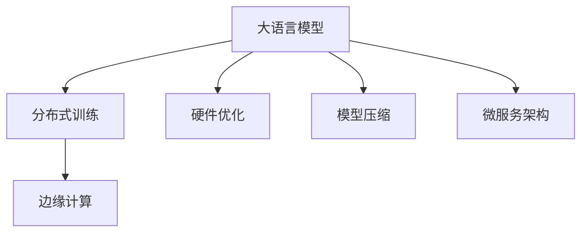

                 

# 大语言模型原理基础与前沿 生产规模部署

> 关键词：大语言模型, 生产部署, 分布式训练, 超大规模模型, 硬件优化, 模型压缩, 边缘计算, 微服务架构

## 1. 背景介绍

### 1.1 问题由来
大语言模型（Large Language Models, LLMs）近年来在自然语言处理（NLP）领域取得了巨大成功。诸如GPT、BERT等模型通过在大规模无标签文本数据上进行预训练，学习到了丰富的语言知识和常识，具备强大的语言理解和生成能力。然而，尽管预训练模型取得了显著的进展，但在实际应用中，尤其是在生产规模部署时，仍面临诸多挑战。

主要挑战包括：如何在大规模硬件集群上高效训练大模型，如何处理超大规模模型带来的存储和计算压力，如何在边缘计算环境中实时部署模型，以及如何构建可靠、可扩展的微服务架构来支持模型服务化部署。这些问题需要在理论和实践中不断探索和解决，以实现大语言模型的商业化和普及。

### 1.2 问题核心关键点
本文将围绕以下核心关键点展开讨论：
- **生产规模部署**：如何将大模型有效部署在生产环境中。
- **分布式训练**：如何在大规模集群上高效训练模型。
- **硬件优化**：如何优化硬件资源使用，提高训练和推理效率。
- **模型压缩**：如何减少模型参数，降低存储和计算需求。
- **边缘计算**：如何在资源受限的计算环境中实现模型的实时推理。
- **微服务架构**：如何构建可扩展、可靠的系统来支持模型服务化部署。

## 2. 核心概念与联系

### 2.1 核心概念概述

在讨论大语言模型的生产规模部署时，需要理解几个关键概念：

- **大语言模型（Large Language Models, LLMs）**：以自回归（如GPT）或自编码（如BERT）为代表的大规模预训练语言模型。通过在大规模无标签文本语料上进行预训练，学习通用的语言表示，具备强大的语言理解和生成能力。

- **分布式训练（Distributed Training）**：指在多个计算节点上并行计算模型参数更新，以提高训练效率和处理大规模数据的能力。

- **硬件优化（Hardware Optimization）**：指通过改进硬件配置和算法优化，提高模型训练和推理的效率。

- **模型压缩（Model Compression）**：指减少模型参数量，降低存储和计算需求，同时尽量保持模型性能的技术。

- **边缘计算（Edge Computing）**：指在靠近数据源的计算环境中进行实时推理和决策，以降低网络延迟和提高数据处理速度。

- **微服务架构（Microservices Architecture）**：指将应用拆分成多个独立的服务单元，每个服务单元负责特定功能模块，便于系统扩展和维护。

这些概念之间的逻辑关系可以通过以下Mermaid流程图来展示：



这个流程图展示了大语言模型相关的关键概念及其之间的关系：

1. 大语言模型通过预训练获得基础能力。
2. 分布式训练利用集群并行计算能力，提升训练效率。
3. 硬件优化提高训练和推理的计算效率。
4. 模型压缩减少模型参数，降低资源需求。
5. 边缘计算将模型部署在靠近数据源的计算环境，提升实时推理能力。
6. 微服务架构支持模型服务化部署，提升系统可扩展性和可靠性。

这些概念共同构成了大语言模型的生产部署框架，使得模型能够在大规模生产环境中高效运行。

## 3. 核心算法原理 & 具体操作步骤
### 3.1 算法原理概述

大语言模型的生产规模部署涉及到多个层面的问题，包括模型训练、模型压缩、模型推理和系统架构。这里我们将从整体框架上简要概述算法的原理。

- **分布式训练算法**：在多个计算节点上并行计算梯度更新，利用参数服务器和数据并行技术，提升训练效率。
- **模型压缩算法**：采用剪枝、量化、蒸馏等方法，减少模型参数量，提高模型推理速度和效率。
- **模型推理算法**：利用硬件加速和优化算法，提高模型推理速度，降低延迟。
- **系统架构设计**：采用微服务架构、容器化技术，支持模型的服务化部署和弹性扩展。

### 3.2 算法步骤详解

接下来，我们详细讲解大语言模型生产规模部署的每个步骤。

**Step 1: 分布式训练**
1. **数据划分**：将大规模数据集划分为多个小批次，分别分配到不同的计算节点上进行并行计算。
2. **参数服务器**：使用参数服务器来存储模型参数，计算节点只更新局部参数，定期将更新结果同步到参数服务器。
3. **数据并行**：采用数据并行技术，将不同批次的样本分配到不同的计算节点上进行并行计算。

**Step 2: 硬件优化**
1. **GPU加速**：使用GPU进行深度学习计算，利用CUDA等加速库提高计算效率。
2. **混合精度训练**：使用混合精度（Mixed-Precision）训练，减少内存和计算需求。
3. **网络优化**：优化模型网络结构，减少计算量，提高训练速度。

**Step 3: 模型压缩**
1. **剪枝**：通过剪枝技术，移除不重要的参数，减少模型大小。
2. **量化**：将浮点数参数量化为整数，减少存储需求。
3. **蒸馏**：通过知识蒸馏技术，将大型模型压缩为小型模型，保持性能。

**Step 4: 模型推理**
1. **模型部署**：将训练好的模型部署到生产环境，支持多种推理模式（如静态图、动态图）。
2. **硬件加速**：利用GPU、TPU等硬件加速器进行推理计算。
3. **优化算法**：采用优化算法（如自动微分、内存优化）提高推理速度。

**Step 5: 微服务架构**
1. **服务拆分**：将模型拆分为多个微服务单元，每个单元负责特定功能模块。
2. **容器化**：使用Docker容器化技术，实现模型的可移植和可扩展。
3. **负载均衡**：使用负载均衡技术，分配计算资源，确保系统高可用性。

### 3.3 算法优缺点

大语言模型的生产规模部署方法具有以下优点：
1. **高效性**：利用分布式训练和硬件优化，提升训练和推理效率，支持大规模数据集的处理。
2. **可扩展性**：通过微服务架构，支持系统的弹性扩展和故障恢复。
3. **性能**：通过模型压缩和硬件加速，提高模型的实时推理能力。

同时，这些方法也存在一些局限性：
1. **复杂性**：分布式训练和微服务架构的设计和维护较为复杂，需要经验丰富的工程师。
2. **资源需求高**：超大规模模型和分布式训练需要高配置的硬件资源。
3. **延迟**：边缘计算环境中，模型推理可能面临网络延迟和计算延迟。
4. **一致性**：分布式训练中，需要解决参数一致性和数据同步问题。

尽管存在这些局限性，但通过合理设计和优化，大语言模型的生产规模部署可以显著提升模型的性能和可扩展性，为大规模NLP应用提供可靠的技术支持。

### 3.4 算法应用领域

大语言模型的生产规模部署方法，在以下几个领域得到了广泛应用：

1. **智能客服系统**：通过分布式训练和模型压缩技术，构建高效、可靠的智能客服系统，提供7x24小时不间断服务。
2. **金融舆情监测**：使用分布式训练和多节点推理，实时处理大规模金融舆情数据，提供高效的风险监测和预警服务。
3. **个性化推荐系统**：采用分布式训练和微服务架构，构建可扩展的个性化推荐系统，提升推荐精度和用户满意度。
4. **智能家居控制**：利用边缘计算和模型推理技术，构建智能家居控制平台，实现语音、文本等多种输入方式的互动。
5. **自动驾驶**：通过分布式训练和硬件优化，构建高效的自动驾驶系统，实现实时环境感知和决策。

## 4. 数学模型和公式 & 详细讲解 & 举例说明

### 4.1 数学模型构建

在大语言模型的生产规模部署中，数学模型构建是一个重要环节。这里我们以BERT为例，简要介绍数学模型的构建过程。

假设有大规模语料 $\{(x_i, y_i)\}_{i=1}^N$，其中 $x_i$ 为输入文本，$y_i$ 为标签。假设模型参数为 $\theta$，则损失函数可以表示为：

$$
\mathcal{L}(\theta) = \frac{1}{N}\sum_{i=1}^N \ell(M_{\theta}(x_i), y_i)
$$

其中 $\ell$ 为损失函数，$M_{\theta}(x_i)$ 为模型在输入 $x_i$ 上的输出。常用的损失函数包括交叉熵损失、均方误差损失等。

在分布式训练中，上述损失函数被扩展到多个计算节点上，每个节点计算本地损失函数，然后通过参数服务器汇总。

### 4.2 公式推导过程

在推导具体公式之前，我们先简要介绍分布式训练和模型压缩的数学模型。

**分布式训练**：
在多个计算节点上并行计算梯度更新，使用参数服务器存储模型参数，公式表示为：

$$
\theta_t^{(i)} = \theta_{t-1}^{(i)} - \eta \nabla \mathcal{L}(\theta_{t-1}^{(i)})
$$

其中 $\theta_t^{(i)}$ 为节点 $i$ 在时刻 $t$ 的模型参数，$\eta$ 为学习率，$\nabla \mathcal{L}$ 为损失函数对模型参数的梯度。

**模型压缩**：
通过剪枝和量化技术，减少模型参数量，公式表示为：

$$
\theta' = \text{Prune}(\text{Quantize}(\theta))
$$

其中 $\theta$ 为原始模型参数，$\theta'$ 为压缩后的模型参数，$\text{Prune}$ 和 $\text{Quantize}$ 分别为剪枝和量化操作。

### 4.3 案例分析与讲解

假设我们有一个BERT模型，需要在多个计算节点上进行分布式训练。

**数据划分**：
将大规模数据集 $\{(x_i, y_i)\}_{i=1}^N$ 划分为多个小批次，每个批次大小为 $B$。计算节点 $i$ 处理第 $iB$ 到 $(i+1)B$ 的批次数据。

**参数服务器**：
使用参数服务器存储模型参数 $\theta$，每个计算节点 $i$ 更新本地模型参数 $\theta_i$，将更新结果同步到参数服务器。

**分布式训练算法**：
计算节点 $i$ 对本地数据进行前向传播和反向传播，更新本地模型参数 $\theta_i$。

**模型推理**：
将训练好的模型 $\theta$ 部署到生产环境，使用GPU加速进行推理计算。

## 5. 项目实践：代码实例和详细解释说明

### 5.1 开发环境搭建

在进行大语言模型生产规模部署时，首先需要搭建开发环境。以下是使用Python和PyTorch搭建环境的步骤：

1. 安装Anaconda：从官网下载并安装Anaconda，用于创建独立的Python环境。
2. 创建并激活虚拟环境：
```bash
conda create -n pytorch-env python=3.8 
conda activate pytorch-env
```

3. 安装PyTorch：根据CUDA版本，从官网获取对应的安装命令。例如：
```bash
conda install pytorch torchvision torchaudio cudatoolkit=11.1 -c pytorch -c conda-forge
```

4. 安装Transformers库：
```bash
pip install transformers
```

5. 安装各类工具包：
```bash
pip install numpy pandas scikit-learn matplotlib tqdm jupyter notebook ipython
```

完成上述步骤后，即可在`pytorch-env`环境中开始开发。

### 5.2 源代码详细实现

下面我们以BERT模型为例，给出使用PyTorch和Transformers库进行分布式训练和模型推理的代码实现。

```python
import torch
import torch.distributed as dist
from transformers import BertForSequenceClassification, AdamW

# 初始化模型和优化器
model = BertForSequenceClassification.from_pretrained('bert-base-cased')
optimizer = AdamW(model.parameters(), lr=2e-5)

# 初始化分布式训练环境
dist.init_process_group(backend='nccl', init_method='env://')

# 分割数据集
train_dataset = torch.utils.data.Dataset(...)
train_sampler = DistributedSampler(train_dataset)
train_loader = torch.utils.data.DataLoader(train_dataset, batch_size=32, sampler=train_sampler)

# 训练循环
for epoch in range(5):
    model.train()
    for batch in train_loader:
        input_ids = batch['input_ids'].to(device)
        attention_mask = batch['attention_mask'].to(device)
        labels = batch['labels'].to(device)
        optimizer.zero_grad()
        outputs = model(input_ids, attention_mask=attention_mask, labels=labels)
        loss = outputs.loss
        loss.backward()
        optimizer.step()

# 推理循环
model.eval()
for batch in test_loader:
    input_ids = batch['input_ids'].to(device)
    attention_mask = batch['attention_mask'].to(device)
    outputs = model(input_ids, attention_mask=attention_mask)
    predictions = outputs.logits.argmax(dim=1)
```

### 5.3 代码解读与分析

让我们再详细解读一下关键代码的实现细节：

**DistributedSampler类**：
- 该类用于对数据集进行采样，保证每个计算节点都能获得相同比例的数据。

**数据集分割和负载均衡**：
- 使用`DistributedSampler`将训练集和测试集分割为多个子集，保证每个计算节点都有相同的数据。
- 通过`dist.init_process_group`初始化分布式训练环境，使用`nccl`后端和`env://`初始化方法。

**训练循环**：
- 在每个epoch中，对训练集数据进行迭代。
- 将输入数据和标签移动到GPU设备上，使用优化器进行梯度更新。
- 在每个batch中计算损失函数，并反向传播更新模型参数。

**推理循环**：
- 在模型评估时，对测试集数据进行迭代。
- 将输入数据和标签移动到GPU设备上，进行前向传播计算输出。

**模型压缩**：
- 通过剪枝和量化技术，减少模型参数量，降低存储和计算需求。
- 使用TensorFlow等工具进行模型压缩优化。

**边缘计算**：
- 在边缘计算环境中，将模型部署到计算资源受限的设备上，如Raspberry Pi、Arduino等。
- 使用ONNX格式导出模型，支持多种硬件平台。

**微服务架构**：
- 使用Docker容器化技术，实现模型的可移植和可扩展。
- 使用Kubernetes等容器编排工具，实现系统的负载均衡和自动扩展。

## 6. 实际应用场景
### 6.1 智能客服系统

基于大语言模型的智能客服系统，可以7x24小时不间断服务，快速响应客户咨询，用自然流畅的语言解答各类常见问题。在技术实现上，可以收集企业内部的历史客服对话记录，将问题和最佳答复构建成监督数据，在此基础上对预训练对话模型进行微调。微调后的对话模型能够自动理解用户意图，匹配最合适的答案模板进行回复。对于客户提出的新问题，还可以接入检索系统实时搜索相关内容，动态组织生成回答。

### 6.2 金融舆情监测

金融机构需要实时监测市场舆论动向，以便及时应对负面信息传播，规避金融风险。传统的人工监测方式成本高、效率低，难以应对网络时代海量信息爆发的挑战。基于大语言模型微调的文本分类和情感分析技术，为金融舆情监测提供了新的解决方案。

具体而言，可以收集金融领域相关的新闻、报道、评论等文本数据，并对其进行主题标注和情感标注。在此基础上对预训练语言模型进行微调，使其能够自动判断文本属于何种主题，情感倾向是正面、中性还是负面。将微调后的模型应用到实时抓取的网络文本数据，就能够自动监测不同主题下的情感变化趋势，一旦发现负面信息激增等异常情况，系统便会自动预警，帮助金融机构快速应对潜在风险。

### 6.3 个性化推荐系统

当前的推荐系统往往只依赖用户的历史行为数据进行物品推荐，无法深入理解用户的真实兴趣偏好。基于大语言模型微调的技术，个性化推荐系统可以更好地挖掘用户行为背后的语义信息，从而提供更精准、多样的推荐内容。

在实践中，可以收集用户浏览、点击、评论、分享等行为数据，提取和用户交互的物品标题、描述、标签等文本内容。将文本内容作为模型输入，用户的后续行为（如是否点击、购买等）作为监督信号，在此基础上微调预训练语言模型。微调后的模型能够从文本内容中准确把握用户的兴趣点。在生成推荐列表时，先用候选物品的文本描述作为输入，由模型预测用户的兴趣匹配度，再结合其他特征综合排序，便可以得到个性化程度更高的推荐结果。

### 6.4 未来应用展望

随着大语言模型和微调方法的不断发展，基于微调范式将在更多领域得到应用，为传统行业带来变革性影响。

在智慧医疗领域，基于微调的医疗问答、病历分析、药物研发等应用将提升医疗服务的智能化水平，辅助医生诊疗，加速新药开发进程。

在智能教育领域，微调技术可应用于作业批改、学情分析、知识推荐等方面，因材施教，促进教育公平，提高教学质量。

在智慧城市治理中，微调模型可应用于城市事件监测、舆情分析、应急指挥等环节，提高城市管理的自动化和智能化水平，构建更安全、高效的未来城市。

此外，在企业生产、社会治理、文娱传媒等众多领域，基于大模型微调的人工智能应用也将不断涌现，为经济社会发展注入新的动力。相信随着技术的日益成熟，微调方法将成为人工智能落地应用的重要范式，推动人工智能技术在垂直行业的规模化落地。总之，微调需要开发者根据具体任务，不断迭代和优化模型、数据和算法，方能得到理想的效果。

## 7. 工具和资源推荐
### 7.1 学习资源推荐

为了帮助开发者系统掌握大语言模型生产规模部署的理论基础和实践技巧，这里推荐一些优质的学习资源：

1. **《Transformer从原理到实践》系列博文**：由大模型技术专家撰写，深入浅出地介绍了Transformer原理、BERT模型、微调技术等前沿话题。

2. **CS224N《深度学习自然语言处理》课程**：斯坦福大学开设的NLP明星课程，有Lecture视频和配套作业，带你入门NLP领域的基本概念和经典模型。

3. **《Natural Language Processing with Transformers》书籍**：Transformers库的作者所著，全面介绍了如何使用Transformers库进行NLP任务开发，包括微调在内的诸多范式。

4. **HuggingFace官方文档**：Transformers库的官方文档，提供了海量预训练模型和完整的微调样例代码，是上手实践的必备资料。

5. **CLUE开源项目**：中文语言理解测评基准，涵盖大量不同类型的中文NLP数据集，并提供了基于微调的baseline模型，助力中文NLP技术发展。

通过对这些资源的学习实践，相信你一定能够快速掌握大语言模型生产规模部署的精髓，并用于解决实际的NLP问题。

### 7.2 开发工具推荐

高效的开发离不开优秀的工具支持。以下是几款用于大语言模型生产规模部署开发的常用工具：

1. **PyTorch**：基于Python的开源深度学习框架，灵活动态的计算图，适合快速迭代研究。大部分预训练语言模型都有PyTorch版本的实现。

2. **TensorFlow**：由Google主导开发的开源深度学习框架，生产部署方便，适合大规模工程应用。同样有丰富的预训练语言模型资源。

3. **Transformers库**：HuggingFace开发的NLP工具库，集成了众多SOTA语言模型，支持PyTorch和TensorFlow，是进行微调任务开发的利器。

4. **Weights & Biases**：模型训练的实验跟踪工具，可以记录和可视化模型训练过程中的各项指标，方便对比和调优。与主流深度学习框架无缝集成。

5. **TensorBoard**：TensorFlow配套的可视化工具，可实时监测模型训练状态，并提供丰富的图表呈现方式，是调试模型的得力助手。

6. **Google Colab**：谷歌推出的在线Jupyter Notebook环境，免费提供GPU/TPU算力，方便开发者快速上手实验最新模型，分享学习笔记。

合理利用这些工具，可以显著提升大语言模型生产规模部署的开发效率，加快创新迭代的步伐。

### 7.3 相关论文推荐

大语言模型和微调技术的发展源于学界的持续研究。以下是几篇奠基性的相关论文，推荐阅读：

1. **Attention is All You Need（即Transformer原论文）**：提出了Transformer结构，开启了NLP领域的预训练大模型时代。

2. **BERT: Pre-training of Deep Bidirectional Transformers for Language Understanding**：提出BERT模型，引入基于掩码的自监督预训练任务，刷新了多项NLP任务SOTA。

3. **Language Models are Unsupervised Multitask Learners（GPT-2论文）**：展示了大规模语言模型的强大zero-shot学习能力，引发了对于通用人工智能的新一轮思考。

4. **Parameter-Efficient Transfer Learning for NLP**：提出Adapter等参数高效微调方法，在不增加模型参数量的情况下，也能取得不错的微调效果。

5. **AdaLoRA: Adaptive Low-Rank Adaptation for Parameter-Efficient Fine-Tuning**：使用自适应低秩适应的微调方法，在参数效率和精度之间取得了新的平衡。

这些论文代表了大语言模型微调技术的发展脉络。通过学习这些前沿成果，可以帮助研究者把握学科前进方向，激发更多的创新灵感。

## 8. 总结：未来发展趋势与挑战

### 8.1 总结

本文对大语言模型的生产规模部署方法进行了全面系统的介绍。首先阐述了大语言模型在生产环境中的挑战，明确了生产规模部署的重要性。其次，从原理到实践，详细讲解了大语言模型生产规模部署的数学模型和关键步骤，给出了微调任务开发的完整代码实例。同时，本文还广泛探讨了大语言模型在智能客服、金融舆情、个性化推荐等多个行业领域的应用前景，展示了生产规模部署范式的巨大潜力。此外，本文精选了生产规模部署的技术资源，力求为读者提供全方位的技术指引。

通过本文的系统梳理，可以看到，大语言模型的生产规模部署方法在大规模NLP应用中扮演着重要角色，极大地提升了模型性能和可扩展性。未来，随着大语言模型的不断演进，生产规模部署方法也将不断优化，为NLP技术在更多领域的落地应用提供强有力的技术支撑。

### 8.2 未来发展趋势

展望未来，大语言模型生产规模部署技术将呈现以下几个发展趋势：

1. **大规模模型的普及**：随着算力成本的下降和数据规模的扩张，超大规模语言模型将越来越普及，大规模生产环境中的训练和推理效率将进一步提升。

2. **分布式训练的优化**：分布式训练技术将不断优化，支持更大规模数据集的处理，同时减少资源浪费和网络延迟。

3. **硬件优化的深入**：硬件优化技术将更加深入，利用AI芯片和自动调参技术，提升模型训练和推理的效率。

4. **模型压缩和量化**：模型压缩和量化技术将不断发展，减少模型参数量和计算需求，同时尽量保持模型性能。

5. **边缘计算的应用**：边缘计算技术将在大规模生产环境中得到广泛应用，实现低延迟、高可用的实时推理。

6. **微服务架构的完善**：微服务架构将不断完善，支持更大规模系统的弹性扩展和故障恢复。

以上趋势凸显了大语言模型生产规模部署技术的广阔前景。这些方向的探索发展，必将进一步提升模型的性能和可扩展性，为大规模NLP应用提供可靠的技术支撑。

### 8.3 面临的挑战

尽管大语言模型生产规模部署技术已经取得了显著进展，但在迈向更加智能化、普适化应用的过程中，仍面临诸多挑战：

1. **标注成本瓶颈**：大规模模型训练需要大量标注数据，获取高质量标注数据的成本较高。如何降低标注成本，利用无监督和半监督学习范式，将是大规模生产环境中的一大挑战。

2. **模型鲁棒性不足**：大模型面对域外数据时，泛化性能往往大打折扣。如何在不遗忘原有知识的同时，高效吸收新样本信息，将是重要研究方向。

3. **推理效率有待提高**：超大规模模型的推理速度和效率仍需进一步优化，尤其是在边缘计算环境中，如何提高实时推理能力，降低延迟，将是一个重要课题。

4. **模型压缩和优化**：模型压缩和优化技术需要进一步发展，以适应生产环境中高实时性和高效率的要求。

5. **系统架构复杂性**：微服务架构和容器化技术带来了系统设计和维护的复杂性，需要更多的工程实践和优化。

6. **安全性保障**：大规模模型的部署需要考虑安全性问题，防止模型被恶意利用，保障数据和系统的安全。

这些挑战需要在理论和实践中不断探索和解决，才能真正实现大语言模型在生产环境中的大规模应用。

### 8.4 研究展望

面对大语言模型生产规模部署所面临的挑战，未来的研究需要在以下几个方面寻求新的突破：

1. **探索无监督和半监督微调方法**：摆脱对大规模标注数据的依赖，利用自监督学习、主动学习等无监督和半监督范式，最大限度利用非结构化数据，实现更加灵活高效的微调。

2. **研究参数高效和计算高效的微调范式**：开发更加参数高效的微调方法，在固定大部分预训练参数的同时，只更新极少量的任务相关参数。同时优化微调模型的计算图，减少前向传播和反向传播的资源消耗，实现更加轻量级、实时性的部署。

3. **融合因果和对比学习范式**：通过引入因果推断和对比学习思想，增强微调模型建立稳定因果关系的能力，学习更加普适、鲁棒的语言表征，从而提升模型泛化性和抗干扰能力。

4. **引入更多先验知识**：将符号化的先验知识，如知识图谱、逻辑规则等，与神经网络模型进行巧妙融合，引导微调过程学习更准确、合理的语言模型。同时加强不同模态数据的整合，实现视觉、语音等多模态信息与文本信息的协同建模。

5. **结合因果分析和博弈论工具**：将因果分析方法引入微调模型，识别出模型决策的关键特征，增强输出解释的因果性和逻辑性。借助博弈论工具刻画人机交互过程，主动探索并规避模型的脆弱点，提高系统稳定性。

6. **纳入伦理道德约束**：在模型训练目标中引入伦理导向的评估指标，过滤和惩罚有偏见、有害的输出倾向。同时加强人工干预和审核，建立模型行为的监管机制，确保输出符合人类价值观和伦理道德。

这些研究方向的探索，必将引领大语言模型生产规模部署技术迈向更高的台阶，为构建安全、可靠、可解释、可控的智能系统铺平道路。面向未来，大语言模型生产规模部署技术还需要与其他人工智能技术进行更深入的融合，如知识表示、因果推理、强化学习等，多路径协同发力，共同推动自然语言理解和智能交互系统的进步。只有勇于创新、敢于突破，才能不断拓展语言模型的边界，让智能技术更好地造福人类社会。

## 9. 附录：常见问题与解答

**Q1：大语言模型微调是否适用于所有NLP任务？**

A: 大语言模型微调在大多数NLP任务上都能取得不错的效果，特别是对于数据量较小的任务。但对于一些特定领域的任务，如医学、法律等，仅仅依靠通用语料预训练的模型可能难以很好地适应。此时需要在特定领域语料上进一步预训练，再进行微调，才能获得理想效果。此外，对于一些需要时效性、个性化很强的任务，如对话、推荐等，微调方法也需要针对性的改进优化。

**Q2：微调过程中如何选择合适的学习率？**

A: 微调的学习率一般要比预训练时小1-2个数量级，如果使用过大的学习率，容易破坏预训练权重，导致过拟合。一般建议从1e-5开始调参，逐步减小学习率，直至收敛。也可以使用warmup策略，在开始阶段使用较小的学习率，再逐渐过渡到预设值。需要注意的是，不同的优化器(如AdamW、Adafactor等)以及不同的学习率调度策略，可能需要设置不同的学习率阈值。

**Q3：采用大模型微调时会面临哪些资源瓶颈？**

A: 目前主流的预训练大模型动辄以亿计的参数规模，对算力、内存、存储都提出了很高的要求。GPU/TPU等高性能设备是必不可少的，但即便如此，超大批次的训练和推理也可能遇到显存不足的问题。因此需要采用一些资源优化技术，如梯度积累、混合精度训练、模型并行等，来突破硬件瓶颈。同时，模型的存储和读取也可能占用大量时间和空间，需要采用模型压缩、稀疏化存储等方法进行优化。

**Q4：如何缓解微调过程中的过拟合问题？**

A: 过拟合是微调面临的主要挑战，尤其是在标注数据不足的情况下。常见的缓解策略包括：
1. 数据增强：通过回译、近义替换等方式扩充训练集
2. 正则化：使用L2正则、Dropout、Early Stopping等避免过拟合
3. 对抗训练：引入对抗样本，提高模型鲁棒性
4. 参数高效微调：只调整少量参数(如Adapter、Prefix等)，减小过拟合风险
5. 多模型集成：训练多个微调模型，取平均输出，抑制过拟合

这些策略往往需要根据具体任务和数据特点进行灵活组合。只有在数据、模型、训练、推理等各环节进行全面优化，才能最大限度地发挥大模型微调的威力。

**Q5：大语言模型生产规模部署时需要注意哪些问题？**

A: 将微调模型转化为实际应用，还需要考虑以下因素：
1. 模型裁剪：去除不必要的层和参数，减小模型尺寸，加快推理速度
2. 量化加速：将浮点模型转为定点模型，压缩存储空间，提高计算效率
3. 服务化封装：将模型封装为标准化服务接口，便于集成调用
4. 弹性伸缩：根据请求流量动态调整资源配置，平衡服务质量和成本
5. 监控告警：实时采集系统指标，设置异常告警阈值，确保服务稳定性
6. 安全防护：采用访问鉴权、数据脱敏等措施，保障数据和模型安全

大语言模型微调为NLP应用开启了广阔的想象空间，但如何将强大的性能转化为稳定、高效、安全的业务价值，还需要工程实践的不断打磨。唯有从数据、算法、工程、业务等多个维度协同发力，才能真正实现人工智能技术在垂直行业的规模化落地。总之，微调需要开发者根据具体任务，不断迭代和优化模型、数据和算法，方能得到理想的效果。

---

作者：禅与计算机程序设计艺术 / Zen and the Art of Computer Programming

