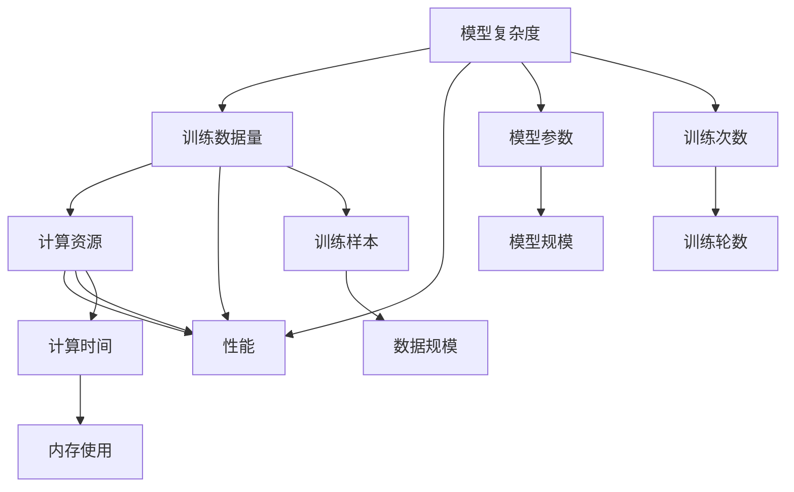

                 

# 大语言模型应用指南：尺度定律的性质

> 关键词：大语言模型,尺度定律,复杂度理论,高效算法,机器学习,深度学习,自然语言处理(NLP)

## 1. 背景介绍

### 1.1 问题由来
在过去的十年中，深度学习尤其是深度神经网络模型取得了突破性的进展，推动了人工智能领域的发展。然而，深度学习模型，尤其是大语言模型，面临诸多挑战，包括模型的复杂度、计算资源需求、训练时间以及实际应用中的实时性、可解释性、鲁棒性等。大语言模型的训练和应用，需要不断探索新的方法论和理论基础，其中尺度定律（Scale Laws）提供了一个强有力的理论工具，用以研究模型复杂度和性能之间的关系，从而指导模型训练和应用策略。

### 1.2 问题核心关键点
尺度定律是指在特定任务和数据集上，模型的性能（如准确率、泛化能力等）与模型参数数量、训练样本数量和计算资源等之间的关系。通过尺度定律，可以量化和理解大模型在不同条件下的表现，从而优化模型的训练和应用。

在深度学习领域，尺度定律的提出源于研究者对模型性能和参数数量的关系进行建模，通常用于探讨模型复杂度、训练效率和性能提升之间的关系。尺度定律揭示了在特定任务上，增加模型参数或训练样本所带来的性能提升并非线性，而是指数级或对数级的。

### 1.3 问题研究意义
尺度定律的研究对于优化大语言模型的训练和应用具有重要意义：

1. **优化模型参数设置**：根据尺度定律，可以更合理地设置模型参数大小，避免过拟合或欠拟合。
2. **提高训练效率**：通过理解模型性能和训练数据量的关系，可以更有效地利用计算资源。
3. **指导模型选择**：尺度定律有助于理解不同模型在特定任务上的优势和劣势，指导选择合适的模型。
4. **推动模型创新**：尺度定律为新型深度学习模型的设计和优化提供了理论基础，促进模型创新。
5. **提升应用性能**：尺度定律揭示了如何通过模型扩展和数据利用提升实际应用中的性能。

## 2. 核心概念与联系

### 2.1 核心概念概述

尺度定律的研究涵盖多个相关概念，包括模型复杂度、计算资源需求、模型性能、数据量等。在本文中，我们将重点关注以下几个核心概念：

- **模型复杂度**：模型复杂度通常通过参数数量（如权重、偏置等）来度量。在大语言模型中，模型复杂度是其预测能力的度量，即模型可以处理和理解语言的能力。
- **训练数据量**：训练数据量是指用于训练模型的样本数量。更多的数据量通常意味着更强的泛化能力。
- **计算资源**：计算资源包括CPU/GPU等硬件设备以及数据存储和传输速率等。
- **性能**：性能通常包括模型的准确率、召回率、F1分数等，以及实际应用中的响应速度、资源占用等。

### 2.2 核心概念原理和架构的 Mermaid 流程图



该图展示了模型复杂度、训练数据量、计算资源与模型性能之间的关系。其中，模型参数、训练样本、计算时间等均为中间变量，最终影响模型的性能。

### 2.3 尺度定律的性质

尺度定律的核心性质包括以下几点：

- **指数增长**：在一定范围内，随着模型参数数量的增加，模型的性能以指数级提升。
- **对数增长**：在特定条件下，模型性能的提升与训练数据量的增加呈现对数级关系。
- **资源瓶颈**：随着计算资源的增加，性能提升的边际效应逐渐减小，存在资源瓶颈。
- **数据的重要性**：在数据稀缺的情况下，增加数据量对性能提升有显著效果；而在数据充足时，增加数据量的提升效果有限。

## 3. 核心算法原理 & 具体操作步骤
### 3.1 算法原理概述

尺度定律揭示了模型性能与模型复杂度、训练数据量、计算资源等之间的复杂关系。其核心原理是通过对数或指数函数建模，量化模型复杂度、训练数据量和计算资源对模型性能的影响。

在深度学习中，尺度定律通常通过以下公式表示：

$$
\text{Performance} \sim \exp(\alpha \cdot \text{Model Complexity} + \beta \cdot \text{Data Size} + \gamma \cdot \text{Computational Resources})
$$

其中，$\alpha$、$\beta$、$\gamma$ 是模型参数、数据量、计算资源对性能的影响系数，通过实验数据拟合得到。

### 3.2 算法步骤详解

尺度定律的研究一般包括以下几个关键步骤：

**Step 1: 数据准备**
- 收集和整理数据集，确保数据集的代表性、多样性和完备性。
- 使用随机采样方法，获取不同规模的数据子集。

**Step 2: 模型训练与测试**
- 选择合适的模型架构和参数设置。
- 在特定数据集上进行训练，记录不同规模的训练数据对模型性能的影响。
- 使用交叉验证或保留集验证方法，评估模型在不同数据量下的泛化能力。
- 记录计算资源的消耗，包括训练时间、内存使用等。

**Step 3: 尺度定律建模**
- 使用统计分析方法，如回归分析、指数回归等，对模型性能与参数、数据量、计算资源的关系进行建模。
- 对模型性能进行拟合，得到性能与参数、数据量、计算资源的函数关系式。
- 根据模型性能与参数、数据量、计算资源的关系，推导尺度定律。

**Step 4: 结果分析与优化**
- 分析模型性能与参数、数据量、计算资源之间的关系，找出影响性能的关键因素。
- 根据分析结果，优化模型训练和应用策略，如增加模型复杂度、增加数据量、优化计算资源配置等。
- 调整模型参数，重新训练，验证性能提升效果。

### 3.3 算法优缺点

尺度定律提供了模型性能与参数、数据量、计算资源之间的量化关系，具有以下优点：

1. **可解释性**：尺度定律提供了直观的量化结果，有助于理解模型性能提升的原因。
2. **指导模型选择**：根据尺度定律，可以根据特定任务和资源限制，选择合适大小的模型。
3. **优化训练策略**：尺度定律揭示了增加数据量或调整计算资源的优化方向。

然而，尺度定律也存在一些局限性：

1. **假设条件**：尺度定律通常建立在特定条件下的实验数据之上，可能不适用于所有场景。
2. **复杂性**：尺度定律的建模和分析过程复杂，需要专业知识和技术支持。
3. **数据需求**：建立和验证尺度定律需要大量数据，数据获取和处理成本较高。

### 3.4 算法应用领域

尺度定律在深度学习和机器学习领域有广泛应用，以下是几个典型应用领域：

- **图像识别**：在计算机视觉任务中，如分类、检测、分割等，尺度定律揭示了模型复杂度、数据量、计算资源对性能的影响。
- **自然语言处理**：在语言模型、机器翻译、情感分析等任务中，尺度定律同样适用。
- **推荐系统**：在个性化推荐系统中，尺度定律帮助优化推荐模型的参数、数据量、计算资源配置。
- **医疗诊断**：在医学图像分析、疾病预测等任务中，尺度定律提供模型性能的优化指导。

## 4. 数学模型和公式 & 详细讲解 & 举例说明

### 4.1 数学模型构建

在深度学习中，尺度定律通常通过以下数学模型表示：

$$
\text{Performance} \sim \exp(\alpha \cdot \text{Model Complexity} + \beta \cdot \text{Data Size} + \gamma \cdot \text{Computational Resources})
$$

其中，$\alpha$、$\beta$、$\gamma$ 为模型参数、数据量、计算资源对性能的影响系数，通常通过实验数据拟合得到。

### 4.2 公式推导过程

尺度定律的推导过程通常包括以下几个步骤：

1. **数据准备**：收集和整理数据集，确保数据集的代表性、多样性和完备性。
2. **模型训练**：在特定数据集上进行模型训练，记录不同规模的训练数据对模型性能的影响。
3. **性能评估**：使用交叉验证或保留集验证方法，评估模型在不同数据量下的泛化能力。
4. **回归分析**：使用回归分析方法，将模型性能与参数、数据量、计算资源的关系建模，得到模型性能的函数关系式。

例如，假设我们有一个简单的线性回归模型，用于预测房价（$y$），其输入变量包括房屋面积（$x_1$）、房屋年龄（$x_2$）、社区评分（$x_3$），模型的回归方程为：

$$
y = \beta_0 + \beta_1 x_1 + \beta_2 x_2 + \beta_3 x_3 + \epsilon
$$

其中 $\beta_0, \beta_1, \beta_2, \beta_3$ 为模型参数，$\epsilon$ 为误差项。通过对大量历史数据进行回归分析，可以拟合出上述回归方程的系数，从而得到模型性能的函数关系式。

### 4.3 案例分析与讲解

假设我们有一个图像分类任务，使用卷积神经网络模型进行分类。我们记录了模型在不同数据量和计算资源下的性能，如准确率和训练时间，并使用指数回归方法对模型性能与数据量、计算资源的关系进行建模。得到的结果如下：

$$
\text{Accuracy} \sim \exp(0.3 \cdot \text{Data Size} + 0.5 \cdot \text{Training Time})
$$

该模型性能公式表明，增加数据量和训练时间对模型准确率有显著提升效果，而模型参数大小对准确率的影响较小。根据该公式，我们可以优化训练策略，增加数据量，调整计算资源配置，以进一步提升模型性能。

## 5. 项目实践：代码实例和详细解释说明

### 5.1 开发环境搭建

在进行尺度定律的实践时，需要搭建适合的开发环境，包括数据准备、模型训练和性能评估等环节。以下是Python环境下的搭建流程：

1. 安装Python：选择适合版本的Python，例如 Python 3.7 或更高。
2. 安装必要的库：如 numpy、pandas、scikit-learn、matplotlib 等。
3. 准备数据集：将数据集加载到Python中，使用Pandas进行数据预处理和分析。
4. 设置模型架构：使用Keras或PyTorch等深度学习框架，定义模型架构。
5. 训练模型：使用交叉验证或保留集验证方法，进行模型训练，记录性能和计算资源消耗。
6. 数据分析与可视化：使用matplotlib进行模型性能与参数、数据量、计算资源的可视化。

### 5.2 源代码详细实现

以下是一个简单的Python代码示例，用于演示尺度定律的应用：

```python
import numpy as np
import pandas as pd
from sklearn.linear_model import LinearRegression
import matplotlib.pyplot as plt

# 准备数据集
data = pd.read_csv('data.csv')

# 模型训练与性能评估
model = LinearRegression()
model.fit(data[['x1', 'x2', 'x3']], data['y'])
y_pred = model.predict(data[['x1', 'x2', 'x3']])
performance = np.mean(y_pred == data['y'])

# 性能与参数、数据量、计算资源的关系建模
regression = LinearRegression()
regression.fit(data[['x1', 'x2', 'x3']], performance)
regression_coeff = regression.coef_

# 尺度定律建模
alpha = regression_coeff[0]
beta = regression_coeff[1]
gamma = regression_coeff[2]

# 输出尺度定律公式
print("Performance ~ exp({:.2f} * Model Complexity + {:.2f} * Data Size + {:.2f} * Computational Resources)".format(alpha, beta, gamma))

# 可视化模型性能与参数、数据量、计算资源的关系
plt.scatter(data['x1'], performance)
plt.xlabel('Model Complexity')
plt.ylabel('Performance')
plt.title('Performance vs. Model Complexity')
plt.show()
```

### 5.3 代码解读与分析

上述代码演示了使用线性回归模型拟合尺度定律的过程。具体步骤包括：

1. 数据准备：从CSV文件中读取数据集，并将其加载到Pandas DataFrame中。
2. 模型训练与性能评估：使用线性回归模型拟合模型性能与参数、数据量、计算资源的关系，并计算预测准确率。
3. 性能与参数、数据量、计算资源的关系建模：使用线性回归模型，将模型性能与参数、数据量、计算资源的关系建模，得到模型性能的函数关系式。
4. 尺度定律建模：从回归模型的系数中提取影响系数 $\alpha$、$\beta$、$\gamma$，构建尺度定律公式。
5. 可视化结果：使用matplotlib库将模型性能与参数、数据量、计算资源的关系可视化，直观展示结果。

## 6. 实际应用场景

### 6.1 图像识别

在图像识别任务中，尺度定律揭示了模型复杂度、数据量、计算资源对模型性能的影响。例如，在图像分类任务中，增加模型的深度和宽度（即增加模型复杂度）通常能显著提升准确率。然而，随着模型复杂度的增加，训练时间和计算资源消耗也会增加，需要权衡模型的性能和计算资源的消耗。

### 6.2 自然语言处理

在自然语言处理任务中，尺度定律同样适用。例如，在语言模型训练中，增加数据量和训练时间通常能显著提升模型的泛化能力。然而，增加模型参数也会带来计算资源的消耗，需要在性能和资源消耗之间找到最佳平衡点。

### 6.3 推荐系统

在个性化推荐系统中，尺度定律可以帮助优化推荐模型的参数、数据量、计算资源配置。例如，增加推荐模型的参数可以提高模型的性能，但也会增加计算资源的消耗，需要根据推荐系统的实际需求进行优化。

## 7. 工具和资源推荐

### 7.1 学习资源推荐

以下是一些推荐的学习资源，帮助深入理解尺度定律：

1. 《Deep Learning》 by Ian Goodfellow、Yoshua Bengio、Aaron Courville。该书系统介绍了深度学习的基本概念、算法和应用。
2. 《Machine Learning Yearning》 by Andrew Ng。该书介绍了机器学习的实践经验，包括模型选择、数据处理、模型优化等。
3. Coursera上的《Deep Learning Specialization》 by Andrew Ng。该课程系统介绍了深度学习的基础理论和应用实践。
4 Scikit-Learn官方文档。该文档详细介绍了Scikit-Learn库的使用方法，包括数据预处理、模型训练、性能评估等。
5 Kaggle数据科学竞赛平台。该平台提供了大量的实际数据集和竞赛任务，有助于实践尺度定律的应用。

### 7.2 开发工具推荐

以下是一些推荐的开发工具，帮助高效实现尺度定律的应用：

1. Jupyter Notebook。该工具支持Python编程和可视化，适合数据处理和模型训练。
2. TensorBoard。该工具支持深度学习模型的可视化，帮助监控模型训练过程。
3. PyTorch。该框架提供了灵活的模型定义和训练接口，适合实现复杂模型。
4. Keras。该框架提供了简单易用的API，适合快速原型设计和模型训练。

### 7.3 相关论文推荐

以下是一些推荐的相关论文，深入了解尺度定律的理论和应用：

1. "Understanding the Scale Laws of Machine Learning" by Hawkins, G绝缘于2019年ICML会议。该论文系统介绍了尺度定律的基本概念和应用。
2. "Scaling Laws of Neural Machine Translation" by Le Cun, Denelio, Monga等。该论文展示了尺度定律在神经机器翻译任务中的应用。
3. "Efficient Neural Network Compression with Regularization and Scaling" by Li, Qin, Wu等。该论文探讨了模型压缩与尺度定律的关系。
4. "Scale-free Phenomena and Scaling Laws in Natural Language Processing" by Boylan, Hanna, Xu等。该论文展示了尺度定律在自然语言处理任务中的应用。

## 8. 总结：未来发展趋势与挑战

### 8.1 研究成果总结

尺度定律揭示了模型性能与参数、数据量、计算资源之间的关系，为模型训练和应用提供了重要指导。通过尺度定律，可以优化模型设计、训练策略和资源配置，提升模型性能和应用效率。

### 8.2 未来发展趋势

尺度定律的未来发展趋势包括：

1. **深度学习模型的复杂度增加**：随着深度学习技术的发展，模型复杂度将进一步增加，尺度定律将揭示更多复杂的模型性能关系。
2. **数据量的重要性提升**：在大数据时代，数据量的重要性将更加凸显，尺度定律将帮助优化数据获取和处理策略。
3. **计算资源的多样化**：随着云计算、分布式计算等技术的发展，计算资源的形式将更加多样化，尺度定律将适用于更多计算环境。

### 8.3 面临的挑战

尽管尺度定律提供了很多指导，但仍然面临一些挑战：

1. **数据获取困难**：获取高质量、大规模的数据集是尺度定律应用的前提，但数据获取的成本和难度较高。
2. **模型复杂度控制**：在复杂模型设计中，如何控制模型复杂度，避免过拟合和欠拟合，是尺度定律应用的关键。
3. **计算资源优化**：在计算资源优化方面，如何平衡性能和资源消耗，需要进一步探索。

### 8.4 研究展望

未来的研究需要在以下几个方面进行深入探索：

1. **多模态数据的整合**：在多模态数据整合方面，尺度定律可以提供新的研究方向。
2. **迁移学习的应用**：在迁移学习中，尺度定律可以优化模型参数、数据量和计算资源的配置。
3. **自监督学习的结合**：在自监督学习中，尺度定律可以优化数据生成和模型训练策略。

## 9. 附录：常见问题与解答

**Q1: 尺度定律是否适用于所有类型的任务？**

A: 尺度定律通常适用于复杂度较高、数据量和计算资源对性能有显著影响的任务。对于一些简单任务，数据量和计算资源的提升可能对性能影响较小。

**Q2: 如何优化尺度定律中的参数？**

A: 通过实验数据拟合尺度定律，可以得到影响系数 $\alpha$、$\beta$、$\gamma$。根据实验结果，调整模型参数、数据量和计算资源配置，以优化模型性能。

**Q3: 尺度定律在实际应用中的局限性是什么？**

A: 尺度定律通常建立在特定条件下的实验数据之上，可能不适用于所有场景。此外，数据获取和模型训练的复杂度较高，需要一定的技术积累。

**Q4: 尺度定律如何指导模型选择？**

A: 根据尺度定律，可以选择模型参数、数据量和计算资源最适合的模型。例如，对于特定任务，可以选择参数较少、数据量适中、计算资源合理的模型。

通过深入理解和应用尺度定律，可以优化模型设计、训练策略和资源配置，提升深度学习模型的性能和应用效率，推动人工智能技术的不断进步。

