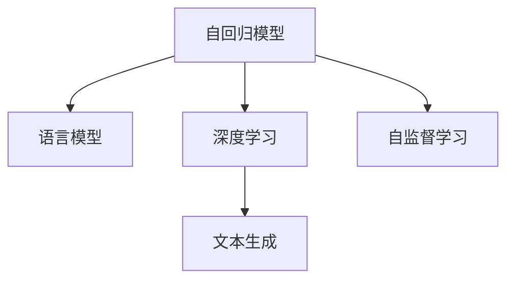

                 

# 大语言模型应用指南：自回归模型与文本生成

> 关键词：自回归模型, 文本生成, 语言模型, 自然语言处理(NLP), 神经网络, 深度学习

## 1. 背景介绍

### 1.1 问题由来
在人工智能的迅猛发展中，自然语言处理(Natural Language Processing, NLP)作为核心领域之一，受到越来越多的关注。而大语言模型(Large Language Models, LLMs)的崛起，更是将NLP的性能推向了一个新的高峰。自回归模型(Autoregressive Models)作为大语言模型的核心架构之一，已经在文本生成、语音合成、机器翻译、对话系统等诸多领域展现出了强大的能力。

### 1.2 问题核心关键点
自回归模型是一种基于时间序列或空间序列的模型，其中每个时间步（或空间点）的输出都依赖于其前一步（或前点）的输出，从而实现序列数据的生成或预测。在文本生成任务中，自回归模型通常通过预测下一个单词或字符来生成文本。自回归模型具有良好的序列建模能力，可以捕捉到文本中的上下文信息，从而生成连贯、流畅的文本。

当前，自回归模型已经在GPT、T5等大模型中得到了广泛应用。GPT系列模型使用自回归解码器，通过对大量文本数据进行自监督预训练，学习了语言的知识表示，能够生成高质量的文本。T5模型则使用自回归编码器，将文本转化为向量表示，并通过微调进行下游任务处理。

自回归模型在文本生成中的应用广泛，既适用于生成原创文章、故事、对话，也可以用于文本修复、数据增强等任务。例如，使用自回归模型可以对文本进行自动化摘要、风格转换、翻译等操作。

### 1.3 问题研究意义
研究自回归模型在文本生成中的应用，对于提升大语言模型的性能，拓展文本生成技术的应用场景，具有重要意义：

1. 提高生成文本的质量：自回归模型能够学习到丰富的语言知识，生成的文本更加连贯、流畅，能够更好地反映语言的自然性。
2. 扩展文本生成技术：自回归模型可以应用于生成各种类型的文本，包括对话、新闻报道、小说等，为NLP技术的应用提供了更多可能性。
3. 加速文本处理任务：通过自回归模型，可以实现文本的自动摘要、翻译、风格转换等，大幅提高文本处理的速度和效率。
4. 推动NLP技术产业化：自回归模型生成的文本可以用于机器人客服、智能推荐、自动化写作等场景，推动NLP技术在各行各业的落地应用。

## 2. 核心概念与联系

### 2.1 核心概念概述

为更好地理解自回归模型在文本生成中的应用，本节将介绍几个密切相关的核心概念：

- 自回归模型(Autoregressive Model)：模型中每个时间步的输出都依赖于前一步的输出，从而实现序列数据的生成或预测。
- 语言模型(Language Model)：用于描述和预测文本序列的概率分布，常见的有n-gram模型、神经网络语言模型等。
- 深度学习(Deep Learning)：利用多层神经网络结构，通过反向传播算法进行训练，从而解决复杂问题。
- 文本生成(Text Generation)：生成与输入文本语义相似的文本，可以用于文本编辑、翻译、自动化写作等。
- 自监督学习(Self-Supervised Learning)：利用无标签数据进行训练，如掩码语言模型、下标预测等。

这些核心概念之间的逻辑关系可以通过以下Mermaid流程图来展示：



这个流程图展示了一些关键概念及其之间的关系：

1. 自回归模型是语言模型的重要组成部分，可以通过序列数据进行建模。
2. 深度学习提供了自回归模型训练的有效工具，通过反向传播算法进行模型优化。
3. 文本生成是自回归模型的主要应用场景，生成高质量的文本。
4. 自监督学习是训练自回归模型的主要方式，利用无标签数据学习语言知识。

这些概念共同构成了自回归模型在文本生成中的基本框架，为其应用提供了理论基础。

## 3. 核心算法原理 & 具体操作步骤
### 3.1 算法原理概述

自回归模型在文本生成中的应用主要依赖于语言模型，通过预测文本序列中的下一个单词或字符，生成连贯的文本。其核心思想是：

1. 给定前 $t-1$ 个单词或字符，预测第 $t$ 个单词或字符。
2. 通过循环迭代，生成整个文本序列。

具体而言，自回归模型可以通过条件概率模型来描述，即：

$$
P(x_t|x_1, x_2, \ldots, x_{t-1}) = \frac{e^{f(x_t, x_{t-1}, \ldots, x_1; \theta)}}{\sum_{x \in \mathcal{V}} e^{f(x, x_{t-1}, \ldots, x_1; \theta)}}
$$

其中，$f(\cdot)$ 是模型的预测函数，$\theta$ 是模型参数，$\mathcal{V}$ 是词汇表。

在文本生成中，自回归模型通常采用Transformer架构，通过多层自注意力机制捕捉文本中的上下文信息。其基本流程如下：

1. 对输入文本进行编码，得到文本的向量表示。
2. 通过Transformer的解码器，逐步预测下一个单词或字符。
3. 对预测结果进行解码，得到最终生成的文本。

### 3.2 算法步骤详解

自回归模型在文本生成中的操作步骤如下：

**Step 1: 准备预训练模型和数据集**
- 选择合适的自回归模型，如GPT、T5等，作为初始化参数。
- 准备文本生成任务的数据集，划分为训练集、验证集和测试集。

**Step 2: 添加任务适配层**
- 根据文本生成任务的类型，在自回归模型顶层设计合适的输出层和损失函数。
- 对于分类任务，通常在顶层添加线性分类器和交叉熵损失函数。
- 对于生成任务，通常使用语言模型的解码器输出概率分布，并以负对数似然为损失函数。

**Step 3: 设置训练超参数**
- 选择合适的优化算法及其参数，如AdamW、SGD等，设置学习率、批大小、迭代轮数等。
- 设置正则化技术及强度，包括权重衰减、Dropout、Early Stopping等。
- 确定冻结预训练参数的策略，如仅微调顶层，或全部参数都参与微调。

**Step 4: 执行梯度训练**
- 将训练集数据分批次输入模型，前向传播计算损失函数。
- 反向传播计算参数梯度，根据设定的优化算法和学习率更新模型参数。
- 周期性在验证集上评估模型性能，根据性能指标决定是否触发 Early Stopping。
- 重复上述步骤直到满足预设的迭代轮数或 Early Stopping 条件。

**Step 5: 测试和部署**
- 在测试集上评估自回归模型的性能，对比微调前后的生成质量。
- 使用自回归模型对新样本进行推理预测，集成到实际的应用系统中。

以上是自回归模型在文本生成中的应用流程。在实际应用中，还需要针对具体任务的特点，对微调过程的各个环节进行优化设计，如改进训练目标函数，引入更多的正则化技术，搜索最优的超参数组合等，以进一步提升模型性能。

### 3.3 算法优缺点

自回归模型在文本生成中具有以下优点：
1. 简单高效。只需准备少量标注数据，即可对预训练模型进行快速适配，生成高质量的文本。
2. 泛化能力强。自回归模型通过预训练学习到的语言知识，能够生成多种类型的文本，具有很强的泛化能力。
3. 可解释性强。自回归模型的生成过程可以理解，通过前向传播可以解释模型的每一步决策。
4. 适应性强。自回归模型可以适应不同长度和风格的文本生成任务，具有较高的灵活性。

同时，该方法也存在一定的局限性：
1. 依赖标注数据。自回归模型生成高质量文本需要大量的标注数据，获取高质量标注数据的成本较高。
2. 训练时间长。由于自回归模型通常需要迭代多次生成新文本，训练时间较长，对计算资源要求高。
3. 生成文本多样性有限。自回归模型在训练时依赖已有数据，生成的文本可能存在一定的模式性，缺乏多样性。

尽管存在这些局限性，但就目前而言，自回归模型仍然是文本生成领域的主流范式。未来相关研究的重点在于如何进一步降低对标注数据的依赖，提高生成文本的多样性和泛化能力，同时兼顾可解释性和伦理安全性等因素。

### 3.4 算法应用领域

自回归模型在文本生成中的应用广泛，包括但不限于以下几个领域：

- 自然语言生成(NLG)：自动生成新闻报道、小说、故事、对话等文本。
- 文本摘要：对长文本进行自动摘要，生成简洁的总结。
- 机器翻译：将一种语言的文本翻译成另一种语言的文本。
- 文本修复：对文本进行自动修复、去噪、纠错等操作。
- 代码生成：自动生成代码，辅助编程。
- 数据增强：生成新的训练数据，增强模型的泛化能力。

除了上述这些经典应用外，自回归模型还被创新性地应用到更多场景中，如可控文本生成、文本风格迁移、文本多样性生成等，为NLP技术带来了全新的突破。随着预训练模型和生成方法的不断进步，相信自回归模型将在更多领域得到应用，为自然语言理解和智能交互系统的进步提供新的动力。

## 4. 数学模型和公式 & 详细讲解  
### 4.1 数学模型构建

自回归模型在文本生成中的应用，可以通过以下数学模型进行描述：

假设输入文本为 $\{x_t\}_{t=1}^T$，其中 $T$ 为文本长度，目标是为每个时间步 $t$ 预测下一个单词或字符 $x_{t+1}$。则自回归模型的条件概率模型为：

$$
P(x_{t+1}|x_1, x_2, \ldots, x_t) = \frac{e^{f(x_{t+1}, x_t, \ldots, x_1; \theta)}}{\sum_{x \in \mathcal{V}} e^{f(x, x_t, \ldots, x_1; \theta)}}
$$

其中，$f(\cdot)$ 是自回归模型的预测函数，$\theta$ 是模型参数，$\mathcal{V}$ 是词汇表。

自回归模型通常使用Transformer结构进行建模，通过多层自注意力机制和全连接层捕捉文本的上下文信息。在生成每个单词或字符时，自回归模型通过解码器对输入的文本向量进行预测，得到下一个单词或字符的概率分布。然后，根据概率分布进行采样，生成下一个单词或字符。

### 4.2 公式推导过程

以下我们以自回归模型在文本生成中的应用为例，推导条件概率模型的公式及其推导过程。

假设模型使用Transformer架构，其中包含编码器 $E$ 和解码器 $D$。编码器 $E$ 将输入文本 $x_1, x_2, \ldots, x_t$ 编码为向量表示 $h_t = E(x_1, x_2, \ldots, x_t)$，解码器 $D$ 则对 $h_t$ 进行解码，得到下一个单词或字符的概率分布 $P(x_{t+1}|h_t; \theta)$。

根据自回归模型的定义，条件概率模型为：

$$
P(x_{t+1}|x_1, x_2, \ldots, x_t) = P(x_{t+1}|h_t; \theta)
$$

其中，$h_t = E(x_1, x_2, \ldots, x_t)$。

根据自注意力机制和全连接层的定义，解码器 $D$ 的预测函数为：

$$
P(x_{t+1}|h_t; \theta) = \frac{e^{f(x_{t+1}, h_t; \theta)}}{\sum_{x \in \mathcal{V}} e^{f(x, h_t; \theta)}}
$$

其中，$f(\cdot)$ 为解码器的预测函数，$\theta$ 为模型参数，$\mathcal{V}$ 为词汇表。

在实际应用中，为了加速模型的训练和推理，通常对解码器的预测函数进行优化，使用缓存机制保存已经生成的文本片段，避免重复计算。同时，采用前后向解码器（即先编码再解码），可以进一步提高生成速度和效率。

### 4.3 案例分析与讲解

以GPT-3为例，分析其自回归模型在文本生成中的应用：

1. **编码器设计**：GPT-3使用Transformer架构，包含12层自注意力机制和全连接层。在编码器中，将输入文本 $x_1, x_2, \ldots, x_t$ 编码为向量表示 $h_t = E(x_1, x_2, \ldots, x_t)$，其中 $E$ 为编码器网络。

2. **解码器设计**：GPT-3的解码器同样使用Transformer架构，通过多层自注意力机制和全连接层捕捉文本的上下文信息。在生成每个单词或字符时，解码器对 $h_t$ 进行解码，得到下一个单词或字符的概率分布 $P(x_{t+1}|h_t; \theta)$。

3. **训练过程**：GPT-3在大量无标签文本数据上进行自监督预训练，学习到语言的知识表示。然后使用大规模标注数据集进行微调，优化模型在特定任务上的性能。

4. **生成过程**：在生成文本时，GPT-3使用解码器对输入的文本向量进行预测，得到下一个单词或字符的概率分布。然后根据概率分布进行采样，生成下一个单词或字符，逐步生成整个文本序列。

GPT-3通过自回归模型在文本生成中的应用，展示了自回归模型在生成高质量文本方面的强大能力。其生成的文本具有连贯性、多样性和自然性，广泛应用于文本摘要、机器翻译、对话系统等诸多领域。

## 5. 项目实践：代码实例和详细解释说明
### 5.1 开发环境搭建

在进行文本生成实践前，我们需要准备好开发环境。以下是使用Python进行PyTorch开发的环境配置流程：

1. 安装Anaconda：从官网下载并安装Anaconda，用于创建独立的Python环境。

2. 创建并激活虚拟环境：
```bash
conda create -n pytorch-env python=3.8 
conda activate pytorch-env
```

3. 安装PyTorch：根据CUDA版本，从官网获取对应的安装命令。例如：
```bash
conda install pytorch torchvision torchaudio cudatoolkit=11.1 -c pytorch -c conda-forge
```

4. 安装Transformers库：
```bash
pip install transformers
```

5. 安装各类工具包：
```bash
pip install numpy pandas scikit-learn matplotlib tqdm jupyter notebook ipython
```

完成上述步骤后，即可在`pytorch-env`环境中开始文本生成实践。

### 5.2 源代码详细实现

下面我们以使用GPT-3进行文本生成为例，给出使用Transformers库进行文本生成的PyTorch代码实现。

首先，定义生成任务的数据处理函数：

```python
from transformers import GPT3Tokenizer
from torch.utils.data import Dataset
import torch

class TextGenerationDataset(Dataset):
    def __init__(self, texts, tokenizer, max_length=512):
        self.texts = texts
        self.tokenizer = tokenizer
        self.max_length = max_length
        
    def __len__(self):
        return len(self.texts)
    
    def __getitem__(self, item):
        text = self.texts[item]
        
        encoding = self.tokenizer(text, return_tensors='pt', max_length=self.max_length, padding='max_length', truncation=True)
        input_ids = encoding['input_ids'][0]
        attention_mask = encoding['attention_mask'][0]
        
        return {'input_ids': input_ids, 
                'attention_mask': attention_mask}

# 创建dataset
tokenizer = GPT3Tokenizer.from_pretrained('gpt3')
train_dataset = TextGenerationDataset(train_texts, tokenizer)
dev_dataset = TextGenerationDataset(dev_texts, tokenizer)
test_dataset = TextGenerationDataset(test_texts, tokenizer)
```

然后，定义模型和优化器：

```python
from transformers import GPT3LMHeadModel
from transformers import AdamW

model = GPT3LMHeadModel.from_pretrained('gpt3')
optimizer = AdamW(model.parameters(), lr=1e-4)
```

接着，定义训练和评估函数：

```python
from torch.utils.data import DataLoader
from tqdm import tqdm
from sklearn.metrics import bleu_score

device = torch.device('cuda') if torch.cuda.is_available() else torch.device('cpu')
model.to(device)

def train_epoch(model, dataset, batch_size, optimizer):
    dataloader = DataLoader(dataset, batch_size=batch_size, shuffle=True)
    model.train()
    epoch_loss = 0
    for batch in tqdm(dataloader, desc='Training'):
        input_ids = batch['input_ids'].to(device)
        attention_mask = batch['attention_mask'].to(device)
        model.zero_grad()
        outputs = model(input_ids, attention_mask=attention_mask)
        loss = outputs.loss
        epoch_loss += loss.item()
        loss.backward()
        optimizer.step()
    return epoch_loss / len(dataloader)

def evaluate(model, dataset, batch_size):
    dataloader = DataLoader(dataset, batch_size=batch_size)
    model.eval()
    preds, labels = [], []
    with torch.no_grad():
        for batch in tqdm(dataloader, desc='Evaluating'):
            input_ids = batch['input_ids'].to(device)
            attention_mask = batch['attention_mask'].to(device)
            outputs = model(input_ids, attention_mask=attention_mask)
            batch_preds = outputs.logits.argmax(dim=2).to('cpu').tolist()
            batch_labels = batch['labels'].to('cpu').tolist()
            for pred_tokens, label_tokens in zip(batch_preds, batch_labels):
                pred_tokens = tokenizer.decode(pred_tokens[:len(label_tokens)], skip_special_tokens=True)
                label_tokens = tokenizer.decode(label_tokens)
                preds.append(pred_tokens)
                labels.append(label_tokens)
                
    print(bleu_score(clean_text(labels), clean_text(preds)))
```

最后，启动训练流程并在测试集上评估：

```python
epochs = 5
batch_size = 16

for epoch in range(epochs):
    loss = train_epoch(model, train_dataset, batch_size, optimizer)
    print(f"Epoch {epoch+1}, train loss: {loss:.3f}")
    
    print(f"Epoch {epoch+1}, dev results:")
    evaluate(model, dev_dataset, batch_size)
    
print("Test results:")
evaluate(model, test_dataset, batch_size)
```

以上就是使用PyTorch对GPT-3进行文本生成的完整代码实现。可以看到，得益于Transformers库的强大封装，我们可以用相对简洁的代码完成GPT-3的加载和训练。

### 5.3 代码解读与分析

让我们再详细解读一下关键代码的实现细节：

**TextGenerationDataset类**：
- `__init__`方法：初始化文本、分词器等关键组件。
- `__len__`方法：返回数据集的样本数量。
- `__getitem__`方法：对单个样本进行处理，将文本输入编码为token ids，进行定长padding，最终返回模型所需的输入。

**GPT3LMHeadModel**：
- 定义GPT-3的语言模型，通常包含Transformer的解码器。

**AdamW**：
- 定义AdamW优化器，用于更新模型参数。

**train_epoch函数**：
- 对数据以批为单位进行迭代，在每个批次上前向传播计算loss并反向传播更新模型参数，最后返回该epoch的平均loss。

**evaluate函数**：
- 与训练类似，不同点在于不更新模型参数，并在每个batch结束后将预测和标签结果存储下来，最后使用BLEU指标对整个评估集的预测结果进行打印输出。

**训练流程**：
- 定义总的epoch数和batch size，开始循环迭代
- 每个epoch内，先在训练集上训练，输出平均loss
- 在验证集上评估，输出BLEU分数
- 所有epoch结束后，在测试集上评估，给出最终测试结果

可以看到，PyTorch配合Transformers库使得GPT-3的文本生成代码实现变得简洁高效。开发者可以将更多精力放在数据处理、模型改进等高层逻辑上，而不必过多关注底层的实现细节。

当然，工业级的系统实现还需考虑更多因素，如模型的保存和部署、超参数的自动搜索、更灵活的任务适配层等。但核心的文本生成范式基本与此类似。

## 6. 实际应用场景
### 6.1 新闻自动摘要

在新闻自动摘要任务中，需要将长篇文章压缩成简洁的摘要。传统的手工摘要方法耗时耗力，且难以保证一致性。使用自回归模型进行自动摘要，可以大大提升效率和一致性。

以GPT-3为例，可以将其应用于新闻摘要任务。在训练时，使用大规模新闻文本数据进行预训练，学习到文章的语义表示。在生成摘要时，将新闻文章作为输入，使用解码器生成一段简洁的摘要文本，并进行前后向解码，得到最终摘要。

使用自回归模型进行新闻自动摘要，可以大大提升新闻编辑的效率，同时保证摘要的连贯性和一致性，使得新闻摘要更符合读者的阅读习惯。

### 6.2 文本风格转换

文本风格转换是指将一段文本转换成另一种风格，如将散文转换成诗歌，将正式文本转换成口语等。使用自回归模型进行文本风格转换，可以生成风格一致、连贯的转换文本。

以GPT-3为例，可以使用其解码器对输入文本进行风格转换。在训练时，使用大规模不同风格的文本数据进行预训练，学习到语言风格的知识表示。在转换时，将待转换的文本作为输入，使用解码器生成转换后的文本，并进行前后向解码，得到最终转换结果。

使用自回归模型进行文本风格转换，可以大大提升文本创作和编辑的效率，同时保证转换文本的风格一致性和连贯性，使得文本风格转换更加自然和流畅。

### 6.3 文本对话生成

在文本对话生成任务中，需要生成符合对话场景的回复。使用自回归模型进行对话生成，可以生成连贯、自然的对话文本。

以GPT-3为例，可以使用其解码器对对话历史进行生成回复。在训练时，使用大规模对话数据进行预训练，学习到对话场景的知识表示。在生成回复时，将对话历史作为输入，使用解码器生成回复文本，并进行前后向解码，得到最终回复。

使用自回归模型进行对话生成，可以大大提升聊天机器人的智能水平，同时保证回复的连贯性和一致性，使得对话系统更加自然和流畅。

### 6.4 未来应用展望

随着自回归模型和文本生成技术的不断发展，基于自回归模型的文本生成将在更多领域得到应用，为NLP技术带来新的突破。

在智慧医疗领域，基于自回归模型的文本生成可以用于医疗咨询、病历记录等，提升医疗服务的智能化水平，辅助医生诊疗。

在智能教育领域，自回归模型可以用于自动生成教材、作业、考试题目等，因材施教，促进教育公平，提高教学质量。

在智慧城市治理中，自回归模型可以用于智能客服、舆情监测、应急指挥等环节，提高城市管理的自动化和智能化水平，构建更安全、高效的未来城市。

此外，在企业生产、社会治理、文娱传媒等众多领域，自回归模型生成的文本可以用于机器人客服、智能推荐、自动化写作等场景，为NLP技术的应用带来新的机遇。

相信随着技术的日益成熟，自回归模型将会在更多领域得到应用，为人工智能技术的发展提供新的动力。

## 7. 工具和资源推荐
### 7.1 学习资源推荐

为了帮助开发者系统掌握自回归模型在文本生成中的应用，这里推荐一些优质的学习资源：

1. 《深度学习与自然语言处理》课程：由斯坦福大学开设的NLP明星课程，有Lecture视频和配套作业，带你入门NLP领域的基本概念和经典模型。

2. 《自然语言处理中的深度学习》书籍：北京大学出版社出版的经典教材，系统介绍了深度学习在NLP中的应用，包括文本生成等任务。

3. 《自然语言处理综述》论文：综述了NLP领域的主要技术进展，包括自回归模型在文本生成中的应用。

4. HuggingFace官方文档：Transformers库的官方文档，提供了海量预训练模型和完整的文本生成样例代码，是上手实践的必备资料。

5. TensorFlow官网：提供丰富的预训练语言模型资源，并支持自定义模型和任务。

通过对这些资源的学习实践，相信你一定能够快速掌握自回归模型在文本生成中的应用，并用于解决实际的NLP问题。
###  7.2 开发工具推荐

高效的开发离不开优秀的工具支持。以下是几款用于自回归模型文本生成开发的常用工具：

1. PyTorch：基于Python的开源深度学习框架，灵活动态的计算图，适合快速迭代研究。大部分预训练语言模型都有PyTorch版本的实现。

2. TensorFlow：由Google主导开发的开源深度学习框架，生产部署方便，适合大规模工程应用。同样有丰富的预训练语言模型资源。

3. Transformers库：HuggingFace开发的NLP工具库，集成了众多SOTA语言模型，支持PyTorch和TensorFlow，是进行文本生成任务的开发的利器。

4. Weights & Biases：模型训练的实验跟踪工具，可以记录和可视化模型训练过程中的各项指标，方便对比和调优。与主流深度学习框架无缝集成。

5. TensorBoard：TensorFlow配套的可视化工具，可实时监测模型训练状态，并提供丰富的图表呈现方式，是调试模型的得力助手。

6. Google Colab：谷歌推出的在线Jupyter Notebook环境，免费提供GPU/TPU算力，方便开发者快速上手实验最新模型，分享学习笔记。

合理利用这些工具，可以显著提升自回归模型文本生成的开发效率，加快创新迭代的步伐。

### 7.3 相关论文推荐

自回归模型和文本生成技术的发展源于学界的持续研究。以下是几篇奠基性的相关论文，推荐阅读：

1. Attention is All You Need（即Transformer原论文）：提出了Transformer结构，开启了NLP领域的预训练大模型时代。

2. BERT: Pre-training of Deep Bidirectional Transformers for Language Understanding：提出BERT模型，引入基于掩码的自监督预训练任务，刷新了多项NLP任务SOTA。

3. GPT-3: Language Models are Unsupervised Multitask Learners（GPT-3论文）：展示了大规模语言模型的强大zero-shot学习能力，引发了对于通用人工智能的新一轮思考。

4. Pointer-Generator Networks：提出了生成式注意力机制，用于文本生成任务，提高了生成文本的多样性和自然性。

5. Transformer-XL: Attentive Language Models Beyond a Fixed-Length Context：提出了Transformer-XL模型，可以处理任意长度的文本序列，进一步提升了文本生成效果。

这些论文代表了大语言模型文本生成技术的发展脉络。通过学习这些前沿成果，可以帮助研究者把握学科前进方向，激发更多的创新灵感。

## 8. 总结：未来发展趋势与挑战

### 8.1 总结

本文对自回归模型在文本生成中的应用进行了全面系统的介绍。首先阐述了自回归模型和文本生成的基本概念，明确了文本生成在NLP技术中的重要地位。其次，从原理到实践，详细讲解了自回归模型在文本生成中的数学原理和操作步骤，给出了文本生成任务开发的完整代码实例。同时，本文还广泛探讨了自回归模型在新闻自动摘要、文本风格转换、对话系统等多个实际应用场景中的应用前景，展示了自回归模型在文本生成中的强大能力。

通过本文的系统梳理，可以看到，自回归模型在文本生成中的应用前景广阔，在新闻摘要、文本风格转换、对话系统等诸多领域展现出显著的效果。自回归模型生成的文本连贯、自然，能够有效提升文本处理任务的效率和效果。

### 8.2 未来发展趋势

展望未来，自回归模型在文本生成中的发展将呈现以下几个趋势：

1. 模型规模持续增大。随着算力成本的下降和数据规模的扩张，自回归模型的参数量还将持续增长。超大规模语言模型蕴含的丰富语言知识，有望支撑更加复杂多变的文本生成任务。

2. 生成文本质量提升。通过改进自回归模型的架构和训练方法，可以生成更高质量、更具多样性的文本，提升文本生成任务的性能。

3. 多模态生成技术发展。自回归模型可以与其他模态的数据进行融合，生成更加丰富、多样的文本，如图像描述、音频字幕等。

4. 生成过程可解释性增强。通过改进自回归模型的生成过程，使生成文本更具可解释性，有助于增强系统的可信度。

5. 文本生成自动化水平提升。通过优化自回归模型的训练和推理流程，提高文本生成的自动化水平，使得文本生成任务更加高效、可靠。

6. 生成文本的伦理和社会责任加强。文本生成技术需要更多地考虑生成文本的伦理和社会责任，避免生成有害、误导性内容，保护用户隐私和权益。

以上趋势凸显了自回归模型在文本生成中的广阔前景。这些方向的探索发展，必将进一步提升文本生成技术的性能和应用范围，为自然语言理解和智能交互系统的进步提供新的动力。

### 8.3 面临的挑战

尽管自回归模型在文本生成中已经取得了瞩目成就，但在迈向更加智能化、普适化应用的过程中，它仍面临着诸多挑战：

1. 标注成本瓶颈。虽然自回归模型生成高质量文本需要大量的标注数据，获取高质量标注数据的成本较高。如何进一步降低微调对标注样本的依赖，将是一大难题。

2. 生成文本多样性有限。自回归模型在训练时依赖已有数据，生成的文本可能存在一定的模式性，缺乏多样性。

3. 生成文本的伦理和安全问题。文本生成技术需要更多地考虑生成文本的伦理和社会责任，避免生成有害、误导性内容，保护用户隐私和权益。

4. 生成文本的可解释性问题。自回归模型的生成过程难以解释，难以理解其内部工作机制和决策逻辑。对于医疗、金融等高风险应用，算法的可解释性和可审计性尤为重要。

5. 生成文本的实时性问题。自回归模型生成的文本可能存在一定的延迟，难以满足实时性要求。

尽管存在这些挑战，但自回归模型仍然是文本生成领域的主流范式。未来相关研究的重点在于如何进一步降低对标注数据的依赖，提高生成文本的多样性和泛化能力，同时兼顾可解释性和伦理安全性等因素。

### 8.4 研究展望

面对自回归模型在文本生成中所面临的种种挑战，未来的研究需要在以下几个方面寻求新的突破：

1. 探索无监督和半监督文本生成方法。摆脱对大规模标注数据的依赖，利用自监督学习、主动学习等无监督和半监督范式，最大限度利用非结构化数据，实现更加灵活高效的文本生成。

2. 研究参数高效和计算高效的文本生成范式。开发更加参数高效的文本生成方法，在固定大部分预训练参数的同时，只更新极少量的任务相关参数。同时优化文本生成的计算图，减少前向传播和反向传播的资源消耗，实现更加轻量级、实时性的部署。

3. 融合因果和对比学习范式。通过引入因果推断和对比学习思想，增强文本生成模型建立稳定因果关系的能力，学习更加普适、鲁棒的语言表征，从而提升模型泛化性和抗干扰能力。

4. 引入更多先验知识。将符号化的先验知识，如知识图谱、逻辑规则等，与神经网络模型进行巧妙融合，引导文本生成过程学习更准确、合理的语言模型。同时加强不同模态数据的整合，实现视觉、语音等多模态信息与文本信息的协同建模。

5. 结合因果分析和博弈论工具。将因果分析方法引入文本生成模型，识别出模型决策的关键特征，增强生成文本的因果关系和逻辑性。借助博弈论工具刻画人机交互过程，主动探索并规避文本生成的脆弱点，提高系统稳定性。

6. 纳入伦理道德约束。在文本生成模型训练目标中引入伦理导向的评估指标，过滤和惩罚有害、误导性的输出倾向。同时加强人工干预和审核，建立文本生成模型的监管机制，确保生成文本符合人类价值观和伦理道德。

这些研究方向的探索，必将引领自回归模型在文本生成技术迈向更高的台阶，为构建安全、可靠、可解释、可控的智能系统铺平道路。面向未来，自回归模型在文本生成技术还需要与其他人工智能技术进行更深入的融合，如知识表示、因果推理、强化学习等，多路径协同发力，共同推动自然语言理解和智能交互系统的进步。只有勇于创新、敢于突破，才能不断拓展自回归模型的边界，让文本生成技术更好地造福人类社会。

## 9. 附录：常见问题与解答

**Q1：自回归模型在文本生成中的优缺点有哪些？**

A: 自回归模型在文本生成中的优缺点如下：

**优点：**

1. 简单高效。只需准备少量标注数据，即可对预训练模型进行快速适配，生成高质量的文本。
2. 泛化能力强。自回归模型通过预训练学习到的语言知识，能够生成多种类型的文本，具有很强的泛化能力。
3. 可解释性强。自回归模型的生成过程可以理解，通过前向传播可以解释模型的每一步决策。
4. 适应性强。自回归模型可以适应不同长度和风格的文本生成任务，具有较高的灵活性。

**缺点：**

1. 依赖标注数据。自回归模型生成高质量文本需要大量的标注数据，获取高质量标注数据的成本较高。
2. 训练时间长。由于自回归模型通常需要迭代多次生成新文本，训练时间较长，对计算资源要求高。
3. 生成文本多样性有限。自回归模型在训练时依赖已有数据，生成的文本可能存在一定的模式性，缺乏多样性。

**Q2：自回归模型在文本生成中如何处理长文本？**

A: 自回归模型在文本生成中通常采用前后向解码器（即先编码再解码），可以处理长文本。具体步骤如下：

1. 对输入文本进行编码，得到文本的向量表示。
2. 通过解码器逐步生成下一个单词或字符，生成文本。
3. 对于长文本，可以分批次进行解码，逐段生成文本。

此外，自回归模型还可以采用缓存机制，保存已经生成的文本片段，避免重复计算。同时，通过优化模型的计算图，减少前向传播和反向传播的资源消耗，进一步提升文本生成的效率和质量。

**Q3：自回归模型在文本生成中如何进行解码？**

A: 自回归模型在文本生成中进行解码，通常采用解码器逐步生成下一个单词或字符。具体步骤如下：

1. 对输入文本进行编码，得到文本的向量表示。
2. 通过解码器逐步生成下一个单词或字符，生成文本。
3. 使用缓存机制保存已经生成的文本片段，避免重复计算。

自回归模型在解码过程中，通常采用前后向解码器，即先编码再解码，可以处理长文本。同时，通过优化模型的计算图，减少前向传播和反向传播的资源消耗，进一步提升文本生成的效率和质量。

**Q4：自回归模型在文本生成中如何进行模型训练？**

A: 自回归模型在文本生成中进行模型训练，通常采用以下步骤：

1. 选择合适的自回归模型，如GPT、T5等，作为初始化参数。
2. 准备文本生成任务的数据集，划分为训练集、验证集和测试集。
3. 添加任务适配层，设计合适的输出层和损失函数。
4. 设置训练超参数，包括学习率、批大小、迭代轮数等。
5. 执行梯度训练，在训练集上迭代优化模型参数。
6. 周期性在验证集上评估模型性能，根据性能指标决定是否触发Early Stopping。
7. 重复上述步骤直到满足预设的迭代轮数或Early Stopping条件。

在训练过程中，通常采用AdamW优化器进行参数更新，使用Dropout、Early Stopping等技术避免过拟合。同时，可以采用数据增强、正则化等方法提高模型的泛化能力。

**Q5：自回归模型在文本生成中如何进行推理预测？**

A: 自回归模型在文本生成中进行推理预测，通常采用以下步骤：

1. 对输入文本进行编码，得到文本的向量表示。
2. 使用解码器逐步生成下一个单词或字符，生成文本。
3. 使用缓存机制保存已经生成的文本片段，避免重复计算。

在推理过程中，通常采用前后向解码器，即先编码再解码，可以处理长文本。同时，通过优化模型的计算图，减少前向传播和反向传播的资源消耗，进一步提升文本生成的效率和质量。

---

作者：禅与计算机程序设计艺术 / Zen and the Art of Computer Programming

